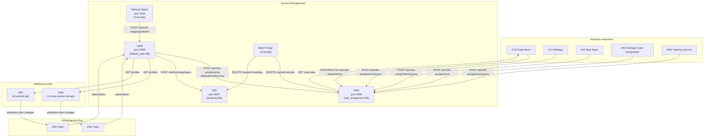
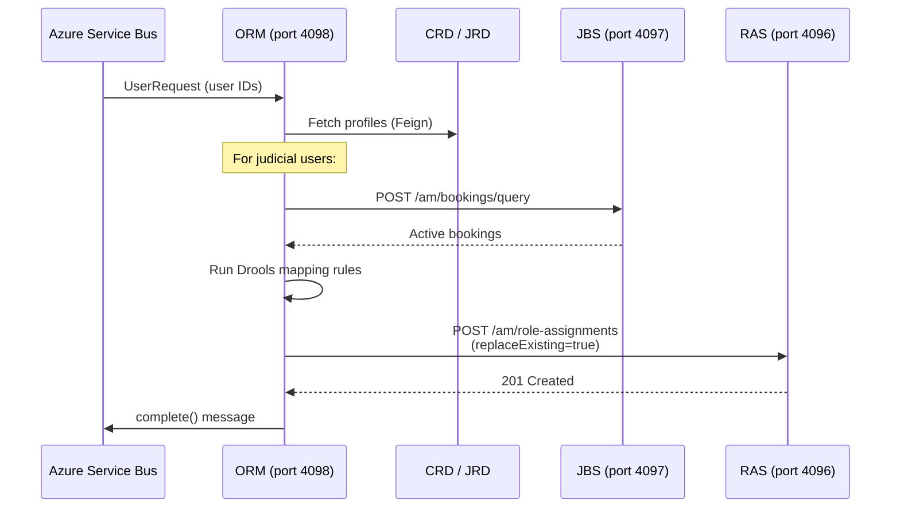

## TL;DR

- AM is the runtime role-assignment plane for CFT, composed of three services (RAS, ORM, JBS) plus two batch jobs.
- **RAS** (port 4096) is the canonical store — it validates, persists, queries, and deletes role assignments using Drools rules and PostgreSQL. Performance-tested for up to 2000 assignments per user and 30-40 queries/second from CCD.
- **ORM** (port 4098) provisions organisational roles by subscribing to Azure Service Bus topics for CRD/JRD change events, running Drools mapping rules, and calling RAS with `replaceExisting=true`.
- **JBS** (port 4097) stores judicial location bookings consumed by ORM during fee-paid judicial role mapping. The `bookable` role attribute controls which users see the booking UI in ExUI.
- Inbound consumers are CCD data store, XUI, WA, AAC, and HMC — all authenticated via S2S tokens. Validation rules are "allow" nature: each assignment must match at least one Drools rule to be accepted.
- Reference-data sources (CRD, JRD) push user-change events via ASB; ORM pulls full profiles via Feign on receipt.

## Component diagram



## Role Assignment Service (RAS)

RAS is the core API at the centre of the AM platform. Every role assignment — both organisational (staff/judicial) and case-level — is stored, validated, and queried through RAS.

### Responsibilities

- **Create** role assignments via `POST /am/role-assignments` with Drools-based validation (`CreateAssignmentController.java:44`).
- **Query** assignments via `POST /am/role-assignments/query` (v1 single-query, v2 multi-query differentiated by content-type header).
- **Delete** assignments by process+reference, by ID, or by bulk query.
- **Validate** every create request against embedded Drools rules, using a two-stage model: (1) service-trust rule approves (`CREATE_APPROVED`), (2) pattern-config validation promotes to `APPROVED` (`role-assignment-config-validation.drl:44`).

### Database

PostgreSQL with Flyway migrations (`spring.flyway.out-of-order: true` to accommodate mixed versioning schemes).

| Table | Purpose |
|-------|---------|
| `role_assignment` | Live assignments. JSONB `attributes` column with GIN index. |
| `role_assignment_history` | Full audit trail. PK is `(id, request_id, status)`. Includes `status_sequence` for ordering. |
| `role_assignment_request` | Request metadata (client, assigner, correlation ID, process, reference, replace_existing). |
| `flag_config` | Per-environment Drools feature flags. |
| `actor_cache_control` | ETag caching — incremented on every assignment change for an actor. Supports HTTP 304 responses via `If-None-Match` header. |

RAS does not support update operations. Records can only be created or deleted; the full history trail is maintained automatically in `role_assignment_history`.

### Role assignment state model

Assignments progress through a state machine:

```
CREATE_REQUESTED -> APPROVED -> LIVE
                 \-> REJECTED

LIVE -> DELETE_REQUESTED -> DELETE_APPROVED -> DELETED
                        \-> DELETE_REJECTED (remains LIVE)

LIVE -> EXPIRED (batch purge when end_time <= now)
```

### Data model enumerations

| Field | Values (source) |
|-------|-----------------|
| `RoleCategory` | `JUDICIAL`, `LEGAL_OPERATIONS`, `ADMIN`, `PROFESSIONAL`, `CITIZEN`, `SYSTEM`, `OTHER_GOV_DEPT`, `CTSC` |
| `GrantType` | `BASIC`, `SPECIFIC`, `STANDARD`, `CHALLENGED`, `EXCLUDED` |
| `Classification` | `PUBLIC`, `PRIVATE`, `RESTRICTED` (implements `isAtLeast()` comparison) |
| `RoleType` | `CASE`, `ORGANISATION` |
<!-- REVIEW: ActorIdType enum has two values: IDAM and CASEPARTY, not just IDAM. See am-role-assignment-service:src/main/java/.../enums/ActorIdType.java:3-4 -->
| `ActorIdType` | `IDAM` |

<!-- DIVERGENCE: Confluence HLD v1.3 lists RoleCategory as [judicial, legal-operations, admin, ctsc, professional, citizen] (6 values), but source RoleCategory.java has 8 values including SYSTEM and OTHER_GOV_DEPT. Source wins. -->

### Role assignment attributes

The `attributes` JSONB column stores key/value pairs that scope and qualify the assignment:

| Attribute | Description | Used for access control |
|-----------|-------------|------------------------|
| `caseId` | CCD case ID (case roles only) | Yes |
| `jurisdiction` | CCD jurisdiction code | Yes |
| `caseType` | CCD case type ID | Yes |
| `region` | LRD region ID | Yes |
| `baseLocation` | Court ePIMMS property ID | Yes |
| `primaryLocation` | User's primary location (same across all assignments for a user) | No |
| `contractType` | `SALARIED` or `FEEPAY` (judicial only) | No |
| `caseAccessGroupId` | Associates role assignment to multiple cases from CCD (group role assignment) | Yes |
| `bookable` | Boolean — if true on any current role, ExUI presents the booking UI on login | No |

<!-- CONFLUENCE-ONLY: The "bookable" attribute's role in ExUI login flow (from HLD - Judicial Booking Service - v1.2) is not verified in source for the ExUI side, though ORM DRL rules do set bookable=true for fee-paid judicial roles. -->

### Validation model

RAS builds a validation model before executing Drools rules. The model contains:

1. The `RoleAssignmentRequest` (the incoming request).
2. `RoleAssignmentHistory` objects for each requested role (already written to DB in CREATE_REQUESTED status).
3. Three collections of existing `RoleAssignment` records:
   - Current assignments for the **assignee(s)** (the actors being given roles).
   - Current assignments for the **authenticated user** (from IDAM token).
   - Current assignments for the **requestor/assigner** (from `assignerId` in the request body).

The four identity types used in validation:

| Identity | Source | Purpose |
|----------|--------|---------|
| Assigner ID | `roleRequest.assignerId` in body | The user approving the role assignment |
| Microservice ID | `serviceAuthorization` S2S token | The calling service |
| Authenticated User ID | `Authorization` Bearer token | The user account submitting the request |
| Assignee ID | `actorId` in each requested role | The user receiving the role |

### Role configuration (pattern validation)

After Drools rules approve an assignment, a final "safety net" check confirms the assignment matches at least one configured pattern for the role name. Patterns define mandatory fields and acceptable values per role. This is static configuration deployed with the service (in JSON files), loaded at startup.

### Performance characteristics

<!-- CONFLUENCE-ONLY: not verified in source -->
- Performance tested for up to **2000** role assignments per single user. Beyond this, performance may degrade.
- Target throughput: **30-40** `getAssignmentsByActorId` calls per second from CCD data store.
- GIN index on `attributes` JSONB column supports efficient containment queries.

### S2S authorised callers

The full list (`application.yaml:127`):

```
ccd_gw, am_role_assignment_service, am_org_role_mapping_service,
am_role_assignment_refresh_batch, xui_webapp, aac_manage_case_assignment,
ccd_data, wa_workflow_api, wa_task_management_api, wa_task_monitor,
wa_case_event_handler, iac, hmc_cft_hearing_service, ccd_case_disposer,
sscs, fis_hmc_api, fpl_case_service, disposer-idam-user, civil_service,
prl_cos_api
```

The S2S `clientId` is extracted and passed to Drools rules — a caller not in this list is rejected at the filter layer; a caller in this list but without matching Drools rules will have assignments rejected as unapproved (`reject-unapproved-role-assignments.drl:11`).

### Environment-specific Drools bypass

<!-- REVIEW: BYPASS_ORG_DROOL_RULE defaults to false in application.yaml:181 (${BYPASS_ORG_DROOL_RULE:false}), not true. It is overridden to true in values.aat.template.yaml:12 and values.preview.template.yaml:33. The base values.yaml:48 also sets it to false. -->
RAS uses a `BYPASS_ORG_DROOL_RULE` environment variable (default `true` in `application.yaml`, set to `false` in production via Helm `values.prod.template.yaml`). In lower environments (Preview, AAT, ITHC, Demo), this allows other services to create organisational role assignments directly without matching ORM-specific Drools rules. In production, only `am_org_role_mapping_service` can create organisational roles.

### Query API

RAS exposes two query mechanisms:

- `GET /am/role-assignments/actors/{actorId}` — retrieves all current (non-expired) role assignments for an actor. Supports **ETag-based caching**: the response includes a weak ETag header; if the client sends `If-None-Match` with a matching ETag, RAS returns HTTP 304 with no body.
- `POST /am/role-assignments/query` — multi-clause query. Each clause contains AND-ed criteria; multiple clauses are OR-ed. Supports filtering by `actorId`, `roleType`, `roleName`, `roleCategory`, `classification`, `grantType`, `authorisations`, `validAt`, `hasAttributes`, `readOnly`, and arbitrary `attributes` key/value pairs. Results support sorting (by `begin`/`end` or any attribute) and pagination.

The v2 multi-query variant is differentiated by content-type header.

### Outbound dependency

RAS calls CCD data store via Feign (`feign.client.config.datastoreclient.url`, default `http://localhost:4452`) to lazily load case data during case-role validation. Case data is Caffeine-cached with 120-second TTL, max 500 entries (`application.yaml:113-117`).

## Org Role Mapping Service (ORM)

ORM is the provisioning engine for organisational roles. It does not store role assignments itself — it computes them and delegates persistence to RAS.

### Trigger: Azure Service Bus

ORM subscribes to two ASB topics:

| Property | Env var | Default |
|----------|---------|---------|
| `amqp.crd.topic` | `CRD_TOPIC_NAME` | — |
| `amqp.crd.subscription` | `CRD_SUBSCRIPTION_NAME` | — |
| `amqp.jrd.topic` | `JRD_TOPIC_NAME` | — |
| `amqp.jrd.subscription` | `JRD_SUBSCRIPTION_NAME` | — |
| `amqp.host` | `AMQP_HOST` | — |

Messages arrive as `UserRequest` (list of user IDs). Receive mode is `PEEK_LOCK` with manual completion via `disableAutoComplete()` + explicit `completeAsync()` (`CRDMessagingConfiguration.java:82-86`). Retry policy: 10 max retries, 1-minute delay, FIXED mode (`CRDMessagingConfiguration.java:69-71`).

<!-- DIVERGENCE: Confluence LLD-ORM says "maximum of 4 delivery attempts" with "5 minute delay", but source CRDMessagingConfiguration.java:69-71 shows maxRetries=10, delay=Duration.ofMinutes(1), mode=FIXED. Source wins. -->

If after all retry attempts the message has not been processed, it moves to the dead letter queue. Manual recovery is required (the team must be alerted to messages on the dead letter queue).

### Mapping flow



1. Deserialize ASB message as `UserRequest` (`TopicConsumer.java:63`).
2. Fetch user profiles from CRD or JRD via Feign (with `@Retryable`, 3 attempts, 500ms backoff x3).
3. For judicial users, fetch active bookings from JBS (`POST /am/bookings/query`).
4. Flatten profiles: CRD produces one `CaseWorkerAccessProfile` per role x workArea; JRD produces one `JudicialAccessProfile` per appointment x serviceCode (`AssignmentRequestBuilder.java:126-218`).
5. Execute Drools `StatelessKieSession` with profiles + feature flags + bookings as facts (`RequestMappingService.java:186-214`).
6. Call RAS with `replaceExisting=true`, `process="staff-organisational-role-mapping"` or `"judicial-organisational-role-mapping"`, `reference=userId` (`RequestMappingService.java:292-305`).

### Drools rule organisation

Per-jurisdiction packages in `kmodule.xml`: `iac`, `sscs`, `civil`, `privatelaw`, `publiclaw`, `employment`, `stcic`, `hrs`, `probate`, plus `core`.

Judicial mapping uses two stages:
- **Stage 1** (`*-judicial-office-holder-mapping.drl`): `JudicialAccessProfile` + `FeatureFlag` -> inserts `JudicialOfficeHolder`.
- **Stage 2** (`*-judicial-org-role-mapping.drl`): `JudicialOfficeHolder` + optional `JudicialBooking` -> inserts `RoleAssignment`.

Fee-paid judicial roles require a matching `JudicialBooking` fact (providing `locationId`/`regionId`). Salaried roles do not.

Staff mapping uses a simpler single stage:
- `*-staff-org-role-mapping.drl`: `CaseWorkerAccessProfile` + `FeatureFlag` -> inserts `RoleAssignment`.

CRD staff profiles are flattened to one `CaseWorkerAccessProfile` per role x workArea combination. Only the primary location (`isPrimary=true`) is used for `primaryLocation`. All roles and all service codes are processed (the `isPrimary` flag on roles is ignored for mapping purposes).

### Database

ORM has a small PostgreSQL database with:
- `refresh_jobs` — tracks async refresh job state (used by the refresh-batch service).
- `flag_config` — per-environment Drools feature flags (same pattern as RAS).

The `refresh_jobs` table schema:

| Column | Type | Description |
|--------|------|-------------|
| `job_id` | bigint (PK) | Unique job identifier |
| `role_category` | text | Scope: `JUDICIAL`, `LEGAL_OPERATIONS`, etc. |
| `jurisdiction` | text | Scope: specific jurisdiction code or `ALL` |
<!-- REVIEW: The status value is 'COMPLETED' not 'COMPLETE'. See am-org-role-mapping-service:src/main/java/.../apihelper/Constants.java:49 which defines COMPLETED = "COMPLETED". -->
| `status` | text | `NEW`, `COMPLETE`, or `ABORTED` |
| `user_id` | text[] | Failed user IDs for retry in next iteration |
| `comments` | text | Rule change details |
| `created` | timestamp | Job creation time |
| `log` | text | Error messages on abort |
| `linked_job_id` | bigint | Links retry job to original failed job |

The refresh batch picks up records with `status=NEW`, calls ORM's refresh endpoint, and on completion ORM updates the status to `COMPLETE`. On partial failure, ORM sets status to `ABORTED` and stores failed user IDs for retry via a new linked job.

### ORM role assignment request mapping

When ORM calls RAS, it constructs requests with these conventions:

| Field | Value |
|-------|-------|
| `clientId` | `am-org-role-mapping-service` |
| `process` | `staff-organisational-role-mapping` (CRD) or `judicial-organisational-role-mapping` (JRD) |
| `reference` | IDAM user ID |
| `replaceExisting` | Always `true` |
| `roleType` | Always `ORGANISATION` |
| `grantType` | Always `STANDARD` |
| `actorIdType` | `IDAM` |

An empty `requestedRoles` list with `replaceExisting=true` effectively deletes all existing organisational assignments for that user (e.g. when a staff member is flagged as deleted in CRD).

### Refresh endpoint

`POST /am/role-mapping/refresh?jobId={id}` returns HTTP 202 immediately; processing runs `@Async`. Called by `am-role-assignment-refresh-batch` (authorised callers: `am_org_role_mapping_service`, `am_role_assignment_refresh_batch` — `application.yaml:172`).

## Judicial Booking Service (JBS)

JBS is a small synchronous REST service with a single responsibility: store and query time-bounded judicial location bookings.

### Endpoints

| Method | Path | Purpose | Response |
|--------|------|---------|----------|
| POST | `/am/bookings` | Create a booking | 201 |
| POST | `/am/bookings/query` | Query by user IDs | 200 |
| DELETE | `/am/bookings/{userId}` | Delete all bookings for user (hidden from Swagger) | 204 |

### Database

Single table `booking` (Flyway `V1_1__init_tables.sql`):

| Column | Type | Notes |
|--------|------|-------|
| `id` | UUID (PK) | — |
| `user_id` | text | IDAM user ID |
| `location_id` | text (nullable) | HMCTS location code (EPIMS ID) |
| `region_id` | text (nullable) | HMCTS region code (mandatory if `location_id` is set) |
| `begin_time` | timestamp | Midnight UTC of `beginDate` |
| `end_time` | timestamp | Midnight UTC of `endDate + 1 day` (inclusive end) |
| `created` | timestamp | — |

Queries filter `endTime > now()` so expired bookings are never returned (`BookingRepository.java:13`). "Current" bookings include future bookings that have not yet started.

### Booking date semantics

Bookings use an inclusive date range. The `end_time` stored is `last_day + 1` at midnight, so role assignments created from a booking ending on Thursday have their `endTime` set to Friday 00:00:00 UTC.

### Booking lifecycle and ExUI integration

<!-- CONFLUENCE-ONLY: not verified in source -->

The booking workflow from ExUI for a fee-paid judge:

1. **Create booking**: user enters location and dates. ExUI retrieves region from Location Reference Data, creates booking via JBS, then calls ORM to recalculate the user's organisational roles (which now include booking-derived roles). User is redirected to landing page.
2. **Continue with existing booking**: ExUI calls ORM to recalculate roles (handles case where prior role mapping failed), then redirects.
3. **Access My Work**: user goes directly to landing page without additional processing.

If ORM invocation fails after booking creation, the user can log out and back in, choose "Continue with existing booking", and ORM will be re-invoked.

### The `bookable` attribute

The `bookable` attribute (set to `"true"` in ORM Drools rules for fee-paid judicial roles) determines whether ExUI presents the booking UI on login. If any current role assignment for a user has `bookable=true`, that user sees the booking prompt. Services configure this per their fee-paid judicial population.

### Booking retention

<!-- CONFLUENCE-ONLY: not verified in source -->
Booking records are retained for 2 years after the end of the booking, then hard-deleted by a regular process. The booking table is immutable (no update/delete via API in initial scope) and serves as its own audit log.

### S2S authorised callers

`am_judicial_booking_service`, `am_org_role_mapping_service`, `xui_webapp` (`application.yaml:96`). ORM is in the `bypass-userid-validation-for-services` list, allowing it to query bookings for any user without JWT-subject matching.

## Batch services

### am-role-assignment-batch-service (purge)

A Spring Batch Kubernetes CronJob (no HTTP port). Deletes expired records from both the RAS `role_assignment` database and the JBS `booking` table. Runs daily.

### am-role-assignment-refresh-batch (port 5333)

A Spring Batch Kubernetes CronJob that triggers a full refresh of organisational role assignments by calling ORM's `/am/role-mapping/refresh` endpoint. Used after Drools rule changes or periodic reconciliation.

## Ports and protocols summary

| Service | Port | Protocol | Database |
|---------|------|----------|----------|
| RAS | 4096 | HTTP (REST) | PostgreSQL (`role_assignment`, `role_assignment_history`, etc.) |
| JBS | 4097 | HTTP (REST) | PostgreSQL (`booking`) |
| ORM | 4098 | HTTP (REST) + ASB subscriber | PostgreSQL (`refresh_jobs`, `flag_config`) |
| Refresh Batch | 5333 | HTTP (outbound only) | None (calls ORM) |
| Purge Batch | — | Direct DB | Connects to RAS + JBS databases |

## Data flow patterns

**Organisational role provisioning** (event-driven):
ASB topic -> ORM -> CRD/JRD (profiles) + JBS (bookings) -> Drools -> RAS (persist)

**Case-role assignment** (synchronous, consumer-initiated):
CCD/AAC/XUI -> RAS -> Drools validation (may lazy-load case data from CCD) -> persist

**Query** (synchronous):
XUI/WA/HMC -> RAS -> PostgreSQL (JPA Specifications with JSONB containment queries)

**Purge** (scheduled):
CronJob -> RAS DB (delete expired) + JBS DB (delete expired)

**Refresh** (scheduled):
CronJob -> ORM `/refresh` -> (same as organisational provisioning flow)

## Auditing and data retention

All requests and role assignment state transitions are audited in `role_assignment_request` and `role_assignment_history` tables. Since RAS does not support update operations (only create and delete), the history trail is inherently complete without separate audit logging.

The purge batch job handles data lifecycle:
- **Expiry**: daily deletion of `role_assignment` records where `end_time <= now`, with corresponding `EXPIRED` status history records.
- **Retention**: hard deletion of history records older than a configured threshold (aligned with case record lifetime).
- **JBS purge**: deletion of booking records past their retention period (2 years per HLD specification).

## Security model

RAS validation rules are "allow" in nature — each create or delete must match at least one rule. Rules can reference:
- The microservice ID (S2S client), assigner/assignee/authenticated user identities.
- The current role assignments of any of those users.
- Case data (loaded via CCD Feign client) for case-role validation.
- The properties of the requested role assignment itself.

This enables fine-grained trust models. For example, only `am_org_role_mapping_service` can create organisational judicial roles in production, while `iac_case_allocation` can only create tribunal-caseworker case roles for IAC Asylum cases where the assignee already holds the corresponding organisational role.

## See also

- [Overview](overview.md) — conceptual introduction to AM's role model, grant types, and platform position
- [Drools Rules](drools-rules.md) — how the embedded Drools engine validates assignments in RAS and maps profiles in ORM
- [Batch Jobs](batch-jobs.md) — operational detail on the purge and refresh CronJobs described in this page
- [RAS API Reference](../reference/api-role-assignment-service.md) — endpoint reference, request/response shapes, and enumerated values

## Glossary

| Term | Definition |
|------|-----------|
| RAS | Role Assignment Service — the core CRUD API for role assignments (port 4096) |
| ORM | Org Role Mapping Service — provisions organisational roles from reference data (port 4098) |
| JBS | Judicial Booking Service — stores judicial location bookings (port 4097) |
| CRD | Case Worker Reference Data — source of staff user profiles |
| JRD | Judicial Reference Data — source of judicial user profiles and appointments |
| ASB | Azure Service Bus — message broker carrying CRD/JRD change events |
| S2S | Service-to-service authentication via `service-auth-provider` tokens |
