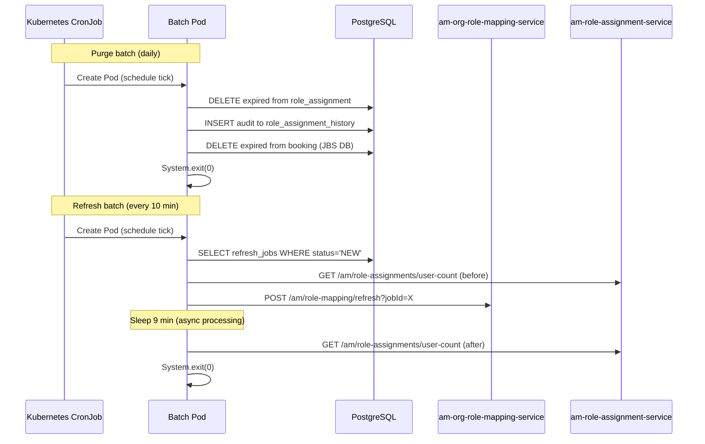

## TL;DR

- AM has two batch services deployed as Kubernetes CronJobs: one purges expired records, the other triggers organisational role refreshes via ORM.
- `am-role-assignment-batch-service` runs once daily and deletes expired rows from the Role Assignment Service (RAS) database and the Judicial Booking Service (JBS) database.
- `am-role-assignment-refresh-batch` runs every 10 minutes, reads pending refresh jobs from ORM's database, and calls ORM's refresh endpoint to re-evaluate organisational role assignments.
- Both are Spring Batch applications with `web-application-type: none` (or near-equivalent); they self-exit after completing their job.
- Neither exposes an HTTP API — scheduling is entirely Kubernetes-side, not JVM-side.
- Refresh jobs are triggered operationally by inserting rows into the `refresh_jobs` table (via the `REFRESH_JOB` env var in Flux) and enabling LaunchDarkly flags (`orm-refresh-role`, `orm-refresh-job-enable`) in production.

## The two batch services

| Service | Purpose | Schedule | Databases touched |
|---------|---------|----------|-------------------|
| `am-role-assignment-batch-service` | Purge expired role assignments and judicial bookings | Once daily per cluster | RAS (`role_assignment`) + JBS (`booking`) |
| `am-role-assignment-refresh-batch` | Trigger ORM to re-evaluate organisational roles | Every 10 minutes (`*/10 * * * *`) | ORM (`org_role_mapping` — reads `refresh_jobs`) |

## am-role-assignment-batch-service (purge)

### What it does

The purge batch runs a single Spring Batch `Job` containing two sequential steps:

1. **Step 1 — Delete expired role assignments (RAS)**
   - Selects all rows in `role_assignment` whose `end_time <= now()` that have a corresponding `role_assignment_history` row with `status = 'LIVE'` (`DeleteExpiredRecords.java:127-128`).
   - For each matching record: sets `status = "EXPIRED"`, increments `status_sequence`, writes an audit row to `role_assignment_history`, then deletes the live record from `role_assignment` (`DeleteExpiredRecords.java:66-77`).
   - Deletes are performed one-by-one in a loop; history inserts use `jdbcTemplate.batchUpdate` with batch size 4 (`DeleteExpiredRecords.java:110-124`).
   - A `DataAccessException` is caught and logged but does not fail the step — the step always returns `FINISHED`.

2. **Step 2 — Delete expired judicial bookings (JBS)**
   - Connects to a separate PostgreSQL database via a dedicated `judicialDataSource` bean (config prefix `spring.judicial.datasource`).
   - Deletes rows from the `booking` table where `end_time < (current_date - days) + '00:00:00'::time` (`DeleteJudicialExpiredRecords.java:107`).
   - The `days` parameter defaults to 730 (2 years) via `spring.judicial.days: ${DAYS:730}` (`application.yaml:45`). Only bookings that ended more than 2 years ago are purged.
   - Unlike the RAS step, there is no audit trail — records are hard-deleted permanently.
   - A negative `days` value throws `BadDayConfigForJudicialRecords`, causing the step to fail with `ExitStatus.FAILED` (`DeleteJudicialExpiredRecords.java:55-59`).

### Application lifecycle

The application starts, Spring Batch auto-launches the job (`spring.batch.job.enabled: true`), both steps execute sequentially (`.start().next()` at `BatchConfig.java:46-48`), and then the process calls `SpringApplication.exit` followed by `System.exit` (`RoleAssignmentBatchApplication.java:29-35`). A 5-second sleep before exit allows App Insights telemetry to flush. `RunIdIncrementer` ensures each CronJob invocation gets a fresh job execution ID.

### Email notifications

Both steps can send a summary email via SendGrid with counts of deleted records. However, `EMAIL_ENABLED: false` in production and AAT Helm values (`values.yaml:34`), so this is effectively dormant.

## am-role-assignment-refresh-batch (refresh)

### What it does

The refresh batch reads pending refresh-job records from ORM's `refresh_jobs` table (shared database — `org_role_mapping`) and calls ORM to re-evaluate organisational role assignments. This is used after Drools rule changes to bulk-refresh affected users.

The flow (orchestrated in `RefreshJobsOrchestrator.java:63`):

1. Query `refresh_jobs` for rows with `status = 'NEW'`, ordered by `created DESC`.
2. Call RAS `GET /am/role-assignments/user-count` for a "before" snapshot.
3. For each job:
   - If no `linkedJobId` (or `linkedJobId == 0`): call `POST /am/role-mapping/refresh?jobId=<id>` with an empty user list — triggers a full category/jurisdiction refresh.
   - If `linkedJobId` is present: fetch the linked job's `userIds` array and pass it to ORM — triggers a targeted per-user refresh.
   - Sleep `refresh-job-delay-duration` (default 60 seconds) between each job dispatch (`application.yaml:70`).
4. After all jobs dispatched, sleep `refresh-job-count-delay-duration` (default 540 seconds / 9 minutes) to allow ORM's async processing to complete (`RefreshJobsOrchestrator.java:91`).
5. Call RAS user-count again for an "after" snapshot and compare.
6. Optionally send a delta email via SendGrid (disabled by default).

### Auth model

Unlike the purge batch (which is pure JDBC with no outbound HTTP), the refresh batch authenticates to ORM and RAS using:

- **S2S token**: generated via `ServiceAuthTokenGenerator` using microservice name `am_role_assignment_refresh_batch` and a TOTP secret from Key Vault (`application.yaml:79`).
- **IDAM user token**: obtained via OAuth2 password grant for a dedicated admin user (`orm.admin@hmcts.NET`) on every Feign request — there is no token caching (`IdamRepository.java:31-44`).

Both headers (`ServiceAuthorization` and `Authorization`) are injected by `FeignClientInterceptor` (`FeignClientInterceptor.java:25-26`).

### How ORM processes the refresh request

When the batch calls `POST /am/role-mapping/refresh?jobId=<id>`, ORM:

1. Validates the S2S caller is in `refresh.Job.authorisedServices` (currently: `am_org_role_mapping_service`, `am_role_assignment_refresh_batch`).
2. Reads the `refresh_jobs` row to determine `role_category` and `jurisdiction`.
3. Calls CRD (for staff) or JRD (for judicial) to page through all users matching that category/jurisdiction. Page size is controlled by `refresh.Job.pageSize` (default 400, configurable via `REFRESH_JOB_PAGE_SIZE`).
4. For each page of users, runs Drools mapping rules and calls RAS `POST /am/role-assignments` with `replaceExisting: true`.
<!-- REVIEW: The status value is 'COMPLETED' not 'COMPLETE'. See am-org-role-mapping-service:src/main/java/.../apihelper/Constants.java:49 which defines COMPLETED = "COMPLETED". -->
5. On success: sets `status = 'COMPLETE'`. On partial failure: sets `status = 'ABORTED'` and stores failed user IDs.
6. Returns `202 ACCEPTED` immediately — the batch does not wait for completion.

The `refresh.Job.sortDirection` (default `ASC`) and `refresh.Job.sortColumn` config control paging order through reference data.

### Timing considerations

The CronJob fires every 10 minutes (`schedule: "*/10 * * * *"` in `values.yaml:7-8`). With the default 9-minute post-refresh delay plus 1-minute inter-job delay, a single-job run takes approximately 10 minutes — nearly the full scheduling interval. For multiple jobs, the total duration is `(N-1) * 60s + 540s`, which can exceed the CronJob period. DTSAM-319 documents timing analysis for this constraint.

## Kubernetes deployment pattern

Both batch services use the HMCTS shared `job` Helm chart (`oci://hmctsprod.azurecr.io/helm/job ~2.2.0`) with `kind: CronJob` declared in their `values.yaml`. Key characteristics:

- **No in-JVM scheduling**: there is no `@Scheduled` annotation or internal cron trigger. The Kubernetes CronJob controller creates a new Pod on each scheduled tick.
- **Run-to-completion**: each Pod starts the Spring Boot application, the batch job executes, then `System.exit` terminates the container. The Pod enters `Completed` state.
- **`RunIdIncrementer`**: ensures Spring Batch treats each CronJob invocation as a new execution, even when parameters are unchanged.
- **No HTTP port**: despite `applicationPort` appearing in Helm values (artefact of the shared chart template), neither service binds or serves on any port.
- **Secrets from Key Vault**: credentials are mounted via `spring.config.import: "optional:configtree:/mnt/secrets/am/"` and aliased in each chart's `values.yaml`.



## Error handling differences

The two services handle errors differently:

| Aspect | Purge batch (RAS step) | Purge batch (JBS step) | Refresh batch |
|--------|----------------------|----------------------|---------------|
| DB errors | Swallowed silently; step returns `FINISHED` | `BadDayConfigForJudicialRecords` propagates as `FAILED` | `@Retryable(maxAttempts=3)` on DB reads |
| Downstream HTTP errors | N/A (no HTTP calls) | N/A | Non-202 from ORM throws `UnprocessableEntityException` — batch step fails |
| Observability | `@WithSpan` on tasklet | `@WithSpan` on tasklet | `@WithSpan` on tasklet |

## The `refresh_jobs` table

The refresh batch reads from and ORM writes to the `refresh_jobs` table in the `org_role_mapping` database. The schema (from `V1.1__init_tables.sql`):

| Column | Type | Nullable | Description |
|--------|------|----------|-------------|
| `job_id` | `bigint` | No | Auto-generated from `JOB_ID_SEQ` sequence. |
| `role_category` | `text` | No | Scope of the refresh: `JUDICIAL`, `LEGAL_OPERATIONS`, `ADMIN`, `CTSC`, etc. |
| `jurisdiction` | `text` | No | Jurisdiction scope: `CIVIL`, `IA`, `PRIVATELAW`, `SSCS`, etc. |
| `status` | `text` | No | Lifecycle state: `NEW` (pending), `COMPLETE`, or `ABORTED`. |
| `user_ids` | `text[]` | Yes | Array of IDAM IDs for targeted refresh; empty/null for full jurisdiction refresh. |
| `comments` | `text` | Yes | Free-text description (e.g. "Triggered Manually For AM-2779"). |
| `log` | `text` | Yes | Error details captured on abort. |
| `linked_job_id` | `bigint` | Yes | Points to a previous job whose `user_ids` should be re-processed (retry mechanism). |
| `created` | `timestamp` | Yes | Creation timestamp. |

### Status transitions

ORM's refresh endpoint (`POST /am/role-mapping/refresh?jobId=<id>`) processes the job asynchronously and updates the status:

<!-- REVIEW: Status value should be 'COMPLETED' not 'COMPLETE'. See am-org-role-mapping-service:src/main/java/.../apihelper/Constants.java:49. -->
- **NEW -> COMPLETE**: all users processed successfully.
- **NEW -> ABORTED**: partial failure. Failed `user_ids` are stored; a new job with `linked_job_id` pointing to this one can be created for retry.

The refresh batch only picks up rows with `status = 'NEW'`. After all processing, operators verify no `NEW` rows remain.

## Operational procedure for refresh jobs

Refresh jobs are not created automatically — they are triggered operationally when Drools mapping rules change and existing role assignments need re-evaluation. The standard procedure (documented across multiple Confluence implementation plans) is:

1. **Pre-flight**: Query the `role_assignment` database for before-counts by jurisdiction/role.
2. **Insert refresh job(s)**: Either directly via SQL or via the `REFRESH_JOB` environment variable in ORM's Flux config. ORM parses this on startup via `RefreshJobConfigService`. The format is:
   ```
   REFRESH_JOB: <ROLE_CATEGORY>-<JURISDICTION>-<STATUS>-<LINKED_JOB_ID>[-<JOB_ID>]
   ```
   Multiple jobs are separated by `:`. The `-` is the field delimiter (4 or 5 parts). Examples:
   - `LEGAL_OPERATIONS-CIVIL-NEW-0` — full jurisdiction refresh (new job ID auto-assigned).
   - `LEGAL_OPERATIONS-CIVIL-NEW-0-42` — explicit job ID 42; skipped if already exists (unless `REFRESH_JOB_ALLOW_UPDATE=true`).
   - `LEGAL_OPERATIONS-CIVIL-ABORTED-0-42` — aborts job 42 (used for rollback).
3. **Enable LaunchDarkly flags** in production:
   - `orm-refresh-job-enable` — allows the batch job to be triggered via Flux
   - `orm-refresh-role` — enables ORM's refresh endpoint to process requests
4. **Schedule the batch** by setting the CronJob schedule in `cnp-flux-config >> apps >> am >> am-role-assignment-refresh-batch >> prod-00.yaml`. Times must be in UTC.
5. **Monitor**: Check `batch_step_execution` table in ORM DB, and/or App Insights for `jobId=` traces.
6. **Post-flight**: Compare after-counts, verify all `refresh_jobs` rows show `COMPLETE` or `ABORTED` (none `NEW`).
7. **Cleanup**: Disable LD flags, restore the original CronJob schedule.

Note: The `REFRESH_JOB` env var is processed by **ORM** (via `RefreshJobConfigService.processJobDetail`), not by the refresh batch. ORM inserts the row into `refresh_jobs` on pod startup. The refresh batch then picks up `NEW` rows independently on its next CronJob tick.

<!-- CONFLUENCE-ONLY: The full operational runbook (LD flag toggling per-release, verification SQL queries, Azure Portal monitoring steps) is documented only in Confluence implementation plans; not in source code comments or README. -->

## Feature flags relevant to batch operations

### LaunchDarkly flags (ORM service)

| Flag | Purpose | Prod default |
|------|---------|--------------|
| `orm-refresh-role` | Gates ORM's refresh endpoint processing | Off (toggled on per-refresh) |
| `orm-refresh-job-enable` | Gates whether refresh batch can trigger ORM | Off (toggled on per-refresh) |

### DB flags (`flag_config` table in ORM)

ORM uses per-jurisdiction DB flags (e.g. `civil_wa_1_0`, `iac_1_1`, `sscs_wa_1_0`) to control which Drools mapping rules are active. These must be enabled in the target environment before a refresh job runs, otherwise the Drools engine will not produce the expected role assignments.

The flags are managed via the `DB_FEATURE_FLAG_ENABLE` environment variable in ORM's Flux config, or directly in the `flag_config` table.

### RAS DB flags (role assignment validation)

| Flag | Purpose | Prod |
|------|---------|------|
| `disposer_1_0` | Enables CCD case disposer to delete case role assignments via RAS | Enabled |
| `ccd_bypass_1_0` | Bypasses Drools validation for test jurisdictions | Off (by design) |
| `wa_bypass_1_0` | Bypasses Drools validation for WA test jurisdictions | Off (by design) |

<!-- CONFLUENCE-ONLY: The full list of per-jurisdiction DB flags and their prod status is maintained in the "AM applications feature flags" Confluence page (id: 1593576197). -->

## Data retention policy

The RAS LLD states the retention policy: AM records should be held as long as the equivalent case records to which they relate — i.e. for the lifetime of the case records and/or user (actorId), whichever comes first. The daily purge batch enforces the `end_time`-based expiry; the disposer service (`ccd_case_disposer`) handles case-lifecycle deletion when a case is disposed.

<!-- CONFLUENCE-ONLY: The "lifetime of the case records and/or user" retention policy is stated in the RAS LLD Confluence page but not codified in source beyond the end_time check. -->

## Database ownership

- The **purge batch** connects to two databases it does not own: the RAS database (`role_assignment` / `role_assignment_history` tables) and the JBS database (`booking` table). It uses raw `JdbcTemplate` — no JPA, no Flyway.
- The **refresh batch** connects to ORM's database (`org_role_mapping`) to read the `refresh_jobs` table. Spring Batch metadata tables (`BATCH_JOB_INSTANCE`, etc.) are also created in this shared database (`spring.batch.jdbc.initialize-schema: always`). This is a notable architectural coupling.

## Examples

### Purge batch: Spring Batch Job configuration (real source)

The two steps are chained — RAS expiry deletion runs first, then JBS booking deletion.

```java
// Source: apps/am/am-role-assignment-batch-service/src/main/java/uk/gov/hmcts/reform/roleassignmentbatch/config/BatchConfig.java
@Bean
public Job runRoutesJob(JobRepository jobRepository,
                        @Autowired DeleteExpiredRecords deleteExpiredRecords,
                        @Autowired DeleteJudicialExpiredRecords deleteJudicialExpiredRecords,
                        PlatformTransactionManager transactionManager) {
    return new JobBuilder(jobName, jobRepository)
            .incrementer(new RunIdIncrementer())
            .start(stepOrchestration(jobRepository, deleteExpiredRecords, transactionManager))
            .next(stepDeleteJudicialExpired(jobRepository, deleteJudicialExpiredRecords, transactionManager))
            .build();
}
```

`RunIdIncrementer` ensures each CronJob tick generates a unique `JobInstance` — without it Spring Batch would skip re-running a job with identical parameters.

### Purge batch: JBS booking deletion SQL (real source)

```java
// Source: apps/am/am-role-assignment-batch-service/src/main/java/uk/gov/hmcts/reform/roleassignmentbatch/task/DeleteJudicialExpiredRecords.java
public int deleteJudicialBookingRecords(int days) {
    Object[] params = {days};
    int[] types = {Types.INTEGER};
    String deleteSql = "DELETE from booking b where b.end_time < (current_date - ? ) + '00:00:00'::time";
    return jdbcTemplate.update(deleteSql, params, types);
}
```

The `days` parameter defaults to 730 (2 years), configurable via `spring.judicial.days: ${DAYS:730}`. Bookings older than `current_date - days` at midnight are hard-deleted permanently (no audit row written).

### Refresh batch: orchestrator main loop (real source)

```java
// Source: apps/am/am-role-assignment-refresh-batch/src/main/java/uk/gov/hmcts/reform/roleassignmentrefresh/domain/service/process/RefreshJobsOrchestrator.java
public void processRefreshJobs() {
    List<RefreshJobEntity> jobs = persistenceService.getNewJobs();

    if (jobs.isEmpty()) {
        log.info("No NEW refresh jobs found to execute");
        triggerRASUserCount();
    } else {
        log.info("Calling RAS User Count Before Refresh");
        final ResponseEntity<CountResponse> responseEntityBeforeRefresh = triggerRASUserCount();

        for (RefreshJobEntity job : jobs) {
            runRefreshJob(job);
            // refresh job is an async call, delay to keep the rd calls apart
            if (refreshJobDelayDuration > 0) {
                refreshJobDelay(refreshJobDelayDuration);
            }
        }

        // delay here to ensure the refresh is completed before the count is calculated
        refreshJobDelay(refreshJobCountDelayDuration);

        log.info("Calling RAS User Count After Refresh");
        final ResponseEntity<CountResponse> responseEntityAfterRefresh = triggerRASUserCount();
        // ... sends a delta email comparing before/after counts per jurisdiction
    }
}
```

The refresh batch always calls `GET /am/role-assignments/user-count` (before and after) so an email can be sent comparing per-jurisdiction role counts. If no `NEW` jobs exist, only the post-count call fires.

## See also

- [Org Role Mapping Flow](org-role-mapping-flow.md) — the ORM service that the refresh batch triggers, and how `refresh_jobs` records are created and consumed
- [Architecture](architecture.md) — component overview showing where the two batch CronJobs fit in the AM platform
- [Role Assignment Lifecycle](role-assignment-lifecycle.md) — the `EXPIRED` status and purge semantics for the records the purge batch cleans up
- [Drools Rules](drools-rules.md) — explains why role refreshes are needed when mapping rules change
