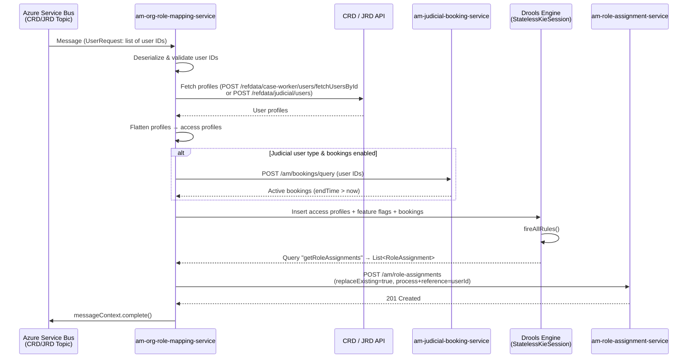
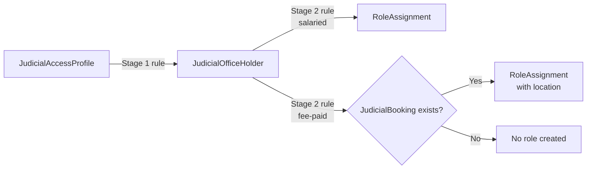

## TL;DR

- ORM (am-org-role-mapping-service) provisions organisational role assignments by translating user profiles from CRD/JRD into role assignments in RAS.
- The primary trigger is an Azure Service Bus message containing user IDs, published by CRD or JRD when a user profile changes.
- ORM fetches the full profile from CRD/JRD, flattens it into access profiles, runs jurisdiction-specific Drools rules, and POSTs the resulting role assignments to RAS with `replaceExisting=true`.
- Judicial fee-paid roles additionally require a `JudicialBooking` fact (from JBS) to be present in the Drools session — this provides `locationId`/`regionId` for location-scoped assignments.
- The Drools session is stateless: every execution inserts profiles, feature flags, and bookings fresh — nothing persists between evaluations.
- Fee-paid judiciary roles include a `bookable` attribute that signals ExUI to present the booking UI on login — this is how the self-serve booking workflow is triggered.

## End-to-end sequence



## Step 1: ASB message arrival

ORM subscribes to two Azure Service Bus topics — one for CRD and one for JRD. Each subscription is guarded by a separate feature toggle (`amqp.crd.enabled` / `amqp.jrd.enabled`, both driven by the `AMQP_ENABLED` env var).

- `CRDTopicConsumerNew` starts a `ServiceBusProcessorClient` via `CRDMessagingConfiguration` — `CRDTopicConsumerNew.java:29-40`.
- `JRDTopicConsumerNew` does the same for JRD — `JRDTopicConsumerNew.java:29-40`.
- Both delegate to `TopicConsumer.processMessage(messageContext, userType)` — `TopicConsumer.java:60-80`.

The message body is a `UserRequest` — essentially a JSON list of IDAM user IDs whose profiles changed. The receive mode is `PEEK_LOCK` with `disableAutoComplete()`, so acknowledgement only happens after successful processing (`messageContext.complete()` at `TopicConsumer.java:79`).

Retry is configured as 10 max retries, 1-minute fixed delay (`AmqpRetryMode.FIXED`) — `CRDMessagingConfiguration.java:68-72`.

<!-- DIVERGENCE: Confluence LLD (page 1411088955) says "4 delivery attempts, 5 minute delay between attempts, then dead letter queue", but CRDMessagingConfiguration.java:69-70 shows maxRetries=10, delay=1 minute, mode=FIXED. Source wins. -->

Error handling in `TopicConsumer.processError` distinguishes between unrecoverable errors (entity disabled/not found, unauthorized — logged as error), message lock lost, and service-busy (1-second back-off sleep) — `TopicConsumer.java:32-58`.

## Step 2: profile retrieval and flattening

`BulkAssignmentOrchestrator.createBulkAssignmentsRequest` drives the remaining flow (`BulkAssignmentOrchestrator.java:59-102`):

1. Validates the user ID list.
2. Calls `RetrieveDataService.retrieveProfiles(userRequest, userType)`, which invokes the appropriate Feign client.

**CRD path** — `POST /refdata/case-worker/users/fetchUsersById` returns `CaseWorkerProfile` objects. `AssignmentRequestBuilder.convertUserProfileToCaseworkerAccessProfile` creates one `CaseWorkerAccessProfile` per `role x workArea` (Cartesian product) — `AssignmentRequestBuilder.java:126-167`.

Key CRD mapping rules:
- Only the **primary** base location (`isPrimary=true`) is extracted as `primaryLocation` for the role assignment.
- **All** roles for a user are considered (the `isPrimary` flag on roles is ignored for mapping purposes).
- **All** work areas / service codes are considered when applying mapping rules.

**JRD path** — `POST /refdata/judicial/users` (with `page_size = sidamIds.size() * 5` to accommodate multiple appointments) returns `JudicialProfileV2` objects. `AssignmentRequestBuilder.convertProfileToJudicialAccessProfileV2` creates one `JudicialAccessProfile` per `appointment x serviceCode` — `AssignmentRequestBuilder.java:169-218`.

Both Feign clients use `@Retryable(maxAttempts=3, backoff=@Backoff(delay=500, multiplier=3))`.

## Step 3: Judicial Booking Service interaction

For judicial users, ORM optionally fetches active bookings from JBS. This is controlled by `refresh.BulkAssignment.includeJudicialBookings` (default depends on path):

- **ASB path**: controlled by the property above.
- **Judicial refresh endpoint** (`/am/role-mapping/judicial/refresh`): always fetches bookings — `JudicialRefreshOrchestrator.java:43-61`.

ORM calls `POST /am/bookings/query` with a `JudicialBookingRequest { queryRequest: { userIds: [...] } }` — `JBSFeignClient.java:21-22`.

JBS returns only non-expired bookings (`endTime > now()`) — `PersistenceService.java:27-29`. Each `JudicialBooking` carries `userId`, `locationId`, `regionId`, `beginTime`, and `endTime`.

If JBS is unavailable, the Feign fallback returns an empty list, and role mapping proceeds without location context — fee-paid roles will simply not be created.

## Step 4: Drools rule evaluation

`RequestMappingService.getRoleAssignments` executes the mapping rules — `RequestMappingService.java:186-214`:

1. Collects all access profile objects into a flat set.
2. Builds a Drools batch command that inserts: access profiles, `List<FeatureFlag>` (from the `flag_config` DB table), and `List<JudicialBooking>`.
3. Calls `kieSession.execute(commands)` — the session is `StatelessKieSession`, so every execution starts from scratch (`DroolConfig.java:22-25`).
4. After `fireAllRules()`, runs the query `getRoleAssignments` to extract all `RoleAssignment` facts from working memory.
5. Deduplicates the resulting list.

### Caseworker mapping (single-stage)

Rules directly match `CaseWorkerAccessProfile` (checking `roleId`, `serviceCode`, `!suspended`, plus optional `taskSupervisorFlag` / `caseAllocatorFlag`) and insert a `RoleAssignment`. Example: `v1_4_civil_senior_tribunal_caseworker_org_role` — `civil-caseworker-mapping.drl:22-45`.

### Judicial mapping (two-stage)

**Stage 1** (`{jur}-judicial-office-holder-mapping.drl`): Rules match `JudicialAccessProfile` (from JRD) + `FeatureFlag` and insert a `JudicialOfficeHolder` intermediate fact with an `office` string (e.g. `"CIVIL Circuit Judge-Salaried"`). Example: `civil_circuit_judge_salaried_joh` — `civil-judicial-office-holder-mapping.drl:31-53`.

**Stage 2** (`{jur}-judicial-org-role-mapping.drl`): Rules match `JudicialOfficeHolder.office` and insert a final `RoleAssignment`.

- **Salaried roles** do not require a booking — they fire based on the office-holder fact alone.
- **Fee-paid roles** additionally require `$bk: JudicialBooking(userId == $joh.userId)` to be present. The booking provides `locationId` and `regionId` for the role assignment attributes — `civil-judicial-org-role-mapping.drl:100-135`.



### Feature flag guards

Every rule begins with `$f: FeatureFlag(status && flagName == FeatureFlagEnum.XYZ.getValue())`. Flags are stored in the `flag_config` Postgres table and cached in a `ConcurrentHashMap` on startup. In production the cache is used; in other environments flags are re-read per execution — `RequestMappingService.java:221-239`.

### Suspended and soft-deleted users

- If `CaseWorkerAccessProfile.suspended = true`, rules do not fire (the `!suspended` constraint blocks them). The empty result set is still sent to RAS, which deletes the user's existing assignments — `RequestMappingService.java:130-142`.
- JRD users with `deletedFlag=true` are similarly given an empty set when `refresh.judicial.filterSoftDeletedUsers=true` — `RetrieveDataService.java:206-214`.

## Step 5: RAS persistence

`RequestMappingService.updateRoleAssignments` sends `POST /am/role-assignments` with:

- `requestType = CREATE`
- `replaceExisting = true`
- `process = "staff-organisational-role-mapping"` (or `"judicial-organisational-role-mapping"`)
- `reference = userId`

RAS atomically replaces all existing role assignments for that `process + reference` pair — `RequestMappingService.java:292-305`. This means ORM never appends; it always provides the full current set.

HTTP 201 = success. Any other status is counted as a failure.

### Role assignment request structure

The complete `AssignmentRequest` sent to RAS includes — `RequestMappingService.java:293-306`:

| Field | Value |
|-------|-------|
| `request.requestType` | `CREATE` |
| `request.replaceExisting` | `true` |
| `request.process` | `staff-organisational-role-mapping` or `judicial-organisational-role-mapping` |
| `request.reference` | User's IDAM ID |
| `request.assignerId` | System account UUID (from `securityUtils.getUserId()`) |
| `request.clientId` | `am-org-role-mapping-service` |
| `request.correlationId` | Random UUID per request |

Each `RoleAssignment` in `requestedRoles` carries:

| Attribute | Staff | Judicial |
|-----------|-------|----------|
| `actorIdType` | IDAM | IDAM |
| `roleType` | ORGANISATION | ORGANISATION |
| `grantType` | STANDARD | STANDARD |
| `classification` | Per mapping rule | Per mapping rule |
| `roleCategory` | Per mapping rule (e.g. `LEGAL_OPERATIONS`, `ADMIN`) | Per mapping rule (e.g. `JUDICIAL`) |
| `beginTime` | null | Appointment start date |
| `endTime` | null | Appointment end date |
| `attributes.jurisdiction` | Service code from work area | From authorisations |
| `attributes.primaryLocation` | ePIMMS ID (primary base location) | ePIMMS ID |
| `attributes.region` | Not set | From appointment or booking |
| `attributes.contractType` | Not set | SALARIED or FEEPAID |
| `authorisations` | Not set | Comma-separated authorisation IDs from JRD |

<!-- CONFLUENCE-ONLY: The exact set of attributes populated (region, location, contractType, authorisations) for judicial roles comes from the LLD Confluence page and Judicial Booking Mapping Rules page. The Drools rules define specific attribute combinations per jurisdiction. not verified in source -->

### Attribute matching semantics

When RAS/CCD evaluates role assignments against case data, **all** attributes set on a role assignment must match the case data for that role to grant access. If an attribute is irrelevant to a role (e.g. a senior judicial position has regional, not location-specific, responsibility), it should **not** be set — setting it would incorrectly restrict access to a single court.

<!-- CONFLUENCE-ONLY: This attribute matching rule is from the Judicial Booking Mapping Rules Confluence page and represents the business rule that governs how services should configure their Drools mapping rules. not verified in source -->

## Multi-region cloning

Some jurisdictions (civil, publiclaw, sscs) require one role assignment per region (England/Wales regions 1-7). Rules call `cloneNewRoleAssignmentAndChangeRegion(ra, regionId)` to produce multiple assignments from a single match — `civil-judicial-org-role-mapping.drl:283-292`.

## The `bookable` attribute and ExUI booking UI

Fee-paid judicial role assignments include a `bookable` attribute set to `"true"` in certain Drools rules (verified in `civil-judicial-org-role-mapping.drl:723`, `sscs-judicial-org-role-mapping.drl:474`, `publiclaw-judicial-org-role-mapping.drl:325`, `privatelaw-judicial-org-role-mapping.drl:321`, among others).

**How it works:**

1. If a user has **any** current role assignment with `bookable=true` in its attributes, ExUI presents the judicial booking UI on login.
2. The judge can then: create a new booking (entering location + dates), continue with an existing booking, or skip directly to "My Work".
3. When a booking is created or continued, ExUI calls ORM's `POST /am/role-mapping/judicial/refresh` endpoint, which recalculates all organisational roles for that judge incorporating the new/existing bookings.

**Booking data model** (from `am-judicial-booking-service`):

| Field | Description |
|-------|-------------|
| `id` | Unique booking ID |
| `user_id` | IDAM ID |
| `region_id` | Location reference data region ID |
| `location_id` | ePIMMS ID |
| `first_day` | First day of booking (inclusive) |
| `last_day` | Last day of booking (inclusive) |

**Date conversion**: Role assignment `beginTime` = `first_day 00:00:00`, `endTime` = `last_day + 1 day, 00:00:00` (half-open interval).

<!-- CONFLUENCE-ONLY: The ExUI booking UI flow (create/continue/skip), error management (retry on ORM failure), and the requirement that bookings are retained for 2 years come from the Judicial Booking Service HLD v1.2 Confluence page. not verified in source -->

## Batch refresh path

Beyond the ASB-driven path, `am-role-assignment-refresh-batch` triggers a full re-evaluation. This is needed when Drools rules change — it re-applies the new rules to all existing users for a jurisdiction. The process involves three components:

### 1. Refresh batch job (`am-role-assignment-refresh-batch`)

A Spring Batch Kubernetes CronJob — `RefreshJobsOrchestrator.java`:

1. Queries the ORM database for `refresh_jobs` records with `status = 'NEW'`.
2. For each job, calls ORM `POST /am/role-mapping/refresh?jobId={id}` (with optional `UserRequest` body if retrying specific users via `linked_job_id`).
3. Expects HTTP 202 from ORM (async processing).
4. Delays between jobs (configurable via `refresh-job-delay-duration`) to avoid overwhelming reference data APIs.
5. After all jobs complete, calls RAS user-count API (before and after) and sends a **comparison email** showing per-jurisdiction, per-role count differences.

Only `am_org_role_mapping_service` and `am_role_assignment_refresh_batch` are authorised S2S callers of the refresh endpoint — `application.yaml:172`.

### 2. ORM refresh endpoint (`POST /am/role-mapping/refresh`)

`RefreshOrchestrator.java` — processes asynchronously via `@Async`:

1. Validates the `jobId` and checks `refresh_jobs.status == 'NEW'`.
2. If `UserRequest` body contains user IDs: fetches profiles for those specific users.
3. If no user IDs: paginates through CRD via `GET /refdata/internal/staff/usersByServiceName` (page size configurable via `REFRESH_JOB_PAGE_SIZE`, default 400).
4. For judicial refreshes with `includeJudicialBookings=true`: fetches bookings in batches.
5. Applies Drools rules and POSTs results to RAS for each user.
6. On completion: updates `refresh_jobs.status` to `COMPLETED` (all success) or `ABORTED` (partial failure, storing failed user IDs in `user_ids` column).

### 3. The `refresh_jobs` table

| Column | Type | Description |
|--------|------|-------------|
| `job_id` | Bigint (PK, auto-seq) | Unique job identifier |
| `role_category` | Text | `JUDICIAL` or `LEGAL_OPERATIONS` |
| `jurisdiction` | Text | e.g. `IA`, `CIVIL`, `SSCS`, or `ALL` |
| `status` | Text | `NEW`, `COMPLETED`, or `ABORTED` |
| `user_ids` | Text[] | Failed user IDs (for retry) |
| `comments` | Text | Rule change details |
| `log` | Text | Error messages |
| `linked_job_id` | Bigint | Previous failed job to retry |
| `created` | Timestamp | Job creation/update time |

Jobs are created manually (typically by inserting a row with `status=NEW`) ahead of a scheduled batch run. The `linked_job_id` mechanism allows automatic retry of failed users: the batch job creates a new entry pointing at the failed job and copies its `user_ids`.

### 4. Judicial refresh endpoint (`POST /am/role-mapping/judicial/refresh`)

This is **synchronous** (no `refresh_jobs` table involvement) and always fetches bookings — `JudicialRefreshOrchestrator.java:43-61`. It is called by ExUI when a judge creates or continues a booking, ensuring role assignments are immediately recalculated.

## Feature flag taxonomy

ORM uses two types of feature flags:

**DB flags** (stored in `flag_config` table, per-environment): follow the naming convention `{service}_{wa|hearing}_{major}_{minor}`. Examples:
- `civil_wa_1_0` through `civil_wa_2_5` — Civil work allocation roles, incrementally added
- `sscs_hearing_1_0` — SSCS hearing-specific roles
- `employment_wa_1_0` through `employment_wa_3_0` — Employment Tribunal
- `iac_jrd_1_0`, `iac_jrd_1_1` — IAC judicial reference data integration

Each flag version typically corresponds to a new set of Drools rules being enabled for that jurisdiction. Flags are toggled independently per environment (preview, demo, aat, perftest, ithc, prod).

**LaunchDarkly flags** (external service): used for infrastructure-level toggles:
- `orm-jrd-org-role` — toggles consumption of JRD judge user IDs from ASB
- `orm-refresh-role` — enables the org role refresh functionality
- `orm-refresh-job-enable` — enables refresh job execution
- `jbs-query-bookings-api-flag` — toggles JBS query bookings API
- `jbs-create-bookings-api-flag` — toggles JBS create bookings API

<!-- CONFLUENCE-ONLY: The complete flag inventory with per-environment status is maintained on the "AM applications feature flags" Confluence page (ID 1593576197). The naming convention and LD flag purposes above are derived from that page. not verified in source -->

## Key configuration

| Property | Env var | Default | Purpose |
|----------|---------|---------|---------|
| `amqp.crd.enabled` | `AMQP_ENABLED` | — | Enable CRD topic subscription |
| `amqp.jrd.enabled` | `AMQP_ENABLED` | — | Enable JRD topic subscription |
| `feign.client.config.crdclient.url` | `CASE_WORKER_REF_APP_URL` | `http://localhost:8095` | CRD API base URL |
| `feign.client.config.jrdClient.url` | `JUDICIAL_REF_APP_URL` | `http://localhost:8091` | JRD API base URL |
| `feign.client.config.jbsClient.url` | `JUDICIAL_BOOKING_APP_URL` | `http://localhost:4097` | JBS base URL |
| `feign.client.config.roleAssignmentApp.url` | `ROLE_ASSIGNMENT_APP_URL` | `http://localhost:4096` | RAS base URL |
| `refresh.BulkAssignment.includeJudicialBookings` | `REFRESH_BULK_ASSIGNMENT_INCLUDE_BOOKINGS` | `false` | Fetch bookings in ASB path |
| `refresh.Job.includeJudicialBookings` | `REFRESH_JOB_INCLUDE_BOOKINGS` | `false` | Fetch bookings in batch refresh |
| `refresh.Job.pageSize` | `REFRESH_JOB_PAGE_SIZE` | `400` | Pagination for batch refresh |
| `refresh.Job.sortDirection` | `REFRESH_JOB_SORT_DIR` | `ASC` | Sort direction for CRD pagination |
| `refresh.Job.sortColumn` | `REFRESH_JOB_SORT_COL` | (empty) | Sort column for CRD pagination |
| `refresh.Job.authorisedServices` | — | `am_org_role_mapping_service,am_role_assignment_refresh_batch` | S2S callers allowed to invoke refresh |
| `refresh.judicial.filterSoftDeletedUsers` | `REFRESH_JUDICIAL_FILTER_SOFT_DELETED_USERS` | `false` | Filter out soft-deleted JRD users |

## Examples

### Caseworker mapping rule — Civil senior tribunal caseworker (real source)

```drool
// Source: apps/am/am-org-role-mapping-service/src/main/resources/validationrules/civil/civil-caseworker-mapping.drl
rule "v1_4_civil_senior_tribunal_caseworker_org_role"
when
  $f:  FeatureFlag(status && flagName == FeatureFlagEnum.CIVIL_WA_1_4.getValue())
  $cap: CaseWorkerAccessProfile(roleId == "1", serviceCode in ("AAA6", "AAA7"), !suspended)
then
   Map<String,JsonNode> attribute = new HashMap<>();
   attribute.put("jurisdiction", JacksonUtils.convertObjectIntoJsonNode("CIVIL"));
   attribute.put("primaryLocation", JacksonUtils.convertObjectIntoJsonNode($cap.getPrimaryLocationId()));
   attribute.put("workTypes", JacksonUtils.convertObjectIntoJsonNode("decision_making_work,access_requests"));
  insert(
      RoleAssignment.builder()
      .actorIdType(ActorIdType.IDAM)
      .actorId($cap.getId())
      .roleCategory(RoleCategory.LEGAL_OPERATIONS)
      .roleType(RoleType.ORGANISATION)
      .roleName("senior-tribunal-caseworker")
      .grantType(GrantType.STANDARD)
      .classification(Classification.PUBLIC)
      .readOnly(false)
      .attributes(attribute)
      .authorisations($cap.getSkillCodes())
      .build());
      logMsg("Rule : v1_4_civil_senior_tribunal_caseworker_org_role");
end;
```

### Stage 1 judicial mapping — Civil circuit judge salaried (real source)

```drool
// Source: apps/am/am-org-role-mapping-service/src/main/resources/validationrules/civil/civil-judicial-office-holder-mapping.drl
rule "civil_circuit_judge_salaried_joh"
when
   $f:  FeatureFlag(status && flagName == FeatureFlagEnum.CIVIL_WA_1_0.getValue())
   $jap: JudicialAccessProfile(appointment == "Circuit Judge",
                               appointmentType in ("Salaried", "SPTW"),
                               (endTime == null || endTime.compareTo(ZonedDateTime.now()) >= 0),
                               (validateAuthorisation(authorisations, "AAA6") || validateAuthorisation(authorisations, "AAA7")))
then
  insert(
      JudicialOfficeHolder.builder()
      .userId($jap.getUserId())
      .office("CIVIL Circuit Judge-Salaried")
      .jurisdiction("CIVIL")
      .ticketCodes($jap.getTicketCodes())
      .beginTime($jap.getBeginTime())
      .endTime($jap.getEndTime())
      .regionId($jap.getRegionId())
      .baseLocationId($jap.getBaseLocationId())
      .primaryLocation($jap.getPrimaryLocationId())
      .contractType($jap.getAppointmentType())
      .build());
      logMsg("Rule : civil_circuit_judge_salaried_joh");
end;
```

### Stage 2 judicial mapping — Civil district judge salaried (real source)

```drool
// Source: apps/am/am-org-role-mapping-service/src/main/resources/validationrules/civil/civil-judicial-org-role-mapping.drl
rule "civil_district_judge_org_role"
when
  $f:  FeatureFlag(status && flagName == FeatureFlagEnum.CIVIL_WA_2_1.getValue())
  $joh: JudicialOfficeHolder(office == "CIVIL District Judge-Salaried")
then
   Map<String,JsonNode> attribute = new HashMap<>();
   attribute.put("contractType", JacksonUtils.convertObjectIntoJsonNode("Salaried"));
   attribute.put("jurisdiction", JacksonUtils.convertObjectIntoJsonNode("CIVIL"));
   attribute.put("primaryLocation", JacksonUtils.convertObjectIntoJsonNode($joh.getPrimaryLocation()));
   attribute.put("region", JacksonUtils.convertObjectIntoJsonNode($joh.getRegionId()));
   attribute.put("workTypes", JacksonUtils.convertObjectIntoJsonNode("decision_making_work,applications," +
                                                                     "multi_track_decision_making_work," +
                                                                     "intermediate_track_decision_making_work"));
  insert(
      RoleAssignment.builder()
      .actorIdType(ActorIdType.IDAM)
      .actorId($joh.getUserId())
      .roleCategory(RoleCategory.JUDICIAL)
      .roleType(RoleType.ORGANISATION)
      .roleName("district-judge")
      .grantType(GrantType.STANDARD)
      .classification(Classification.PUBLIC)
      .readOnly(false)
      .beginTime($joh.getBeginTime())
      .endTime($joh.getEndTime() !=null ? $joh.getEndTime().plusDays(1):null)
      .attributes(attribute)
      .authorisations($joh.getTicketCodes())
      .build());
      logMsg("Rule : civil_district_judge_org_role");
end;
```

### refresh_jobs table schema (real source)

The refresh batch reads from this table to find jobs to dispatch to ORM.

```sql
// Source: apps/am/am-org-role-mapping-service/src/main/resources/db/migration/V1.1__init_tables.sql
create table refresh_jobs(
    job_id bigint not null,
    role_category text not null,
    jurisdiction text not null,
    status text not null,
    comments text,
    user_ids _text NULL,
    log text,
    linked_job_id bigint,
    created timestamp,
    constraint refresh_jobs_pkey PRIMARY KEY (job_id)
);

create sequence JOB_ID_SEQ;
ALTER TABLE refresh_jobs ALTER COLUMN job_id
SET DEFAULT nextval('JOB_ID_SEQ');
```

## See also

- [Drools Rules](drools-rules.md) — detailed explanation of ORM mapping rule structure, fact types, and feature flag patterns
- [Judicial Booking](judicial-booking.md) — how JBS bookings interact with fee-paid judicial role mapping
- [Batch Jobs](batch-jobs.md) — the refresh batch CronJob that triggers ORM re-evaluation after rule changes
- [ORM API Reference](../reference/api-org-role-mapping.md) — endpoint reference for the refresh and judicial-refresh APIs
- [Write Drools Mapping Rules](../how-to/write-drools-mapping-rules.md) — how to add new jurisdiction mapping rules to ORM
