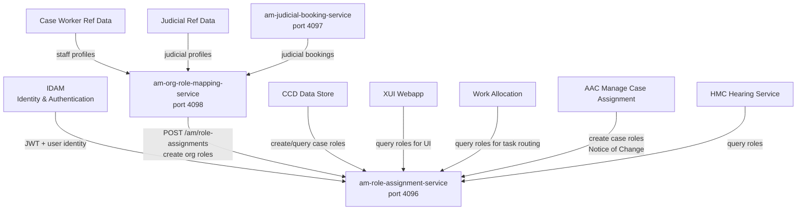

## TL;DR

- Access Management (AM) is the runtime role-assignment plane that determines "who holds which role, with which attributes, right now" across the CFT platform.
- Two role types: **ORGANISATION** roles (staff/judicial positions derived from Reference Data) and **CASE** roles (granted per-case for access control and task routing).
- AM sits between IDAM (identity/authentication) and the consumers: CCD uses it for case-level RBAC, Work Allocation uses it for task routing.
- The central service is `am-role-assignment-service` (RAS, port 4096) — it validates, persists, and queries role assignments using an embedded Drools rules engine plus JSON pattern validation.
- Organisational roles are provisioned by `am-org-role-mapping-service` (ORM), which reacts to staff/judicial profile changes from Reference Data via Azure Service Bus using a delete-and-recreate pattern.
- AM replaced the legacy IDAM-role-based access model in CCD; any `idam:`-prefixed entries in `RoleToAccessProfiles` are technical debt from the old model.

## What problem does AM solve?

IDAM tells you _who someone is_. AM tells you _what they can do_ in the context of case work. Before AM, access control in CCD was static — tied to user roles minted directly in IDAM. AM introduces a dynamic, time-bounded, attribute-rich assignment model that supports:

- Fine-grained case access (e.g. "this solicitor can see this specific case").
- Location and jurisdiction scoping for judicial and admin staff.
- Automatic provisioning when a user's staff profile changes.
- Specific, challenged, and excluded access patterns for edge cases.

## The role-assignment model

Every role assignment is a record with a defined lifecycle, stored in the `role_assignment` table in RAS's PostgreSQL database.

### Core dimensions

| Dimension | Values | Purpose |
|-----------|--------|---------|
| `actorIdType` | `IDAM`, `CASEPARTY` | Type of ID in `actorId` — typically IDAM user IDs, but extensible to case-party IDs (`ActorIdType.java:3`) |
| `actorId` | String (UUID) | Identifies the actor to whom the role is assigned |
| `roleType` | `CASE`, `ORGANISATION` | Whether the role is scoped to a single case or to the user's organisational position (`RoleType.java:3`) |
| `roleName` | String | The name of the role assigned (e.g. `judge`, `hearing-judge`, `case-allocator`) |
| `grantType` | `BASIC`, `SPECIFIC`, `STANDARD`, `CHALLENGED`, `EXCLUDED` | How the role was granted — each has different validation rules (`GrantType.java:3`) |
| `classification` | `PUBLIC`, `PRIVATE`, `RESTRICTED` | Security classification ceiling — ordered: RESTRICTED >= PRIVATE >= PUBLIC (`Classification.java:3-21`) |
| `roleCategory` | `JUDICIAL`, `LEGAL_OPERATIONS`, `ADMIN`, `PROFESSIONAL`, `CITIZEN`, `SYSTEM`, `OTHER_GOV_DEPT`, `CTSC` | The broad user category (`RoleCategory.java:3`) |
| `readOnly` | boolean | When `true`, the role does not grant write access to anything (`Assignment.java:40`) |
| `beginTime` / `endTime` | ZonedDateTime (nullable) | Time window — null `beginTime` means "now", null `endTime` means "forever". The interval is half-open: role applies if `begin <= now < end` |
| `authorisations` | List of String | Judicial authorisations held by the actor. All role assignments for a user carry the same set. Used in access-control matching (`Assignment.java:56`) |
| `notes` | JSONB | Structured notes (userId, dateTime, text) — e.g. justification for challenged/specific access requests. Stored in history record, not the live record (`Assignment.java:55`) |
| `process` / `reference` | String | Grouping identifiers allowing bulk replacement/deletion of related role assignments (e.g. all assignments created by a single ORM mapping run) (`Assignment.java:47-48`) |

### Organisational roles vs case roles

**Organisational roles** represent a user's standing position — "Judge in Family, based in Birmingham" or "Legal Ops caseworker in SSCS, region 1". These are:

- Provisioned by ORM in response to changes in Case Worker Reference Data (CRD) or Judicial Reference Data (JRD).
- Typically `grantType: STANDARD` or `BASIC`.
- Long-lived (days to years), bounded by `beginTime`/`endTime`.
- Not tied to any specific case.

**Case roles** represent access to a particular case — "solicitor representing claimant on case 1234567890" or "allocated judge on case 9876543210". These are:

- Created by CCD data store or AAC (for professional/citizen roles) or by case allocators and specific-access workflows (for staff/judicial roles).
- Typically `grantType: SPECIFIC` (allocated by a case-allocator) or `BASIC` (auto-granted by CCD on case creation).
- Include `caseId`, `jurisdiction`, and `caseType` in the `attributes` map.
- Shorter-lived and tied to case lifecycle.

### The attributes map

Each assignment carries a flexible `attributes` JSONB field (`Assignment.java:29-66`). Common keys include:

- `jurisdiction` — e.g. `CIVIL`, `SSCS`, `IA`, `PRIVATELAW`
- `caseId` — the 16-digit CCD case reference (case roles only)
- `caseType` — e.g. `Asylum`, `CIVIL`, `PRLAPPS`
- `region` — numeric region code
- `baseLocation` — EPIMMS location ID
- `primaryLocation` — primary court/tribunal location
- `substantive` — `"Y"` or `"N"`, computed by Drools pattern validation

### Role assignment lifecycle (status model)

Every role assignment record transitions through a state machine tracked in the `role_assignment_history` table. The `Status` enum (`Status.java`) defines the states:

| Status | Sequence | Meaning |
|--------|----------|---------|
| `CREATE_REQUESTED` | 9 | Initial state when a create request is received |
| `CREATED` | 10 | Record written to history table |
| `REQUEST_VALIDATED` | 11 | Request-level validation passed |
| `REQUEST_NOT_VALIDATED` | 12 | Request-level validation failed |
| `ROLE_VALIDATED` | 13 | Individual role validated against patterns |
| `CREATE_APPROVED` | 14 | Stage 1 Drools rule fired — service trust confirmed |
| `ROLE_NOT_VALIDATED` | 15 | Pattern validation failed |
| `APPROVED` | 16 | Stage 2 pattern validation passed — ready to go live |
| `REJECTED` | 17 | No approval rule fired; fallback rejection |
| `LIVE` | 18 | Copied to the live `role_assignment` table |
| `DELETE_REQUESTED` | 20 | Deletion request received |
| `DELETE_APPROVED` | 21 | Deletion passed validation |
| `DELETE_REJECTED` | 22 | Deletion failed validation |
| `DELETED` | 23 | Removed from live table |
| `EXPIRED` | 41 | `endTime` passed; removed by batch job |

If all role assignments in a request are `APPROVED`, the overall request is approved and each is set to `LIVE`. If any is `REJECTED`, the entire request fails atomically — no partial writes.

### Role configuration and pattern validation

RAS loads static JSON role-configuration files from `src/main/resources/roleconfig/` (one per jurisdiction plus `role_common.json`). Each file defines role definitions and their valid patterns.

A role definition specifies:
- `name` — the role name (matches `roleName` on assignments)
- `label` — human-readable display label
- `description` — longer description for UIs
- `category` — the expected `RoleCategory`
- `substantive` — whether this is a substantive role (used by ORM mapping logic)
- `type` — the expected `RoleType` (`ORGANISATION` or `CASE`)
- `patterns` — a list of valid structural patterns

Each pattern constrains which combinations of `roleType`, `grantType`, `classification`, and attributes are valid. For example, a `case-allocator` role as an `ORGANISATION` role must have `grantType: STANDARD` and a mandatory `jurisdiction` attribute, while as a `CASE` role it must have `grantType: SPECIFIC` with mandatory `jurisdiction`, `caseType`, and `caseId` attributes.

After the Drools rules approve a request, pattern validation confirms that each assignment matches at least one defined pattern for its role name. This acts as a safety-net against structurally invalid assignments.

## How AM fits in the platform



The flow works as follows:

1. **IDAM** authenticates the user and issues a JWT. It knows nothing about case-level permissions.
2. **ORM** subscribes to Azure Service Bus topics for CRD/JRD change events. When a staff or judicial profile is created or updated, ORM fetches the full profile, evaluates Drools mapping rules, and calls RAS to persist the resulting organisational role assignments.
3. **RAS** receives assignment requests (create, delete, query) from authorised S2S callers. It validates each request through its embedded Drools engine and persists approved assignments.
4. **CCD Data Store** queries RAS at case-access time to determine whether a user has a role granting access to a particular case (case-level RBAC).
5. **Work Allocation** queries RAS to find users with appropriate organisational roles for task routing and work distribution.

## Validation: the Drools rules engine

RAS does not blindly accept assignment requests. Every create request passes through a stateless Drools session (`ValidationModelService.java:57`) that evaluates the request against two layers of rules:

**Stage 1 — Service trust rules**: determine whether the calling service (identified by its S2S `clientId`) is allowed to create the requested type of assignment. For example:

- `am_org_role_mapping_service` is trusted to create ORGANISATION roles (`organisational-role-mapping-common.drl:19-41`).
- `ccd_data` and `aac_manage_case_assignment` are trusted to create CASE roles for PROFESSIONAL and CITIZEN categories (`ccd-case-role-validation.drl:22-37`).

If a stage-1 rule fires, it sets the assignment status to `CREATE_APPROVED`.

**Stage 2 — Pattern validation**: the `validate_role_assignment_against_patterns` rule matches approved assignments against the JSON role configuration to verify the structural validity of attributes, grant type, classification, and time bounds. On success it sets status to `APPROVED`.

If no rule approves an assignment, a fallback rule at `salience -1000` rejects it (`reject-unapproved-role-assignments.drl:11`).

### Authorised S2S callers

Only services in the RAS authorised list can call its endpoints at all (`application.yaml:127`):

```
ccd_gw, am_role_assignment_service, am_org_role_mapping_service,
am_role_assignment_refresh_batch, xui_webapp, aac_manage_case_assignment,
ccd_data, wa_workflow_api, wa_task_management_api, wa_task_monitor,
wa_case_event_handler, iac, hmc_cft_hearing_service, ccd_case_disposer,
sscs, fis_hmc_api, fpl_case_service, disposer-idam-user, civil_service,
prl_cos_api
```

Being in this list gets you past the S2S filter, but your assignments still need matching Drools rules to be approved.

## The five AM services

| Service | Port | Purpose |
|---------|------|---------|
| `am-role-assignment-service` (RAS) | 4096 | Core CRUD + query API for role assignments. Drools validation engine. PostgreSQL + Flyway. |
| `am-org-role-mapping-service` (ORM) | 4098 | Provisions organisational roles by mapping CRD/JRD profiles through Drools mapping rules. Calls RAS to persist. |
| `am-judicial-booking-service` (JBS) | 4097 | Stores judicial location bookings (time-bounded). Called by ORM during judicial role mapping. |
| `am-role-assignment-batch-service` | N/A | CronJob that purges expired role assignments and judicial bookings daily. |
| `am-role-assignment-refresh-batch` | 5333 | CronJob that triggers ORM to re-evaluate all organisational roles (e.g. after rule changes). |

## Key API endpoints

| Method | Path | Description |
|--------|------|-------------|
| POST | `/am/role-assignments` | Create (or replace) role assignments |
| GET | `/am/role-assignments/actors/{actorId}` | All live assignments for an actor (supports Etag caching) |
| POST | `/am/role-assignments/query` | Query assignments (v1 single / v2 multi, differentiated by content-type) |
| DELETE | `/am/role-assignments` | Delete by process + reference |
| DELETE | `/am/role-assignments/{assignmentId}` | Delete by UUID |
| GET | `/am/role-assignments/roles` | Role catalogue (all configured role names/patterns) |

All endpoints require both `Authorization` (OIDC JWT) and `ServiceAuthorization` (S2S) headers.

### Query API semantics

The query endpoint accepts a **list of query clauses**. Results are the union (logical OR) of the individual clause results. Within each clause, criteria are ANDed together.

Supported criteria per clause:
- `actorId` — list of actor IDs
- `roleType` — list of role types
- `roleName` — list of role names
- `roleCategory` — list of categories
- `classification` — list of classifications
- `grantType` — list of grant types
- `authorisations` — matches if the assignment's authorisations contain at least one value from the list
- `validAt` — date/time; matches if `(begin is null OR begin <= validAt) AND (end is null OR end > validAt)`
- `hasAttributes` — list of attribute names that must be non-null
- `readOnly` — boolean filter
- `attributes` — nested key/value pairs; each attribute must be present with a value in the given list (list may include `null` for is-null matching)

The query supports sorting (by `begin`, `end`, or any attribute) and pagination with total-count.

### Caching (actor endpoint)

The `GET /am/role-assignments/actors/{actorId}` endpoint supports HTTP caching via:
- `Cache-Control: no-cache, private` — allows caching but forces a staleness check every time.
- `ETag` header — a weak etag that changes whenever the actor's role assignments are modified.
- Clients send `If-None-Match` with the cached etag; RAS returns `304 Not Modified` if nothing changed.

This is the primary mechanism used by CCD data store to avoid re-fetching role assignments on every case-access check.

## Grant types explained

| Grant type | Use case | Who creates it |
|------------|----------|---------------|
| `BASIC` | Default case role auto-granted on case creation (e.g. creator role) | CCD data store |
| `STANDARD` | Long-lived organisational role derived from staff/judicial profile | ORM |
| `SPECIFIC` | Explicitly allocated case role (e.g. judge allocated to a case by a case-allocator) | Case allocator workflow via XUI |
| `CHALLENGED` | Self-requested access to a case outside normal allocation, with justification | User via XUI, approved by rules |
| `EXCLUDED` | Explicit exclusion from a case (e.g. conflict of interest) | Case allocator workflow |

## Legacy vs new access control model

<!-- CONFLUENCE-ONLY: not verified in source -->

AM replaced the legacy CCD access-control model. Understanding the legacy model is important because backward compatibility is still supported:

**Legacy model**: CCD enforced access using a combination of case roles and IDAM roles. If a user had a case role on a case, they received access configured for that case role **plus access configured for all their IDAM roles**. This led to problems including solicitors receiving citizen-level access and inability to distinguish between different parties' solicitors.

**New model (AM-based)**: Access is determined solely by role assignments:
- For **citizens and professionals**: case access is configured only against case roles (not IDAM roles or organisational roles). This ensures access is specific to the user's relationship with that particular case.
- For **internal users** (staff/judicial): access may be configured against case roles (for case-specific responsibility) or organisational roles (for set-of-cases responsibility). IDAM roles should not be used.
- For **system users**: access is configured against organisational role assignments, granted via the RAS API.

Any entries in CCD `RoleToAccessProfiles` configuration with an `idam:` prefix (e.g. `idam:caseworker-solicitor-civil`) are considered technical debt from the legacy model.

## The specific access workflow

When a user needs access to a case but cannot get it through standard or challenged access, a **specific access request** workflow is triggered. Rather than modelling this as state changes on a single role assignment, AM implements it as a succession of different role assignments:

| Stage | Role name | Meaning |
|-------|-----------|---------|
| Request submitted | `specific-access-requested` | User has requested access; awaiting review |
| Access granted | `specific-access-granted` | Shadow role flagging the grant as new (for UI highlighting) |
| Access denied | `specific-access-denied` | User's request was denied |

All three use `process: specific-access` and `reference: <caseId>/<requestedRole>/<userId>`, enabling transactional replacement via the `ReplaceExisting` mechanism.

**Process flow**:

1. User finds case in global search, requests specific access with justification text.
2. A `specific-access-requested` role assignment is created (`grantType: BASIC`, `readOnly: true`).
3. A `review-specific-access-request` task is created in Work Allocation for an appropriate reviewer.
4. Reviewer sees the justification, enters a decision (grant/deny) with optional time bounds.
5. On **approval**: the `specific-access-requested` assignment is replaced with (a) the actual requested role giving case access, and (b) a `specific-access-granted` shadow for UI notification.
6. On **rejection**: replaced with a `specific-access-denied` assignment shown in the user's "My Access" tab.
7. Shadow/denied assignments auto-expire after approximately one month.

<!-- CONFLUENCE-ONLY: not verified in source -->

## ORM mapping: the replace-existing pattern

When ORM receives a profile-change notification from CRD or JRD via Azure Service Bus, it does not attempt incremental updates. Instead it follows a **delete-and-recreate** pattern:

1. ORM fetches the full staff/judicial profile from the reference data API.
2. ORM evaluates Drools mapping rules to compute the complete set of organisational role assignments.
3. ORM calls RAS with `replaceExisting: true`, providing a `process` and `reference` that identify the user's ORM-managed assignments.
4. RAS atomically deletes all existing assignments matching that `process`/`reference` and creates the new set.

This ensures role assignments always reflect the current profile state, even if multiple attributes changed simultaneously. The `delete` flag in the Service Bus message can trigger a full removal of all organisational assignments for a user (e.g. when a staff member leaves).

## See also

- [Architecture](architecture.md) — component diagram, database schema, and service interaction detail for all five AM services
- [Role Assignment Lifecycle](role-assignment-lifecycle.md) — the full create/delete/expiry state machine and database schema
- [Drools Rules](drools-rules.md) — how the embedded rules engine validates assignments and maps profiles
- [Org Role Mapping Flow](org-role-mapping-flow.md) — end-to-end sequence from Azure Service Bus event to RAS persistence

## Glossary

| Term | Definition |
|------|-----------|
| RAS | Role Assignment Service (`am-role-assignment-service`) — the central API for role assignment CRUD and query |
| ORM | Org Role Mapping Service (`am-org-role-mapping-service`) — provisions organisational roles from Reference Data |
| JBS | Judicial Booking Service (`am-judicial-booking-service`) — stores time-bounded judicial location bookings |
| S2S | Service-to-Service authentication — microservices identify themselves via tokens from `service-auth-provider` |
| CRD | Case Worker Reference Data — the canonical source of staff profiles |
| JRD | Judicial Reference Data — the canonical source of judicial profiles |
