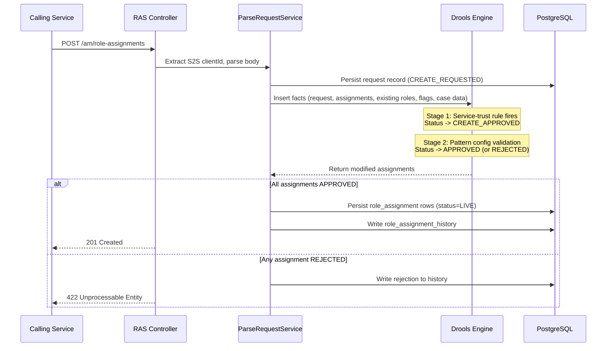

## TL;DR

- A role assignment is a time-bounded record stating "actor X holds role Y with attributes Z" — stored in the `role_assignment` table in RAS (port 4096).
- Every assignment passes through an in-process Drools rules engine before persistence; unapproved assignments are rejected with HTTP 422.
- Validation is two-stage: a service-trust rule sets status `CREATE_APPROVED`, then structural pattern matching against JSON role config sets `APPROVED`.
- `roleType` distinguishes `ORGANISATION` (staff/judicial standing roles) from `CASE` (per-case roles tied to a specific `caseId`).
- `beginTime`/`endTime` define validity windows; expired assignments are purged nightly by `am-role-assignment-batch-service`.
- ETag-based caching (`actor_cache_control` table) enables efficient polling of actor roles by CCD data store via `GET /am/role-assignments/actors/{actorId}`.

## Assignment attributes

Every role assignment carries the following core fields (defined in `Assignment.java:29-66`):

| Field | Type | Purpose |
|-------|------|---------|
| `id` | UUID | Primary key |
| `actorId` | String | IDAM user ID of the role holder |
| `actorIdType` | Enum | Always `IDAM` in practice |
| `roleType` | Enum | `CASE` or `ORGANISATION` |
| `roleName` | String | Identifier of the role (e.g. `case-allocator`, `tribunal-caseworker`) |
| `classification` | Enum | `PUBLIC`, `PRIVATE`, or `RESTRICTED` |
| `grantType` | Enum | `BASIC`, `SPECIFIC`, `STANDARD`, `CHALLENGED`, `EXCLUDED` |
| `roleCategory` | Enum | `JUDICIAL`, `LEGAL_OPERATIONS`, `ADMIN`, `PROFESSIONAL`, `CITIZEN`, `SYSTEM`, `OTHER_GOV_DEPT`, `CTSC` |
| `readOnly` | Boolean | If true, assignment cannot be deleted via normal API calls |
| `beginTime` | ZonedDateTime | Start of validity (null = immediate) |
| `endTime` | ZonedDateTime | End of validity (null = indefinite) |
| `attributes` | JSONB map | Flexible metadata: `jurisdiction`, `caseId`, `caseType`, `region`, `baseLocation`, etc. |
| `authorisations` | List\<String\> | Ticket-type authorisations the role holder possesses (e.g. judicial authorisations) |
| `notes` | JSONB | List of notes (userId, dateTime, text) — stores justifications from challenged access requests or workflow decisions. Persisted in history only, not in live table. |
| `log` | String | Brief log of which Drools rule approved/rejected the assignment (history table only) |
| `process` | String | Identifier of the provisioning process (e.g. `staff-organisational-role-mapping`) |
| `reference` | String | External reference linking related assignments |

### Supported attribute keys

The `attributes` JSONB map supports a defined set of keys (all stored as strings). Per the HLD, the currently supported attributes are:

| Attribute | Description | Used for access control |
|-----------|-------------|------------------------|
| `caseId` | CCD case ID — limits the role to a single case | Yes |
| `jurisdiction` | Jurisdiction/service within which the role applies | Yes |
| `caseType` | CCD case type identifier | Yes |
| `region` | Region ID (from CRD/JRD reference data) | Yes |
| `baseLocation` | Court/location ePIMMS property ID | Yes |
| `primaryLocation` | Actor's primary/default location (same across all their roles) | No |
| `contractType` | Salaried vs fee-paid (for judicial role mapping rules) | No |
| `organisationId` | Professional reference data organisation ID | Yes |
<!-- CONFLUENCE-ONLY: The HLD lists an "actorName" attribute described as "pending approval, will be used to avoid overhead of retrieving name from reference data" — not verified in source -->

### Classification ordering

`Classification` implements an ordered comparison (`Classification.java:6-20`): `RESTRICTED >= PRIVATE >= PUBLIC`. A user with `RESTRICTED` classification can access cases at all three levels.

### Grant types

- **BASIC** — default standing grant for organisational roles.
- **STANDARD** — standard org role grant requiring the user to have the role in Reference Data.
- **SPECIFIC** — case-level grant allocated by a case-allocator or system process.
- **CHALLENGED** — self-requested access to a case outside normal allocation, subject to approval rules.
- **EXCLUDED** — explicitly blocks a user from a case (used by case-allocator to remove access).

### Role configuration and patterns

Roles are defined in JSON configuration files deployed with the service (under `src/main/resources/roleconfig/`). Each role definition specifies:

| Property | Description |
|----------|-------------|
| `name` | Role name (matches `roleName` in assignments) |
| `label` | Human-readable label for UI drop-downs |
| `description` | Longer description of the role |
| `category` | Role category (e.g. `JUDICIAL`, `LEGAL_OPERATIONS`) |
| `type` | Role type: `CASE` or `ORGANISATION` |
| `substantive` | Whether this is a substantive role (boolean) |
| `patterns` | List of valid structural patterns for this role |

Each **pattern** constrains which field combinations are valid for an assignment of that role. Pattern fields include `roleType`, `grantType`, `classification`, `beginTime`, `endTime`, and an `attributes` map specifying which attributes are mandatory/optional and their allowed values. During stage-2 validation, the Drools rule `validate_role_assignment_against_patterns` matches the incoming assignment against these patterns and populates the `substantive` attribute (`"Y"` or `"N"`) from the role config.

Example role config (abbreviated):

```json
{
  "name": "tribunal-caseworker",
  "label": "Tribunal Caseworker",
  "description": "Tribunal caseworker",
  "category": "LEGAL_OPERATIONS",
  "type": "ORGANISATION",
  "substantive": true,
  "patterns": [
    {
      "roleType": { "mandatory": true, "values": ["ORGANISATION"] },
      "grantType": { "mandatory": true, "values": ["STANDARD"] },
      "classification": { "mandatory": true, "values": ["PUBLIC", "PRIVATE"] },
      "attributes": {
        "jurisdiction": { "mandatory": true },
        "primaryLocation": { "mandatory": true }
      }
    }
  ]
}
```

## Organisational vs case-level assignments

**Organisational assignments** (`roleType = ORGANISATION`) represent a user's standing roles derived from their staff or judicial profile. They are provisioned by `am-org-role-mapping-service`, which evaluates Drools mapping rules against CRD/JRD profile data and calls RAS with `replaceExisting=true` to atomically swap the user's org role set. These typically have no `caseId` attribute and often have null `endTime` (indefinite validity).

**Case-level assignments** (`roleType = CASE`) tie a user to a specific case. They always carry `caseId`, `jurisdiction`, and `caseType` in the `attributes` map. Case roles are created by CCD data store, AAC (for Notice of Change), XUI (via case-allocator), or WA. They are typically time-bounded and more granular.

The Drools rules enforce strict separation: the ORM service-trust rule (`organisational-role-mapping-common.drl:19-41`) only approves `ORGANISATION` role creation, while CCD service-trust rules (`ccd-case-role-validation.drl:22-37`) only approve `CASE` role creation for `PROFESSIONAL` or `CITIZEN` categories.

### Relationship to IdAM roles

Role assignments supersede the legacy CCD access control model which was based on IdAM roles. The legacy model still operates for backward compatibility: if a user has a case role on a case, CCD grants them access configured for that case role **plus** access configured for all the user's IdAM roles. This leads to over-permissive access in several scenarios (e.g. solicitors getting citizen-level access, all solicitors sharing identical access regardless of party).

The recommended approach for new services:
- **Citizens and professionals**: configure access only against case roles, never IdAM roles or organisational roles.
- **Internal users** (staff/judiciary): configure access against organisational roles (for broad case sets) or case roles (for specific case responsibility).
- **System users**: use organisational role assignments, not IdAM roles.

Any `RoleToAccessProfiles` entry with an `idam:` prefix (e.g. `idam:caseworker-solicitor-civil`) represents legacy technical debt.
<!-- CONFLUENCE-ONLY: Business rationale and migration guidance from "IdAM vs role assignment access control" (AM space) — not verified in source -->

## Creation lifecycle



### Step-by-step

1. **Request arrives** at `POST /am/role-assignments` (`CreateAssignmentController.java:44`). Both `Authorization` (OIDC JWT) and `ServiceAuthorization` (S2S) headers are required.

2. **S2S client ID extraction** — `ParseRequestService.java:53` extracts the `clientId` from the S2S token and sets it on the `Request` object. This clientId drives which Drools rules can approve the request.

3. **Initial persistence** — the `AssignmentRequest` (containing a `Request` wrapper and a collection of `RoleAssignment` objects) is persisted with status `CREATE_REQUESTED` (sequence 9).

4. **Facts assembly** — `ValidationModelService.runRulesOnAllRequestedAssignments()` (`ValidationModelService.java:132-176`) assembles the Drools working memory:
   - The `Request` object
   - All `RoleAssignment` objects from the request
   - The `RoleConfig` singleton (loaded from JSON at startup)
   - `FeatureFlag` instances (one per known flag, sourced from the `flag_config` DB table)
   - `ExistingRoleAssignment` instances for the assigner, authenticated user, and all assignees

5. **Lazy case data loading** — if any requested assignment has a `caseId` attribute, the `load_case_data_for_role_assignments_with_case_ids` rule (`load-case-data.drl:21`) fires and fetches case data from CCD data store via Feign. Case data is cached (Caffeine, 120s TTL, max 500 entries). Requests from `ccd_data`, `aac_manage_case_assignment`, `ccd_case_disposer`, or `disposer-idam-user` skip this load.

6. **Stage 1 — service-trust validation** — a jurisdiction/service-specific Drools rule fires and sets status to `CREATE_APPROVED` (sequence 14). For example:
   - ORM creating org roles: `organisational-role-mapping-common.drl:19-41`
   - CCD creating case roles: `ccd-case-role-validation.drl:22-37`
   - Case-allocator creating specific/excluded roles: `case-allocator-global.drl:18-79`

7. **Stage 2 — pattern validation** — `validate_role_assignment_against_patterns` (`role-assignment-config-validation.drl:44-62`) matches the assignment against JSON role config patterns. Checks `grantType`, `classification`, `beginTime`, `endTime`, and attribute constraints. On match, sets status to `APPROVED` (sequence 16) and populates the `substantive` attribute (`"Y"` or `"N"`).

8. **Fallback rejection** — if no rule approves a `CREATE_REQUESTED` or `CREATE_APPROVED` assignment, `reject_unapproved_create_role_assignments` fires at salience -1000 (`reject-unapproved-role-assignments.drl:11`) and sets status to `REJECTED` (sequence 17).

9. **Persistence** — approved assignments are written to `role_assignment` with status `LIVE` (sequence 18). All state transitions are recorded in `role_assignment_history`. The entire operation runs in a single `@Transactional(propagation = REQUIRES_NEW)` scope.

### Replace-existing semantics

When `replaceExisting=true` on the request, RAS deletes all existing assignments matching the same `process` + `reference` and replaces them atomically. This is how ORM refreshes a user's org roles — it sends the complete desired role set in one request and RAS swaps them in a single transaction.

## Status state machine

Assignments progress through the following statuses (defined in `Status.java:3-27`):

| Status | Sequence | Meaning |
|--------|----------|---------|
| `CREATE_REQUESTED` | 9 | Initial state on arrival |
| `CREATE_APPROVED` | 14 | Passed stage-1 service-trust validation |
| `APPROVED` | 16 | Passed stage-2 pattern validation |
| `REJECTED` | 17 | Failed validation (terminal) |
| `LIVE` | 18 | Persisted and active |
| `DELETE_REQUESTED` | 20 | Deletion initiated |
| `DELETE_APPROVED` | 21 | Deletion approved by rules |
| `DELETED` | 23 | Soft-deleted (terminal) |
| `EXPIRED` | 41 | Past `endTime`, purged by batch (terminal) |

Only `LIVE` assignments are stored in the `role_assignment` table. All other statuses exist only in `role_assignment_history`.

## Querying assignments

The query API (`POST /am/role-assignments/query`) supports filtering by any combination of assignment attributes. Two versions exist on the same path, differentiated by content-type header:

- **v1** — single `QueryRequest` body, produces `V1.MediaType.POST_ASSIGNMENTS`
- **v2** — `MultipleQueryRequest` (list of queries, ORed together), produces `V2.MediaType.POST_ASSIGNMENTS`

Key query parameters:

- `validAt` — temporal filter: `beginTime <= validAt AND (endTime >= validAt OR endTime IS NULL)` (`RoleAssignmentEntitySpecifications.java:42-50`)
- `attributes` — JSONB containment query using PostgreSQL GIN index
- `authorisations` — array overlap check via `array_position`
- `hasAttributes` — returns assignments that have at least one of the listed attribute keys present

Pagination is controlled via request headers (not query parameters): `pageNumber`, `size`, `sort`, `direction`. Default page size is 20. The response always includes a `Total-Records` header with the total matching count.

## Expiry and purge

Role assignments expire naturally when `endTime` passes — they are no longer returned by `validAt`-filtered queries. However, expired rows remain in the `role_assignment` table until the batch purge runs.

`am-role-assignment-batch-service` is a Spring Batch Kubernetes CronJob that runs daily. It:

1. Identifies `role_assignment` rows where `endTime < now()`
2. Moves them to `role_assignment_history` with status `EXPIRED` (sequence 41)
3. Deletes them from the live `role_assignment` table

This keeps the live table compact and query-performant, while preserving a full audit trail in history.

## Deletion

Explicit deletion (before natural expiry) follows a similar pattern to creation:

- `DELETE /am/role-assignments?process=X&reference=Y` — deletes all assignments matching process+reference
- `DELETE /am/role-assignments/{assignmentId}` — deletes a single assignment by UUID
- `POST /am/role-assignments/query/delete` — bulk delete by query criteria

Delete operations also pass through Drools validation (the `DeleteRoleAssignmentOrchestrator`), write history records with `DELETE_REQUESTED` -> `DELETE_APPROVED` -> `DELETED` transitions, and run within a `@Transactional(propagation = REQUIRES_NEW)` scope.

## ETag-based caching

To support efficient querying by CCD data store (the primary consumer making ~30+ calls/sec for actor role lookups), RAS implements HTTP ETag caching on the `GET /am/role-assignments/actors/{actorId}` endpoint.

The `actor_cache_control` table stores:

| Column | Type | Description |
|--------|------|-------------|
| `actor_id` | text (PK) | IDAM user ID |
| `etag` | int4 | Incremented on every change to the actor's assignments |
| `json_response` | jsonb | Pre-computed JSON response for this actor's current roles |

When CCD data store sends `If-None-Match` with the previously received ETag, RAS returns **304 Not Modified** if the actor's assignments have not changed, avoiding the overhead of re-querying and serialising the response. The implementation uses Spring's `ShallowEtagHeaderFilter` (`CacheControlConfig.java`).

<!-- CONFLUENCE-ONLY: The HLD states "up to 30 calls of getAssignmentsByActorId per second" as the performance target from CCD data store, targeting 40 calls/sec with 33% headroom. The LLD states "performance tested for up-to 2000 max number of role assignments for a single user" — not verified in source -->

## Delete by query safety

The `POST /am/role-assignments/query/delete` endpoint deletes all role assignments matching a query. This is powerful but potentially dangerous in production where many role types coexist on a case. Best practices from the AM team:

- **Always include `grantType: ["SPECIFIC"]`** in the query — omitting this risks deleting `EXCLUDED` roles (conflicts of interest).
- **Filter by `roleCategory`** to avoid inadvertently removing citizen or professional case roles.
- **Specify `roleName` explicitly** rather than relying on broad filters.
- **Never use this endpoint to delete professional case roles** — those are maintained by the Assign Case Access APIs which keep supplementary case data in sync.

Example minimum-filter query for safely removing WA case roles:

```json
{
  "queryRequests": [{
    "roleType": ["CASE"],
    "grantType": ["SPECIFIC"],
    "roleCategory": ["LEGAL_OPERATIONS", "JUDICIAL", "ADMIN", "CTSC"],
    "attributes": {
      "jurisdiction": ["PRIVATELAW"],
      "caseId": ["1234567890123456"]
    },
    "roleName": ["allocated-admin-caseworker", "gatekeeping-judge"]
  }]
}
```

## Environment-specific Drools bypass

In non-production environments (Preview, AAT, ITHC, Demo), the Drools rule requiring `clientId == "am_org_role_mapping_service"` for creating organisational roles can be bypassed via the `BYPASS_ORG_DROOL_RULE` environment variable. This allows service teams to create org role assignments directly for functional testing without routing through ORM.

- **Production**: `BYPASS_ORG_DROOL_RULE=false` (enforced via `values.prod.template.yaml`)
<!-- REVIEW: BYPASS_ORG_DROOL_RULE defaults to false in application.yaml:181 (${BYPASS_ORG_DROOL_RULE:false}), not true. It is set to true in lower envs via Helm overrides (values.aat.template.yaml:12, values.preview.template.yaml:33), not by the application.yaml default. -->
- **Lower environments**: `BYPASS_ORG_DROOL_RULE=true` (default in `application.yaml`)

The `ParseRequestService.java:41-48` reads this value and sets `request.byPassOrgDroolRule`, which the Drools rule checks: `$rq: Request(byPassOrgDroolRule || clientId == "am_org_role_mapping_service")`.

## Database schema

The persistence layer uses four main tables (`V1_1__init_tables.sql`, `V1_6__adding_new_indexes.sql`):

- **`role_assignment`** — live assignments only. GIN index on `attributes` JSONB column (`jsonb_path_ops`) for efficient containment queries (`V1_6`). B-tree index on `actor_id`.
- **`role_assignment_history`** — complete audit trail of all state transitions. PK is composite `(id, request_id, status)`. Indexed on `(process, reference)`. Includes `notes` (JSONB) and `log` (text) columns not present in the live table.
- **`role_assignment_request`** — metadata about each inbound request: `client_id`, `authenticated_user_id`, `assigner_id`, `request_type`, `status`, `process`, `reference`, `replace_existing`, `log`.
- **`actor_cache_control`** — one row per actor; stores the current `etag` (integer, incremented on any role change) and a pre-computed `json_response` (JSONB) for the GET-by-actor endpoint.

## Examples

### Database schema: role_assignment and role_assignment_history tables (real source)

```sql
// Source: apps/am/am-role-assignment-service/src/main/resources/db/migration/V1_1__init_tables.sql
CREATE TABLE role_assignment(
    id uuid NOT NULL,
    actor_id_type text NOT NULL,
    actor_id text NOT NULL,
    role_type text NOT NULL,
    role_name text NOT NULL,
    classification text NOT NULL,
    grant_type text NOT NULL,
    role_category text NULL,
    read_only bool NOT NULL,
    begin_time timestamp NULL,
    end_time timestamp NULL,
    "attributes" jsonb NOT NULL,
    created timestamp NOT NULL,
    authorisations _text NULL,
    CONSTRAINT role_assignment_pkey PRIMARY KEY (id)
);

CREATE TABLE role_assignment_history(
    id uuid NOT NULL,
    request_id uuid NOT NULL,
    actor_id_type text NOT NULL,
    actor_id text NOT NULL,
    role_type text NOT NULL,
    role_name text NOT NULL,
    classification text NOT NULL,
    grant_type text NOT NULL,
    role_category text NULL,
    read_only bool NOT NULL,
    begin_time timestamp NULL,
    end_time timestamp NULL,
    status text NOT NULL,
    reference text NULL,
    process text NULL,
    "attributes" jsonb NOT NULL,
    notes jsonb NULL,
    log text NULL,
    status_sequence int4 NOT NULL,
    created timestamp NOT NULL,
    authorisations _text NULL,
    CONSTRAINT pk_role_assignment_history PRIMARY KEY (id, request_id, status)
);

CREATE TABLE actor_cache_control(
    actor_id text NOT NULL,
    etag int4 NOT NULL,
    json_response jsonb NOT NULL,
    CONSTRAINT actor_cache_control_pkey PRIMARY KEY (actor_id)
);
```

The `role_assignment` table holds only `LIVE` records. History tracks every status transition (including `EXPIRED`, `DELETED`, `REJECTED`). The `actor_cache_control` table stores pre-computed responses per actor for the ETag caching mechanism on `GET /am/role-assignments/actors/{actorId}`.

### Drools bypass mechanism: ORM trust rule with byPassOrgDroolRule (real source)

```drool
// Source: apps/am/am-role-assignment-service/src/main/resources/validationrules/core/organisational-role-mapping-common.drl
rule "staff_organisational_role_mapping_service_create"
when
    $rq: Request(byPassOrgDroolRule || clientId == "am_org_role_mapping_service")

    $ra: RoleAssignment(
             status == Status.CREATE_REQUESTED,
             roleType == RoleType.ORGANISATION,
             roleCategory in (RoleCategory.LEGAL_OPERATIONS, RoleCategory.JUDICIAL,
                              RoleCategory.ADMIN, RoleCategory.OTHER_GOV_DEPT, RoleCategory.CTSC) )
then
    $ra.setStatus(Status.CREATE_APPROVED);
    $ra.log("Create approved : staff_organisational_role_mapping_service_create");
    update($ra);
    logMsg("Rule : staff_organisational_role_mapping_service_create");
end;
```

In production `byPassOrgDroolRule` is always `false` — only `am_org_role_mapping_service` can create org roles. In lower environments the bypass is `true`, allowing service teams to set org roles directly for testing.

## See also

- [Overview](overview.md) — conceptual introduction to role types, grant types, and the AM platform position
- [Drools Rules](drools-rules.md) — the two-stage Drools validation pipeline that drives the status state machine described here
- [RAS API Reference](../reference/api-role-assignment-service.md) — endpoint reference including request/response shapes and all enumerated values
- [Query Role Assignments](../how-to/query-role-assignments.md) — how to use the query API to retrieve live role assignments by actor, case, or attributes

## Glossary

| Term | Definition |
|------|-----------|
| RAS | Role Assignment Service (`am-role-assignment-service`), the core API at port 4096 |
| ORM | Org Role Mapping Service (`am-org-role-mapping-service`), provisions organisational roles from Reference Data |
| Assignment | A single record granting a role to an actor with specific attributes and time bounds |
| Drools | Embedded rules engine (stateless KieSession) that validates every create/delete request |
| Pattern | A JSON-defined template in role config that constrains valid combinations of attributes for a role |
| S2S | Service-to-service authentication; the `clientId` from the S2S token determines which Drools rules apply |
