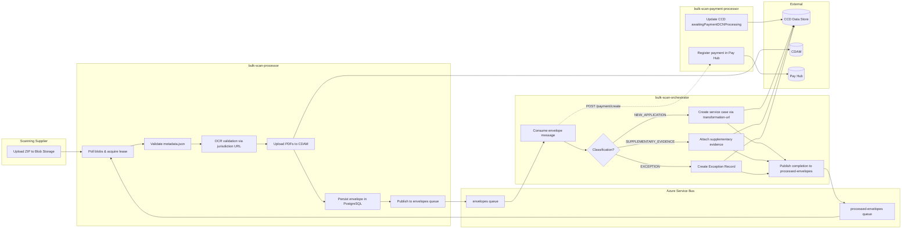
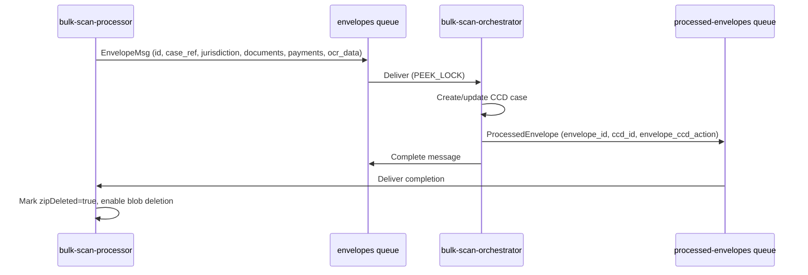

## TL;DR

- Bulk Scan is a pipeline that ingests scanned paper envelopes from Azure Blob Storage, creates or updates CCD cases, and registers payments in Pay Hub. The full system spans two resource groups: `reform-scan` (blob-router, notification-service) and `bulk-scan` (processor, orchestrator, payment-processor).
- **bulk-scan-processor** (port 8581) polls blob containers, validates ZIPs, uploads PDFs to CDAM, persists envelope state in PostgreSQL, and publishes notifications to the `envelopes` Azure Service Bus queue.
- **bulk-scan-orchestrator** (port 8582) consumes from the `envelopes` ASB queue, creates/updates CCD cases (or Exception Records), and publishes completion messages to the `processed-envelopes` queue. Messages are retried up to the Azure `max-delivery-count` (configured to 300) before dead-lettering.
- **bulk-scan-payment-processor** (port 8583) receives HTTP calls from the orchestrator, registers payment DCNs in Pay Hub, and updates CCD exception records to mark payment processing complete.
- Azure Service Bus queues (`envelopes`, `processed-envelopes`, `notifications`) are the primary inter-service transport; JMS/ActiveMQ is an alternative toggled by `JMS_ENABLED`.
- The system serves three customer types: **CFT** (full case creation/update/payments), **Crime** (file routing only, no CCD interaction), and **PCQ** (file routing only). Only CFT services use the orchestrator and payment processor.

## Pipeline overview

The full pipeline from scanning supplier upload to CCD case creation:

## Upstream: blob-router and notification service

<!-- CONFLUENCE-ONLY: not verified in source -->

The three core bulk-scan services are preceded by two upstream services in the `reform-scan` resource group. These are maintained by the same team but live in separate repositories (`blob-router-service`, `reform-scan-notification-service`):

| Service | Repository | Purpose |
|---------|-----------|---------|
| `reform-scan-blob-router` | [hmcts/blob-router-service](https://github.com/hmcts/blob-router-service) | Receives envelope ZIPs from the scanning supplier (XBP/Iron Mountain) via APIM with client-certificate auth, validates the supplier's signature, and dispatches envelopes to per-jurisdiction storage containers. Routes CFT envelopes to `bulkscan` storage, Crime envelopes to a separate Crime storage account, and PCQ envelopes to their own account. |
| `reform-scan-notification-service` | [hmcts/reform-scan-notification-service](https://github.com/hmcts/reform-scan-notification-service) | Sends error notifications back to the scanning supplier when envelopes fail validation. Consumes from the `notifications` ASB queue (published by the processor). |

The blob-router acts as the **secure ingress gateway**: it validates the supplier's TLS client certificate (thumbprint configured per-environment in `infrastructure/*.tfvars`), issues SAS tokens for blob upload via the APIM `/bulk-scan/token/{serviceName}` endpoint, and records dispatch status in its own PostgreSQL database. Envelope status in the blob-router DB should be `DISPATCHED` for successfully routed files.

**Infrastructure**: Both services share `reform-scan-shared-infra` (Terraform). The `reformscan` storage account holds the incoming blobs before routing. APIM migrated from `/reform-scan` to `/bulk-scan` endpoint prefix in December 2024 to enable OAuth 2.0 authorization.

## Service: bulk-scan-processor

The processor is the ingestion layer. It runs five independently-toggleable scheduled tasks that form a sequential pipeline within a single service:

| Task | ShedLock? | Trigger | Purpose |
|------|-----------|---------|---------|
| `BlobProcessorTask` | No (Azure blob lease) | Fixed delay 30s (`SCAN_DELAY`) | Poll containers, validate ZIPs, extract and validate envelopes |
| `UploadEnvelopeDocumentsTask` | Yes (`upload-documents`) | Fixed delay (`UPLOAD_TASK_DELAY`) | Upload PDFs to CDAM, retry up to 5 times (`UPLOAD_MAX_TRIES`) |
| `OrchestratorNotificationTask` | Yes (`send-orchestrator-notification`) | Fixed delay 30s (`NOTIFICATIONS_TO_ORCHESTRATOR_TASK_DELAY`) | Publish `EnvelopeMsg` to `envelopes` ASB queue |
| `DeleteCompleteFilesTask` | Yes (`delete-complete-files`) | Cron (`DELETE_COMPLETE_FILES_CRON`) | Delete blobs after orchestrator ACK |
| `CleanUpRejectedFilesTask` | Yes | Cron (`DELETE_REJECTED_FILES_CRON`) | Delete rejected blobs after a configurable TTL (`DELETE_REJECTED_FILES_TTL`). Disabled by default. |

**Monitoring task**: `IncompleteEnvelopesTask` runs every 15 minutes (configurable via `INCOMPLETE_ENVELOPES_TASK_CRON`) and alerts on envelopes that have been incomplete for longer than `stale-after: PT1H`.

**Database**: PostgreSQL with 64 Flyway migrations. Stores envelope state, scannable items, process events, and the ShedLock table.

**Envelope status lifecycle**: `CREATED` → `UPLOADED` → `NOTIFICATION_SENT` → `COMPLETED`. Failure path: `UPLOAD_FAILURE` (retried up to `UPLOAD_MAX_TRIES`, default 5).

**Inbound completion signal**: The `ProcessedEnvelopeNotificationHandler` listens on the `processed-envelopes` ASB queue. When the orchestrator signals completion, the handler marks the envelope `zipDeleted=true`, enabling the `DeleteCompleteFilesTask` to remove the source blob.

**SAS token endpoint**: `GET /token/{serviceName}` issues 5-minute write+list SAS tokens for scanning suppliers. Ten jurisdictions are configured (`sscs`, `bulkscan`, `probate`, `divorce`, `finrem`, `cmc`, `publiclaw`, `privatelaw`, `nfd`, `bulkscanauto`).

**Container-to-jurisdiction mapping** (from `application.yaml`):

| Container | Jurisdiction | PO Boxes | Payments Enabled | OCR Validation |
|-----------|-------------|----------|-----------------|----------------|
| `sscs` | SSCS | 12626, 13150, 13618 | No | Yes |
| `probate` | PROBATE | 12625, 12624 | Yes (toggle) | Yes |
| `divorce` | DIVORCE | 12706 | Yes (toggle) | Yes |
| `finrem` | DIVORCE | 12746 | Yes (toggle) | Yes |
| `cmc` | CMC | 12747 | No | No |
| `publiclaw` | PUBLICLAW | 12879 | Yes (toggle) | No |
| `privatelaw` | PRIVATELAW | 13235 | Yes (toggle) | Yes |
| `nfd` | DIVORCE | 13226 | Yes (toggle) | Yes |

**Uniqueness constraints**: The processor validates uniqueness of zip filename, document DCN, and payment DCN. Re-uploading a previously processed envelope requires data to be cleared from both the blob-router DB and the bulk-scan DB.

**Actions API** (protected by `ACTIONS_API_KEY`): Provides operational endpoints for manual intervention on stuck envelopes:

| Method | Path | Purpose |
|--------|------|---------|
| `PUT` | `/actions/reprocess/{id}` | Reprocess a failed envelope |
| `PUT` | `/actions/update-classification-reprocess/{id}` | Change classification to EXCEPTION and reprocess |
| `PUT` | `/actions/{id}/complete` | Manually mark an envelope as completed |
| `PUT` | `/actions/{id}/abort` | Abort processing of an envelope |

## Service: bulk-scan-orchestrator

The orchestrator is the decision engine. It consumes `Envelope` messages from the `envelopes` ASB queue using a `ServiceBusProcessorClient` in PEEK_LOCK mode (auto-complete disabled).

**Processing logic by classification**:

| Classification | Automated action | Fallback |
|---|---|---|
| `NEW_APPLICATION` | Call jurisdiction `transformation-url`, create service case in CCD | Create Exception Record |
| `SUPPLEMENTARY_EVIDENCE` | Attach documents to existing case via `attachScannedDocs` CCD event | Create Exception Record |
| `SUPPLEMENTARY_EVIDENCE_WITH_OCR` | Call jurisdiction `update-url`, update existing case | Create Exception Record |
| `EXCEPTION` | Always create Exception Record | — |

**Exception Record creation rules** (when an ER is created instead of a service case):

1. Envelope classified as `SUPPLEMENTARY_EVIDENCE` but no case number provided
2. Envelope classified as `SUPPLEMENTARY_EVIDENCE` with a case number that cannot be located in CCD
3. Envelope classified as `NEW_APPLICATION` with OCR forms, but form validation returns warnings
4. Classification received from the scanning supplier is explicitly `EXCEPTION`
5. Any other failure outside the happy path (CCD errors, transformation failures, etc.)

**Idempotency**: Before creating any CCD record, the orchestrator searches for existing cases/ERs by envelope ID (`data.envelopeId`, `data.bulkScanEnvelopes.value.id`) to prevent duplicates.

**Completion notification**: After successful CCD action, `ProcessedEnvelopeNotifier` publishes a `ProcessedEnvelope` message to the `processed-envelopes` queue with fields `envelope_id`, `ccd_id`, and `envelope_ccd_action` (one of `AUTO_CREATED_CASE`, `AUTO_ATTACHED_TO_CASE`, `AUTO_UPDATED_CASE`, `EXCEPTION_RECORD`).

**Callback path**: Caseworkers can trigger CCD events (`createNewCase`, `attachToExistingCase`) on Exception Records, which call back into the orchestrator at `POST /callback/create-new-case` or `POST /callback/attach_case`. These hit the same `transformation-url` / `update-url` endpoints on service-team apps.

**Database**: PostgreSQL with 2 Flyway migrations. Stores `callback_result` (audit of ER-to-case mappings) and payment tracking tables.

## Service: bulk-scan-payment-processor

The payment processor handles DCN (Document Control Number) payment registration. Unlike the other two services, it has **no database** and **no ASB listener** in the current codebase — it exposes HTTP endpoints called by the orchestrator.

**Endpoints**:

| Method | Path | Purpose |
|--------|------|---------|
| `POST` | `/payment/create` | Register payment DCNs in Pay Hub; update CCD ER `awaitingPaymentDCNProcessing` → `"No"` |
| `POST` | `/payment/update` | Update Pay Hub with service case reference after ER conversion |

**Create flow**: Receives `CreatePayment` → maps PO Box to site ID → `POST /bulk-scan-payments` to Pay Hub → (if exception record) fires `completeAwaitingPaymentDCNProcessing` CCD event → async `PUT /payment/status` callback to processor.

**Update flow**: Receives `UpdatePayment` → `PUT /bulk-scan-payments?exception_reference={ref}` to Pay Hub with the new case reference. No CCD call on this path.

**PO Box to site ID**: Static mapping in `application.yaml` covering PROBATE (PO Boxes 12625, 12624), DIVORCE (12706), FINREM (12746), NFD (13226), PRIVATELAW (13235), and BULKSCAN test boxes.

## Azure Service Bus queues

**Queue: `envelopes`** — Carries `EnvelopeMsg` JSON published by the processor's `OrchestratorNotificationTask`. Message ID is the envelope UUID. Subject/label is `"TEST"` for test envelopes (filename ends `.test.zip`), otherwise null. Heartbeat messages (subject `"heartbeat"`) are completed without processing.

**Queue: `processed-envelopes`** — Carries `ProcessedEnvelope` JSON published by the orchestrator after successful CCD action. Message ID is the envelope UUID. Content-type is `application/json`.

**Dead-letter handling**: Invalid messages (unparseable JSON) are dead-lettered immediately. Recoverable failures (HTTP errors, CCD timeouts) cause the message lock to expire and the message to be redelivered up to `max-delivery-count` (configured via `ENVELOPES_QUEUE_MAX_DELIVERY_COUNT`; production is set to **300**, chosen so that retries span at least 24 hours). The orchestrator runs a `CleanupEnvelopesDlqTask` to manage the DLQ.

**Stale envelopes**: An envelope becomes "stale" when the orchestrator encounters a non-recoverable error that it cannot distinguish from a transient failure. A common scenario: a service team's callback returns an error (e.g. 503), CCD wraps it as a generic `CallbackException` (returning 502 to the orchestrator), and the orchestrator treats it as potentially recoverable. The envelope is then retried up to the max delivery count before finally being dead-lettered. The processor exposes `GET /envelopes/stale-incomplete-envelopes` to surface these cases for operational attention.

## Databases

| Service | Database | Key tables |
|---------|----------|------------|
| reform-scan-blob-router | PostgreSQL (Flexible v15) | `envelopes` (dispatch status per file) |
| reform-scan-notification-service | PostgreSQL (Flexible v15) | notification tracking |
| bulk-scan-processor | PostgreSQL (Flexible v15) | `envelope`, `scannable_item`, `process_event`, `payments`, `shedlock` (64 migrations) |
| bulk-scan-orchestrator | PostgreSQL (Flexible v15) | `callback_result`, `payment`, `update_payment` (2 migrations) |
| bulk-scan-payment-processor | None | — |

<!-- CONFLUENCE-ONLY: not verified in source -->
All PostgreSQL instances are Azure Flexible Server v15, with resource groups named `<service>-flexible-postgres-db-v15-data-prod`.

## Operational monitoring

The processor exposes several reporting endpoints (no authentication required on the internal network):

| Endpoint | Purpose |
|----------|---------|
| `GET /reports/envelopes-count-summary?date=YYYY-MM-DD` | Count of envelopes received by container for a given date |
| `GET /reports/zip-files-summary?date=YYYY-MM-DD` | Status of all ZIP files received on a date |
| `GET /envelopes/stale-incomplete-envelopes` | Envelopes stuck in an incomplete state |
| `GET /envelopes/{container}/{zipFileName}` | Status of a specific envelope by container and filename |
| `GET /payment?dcns=<DCN>` | Payment data for a specific Document Control Number |

Daily email reports are sent at 06:00 (configurable via `REPORTS_CRON`) to configured recipients. The incomplete-envelopes monitoring task runs every 15 minutes and flags envelopes that have been incomplete for over 1 hour.

**Application Insights**: Services are grouped into two AI instances:
- `reform-scan-prod` — blob-router, notification-service
- `bulk-scan-prod` — processor, orchestrator, payment-processor

<!-- CONFLUENCE-ONLY: not verified in source -->
**Shuttering**: Bulk Scan has no frontend shuttering capability. If processing needs to be paused, the scheduled tasks can be disabled individually via their `*_ENABLED` environment variables, leaving files in blob storage until re-enabled.

## Authentication

All three services use the same authentication pattern:

- **S2S (service-to-service)**: `AuthTokenGenerator` from `service-auth-provider-java-client` produces `ServiceAuthorization` headers. Service names: `bulk_scan_processor`, `bulk_scan_orchestrator`, `bulk_scan_payment_processor`.
- **IDAM (user tokens)**: Per-jurisdiction user tokens obtained via the `bulkscan` system user. Used for CCD API calls (start event + submit event pattern). Tokens are cached in the processor and orchestrator with 5-minute refresh-before-expiry.
- **Pay Hub**: S2S only — no user token required.
- **CDAM**: S2S + IDAM; jurisdiction hardcoded to `BULKSCAN`, case type derived as `{CONTAINER}_ExceptionRecord`.

## Customer types and integration phases

<!-- CONFLUENCE-ONLY: not verified in source -->

The Bulk Scan system serves three distinct customer types with different integration depths:

| Capability | CFT services | Crime | PCQ |
|---|:---:|:---:|:---:|
| Secure ingress via blob-router | Yes | Yes | Yes |
| Non-repudiation check (signature validation) | Yes | Yes | Yes |
| Envelope metadata validation | Yes | No | No |
| OCR field validation (per-jurisdiction URL) | Yes | No | No |
| CCD case creation/update | Yes | No | No |
| CCD Exception Record creation | Yes | No | No |
| Payment recording in Pay Hub | Yes | No | No |
| Error notifications to scanning supplier | Yes | Partial | Partial |

For Crime and PCQ, the blob-router dispatches files to separate storage accounts; the bulk-scan-processor/orchestrator/payment-processor pipeline is not involved. Only high-level routing errors are notified back to the supplier for these customers.

**Service onboarding phases**:

- **Phase 1** — Supplementary evidence: paper documents with a case reference coversheet are scanned and attached to existing CCD cases. If no case number is provided or the case cannot be found, an Exception Record is created.
- **Phase 2** — Case creation with OCR: paper application forms are scanned with field-level OCR capture. Data flows through the orchestrator's `transformation-url` to create new service cases. Service teams must implement OCR validation and transformation endpoints.

Service teams onboarding to Phase 2 must provide:
1. An **OCR validation endpoint** (called during processor validation)
2. A **transformation endpoint** (called by orchestrator to create a service case from an Exception Record)
3. An **update endpoint** (called for `SUPPLEMENTARY_EVIDENCE_WITH_OCR` envelopes to update existing cases)
4. CCD definitions for their Exception Record case type

## Decoupling prototype (future direction)

<!-- CONFLUENCE-ONLY: not verified in source -->

A 2022 prototype explored decoupling the architecture so that service teams pull their own envelopes from the blob-router via REST API endpoints and process them using a shared Java library within their own service. This would eliminate the need for the processor, orchestrator, and payment-processor as central services. The prototype (branch `DTSSE-1285/prototype` on `blob-router-service`) demonstrated feasibility but has not been adopted in production. The current architecture remains as documented above.

## See also

- [Overview](overview.md) — end-to-end pipeline narrative with sequence diagram
- [Envelope Processing](envelope-processing.md) — detailed internals of the processor's four scheduled tasks
- [Orchestration Flow](orchestration-flow.md) — CCD routing logic and callback contracts in the orchestrator
- [Payment Handling](payment-handling.md) — the payment-processor's role in the architecture
