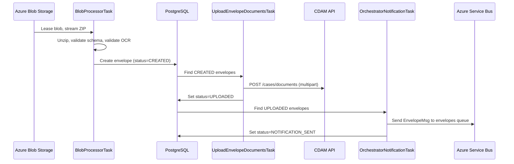

## TL;DR

- `bulk-scan-processor` drives the full early lifecycle of a scanned envelope: blob detection, ZIP extraction, JSON schema validation, OCR validation callback, CDAM document upload, and ASB notification to `bulk-scan-orchestrator`.
- The scanning supplier uploads a nested ZIP (outer zip containing a `signature` file and an `envelope.zip` inner); `blob-router-service` verifies the signature and dispatches `envelope.zip` to a per-jurisdiction container. The processor receives the **inner** ZIP directly.
- Four independently-toggleable scheduled tasks form the pipeline: scan (blob poll), upload-documents, notifications-to-orchestrator, and delete-complete-files.
- Blob polling uses Azure Blob leases for distributed locking (no ShedLock); the upload and notification tasks use ShedLock (JDBC-backed) to prevent concurrent execution across replicas.
- Envelope status lifecycle: `CREATED` -> `UPLOADED` -> `NOTIFICATION_SENT` -> `COMPLETED`. Failures detour through `UPLOAD_FAILURE` (retried up to 5 times) or `METADATA_FAILURE` (unrecoverable). `ABORTED` is a manual terminal state.
- All scheduling tasks default to disabled and must be explicitly enabled per environment via env vars (`SCAN_ENABLED`, `NOTIFICATIONS_TO_ORCHESTRATOR_TASK_ENABLED`, etc.).

## Pipeline overview

The processor implements a staged pipeline where each stage is a separate `@Scheduled` task. An envelope progresses through statuses as each task completes its work:



## Upstream: supplier ZIP format and blob-router dispatch

Before `bulk-scan-processor` sees any data, the scanning supplier (XBP, formerly Exela) creates and uploads a nested ZIP with the following structure:

```
<uniqueId>_<DD-MM-YYYY-HH-mm-ss>.zip    (outer zip)
  |-- envelope.zip                        (inner zip, digitally signed)
  |     |-- metadata.json
  |     |-- <dcn1>.pdf
  |     |-- <dcn2>.pdf
  |     \-- ...
  \-- signature                           (SHA256withRSA signature of envelope.zip)
```

The supplier authenticates via an API Management gateway using a client certificate (thumbprint registered in `blob-router-service` infrastructure) and a subscription key to retrieve a time-limited SAS token. The SAS token grants upload access to the per-jurisdiction container in the **reform-scan** storage account.

`blob-router-service` (a separate service, not cloned in this workspace) then:
1. Detects new blobs in the reform-scan storage account.
2. Verifies the digital signature against the supplier's pre-shared public key (non-repudiation).
3. Runs antivirus scanning.
4. Dispatches the inner `envelope.zip` to the appropriate container in the **bulk-scan** storage account.
5. Sends error notifications to the supplier endpoint if any of the above fail (error codes: `ERR_SIG_VERIFY_FAILED`, `ERR_AV_FAILED`, `ERR_ZIP_PROCESSING_FAILED`, `ERR_FILE_LIMIT_EXCEEDED`).

<!-- CONFLUENCE-ONLY: blob-router dispatch flow details from Technical Specification V1.4 (page 1775307063). blob-router-service is not cloned locally so cannot verify signature verification code path. -->

By the time `bulk-scan-processor` polls the bulk-scan storage account, each blob is a flat ZIP containing PDFs and `metadata.json` -- the outer zip and signature have already been processed.

### Container-to-jurisdiction mapping

Each jurisdiction has a dedicated blob container. As of the Technical Specification V1.4:

| Service | Container |
|---|---|
| SSCS | `sscs` |
| Probate | `probate` |
| Divorce/NFD | `nfd` |
| FinRem | `finrem` |
| CMC | `cmc` |
| Public Law | `publiclaw` |
| Private Law | `privatelaw` |
| Crime | `crime` |
| PCQ | `pcq` |

Crime and PCQ follow a different flow: `blob-router-service` dispatches to their own storage accounts without bulk-scan-processor involvement. The processor only handles CFT services.

<!-- CONFLUENCE-ONLY: container list from Technical Specification V1.4, last verified 06/06/2024. May have changed since. -->

## Stage 1: Blob polling and lease acquisition

`BlobProcessorTask.processBlobs()` runs on a fixed delay (default 30 seconds, configurable via `SCAN_DELAY`). It does **not** use ShedLock -- multiple replicas race for blobs, relying on Azure Blob leases as the distributed lock.

### Container discovery

`BlobManager.listInputContainerClients()` enumerates all blob containers, filtering out any ending in `-rejected` (`BlobManager.java:76-89`). The `STORAGE_BLOB_SELECTED_CONTAINER` env var can restrict processing to a single container or the literal string `"ALL"` for all containers.

### Blob enumeration and shuffling

`FileNamesExtractor.getShuffledZipFileNames()` lists blobs in each container and shuffles the result (`FileNamesExtractor.java:31-44`). This randomisation reduces lease contention when multiple replicas process the same container simultaneously.

### Lease acquisition

For each blob, the task calls `LeaseAcquirer.ifAcquiredOrElse()` (`LeaseAcquirer.java:57-77`). The acquirer:

1. Checks the blob is not mid-copy (inspects `CopyStatusType` and `waitingCopy` metadata flag).
2. Calls `LeaseMetaDataChecker.isReadyToUse` to verify the blob is consumable.
3. On success, invokes the processing consumer; on failure, invokes the error consumer.
4. Releases the lease and clears metadata after processing (`LeaseAcquirer.java:82-85`).

### OCR retry gating

Before opening the ZIP, `OcrValidationRetryManager.canProcess()` reads two blob metadata properties (`OcrValidationRetryManager.java:52-67`):

- `ocrValidationRetryCount` -- number of previous OCR attempts
- `ocrValidationRetryDelayExpirationTime` -- timestamp before which the blob must not be retried

If the delay has not expired, the blob is skipped entirely. Max retries: 2, delay: 300 seconds (`application.yaml:248-249`).

### Duplicate detection

Before attempting a lease, the task checks whether a DB envelope already exists for the filename/container pair (`BlobProcessorTask.java:131-141`). If so, the blob is skipped.

## Stage 2: ZIP extraction and validation

Once a lease is held, the blob is streamed as a `ZipInputStream` and handed to `ZipFileProcessor.getZipContentDetail()` (`ZipFileProcessor.java:113-135`).

### ZIP content rules

- `.json` entries are read as `metadata.json` bytes.
- `.pdf` entries are recorded by filename.
- Any other extension throws `NonPdfFileFoundException`, rejecting the envelope.
- Each PDF is size-checked against a 300 MB limit (`ZipFileProcessor.MAX_PDF_SIZE = 314_572_800`). Exceeding it triggers rejection to the `{container}-rejected` container.

### JSON schema validation

`MetafileJsonValidator.validate()` checks `metadata.json` against `metafile-schema.json` (JSON Schema draft-04) using `com.github.fge:json-schema-validator` (`MetafileJsonValidator.java:29-36`).

Required top-level fields: `po_box`, `jurisdiction`, `delivery_date`, `opening_date`, `zip_file_createddate`, `zip_file_name`, `envelope_classification`, `scannable_items` (`metafile-schema.json:219-228`).

Key constraints:
- `zip_file_name` must match pattern `^\d+_DD-MM-YYYY-HH-mm-ss\.(test\.)?zip$`
- `document_control_number` must be numeric only (`^[0-9]+$`)
- `file_name` must end in `.pdf`
- Date-time fields (`delivery_date`, `opening_date`, `zip_file_createddate`, `scanning_date`) must be ISO-8601 UTC: `^\d{4}-\d{2}-\d{2}T\d{2}:\d{2}:\d{2}\.\d{3}Z$`
- `additionalProperties: false` on all objects -- unknown fields fail validation

Optional fields:
- `case_number` -- nullable string (max 100 chars), the CCD case reference for supplementary evidence
- `previous_service_case_ref` -- nullable string, reference from the originating service
- `rescan_for` -- nullable string matching the zip filename pattern, indicates this envelope is a rescan of a prior envelope
- `non_scannable_items` -- array of items that cannot be scanned (DVDs, USB sticks, etc.) with `item_type` and `notes`

Enum values are parsed case-insensitively (`MetafileJsonValidator.java:19`).

### Envelope classifications

The `envelope_classification` field determines how the orchestrator processes the envelope downstream:

| Classification | Behaviour |
|---|---|
| `new_application` | Creates a new CCD case via the jurisdiction's transformation URL |
| `supplementary_evidence` | Attaches documents to an existing case identified by `case_number` |
| `supplementary_evidence_with_ocr` | Updates an existing case with OCR form data and documents (Probate only as of June 2024) |
| `exception` | Creates a CCD Exception Record directly (supplier-determined, per SIP business rules) |

<!-- CONFLUENCE-ONLY: supplementary_evidence_with_ocr being Probate-only as of 06/2024 comes from Technical Specification V1.4 and Onboarding new service page. Source confirms the enum exists but not which services use it. -->

### Business rule validation

`EnvelopeValidator` runs a chain of assertions on the parsed `InputEnvelope`:

| Validation | Rule |
|---|---|
| `assertZipFilenameMatchesWithMetadata` | ZIP filename must match the `zip_file_name` field in metadata |
| `assertContainerMatchesJurisdictionAndPoBox` | Container/jurisdiction/PO box triple must match a configured mapping |
| `assertServiceEnabled` | The target service must be enabled |
| `assertEnvelopeContainsOcrDataIfRequired` | `NEW_APPLICATION` and `SUPPLEMENTARY_EVIDENCE_WITH_OCR` classifications require OCR data on FORM/SSCS1 documents |
| `assertEnvelopeHasPdfs` | At least one PDF must be present |
| `assertDocumentControlNumbersAreUnique` | No duplicate DCNs |
| `assertPaymentsEnabledForContainerIfPaymentsArePresent` | Payments only allowed if configured for the container |
| `assertEnvelopeContainsDocsOfAllowedTypesOnly` | `SUPPLEMENTARY_EVIDENCE` envelopes disallow `FORM` and `SSCS1` document types (`EnvelopeValidator.java:52-57`) |

## Stage 3: OCR validation callback

After schema and business validation, `OcrValidator.assertOcrDataIsValid()` dispatches an HTTP call to a per-jurisdiction OCR validation service.

### URL dispatch

The OCR validation URL is looked up by PO box (case-insensitive) against `containers.mappings` in configuration (`OcrValidator.java:192-207`). Per-jurisdiction URLs are configured via env vars:

- `OCR_VALIDATION_URL_SSCS`, `OCR_VALIDATION_URL_PROBATE`, `OCR_VALIDATION_URL_DIVORCE`
- `OCR_VALIDATION_URL_FINREM`, `OCR_VALIDATION_URL_PRIVATELAW`, `OCR_VALIDATION_URL_NFD`
- CMC and PUBLICLAW have no OCR URL configured -- validation is silently skipped.

### Request format

`OcrValidationClient` POSTs to `{baseUrl}/forms/{form-type}/validate-ocr` with a `ServiceAuthorization` S2S header (`OcrValidationClient.java:46-49`). The `formType` is `"SSCS1"` for SSCS1 documents; otherwise it uses `documentSubtype`.

### Response handling

| Response status | Behaviour |
|---|---|
| `ERRORS` | Throws `OcrValidationException` -- envelope rejected (`OcrValidator.java:138-147`) |
| `WARNINGS` | Logged; warnings persisted to DB and forwarded in the ASB notification (`OcrValidator.java:147-152`) |
| HTTP 404 | Throws `OcrValidationException("Unrecognised document subtype ...")` (`OcrValidator.java:183-185`) |
| Other HTTP errors | Graceful fallback: wrapped as warning `"OCR validation was not performed due to errors"` (`OcrValidator.java:92-98`) |

### Retry mechanism

When OCR returns errors, `OcrValidationRetryManager.setRetryDelayIfPossible()` writes updated metadata under the existing blob lease (`OcrValidationRetryManager.java:80-116`):
- Increments `ocrValidationRetryCount`
- Sets `ocrValidationRetryDelayExpirationTime` to `now + 300s`

The blob will be retried on a future scan cycle once the delay expires. After 2 retries, the envelope is rejected.

### Gotchas

- OCR URL lookup is by PO box, not by container or jurisdiction. A misconfigured `poBoxes` list means validation is silently skipped.
- If `documentSubtype` is null for a non-SSCS1 item, the URL becomes `/forms/null/validate-ocr` -- there is no null guard (`OcrValidator.java:239-241`).
- Retry state lives in blob metadata, not the database. Re-copying a blob resets the counter.

## Stage 4: Document upload to CDAM

`UploadEnvelopeDocumentsTask` is a separate scheduled task with ShedLock protection (`@SchedulerLock(name = "upload-documents")`). It finds envelopes in status `CREATED` and uploads their PDFs.

### Upload flow

1. PDFs are extracted from the ZIP to a local temp directory (`/var/tmp/download/blobs/{zipFileName}/`) (`ZipFileProcessor.java:49-62`).
2. `DocumentManagementService.uploadDocuments()` sends a multipart POST to `${case_document_am.url}/cases/documents` (`DocumentManagementService.java:55-56`).
3. Request fields: `files` (FileSystemResource per PDF), `classification=RESTRICTED`, `caseTypeId`, `jurisdictionId=BULKSCAN` (hardcoded) (`DocumentManagementService.java:136-146`).
4. `caseTypeId` is derived as `container.toUpperCase() + "_ExceptionRecord"` (e.g., `SSCS_ExceptionRecord`) (`DocumentServiceHelper.java:46-48`).
5. The response contains CDAM URLs; `DocumentProcessor` extracts the UUID from each URL and writes it to `ScannableItem.documentUuid` (`DocumentProcessor.java:68-73`).
6. Temp files are always cleaned up in a `finally` block.

### Failure handling

On any upload failure, `EnvelopeProcessor.markAsUploadFailure` increments `uploadFailureCount` and sets status `UPLOAD_FAILURE`. The task retries up to `UPLOAD_MAX_TRIES` (default 5) (`application.yaml:219`). If a `FileSizeExceedMaxUploadLimit` error occurs, the blob is moved to the rejected container immediately with no retry.

### Authentication

- IDAM: `DocumentServiceHelper` fetches credentials via `IdamCachedClient.getIdamCredentials(jurisdiction)` with a 300-second pre-expiry refresh.
- S2S: `AuthTokenGenerator.generate()` from `service-auth-provider-java-client`.

## Stage 5: ASB notification publishing

`OrchestratorNotificationTask` runs on a fixed delay (default 30 seconds) with ShedLock (`@SchedulerLock(name = "send-orchestrator-notification")`) (`OrchestratorNotificationTask.java:56`).

### Flow

1. Queries `envelopeRepo.findByStatus(UPLOADED)` (`OrchestratorNotificationTask.java:63`).
2. For each envelope, within a `@Transactional` boundary:
   - Sets status to `NOTIFICATION_SENT`
   - Creates a `DOC_PROCESSED_NOTIFICATION_SENT` process event
   - Sends `EnvelopeMsg` to the ASB `envelopes` queue (`OrchestratorNotificationService.java:55-60`)
3. On send failure: creates `DOC_PROCESSED_NOTIFICATION_FAILURE` event, logs, continues with the next envelope.

### EnvelopeMsg payload

Key JSON fields: `id`, `case_ref`, `previous_service_case_ref`, `po_box`, `jurisdiction`, `container`, `classification`, `delivery_date`, `opening_date`, `zip_file_name`, `form_type`, `documents`, `payments`, `ocr_data`, `ocr_data_validation_warnings`.

- `MessageId` is set to the envelope UUID.
- `Subject` (label) is `"TEST"` if the filename ends with `.test.zip`; otherwise `null` (`EnvelopeMsg.java:203-205`).
- OCR data comes from the first `ScannableItem` with non-null `ocrData`; null field values are serialised as `""` (`EnvelopeMsg.java:281-300`).

### Completion signal

The inbound `processed-envelopes` queue carries ACK messages from `bulk-scan-orchestrator`. `ProcessedEnvelopeNotificationHandler` marks the envelope `zipDeleted=true`, enabling the `delete-complete-files` task to clean up the source blob.

## Envelope status lifecycle (complete)

The `Status` enum (`Status.java`) defines all possible envelope states:

| Status | Meaning | Terminal? |
|---|---|---|
| `CREATED` | Envelope parsed and persisted; awaiting document upload | No |
| `METADATA_FAILURE` | Inconsistency between files and metadata (unrecoverable without manual intervention) | Yes (unless manually reprocessed) |
| `UPLOADED` | Documents uploaded to CDAM; awaiting orchestrator notification | No |
| `UPLOAD_FAILURE` | Document upload failed; will be retried up to `UPLOAD_MAX_TRIES` (default 5) | No (until max retries) |
| `NOTIFICATION_SENT` | ASB message sent to orchestrator; awaiting processed-envelope ACK | No |
| `ABORTED` | Envelope in inconsistent state, manually aborted via admin action | Yes |
| `COMPLETED` | ACK received from orchestrator; blob eligible for deletion | Yes |

Events that drive transitions (from `Event.java`):

- `ZIPFILE_PROCESSING_STARTED` -- processor begins handling the blob
- `DOC_FAILURE` -- generic failure before upload
- `FILE_VALIDATION_FAILURE` -- schema/business validation failure
- `DISABLED_SERVICE_FAILURE` -- target service is disabled in this environment
- `FILE_SIZE_EXCEED_UPLOAD_LIMIT_FAILURE` -- PDF exceeds max upload size
- `DOC_UPLOADED` -- all documents successfully uploaded to CDAM
- `DOC_UPLOAD_FAILURE` -- document upload failed
- `DOC_PROCESSED_NOTIFICATION_SENT` -- ASB notification sent
- `DOC_PROCESSED_NOTIFICATION_FAILURE` -- ASB notification failed
- `DOC_SIGNATURE_FAILURE` -- signature verification failed (tracked for reporting)
- `DOC_PROCESSING_ABORTED` -- manual abort with reason
- `MANUAL_STATUS_CHANGE` -- manual reprocessing trigger
- `MANUAL_RETRIGGER_PROCESSING` -- admin re-trigger
- `COMPLETED` -- final success

## Error codes and supplier notification

When `blob-router-service` rejects a ZIP, it sends an error notification to the scanning supplier's endpoint. Error codes (`ErrorCode.java`):

| Code | Meaning |
|---|---|
| `ERR_FILE_LIMIT_EXCEEDED` | Document exceeds maximum file size |
| `ERR_METAFILE_INVALID` | metadata.json fails schema validation |
| `ERR_PAYMENTS_DISABLED` | Payments not allowed for this container/environment |
| `ERR_SERVICE_DISABLED` | Service is disabled in this environment |
| `ERR_AV_FAILED` | Antivirus scan detected a threat |
| `ERR_SIG_VERIFY_FAILED` | Digital signature does not match ZIP content |
| `ERR_RESCAN_REQUIRED` | Envelope needs to be rescanned by supplier |
| `ERR_ZIP_PROCESSING_FAILED` | Invalid ZIP file content or structure |

The notification is sent to the supplier's HTTPS endpoint with Basic Auth. The request includes `zip_file_name`, `po_box`, `error_code`, `error_description`, and an optional `document_control_number` (for per-document errors like file-size issues).

## Exception Record creation rules

When the orchestrator cannot process an envelope on the happy path, it creates a CCD Exception Record. Per the Technical Specification and business rules:

1. **Supplementary evidence with no case number** -- envelope classified as `supplementary_evidence` but `case_number` is null or empty.
2. **Case not found** -- envelope has `supplementary_evidence` classification with a `case_number` that does not exist in CCD.
3. **OCR validation warnings on new application** -- `new_application` classification with OCR forms where validation returned warnings (not errors).
4. **Supplier-classified exception** -- `envelope_classification` set to `exception` by the scanning supplier per SIP business rules.
5. **Any other failure** -- anything outside the happy path results in an exception record.

<!-- CONFLUENCE-ONLY: Exception record creation rules from "Bulk Scan, Bulk print & FaCT Useful Links" page (1638182762). Rules align with orchestrator behaviour but exact implementation is in bulk-scan-orchestrator (not cloned). -->

## Orchestrator retry behaviour

When `bulk-scan-orchestrator` encounters a failure processing an ASB message (e.g., CCD returns 502), the message is redelivered. The Azure Service Bus queue is configured with a **Max Delivery Count of 300**, which means the orchestrator retries for approximately 24 hours before the message is dead-lettered. This was historically set high to handle transient downstream failures, but means genuinely unrecoverable errors (like a CCD callback returning 5xx due to an invalid email in Probate/Notify) will exhaust all retries, resulting in a stale envelope.

<!-- CONFLUENCE-ONLY: Max Delivery Count = 300 from FACT-2063 investigation in "Bulk Scan, Bulk print & FaCT Useful Links" page. Config is in bulk-scan-shared-infrastructure (not cloned). -->

## Administrative actions

The processor exposes admin endpoints (protected by `actions-api-key` secret) for manual intervention on stuck envelopes (`ActionController.java`):

| Endpoint | Method | Purpose |
|---|---|---|
| `/actions/{id}/complete` | PUT | Force-complete an envelope stuck in a non-final state |
| `/actions/reprocess/{id}` | PUT | Reprocess a failed envelope after the underlying issue is resolved |
| `/actions/update-classification-reprocess/{id}` | PUT | Change classification (e.g., to force exception record creation) and reprocess |
| `/actions/{id}/abort` | PUT | Abort an envelope in an inconsistent state (sets `ABORTED` status) |

## Scheduling tasks and ShedLock

### Task summary

| Task | Lock strategy | Schedule | Default enabled |
|---|---|---|---|
| `BlobProcessorTask` (scan) | Azure blob lease | fixedDelay 30s | `false` |
| `UploadEnvelopeDocumentsTask` | ShedLock `upload-documents` | fixedDelay (env) | no default |
| `OrchestratorNotificationTask` | ShedLock `send-orchestrator-notification` | fixedDelay 30s | `false` |
| `DeleteCompleteFilesTask` | ShedLock `delete-complete-files` | Cron (Europe/London) | no default |
| `CleanUpRejectedFilesTask` | N/A | Cron | `false` |

Monitoring tasks (`IncompleteEnvelopesTask`, `NoNewEnvelopesTask`) alert when envelopes are stuck or no new envelopes arrive.

### ShedLock configuration

`ShedLockConfiguration` creates a `JdbcLockProvider` backed by the main PostgreSQL `DataSource` (`ShedLockConfiguration.java:37-39`). The `shedlock` table is created by Flyway migration `V004__ShedLock.sql`:

```sql
CREATE TABLE shedlock (
    name       VARCHAR(64)  PRIMARY KEY,
    lock_until TIMESTAMP(3) NOT NULL,
    locked_at  TIMESTAMP(3) NOT NULL,
    locked_by  VARCHAR(255) NOT NULL
);
```

Key configuration:
- Default lock duration: `SCHEDULING_LOCK_AT_MOST_FOR=PT10M` (10 minutes)
- `@DependsOn({"flyway", "flywayInitializer"})` ensures migration runs before scheduling starts (`ShedLockConfiguration.java:23-27`)
- Thread pool: `ThreadPoolTaskScheduler` with prefix `"BSP-"`, pool size from `SCHEDULING_POOL` (default 10)

### Why blob scanning skips ShedLock

The scan task deliberately avoids ShedLock because concurrent processing across replicas is desirable -- it increases throughput. Azure Blob leases provide per-blob mutual exclusion naturally: only one replica can hold a lease on a given blob at a time. The shuffled enumeration order further reduces contention.

## JMS vs ASB transport

Almost every Service Bus bean has a JMS mirror under `tasks/jms/` and `services/jms/`, gated by `@ConditionalOnExpression("${jms.enabled}")`. The ASB variants use `@ConditionalOnExpression("!${jms.enabled}")`. JMS auto-configuration is excluded by default (`application.yaml:42-43`). The two sets are mutually exclusive at runtime.

## Operational monitoring

The processor exposes several reporting endpoints (no auth required from internal network):

| Endpoint | Description |
|---|---|
| `/reports/envelopes-count-summary?date=YYYY-MM-DD` | Count of envelopes received per container for a given date |
| `/reports/zip-files-summary?date=YYYY-MM-DD` | Status of all zip files processed on a given date |
| `/envelopes/stale-incomplete-envelopes` | Envelopes stuck in non-terminal status beyond expected processing time |
| `/envelopes/{container}/{zipfilename}` | Status and detail of a specific envelope by container and filename |

The `IncompleteEnvelopesTask` and `NoNewEnvelopesTask` monitoring tasks send alerts (via App Insights / Slack) when envelopes are stuck or no new envelopes arrive within expected windows.

### Daily reports

The processor generates a daily report (06:00 AM) summarising envelopes created the previous day. The blob-router-service generates both a daily report (06:00 AM) and a reconciliation report (07:00 AM) comparing what was received against what was successfully dispatched.

<!-- CONFLUENCE-ONLY: Daily report schedule times from "Bulk Scan, Bulk print & FaCT Useful Links" page (1638182762). Not verified in source. -->

## Database schema notes

The processor's PostgreSQL database has three core tables relevant to envelope processing:

- **`envelopes`** -- one row per envelope, keyed by UUID. Columns include `container`, `zipfilename`, `status`, `createdat`, `classification`, `ccdid`, `uploadfailurecount`, `zipdeleted`.
- **`scannable_items`** -- one row per document within an envelope (FK to `envelopes.id`). Stores `document_control_number`, `document_uuid` (CDAM reference), filename, OCR data.
- **`payments`** -- one row per payment DCN within an envelope (FK to `envelopes.id`). Stores `document_control_number`.

Uniqueness constraints exist on `zipfilename` per container, `document_control_number` across scannable items, and `document_control_number` across payments. These prevent duplicate processing but mean UAT test packs require data clearing between runs.

<!-- CONFLUENCE-ONLY: Database schema details from "Bulk scan - Developer FAQs" page (1663977130). Column names confirmed by grep of entity classes. -->

## Examples

### Scheduling tasks configuration (application.yaml)

All four pipeline tasks are individually toggleable via env vars. The `scan` task defaults to `false` — it must be explicitly enabled per environment:

```yaml
// Source: apps/bulk-scan/bulk-scan-processor/src/main/resources/application.yaml
scheduling:
  pool: ${SCHEDULING_POOL:10}
  lock_at_most_for: ${SCHEDULING_LOCK_AT_MOST_FOR:PT10M} # 10 minutes in ISO-8601
  task:
    # 1 - scan storage for new envelopes and process them
    scan:
      delay: ${SCAN_DELAY:30000} # In milliseconds
      enabled: ${SCAN_ENABLED:false}
    # 2 - upload all documents for successfully scanned envelopes
    upload-documents:
      delay: ${UPLOAD_TASK_DELAY} # In milliseconds
      enabled: ${UPLOAD_TASK_ENABLED}
      max_tries: ${UPLOAD_MAX_TRIES:5}
    # 3 - send notification to orchestrator once all documents are uploaded
    notifications_to_orchestrator:
      delay: ${NOTIFICATIONS_TO_ORCHESTRATOR_TASK_DELAY:30000} # in ms
      enabled: ${NOTIFICATIONS_TO_ORCHESTRATOR_TASK_ENABLED:false}
    # 4 - delete completed files by orchestrator
    delete-complete-files:
      enabled: ${DELETE_COMPLETE_FILES_ENABLED}
      cron: ${DELETE_COMPLETE_FILES_CRON}
```

### ZIP content validation (ZipFileProcessor.java)

The constant defining the maximum allowed PDF size (300 MB) and the entry-type switching logic:

```java
// Source: apps/bulk-scan/bulk-scan-processor/src/main/java/uk/gov/hmcts/reform/bulkscanprocessor/tasks/processor/ZipFileProcessor.java
public class ZipFileProcessor {
    private static final long MAX_PDF_SIZE = 314_572_800; //300 mb

    // ...

    public ZipContentDetail getZipContentDetail(ZipInputStream zis) throws IOException {
        List<String> pdfs = new ArrayList<>();
        byte[] metadata = null;
        ZipEntry entry;

        while ((entry = zis.getNextEntry()) != null) {
            String extension = FilenameUtils.getExtension(entry.getName());
            if ("json".equalsIgnoreCase(extension)) {
                metadata = toByteArray(zis);
            } else if ("pdf".equalsIgnoreCase(extension)) {
                pdfs.add(entry.getName());
            } else {
                throw new NonPdfFileFoundException("Non-PDF file found in zip: " + entry.getName());
            }
        }
        return new ZipContentDetail(pdfs, metadata);
    }
}
```

### ASB envelope message shape (EnvelopeMsg.java)

The fields serialised onto the `envelopes` Service Bus queue. The `Subject` is set to `"TEST"` when the ZIP filename ends with `.test.zip`:

```java
// Source: apps/bulk-scan/bulk-scan-processor/src/main/java/uk/gov/hmcts/reform/bulkscanprocessor/model/out/msg/EnvelopeMsg.java
public class EnvelopeMsg implements Msg {

    @JsonProperty("id")
    private final String envelopeId;

    @JsonProperty("case_ref")
    private final String caseNumber;

    @JsonProperty("previous_service_case_ref")
    private final String previousServiceCaseReference;

    @JsonProperty("po_box")
    private final String poBox;

    @JsonProperty("jurisdiction")
    private final String jurisdiction;

    @JsonProperty("container")
    private final String container;

    @JsonProperty("classification")
    private final Classification classification;

    @JsonProperty("delivery_date")
    @JsonFormat(pattern = "yyyy-MM-dd'T'HH:mm:ss.SSSSSS'Z'", timezone = "UTC")
    private final Instant deliveryDate;

    @JsonProperty("opening_date")
    @JsonFormat(pattern = "yyyy-MM-dd'T'HH:mm:ss.SSSSSS'Z'", timezone = "UTC")
    private final Instant openingDate;

    @JsonProperty("zip_file_name")
    private final String zipFileName;

    @JsonProperty("form_type")
    private final String formType;

    @JsonProperty("documents")
    private final List<Document> documents;

    @JsonProperty("payments")
    private final List<Payment> payments;

    @JsonProperty("ocr_data")
    private final List<OcrField> ocrData;

    @JsonProperty("ocr_data_validation_warnings")
    private final List<String> ocrDataValidationWarnings;

    // ...
}
```

## See also

- [Envelope Format](../reference/envelope-format.md) — the complete `metadata.json` schema and ZIP structure reference
- [Architecture](architecture.md) — where the processor fits in the broader five-service pipeline
- [Orchestration Flow](orchestration-flow.md) — what happens after the processor publishes to the `envelopes` ASB queue
- [Troubleshoot Envelope Failures](../how-to/troubleshoot-envelope-failures.md) — actionable steps when an envelope gets stuck at any processing stage
