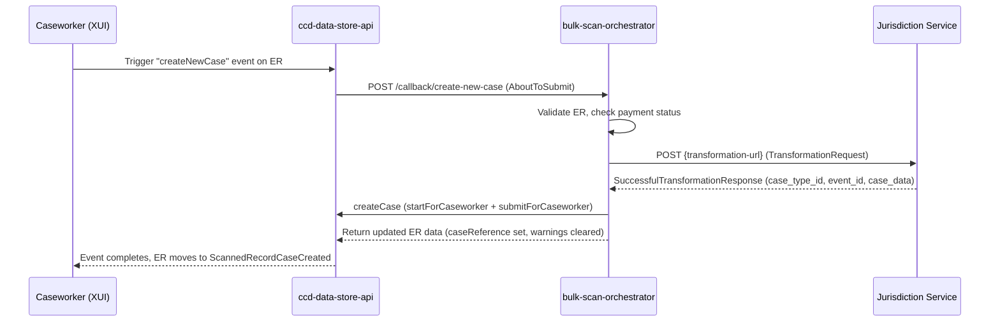

## TL;DR

- Exception records are special CCD case types (`<CONTAINER>_ExceptionRecord`) that hold scanned envelopes which could not be automatically matched to a service case.
- Created automatically by `bulk-scan-orchestrator` when an envelope's classification is `EXCEPTION`, when auto-creation/auto-update fails, when the target case is not found, or when OCR validation returns warnings for a `NEW_APPLICATION`.
- Caseworkers convert exception records into real service cases via the `createNewCase` CCD event, which triggers an about-to-submit callback to the orchestrator, which in turn calls the jurisdiction's `transformation-url`.
- Each jurisdiction defines its own exception-record case type in `bulk-scan-ccd-definitions` (11 definitions total, 8 per-service jurisdictions plus 3 in BULKSCAN).
- The state machine is: `ScannedRecordReceived` then one of `ScannedRecordCaseCreated`, `ScannedRecordAttachedToCase`, `ScannedRecordRejected`, `ScannedRecordManuallyHandled`, or `ScannedRecordJourneyReclassified`.
- Payment status (`awaitingPaymentDCNProcessing`) gates case creation from an exception record — configurable per service via `allow-creating-case-before-payments-are-processed`.

## What is an exception record

When the bulk-scan pipeline cannot process an envelope fully on its own, it creates an **exception record** in CCD. This gives caseworkers a visible work item they can triage, inspect, and ultimately convert into the correct service case type or attach to an existing case.

An exception record is a CCD case type. Its `CaseTypeID` follows the pattern `<CONTAINER_UPPERCASE>_ExceptionRecord` (`CreateExceptionRecord.java:75`), where `CONTAINER` is the Azure Blob Storage container that held the envelope (e.g. `SSCS`, `PROBATE`, `DIVORCE`). Each jurisdiction registers its own exception-record case type in the `bulk-scan-ccd-definitions` repo, meaning the fields, access profiles, and events can vary slightly, but the overall structure and workflow are shared.

## When exception records are created

The orchestrator decides which action to take based on the `Classification` enum carried in the envelope message:

| Classification | Primary action | Falls back to ER when |
|---|---|---|
| `EXCEPTION` | Always creates an exception record | N/A — ER is the primary action |
| `NEW_APPLICATION` | Auto-creates a service case via `transformation-url` | Transformation fails, service not configured, duplicate guard fires, or OCR validation returns warnings |
| `SUPPLEMENTARY_EVIDENCE` | Attaches docs to existing case via `attachScannedDocs` event | Target case not found, or case number not present in envelope |
| `SUPPLEMENTARY_EVIDENCE_WITH_OCR` | Attaches with OCR via `update-url` | Target case not found, update fails, or `auto-case-update-enabled` is `false` |

The complete set of exception record creation rules (from operational documentation):

1. Envelope with **supplementary evidence classification** but no case number — create ER.
2. Envelope with supplementary evidence + case number but case not found in CCD — create ER.
3. Envelope classified as **New Application** containing OCR forms where validation returns warnings — create ER (warnings are visible to caseworker on the record).
4. Classification received from the scanning supplier is **exception** — create ER.
5. Anything outside the happy path (CCD returns error, service not configured, etc.) — create ER.

Before creating an exception record, the orchestrator checks for duplicates by searching for existing ERs with the same `envelopeId` (`CreateExceptionRecord.java:45`). If a duplicate is found, creation is skipped and the existing ER's CCD reference is returned to maintain idempotency.

### Error handling and retries

When the orchestrator encounters a transient error (e.g. CCD returns 502 because a jurisdiction callback failed), it treats the message as potentially recoverable. The Azure Service Bus queue has a **Max Delivery Count of 300**, meaning the orchestrator will retry processing for approximately 24 hours before the message is dead-lettered and the envelope becomes stale. If a jurisdiction service returns an error that CCD wraps as 502 (even if the underlying issue is non-transient, like an invalid email address), the envelope will be retried until it goes stale — a known operational issue.

<!-- CONFLUENCE-ONLY: Max Delivery Count = 300 and ~24h retry window from Confluence investigation FACT-2063, not verified in source -->

## Exception record case data

The CCD `ExceptionRecord` model contains everything the pipeline knows about the scanned envelope. Key fields (from `ExceptionRecordFields.java` and `bulkscan-exception/CaseField.json`):

| Field | Type | Purpose |
|---|---|---|
| `journeyClassification` | Text | Original classification: NEW_APPLICATION, SUPPLEMENTARY_EVIDENCE, EXCEPTION |
| `poBox` | FixedList (`poBoxes`) | PO box the envelope was sent to (jurisdiction-specific values from FixedList) |

<!-- DIVERGENCE: Confluence (page 761298946) defines poBox as Text type, but bulk-scan-ccd-definitions:definitions/bulkscan-exception/data/sheets/CaseField.json shows FieldType=FixedList with FieldTypeParameter=poBoxes. Source wins. -->
| `poBoxJurisdiction` | Text | Jurisdiction identifier |
| `formType` | Text | Form type from envelope metadata |
| `deliveryDate` / `openingDate` | DateTime | Envelope timestamps |
| `scannedDocuments` | Collection(ScannedDocument) | Document images with URLs, control numbers, filenames |
| `scanOCRData` | Collection(KeyValue) | Raw OCR key-value pairs extracted from the form |
| `ocrDataValidationWarnings` | Collection(TextArea) | Warnings from OCR validation |
| `envelopeId` | Text | UUID linking back to the original envelope |
| `containsPayments` | YesOrNo | Whether the envelope included payment documents |
| `awaitingPaymentDCNProcessing` | YesOrNo | Payment processing gate |
| `caseReference` | Text | Populated after successful conversion to a service case |
| `attachToCaseReference` | Text | Populated after successful attach-to-case |
| `displayWarnings` | YesOrNo | Whether to display validation warnings to the caseworker |
| `evidenceHandled` | YesOrNo | Whether supplementary evidence has been handled |
| `searchCaseReference` | Text | Target case reference for search (input field for attach) |
| `searchCaseReferenceType` | FixedList (`ReferenceType`) | `ccdCaseReference` or `externalCaseReference` (legacy ID support) |
| `surname` | Text | Extracted from OCR for workbasket filtering |

The `surname` field is populated from OCR using `form-type-to-surname-ocr-field-mappings` configuration — the OCR field name varies per service (e.g. SSCS uses `person2_last_name`, Probate uses `deceasedSurname`).

### ScannedDocument complex type

Each document in the `scannedDocuments` collection has the following structure (from `ComplexTypes` in the CCD definition):

| Field | Type | Description |
|---|---|---|
| `type` | FixedList (`ScannedDocumentType`) | Document category |
| `subtype` | Text | Service-specific document subtype (e.g. form name) |
| `url` | Document | CDAM document URL |
| `controlNumber` | Text | Document Control Number (DCN) — unique scanning identifier |
| `fileName` | Text | Original file name |
| `scannedDate` | DateTime | When the document was scanned |
| `deliveryDate` | DateTime | When the envelope was delivered |
| `exceptionRecordReference` | Text | Back-reference to ER when doc is moved to a service case |

The `ScannedDocumentType` fixed list values (from `FixedLists.json`):

| Value | Label |
|---|---|
| `cherished` | Cherished |
| `other` | Other |
| `coversheet` | Coversheet |
| `form` | Form |
| `supporting_documents` | Supporting Documents |

<!-- DIVERGENCE: Confluence (page 761298946) lists only 4 types (cherished, other, form, coversheet), but bulk-scan-ccd-definitions:definitions/bulkscan-exception/data/sheets/FixedLists.json shows 5 values including `supporting_documents`. Source wins. -->

## State machine

Exception records move through a simple state machine defined in `State.json`:

```
ScannedRecordReceived          (initial)
    ├── ScannedRecordCaseCreated            (createNewCase succeeded)
    ├── ScannedRecordAttachedToCase         (attachToExistingCase or extendBulkScanCase)
    ├── ScannedRecordRejected               (caseworker rejected)
    ├── ScannedRecordManuallyHandled        (caseworker handled outside pipeline)
    └── ScannedRecordJourneyReclassified    (reclassifyRecord event)
            ├── ScannedRecordAttachedToCase  (extendBulkScanCase after reclassification)
            ├── ScannedRecordRejected        (rejectRecord from reclassified)
            └── ScannedRecordManuallyHandled (updateManually from reclassified)
```

### CCD events

The full event set for the `BULKSCAN_ExceptionRecord` case type (from `CaseEvent.json`):

| Event ID | Name | Pre-state | Post-state | Callback |
|---|---|---|---|---|
| `createException` | Create an exception record | (none) | ScannedRecordReceived | — |
| `attachToExistingCase` | Attach record to existing case | ScannedRecordReceived | ScannedRecordAttachedToCase | `/callback/attach_case` |
| `extendBulkScanCase` | Extend bulk scan case | ScannedRecordJourneyReclassified | ScannedRecordAttachedToCase | `/callback/attach_case` |
| `createNewCase` | Create new case from exception | ScannedRecordReceived | ScannedRecordCaseCreated | `/callback/create-new-case` |
| `rejectRecord` | Reject record | ScannedRecordReceived; Reclassified | ScannedRecordRejected | — |
| `updateManually` | Manually handle record | ScannedRecordReceived; Reclassified | ScannedRecordManuallyHandled | — |
| `completeAwaitingPaymentDCNProcessing` | Complete DCN processing | * | * | — |
| `reclassifyRecord` | Reclassify Journey | ScannedRecordReceived | ScannedRecordJourneyReclassified | `/callback/reclassify-exception-record` |

The `completeAwaitingPaymentDCNProcessing` event can fire from any state (pre-state `*`) and does not change the state — it is used by the payment processor to clear the payment gate without moving the ER through the workflow.

## The conversion flow: CCD event to orchestrator callback to jurisdiction

The most important workflow is converting an exception record into a proper service case. This is a three-party interaction:



### Step by step

1. A caseworker opens the exception record in XUI and triggers the `createNewCase` event.
2. CCD fires the about-to-submit callback to `${CCD_DEF_BULK_SCAN_ORCHESTRATOR_URL}/callback/create-new-case` (configured in the CaseEvent definition, `bulkscan-exception/CaseEvent.json`). Per-jurisdiction definitions should set `RetriesTimeoutURLAboutToSubmitEvent` to 30 seconds (the default 5 seconds is often insufficient for the multi-service-call chain).
3. `CreateCaseCallbackService.process()` validates the callback and checks the payment gate. The payment gate logic (`CreateCaseCallbackService.java`) works as follows:
   - If `awaitingPaymentDCNProcessing == "Yes"` **and** `allow-creating-case-before-payments-are-processed == true` **and** `ignoreWarnings == false`: returns warnings (caseworker can re-submit with "ignore warnings" to proceed).
   - If `awaitingPaymentDCNProcessing == "Yes"` **and** `allow-creating-case-before-payments-are-processed == false`: returns a blocking error — case cannot be created until payments are processed.
   - Otherwise: proceeds to case creation.
4. The orchestrator looks up the `transformation-url` from its per-service YAML configuration. If not configured, the callback fails (`CreateCaseCallbackService.java:149`).
5. `TransformationClient.transformCaseData()` POSTs a `TransformationRequest` to the jurisdiction service's transformation endpoint, including the S2S `ServiceAuthorization` header (`TransformationClient.java:45-46`).
6. The jurisdiction service returns a `SuccessfulTransformationResponse` containing `case_creation_details` (with `case_type_id`, `event_id`, `case_data`) and optionally `warnings`.
7. The orchestrator fetches document hashes from CDAM and injects them into `scannedDocuments[].url.document_hash`.
8. The orchestrator creates the service case in CCD via `startForCaseworker` + `submitForCaseworker`, linking back to the ER via `bulkScanCaseReference` and `bulkScanEnvelopes`.
9. `ExceptionRecordFinalizer.finalizeExceptionRecord()` sets `caseReference = newCaseId` and clears `displayWarnings` / `ocrDataValidationWarnings` on the exception record (`ExceptionRecordFinalizer.java:26-32`).
10. A `callback_result` row is written to PostgreSQL for audit (`CreateCaseCallbackService.java:224-232`).

### The attach-to-case flow

A similar flow exists for attaching an exception record to an existing case:

- Caseworker triggers `attachToExistingCase` event on the ER.
- CCD calls `POST /callback/attach_case`.
- For `SUPPLEMENTARY_EVIDENCE` / `EXCEPTION` classifications, the orchestrator attaches documents directly via the `attachScannedDocs` CCD event.
- For `SUPPLEMENTARY_EVIDENCE_WITH_OCR`, the orchestrator first calls the jurisdiction's `update-url` to let the service transform the OCR data, then fires `attachScannedDocsWithOcr` on the target case (`CcdCaseUpdater.java:85`).
- On success, `ExceptionRecordFinalizer` sets `attachToCaseReference` on the ER.

## The transformation request contract

The `TransformationRequest` sent to the jurisdiction service contains:

| Field | Type | Notes |
|---|---|---|
| `exception_record_id` | String | CCD ID of the ER (null for automated processing) |
| `exception_record_case_type_id` | String | e.g. `SSCS_ExceptionRecord` |
| `envelope_id` | String | Original envelope UUID |
| `is_automated_process` | Boolean | `true` for auto-creation, `false` for manual caseworker flow |
| `po_box` | String | PO box from envelope |
| `po_box_jurisdiction` | String | Jurisdiction identifier |
| `journey_classification` | String | Classification enum value |
| `form_type` | String | Form type |
| `delivery_date` / `opening_date` | LocalDateTime | Timestamps |
| `scanned_documents` | List | Document metadata |
| `ocr_data_fields` | List | OCR key-value pairs |
| `ignore_warnings` | Boolean | Whether the caseworker chose to ignore validation warnings |

The expected response (`SuccessfulTransformationResponse`) must include:

- `case_creation_details.case_type_id` — the CCD case type to create (e.g. `Benefit`)
- `case_creation_details.event_id` — the CCD event to use (e.g. `appealCreated`)
- `case_creation_details.case_data` — the full case data map for the new case
- `warnings` — optional list of strings shown to the caseworker

Legacy fields `id` and `case_type_id` (at the root level) are deprecated aliases still serialised for backward compatibility (`TransformationRequest.java:17-28`).

## OCR validation endpoint

Before creating an exception record (or auto-creating a case), `bulk-scan-processor` can call a per-jurisdiction OCR validation endpoint. This is configured per service via `ocrValidationUrl` in the processor's `application.yaml`. The endpoint follows this contract:

**Request:** `POST /forms/{form-type}/validate-ocr`

```json
{
  "ocr_data_fields": [
    { "name": "appellant_firstName", "value": "John" },
    { "name": "appellant_lastName", "value": "Smith" }
  ]
}
```

**Response:**

```json
{
  "status": "SUCCESS|WARNINGS|ERRORS",
  "warnings": ["not a valid format for email"],
  "errors": ["missing first name for the appellant"]
}
```

| Status | Outcome |
|---|---|
| `SUCCESS` | Envelope proceeds normally (auto-creation or supplementary evidence attachment) |
| `WARNINGS` | Exception record created with warnings visible in `ocrDataValidationWarnings` field |
| `ERRORS` | Envelope rejected; notification sent to scanning supplier (XBP/Exela) |

The endpoint must verify the `ServiceAuthorization` header and allow only the `bulk_scan_processor` S2S service. If the OCR validation feature is not enabled for a service (or the service has not implemented the endpoint), the exception record is created without any validation.

<!-- CONFLUENCE-ONLY: OCR validation error triggers notification to Exela - not verified in source -->

## The update endpoint contract

When attaching an exception record with OCR data to an existing case (`SUPPLEMENTARY_EVIDENCE_WITH_OCR`), the orchestrator calls the jurisdiction's `update-url`:

**Request:** `POST /update-case`

```json
{
  "exception_record": {
    "id": "1234567890123456",
    "case_type_id": "SSCS_ExceptionRecord",
    "po_box": "12345",
    "form_type": "SSCS1",
    "journey_classification": "SUPPLEMENTARY_EVIDENCE_WITH_OCR",
    "delivery_date": "2019-08-01T01:02:03.456Z",
    "opening_date": "2019-08-02T02:03:04.567Z",
    "scanned_documents": [...],
    "ocr_data_fields": [...]
  },
  "case_details": {
    "id": "9876543210987654",
    "case_type_id": "Benefit",
    "case_data": { ... }
  }
}
```

**Response (200):**

```json
{
  "case_update_details": {
    "case_data": { ... }
  },
  "warnings": []
}
```

**Response (422):** Returns `{ "errors": [...], "warnings": [...] }` if the exception record data is invalid.

The service must:
- Preserve the `bulkScanCaseReference` field in the updated case data.
- Add scanned documents from the ER to the case's `scannedDocuments` collection, deduplicated by `controlNumber`.

The orchestrator populates `exceptionRecordReference` on each newly-added scanned document entry before submitting to CCD.

## Service case requirements for integration

Services integrating with bulk scan must add certain fields and events to their own CCD case definition (separate from the exception record definition):

1. **`bulkScanCaseReference`** (Text) — set by the orchestrator when creating a case from an ER; used for idempotency/duplicate detection. The orchestrator searches by this field to prevent creating duplicate cases from the same exception record (`CcdApi.java:50`).
2. **`bulkScanEnvelopes`** (Collection) — holds envelope references linking back to processed envelopes (`ServiceCaseFields.java:13`).
3. **Service case creation event** — the event ID is defined by each service team independently and returned in the transformation response's `case_creation_details.event_id`.
4. **`attachScannedDocsWithOcr`** — standard event for updating an existing case with OCR-bearing supplementary evidence.

The orchestrator authenticates as the caseworker who triggered the action, so the caseworker's IDAM roles must have access to these events in `AuthorisationCaseEvent`.

## Per-jurisdiction definitions

Each jurisdiction defines its exception-record case type in `bulk-scan-ccd-definitions`:

| CaseTypeID | CCD Jurisdiction | Notable differences |
|---|---|---|
| `BULKSCAN_ExceptionRecord` | BULKSCAN | Full event set including reclassification |
| `BULKSCANAUTO_ExceptionRecord` | BULKSCAN | Auto-mode variant, same callbacks |
| `SSCS_ExceptionRecord` | SSCS | Extra `state` field; retry timeout on `createNewCase` (30s) |
| `PROBATE_ExceptionRecord` | PROBATE | Has `extendCaveatCase` event; `attachToExistingCase` allowed from Rejected state |
| `CMC_ExceptionRecord` | CMC | No `createNewCase` event (attach only) |
| `DIVORCE_ExceptionRecord` | DIVORCE | Standard event set |
| `FINREM_ExceptionRecord` | DIVORCE | Shares DIVORCE CCD jurisdiction |
| `NFD_ExceptionRecord` | DIVORCE | Shares DIVORCE CCD jurisdiction |
| `PUBLICLAW_ExceptionRecord` | PUBLICLAW | No `createNewCase` event |
| `PRIVATELAW_ExceptionRecord` | PRIVATELAW | `createNewCase` added October 2024 |

All exception-record events reference the same three orchestrator callback paths:
- `/callback/create-new-case`
- `/callback/attach_case`
- `/callback/reclassify-exception-record`

The base URL is injected at build time via `${CCD_DEF_BULK_SCAN_ORCHESTRATOR_URL}`.

## Configuration in the orchestrator

The orchestrator's `service-config.services` YAML drives which jurisdictions can use which flows:

| Config key | Purpose | Effect if absent/false |
|---|---|---|
| `transformation-url` | Jurisdiction endpoint for converting ER to service case | `createNewCase` callback fails with "Transformation URL is not configured" |
| `update-url` | Jurisdiction endpoint for OCR-based case update | `SUPPLEMENTARY_EVIDENCE_WITH_OCR` attach callback cannot proceed |
| `auto-case-creation-enabled` | Whether `NEW_APPLICATION` envelopes auto-create cases without caseworker | ER is created for caseworker to handle manually |
| `auto-case-update-enabled` | Whether `SUPPLEMENTARY_EVIDENCE_WITH_OCR` envelopes auto-update cases | ER is created instead of auto-updating |
| `allow-creating-case-before-payments-are-processed` | Relaxes the payment gate | When `true` and payments pending, shows a warning (caseworker can override); when `false`, blocks case creation entirely |

Services currently configured (from `application.yaml`):

| Service | `transformation-url` | `update-url` | `allow-before-payments` |
|---|---|---|---|
| BULKSCAN | Yes | Yes | Yes |
| BULKSCANAUTO | Yes | Yes | Yes |
| SSCS | Yes | — | — |
| PROBATE | Yes | Yes | Yes |
| DIVORCE | Yes | — | Yes |
| FINREM | Yes | — | Yes |
| CMC | — | — | — |
| PUBLICLAW | — | — | — |
| NFD | Yes | — | Yes |
| PRIVATELAW | Yes | — | Yes |

If a service has no `transformation-url` configured, caseworkers cannot convert exception records into service cases for that jurisdiction. The `getServiceConfig` method in `CreateCaseCallbackService` validates this and returns an error early (`CreateCaseCallbackService.java:127-131`).

## Payment interaction with exception records

When an envelope contains payments (cheques, postal orders, cash), the `bulk-scan-payment-processor` creates payment records in Pay Hub. The interaction with exception records is:

1. **On ER creation:** If the envelope `containsPayments == "Yes"`, the field `awaitingPaymentDCNProcessing` is set to `"Yes"` on the exception record. This gates further case creation until the payment processor completes.
2. **Payment processing completes:** The payment processor fires the `completeAwaitingPaymentDCNProcessing` event on the ER, clearing the gate (setting `awaitingPaymentDCNProcessing` to `"No"`).
3. **On case creation from ER:** The orchestrator publishes a payment update message so Pay Hub can re-allocate the payment from the exception record to the newly created service case.

If document validation fails but cheque/payment validation passes at the processor level, a potential orphan payment may exist in Pay Hub without a corresponding case or exception record reference. This is a known edge case documented in operational runbooks.

<!-- CONFLUENCE-ONLY: orphan payment scenario (doc fails, cheque passes) from Confluence page 1102579002, not verified in source -->

## Onboarding a new jurisdiction

To add a new service to bulk scan exception record handling, the following changes are required:

1. **`bulk-scan-processor`:** Add SAS token config, container config, IDAM user credentials, and (for Phase 2) OCR validation URL.
2. **`bulk-scan-orchestrator`:** Add service entry in `application.yaml` with jurisdiction, service name, and (for Phase 2) `transformation-url`, `auto-case-creation-enabled`, and `auto-case-update-enabled`.
3. **`bulk-scan-payment-processor`:** Create keyvault secret for the service's Payment Site ID; configure PO Box to Site ID mapping.
4. **`bulk-scan-ccd-definitions`:** Create or update the exception record CCD definition for the new jurisdiction.
5. **IDAM:** Create a bulk scan system-update user for the service (request from IDAM team for non-prod; ServiceNow ticket for production).
6. **Service team:** Add `bulkScanCaseReference` field, `attachScannedDocsWithOcr` event, and implement transformation/update/OCR-validation endpoints.

Exception record CCD definitions are maintained by the BSP team in `bulk-scan-ccd-definitions`. Production uploads require a Jira ticket.

## Examples

### CaseEvent.json — BULKSCAN_ExceptionRecord event definitions

The CCD event definitions for the `BULKSCAN_ExceptionRecord` case type. Callback URLs are injected at build time via `${CCD_DEF_BULK_SCAN_ORCHESTRATOR_URL}`:

```json
// Source: apps/bulk-scan/bulk-scan-ccd-definitions/definitions/bulkscan-exception/data/sheets/CaseEvent.json
[
  {
    "LiveFrom": "01/01/2018",
    "CaseTypeID": "BULKSCAN_ExceptionRecord",
    "ID": "createException",
    "Name": "Create an exception record",
    "PostConditionState": "ScannedRecordReceived",
    "SecurityClassification": "Public"
  },
  {
    "LiveFrom": "01/01/2018",
    "CaseTypeID": "BULKSCAN_ExceptionRecord",
    "ID": "attachToExistingCase",
    "Name": "Attach record to existing case",
    "PreConditionState(s)": "ScannedRecordReceived",
    "PostConditionState": "ScannedRecordAttachedToCase",
    "CallBackURLAboutToSubmitEvent": "${CCD_DEF_BULK_SCAN_ORCHESTRATOR_URL}/callback/attach_case",
    "SecurityClassification": "Public"
  },
  {
    "LiveFrom": "01/01/2018",
    "CaseTypeID": "BULKSCAN_ExceptionRecord",
    "ID": "createNewCase",
    "Name": "Create new case from exception",
    "PreConditionState(s)": "ScannedRecordReceived",
    "PostConditionState": "ScannedRecordCaseCreated",
    "CallBackURLAboutToSubmitEvent": "${CCD_DEF_BULK_SCAN_ORCHESTRATOR_URL}/callback/create-new-case",
    "SecurityClassification": "Public"
  },
  {
    "LiveFrom": "01/01/2018",
    "CaseTypeID": "BULKSCAN_ExceptionRecord",
    "ID": "completeAwaitingPaymentDCNProcessing",
    "Name": "Complete DCN processing",
    "PreConditionState(s)": "*",
    "PostConditionState": "*",
    "SecurityClassification": "Public"
  },
  {
    "LiveFrom": "30/03/2020",
    "CaseTypeID": "BULKSCAN_ExceptionRecord",
    "ID": "reclassifyRecord",
    "Name": "Reclassify Journey",
    "PreConditionState(s)": "ScannedRecordReceived",
    "CallBackURLAboutToSubmitEvent": "${CCD_DEF_BULK_SCAN_ORCHESTRATOR_URL}/callback/reclassify-exception-record",
    "PostConditionState": "ScannedRecordJourneyReclassified",
    "SecurityClassification": "Public"
  }
]
```

### CaseField.json — core exception record fields

A selection of the key fields defined on `BULKSCAN_ExceptionRecord`. All fields use `SecurityClassification: PUBLIC`:

```json
// Source: apps/bulk-scan/bulk-scan-ccd-definitions/definitions/bulkscan-exception/data/sheets/CaseField.json
[
  {
    "LiveFrom": "01/01/2018",
    "CaseTypeID": "BULKSCAN_ExceptionRecord",
    "ID": "journeyClassification",
    "Label": "Journey Classification",
    "FieldType": "Text",
    "SecurityClassification": "PUBLIC"
  },
  {
    "LiveFrom": "01/01/2018",
    "CaseTypeID": "BULKSCAN_ExceptionRecord",
    "ID": "poBox",
    "Label": "POBox",
    "FieldType": "FixedList",
    "FieldTypeParameter": "poBoxes",
    "SecurityClassification": "PUBLIC"
  },
  {
    "LiveFrom": "01/01/2018",
    "CaseTypeID": "BULKSCAN_ExceptionRecord",
    "ID": "scannedDocuments",
    "Label": "Scanned Documents",
    "FieldType": "Collection",
    "FieldTypeParameter": "ScannedDocument",
    "SecurityClassification": "PUBLIC"
  },
  {
    "LiveFrom": "01/01/2018",
    "CaseTypeID": "BULKSCAN_ExceptionRecord",
    "ID": "scanOCRData",
    "Label": "Form OCR Data",
    "FieldType": "Collection",
    "FieldTypeParameter": "KeyValue",
    "SecurityClassification": "PUBLIC"
  },
  {
    "LiveFrom": "01/01/2018",
    "CaseTypeID": "BULKSCAN_ExceptionRecord",
    "ID": "awaitingPaymentDCNProcessing",
    "Label": "Awaiting payment DCN processing",
    "FieldType": "YesOrNo",
    "SecurityClassification": "PUBLIC"
  }
]
```

### FixedLists.json — ScannedDocumentType and ReferenceType values

```json
// Source: apps/bulk-scan/bulk-scan-ccd-definitions/definitions/bulkscan-exception/data/sheets/FixedLists.json
[
  { "ID": "ScannedDocumentType", "ListElementCode": "cherished",            "ListElement": "Cherished" },
  { "ID": "ScannedDocumentType", "ListElementCode": "other",                "ListElement": "Other" },
  { "ID": "ScannedDocumentType", "ListElementCode": "coversheet",           "ListElement": "Coversheet" },
  { "ID": "ScannedDocumentType", "ListElementCode": "form",                 "ListElement": "Form" },
  { "ID": "ScannedDocumentType", "ListElementCode": "supporting_documents", "ListElement": "Supporting Documents" },
  { "ID": "ReferenceType",       "ListElementCode": "ccdCaseReference",     "ListElement": "CCD Case Reference" },
  { "ID": "ReferenceType",       "ListElementCode": "externalCaseReference","ListElement": "Legacy Case Reference" }
]
```

### TransformationRequest.java — the contract sent to jurisdiction services

The Java model that is serialised and POSTed to a jurisdiction's `transformation-url`:

```java
// Source: apps/bulk-scan/bulk-scan-orchestrator/src/main/java/uk/gov/hmcts/reform/bulkscan/orchestrator/client/transformation/model/request/TransformationRequest.java
public class TransformationRequest {

    /** @deprecated Use {@link #exceptionRecordId} */
    @Deprecated
    public final String id;

    @JsonProperty("exception_record_id")
    public final String exceptionRecordId;

    /** @deprecated Use {@link #exceptionRecordCaseTypeId} */
    @Deprecated
    @JsonProperty("case_type_id")
    public final String caseTypeId;

    @JsonProperty("exception_record_case_type_id")
    public final String exceptionRecordCaseTypeId;

    @JsonProperty("envelope_id")
    public final String envelopeId;

    @JsonProperty("is_automated_process")
    public final boolean isAutomatedProcess;

    @JsonProperty("po_box")
    public final String poBox;

    @JsonProperty("po_box_jurisdiction")
    public final String poBoxJurisdiction;

    @JsonProperty("journey_classification")
    public final Classification journeyClassification;

    @JsonProperty("form_type")
    public final String formType;

    @JsonProperty("delivery_date")
    public final LocalDateTime deliveryDate;

    @JsonProperty("opening_date")
    public final LocalDateTime openingDate;

    @JsonProperty("scanned_documents")
    public final List<ScannedDocument> scannedDocuments;

    @JsonProperty("ocr_data_fields")
    public final List<OcrDataField> ocrDataFields;

    @JsonProperty("ignore_warnings")
    public final boolean ignoreWarnings;
}
```

## See also

- [Orchestration Flow](orchestration-flow.md) — how the orchestrator decides when to create an exception record versus a service case
- [API Orchestrator Reference](../reference/api-orchestrator.md) — full transformation-url and update-url contract specification
- [Payment Handling](payment-handling.md) — how the `awaitingPaymentDCNProcessing` gate interacts with payment processing
- [How to Onboard a New Jurisdiction](../how-to/onboard-new-jurisdiction.md) — steps to define an Exception Record case type and implement callback endpoints
