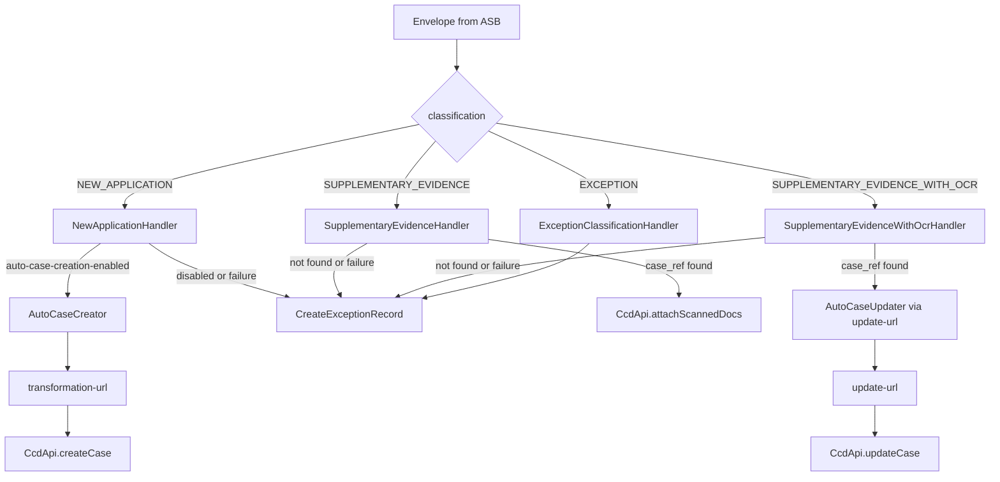

## TL;DR

- `bulk-scan-orchestrator` consumes envelope messages from the Azure Service Bus `envelopes` queue and writes cases or exception records into CCD, then signals completion back to `bulk-scan-processor` via the `processed-envelopes` queue.
- Four envelope classifications drive the outcome: `NEW_APPLICATION` (auto-create case), `SUPPLEMENTARY_EVIDENCE` (attach docs to existing case), `SUPPLEMENTARY_EVIDENCE_WITH_OCR` (update existing case via service callback), `EXCEPTION` (always creates an exception record).
- Jurisdiction-specific behaviour is entirely config-driven via `ServiceConfigItem`: each service declares a `transformation-url`, optional `update-url`, and boolean flags (`auto-case-creation-enabled`, `auto-case-update-enabled`, `search-cases-by-envelope-id`, etc.). The orchestrator contains no per-jurisdiction business logic.
- A parallel callback path exists where caseworkers trigger CCD events ("Create New Case", "Attach to Case") on exception records, which call back into the orchestrator to invoke the same transformation/update endpoints.
- Retry is layered: the SUPPLEMENTARY_EVIDENCE_WITH_OCR handler has its own `MAX_RETRIES = 2` before falling back to exception record; the ASB queue retries up to `max-delivery-count` (300 in production, ~24 hours) before dead-lettering.
- The completion message to `processed-envelopes` carries the CCD case ID and the action taken (e.g. `AUTO_CREATED_CASE`, `EXCEPTION_RECORD`), enabling `bulk-scan-processor` to delete the source blob.

## Envelope consumption from Azure Service Bus

The orchestrator connects to the `envelopes` ASB queue using `ServiceBusProcessorClient` in PEEK_LOCK mode with auto-complete disabled (`QueueClientsConfig.java:32-45`). The processor client is started on application boot via `@PostConstruct` in `EnvelopesQueueConsumeTask` (`EnvelopesQueueConsumeTask.java:28`), and a `@Scheduled` health-check task polls whether the processor is still running.

When a message arrives, `EnvelopeMessageProcessor.processMessage()` (`EnvelopeMessageProcessor.java:58-69`) handles it:

1. **Heartbeat messages** (subject == `"heartbeat"`) are completed immediately without processing.
2. The message body is deserialised to an `Envelope` via `EnvelopeParser` (uses `ACCEPT_CASE_INSENSITIVE_ENUMS`).
3. Processing is delegated to `EnvelopeHandler.handleEnvelope()` based on the envelope's `classification`.
4. On success, `ProcessedEnvelopeNotifier.notify()` is called and the ASB message is completed.

Error handling follows three paths:

| Scenario | Outcome |
|----------|---------|
| `InvalidMessageException` (malformed JSON) | Message is dead-lettered immediately (`EnvelopeMessageProcessor.java:90-92`) |
| Any other exception | Message lock expires, ASB requeues. After `max-delivery-count` attempts the message is dead-lettered |
| `NotificationSendingException` (completion signal fails) | Same as above -- envelope will be reprocessed |

The `Envelope` model carries: `id`, `case_ref`, `previous_service_case_ref`, `po_box`, `jurisdiction`, `container`, `zip_file_name`, `form_type`, `delivery_date`, `opening_date`, `classification`, `documents`, `payments`, `ocr_data`, `ocr_data_validation_warnings`.

A JMS/ActiveMQ alternative transport exists (class `JmsReceivers`), activated only when `jms.enabled=true`. It is disabled by default.

## The three CCD outcomes

The `classification` field on the envelope determines which handler runs and therefore which CCD action is attempted. Each handler can fall back to exception record creation on failure.



### Case creation (NEW_APPLICATION)

`AutoCaseCreator.createCase()` (`AutoCaseCreator.java:50`):

1. Checks `auto-case-creation-enabled` in service config.
2. Searches CCD for existing cases by envelope ID to prevent duplicates.
3. Calls the service's `transformation-url` to get case data (see below).
4. Fetches document hashes from CDAM for each scanned document (`AutoCaseCreator.java:96-116`).
5. Calls `CcdApi.createCase()` which executes `startForCaseworker` + `submitForCaseworker` (`CcdApi.java:358`).
6. Sets `bulkScanEnvelopes` collection entry `{id: envelopeId, action: CREATE}` on the case data.

If auto-creation is disabled or transformation fails with an unrecoverable error, the handler falls back to creating an exception record.

### Case attachment (SUPPLEMENTARY_EVIDENCE)

For `SUPPLEMENTARY_EVIDENCE` envelopes with a `case_ref`, the handler fires the CCD event `attachScannedDocs` directly on the existing case (`CcdApi.attachScannedDocs()` at `CcdApi.java:289`). No `update-url` callback is involved -- this is a simple document-append operation.

### Case update (SUPPLEMENTARY_EVIDENCE_WITH_OCR)

`SupplementaryEvidenceWithOcrHandler.handle()` (`SupplementaryEvidenceWithOcrHandler.java:37`):

1. Checks `autoCaseUpdateEnabled` in service config -- if disabled, falls back directly to exception record creation.
2. Calls `AutoCaseUpdater.updateCase()` which hits the service's `update-url` (because OCR data requires service-specific processing).
3. On success, applies the returned case data via `CcdApi.updateCase()` (`CcdApi.java:434`). The CCD event used is `attachScannedDocsWithOcr`.
4. On error, the handler has its own retry limit: `MAX_RETRIES = 2` (`SupplementaryEvidenceWithOcrHandler.java:18`). If `deliveryCount < 2`, a `CaseUpdateException` is thrown (message requeued). After 2 attempts, the handler abandons the update and creates an exception record instead.
5. On `ABANDONED` result (e.g. case not found, or update impossible), creates an exception record without further retries.

### Exception record creation

`CreateExceptionRecord.tryCreateFrom()` (`CreateExceptionRecord.java:45`):

1. Searches CCD for existing ERs by envelope ID (idempotency guard).
2. Maps envelope fields to the `ExceptionRecord` CCD model.
3. Creates the ER using CCD event `createException` on case type `<CONTAINER_UPPER>_ExceptionRecord` (e.g. `SSCS_ExceptionRecord`).

The ER contains all envelope data (OCR fields, scanned documents, form type, PO box, jurisdiction, delivery/opening dates) so a caseworker can review and manually convert it later.

## The transformation-url callback

When the orchestrator needs to create a service case (either automatically or via caseworker action on an ER), it POSTs to the jurisdiction's configured `transformation-url`.

**Request** (`TransformationRequest`):

| Field | Type | Notes |
|-------|------|-------|
| `exception_record_id` | String | null for automated processing |
| `exception_record_case_type_id` | String | null for automated processing |
| `envelope_id` | String | Always present |
| `is_automated_process` | boolean | true = from queue, false = from caseworker |
| `po_box` | String | |
| `po_box_jurisdiction` | String | |
| `journey_classification` | String | |
| `form_type` | String | |
| `delivery_date` | LocalDateTime | |
| `opening_date` | LocalDateTime | |
| `scanned_documents` | List | |
| `ocr_data_fields` | List | |
| `ignore_warnings` | boolean | Always true for automated; from callback otherwise |

The deprecated aliases `id` and `case_type_id` are still serialised for backward compatibility (`TransformationRequest.java:17-28`).

**Response** (`SuccessfulTransformationResponse`):

| Field | Type | Required |
|-------|------|----------|
| `case_creation_details.case_type_id` | String | Yes |
| `case_creation_details.event_id` | String | Yes |
| `case_creation_details.case_data` | Map | Yes |
| `warnings` | List | No |
| `supplementary_data` | Map<String, Map<String, Object>> | No (SSCS only) |

The response is validated with Jakarta Bean Validation; a `ConstraintViolationException` is treated as an unrecoverable failure.

`TransformationClient` uses `RestTemplate` (not Feign) and adds the `ServiceAuthorization` S2S header (`TransformationClient.java:45-46`). Errors are categorised: 400/422 responses become `UNRECOVERABLE` failures (envelope falls through to ER); all other exceptions become `POTENTIALLY_RECOVERABLE` (message requeued).

## The update-url callback

When attaching `SUPPLEMENTARY_EVIDENCE_WITH_OCR` to an existing case (automated or callback), the orchestrator POSTs to the service's `update-url`.

**Request** (`CaseUpdateRequest`):

| Field | Type | Notes |
|-------|------|-------|
| `is_automated_process` | boolean | true from queue, false from ER callback |
| `case_update_details` | Object | Envelope/ER data (new format) |
| `case_details` | Object | Existing case (id, case_type_id, case_data) |
| `exception_record` | Object | Deprecated outer wrapper, still sent |

The `exception_record` field is marked `forRemoval = true` pending client migration (`CaseUpdateRequest.java:7-8`).

**Response** (`SuccessfulUpdateResponse`):

| Field | Type | Required |
|-------|------|----------|
| `case_update_details.event_id` | String | Yes |
| `case_update_details.case_data` | Map | Yes |
| `warnings` | List | No |

Note the naming inconsistency: the response field `caseDetails` maps from JSON key `case_update_details`, not `case_details`.

`CaseUpdateDataClient` similarly uses `RestTemplate` with S2S auth (`CaseUpdateDataClient.java:39-68`). The `update-url` must be configured for the service; if absent, `SUPPLEMENTARY_EVIDENCE_WITH_OCR` attach callbacks will fail (`SupplementaryEvidenceWithOcrUpdater.java:46-47`).

## The caseworker callback path

Independently of the automated queue processing, caseworkers can trigger CCD events on exception records that call back into the orchestrator:

### Create New Case callback

**Endpoint**: `POST /callback/create-new-case`

Triggered by CCD event `createNewCase` on an exception record. `CreateCaseCallbackService.process()`:

1. Validates the callback and checks `transformation-url` is configured (`CreateCaseCallbackService.java:149`).
2. Checks payment gating: if `awaitingPaymentDCNProcessing == "Yes"` and `allow-creating-case-before-payments-are-processed` is false, returns an error. If the config allows it, returns a warning the caseworker can override with `ignoreWarnings = true` (`CreateCaseCallbackService.java:161-169`).
3. Calls `CcdNewCaseCreator.createNewCase()` which hits the `transformation-url`.
4. Fetches CDAM document hashes and creates the service case in CCD.
5. Sets `bulkScanCaseReference` (= exception record ID) and `bulkScanEnvelopes` on the new case (`CcdNewCaseCreator.java:248, 253`).
6. `ExceptionRecordFinalizer` updates the ER: sets `caseReference = newCaseId`, clears `displayWarnings` and `ocrDataValidationWarnings` (`ExceptionRecordFinalizer.java:26-32`).
7. Writes a `callback_result` row to PostgreSQL for audit (`CreateCaseCallbackService.java:224-232`).

### Attach to Case callback

**Endpoint**: `POST /callback/attach_case`

Triggered by CCD event `attachToExistingCase`. `AttachToCaseCallbackService.process()`:

- For `SUPPLEMENTARY_EVIDENCE` / `EXCEPTION` classification: directly attaches documents via `attachScannedDocs` event.
- For `SUPPLEMENTARY_EVIDENCE_WITH_OCR`: calls the service's `update-url` first, then applies updates via `attachScannedDocsWithOcr` CCD event (`CcdCaseUpdater.java:85`).

On success, `ExceptionRecordFinalizer` sets `attachToCaseReference` on the ER. A `callback_result` row is persisted (`ExceptionRecordAttacher.java:235-239`).

The updater skips the operation if all ER documents are already present on the target case (`CcdCaseUpdater.java:257-271`).

## Completion signal back to processor

After successful CCD action, `ProcessedEnvelopeNotifier.notify()` sends a message to the `processed-envelopes` ASB queue (`ProcessedEnvelopeNotifier.java:39-57`):

```json
{
  "envelope_id": "<uuid>",
  "ccd_id": "<ccd-case-id>",
  "envelope_ccd_action": "AUTO_CREATED_CASE"
}
```

The message ID is set to `envelopeId` (`ProcessedEnvelopeNotifier.java:46`) and content-type is `application/json`.

**Action mapping**:

| Classification / Outcome | `envelope_ccd_action` value |
|--------------------------|---------------------------|
| `NEW_APPLICATION` auto-created | `AUTO_CREATED_CASE` |
| `SUPPLEMENTARY_EVIDENCE` attached | `AUTO_ATTACHED_TO_CASE` |
| `SUPPLEMENTARY_EVIDENCE_WITH_OCR` updated | `AUTO_UPDATED_CASE` |
| Any fallback to exception record | `EXCEPTION_RECORD` |

`bulk-scan-processor` reads this queue to trigger deletion of the source blob from Azure Blob Storage. The queue is write-only from the orchestrator's perspective.

If `notify()` throws `NotificationSendingException`, it propagates up as `POTENTIALLY_RECOVERABLE_FAILURE` -- the entire envelope message is requeued for reprocessing. This means the CCD operation may have already succeeded, so idempotency guards (envelope ID search) are critical to preventing duplicates on retry.

## Per-service configuration

Each jurisdiction is registered in `application.yaml` under `service-config.services[]`. The orchestrator contains no per-jurisdiction business logic -- all behaviour differences are driven by these config properties (`ServiceConfigItem.java`):

| Property | Type | Default | Purpose |
|----------|------|---------|---------|
| `service` | String | required | Maps to the blob-storage container name (e.g. `sscs`, `probate`, `nfd`) |
| `jurisdiction` | String | required | CCD jurisdiction key |
| `transformation-url` | String | null | Endpoint for NEW_APPLICATION case transformation |
| `update-url` | String | null | Endpoint for SUPPLEMENTARY_EVIDENCE_WITH_OCR case update |
| `case-type-ids` | List | required | CCD case type IDs to search across when finding existing cases |
| `auto-case-creation-enabled` | boolean | false | Gates automatic case creation for NEW_APPLICATION envelopes |
| `auto-case-update-enabled` | boolean | false | Gates automatic case update for SUPPLEMENTARY_EVIDENCE_WITH_OCR |
| `case-definition-has-envelope-ids` | boolean | false | Whether to append envelope references to case data; if false, envelope refs are set to null |
| `search-cases-by-envelope-id` | boolean | false | Whether to search CCD by envelope ID as a second idempotency check (after ER ID search) during `/create-new-case` callback |
| `allow-creating-case-before-payments-are-processed` | boolean | false | Permits case creation callback even when payments are pending |
| `allow-attaching-to-case-before-payments-are-processed-for-classifications` | List | empty | Which classifications may attach to a case before payment DCNs are processed |
| `form-type-to-surname-ocr-field-mappings` | List | empty | Maps form types to OCR field names containing the appellant surname (used to populate the `surname` field on exception records for easier search) |
| `supplementary-data-enabled` | boolean | false | Whether `supplementary_data` from transformation response is forwarded to CCD |

Currently configured services (as of source): `bulkscan`, `bulkscanauto`, `sscs`, `probate`, `divorce`, `finrem`, `cmc`, `publiclaw`, `nfd`, `privatelaw`.

## Exception record creation: business rules

Exception records are created whenever the happy path cannot be completed. The full set of triggering conditions, confirmed by both source and the HLD:

1. **Supplier classification = EXCEPTION** -- the scanning supplier (XBP/Exela) flagged the envelope as unprocessable (e.g. form received for wrong jurisdiction). The `ExceptionClassificationHandler` always creates an ER.
2. **SUPPLEMENTARY_EVIDENCE but no `case_ref`** -- citizen forgot the coversheet or omitted the case reference.
3. **SUPPLEMENTARY_EVIDENCE with `case_ref` not found in CCD** -- incorrect or invalid case reference on the coversheet.
4. **NEW_APPLICATION with auto-case-creation disabled** -- the service has opted out of automatic processing.
5. **NEW_APPLICATION where transformation-url returns 400/422** (unrecoverable) -- service-side validation rejected the OCR data (e.g. warnings present). The transformation response's `warnings` list is stored on the ER for caseworker review.
6. **SUPPLEMENTARY_EVIDENCE_WITH_OCR with auto-case-update disabled** -- falls through to ER immediately.
7. **SUPPLEMENTARY_EVIDENCE_WITH_OCR where update fails after MAX_RETRIES (2)** -- handler exhausts retries before the message hits queue max delivery count.
8. **Any unhandled failure in attachment/creation** -- anything outside the happy path results in an ER.
<!-- CONFLUENCE-ONLY: Exception record rule "anything outside the happy path, create an exception" is stated in Confluence (RBS page 1638182762) but the code paths above cover specific scenarios. The general principle is confirmed by the fallback patterns in each handler. -->

### Surname extraction for exception records

When creating an exception record, `ExceptionRecordMapper` extracts the applicant surname from OCR data using the `formTypeToSurnameOcrFieldMappings` configuration. For example, SSCS maps form type `sscs1` to fields `person2_last_name` and `person1_last_name`; Probate maps `PA1P` to `deceasedSurname`. The extracted surname is stored on the ER's `surname` CCD field to enable caseworker workbasket search without opening each record.

## Dead-letter queue and retry behaviour

The orchestrator implements a layered retry strategy:

1. **Per-handler retry (case update only)**: `SupplementaryEvidenceWithOcrHandler` has `MAX_RETRIES = 2`. If the case update fails with a recoverable error, the handler throws `CaseUpdateException` to trigger redelivery. After 2 delivery attempts, it abandons and creates an exception record instead of continuing to retry.

2. **Queue-level retry**: The `envelopes` ASB queue has a configurable `max-delivery-count` (env var `ENVELOPES_QUEUE_MAX_DELIVERY_COUNT`). In production this is set to 300, meaning the orchestrator will attempt processing for approximately 24 hours before dead-lettering the message. `EnvelopeMessageProcessor` explicitly dead-letters when `deliveryCount >= maxDeliveryCount` rather than letting ASB handle it, providing a structured dead-letter reason.

3. **DLQ cleanup task**: A scheduled task `CleanupEnvelopesDlqTask` (conditional on `scheduling.task.delete-envelopes-dlq-messages.enabled`) periodically purges old messages from the envelopes dead-letter sub-queue based on a configurable TTL. This prevents unbounded DLQ growth.

**Stale envelope problem**: When a downstream service (e.g. Probate) returns an error that CCD wraps as 502, the orchestrator sees it as `POTENTIALLY_RECOVERABLE_FAILURE` and retries the full 300 times. The root cause can be a transient issue (temporary outage) or a permanent one (invalid data causing a 503 from the service). Since CCD normalises all 4xx/5xx from callbacks into CallbackException (returning 502 to the orchestrator), the orchestrator cannot distinguish recoverable from permanent failures at the CCD boundary.
<!-- CONFLUENCE-ONLY: The "300 retries = 24 hours" explanation and the stale envelope problem are documented in Confluence (FACT-2063 investigation, page 1638182762) but are operational knowledge not directly expressed in source code. -->

## Authentication and cross-cutting concerns

- **S2S tokens**: `ServiceAuthorization` header on all outbound calls. Service name is `bulk_scan_orchestrator`.
- **IDAM per-jurisdiction**: `CcdAuthenticatorFactory` caches a `bulkscan` system-user authenticator per jurisdiction. On 401/403 from CCD, the cached token is evicted (`CcdApi.java:591-594`).
- **CDAM document hashes**: Both auto-creation and callback-creation paths fetch current document hashes from CDAM before submitting to CCD.
- **Payments**: `PaymentsService` is called after every successful CCD action, but errors are swallowed (logged only) -- payment failures never block the primary case operation.
- **Supplementary data**: The `supplementary_data` field from transformation responses is only forwarded to CCD if `supplementaryDataEnabled` is true in service config (`CcdNewCaseCreator.java:203`).

## Examples

### Per-service configuration (application.yaml — orchestrator)

How each jurisdiction is registered in the orchestrator. The SSCS entry shows `form-type-to-surname-ocr-field-mappings`, the Probate entry shows `update-url` configuration:

```yaml
// Source: apps/bulk-scan/bulk-scan-orchestrator/src/main/resources/application.yaml
service-config:
  services:
    - service: sscs
      jurisdiction: SSCS
      transformation-url: ${TRANSFORMATION_URL_SSCS}
      case-type-ids:
        - Benefit
      form-type-to-surname-ocr-field-mappings:
        - formType: SSCS1
          ocrFields:
            - person2_last_name
            - person1_last_name
        - formType: SSCS1PE
          ocrFields:
            - person2_last_name
            - person1_last_name
      auto-case-creation-enabled: ${AUTO_CASE_CREATION_ENABLED_SSCS}
      auto-case-update-enabled: ${AUTO_CASE_UPDATE_ENABLED_SSCS}
      case-definition-has-envelope-ids: ${CASE_DEFINITION_HAS_ENVELOPE_IDS_SSCS}
      search-cases-by-envelope-id: ${CAN_SEARCH_CASES_BY_ENVELOPE_ID_SSCS}
      supplementary-data-enabled: ${SUPPLEMENTARY_DATA_ENABLED_SSCS}

    - service: probate
      jurisdiction: PROBATE
      transformation-url: ${TRANSFORMATION_URL_PROBATE}
      update-url: ${UPDATE_URL_PROBATE}
      form-type-to-surname-ocr-field-mappings:
        - formType: PA1P
          ocrFields:
            - deceasedSurname
      case-type-ids:
        - GrantOfRepresentation
        - Caveat
        - StandingSearch
        - WillLodgement
      allow-creating-case-before-payments-are-processed: true
      auto-case-creation-enabled: ${AUTO_CASE_CREATION_ENABLED_PROBATE}
      auto-case-update-enabled: ${AUTO_CASE_UPDATE_ENABLED_PROBATE}
      case-definition-has-envelope-ids: ${CASE_DEFINITION_HAS_ENVELOPE_IDS_PROBATE}
      search-cases-by-envelope-id: ${CAN_SEARCH_CASES_BY_ENVELOPE_ID_PROBATE}
```

### EnvelopeMessageProcessor — ASB message processing entry point

The core message-handling method. Heartbeat messages are completed immediately; all other messages are deserialised and routed to `EnvelopeHandler`:

```java
// Source: apps/bulk-scan/bulk-scan-orchestrator/src/main/java/uk/gov/hmcts/reform/bulkscan/orchestrator/services/servicebus/domains/envelopes/EnvelopeMessageProcessor.java
public void processMessage(ServiceBusReceivedMessageContext context) {
    ServiceBusReceivedMessage message = context.getMessage();

    if (message != null) {
        log.info("Started processing message with ID {}", message.getMessageId());
        MessageProcessingResult result = process(message);
        tryFinaliseProcessedMessage(context, result);
    }
}

private MessageProcessingResult process(ServiceBusReceivedMessage message) {
    if (Objects.equals(message.getSubject(), HEARTBEAT_LABEL)) {
        log.info("Heartbeat message received");
        return new MessageProcessingResult(SUCCESS);
    } else {
        try {
            Envelope envelope = parse(message.getBody().toBytes());
            EnvelopeProcessingResult result =
                envelopeHandler.handleEnvelope(envelope, message.getDeliveryCount());
            processedEnvelopeNotifier.notify(
                envelope.id,
                result.ccdId,
                result.envelopeCcdAction
            );
            return new MessageProcessingResult(SUCCESS);
        } catch (InvalidMessageException ex) {
            // malformed JSON — dead-letter immediately
            return new MessageProcessingResult(UNRECOVERABLE_FAILURE, ex);
        } catch (Exception ex) {
            // transient error — let ASB redeliver
            return new MessageProcessingResult(POTENTIALLY_RECOVERABLE_FAILURE);
        }
    }
}
```

### ProcessedEnvelopeNotifier — completion signal back to processor

The message sent to the `processed-envelopes` queue after a successful CCD action, enabling the processor to delete the source blob:

```java
// Source: apps/bulk-scan/bulk-scan-orchestrator/src/main/java/uk/gov/hmcts/reform/bulkscan/orchestrator/services/servicebus/domains/processedenvelopes/ProcessedEnvelopeNotifier.java
public void notify(String envelopeId, Long ccdId, EnvelopeCcdAction envelopeCcdAction) {
    String messageBody =
        objectMapper.writeValueAsString(new ProcessedEnvelope(envelopeId, ccdId, envelopeCcdAction));

    ServiceBusMessage message = new ServiceBusMessage(messageBody);
    message.setContentType(APPLICATION_JSON.toString());
    message.setMessageId(envelopeId);   // idempotency key

    queueClient.sendMessage(message);
}
```

The `ProcessedEnvelope` body serialises to:

```json
// Example processed-envelopes queue message
{
  "envelope_id": "a0e1f2d3-4b5c-6d7e-8f90-a1b2c3d4e5f6",
  "ccd_id": "1234567890123456",
  "envelope_ccd_action": "AUTO_CREATED_CASE"
}
```

## See also

- [Envelope Processing](envelope-processing.md) — the upstream processor that produces the `EnvelopeMsg` messages consumed here
- [Exception Records](exception-records.md) — detailed coverage of ER creation rules, CCD state machine, and the caseworker conversion flow
- [API Orchestrator Reference](../reference/api-orchestrator.md) — transformation-url and update-url request/response contracts
- [Troubleshoot Envelope Failures](../how-to/troubleshoot-envelope-failures.md) — diagnosing stale envelopes and dead-lettered ASB messages
