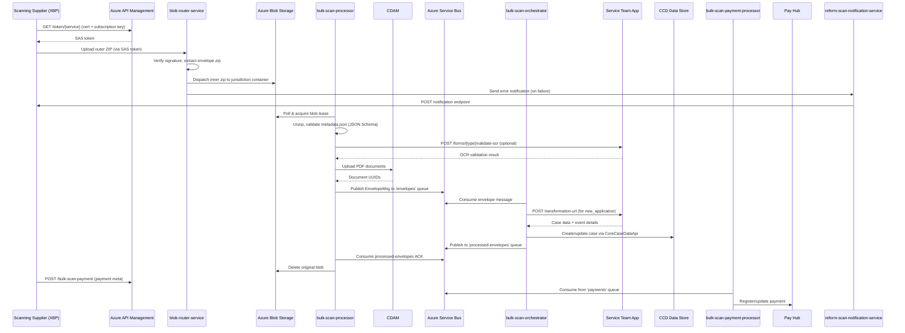

## TL;DR

- Bulk Scan is the HMCTS platform for ingesting scanned paper documents into CCD — it transforms physical envelopes into digital case records.
- The full pipeline involves five services: `blob-router-service` (receives uploads, routes to jurisdiction containers), `bulk-scan-processor` (validates, uploads to CDAM, notifies), `bulk-scan-orchestrator` (creates/updates CCD cases), `bulk-scan-payment-processor` (registers payments with Pay Hub), and `reform-scan-notification-service` (sends error notifications back to the scanning supplier).
- Each envelope is a nested ZIP: an outer ZIP containing a `signature` file and an inner `envelope.zip` with PDFs + `metadata.json`. The signature enables non-repudiation via SHA256WITHRSA.
- Four envelope classifications drive routing: `new_application`, `supplementary_evidence`, `supplementary_evidence_with_ocr`, and `exception`.
- If auto-case-creation fails or is not configured, the orchestrator falls back to creating a CCD Exception Record for manual caseworker triage.
- The scanning supplier is XBP (formerly Exela). Jurisdiction-specific logic lives in the service team's own transformation and update endpoints — the Bulk Scan platform is a protocol adaptor, not a business-logic engine.

## The end-to-end pipeline

The following diagram shows the full ingestion flow from scanning supplier to CCD:



## Stage 0: Blob Router — upload and dispatch

The scanning supplier (XBP, formerly Exela) authenticates via Azure API Management (APIM) using mutual TLS (client certificate + subscription key). The APIM endpoint has transitioned from `/reform-scan` to `/bulk-scan` (December 2024) for OAuth 2.0 enablement.
<!-- CONFLUENCE-ONLY: APIM path change from /reform-scan to /bulk-scan in Dec 2024 — not verified in source -->

The supplier retrieves a time-limited SAS token (default 300-second validity) from `blob-router-service`'s SAS token endpoint exposed through APIM. The token grants write+list+read access to the `reformscan` storage account.

The supplier uploads an **outer ZIP** to the `reformscan` storage account. This outer ZIP has a nested structure:

```
<uniqueId>_<DD-MM-YYYY-HH-mm-ss>.zip       (outer)
  |-- envelope.zip                           (inner — contains the actual docs)
  |     |-- metadata.json
  |     |-- <dcn1>.pdf
  |     |-- <dcn2>.pdf
  |     +-- ...
  +-- signature                              (digital signature of envelope.zip)
```

The `blob-router-service` (`reform-scan` resource group) verifies the digital signature using the supplier's pre-shared public key (SHA256WITHRSA, 1024-bit key, renewed every six months) and dispatches the inner `envelope.zip` content to the appropriate jurisdiction container in the `bulkscan` storage account (e.g. `sscs`, `probate`, `nfd`, `finrem`, `publiclaw`, `privatelaw`, `cmc`, `crime`, `pcq`).

If signature verification or other pre-processing fails, `blob-router-service` publishes an error notification to the `reform-scan-notification-service`, which sends a callback to the supplier's notification endpoint with an `ErrorNotificationRequest` containing `zip_file_name`, `po_box`, `error_code`, and `error_description`. Error codes include: `ERR_FILE_LIMIT_EXCEEDED`, `ERR_METAFILE_INVALID`, `ERR_AV_FAILED`, `ERR_SIG_VERIFY_FAILED`, `ERR_RESCAN_REQUIRED`, `ERR_ZIP_PROCESSING_FAILED`.
<!-- CONFLUENCE-ONLY: Error notification flow to supplier via reform-scan-notification-service — not verified in source -->

## Stage 1: Processor — blob intake

Once `blob-router-service` has dispatched the inner zip to the jurisdiction container, `bulk-scan-processor` takes over. At this point the blob in the `bulkscan` storage account is the flat inner zip containing `metadata.json` + PDF files directly (no signature wrapping).

The zip file name must match the schema pattern: `^\d+_([012][0-9]|30|31)-([0][0-9]|[1][012])-[2][0][0-9][0-9]-([01][0-9]|[2][0123])-[0-5][0-9]-[0-5][0-9]\.(test\.)?zip$` (`bulk-scan-processor:src/main/resources/metafile-schema.json:50-51`). A `.test.` suffix is permitted for test envelopes.

The ZIP contains:

- One `metadata.json` file describing the envelope contents
- One or more `.pdf` document images (max 300 MB each per `ZipFileProcessor.MAX_PDF_SIZE`)

No other file types are permitted — non-PDF entries cause immediate rejection with a `NonPdfFileFoundException` (`bulk-scan-processor:src/main/java/.../tasks/processor/ZipFileProcessor.java:128`).

<!-- DIVERGENCE: Confluence Technical Specification V1.4 says max file size is 75MB, but bulk-scan-processor:src/main/java/.../tasks/processor/ZipFileProcessor.java:29 shows MAX_PDF_SIZE = 314_572_800 (300 MB). Source wins. -->

## Stage 2: Processor — validation and document upload (continued)

`bulk-scan-processor` (port 8581) runs four independently-toggleable scheduled tasks that drive the pipeline:

| Task | Purpose | Concurrency control |
|------|---------|-------------------|
| `BlobProcessorTask` | Poll blobs, validate, extract | Azure blob lease (no ShedLock) |
| `UploadEnvelopeDocumentsTask` | Upload PDFs to CDAM | ShedLock (`upload-documents`) |
| `OrchestratorNotificationTask` | Send EnvelopeMsg to ASB | ShedLock (`send-orchestrator-notification`) |
| `DeleteCompleteFilesTask` | Clean up processed blobs | ShedLock (`delete-complete-files`) |

### Blob polling and validation

The scan task iterates every non-rejected container, shuffles blob names to reduce lease contention across replicas (`bulk-scan-processor:src/main/java/.../services/FileNamesExtractor.java:31-44`), and attempts to acquire a lease on each ZIP blob. Once a lease is held:

1. **Schema validation** — `metadata.json` is validated against a JSON Schema (draft-04) requiring fields like `po_box`, `jurisdiction`, `delivery_date`, `envelope_classification`, and `scannable_items` (`bulk-scan-processor:src/main/resources/metafile-schema.json:219-228`).
2. **Business validation** — checks container/jurisdiction/PO box mapping consistency, document type constraints, DCN uniqueness, and payment configuration.
3. **OCR validation** — for envelopes classified as `NEW_APPLICATION` or `SUPPLEMENTARY_EVIDENCE_WITH_OCR`, the processor calls the service team's OCR validation endpoint at `POST {ocrValidationUrl}/forms/{form-type}/validate-ocr`. The URL is looked up by PO box from container mappings. Errors reject the envelope; warnings are recorded and forwarded downstream.

Failed validation causes the blob to be moved to a `{container}-rejected` container.

### Document upload to CDAM

After validation, PDFs are extracted to local temp storage and uploaded to CDAM at `POST /cases/documents` with `classification=RESTRICTED` and a `caseTypeId` of `{CONTAINER_UPPER}_ExceptionRecord` (e.g. `SSCS_ExceptionRecord`). The returned document UUIDs are persisted against each `ScannableItem` in the processor's PostgreSQL database.

Upload failures are retried up to 5 times (configurable via `UPLOAD_MAX_TRIES`). PDFs exceeding 300 MB are rejected without retry.

### ASB notification

Once documents are uploaded (envelope status reaches `UPLOADED`), the notification task publishes an `EnvelopeMsg` to the `envelopes` Azure Service Bus queue. The message contains:

- Envelope identifiers (`id`, `case_ref`, `previous_service_case_ref`, `zip_file_name`)
- Routing fields (`po_box`, `jurisdiction`, `container`, `classification`, `form_type`)
- Document list with CDAM UUIDs
- OCR data fields and validation warnings
- Payment DCN references

The envelope status advances to `NOTIFICATION_SENT`. ShedLock ensures only one replica sends notifications at a time.

## Stage 3: Orchestrator — CCD case routing

`bulk-scan-orchestrator` (port 8582) consumes messages from the `envelopes` ASB queue using `ServiceBusProcessorClient` in PEEK_LOCK mode with auto-complete disabled (`bulk-scan-orchestrator:src/main/java/.../config/QueueClientsConfig.java:32-45`).

The orchestrator routes each envelope based on its `classification`:

| Classification | Automated action | Fallback |
|----------------|-----------------|----------|
| `NEW_APPLICATION` | Call `transformation-url`, create service case | Create Exception Record |
| `SUPPLEMENTARY_EVIDENCE` | Attach documents to existing case (by `case_ref`) | Create Exception Record |
| `SUPPLEMENTARY_EVIDENCE_WITH_OCR` | Call `update-url`, update existing case | Create Exception Record |
| `EXCEPTION` | Always create Exception Record | — |

### Auto-case creation (NEW_APPLICATION)

When `auto-case-creation-enabled` is configured for the service, the orchestrator:

1. Checks for existing cases by envelope ID (idempotency guard).
2. POSTs to the service team's `transformation-url` with envelope data (OCR fields, scanned documents, PO box, form type).
3. Receives back `case_type_id`, `event_id`, and `case_data` from the service team.
4. Fetches document hashes from CDAM for each scanned document.
5. Creates the case in CCD via `CoreCaseDataApi.startForCaseworker` + `submitForCaseworker`.

The service team's transformation endpoint contains all jurisdiction-specific business logic — field mapping, validation, case-type selection. The orchestrator is purely a protocol adaptor.

### Supplementary evidence

For `SUPPLEMENTARY_EVIDENCE`, the orchestrator fires the `attachScannedDocs` CCD event directly on the target case without calling any service team endpoint. For `SUPPLEMENTARY_EVIDENCE_WITH_OCR`, the service team's `update-url` is called first because OCR data requires service-specific processing (`bulk-scan-orchestrator:src/main/java/.../services/ccd/CcdCaseUpdater.java:85`).

### Exception Records

When automated processing is not configured, not possible, or fails, the orchestrator creates a CCD Exception Record — a case of type `{CONTAINER_UPPER}_ExceptionRecord` containing all envelope data. Caseworkers can later trigger CCD events (`createNewCase` or `attachToExistingCase`) which call back into the orchestrator's callback endpoints:

- `POST /callback/create-new-case` — calls `transformation-url` and creates a service case
- `POST /callback/attach_case` — attaches documents to an existing case (with or without OCR processing)

### Completion signal

After successfully writing to CCD, the orchestrator publishes a `ProcessedEnvelope` message to the `processed-envelopes` ASB queue containing `envelope_id`, `ccd_id`, and `envelope_ccd_action` (one of `AUTO_CREATED_CASE`, `AUTO_ATTACHED_TO_CASE`, `AUTO_UPDATED_CASE`, `EXCEPTION_RECORD`). The processor consumes this message and marks the blob for deletion.

### Retry behaviour and stale envelopes

The orchestrator consumes messages in PEEK_LOCK mode. If processing fails with a potentially recoverable error, the message is abandoned and redelivered. The Azure Service Bus queue has a **Max Delivery Count of 300**, meaning the system retries an envelope up to 300 times (approximately 24 hours of attempts) before dead-lettering.
<!-- CONFLUENCE-ONLY: Max Delivery Count = 300 retries over ~24h — not verified in source -->

A known issue is that CCD treats all 4xx and 5xx errors from service team callbacks identically (wrapping them in a `CallbackException` that returns 502 to the orchestrator). This means genuinely unrecoverable errors (e.g. invalid email address in a service team callback) are retried the full 300 times, resulting in "stale" envelopes. The orchestrator's generic exception handler treats these as potentially recoverable.

## Stage 4: Payment processing

`bulk-scan-payment-processor` (port 8583) handles the payment side of the pipeline. The scanning supplier sends payment metadata to the APIM-hosted `POST /bulk-scan-payment` endpoint after banking cheques/postal orders. This data flows into the `payments` Azure Service Bus queue.

The payment processor consumes these messages and:

1. Maps the PO box to a site ID
2. Calls Pay Hub (`PAY_HUB_URL`) to register a new payment for the exception record
3. When a caseworker converts the exception record to a service case, updates the existing payment reference in Pay Hub

Payment methods supported: `Cheque`, `PostalOrder`, `Cash`. Each payment carries a `document_control_number` (unique DCN), `amount`, `currency` (GBP only), `method`, `bank_giro_credit_slip_number`, and `banked_date`.
<!-- CONFLUENCE-ONLY: Payment API fields (amount, currency, method, bgc_slip_number, banked_date) — not verified in source -->

## Exception Record creation rules

An Exception Record is created in the following situations:
<!-- CONFLUENCE-ONLY: Business rules list from Confluence "Bulk Scan, Bulk print & FaCT Useful Links" — not verified in source -->

1. **Supplementary evidence without case number** — envelope classified as `supplementary_evidence` but `case_number` is null or empty.
2. **Supplementary evidence with unresolvable case** — envelope has `supplementary_evidence` classification with a case number that cannot be located in CCD.
3. **New application with OCR validation warnings** — envelope classified as `new_application` containing OCR forms where the service team's validation endpoint returns warnings.
4. **Supplier-marked exception** — the supplier sets `envelope_classification` to `exception` in the metadata (per the SIP business rules for that jurisdiction).
5. **Any failure outside the happy path** — CCD API errors, transformation endpoint failures, unhandled exceptions during processing.

It is important to note that "exception record" (internal CCD case type for caseworker triage) and "exception" (a classification applied to the zip file by the supplier) are distinct concepts. One is an HMCTS-internal fallback mechanism; the other is a business-rule-driven classification.

## Envelope status lifecycle

```
CREATED → UPLOADED → NOTIFICATION_SENT → COMPLETED
             ↓
       UPLOAD_FAILURE (retried up to max_tries)
```

Rejected blobs (validation failure, oversized PDFs) are moved to the `-rejected` container and the envelope is marked `COMPLETED` immediately.

## Metadata.json fields

The `metadata.json` file in each envelope must conform to the JSON Schema at `bulk-scan-processor:src/main/resources/metafile-schema.json` (draft-04). Key fields:

| Field | Type | Required | Description |
|-------|------|----------|-------------|
| `po_box` | string | Yes | PO Box number the envelope was received at |
| `jurisdiction` | string | Yes | e.g. SSCS, Probate, Divorce |
| `delivery_date` | ISO 8601 | Yes | When delivered to supplier (`yyyy-MM-ddTHH:mm:ss.SSSZ`) |
| `opening_date` | ISO 8601 | Yes | When opened at supplier premises |
| `zip_file_createddate` | ISO 8601 | Yes | When zip was created |
| `zip_file_name` | string | Yes | Must match regex: `^\d+_DD-MM-YYYY-HH-mm-ss\.(test\.)?zip$` |
| `envelope_classification` | enum | Yes | `exception`, `new_application`, `supplementary_evidence`, `supplementary_evidence_with_ocr` |
| `case_number` | string/null | No | CCD case reference (for supplementary evidence) |
| `previous_service_case_reference` | string/null | No | Legacy service case reference |
| `rescan_for` | string/null | No | Original zip filename if this is a rescan |
| `scannable_items` | array | Yes (min 1) | Documents in the envelope |
| `payments` | array | No | Payment DCN references |
| `non_scannable_items` | array | No | Physical items that cannot be scanned (CDs, USBs) |

Each `scannable_item` requires: `document_control_number` (numeric string), `scanning_date`, `file_name` (must end in `.pdf`), `document_type`, `next_action`, `next_action_date`. Optional fields include `ocr_data` (base64-encoded), `ocr_accuracy`, `manual_intervention`, `document_sub_type`, and `notes`.

The `document_type` enum in the schema is: `Cherished`, `Other`, `SSCS1`, `Will`, `Coversheet`, `Form`, `Supporting Documents`, `Forensic Sheets`, `IHT`, `PP's Legal Statement`, `PPs Legal Statement`.

## Supported jurisdictions

The blob-router dispatches to, and the processor processes blobs from, the following containers: `sscs`, `probate`, `nfd`, `finrem`, `cmc`, `publiclaw`, `privatelaw`, `crime`, `pcq`, `bulkscan`, `bulkscanauto`. Each jurisdiction requires:

1. A blob storage container matching the service name
2. A `containers.mappings` entry linking container, jurisdiction, and PO box
3. (Optional) An OCR validation URL for form-type validation
4. (In orchestrator) A `service-config.services` entry with `transformation-url` and optionally `update-url`

## Operational recovery

The processor exposes an administrative actions API (protected by an `actions-api-key` secret) for operational recovery of stuck envelopes:

| Endpoint | Method | Purpose |
|----------|--------|---------|
| `/actions/{envelopeId}/complete` | PUT | Manually mark an envelope as complete |
| `/actions/reprocess/{envelopeId}` | PUT | Re-trigger processing for a failed envelope |
| `/actions/update-classification-reprocess/{envelopeId}` | PUT | Change classification to `exception` and reprocess (forces exception record creation) |

<!-- CONFLUENCE-ONLY: Actions API endpoints — not verified in source -->

### Monitoring endpoints

| Endpoint | Service | Purpose |
|----------|---------|---------|
| `/reports/count-summary?date=YYYY-MM-DD` | blob-router | Envelope counts per service for a date |
| `/envelopes?date=YYYY-MM-DD&container=<name>` | blob-router | List envelopes by container (status should be `DISPATCHED`) |
| `/reports/envelopes-count-summary?date=YYYY-MM-DD` | processor | CFT envelope counts for a date |
| `/reports/zip-files-summary?date=YYYY-MM-DD` | processor | All zip files received (status should be `COMPLETED`) |
| `/envelopes/stale-incomplete-envelopes` | processor | Envelopes that failed to complete |
| `/envelopes/{container}/{zipFileName}` | processor | Status of a specific envelope |

<!-- CONFLUENCE-ONLY: Monitoring endpoint paths — not verified in source -->

### Database uniqueness constraints

The system enforces uniqueness on:
- `zipfilename` — prevents reprocessing the same envelope
- Document `document_control_number` — prevents duplicate document records
- Payment `document_control_number` — prevents duplicate payment records

To reprocess an envelope with the same filename (e.g. during UAT), the existing records must be deleted from both `blob-router` and `bulk-scan-processor` databases.

## Key integration points for onboarding service teams

To onboard a new paper form into Bulk Scan, a service team must:

1. **Implement an OCR validation endpoint** at `POST /forms/{form-type}/validate-ocr` — receives OCR key-value pairs, returns errors or warnings.
2. **Implement a transformation endpoint** matching the `transformation-url` contract — receives envelope data, returns `case_type_id`, `event_id`, and `case_data`.
3. **Optionally implement an update endpoint** matching the `update-url` contract — receives envelope data plus existing case details, returns updated `case_data`.
4. **Define a CCD Exception Record case type** in `bulk-scan-ccd-definitions` with the required fields (`journeyClassification`, `scannedDocuments`, `scanOCRData`, etc.).
5. **Configure the processor** with the OCR validation URL and container mapping.
6. **Configure the orchestrator** with the `transformation-url`, `update-url`, and feature flags.

## Component summary

The full Bulk Scan platform comprises services in two Azure resource groups:

| Resource Group | Service | Port | Database |
|---------------|---------|------|----------|
| `reform-scan-prod` | `blob-router-service` | - | blob-router-flexible-postgres-db-v15 |
| `reform-scan-prod` | `reform-scan-notification-service` | - | reform-scan-notification-service-flexible-db-v15 |
| `bulk-scan-prod` | `bulk-scan-processor` | 8581 | bulk-scan-processor-flexible-postgres-db-v15 |
| `bulk-scan-prod` | `bulk-scan-orchestrator` | 8582 | bulk-scan-orchestrator-flexible-postgres-db-v15 |
| `bulk-scan-prod` | `bulk-scan-payment-processor` | 8583 | (none) |

Storage accounts: `reformscanprod` (blob-router intake), `bulkscanprod` (processor jurisdiction containers).

Service Bus queues: `envelopes` (processor to orchestrator), `processed-envelopes` (orchestrator back to processor), `payments` (payment processor intake).

App Insights: `reform-scan-prod` (blob-router, notification-service), `bulk-scan-prod` (processor, orchestrator, payment-processor).

Support channel: `#bulk_scan_print_fact_support` (Slack). Jira: FACT project.

## See also

- [Architecture](architecture.md) — component-level breakdown of all five services, databases, and queues
- [Envelope Processing](envelope-processing.md) — deep-dive into how the processor validates, uploads, and notifies
- [Orchestration Flow](orchestration-flow.md) — how the orchestrator routes envelopes to CCD outcomes
- [How to Onboard a New Jurisdiction](../how-to/onboard-new-jurisdiction.md) — step-by-step guide for service teams joining the pipeline
