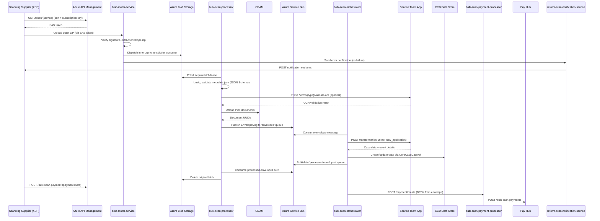

## TL;DR

- Bulk Scan is the HMCTS platform for ingesting scanned paper documents into CCD — it transforms physical envelopes into digital case records.
- The full pipeline involves five services: `blob-router-service` (receives uploads, routes to jurisdiction containers), `bulk-scan-processor` (validates, uploads to CDAM, notifies), `bulk-scan-orchestrator` (creates/updates CCD cases), `bulk-scan-payment-processor` (registers payments with Pay Hub), and `reform-scan-notification-service` (sends error notifications back to the scanning supplier).
- Each envelope is a nested ZIP: an outer ZIP containing a `signature` file and an inner `envelope.zip` with PDFs + `metadata.json`. The signature enables non-repudiation via SHA256WITHRSA.
- Four envelope classifications drive routing: `new_application`, `supplementary_evidence`, `supplementary_evidence_with_ocr`, and `exception`.
- If auto-case-creation fails or is not configured, the orchestrator falls back to creating a CCD Exception Record for manual caseworker triage.
- The scanning supplier is XBP (formerly Exela). Jurisdiction-specific logic lives in the service team's own transformation and update endpoints — the Bulk Scan platform is a protocol adaptor, not a business-logic engine.

## The end-to-end pipeline

The following diagram shows the full ingestion flow from scanning supplier to CCD:


```mermaid
sequenceDiagram
    participant Supplier as Scanning Supplier (XBP)
    participant APIM as Azure API Management
    participant Router as blob-router-service
    participant Blob as Azure Blob Storage
    participant Proc as bulk-scan-processor
    participant CDAM as CDAM
    participant ASB as Azure Service Bus
    participant Orch as bulk-scan-orchestrator
    participant Svc as Service Team App
    participant CCD as CCD Data Store
    participant PayProc as bulk-scan-payment-processor
    participant PayHub as Pay Hub
    participant Notif as reform-scan-notification-service

    Supplier->>APIM: GET /token/{service} (cert + subscription key)
    APIM-->>Supplier: SAS token
    Supplier->>Router: Upload outer ZIP (via SAS token)
    Router->>Router: Verify signature, extract envelope.zip
    Router->>Blob: Dispatch inner zip to jurisdiction container
    Router->>Notif: Send error notification (on failure)
    Notif->>Supplier: POST notification endpoint
    Proc->>Blob: Poll & acquire blob lease
    Proc->>Proc: Unzip, validate metadata.json (JSON Schema)
    Proc->>Svc: POST /forms/{type}/validate-ocr (optional)
    Svc-->>Proc: OCR validation result
    Proc->>CDAM: Upload PDF documents
    CDAM-->>Proc: Document UUIDs
    Proc->>ASB: Publish EnvelopeMsg to 'envelopes' queue
    Orch->>ASB: Consume envelope message
    Orch->>Svc: POST transformation-url (for new_application)
    Svc-->>Orch: Case data + event details
    Orch->>CCD: Create/update case via CoreCaseDataApi
    Orch->>ASB: Publish to 'processed-envelopes' queue
    Proc->>ASB: Consume processed-envelopes ACK
    Proc->>Blob: Delete original blob
    Supplier->>APIM: POST /bulk-scan-payment (payment meta)
    Orch->>PayProc: POST /payment/create (DCNs from envelope)
    PayProc->>PayHub: POST /bulk-scan-payments
```

## Stage 0: Blob Router — upload and dispatch

The scanning supplier (XBP, formerly Exela) authenticates via Azure API Management (APIM) using mutual TLS (client certificate + subscription key). The APIM route in use is `/reform-scan/token/{service}` on the `cft-mtls-api-mgmt-appgw.{env}.platform.hmcts.net` gateway — see [API Processor Reference](../reference/api-processor.md#external-access-api-gateway) for the caller's side of the contract.

<!-- DIVERGENCE: Confluence records the APIM path moving from /reform-scan to /bulk-scan in December 2024 for OAuth 2.0 enablement. bulk-scan-helper-frontend, the only APIM client in this workspace, still calls /reform-scan/token/{jurisdiction} (src/main/routes/home.ts:28). Source wins. -->

The supplier retrieves a time-limited SAS token (default 300-second validity) from `blob-router-service`'s SAS token endpoint exposed through APIM. The token grants write+list+read access to the `reformscan` storage account.

The supplier uploads an **outer ZIP** to the `reformscan` storage account. This outer ZIP has a nested structure:

```
<uniqueId>_<DD-MM-YYYY-HH-mm-ss>.zip       (outer)
  |-- envelope.zip                           (inner — contains the actual docs)
  |     |-- metadata.json
  |     |-- <dcn1>.pdf
  |     |-- <dcn2>.pdf
  |     +-- ...
  +-- signature                              (digital signature of envelope.zip)
```

The `blob-router-service` (`reform-scan` resource group) verifies the digital signature using the supplier's pre-shared public key (SHA256WITHRSA, 1024-bit key, renewed every six months) and dispatches the inner `envelope.zip` content to the appropriate jurisdiction container in the `bulkscan` storage account (`sscs`, `probate`, `divorce`, `nfd`, `finrem`, `cmc`, `publiclaw`, `privatelaw`).

The supplier-facing container list also includes `crime` and `pcq`. Those are `blob-router-service` routing destinations only — neither appears in `bulk-scan-processor`'s `containers.mappings` (`bulk-scan-processor:src/main/resources/application.yaml`), so envelopes landing there are not picked up by the processor pipeline described below.
<!-- CONFLUENCE-ONLY: `crime` and `pcq` containers named in Technical Specification V1.4 §5.3; absent from bulk-scan-processor's containers.mappings, and blob-router-service is not cloned in this workspace -->

<!-- DIVERGENCE: Technical Specification V1.4 §5.3 presents its container list as "an example only, on the 6th June 2024". Source wins. -->

If signature verification or other pre-processing fails, `blob-router-service` publishes an error notification to the `reform-scan-notification-service`, which sends a callback to the supplier's notification endpoint with an `ErrorNotificationRequest` containing `zip_file_name`, `po_box`, `error_code`, `error_description` and `reference_id`, under HTTP basic auth, expecting `201 Created` with a `notification_id` in reply.

Error notification is a **two-hop** flow, and the two hops carry different payloads:

1. The producing service (`blob-router-service`, or `bulk-scan-processor` for the failures in Stage 2) publishes an `ErrorMsg` to the `notifications` Service Bus queue.
2. `reform-scan-notification-service` consumes that message, allocates a `reference_id`, and POSTs an `ErrorNotificationRequest` to the supplier.

`ErrorMsg` has no `reference_id` — that field is added by the notification service. See [Envelope format](../reference/envelope-format.md#error-notification-codes) for the full field list and the eight `ErrorCode` values.
<!-- CONFLUENCE-ONLY: reform-scan-notification-service's outbound ErrorNotificationRequest, basic auth and 201 response come from Technical Specification V1.4 §6.1; that repo is not cloned in this workspace. The inbound ErrorMsg half is verified in bulk-scan-processor. -->

## Stage 1: Processor — blob intake

Once `blob-router-service` has dispatched the inner zip to the jurisdiction container, `bulk-scan-processor` takes over. At this point the blob in the `bulkscan` storage account is the flat inner zip containing `metadata.json` + PDF files directly (no signature wrapping).

The zip file name must match the schema pattern: `^\d+_([012][0-9]|30|31)-([0][0-9]|[1][012])-[2][0][0-9][0-9]-([01][0-9]|[2][0123])-[0-5][0-9]-[0-5][0-9]\.(test\.)?zip$` (`bulk-scan-processor:src/main/resources/metafile-schema.json:50-51`). A `.test.` suffix is permitted for test envelopes.

The ZIP contains:

- One `metadata.json` file describing the envelope contents
- One or more `.pdf` document images (max 300 MB each per `ZipFileProcessor.MAX_PDF_SIZE`)

No other file types are permitted — non-PDF entries cause immediate rejection with a `NonPdfFileFoundException` (`bulk-scan-processor:src/main/java/.../tasks/processor/ZipFileProcessor.java:128`).

<!-- DIVERGENCE: Confluence Technical Specification V1.4 says max file size is 75MB, but bulk-scan-processor:src/main/java/.../tasks/processor/ZipFileProcessor.java:29 shows MAX_PDF_SIZE = 314_572_800 (300 MB). Source wins. -->

## Stage 2: Processor — validation and document upload (continued)

`bulk-scan-processor` (port 8581) runs four independently-toggleable scheduled tasks that drive the pipeline:

| Task | Purpose | Concurrency control |
|------|---------|-------------------|
| `BlobProcessorTask` | Poll blobs, validate, extract | Azure blob lease (no ShedLock) |
| `UploadEnvelopeDocumentsTask` | Upload PDFs to CDAM | ShedLock (`upload-documents`) |
| `OrchestratorNotificationTask` | Send EnvelopeMsg to ASB | ShedLock (`send-orchestrator-notification`) |
| `DeleteCompleteFilesTask` | Clean up processed blobs | ShedLock (`delete-complete-files`) |

### Blob polling and validation

The scan task iterates every non-rejected container, shuffles blob names to reduce lease contention across replicas (`bulk-scan-processor:src/main/java/.../services/FileNamesExtractor.java:31-44`), and attempts to acquire a lease on each ZIP blob. Once a lease is held:

1. **Schema validation** — `metadata.json` is validated against a JSON Schema (draft-04) requiring fields like `po_box`, `jurisdiction`, `delivery_date`, `envelope_classification`, and `scannable_items` (`bulk-scan-processor:src/main/resources/metafile-schema.json:219-228`).
2. **Business validation** — checks container/jurisdiction/PO box mapping consistency, document type constraints, DCN uniqueness, and payment configuration.
3. **OCR validation** — for envelopes classified as `NEW_APPLICATION` or `SUPPLEMENTARY_EVIDENCE_WITH_OCR`, the processor calls the service team's OCR validation endpoint at `POST {ocrValidationUrl}/forms/{form-type}/validate-ocr`. The URL is looked up by PO box from container mappings. Errors reject the envelope; warnings are recorded and forwarded downstream.

Failed validation causes the blob to be moved to a `{container}-rejected` container.

### Document upload to CDAM

After validation, PDFs are extracted to local temp storage and uploaded to CDAM at `POST /cases/documents` with `classification=RESTRICTED` and a `caseTypeId` of `{CONTAINER_UPPER}_ExceptionRecord` (e.g. `SSCS_ExceptionRecord`). The returned document UUIDs are persisted against each `ScannableItem` in the processor's PostgreSQL database.

Upload failures are retried up to 5 times (configurable via `UPLOAD_MAX_TRIES`). PDFs exceeding 300 MB are rejected without retry.

### ASB notification

Once documents are uploaded (envelope status reaches `UPLOADED`), the notification task publishes an `EnvelopeMsg` to the `envelopes` Azure Service Bus queue. The message contains:

- Envelope identifiers (`id`, `case_ref`, `previous_service_case_ref`, `zip_file_name`)
- Routing fields (`po_box`, `jurisdiction`, `container`, `classification`, `form_type`)
- Document list with CDAM UUIDs
- OCR data fields and validation warnings
- Payment DCN references

The envelope status advances to `NOTIFICATION_SENT`. ShedLock ensures only one replica sends notifications at a time.

## Stage 3: Orchestrator — CCD case routing

`bulk-scan-orchestrator` (port 8582) consumes messages from the `envelopes` ASB queue using `ServiceBusProcessorClient` in PEEK_LOCK mode with auto-complete disabled (`bulk-scan-orchestrator:src/main/java/.../config/QueueClientsConfig.java:32-45`).

The orchestrator routes each envelope based on its `classification`:

| Classification | Automated action | Fallback |
|----------------|-----------------|----------|
| `NEW_APPLICATION` | Call `transformation-url`, create service case | Create Exception Record |
| `SUPPLEMENTARY_EVIDENCE` | Attach documents to existing case (by `case_ref`) | Create Exception Record |
| `SUPPLEMENTARY_EVIDENCE_WITH_OCR` | Call `update-url`, update existing case | Create Exception Record |
| `EXCEPTION` | Always create Exception Record | — |

### Auto-case creation (NEW_APPLICATION)

When `auto-case-creation-enabled` is configured for the service, the orchestrator:

1. Checks for existing cases by envelope ID (idempotency guard).
2. POSTs to the service team's `transformation-url` with envelope data (OCR fields, scanned documents, PO box, form type).
3. Receives back `case_type_id`, `event_id`, and `case_data` from the service team.
4. Fetches document hashes from CDAM for each scanned document.
5. Creates the case in CCD via `CoreCaseDataApi.startForCaseworker` + `submitForCaseworker`.

The service team's transformation endpoint contains all jurisdiction-specific business logic — field mapping, validation, case-type selection. The orchestrator is purely a protocol adaptor.

### Supplementary evidence

For `SUPPLEMENTARY_EVIDENCE`, the orchestrator fires the `attachScannedDocs` CCD event directly on the target case without calling any service team endpoint. For `SUPPLEMENTARY_EVIDENCE_WITH_OCR`, the service team's `update-url` is called first because OCR data requires service-specific processing (`bulk-scan-orchestrator:src/main/java/.../services/ccd/CcdCaseUpdater.java:85`).

### Exception Records

When automated processing is not configured, not possible, or fails, the orchestrator creates a CCD Exception Record — a case of type `{CONTAINER_UPPER}_ExceptionRecord` containing all envelope data. Caseworkers can later trigger CCD events (`createNewCase` or `attachToExistingCase`) which call back into the orchestrator's callback endpoints:

- `POST /callback/create-new-case` — calls `transformation-url` and creates a service case
- `POST /callback/attach_case` — attaches documents to an existing case (with or without OCR processing)

### Completion signal

After successfully writing to CCD, the orchestrator publishes a `ProcessedEnvelope` message to the `processed-envelopes` ASB queue containing `envelope_id`, `ccd_id`, and `envelope_ccd_action` (one of `AUTO_CREATED_CASE`, `AUTO_ATTACHED_TO_CASE`, `AUTO_UPDATED_CASE`, `EXCEPTION_RECORD`). The processor consumes this message and marks the blob for deletion.

### Retry behaviour and stale envelopes

The orchestrator consumes messages in PEEK_LOCK mode. If processing fails with a potentially recoverable error, the message is abandoned and redelivered. The Azure Service Bus queue has a **Max Delivery Count of 300**, meaning the system retries an envelope up to 300 times (approximately 24 hours of attempts) before dead-lettering.
<!-- CONFLUENCE-ONLY: Max Delivery Count = 300 retries over ~24h — not verified in source -->

A known issue is that CCD treats all 4xx and 5xx errors from service team callbacks identically (wrapping them in a `CallbackException` that returns 502 to the orchestrator). This means genuinely unrecoverable errors (e.g. invalid email address in a service team callback) are retried the full 300 times, resulting in "stale" envelopes. The orchestrator's generic exception handler treats these as potentially recoverable.

## Stage 4: Payment processing

Payment data reaches Pay Hub by two independent routes that meet on the DCN.

**Route 1 — the supplier's own payment metadata.** After banking cheques/postal orders, the scanning supplier POSTs to the APIM-hosted `POST /bulk-scan-payment` endpoint, which is served by `ccpay-bulkscanning-app` (a Payments repo, not a Bulk Scan one). Payment methods accepted are `Cash`, `Cheque` and `PostalOrder`, and the only currency accepted is `GBP` — both compared case-insensitively. Each payment carries `document_control_number`, `amount`, `currency`, `method`, `bank_giro_credit_slip_number` and `banked_date` (`ccpay-bulkscanning-app:src/main/java/uk/gov/hmcts/reform/bulkscanning/model/request/BulkScanPayment.java`).

**Route 2 — the envelope's DCNs.** `bulk-scan-payment-processor` (port 8583) exposes `POST /payment/create` and `POST /payment/update` and is called **over HTTP by the orchestrator** when an envelope carries payment DCNs. It maps the PO box to a site ID and calls Pay Hub via Feign — `POST /bulk-scan-payments` to register, `PUT /bulk-scan-payments?exception_reference=…` to re-point the payment when a caseworker converts the exception record to a service case (`bulk-scan-payment-processor:src/main/java/uk/gov/hmcts/reform/bulkscan/payment/processor/client/payhub/PayHubClient.java`).

The payment processor has **no** Service Bus listener — there is no `payments` queue. Its `src/main/java` contains only `PaymentController` and `RootController`, with no `ServiceBus` or `@JmsListener` reference anywhere.

<!-- DIVERGENCE: `document_control_number` is documented in Technical Specification V1.4 §5.6 with the 19-digit example `2225000771011109024`, but `BulkScanPayment.java` enforces `@Size(min = 21, max = 21)`. The processor's own `metafile-schema.json` bounds the DCN only as `^[0-9]+$`, so a 19-digit DCN passes envelope validation and is then rejected by the payments API. Source wins. -->

## Exception Record creation rules

An Exception Record is the fallback whenever the automatic path is unavailable or fails. Each classification has its own handler, and each handler its own set of fallbacks:

1. **Supplier-marked exception** — `classification=exception` always produces one; there is no automatic path to attempt (`ExceptionClassificationHandler.java:32-35`).
2. **Supplementary evidence that cannot be attached** — no case is found for the envelope, or a case is found but attaching the documents to it fails (`SupplementaryEvidenceHandler.java:49-77`). A null or unresolvable `case_number` lands here.
3. **Supplementary evidence with OCR where auto-update is off** — the record is created without attempting an update. The same handler also falls back when the update is abandoned, or errors after the message has been redelivered twice (`SupplementaryEvidenceWithOcrHandler.java:43-64`).
4. **New application that cannot be created** — auto case creation is disabled for the service, more than one case already exists for the envelope, CCD rejects the create with 400 or 422, or the service team's transformation endpoint returns 400/422 or an invalid body (`AutoCaseCreator.java:54-79`, `AutoCaseCreator.java:129-137`, `EnvelopeTransformer.java:56-68`, `NewApplicationHandler.java:51-54`).
5. **A recoverable failure that stops being worth retrying** — 5xx responses, timeouts and unhandled exceptions are classified as potentially recoverable and left to redelivery, but once `deliveryCount` reaches 2 the handler creates an exception record instead (`NewApplicationHandler.java:22`, `NewApplicationHandler.java:55-62`).

Auto case creation is on for three services only — `bulkscanauto`, `probate` and `nfd` (`bulk-scan-orchestrator:charts/bulk-scan-orchestrator/values.yaml:32-41`). For every other service, including SSCS, Divorce, FinRem, CMC, PublicLaw and PrivateLaw, a `new_application` envelope always becomes an exception record for a caseworker to convert.

OCR validation warnings do not by themselves cause an exception record on the automated path: the orchestrator sets `ignore_warnings` to `true` on every queue-driven transformation request (`TransformationRequestCreator.java:43-58`). Warnings block a conversion only when a caseworker triggers one from an existing exception record.

It is important to note that "exception record" (internal CCD case type for caseworker triage) and "exception" (a classification applied to the zip file by the supplier) are distinct concepts. One is an HMCTS-internal fallback mechanism; the other is a business-rule-driven classification.

## Envelope status lifecycle

```
CREATED → UPLOADED → NOTIFICATION_SENT → COMPLETED
             ↓
       UPLOAD_FAILURE (retried up to max_tries)
```

Rejected blobs (validation failure, oversized PDFs) are moved to the `-rejected` container and the envelope is marked `COMPLETED` immediately.

## Metadata.json fields

The `metadata.json` file in each envelope must conform to the JSON Schema at `bulk-scan-processor:src/main/resources/metafile-schema.json` (draft-04). Key fields:

| Field | Type | Required | Description |
|-------|------|----------|-------------|
| `po_box` | string | Yes | PO Box number the envelope was received at |
| `jurisdiction` | string | Yes | e.g. SSCS, Probate, Divorce |
| `delivery_date` | ISO 8601 | Yes | When delivered to supplier (`yyyy-MM-ddTHH:mm:ss.SSSZ`) |
| `opening_date` | ISO 8601 | Yes | When opened at supplier premises |
| `zip_file_createddate` | ISO 8601 | Yes | When zip was created |
| `zip_file_name` | string | Yes | Must match regex: `^\d+_DD-MM-YYYY-HH-mm-ss\.(test\.)?zip$` |
| `envelope_classification` | enum | Yes | `exception`, `new_application`, `supplementary_evidence`, `supplementary_evidence_with_ocr` |
| `case_number` | string/null | No | CCD case reference (for supplementary evidence) |
| `previous_service_case_reference` | string/null | No | Legacy service case reference |
| `rescan_for` | string/null | No | Original zip filename if this is a rescan |
| `scannable_items` | array | Yes (min 1) | Documents in the envelope |
| `payments` | array | No | Payment DCN references |
| `non_scannable_items` | array | No | Physical items that cannot be scanned (CDs, USBs) |

Each `scannable_item` requires: `document_control_number` (numeric string), `scanning_date`, `file_name` (must end in `.pdf`), `document_type`, `next_action`, `next_action_date`. Optional fields include `ocr_data` (base64-encoded), `ocr_accuracy`, `manual_intervention`, `document_sub_type`, and `notes`.

The `document_type` enum in the schema is: `Cherished`, `Other`, `SSCS1`, `Will`, `Coversheet`, `Form`, `Supporting Documents`, `Forensic Sheets`, `IHT`, `PP's Legal Statement`, `PPs Legal Statement`.

## Supported jurisdictions

The blob-router dispatches to, and the processor processes blobs from, the following containers: `sscs`, `probate`, `nfd`, `finrem`, `cmc`, `publiclaw`, `privatelaw`, `crime`, `pcq`, `bulkscan`, `bulkscanauto`. Each jurisdiction requires:

1. A blob storage container matching the service name
2. A `containers.mappings` entry linking container, jurisdiction, and PO box
3. (Optional) An OCR validation URL for form-type validation
4. (In orchestrator) A `service-config.services` entry with `transformation-url` and optionally `update-url`

## Operational recovery

The processor exposes an administrative actions API for operational recovery of stuck envelopes. Every endpoint calls `validateAuthorization`, which does an exact string comparison against `Bearer {actions.api-key}` — there is no S2S or IDAM check on this controller, so the key is the only thing standing in front of it (`ActionController.java`):

| Endpoint | Method | Purpose |
|----------|--------|---------|
| `/actions/reprocess/{id}` | PUT | Re-trigger processing for a failed envelope (`ActionController.java:52`) |
| `/actions/update-classification-reprocess/{id}` | PUT | Change classification to `EXCEPTION` and reprocess, forcing exception-record creation (`ActionController.java:70`) |
| `/actions/{id}/complete` | PUT | Manually mark an envelope as complete (`ActionController.java:88`) |
| `/actions/{id}/abort` | PUT | Manually mark an envelope as aborted (`ActionController.java:106`) |

### Monitoring endpoints

On the processor:

| Endpoint | Purpose |
|----------|---------|
| `/reports/count-summary?date=YYYY-MM-DD` | Envelope counts for a date; `include-test` defaults to `false` (`ReportsController.java:112`) |
| `/reports/envelopes-count-summary?date=YYYY-MM-DD` | Second count summary over the same date, built by a different repository query (`ReportsController.java:128`) |
| `/reports/zip-files-summary?date=YYYY-MM-DD` | All zip files received, as JSON or CSV depending on `Accept` (`ReportsController.java:161`, `ReportsController.java:196`) |
| `/reports/rejected-zip-files?date=YYYY-MM-DD` | Zip files rejected on a date (`ReportsController.java:227`) |
| `/envelopes/stale-incomplete-envelopes` | Envelopes still incomplete past `stale_time`, default 2 hours (`EnvelopeController.java:127`) |
| `/envelopes/{container}/{file_name}` | Status of a specific envelope; hidden from the OpenAPI spec (`EnvelopeController.java:112`) |

`GET /envelopes` on the processor filters by `status` only — it takes neither `date` nor `container` (`EnvelopeController.java:67`), so a date-scoped sweep has to go through `/reports/*`.

<!-- CONFLUENCE-ONLY: the blob-router equivalents of these endpoints (/reports/count-summary and /envelopes?date=&container=, whose envelopes should read DISPATCHED) come from the Confluence service operations guide; blob-router-service is not cloned in this workspace. -->
The blob-router exposes its own count-summary and envelope-listing endpoints, where a healthy envelope reads `DISPATCHED`.

### Database uniqueness constraints

The system enforces uniqueness on:
- `zipfilename` — prevents reprocessing the same envelope
- Document `document_control_number` — prevents duplicate document records
- Payment `document_control_number` — prevents duplicate payment records

To reprocess an envelope with the same filename (e.g. during UAT), the existing records must be deleted from both `blob-router` and `bulk-scan-processor` databases.

## Key integration points for onboarding service teams

To onboard a new paper form into Bulk Scan, a service team must:

1. **Implement an OCR validation endpoint** at `POST /forms/{form-type}/validate-ocr` — receives OCR key-value pairs, returns errors or warnings.
2. **Implement a transformation endpoint** matching the `transformation-url` contract — receives envelope data, returns `case_type_id`, `event_id`, and `case_data`.
3. **Optionally implement an update endpoint** matching the `update-url` contract — receives envelope data plus existing case details, returns updated `case_data`.
4. **Define a CCD Exception Record case type** in `bulk-scan-ccd-definitions` with the required fields (`journeyClassification`, `scannedDocuments`, `scanOCRData`, etc.).
5. **Configure the processor** with the OCR validation URL and container mapping.
6. **Configure the orchestrator** with the `transformation-url`, `update-url`, and feature flags.

## Component summary

The full Bulk Scan platform comprises services in two Azure resource groups:

| Resource Group | Service | Port | Database |
|---------------|---------|------|----------|
| `reform-scan-prod` | `blob-router-service` | - | blob-router-flexible-postgres-db-v15 |
| `reform-scan-prod` | `reform-scan-notification-service` | - | reform-scan-notification-service-flexible-db-v15 |
| `bulk-scan-prod` | `bulk-scan-processor` | 8581 | bulk-scan-processor-flexible-postgres-db-v15 |
| `bulk-scan-prod` | `bulk-scan-orchestrator` | 8582 | bulk-scan-orchestrator-flexible-postgres-db-v15 |
| `bulk-scan-prod` | `bulk-scan-payment-processor` | 8583 | (none) |

Storage accounts: `reformscanprod` (blob-router intake), `bulkscanprod` (processor jurisdiction containers).

Service Bus queues: `envelopes` (processor to orchestrator), `processed-envelopes` (orchestrator back to processor), `payments` (payment processor intake).

App Insights: `reform-scan-prod` (blob-router, notification-service), `bulk-scan-prod` (processor, orchestrator, payment-processor).

Support channel: `#bulk_scan_print_fact_support` (Slack). Jira: FACT project.

## See also

- [Architecture](architecture.md) — component-level breakdown of all five services, databases, and queues
- [Envelope Processing](envelope-processing.md) — deep-dive into how the processor validates, uploads, and notifies
- [Orchestration Flow](orchestration-flow.md) — how the orchestrator routes envelopes to CCD outcomes
- [How to Onboard a New Jurisdiction](../how-to/onboard-new-jurisdiction.md) — step-by-step guide for service teams joining the pipeline
