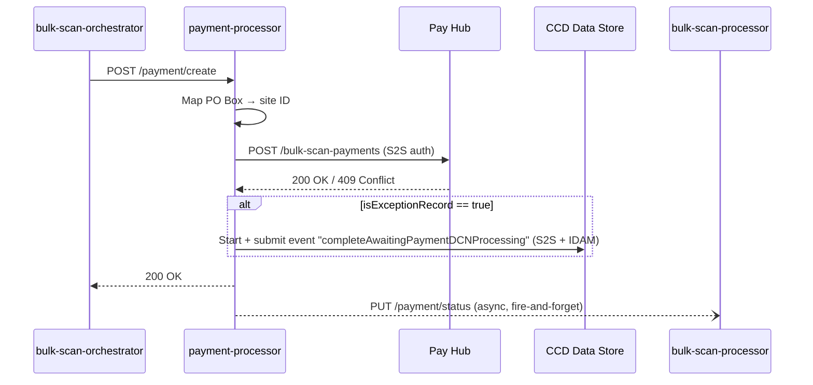
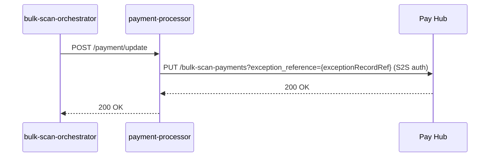

## TL;DR

- `bulk-scan-payment-processor` (port 8583) registers cash/cheque/postal-order payments from scanned envelopes in Pay Hub and updates CCD exception records.
- Two HTTP endpoints: `POST /payment/create` (register new payment) and `POST /payment/update` (re-point payment after exception-record conversion to a service case).
- PO Box numbers from envelopes are mapped to Pay Hub site IDs via static configuration in `application.yaml` — six jurisdictions configured (Probate, Divorce, FinRem, NFD, PrivateLaw, BulkScan).
- The service has no database; it is a stateless bridge between the orchestrator, Pay Hub (`POST /bulk-scan-payments`), CCD, and bulk-scan-processor.
- Auth: S2S token only for Pay Hub calls; S2S + per-jurisdiction IDAM user token for CCD calls.
- Exela (the scanning supplier) does not scan cheques or extract PII; it only provides Document Control Numbers as unique identifiers for each payment instrument.

## How the service fits into the pipeline

`bulk-scan-payment-processor` sits between the bulk-scan-orchestrator (which sends payment instructions) and two downstream systems:

1. **Pay Hub** — the HMCTS Payments platform that records fees/payments against cases.
2. **CCD** — updated to mark exception records as no longer awaiting DCN processing.

The service is purely HTTP-driven. Although historical references to Azure Service Bus and JMS consumers exist in Sonar exclusions (`build.gradle:131`), the current codebase contains no message listener — payment messages arrive as REST calls from the orchestrator.

<!-- DIVERGENCE: Confluence HLD (page 917963141/1794557345) describes interface I1 as AMQP between orchestrator and payment-handling-service, but bulk-scan-payment-processor source shows only HTTP REST endpoints (PaymentController.java). Source wins — the current implementation uses HTTP, not AMQP. -->

## Business context and payment types

The Bulk Scanning payment channel exists because citizens may choose to engage with HMCTS via paper and traditional payment methods (cheque, postal order) rather than digital channels. Envelopes arrive at the scanning supplier (Exela) containing both application forms and payment instruments.

**Accepted payment methods:**

- Cheque
- Postal Order
- Cash (accepted per the HLD, despite early scope documents excluding it)

<!-- CONFLUENCE-ONLY: not verified in source -->

**What Exela handles for payments:**

1. Exela does **not** scan cheque images (security restriction advised by Information Security).
2. Exela does **not** extract any PII from cheques (sort code, payer name, etc.).
3. Exela assigns a Document Control Number (DCN) to each payment instrument.
4. Before banking cheques, Exela obtains a payment reference from Pay Hub and imprints it on the back of the cheque.
5. Cheques/postal orders are then banked via G4S collection using Bank Giro Credit slips.

<!-- CONFLUENCE-ONLY: not verified in source -->

**Banking reconciliation** (handled externally, not by bulk-scan-payment-processor):

- Liberata pulls payment information from Pay Hub at regular intervals (daily) via API.
- In case of banking errors (e.g. amount mismatch), the bank shares the scanned cheque image (which has the PayHub payment reference imprinted on the back) with Liberata for reconciliation.
- Payment data is retained for 7 years per HMCTS data retention policy.

<!-- CONFLUENCE-ONLY: not verified in source -->

## PO Box to site ID mapping

Pay Hub requires a `site_id` to associate a payment with a court location. `bulk-scan-payment-processor` maintains a static mapping from PO Box numbers (carried in the envelope metadata) to Pay Hub site IDs.

The mapping is declared in `application.yaml:28-55` and loaded at startup by `SiteConfiguration` (`@ConfigurationProperties(prefix = "site-mappings")`). At `@PostConstruct`, the `mapPoBoxToSiteId()` method flattens all entries into a `Map<String, String>`.

| siteName (config) | PO Box(es)            | Site ID env var           | Known site ID values |
|-------------------|-----------------------|---------------------------|---------------------|
| PROBATE           | `12625`, `12624`      | `SITE_ID_PROBATE`         | `AA08`              |
| DIVORCE           | `12706`               | `SITE_ID_DIVORCE`         |                     |
| DIVORCE           | `12746`               | `SITE_ID_FINREM`          |                     |
| DIVORCE           | `13226`               | `SITE_ID_NFD`             |                     |
| PRIVATELAW        | `13235`               | `SITE_ID_PRIVATELAW`      |                     |
| BULKSCAN          | `BULKSCANPO`, `BULKSCANPO1` | `SITE_ID_BULKSCAN`   |                     |

<!-- CONFLUENCE-ONLY: not verified in source -->

The "Known site ID values" column is populated from Confluence E2E test documentation (page 1712766455) which references `AA08` for Probate and `AA07` in other examples. Actual values are injected at runtime from Azure Key Vault.

Multiple PO Boxes can map to the same site ID (e.g. Probate's two boxes). The `siteName` field in configuration is informational only and never sent to Pay Hub. Notably, FinRem and NFD share the `DIVORCE` siteName but have distinct site IDs — the siteName has no functional significance.

If a payment message references an unknown PO Box, `PaymentRequestMapper.getSiteIdForPoBox()` throws `SiteNotFoundException` (`PaymentRequestMapper.java:71-74`), causing an HTTP 424 response.

Notable absence: SSCS is a documented bulk-scan jurisdiction but has no PO Box mapping here. SSCS does not charge fees for paper appeals, so it has no payment processing requirement through this service.

## The create-payment flow (exception record)

This flow registers a new payment in Pay Hub and marks the CCD exception record as processed.



### Step-by-step

1. `POST /payment/create` arrives with a `CreatePayment` JSON body containing `envelope_id`, `ccd_reference`, `is_exception_record`, `po_box`, `jurisdiction`, `service`, and a list of `payments` (each with a `document_control_number` only — no amount is passed through this service).

2. `PaymentService.createPayment()` (`PaymentService.java:26`) delegates to `PaymentHubHandlerService.handleCreatingPayment()`.

3. `PaymentRequestMapper.mapPayments()` looks up the site ID from the PO Box and builds a `CreatePaymentRequest` with the following JSON shape sent to Pay Hub:

   ```json
   {
     "ccd_case_number": "<16-digit CCD reference>",
     "document_control_numbers": ["<21-digit DCN>", ...],
     "is_exception_record": true,
     "site_id": "<site ID e.g. AA08>"
   }
   ```

4. The Feign client `PayHubClient.createPayment()` POSTs to `/bulk-scan-payments` with only a `ServiceAuthorization` header (S2S token from `AuthTokenGenerator`). If Pay Hub returns HTTP 409 (duplicate), the service treats it as success (`PaymentHubHandlerService.java:102-105`) — this is the idempotency guard for redelivered messages.

5. If `isExceptionRecord == true`, `CcdClient.completeAwaitingDcnProcessing()` fires a CCD event:
   - Case type: `{SERVICE}_ExceptionRecord` (e.g. `PROBATE_ExceptionRecord`) — constructed at `CcdClient.java:62`.
   - Event ID: `completeAwaitingPaymentDCNProcessing` (`CcdClient.java:26`).
   - Data change: field `awaitingPaymentDCNProcessing` set to `"No"` (`CcdClient.java:74`).
   - Auth: obtains a per-jurisdiction IDAM user token via `CcdAuthenticatorFactory.createForJurisdiction(jurisdiction)` (`CcdAuthenticatorFactory.java:43`) — no token caching on this path.

6. `ProcessorClient.updatePayments()` sends an async (`@Async("AsyncExecutor")`) `PUT /payment/status` callback to `bulk-scan-processor` with the processed DCN list. This call uses Spring Retry with exponential backoff (up to 10 attempts, 1000ms initial delay, 2x multiplier, max 30s interval) on `HttpServerErrorException` (5xx) errors (`RetryConfig.java:27-31`). Failure does not affect the HTTP response to the orchestrator.

### Key behaviours

- If `isExceptionRecord == false`, Pay Hub is still called but the CCD event is skipped. The processor callback still fires.
- Even on HTTP 409 (duplicate), the CCD event is still submitted (`PaymentHubHandlerServiceTest.java:178`). This ensures CCD eventually reaches the correct state regardless of duplicate payment registrations.
- The async processor callback runs on daemon threads (`AsyncConfiguration.java:32`). If the JVM shuts down mid-retry, in-flight updates are lost.

### Pay Hub's perspective (ccpay-bulkscanning-api)

On the Pay Hub side, the `ccpay-bulkscanning-api` service maintains its own database tracking envelope payments. From Confluence E2E documentation, the payment lifecycle in Pay Hub has two statuses:

- **INCOMPLETE** — Pay Hub has received payment metadata from Exela (via `POST /bulk-scan-payment`) with DCN, amount, currency, method, and bank giro credit slip number, but has not yet received the case association from the bulk-scan team.
- **COMPLETE** — The `POST /bulk-scan-payments` call (from `bulk-scan-payment-processor`) links the DCN to a CCD case number, completing the record.

The `source` column in Pay Hub's database tracks provenance: `Exela` after the first call, `Both` after the second.

After payment is linked to a case, a caseworker uses the **PayBubble** UI (`paybubble.{env}.platform.hmcts.net`) to allocate the unallocated payment to a service request (fee). This allocation step is entirely within the Pay Hub domain and not handled by `bulk-scan-payment-processor`.

<!-- CONFLUENCE-ONLY: not verified in source -->

### The Exela pre-registration call

Separately from `bulk-scan-payment-processor`, Exela calls Pay Hub directly (`POST /bulk-scan-payment` — note: singular, not plural) with payment instrument details:

```json
{
  "amount": 100,
  "bank_giro_credit_slip_number": 962454,
  "banked_date": "2022-05-18",
  "currency": "GBP",
  "document_control_number": "770000000000000000456",
  "method": "cheque"
}
```

Field constraints from Confluence:
- `bank_giro_credit_slip_number`: 6 digits, starts with `96`
- `document_control_number`: exactly 21 digits, unique per payment instrument
- `method`: one of `cheque`, `cash`, `postal_order`

This call is authenticated with an S2S token for the `ccpay_bubble` microservice. It happens **before** `bulk-scan-payment-processor` is involved — the DCN must already exist in Pay Hub before the orchestrator triggers the `/payment/create` flow.

<!-- CONFLUENCE-ONLY: not verified in source -->

## The update-payment flow (exception record to service case)

When a caseworker converts an exception record into a proper service case, the payment reference in Pay Hub must be re-pointed to the new case number.



1. `POST /payment/update` arrives with an `UpdatePayment` body containing `exception_record_ref` (the original CCD case reference) and `new_case_ref` (the service case reference).

2. `PaymentHubHandlerService.updatePaymentCaseReference()` (`PaymentHubHandlerService.java:124-161`) builds a `CaseReferenceRequest` with the new case number and calls `PUT /bulk-scan-payments?exception_reference={exceptionRecordRef}`.

3. No CCD event is fired on this path. No processor callback is made.

This flow is simpler — it is a single Pay Hub API call with S2S auth. Any Feign exception wraps into `PayHubCallException`, which `GlobalExceptionHandler` maps to HTTP 424 (Failed Dependency).

## Authentication model

| Target   | Auth mechanism                                   | Notes                                                                 |
|----------|--------------------------------------------------|-----------------------------------------------------------------------|
| Pay Hub  | `ServiceAuthorization` header (S2S only)         | Service name: `bulk_scan_payment_processor` (`application.yaml:72-74`) |
| CCD      | S2S + IDAM user token per jurisdiction           | Fresh token per request; no caching. Missing config throws `NoUserConfiguredException` |
| Processor| S2S header                                       | Via `BulkScanProcessorApiProxy` Feign client                          |

Per-jurisdiction IDAM credentials are configured under the `idam.users` prefix (`JurisdictionToUserMapping.java:18`), injected via Kubernetes secrets / Azure Key Vault at `/mnt/secrets/bulk-scan/`.

## Error handling

| Scenario                     | HTTP status returned | Behaviour                                                      |
|------------------------------|---------------------|----------------------------------------------------------------|
| Pay Hub call fails           | 424 (Failed Dependency) | `PayHubCallException` via `GlobalExceptionHandler.java:29-39` |
| CCD call fails               | 424 (Failed Dependency) | `CcdCallException` via same handler                            |
| Unknown PO Box               | 424 (Failed Dependency) | `SiteNotFoundException` from mapper                            |
| Pay Hub returns 409          | 200 (success)       | Idempotency: treated as successful create                      |
| Processor callback fails     | 200 (success)       | Async/fire-and-forget; failure only logged                     |
| Validation failure           | 400 (Bad Request)   | Bean Validation (`@Valid`) on request body                      |

Callers (the orchestrator) should treat HTTP 424 as a retriable upstream failure.

## Onboarding new jurisdictions

Adding a new jurisdiction to bulk-scan-payment-processor requires:

1. **Site mapping configuration** — add PO Box(es) and site ID env var to `application.yaml` under `site-mappings.sites`.
2. **Azure Key Vault secret** — provision `SITE_ID_{SERVICE}` in the bulk-scan Key Vault.
3. **IDAM user credentials** — configure per-jurisdiction IDAM credentials under `idam.users` prefix for CCD event submission.
4. **Exela change request** — Exela must be configured to handle the new service's envelopes and banking arrangements. Finance must confirm the cost centre and Bank Giro Credit arrangements.
5. **Liberata coordination** — reconciliation testing with Liberata for the new service.
6. **CCD exception record case type** — the `{SERVICE}_ExceptionRecord` case type must have the `completeAwaitingPaymentDCNProcessing` event and `awaitingPaymentDCNProcessing` field defined in `bulk-scan-ccd-definitions`.

Expected volumes (from NFD onboarding): approximately 330 payments/month for a typical jurisdiction (NFD). Probate and Divorce likely have higher volumes.

<!-- CONFLUENCE-ONLY: not verified in source -->

## Examples

### PO Box to site ID mapping (application.yaml — payment-processor)

How PO box numbers are mapped to Pay Hub site IDs. Multiple PO boxes can share a site ID (e.g. Probate), and jurisdictions sharing a CCD jurisdiction can have separate site IDs (FinRem and NFD both under `DIVORCE`):

```yaml
// Source: apps/bulk-scan/bulk-scan-payment-processor/src/main/resources/application.yaml
site-mappings:
  sites:
    - siteName: PROBATE
      poBoxes:
        - 12625
        - 12624
      siteId: ${SITE_ID_PROBATE}
    - siteName: DIVORCE
      poBoxes:
        - 12706
      siteId: ${SITE_ID_DIVORCE}
    - siteName: DIVORCE
      poBoxes:
        - 12746
      siteId: ${SITE_ID_FINREM}
    - siteName: DIVORCE
      poBoxes:
        - 13226
      siteId: ${SITE_ID_NFD}
    - siteName: PRIVATELAW
      poBoxes:
        - 13235
      siteId: ${SITE_ID_PRIVATELAW}
    - siteName: BULKSCAN
      poBoxes:
        - BULKSCANPO
        - BULKSCANPO1
      siteId: ${SITE_ID_BULKSCAN}
```

### PaymentController — REST endpoints

The two endpoints exposed to `bulk-scan-orchestrator`. Both use `@Valid` Jakarta Bean Validation on the request body:

```java
// Source: apps/bulk-scan/bulk-scan-payment-processor/src/main/java/uk/gov/hmcts/reform/bulkscan/payment/processor/controllers/PaymentController.java
@RestController
@RequestMapping("/payment")
public class PaymentController {

    @PostMapping("/create")
    public ResponseEntity<String> createPayment(@Valid @RequestBody CreatePayment createPayment) {
        paymentService.createPayment(createPayment);
        return new ResponseEntity<>("Payment created successfully", HttpStatus.CREATED);
    }

    @PostMapping("/update")
    public ResponseEntity<String> updatePayment(@Valid @RequestBody UpdatePayment updatePayment) {
        paymentService.updatePayment(updatePayment);
        return new ResponseEntity<>("Payment updated successfully", HttpStatus.OK);
    }
}
```

### CreatePayment request body model

The JSON body expected by `POST /payment/create`:

```java
// Source: apps/bulk-scan/bulk-scan-payment-processor/src/main/java/uk/gov/hmcts/reform/bulkscan/payment/processor/models/CreatePayment.java
@JsonIgnoreProperties(ignoreUnknown = true)
@Data
public class CreatePayment {

    @JsonProperty(value = "envelope_id", required = true)
    @NotBlank
    private final String envelopeId;

    @JsonProperty(value = "ccd_reference", required = true)
    @NotBlank
    private final String ccdReference;

    @JsonProperty(value = "is_exception_record", required = true)
    private final boolean isExceptionRecord;

    @JsonProperty(value = "po_box", required = true)
    @NotBlank
    private final String poBox;

    @JsonProperty(value = "jurisdiction", required = true)
    @NotBlank
    private final String jurisdiction;

    @JsonProperty(value = "service", required = true)
    @NotBlank
    private final String service;

    @JsonProperty(value = "payments", required = true)
    @NotEmpty
    private final List<PaymentInfo> payments;
}
```

### CreatePaymentRequest — what is sent to Pay Hub

The model serialised for `POST /bulk-scan-payments` on Pay Hub. Only the DCNs are passed — no payment amounts:

```java
// Source: apps/bulk-scan/bulk-scan-payment-processor/src/main/java/uk/gov/hmcts/reform/bulkscan/payment/processor/client/payhub/request/CreatePaymentRequest.java
public class CreatePaymentRequest {

    @JsonProperty("ccd_case_number")
    public final String ccdCaseNumber;

    @JsonProperty("document_control_numbers")
    public final List<String> documentControlNumbers;

    @JsonProperty("is_exception_record")
    public final boolean isExceptionRecord;

    @JsonProperty("site_id")
    public final String siteId;
}
```

Resulting JSON sent to Pay Hub:

```json
// Example Pay Hub create-payment request body
{
  "ccd_case_number": "1234567890123456",
  "document_control_numbers": ["770000000000000000456"],
  "is_exception_record": true,
  "site_id": "AA08"
}
```

### PayHubClient — Feign interface to Pay Hub

The two Pay Hub operations. Auth is S2S-only (`ServiceAuthorization` header):

```java
// Source: apps/bulk-scan/bulk-scan-payment-processor/src/main/java/uk/gov/hmcts/reform/bulkscan/payment/processor/client/payhub/PayHubClient.java
@FeignClient(name = "pay-hub-api", url = "${pay-hub.api.url}")
public interface PayHubClient {

    @RequestMapping(method = RequestMethod.POST, value = "/bulk-scan-payments")
    ResponseEntity<CreatePaymentResponse> createPayment(
        @RequestHeader("ServiceAuthorization") String serviceAuthorisation,
        @RequestBody CreatePaymentRequest paymentRequest
    );

    @RequestMapping(method = RequestMethod.PUT, value = "/bulk-scan-payments")
    ResponseEntity<String> updateCaseReference(
        @RequestHeader("ServiceAuthorization") String serviceAuthorisation,
        @RequestParam("exception_reference") String exceptionReference,
        @RequestBody CaseReferenceRequest caseReferenceRequest
    );
}
```

## See also

- [Exception Records](exception-records.md) — how `awaitingPaymentDCNProcessing` gates case creation and the `completeAwaitingPaymentDCNProcessing` event
- [Orchestration Flow](orchestration-flow.md) — how the orchestrator calls payment-processor after completing a CCD action
- [Architecture](architecture.md) — the payment-processor's position in the full five-service pipeline
- [How to Onboard a New Jurisdiction](../how-to/onboard-new-jurisdiction.md) — steps to add PO box to site ID mappings and register with Pay Hub
