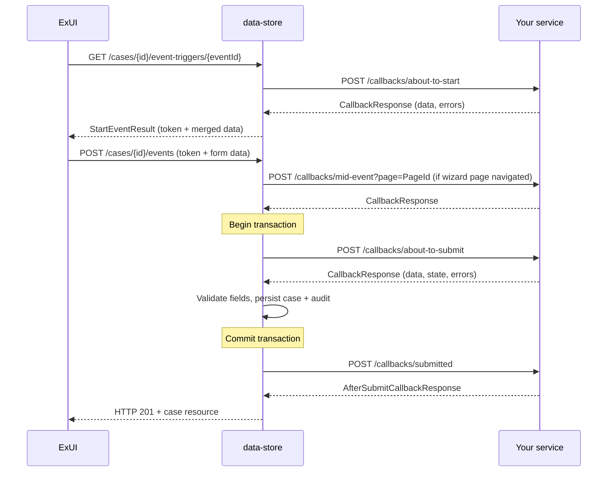

# Callbacks

## TL;DR

- CCD callbacks are synchronous HTTP POST requests data-store fires at your service at key points in an event lifecycle: `about_to_start`, `about_to_submit`, `mid_event`, `submitted`, and `get_case`.
- Your service receives a `CallbackRequest` (current case data + before-snapshot + event ID) and must return a `CallbackResponse` (optionally mutated data, errors, warnings).
- Non-empty `errors` causes data-store to return HTTP 422 and abort the event. Non-empty `warnings` causes a confirmation prompt unless `ignore_warning=true`.
- All callback calls carry `ServiceAuthorization` (S2S) and `Authorization` (user JWT) headers — validate both.
- Data-store retries callbacks up to 3 times (T+1 s, T+3 s) unless the event sets `retriesTimeout=[0]`.
- `submitted` fires after the database transaction commits; its failure is swallowed — the case save is not rolled back.
- In decentralised mode the service owns persistence via `/ccd-persistence/*`; `about_to_submit` and `submitted` callbacks are skipped.

---

## Callback types

| Type | When fired | Can mutate data | Failure aborts save | Recommended use |
|---|---|---|---|---|
| `about_to_start` | On GET event-trigger (before form renders) | Yes — merged into start result | Yes (422) | Pre-populate fields, dynamic-list lookups, validate event eligibility |
| `mid_event` | On page navigation within a multi-page form | Yes | Yes (422) | Cross-page validation, dynamic-list refresh, page-conditional logic |
| `about_to_submit` | Inside the DB transaction, after data merge | Yes | Yes (422 + rollback) | Final validation, computed fields, state override |
| `submitted` | After transaction commits | No (response is notification metadata) | No — swallowed | Notifications, downstream orchestration |
| `get_case` | On case retrieval | Yes — shapes visible data | Yes (422) | Inject metadata fields (labels, show conditions) |

`mid_event` URL is taken from the `WizardPage` definition, not the event — one URL per wizard page (`CallbackInvoker.java:181-188`).  
`get_case` URL is on `CaseTypeDefinition`, not on any event (`CallbackInvoker.java:148`).

> **Pattern guidance** (RCCD callback patterns): `about_to_start` and `mid_event` should never orchestrate downstream processing. `about_to_submit` should be reserved for validation, computed fields, and state override — not side-effects or notifications. Side-effects belong in `submitted`. If the only place to trigger downstream work is `about_to_submit`, return immediately, model an "awaiting X" state, and trigger another event when processing completes.

### Multiple mid-event callbacks

CCD allows multiple mid-event callbacks within a single event provided each wizard page configures a distinct callback URL (one URL per page).
<!-- CONFLUENCE-ONLY: Civil Reform's CCD Callback Framework page documents a `MID_SECONDARY` enum pattern for a second mid-event URL within their handler architecture; this is a service-level convention, not a CCD platform feature. -->


---

## Request shape

Data-store POSTs `CallbackRequest` JSON to your endpoint:

```json
{
  "case_details": {
    "id": 1234567890123456,
    "case_type_id": "NFD",
    "jurisdiction": "DIVORCE",
    "state": "AwaitingPayment",
    "data": { "applicant1FirstName": "Jane", "...": "..." },
    "data_classification": { "applicant1FirstName": "PUBLIC" },
    "security_classification": "PUBLIC",
    "created_date": "2024-01-15T10:30:00.000Z",
    "last_modified": "2024-01-15T10:30:00.000Z"
  },
  "case_details_before": {
    "...": "previous snapshot — null for about_to_start"
  },
  "event_id": "caseworker-confirm-service",
  "ignore_warning": false
}
```

`case_details_before` is `null` for `about_to_start`. Both `case_details` and `case_details_before` are present for `about_to_submit`, `mid_event`, and `submitted`.

---

## Response shape

### `about_to_start`, `mid_event`, `about_to_submit`

Return `CallbackResponse`:

```json
{
  "data": {
    "applicant1FirstName": "Jane",
    "someComputedField": "computed value"
  },
  "data_classification": {
    "someComputedField": "PUBLIC"
  },
  "security_classification": "PUBLIC",
  "state": "AwaitingHWFDecision",
  "errors": [],
  "warnings": ["Document may be missing — proceed?"],
  "error_message_override": null
}
```

- `data` — the full or partial updated case fields. Data-store merges this back into the case.
- `state` — optional; overrides the event's configured post-state if set.
- `errors` — non-empty list triggers HTTP 422 from data-store, event is aborted.
- `warnings` — non-empty list prompts the user for confirmation; blocked if `ignore_warning=false` in the request.
- `error_message_override` — replaces the default error message shown to the user (`CallbackService.java:191-205`).

### `submitted`

Return `AfterSubmitCallbackResponse` — a different, simpler shape used only for surfacing a confirmation message in ExUI:

```json
{
  "confirmation_header": "# Application submitted",
  "confirmation_body": "The case has been updated successfully."
}
```

This response has no effect on case data or state.

---

## Mid-event scope (current and previous pages only)

When CCD invokes a mid-event callback, `case_details` only contains fields belonging to the **current page and previous pages** — fields on later (unvisited) pages are stripped out before the callback runs. This prevents the callback from seeing invalid values left on pages the user navigated back from.

Two consequences:

1. **Mid-event responses are not persisted.** Only the about-to-submit path writes data. Any field changes you make in mid-event are visible to the form for the rest of the wizard journey but disappear if the user abandons the event.
2. **Successive mid-event callbacks see different views.** A field not yet visited may be `null` in an early mid-event call but populated (from the stored case) in a later call after the user has navigated to its page. Don't assume monotonically growing data — design for partial views.

`AuthorisedValidateCaseFieldsOperation.java` is the entry point: it calls the mid-event callback (`callMidEventCallback`), then applies CRUD-based read-access filtering to the result before returning to ExUI (`AuthorisedValidateCaseFieldsOperation.java:60-91`).

### Access control on mid-event responses (CCD-5344)

CCD applies the same role-based access filtering to mid-event callback responses that it applies to other case-data reads. If your callback returns fields the user doesn't have read access to, CCD strips them before sending the response back to ExUI (`AuthorisedValidateCaseFieldsOperation.java:129-151`, using `AccessControlService.filterCaseFieldsByAccess`).

Practical impact:

- It is safe to return the entire case data from a mid-event callback — CCD will filter.
- **Don't rely on receiving fields the user can't read** in later show-conditions or downstream logic. If a show-condition depends on a field only your callback knows about, the user may see different behaviour from what your callback intended.
- Citizen UIs hitting the validate endpoints are subject to the same filter.

A per-case-type opt-out exists via `excludeVerifyAccessCaseTypesForValidate` (config property), but is intended for legacy compatibility, not new code (`AuthorisedValidateCaseFieldsOperation.java:69-74`).

---

## Error and warning semantics

`CallbackService.validateCallbackErrorsAndWarnings()` (`CallbackService.java:191`) applies this logic:

1. If `errors` is non-empty → throw `ApiException` (HTTP 422). Event is aborted.
2. If `warnings` is non-empty **and** `ignore_warning=false` → throw `ApiException` (HTTP 422). ExUI re-presents the form with a "proceed anyway?" prompt.
3. If `warnings` is non-empty **and** `ignore_warning=true` → proceed; warnings are surfaced as informational messages.

Your service should return errors in `errors`, never throw HTTP 5xx for business-logic failures — a 5xx from a callback causes data-store to retry, then propagate a generic error to the user.

---

## Authentication

Every callback request carries two headers (`CallbackService.java:140`):

| Header | Value |
|---|---|
| `ServiceAuthorization` | S2S JWT identifying data-store as the calling service |
| `Authorization` | User JWT of the person triggering the event |

Validate the `ServiceAuthorization` token against your service's allowed S2S services list. The `Authorization` header can be forwarded to downstream IDAM-secured services (e.g. doc-assembly, CDAM).

An additional `Client-Context` header is forwarded from the original caller and must be echoed back in the response if present (`CallbackService.java:207-248`).

---

## Retry behaviour

Data-store uses `@Retryable` on `CallbackService.send()` (`CallbackService.java:75, 87`):

- **Max attempts**: 3 (initial + 2 retries)
- **Backoff**: `@Backoff(delay = 1000, multiplier = 3)` — retry 1 fires 1 s after the initial failure, retry 2 fires 3 s after retry 1's failure. Cumulatively, attempts at T+0, T+1 s, T+4 s.

  > <!-- DIVERGENCE: The source comment at CallbackService.java:74 reads "The retry will be on seconds T=1 and T=3", which is the *delay between* attempts, not the cumulative time. Spring `@Backoff(delay=1000, multiplier=3)` produces 1000 ms before retry 1 and 3000 ms before retry 2 — so absolute retry times are T+1 s and T+4 s. Source comment is misleading; the cumulative reading above is correct. -->

- **Disabled per-event**: when the event definition's `retriesTimeout` is treated as `[0]`, data-store calls `sendSingleRequest()` directly (`CallbackInvoker.java:181-188`). Note: per-event `retriesTimeout` was intentionally discarded in RDM-4316 — see "Configurable timeouts (largely unimplemented)" below.

HTTP timeouts are configured via application properties `http.client.connection.timeout` and `http.client.read.timeout` (`RestTemplateConfiguration.java:48-52`). Each individual attempt's read timeout defaults to **60 seconds**. Your service must respond within the read timeout or data-store will retry. <!-- CONFLUENCE-ONLY: 60-second default per attempt is from RCCD "Configurable Callback timeouts and retries"; not directly visible in source as a constant — it's the platform-default RestTemplate config. -->

Design your callbacks to be idempotent — retries are transparent to your service, but a slow callback that completes after CCD has timed out and retried may execute its side-effects more than once.

### Configurable timeouts (largely unimplemented)

The CCD definition spreadsheet has columns `RetriesTimeoutAboutToStartEvent`, `RetriesTimeoutURLAboutToSubmitEvent`, `RetriesTimeoutURLSubmittedEvent`, `RetriesTimeoutURLMidEvent` that historically promised per-event configurable retry counts and timeouts. **In practice, these values are discarded** (RDM-4316 — see comment at `CallbackService.java:42`). Two effective behaviours remain:

| Column value | Effect |
|---|---|
| Empty | Default 3-attempt retry with backoff (above) |
| `0` | Single attempt, no retries (`sendSingleRequest`) |
| Anything else | Treated identically to empty |

The "comma-separated list of timeouts" form (e.g. `2,5,10`) advertised in older Confluence pages is **not implemented**.

### Timeouts across systems

Multiple timeouts compound at the upstream/downstream boundary:

- **CCD API Gateway** times out at **30 seconds**.
- **ExUI API layer** uses Node's default of **2 minutes**.
- **CCD data-store** retries up to ~184 seconds (3 × 60 s + delays) before giving up.

Two confusing failure modes follow:

1. ExUI session shows the call timed out (after 30 s) but the CCD API completes a few seconds later. When the user logs back in, their transaction has succeeded.
2. CCD times out and rolls the transaction back, but the callback completed at least one of its invocations and already triggered side-effects. The case shows the original state but the side-effect has happened.

Mitigation: keep callbacks fast (well under the 30 s gateway timeout), and keep side-effects in `submitted` so they're tied to a successful commit.

### Truncated callbacks (Spring/Jackson AUTO_CLOSE_JSON_CONTENT)

If your `about_to_submit` callback throws during JSON serialisation, Jackson's default `AUTO_CLOSE_JSON_CONTENT` produces a syntactically valid but incomplete 200 response — CCD treats it as authoritative and **erases all fields not yet serialised**. This has hit production services.

See [Truncated response prevention](../reference/callback-contract.md#truncated-response-prevention) for the mitigation code and detection guidance.

### Callback request/response logging

CCD's data-store can log full callback request/response bodies for debugging. Set the `LOG_CALLBACK_DETAILS` env var (mapped to `ccd.callback.log.control` in `application.properties:280`) to a comma-separated list of URL substrings:

```
LOG_CALLBACK_DETAILS=/case-orchestration/payment-confirmation,/case-orchestration/notify
```

Matching is contains-based. To log all callbacks: `LOG_CALLBACK_DETAILS=*`. Off by default (request/response bodies may contain sensitive data); only enable on non-production for investigations.

---

## Wiring callbacks with ccd-config-generator SDK

In the SDK, callbacks are Java lambdas typed as `AboutToStart<T,S>`, `AboutToSubmit<T,S>`, `Submitted<T,S>`, or `MidEvent<T,S>`. The callback host URL is set once on the case type:

```java
// NoFaultDivorce.java:38 (nfdiv pattern)
configBuilder.setCallbackHost(System.getenv("CASE_API_URL"));
```

Each event wires its callbacks fluently:

```java
configBuilder.event(CASEWORKER_CONFIRM_SERVICE)
    .forStates(AwaitingServiceConsideration)
    .name("Confirm service")
    .aboutToSubmitCallback(this::aboutToSubmit)  // Event.java:40
    .submittedCallback(this::submitted);          // Event.java:41
```

Mid-event callbacks attach per wizard page:

```java
eventBuilder.fields()
    .page("ServiceDetails", this::midEvent)   // FieldCollection.java:495
    .field(CaseData::getServiceMethod);
```

The SDK generates the webhook URL as `<host>/callbacks/about-to-submit` etc. and writes it into the CCD definition.

### Callback method signatures (SDK)

| Callback type | Method signature | Return type |
|---|---|---|
| `aboutToStart` | `(CaseDetails<T,S> details)` | `AboutToStartOrSubmitResponse<T,S>` |
| `aboutToSubmit` | `(CaseDetails<T,S> details)` | `AboutToStartOrSubmitResponse<T,S>` |
| `midEvent` | `(CaseDetails<T,S> details, CaseDetails<T,S> detailsBefore)` | `AboutToStartOrSubmitResponse<T,S>` |
| `submitted` | `(CaseDetails<T,S> details, CaseDetails<T,S> detailsBefore)` | `SubmittedCallbackResponse` |

Return errors via the response builder, not exceptions:

```java
// SystemRequestNoticeOfChange.java:105-108 pattern
return AboutToStartOrSubmitResponse.<CaseData, State>builder()
    .errors(List.of("Cannot apply NoC to offline case"))
    .build();
```

### Mutually exclusive: webhook vs decentralised

`aboutToSubmitCallback` / `submittedCallback` and `submitHandler` (decentralised) are mutually exclusive. Setting both throws `IllegalStateException` at startup (`Event.java:188-199`).

---

## Decentralised mode

In decentralised mode, data-store routes persistence to the service's own database via `/ccd-persistence/*` (Feign, with S2S auth). The key differences:

- `about_to_submit` and `submitted` callbacks are **not fired** (`CallbackInvoker.java:98-99, 123-125`). Business logic runs inside `submitHandler` instead.
- The service implements `POST /ccd-persistence/cases` (and related endpoints) — this is handled automatically by the `decentralised-runtime` module's `ServicePersistenceController`.
- Data-store sends an `Idempotency-Key` UUID header on every `POST /ccd-persistence/cases` call (`ServicePersistenceAPI.java:46`). Your service must honour it — identical key = same response.
- Config maps case-type ID prefixes to service base URLs: `ccd.decentralised.case-type-service-urls[PCS_PR_]=https://pcs-api-pr-%s.preview.platform` (`application.properties:203-206`).

The `submitHandler` lambda receives an `EventPayload` (deserialised domain object) and runs entirely within the service process — no HTTP round-trip to CCD for business logic.

### Service Persistence API endpoints

Decentralised services must implement the following endpoints. All require both `ServiceAuthorization` (S2S — services **must** validate this is from CCD) and `Authorization` (forwarded user IDAM token).

| Endpoint | Purpose | Notes |
|---|---|---|
| `POST /ccd-persistence/cases` | Submit a case event (replaces `about_to_submit` + `submitted`) | Idempotent on `Idempotency-Key` header; CCD does **not** retry on failure |
| `POST /ccd-persistence/cases/{ref}/supplementary-data` | Update supplementary data | Same contract as CCD's existing supplementary-data endpoint |
| `GET /ccd-persistence/cases?case-refs=...` | Bulk fetch full case details for one or more refs | Empty array if none found (200 OK); CCD validates returned `case_reference` and `case_type_id` match expectation |
| `GET /ccd-persistence/cases/{ref}/history` | Full event history (chronological, most-recent-first) | Returns array of `DecentralisedAuditEvent` |
| `GET /ccd-persistence/cases/{ref}/history/{event-id}` | Single event with case-data snapshot at that point | Returns full data + classification |

### Idempotency contract

CCD generates the `Idempotency-Key` UUID by hashing the event's start-event token (deterministic per-start-event). Your service:

- **First request** with a new key → process the event, return `201 Created`.
- **Subsequent requests** with the **same key** → must **not** re-process. Retrieve the previously persisted result from the event history (not just "the latest case data" — other events may have happened since) and return `200 OK` with an **identical body**.

CCD will **not** retry on an unsuccessful response from the persistence endpoint (unlike conventional callbacks). Upstream CCD clients may retry on ambiguous responses (timeout, 5xx) — the idempotency key makes this safe.

### POST /ccd-persistence/cases — request body

```json
{
  "case_details_before": { "...": "(optional) pre-event state" },
  "case_details": {
    "jurisdiction": "PROBATE",
    "case_type_id": "GrantOfRepresentation",
    "state": "BOReadyToIssue",
    "id": 1616000123456789,
    "version": 5,
    "data": { "applicationType": "Solicitor" }
  },
  "event_details": {
    "case_type": "GrantOfRepresentation",
    "event_id": "boReadyToIssue",
    "event_name": "Ready to issue",
    "summary": "Case is now ready to be issued",
    "description": "All checks passed",
    "proxied_by": null,
    "proxied_by_first_name": null,
    "proxied_by_last_name": null
  },
  "internal_case_id": 424242,
  "resolved_ttl": "2045-01-30",
  "start_revision": 5,
  "merge_revision": 5
}
```

Field notes:

- `internal_case_id` — the integer primary key of CCD's `case_data` row; required because the service is now responsible for indexing into Elasticsearch and ES uses this as the document key.
- `resolved_ttl` — CCD remains authoritative for retain-and-dispose. Decentralised services persist this value and must dispose of cases whose `resolved_ttl` is in the past (typically via a daily cron). Update only via case events, never direct mutation.
- `start_revision` — case revision the start-event was based on. Use to enforce optimistic locking: reject if it doesn't match the current revision.
- `merge_revision` — case revision CCD merged into immediately before submitting. `null` for new cases. For future use by services supporting concurrent overlapping events.

### POST /ccd-persistence/cases — response body

```json
{
  "case_details": {
    "jurisdiction": "PROBATE",
    "case_type_id": "GrantOfRepresentation",
    "state": "BOReadyToIssue",
    "id": 1616000123456789,
    "data": { "applicationType": "Solicitor" },
    "security_classification": "PUBLIC",
    "created_date": "2024-01-01T12:00:00.000Z",
    "last_modified": "2024-01-02T14:30:00.000Z",
    "version": 6
  },
  "revision": 6,
  "errors": [],
  "warnings": [],
  "ignore_warning": false
}
```

- `revision` is monotonically increasing — services **must** increment on every event. Distinct from `version`, which tracks the legacy CCD JSON blob and may **not** increment per event.
- Non-empty `errors` → CCD treats as 422 (validation failure), surfaces messages to user.
- Non-empty `warnings` with `ignore_warning=false` → CCD treats as failure (re-prompt).

### Status codes

| Status | Meaning |
|---|---|
| `201 Created` | Success — first request for this idempotency key |
| `200 OK` | Success — repeat request with same idempotency key (body must be identical) |
| `409 Conflict` | Concurrency conflict — service rejected because another event committed first. CCD propagates to user as "review and try again". |
| `422 Unprocessable Entity` | Validation failure — non-empty `errors`/`warnings`. |
| `400 Bad Request` | Malformed body or **unrecognised case type** — services **must** return 4xx for unknown types so CCD doesn't keep the case pointer. |
| `401`/`403` | S2S invalid or service not authorised. |

### Concurrency model

In conventional mode CCD uses a single `version` integer column as a global optimistic lock — concurrent events on the same case fail. In decentralised mode the service owns concurrency:

- The service is responsible for rejecting conflicting concurrent submissions with `409 Conflict`.
- A new monotonically-incrementing `revision` field replaces the role of the global lock for ordering.
- CCD's local derived data (Case Links, Resolved TTL) is kept in sync via a `SynchronisedCaseProcessor` that uses pessimistic locking + revision comparison — a stale (lower-revision) update is dropped.

### Case pointers

When a decentralised case is created, CCD writes an immutable "case pointer" row to its own `case_data` table containing only `id`, `reference`, `jurisdiction`, `case_type_id`, `created_date`, and an empty `data` blob (`{}`). All other columns are placeholders:

| Column | Pointer value |
|---|---|
| `state` | empty string `''` (authoritative state held by service) |
| `security_classification` | hardcoded `RESTRICTED` (failsafe placeholder) |
| `data`, `data_classification` | `{}` |
| `last_modified`, `last_state_modified_date`, `supplementary_data` | NULL |
| `resolved_ttl` | computed by CCD from the decentralised data blob |

The pointer is created in a `@Transactional(propagation = REQUIRES_NEW)` transaction so it commits independently of the remote `submitEvent` call. If the remote call subsequently fails (4xx, or 200/201 with non-empty `errors`), CCD deletes the pointer.

> Dangling pointers (created, but cleanup failed before commit — e.g. CCD crashed) get a 1-year `resolvedTTL` so retain-and-dispose eventually removes them. They are invisible to API consumers because they aren't indexed into Elasticsearch.

### Search and indexing in decentralised mode

CCD continues to use its central Elasticsearch cluster for all queries. Indexing changes:

- Centralised cases — existing Logstash indexes from CCD's PostgreSQL.
- Decentralised cases — **the service** provisions a dedicated Logstash instance reading from its own database into the central ES cluster.
- Decentralised indexers must use ES external versioning and start version numbers at `v > 1` (so the service's first write overrides CCD's initial pointer write).

<!-- CONFLUENCE-ONLY: detailed pointer schema, case-pointer cleanup conditions, dangling-pointer TTL, indexing conventions, and revision/version distinction are from RCCD "Decentralised data persistence" LLD. The LLD is the canonical contract that services implement; SDK source corroborates the request/response shape (`ServicePersistenceController`, `DecentralisedSubmitEventResponse`) but not all the schema/behaviour detail. -->

### Performance impact

Decentralised cases incur additional network hops. Measured p50 latencies (approximate, from RCCD performance testing):

| Hop | p50 |
|---|---|
| CCD → Service | 1 ms |
| Service → S2S (token validation) | 3 ms |
| Service → IDAM (token validation) | 18 ms |
| Service → Service DB (single PK lookup) | 1 ms |

A decentralised case fetch is therefore ~25 ms slower than centralised. CCD mitigates with a 100k-entry Caffeine cache mapping case reference → case type ID for the routing decision.

<!-- CONFLUENCE-ONLY: latency figures from RCCD "Decentralised data persistence" performance section. -->


---

## Event lifecycle sequence (conventional mode)



---

## Gotchas

- `submitted` callback failure is caught and logged, not re-thrown (`DefaultCreateEventOperation.java:100-104`). Do not rely on it for data mutations.
- Retry config (`retriesTimeout` values in the event definition spreadsheet) was intentionally discarded in RDM-4316 (`CallbackService.java:42`). Effective behaviour is "default 3 attempts" or "0 = single attempt"; nothing else is honoured.
- `mid_event` URL is on the `WizardPage`, not the event — you get one URL per page, with `?page=<pageId>` appended.
- Mid-event payloads only include current-and-previous-page fields. Successive mid-event calls in the same journey can see different snapshots.
- Mid-event responses are filtered by CRUD read-access before reaching ExUI (CCD-5344). Don't depend on receiving fields the user can't read in your callback's downstream logic.
- **AUTO_CLOSE_JSON_CONTENT silent corruption**: a serialisation exception in your `about_to_submit` handler can produce a 200 OK with truncated-but-valid JSON, erasing case fields. Disable the Jackson feature explicitly.
- In decentralised mode, the external service must return `revision`, `version`, and `securityClassification`; missing any throws `ServiceException` (`ServicePersistenceClient.java:132-143`).
- Decentralised mode does **not** retry on persistence-API failures — services must implement idempotency on `Idempotency-Key`.
- Notification dispatch should always be in `submitted`, not `aboutToSubmit` — separates data mutation from side-effects and avoids re-sending on retry.
- The CCD API Gateway times out at 30 s; a slow callback can finish successfully after the user's UI session has already given up.

---

## See also

- [Event model](event-model.md) — how events orchestrate the callback sequence
- [Implement a callback](../how-to/implement-a-callback.md) — step-by-step SDK wiring and handler guide
- [Callback contract reference](../reference/callback-contract.md) — full request/response field reference

## Example

<!-- source: libs/ccd-config-generator/test-projects/e2e/src/main/java/uk/gov/hmcts/divorce/sow014/nfd/CaseworkerAddNote.java:44-84 -->
```java
// from libs/ccd-config-generator/test-projects/e2e/src/main/java/uk/gov/hmcts/divorce/sow014/nfd/CaseworkerAddNote.java

// Wiring the aboutToSubmit callback on the event builder:
new PageBuilder(configBuilder
    .event(CASEWORKER_ADD_NOTE)
    .forAllStates()
    .name("Add note")
    .aboutToSubmitCallback(this::aboutToSubmit)   // wired here
    .grant(CREATE_READ_UPDATE, CASE_WORKER, SOLICITOR, JUDGE))
    .page("addCaseNotes")
    .optional(CaseData::getNote);

// The callback method itself:
public AboutToStartOrSubmitResponse<CaseData, State> aboutToSubmit(
    final CaseDetails<CaseData, State> details,
    final CaseDetails<CaseData, State> beforeDetails
) {
    var caseData = details.getData();
    final User caseworkerUser = idamService.retrieveUser(request.getHeader(AUTHORIZATION));
    // ... persist side-effects ...
    return AboutToStartOrSubmitResponse.<CaseData, State>builder()
        .data(caseData)
        .build();
}
```
