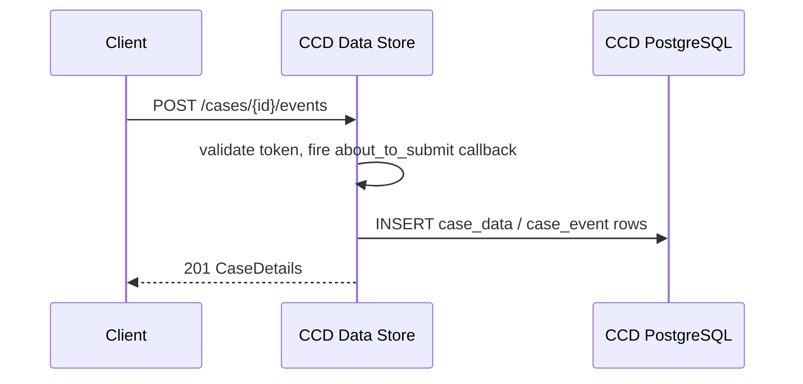
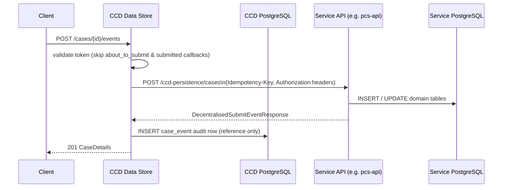
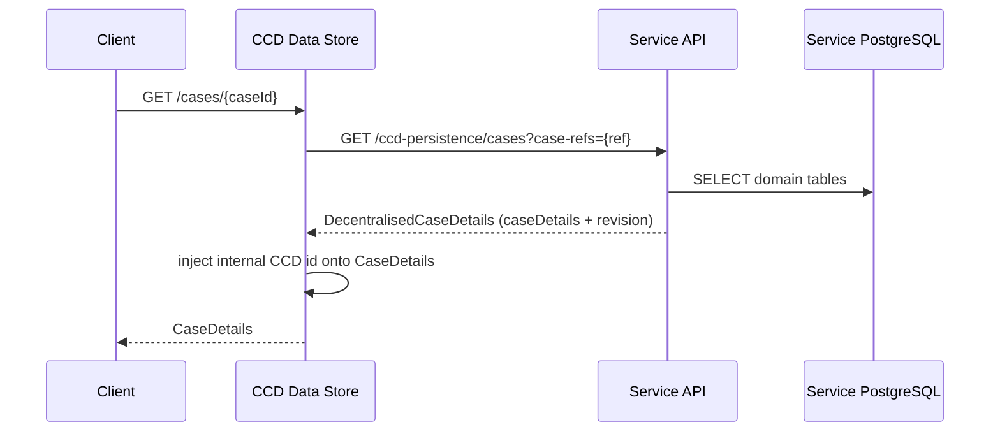

# Decentralisation

## TL;DR

- In decentralised mode a service owns case data in its own database; CCD data-store delegates reads and writes to the service via `/ccd-persistence/*` endpoints. CCD's role shrinks to a **case data gateway and access-control plane** plus a lightweight **case pointer** row (reference, case type, jurisdiction).
- Routing is configured with `ccd.decentralised.case-type-service-urls` — a prefix map from case type ID to base URL (`application.properties:203-206`). Longest matching prefix wins; templates support a `%s` placeholder for preview environments.
- The service gets these endpoints for free by setting `ccd { decentralised = true }` in its Gradle build; the `decentralised-runtime` SDK module injects `ServicePersistenceController` automatically.
- Events are typed Java handlers (`Submit<T,S>`) rather than HTTP webhook callbacks; `aboutToSubmit` and `submitted` callbacks are skipped for decentralised case types.
- A new **`revision`** field, monotonically incremented by the service on every event, is exchanged in both directions and used by CCD's `SynchronisedCaseProcessor` to coordinate updates of derived data (resolvedTTL, case links).
- Two production adopters: **PCS** (`apps/pcs/pcs-api`) and **CIC** (Criminal Injuries Compensation, the first lift-and-shift adopter, TAB-approved 2 Dec 2025).

## Why decentralisation exists

Standard CCD persists every case as a JSONB blob in CCD's own PostgreSQL schema. That works well for services whose data model is stable and whose access patterns fit CCD's generic queries. Some services need something different:

- **Data sovereignty** — the service team owns and migrates their own schema without coupling to CCD's release train.
- **Schema evolution** — a typed relational model (with Flyway migrations) is easier to evolve than a shared JSONB column.
- **Performance** — the service can use optimised queries, indexes, and read models instead of the generic CCD data table.
- **Domain logic at persist time** — the `Submit<T,S>` handler runs inside the service's own transaction, so domain invariants are enforced in one place.
- **Domain-appropriate concurrency** — services pick the locking model that fits (per-row optimistic, per-aggregate pessimistic, etc.) rather than CCD's single-row optimistic lock against the whole case.

The strategic shift, approved by TAB on 2 December 2025, transforms CCD from a monolithic data repository into a **Case Data Gateway and Access Control Plane**. Centralised cases continue to work unchanged — the two persistence models coexist, and adoption is **incremental**, case type by case type.

> "A case now *has* a JSON view, not *is* a JSON structure. The JSON is only a projection from the source of truth."
> — CIC CCD Decentralisation Solution Overview

## The case pointer

Every decentralised case has a corresponding **pointer row** in CCD's existing `case_data` table. The pointer serves a single purpose: routing. It maps the immutable 16-digit case reference to a case type so that subsequent requests can be dispatched to the right service.

`CasePointerRepository.persistCasePointerAndInitId()` (`CasePointerRepository.java:38-54`) is annotated `@Transactional(propagation = Propagation.REQUIRES_NEW)` so the pointer commits in its own transaction, **before** CCD calls the service's `submitEvent`. If the remote call fails, CCD rolls back the pointer in a separate transaction.

### What a pointer row contains

The columns are reused but with constrained semantics:

| Column | Centralised case | Decentralised pointer |
|---|---|---|
| `id` | Primary key | Primary key (unchanged) |
| `reference` | 16-digit reference | 16-digit reference (unchanged) |
| `jurisdiction` | Jurisdiction | Jurisdiction (unchanged) |
| `case_type_id` | Case type | Case type (unchanged — used for routing) |
| `created_date` | When created | When pointer created |
| `last_modified` | Last modified | `NULL` (authoritative value lives in service) |
| `last_state_modified_date` | Last state change | `NULL` (authoritative value lives in service) |
| `state` | Current state | Empty string `''` (state owned by service) |
| `security_classification` | `PUBLIC` / `PRIVATE` / `RESTRICTED` | Hardcoded `RESTRICTED` (failsafe placeholder) |
| `data` | Full case JSONB | Always `{}` |
| `data_classification` | Per-field classification | Always `{}` |
| `supplementary_data` | JSONB blob | `NULL` |
| `resolved_ttl` | TTL computed from `data` | TTL computed from the *decentralised* data blob |
| `version` | Optimistic lock | Last-processed **revision** from the decentralised service (used by `SynchronisedCaseProcessor` to prevent stale derived-data updates) |

`CasePointerRepository.java:40-50` enforces these placeholders: pointer rows have `data = {}`, `data_classification = {}`, `securityClassification = RESTRICTED`, `state = ""`, `lastModified = null`, `lastStateModifiedDate = null`, `version = null`. <!-- Confluence claims `data_classification` is `{}` and `supplementary_data` is `NULL`; source sets `data_classification` empty in `persistCasePointerAndInitId` but doesn't explicitly set `supplementary_data` (default-NULL via column default). -->

### Dangling pointers

If `submitEvent` fails *and* the pointer rollback also fails (e.g. CCD process crashes between the two), a "dangling pointer" can be left behind. These are invisible to API consumers because they would not be indexed into Elasticsearch and aren't retrievable through CCD's APIs. To bound the problem, `CasePointerRepository.java:48-51` defaults `resolvedTTL` to **today + 1 year** for any pointer where the service hasn't supplied an explicit TTL, ensuring retain-and-dispose eventually cleans them up. On the next successful event the TTL is either removed (no service-configured TTL) or set to the configured value.

### Rollback triggers

`SubmitCaseTransaction` (`SubmitCaseTransaction.java:223-257`) rolls back the pointer in two cases:

1. The service returned **HTTP 4xx** (`feignException.status() >= 400 && < 500`).
2. The service returned 2xx but the response body included **non-empty `errors` or non-empty `warnings`** (where `ignore_warning=false`) — an `ApiException` is thrown by `ServicePersistenceClient`.

In both cases `casePointerRepository.deleteCasePointer()` runs in `REQUIRES_NEW`, so the cleanup is independent of any outer transaction state. A failure to delete the pointer is logged but does not mask the original error returned to the client.

## Architecture: central vs decentralised

### Central (standard) persistence



### Decentralised persistence



### Decentralised read



## How CCD routes to a decentralised service

`PersistenceStrategyResolver` (`PersistenceStrategyResolver.java:27`) loads `ccd.decentralised.case-type-service-urls` at startup — a map of case type ID prefix to base URL. Prefix matching is case-insensitive (keys are lowercased at load time, `PersistenceStrategyResolver.java:63-75`). The longest matching prefix wins; ambiguous configuration (two prefixes of equal length both matching) throws `IllegalStateException` at lookup time (`PersistenceStrategyResolver.java:143-152`).

Example configuration:

```properties
# application.properties (ccd-data-store-api)
ccd.decentralised.case-type-service-urls[PCS]=https://pcs-api.platform.hmcts.net
# Preview PR environments use a %s placeholder for the PR suffix
ccd.decentralised.case-type-service-urls[PCS_PR_]=https://pcs-api-pr-%s.preview.platform
```

### Caching

The resolver keeps an in-memory **Caffeine LRU cache** mapping case reference (long) -> case type ID (string), sized to **100 000 entries** (`PersistenceStrategyResolver.java:50-56`). This avoids a database round-trip on every routing decision. At ~100 bytes per entry the cache caps memory at ~10 MB while comfortably covering the working set — production traffic peaks observed at ~15 000 unique cases modified per hour.

### Latency budget

Decentralised reads and writes pay an additional network round-trip plus the service's own validation. From the LLD's measured p50 latencies:

| Hop | p50 latency |
|---|---|
| CCD → Service | 1ms |
| Service → S2S validation | 3ms |
| Service → IDAM validation | 18ms |
| Service → its own DB (PK lookup) | 1ms |

Total: **~25 ms additional latency** for a decentralised case versus the centralised fast path. <!-- CONFLUENCE-ONLY: latency figures are from production application logs cited in the LLD; not derivable from source. -->

### Write path

`DelegatingCaseDetailsRepository.set()` (`DelegatingCaseDetailsRepository.java:46`) checks `resolver.isDecentralised(caseDetails)` on every write — if true it throws `UnsupportedOperationException` (decentralised case pointers are immutable in CCD's database). For reads, `findAndDelegate()` routes to `ServicePersistenceClient.getCase()` when the local pointer's case type is decentralised. Event submissions bypass this repository entirely and go directly through `ServicePersistenceClient.createEvent()`.

## The `/ccd-persistence` contract

CCD data-store acts as the **client**; the service acts as the **server**. The Feign interface `ServicePersistenceAPI` (`ServicePersistenceAPI.java`) declares the full contract:

| Endpoint | Purpose | Notable headers |
|---|---|---|
| `POST /ccd-persistence/cases` | Submit create or update event | `Idempotency-Key` (UUID), `Authorization`, `ServiceAuthorization` |
| `GET /ccd-persistence/cases?case-refs=` | Bulk-fetch one or more cases by reference | `Authorization`, `ServiceAuthorization` |
| `POST /ccd-persistence/cases/{ref}/supplementary-data` | Update supplementary data | — |
| `GET /ccd-persistence/cases/{ref}/history` | Full audit event list | — |
| `GET /ccd-persistence/cases/{ref}/history/{eventId}` | Single audit event | — |

Both `ServiceAuthorization` (S2S) and `Authorization` (end-user IDAM) tokens are forwarded on every call. Services **MUST** validate the S2S token to confirm the request originated from a trusted CCD instance; the IDAM token is available for any service-side authorisation logic.

Key constraints enforced by `ServicePersistenceClient`:

- The service must return `revision`, `version`, and `securityClassification`; any missing field throws `ServiceException` (`ServicePersistenceClient.java:132-143`).
- The returned `reference`, `caseTypeId`, and `jurisdiction` must match what CCD sent — mismatch throws `ServiceException` (`ServicePersistenceClient.java:131-163`).
- The `Idempotency-Key` header on `POST /ccd-persistence/cases` must be honoured: repeated calls with the same key must return the same response (`ServicePersistenceAPI.java:46` javadoc). Specifically, the response must be reconstructed from the event history (not "the latest case data"), because intervening events may have changed it.
- CCD's internal numeric `id` is **not** sent to the service in the get-case path; it is injected onto the returned object after retrieval (`ServicePersistenceClient.java:54, 108`). For event submission, the `internal_case_id` *is* sent in the body so the service can use it as the ES indexing key.

### Idempotency key derivation

CCD generates the `Idempotency-Key` deterministically from the start-event token. `IdempotencyKeyHolder` calls `UUID.nameUUIDFromBytes(digest)` (`IdempotencyKeyHolder.java:27`), so any two submissions backed by the same start token produce the same UUID. Services use this as a deduplication key:

- First request with a new key: process and return `201 Created` with the new case state.
- Repeat request with the same key: do **not** re-process — reconstruct the response from the event history and return `200 OK`.

CCD does **not** auto-retry decentralised submissions (unlike traditional callbacks). Upstream CCD clients *may* retry on ambiguous responses (timeouts, 5xx) because the contract is idempotent.

### Revision: the new concurrency primitive

A monotonically-incrementing `revision` is owned by the service and exchanged with CCD on every interaction. This is **distinct from** `CaseDetails.version` (the legacy optimistic-lock counter on the JSONB blob, which decentralised services aren't required to increment per event).

`DecentralisedCaseEvent` carries two revision fields when CCD submits an event (`DecentralisedCaseEvent.java:34-39`):

- `start_revision` — the revision the user saw when they started the event (from the start-event token). Services can use this to enforce a global optimistic lock or to detect changes since the user began.
- `merge_revision` — the revision CCD merged updates into immediately before submission. Null on new-case creation. Reserved for future tooling that needs to coordinate concurrent (overlapping) events.

The service responds with the new revision (incremented) inside `DecentralisedCaseDetails.revision` (`DecentralisedCaseDetails.java:14`). CCD's `SynchronisedCaseProcessor` (`SynchronisedCaseProcessor.java:44-72`) then uses this revision to decide whether to apply a derived-data update locally:

1. Acquire a pessimistic lock on the `case_data` row (`SELECT version FROM case_data WHERE reference = :ref FOR UPDATE`).
2. If `incoming_revision > current_revision`, run the derived-data update and bump `case_data.version` to the incoming revision.
3. Otherwise skip — a newer event has already been applied.

This is wrapped in `@Transactional(propagation = Propagation.REQUIRES_NEW)` so the lock window stays small (the service has already committed; CCD is just synchronising its own derived state).

### `DecentralisedSubmitEventResponse` shape

```java
class DecentralisedSubmitEventResponse {
    @JsonUnwrapped DecentralisedCaseDetails caseDetails; // contains caseDetails + revision
    List<String> errors;
    List<String> warnings;
    Boolean ignoreWarning;
}
```

Because `caseDetails` is `@JsonUnwrapped`, the `revision` field appears at the **top level** of the JSON envelope, alongside `errors` / `warnings`, not nested under `case_details`. The Confluence example shows `"revision": 6` and `"case_details": {...}` as siblings — that matches the source.

Service-side response semantics:

- `errors` non-empty -> CCD treats as failure, throws `ApiException`, rolls back the case pointer (on creation).
- `warnings` non-empty AND `ignore_warning=false` (the original CCD request flag) -> same.
- HTTP 422 is the conventional status code when returning errors/warnings in the body.

### `DecentralisedCaseEvent.event_details`

Beyond the obvious `event_id` / `event_name`, the event-details object carries `proxied_by`, `proxied_by_first_name`, and `proxied_by_last_name` so on-behalf-of actions are preserved through the audit trail.

## Callback differences for decentralised case types

Decentralised case types skip `aboutToSubmit` and `submitted` HTTP callbacks entirely (`CallbackInvoker.java:98-99, 123-125`). Domain logic that would have gone in those webhooks is instead implemented as a typed `Submit<T,S>` handler running inside the service's own transaction.

`CreateCaseEventService` bypasses `saveCaseDetails` for decentralised cases and calls `DecentralisedCreateCaseEventService.submitDecentralisedEvent()` instead (`CreateCaseEventService.java:284`).

Audit history for decentralised cases is loaded by `DecentralisedAuditEventLoader` (rather than `LocalAuditEventLoader`), which calls `GET /ccd-persistence/cases/{ref}/history` on the service.

## Implementing a decentralised service with the SDK

The `ccd-config-generator` SDK's `decentralised-runtime` module provides everything a service needs.

### 1. Enable decentralised mode in Gradle

```groovy
// build.gradle
ccd {
    decentralised = true
    runtimeIndexing = true   // re-index CCD config at startup
}
```

Setting `decentralised = true` pulls in the `decentralised-runtime` dependency and wires `ServicePersistenceController` automatically (`build.gradle:98-102` in pcs-api). The service does **not** write this controller itself.

### 2. Implement `CaseView`

```java
@Component
public class PCSCaseView implements CaseView<PCSCase, State> {

    @Override
    public PCSCase getCase(CaseViewRequest<State> request) {
        // load from your own repository
        PcsCaseEntity entity = pcsCaseRepository
            .findByCaseReference(request.caseRef());
        PCSCase pcsCase = assembleFromEntity(entity);
        pcsCase.setSearchCriteria(new SearchCriteria()); // feeds GlobalSearch
        return pcsCase;
    }
}
```

`PCSCaseView.java:82` shows the production implementation. `CaseProjectionService` (inside `decentralised-runtime`) calls this bean when CCD requests a case read.

### 3. Define decentralised events

Use `configureDecentralised(DecentralisedConfigBuilder)` rather than `configure(ConfigBuilder)`:

```java
@Override
public void configureDecentralised(DecentralisedConfigBuilder<PCSCase, State, UserRole> builder) {
    builder.decentralisedEvent("createPossessionClaim", this::handleCreate)
        .name("Create possession claim")
        .fields()
        // ... field configuration
        ;
}

private SubmitResponse<State> handleCreate(EventPayload<PCSCase, State> payload) {
    // persist to your own DB inside this handler
    pcsService.createClaim(payload.caseReference(), payload.caseData());
    return SubmitResponse.defaultResponse();
}
```

`EventPayload` is a Java record (`EventPayload.java:7`) carrying `caseReference`, `caseData`, and `urlParams`. `SubmitResponse.defaultResponse()` is the no-op variant when the service handles persistence internally and has nothing to signal back.

`submitHandler` and `aboutToSubmitCallback` are mutually exclusive — setting both throws `IllegalStateException` (`Event.java:196-203`).

### 4. Configure CCD routing (env var)

```bash
# In CCD data-store deployment
CCD_DECENTRALISED_CASE-TYPE-SERVICE-URLS_PCS=http://pcs-api:4550
```

The env var key maps to `ccd.decentralised.case-type-service-urls[PCS]`. For preview PR environments pcs-api uses a `%s` template suffix (`application.properties:203-206`).

### 5. Database migrations

`DecentralisedDataConfiguration` (`@AutoConfiguration`) runs SDK Flyway migrations from `classpath:dataruntime-db/migration` in schema `ccd` before the service's own migrations (`DecentralisedDataConfiguration.java:17-50`). If the service defines its own `FlywayMigrationStrategy` bean the SDK migrations will not run automatically (`@ConditionalOnMissingBean`).

## Supplementary data

Supplementary data updates also route through the decentralised service. `DelegatingSupplementaryDataUpdateOperation` sends `POST /ccd-persistence/cases/{ref}/supplementary-data` to the service rather than updating the local JSONB column. The service must follow the same operation semantics as CCD's existing supplementary-data update API (set / increment / merge — see the supplementary data reference for the operation grammar).

## Search and Elasticsearch indexing

CCD continues to use its central Elasticsearch cluster as the single source for all search queries. **For decentralised case types, Elasticsearch is the only supported search mechanism** (legacy SQL-based search is not available because CCD doesn't hold the data).

The indexing pipeline is what changes:

- **Centralised cases**: existing Logstash instances continue to index from CCD's PostgreSQL.
- **Decentralised cases**: each adopting service provisions its **own dedicated Logstash instance** that reads from a view or table in the service's database and writes into CCD's shared ES cluster.

To prevent the centralised and service-owned indexers from racing each other, two rules apply (`db/migration/V0001__Base_version.sql:71, 1170`):

- Decentralised Logstash indexers **must use Elasticsearch external versioning**.
- Services **must start their external version numbers at v > 1**, because CCD's centralised pipeline writes `version=1` for the pointer row at creation. Starting above 1 ensures the service's first write wins over the pointer's baseline.
- Subsequent case events on a pointer never modify columns that would re-trigger the centralised Logstash extract.

<!-- CONFLUENCE-ONLY: the v>1 rule is documented in the LLD with links to specific lines in V0001__Base_version.sql; verified those lines exist but the rule itself is operational guidance not enforced by code. -->

## Message publishing (transactional outbox)

Decentralised services must continue to publish event messages so downstream consumers (task management / work allocation, ccd-message-publisher) keep getting their at-least-once delivery.

The pattern: during event submission the service performs **two writes inside one atomic transaction** — the case-data write *and* an insert into a local `message_queue_candidates` table (mirroring CCD's existing transactional-outbox table). A separate poller drains the outbox onto the message bus.

CCD's existing `ccd-message-publisher` service can be reused and re-deployed by the decentralised service to drain its local outbox. <!-- CONFLUENCE-ONLY: this re-use pattern is described in the LLD; the SDK's outbox wiring is partially confirmed by `decentralised-runtime`'s migrations under `dataruntime-db/migration` but the publisher reuse claim wasn't directly verified in code. -->

## Preview environment support

The `%s` placeholder in `ccd.decentralised.case-type-service-urls` is replaced with the case type ID suffix at routing time (`PersistenceStrategyResolver.java:171, 175`). Combined with `CASE_TYPE_SUFFIX` (appended to case type ID and name, `CaseType.java:44-48`), this allows each PR to get its own isolated case type routed to its own preview deployment.

## Example

### `CaseView` implementation — PCS production reference

```java
// from apps/pcs/pcs-api/src/main/java/uk/gov/hmcts/reform/pcs/ccd/PCSCaseView.java
@Component
@AllArgsConstructor
public class PCSCaseView implements CaseView<PCSCase, State> {

    private final PcsCaseRepository pcsCaseRepository;
    // ...

    @Override
    public PCSCase getCase(CaseViewRequest<State> request) {
        long caseReference = request.caseRef();
        State state = request.state();

        PCSCase pcsCase = getSubmittedCase(caseReference);

        // ... enrich view fields ...

        // Required for Global Search indexing
        pcsCase.setSearchCriteria(new SearchCriteria());

        return pcsCase;
    }

    private PcsCaseEntity loadCaseData(long caseRef) {
        return pcsCaseRepository.findByCaseReference(caseRef)
            .orElseThrow(() -> new CaseNotFoundException(caseRef));
    }
}
```

<!-- source: apps/pcs/pcs-api/src/main/java/uk/gov/hmcts/reform/pcs/ccd/PCSCaseView.java:54-97 -->

## Retain-and-dispose for decentralised cases

CCD remains the **authority for TTL evaluation** even for decentralised cases — every TTL change still flows through CCD's event pipeline, which applies the TTL guard, recalculates `resolvedTTL`, and returns it in the `DecentralisedCaseEvent.resolved_ttl` field on submit.

The disposal split:

| Responsibility | Owner |
|---|---|
| Setting / extending / suspending TTLs (via events) | CCD (unchanged) |
| Computing `resolvedTTL` (TTL guard etc.) | CCD (unchanged) |
| Purging expired pointer rows + CCD-owned artefacts (audit, document refs, role assignments) | CCD (case disposer) |
| Persisting the service-side TTL field exactly as CCD supplied it | Service |
| Identifying decentralised cases past `resolvedTTL` and verifying CCD has disposed (404 on GET) before deleting locally | Service |

Decentralised services **must** echo CCD's `resolved_ttl` back unchanged. <!-- CONFLUENCE-ONLY: the LLD says "if the response omits or alters the CCD-calculated values the submission is rejected" — couldn't find an explicit validator in source for this on the response path, only on the request path via TTL field guards. -->

The "garbage collection" pattern on the service side: a periodic cron walks rows where `resolved_ttl < today`, calls CCD's GET-case API as a system user with appropriate access; if CCD returns 404, the pointer has been disposed and the service can safely delete the local data. If CCD returns 200, the pointer is still there (TTL was extended or disposal hasn't run yet) — leave the local row alone and re-check next cycle.

## Design boundaries (what hasn't changed)

A few things are deliberately **not** moved to the service in this iteration of the design:

- **Case-event data merging** stays in CCD. Hundreds of existing service callbacks rely on CCD's merge logic (which spans roles, access profiles, definitions, and the case-data payload). Wholesale changes here would risk silent data-corruption bugs that the wider initiative is trying to mitigate. Services can incrementally shift merge responsibility into their own domain, event by event, by configuring event-specific fields that render the CCD merge process a no-op.
- **Access control enforcement** stays in CCD. CCD remains the central authority for ACLs, CRUD permissions, security classification, and role-based access — those checks run *before* delegating to the service. Services may layer additional fine-grained rules on top, but they may only **tighten** access, not relax it.
- **The ExUI contract stays the same.** Decentralised services continue to exchange a JSON case payload with CCD, which CCD then composes into the shape ExUI expects. Common components (NoC, Query Management, Case Flags, Search) keep working through CCD's existing APIs with no per-component changes.
- **Designs are not set in stone.** The LLD explicitly notes the absence of a feature now does not preclude it in future; the team expects to evolve these designs upon contact with reality.

## Adopters

Two services are in flight as of late 2025 / early 2026:

- **PCS** (Possession Claims Service, `apps/pcs/pcs-api`) — the canonical reference for the SDK-based pattern. Builds with `ccd { decentralised = true }`, uses the `decentralised-runtime` module, and implements `CaseView` / `configureDecentralised`. See the working example below.
- **CIC** (Criminal Injuries Compensation, Special Tribunals) — a deliberate **like-for-like lift-and-shift** with no functional changes. Chosen as the first adopter for its smaller scale; case data and event history continue to be stored as JSON directly representing the CCD definition structure, just in a CIC-owned Postgres Flexible Server. TAB-approved 2 December 2025.

The CIC migration is the one to watch for an existing-case-type lift-and-shift template; PCS is the template for greenfield.

## See also

- [Decentralise a service](../how-to/decentralise-a-service.md) — step-by-step guide to enabling decentralised mode
- [Decentralised callbacks reference](../reference/decentralised-callbacks.md) — `/ccd-persistence` contract and response field reference
- [Architecture](architecture.md) — where decentralised services fit in the broader CCD runtime topology
