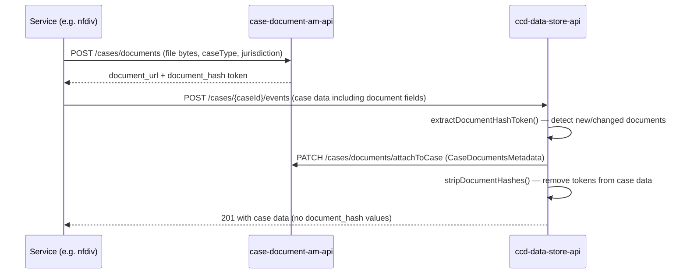

# Documents and CDAM

## TL;DR

- CCD documents are stored in the **Case Document Access Management API** (CDAM, `ccd-case-document-am-api`); the binary still lives in DM Store, but CDAM owns access control.
- Each document field in case data is a JSON object with `document_url`, `document_binary_url`, `document_filename`, `category_id`, `upload_timestamp`, and a transient `document_hash` token.
- During event submission, CCD data-store detects new or changed documents, registers them with CDAM via `CaseDocumentAmApiClient.applyPatch()`, then strips the hash before persisting.
- The hash-token mechanism prevents tampering: callbacks cannot overwrite a hash already assigned to an existing document.
- `category_id` plus a top-level **Categories** sheet drive the **Case File View** UI's folder hierarchy in EXUI (uncategorised documents fall into the `uncategorised_documents` bucket).
- CDAM replaces the legacy `document-management-store` (DM Store) integration for service teams; calls now go via the CDAM client library, never directly to DM Store.
- In local development via `rse-cft-lib`, CDAM runs in-process on port `4455` alongside the other embedded CFT services.

---

## Document field shape

Document references in case data are JSON objects. The full shape exposed by the CCD SDK
(`Document.java:18-33`) and recognised by data-store's case-file-view service
(`CategoriesAndDocumentsService.java:37-41`) is:

```json
{
  "document_url": "http://dm-store:8080/cases/documents/86f068e8-a395-89b3-a819-18e8c1327f11",
  "document_binary_url": "http://dm-store:8080/cases/documents/86f068e8-a395-89b3-a819-18e8c1327f11/binary",
  "document_filename": "application.pdf",
  "category_id": "C12",
  "upload_timestamp": "2026-01-01T00:00:00",
  "document_hash": "1111b07b8a41347b37e96c1dac18113e1c3855687bef095eeb53477fae69b1f8"
}
```

| Field | Source | Purpose |
|---|---|---|
| `document_url` | CDAM upload response (`_links.self.href`) | Canonical CDAM/DM Store URL of the document. |
| `document_binary_url` | CDAM upload response (`_links.binary.href`) | Download URL for the file binary. |
| `document_filename` | Service team / upload | Original filename, displayed in EXUI. |
| `category_id` | Service definition (Categories sheet) | Maps the document to a folder in the **Case File View** UI. May be null/blank — falls back to the `uncategorised_documents` bucket (`CategoriesAndDocumentsService.java:35`). |
| `upload_timestamp` | CDAM | When the document was uploaded; used in case-file-view sort order. |
| `document_hash` | CDAM upload response (`hashToken`) | Short-lived 64-char hex tamper-detection token. **Stripped before case data is written to the database** — the `case_data` table never contains hash values. |

The hash token is a 64-character hex string returned by CDAM as `hashToken` in the upload response,
e.g. `"1111b07b8a41347b37e96c1dac18113e1c3855687bef095eeb53477fae69b1f8"`.

> **Note:** `CaseDocumentUtils.DOCUMENT_BINARY_URL` is defined as the string `"document_url"` rather than
> `"document_binary_url"` (`CaseDocumentUtils.java:32`) — a known copy-paste inconsistency in the codebase.
> The `CategoriesAndDocumentsService` uses the correct constant `"document_binary_url"`
> (`CategoriesAndDocumentsService.java:38`), so the bug is localised to the document-hash extractor path.

---

## Upload flow via CDAM

Service teams upload documents through the CDAM client library (`uk.gov.hmcts.reform.ccd.document.am.feign.CaseDocumentClient`),
passing the user JWT, S2S token, case type, and jurisdiction alongside the file bytes. The nfdiv service wraps
this in `CaseDocumentAccessManagement.upload()` (`CaseDocumentAccessManagement.java:28`):

```
client.uploadDocuments(userToken, serviceToken, caseType, jurisdiction, files)
```

The underlying HTTP request is a multipart `POST /cases/documents` with form fields:

```
Authorization:        Bearer <idam_token>
ServiceAuthorization: <s2s_token>

classification: PUBLIC
caseTypeId:     Asylum
jurisdictionId: IA

files: <binary>
```

CDAM stores the file and returns a per-document response containing `_links.self.href` (the
document URL), `_links.binary.href` (the binary URL), `originalDocumentName`, `mimeType`, `size`,
`createdOn`, `classification`, `metadata.{caseTypeId,jurisdictionId}`, and `hashToken`. A `ttl` is
also returned: documents that are not subsequently attached to a case via an event are evicted after
this TTL.

The service team then places those values (and the `document_hash`) into the case data payload
before submitting the CCD event.

> **Bulk-scan-only token endpoint:** CDAM also exposes `GET /cases/documents/{documentId}/token` to
> regenerate a hash token for an already-uploaded document. Service segregation logic restricts it
> to the bulk-scan orchestrator only (Confluence: *GET /cases/documents/{documentId}/token*).
> Service teams cannot use this endpoint to "re-tag" a document outside an upload.
> <!-- CONFLUENCE-ONLY: bulk-scan-only restriction; not verified in source. -->

The legacy `EvidenceManagementUploadService` flow for FinRem (`secure_doc_enabled` toggle) was an
intermediate stage during CDAM rollout — production services should use `CaseDocumentClient` directly.



---

## Hash-token lifecycle inside data-store

During `about_to_submit` processing, `CaseDocumentService` (`CaseDocumentService.java:51-79`) walks three trees:

1. **DB snapshot** — the case data already persisted.
2. **Pre-callback data** — data after `about_to_start` but before `about_to_submit`.
3. **Post-callback data** — what the service's callback returned.

`extractDocumentHashToken()` compares these trees to identify documents that are genuinely new or modified.
Any callback response that tries to change an existing `document_hash` is rejected by `verifyNoTamper()`
(`CaseDocumentService.java:131-138`), which prevents a callback from re-tagging a document it did not upload.

New documents are registered with CDAM by calling `CaseDocumentAmApiClient.applyPatch(CaseDocumentsMetadata)`
(`CaseDocumentService.java:104`). `CaseDocumentsMetadata` is a batch payload carrying the case reference and the
list of document URLs to associate with it.

Finally, `stripDocumentHashes()` (`CaseDocumentService.java:41-48`) removes every `document_hash` key from the
case data before it is written to the `case_data` table or returned to the caller.

### Feature flags

Three flags in data-store control this behaviour (`CaseDocumentService.java:45`, `92`, `109`):

| Flag | Effect when disabled |
|---|---|
| `attachDocumentEnabled` | Skips the CDAM `applyPatch` call — documents are not registered with CDAM. |
| `documentHashCheckingEnabled` | Skips validation of missing or mismatched hash tokens. |
| `documentHashCloneEnabled` | Controls whether hashes are propagated during the strip step. |

All three flags must be consistently enabled in production. Partial enablement creates inconsistent behaviour.

---

## Retrieval

The data-store exposes a document metadata endpoint:

```
GET /cases/{caseId}/documents/{documentId}
```

Implemented by `CaseDocumentController.getCaseDocumentMetadata()` (`CaseDocumentController.java:59`). This
delegates to CDAM to check access and return document metadata. The document binary itself is served by CDAM
directly, not proxied through data-store.

---

## Legacy DM Store vs CDAM

Prior to CDAM, documents were uploaded directly to `document-management-store` (DM Store) and referenced in
case data without any hash-token mechanism. CCD data-store had no way to verify that a callback had not
substituted a document URL mid-event.

**CDAM is a security layer on top of DM Store, not a replacement for it.** CDAM proxies uploads,
downloads, and metadata reads through to DM Store while enforcing case-scoped permission checks.
Document URLs returned by CDAM still resolve to a `dm-store:8080` host, and the binary continues to
live in DM Store's blob storage. The HMCTS architecture team has separately recommended folding
CDAM into CCD itself and using a CCD-managed blob store, but that work has not been done — the
current structure was driven by team-availability and the Evidence Management product's preference
for keeping DM Store generic, not by architectural preference (Confluence: *CDAM Architecture*).
<!-- CONFLUENCE-ONLY: long-term architectural recommendation; opinion piece by the platform architect. -->

CDAM introduces, on top of raw DM Store:

- **Case-scoped access control** — CDAM enforces that a document belongs to a specific case type and
  jurisdiction before granting access. Each consuming service is configured in CDAM's
  `service_config.json` with permitted case types, permission, and jurisdiction. If a document
  fails CDAM checks for retrieval, a **403** is returned (Confluence: *Secure doc store (CDAM)
  onboarding and gotchas*).
- **S2S whitelist** — the calling service must be added to the case-document-am-api S2S whitelist
  (cnp-flux-config) in addition to having `service_config.json` entries.
- **Hash-token tamper detection** — the upload returns a short-lived token; data-store validates it on submit.
- **Audit attachment** — `applyPatch` creates an association between the document and the CCD case reference
  in CDAM's own store, enabling case-level document listing independent of the case data JSON.
- **Document-before-event availability** — the file exists in storage as soon as upload returns,
  before the CCD event commits. However, *access* to it is not granted until the CCD event finishes
  and `attachCaseDocuments` runs. So uploaders can read their own freshly-uploaded document, but
  other users on the case will see a 403 until the event's `submitted` callback finishes
  (Confluence: *CCD Case Document Access Management (CDAM) onboarding*).
  <!-- CONFLUENCE-ONLY: behavioural detail about timing of access grant; not directly verifiable from source without integration test. -->

Service teams should use the CDAM client library (`CaseDocumentClient`) exclusively. The nfdiv service is a
reference implementation: `CaseDocumentAccessManagement` wraps the Feign client and never calls DM Store
(`CaseDocumentAccessManagement.java:36`; cross-cutting note in service-nfdiv research).

### Onboarding gotchas

These are real production incidents from the FinRem CDAM rollout, captured in
*Secure doc store (CDAM) onboarding and gotchas*:

- **Exception-record case type leak** (IN-0108434): documents uploaded during a "convert exception
  record to case" event still have the *exception-record* case type baked into their CDAM metadata.
  After conversion, retrievals against the *new* case type fail CDAM checks. Workaround: grant the
  judge profile access to the exception-record case type as well.
- **Hard-delete bug** (DFR-4514): when CDAM was enabled, a pre-existing bug in document-deletion
  code began calling DM Store's `/delete` endpoint with hard-delete semantics, removing documents
  that should have been kept. Manual recovery was required.
- **Intermittent 404s on document retrieval during event processing** (CCD-7418, still under
  investigation as of the Confluence page). Backing out and retrying the event usually succeeds.

  <!-- CONFLUENCE-ONLY: incident history; service-team-specific, not part of CCD source. -->

---

## Document categories and Case File View

CDAM access control keys off `caseType` and `jurisdiction`
(`CaseDocumentAccessManagement.java:36`), but **categorisation within a case** is a separate
concern handled by the **CCD `category_id`** mechanism plus a top-level **Categories** sheet in
the case-type definition.

### Categories sheet

Service teams declare a folder hierarchy in the **Categories** sheet of the case-type definition:

| CaseTypeID | CategoryID | CategoryLabel | DisplayOrder | ParentCategoryID |
| --- | --- | --- | --- | --- |
| myCaseType | C1 | Application Documents | 10 | |
| myCaseType | C2 | Supporting Documents | 20 | |
| myCaseType | C11 | Evidence | 10 | C1 |
| myCaseType | C12 | ID Proof | 20 | C1 |

`ParentCategoryID` makes the hierarchy work — children reference their parent's `CategoryID`.

### Linking documents to categories

Each `Document`-typed CaseField (or `Collection<Document>`) gets a `CategoryID` column on the
**CaseField** (and **ComplexTypes**) tab that maps the field to a category from the Categories
sheet. The same `category_id` then flows through into the case-data JSON shape (see
*Document field shape* above). For Document fields nested inside a ComplexType, set the
`CategoryID` on the **ComplexTypes** tab against the inner field rather than the outer field.

Documents whose `category_id` is null or blank fall into the `uncategorised_documents` bucket
shown in the Case File View UI (`CategoriesAndDocumentsService.java:35`).

### Case File View tab

To surface the categories, add a top-level field of type `ComponentLauncher` and a tab whose
`DisplayContextParameter` is `#ARGUMENT(CaseFileView)`:

| TabID | TabLabel | CaseFieldID | DisplayContextParameter |
| --- | --- | --- | --- |
| caseFileView | Case File View | componentLauncher | `#ARGUMENT(CaseFileView)` |

EXUI renders this tab as a folder hierarchy with media-viewer integration. Users can move a
document between categories from this tab; that mutation is recorded as a system event called
`DocumentUpdated` in the case event history. To make the event visible in the Case History tab,
add a `CaseHistoryViewer` field and grant **read-only** access to the `DocumentUpdated` event.
Granting write access would make `DocumentUpdated` appear in the EXUI Events drop-down, which is
incorrect.

The `DocumentUpdated` event can also be published on the message bus by setting its `Publish`
column to `Y`, which is useful when category changes need a downstream business workflow
(Confluence: *How To Guide - Case File View (Document Categories)*).
<!-- CONFLUENCE-ONLY: end-to-end Case File View configuration recipe; data-store handles categories but the EXUI integration and DocumentUpdated event are not visible from CCD source alone. -->

### Service-level categorisation

In addition to CCD-level categories, service teams typically wrap `ccd.sdk.type.Document` in their
own complex type that adds a service-specific document type enum — for example, nfdiv stores
documents as `ListValue<DivorceDocument>` where `DivorceDocument` wraps a `Document` alongside a
`DocumentType` enum value. CCD data-store is agnostic to that service-level categorisation; only
`category_id` is meaningful to the platform's Case File View.

---

## Local development with rse-cft-lib

When using `rse-cft-lib` (`bootWithCCD` Gradle task), CDAM launches in-process as a separate Spring Boot
application under its own `URLClassLoader`, resolved from HMCTS Azure Artifacts as artifact
`com.github.hmcts.rse-cft-lib:ccd-case-document-am-api` (`Service.java:13`). It listens on port `4455`.

The environment variable `CASE_DOCUMENT_AM_URL=http://localhost:4455` is set both in `CftlibExec`
(`CftlibExec.java:46`) and unconditionally via `LibRunner` (`LibRunner.java:107`), so CCD data-store and
service code reach the embedded CDAM without any manual configuration.

No custom endpoints are added by cftlib to CDAM — it runs from the upstream binary unchanged.

---

## See also

- [Store a document](../how-to/store-a-document.md) — step-by-step guide to uploading via CDAM and referencing in case data
- [CDAM API reference](../reference/api-cdam.md) — full endpoint and response-field reference for `ccd-case-document-am-api`

## Glossary

See [Glossary](../reference/glossary.md) for term definitions used in this page.

