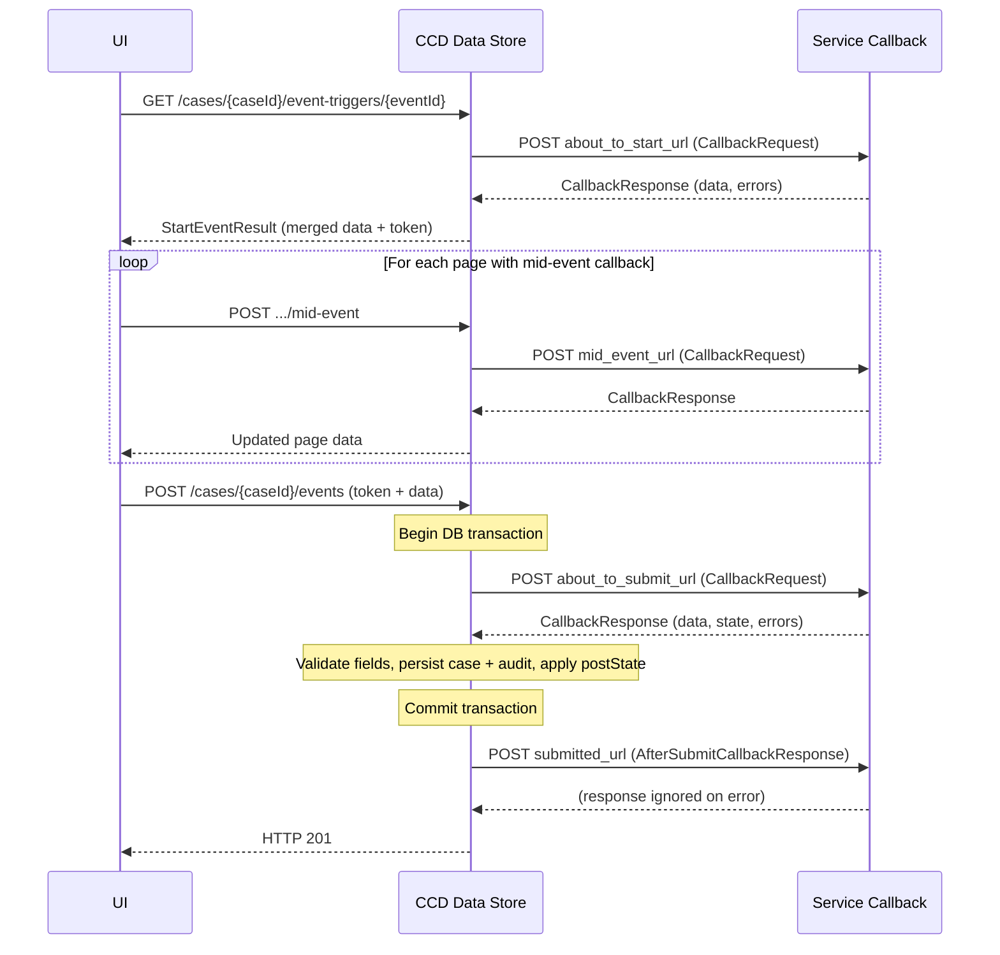

# Event Model

## TL;DR

- A CCD event is the atomic unit of change: it moves a case through a wizard, optionally fires HTTP callbacks, then persists updated data and a state transition.
- Three event-level callbacks run in fixed order: `about_to_start` (before the form opens), `about_to_submit` (inside the DB transaction, after the user clicks submit), and `submitted` (after commit — fire-and-forget). Mid-event callbacks fire between wizard pages, one per page.
- `about_to_submit` failure rolls back the entire transaction; `submitted` failure is caught and logged — the case save is already committed. Callbacks have rules-of-thumb on what each is for; in particular, don't orchestrate downstream work from `about_to_submit` (it retries inside the transaction).
- Disable Jackson's `AUTO_CLOSE_JSON_CONTENT` in your callback service or you risk silent case-data erasure when an exception occurs mid-serialisation.
- A callback-free event needs no webhook URL and no service-side code: CCD stores whatever the user typed.
- Decentralised events skip `about_to_submit` and `submitted` callbacks entirely — the service handles them via `submitHandler`.

## The lifecycle of one event

### Phase 1 — Start event

When a user (or system) opens an event form, the UI calls:

```
GET /cases/{caseId}/event-triggers/{eventId}
```

`StartEventController.getStartEventTrigger()` (`StartEventController.java:119`) validates the case, generates a short-lived **event token**, then fires `CallbackInvoker.invokeAboutToStartCallback()` if `about_to_start_url` is configured (`DefaultStartEventOperation.java:147`).

The `about_to_start` callback receives:

```json
{
  "case_details": { "...current case data..." },
  "case_details_before": { "...case data before event..." },
  "event_id": "createCase",
  "ignore_warning": false
}
```

The response `data` map is merged back into the form — use this to pre-populate fields or to enforce guard conditions that block the event entirely (return `errors`).

The token is included in the `StartEventResult` returned to the UI and must be echoed back on submit. This prevents two users from simultaneously submitting the same event on the same case.

### Phase 2 — Wizard pages and mid-event callbacks

The UI renders the event as a multi-step wizard. Each page is defined in the SDK config:

```java
// FieldCollection.java:495
fields().page("basicDetails")
        .mandatory(CaseData::getApplicantName)
        .page("documents", this::documentsCallback)   // mid-event callback on second page
        .optional(CaseData::getEvidence);
```

When the user advances from page N to page N+1 (clicks Continue), the UI calls the validate endpoint:

```
POST /case-types/{caseTypeId}/validate?pageId={pageId}
```

(`CaseDataValidatorController.java:39-70`). This endpoint validates field values against their case-type definitions and, if page N has a mid-event callback configured, fires that callback. The mid-event URL is taken from `WizardPage` (`CallbackInvoker.java:182`), not the event definition — so an event can have a different mid-event URL on every page. The request shape is identical to other callbacks (`CallbackRequest.java`).

Use mid-event callbacks to:

- validate partial input that requires service-side logic (cross-field checks, lookups);
- populate derived fields (e.g. drive a `DynamicList` on the next page from the user's selection on this one);
- alter data displayed on subsequent pages based on what was entered.

Don't use mid-event callbacks to orchestrate downstream processing — they fire every time the user clicks Continue, including when they navigate backwards.

#### Access control on mid-event responses

Mid-event responses pass through the data store's access-control filter before reaching the UI. The service can return the full case payload, but CCD will strip fields the user doesn't have read access to before passing the response back to ExUI (CCD-5344 fix). Implication: don't rely on a mid-event callback returning fields the user has no read access to — they will be filtered out before the UI receives them. <!-- CONFLUENCE-ONLY: behaviour described in CCD-5344 page; not directly verified end-to-end in source. -->

<!-- DIVERGENCE: An older Confluence "CCD Callback Framework" page describes a `MID_SECONDARY` enum and `cases/callbacks/mid-secondary` route as the way to get a second mid-event. That is service-team handler scaffolding, not CCD itself. CCD's data store supports an arbitrary number of mid-event callbacks per event — one per wizard page (`CallbackInvoker.invokeMidEventCallback`, `WizardPage.getCallBackURLMidEvent`). Source wins. -->

### Multi-step events without mid-event callbacks

You can have a multi-page event with no mid-event callbacks at all. The validate endpoint still fires on every Continue click (so CCD-side field-level validation still runs against each page's data), but no service callback is dispatched. This is the right default — only add a mid-event callback when you genuinely need service-side logic between pages.

### Phase 3 — Submit event

On the final wizard page the user clicks Submit. The UI calls:

```
POST /cases/{caseId}/events
```

The body is a `CaseDataContent` containing the event token, the event ID, and the user-entered data. The processing chain is:

1. `CaseController.createEvent()` delegates to `DefaultCreateEventOperation` (`CaseController.java:184`).
2. `DefaultCreateEventOperation.createCaseEvent()` calls `CreateCaseEventService.createCaseEvent()` and routes the result through `invokeSubmitedToCallback()` (`DefaultCreateEventOperation.java:52-85`).
3. Inside the DB transaction (`CreateCaseEventService`):
   - Validates the event token.
   - Checks the case is in an allowed `preState`.
   - Merges the user-submitted data with the existing case data.
   - Calls `invokeAboutToSubmitCallback()` (`CreateCaseEventService.java:235`).
   - Runs `ValidateCaseFieldsOperation` against the updated data.
   - Persists the new case data and writes an audit row to `case_event`.
   - Applies the `postState` transition (`CreateCaseEventService.java:500-502`).
4. After the transaction commits, `DefaultCreateEventOperation.invokeSubmitedToCallback()` calls `invokeSubmittedCallback()` if a submitted URL is set (`DefaultCreateEventOperation.java:93-99`). Any `CallbackException` is caught and logged, and the case is marked with `setIncompleteCallbackResponse()`; the case save is not undone (`DefaultCreateEventOperation.java:100-104`).

### State transitions

Every event carries optional `preState` and `postState` fields (`Event.java:29-30`). If `preState` is set, the event is only available when the case is in that state (or matches an allowed set). After a successful submit, CCD transitions the case to `postState`.

Setting neither is valid for events that are allowed from any state (e.g. internal system events). Using `.forAllStates()` in the SDK is the explicit way to express this.

```java
// CreateTestCase.java:93
configBuilder.event(CREATE_TEST_CASE)
    .initialState(Draft)               // pre-state: case does not exist yet
    .aboutToStartCallback(this::aboutToStart)
    .aboutToSubmitCallback(this::aboutToSubmit)
    .submittedCallback(this::submitted);
```

## Sequence diagram — event with all callbacks



## Callback contracts

### about_to_start

| Direction | Field | Notes |
|-----------|-------|-------|
| Request | `case_details` | Current case data before any user input |
| Request | `event_id` | String event ID |
| Response | `data` | Merged into the form; can pre-populate fields |
| Response | `errors` | Non-empty list blocks the event from opening |

### about_to_submit

| Direction | Field | Notes |
|-----------|-------|-------|
| Request | `case_details` | Case data after user edits (pre-persist) |
| Request | `case_details_before` | Case data as it was before the event started |
| Request | `ignore_warning` | Boolean passed through from the UI |
| Response | `data` | Replaces case data written to DB |
| Response | `state` | Optional — override the `postState` transition |
| Response | `errors` | Non-empty list causes HTTP 422; transaction rolls back |
| Response | `warnings` | Non-empty causes 422 unless `ignore_warning=true` |

### submitted

Uses `AfterSubmitCallbackResponse` (different shape from other callbacks):

| Field | Notes |
|-------|-------|
| `confirmation_header` | Markdown shown in the confirmation banner |
| `confirmation_body` | Markdown shown below the header |

The `submitted` callback fires outside the transaction. Failure is swallowed (`DefaultCreateEventOperation.java:100-104`) — the case has already been saved. Use it for side-effects (notifications, task creation) that are safe to lose on error.

## Callback-free events

Not every event needs a callback. A minimal event that lets a caseworker update a single field:

```java
configBuilder.event("caseworker-update-reference")
    .forStates(AwaitingDocuments, Submitted)
    .name("Update Reference")
    .grant(CRU, CASE_WORKER);

new PageBuilder(configBuilder.event("caseworker-update-reference"))
    .page("ref")
    .mandatory(CaseData::getCaseReference);
```

No `aboutToSubmitCallback`, no `submittedCallback`. CCD validates the field type, persists the update, and writes the audit row without calling out to the service at all. This is preferable for simple field-edits where no business logic is required.

## Callback usage rules of thumb

Use this as a checklist when deciding what to put in which callback. The boundaries are not enforced by CCD — they are conventions agreed across the platform that keep retries safe and downstream side-effects sane.

| Callback | Good for | Bad for |
|----------|----------|---------|
| `about_to_start` | Pre-populating fields, lookups for `DynamicList`s, guard checks that block the event from opening | Downstream orchestration, external mutations |
| `mid_event` | Cross-page validation, derived fields, populating later-page lists from earlier-page choices | Downstream orchestration (fires every time the user clicks Continue, including on backwards navigation) |
| `about_to_submit` | Field-level validation, transforming data into its final shape, overriding `postState` | Downstream orchestration: this runs inside the DB transaction and CCD will retry on transient failure (so any external side-effect could be applied multiple times). If you genuinely must trigger external work here, model an "awaiting X" state and let the service kick off the next event when ready. |
| `submitted` | Notifications, task creation, sending correspondence, fire-and-forget downstream calls | Anything where failure must roll back the case save (it can't — the transaction is already committed) |

## about_to_submit response truncation — the silent data-loss trap

A subtle Spring/Jackson interaction can erase case data without any visible error: if your `about_to_submit` handler throws mid-serialisation, Jackson's default `AUTO_CLOSE_JSON_CONTENT` produces a syntactically valid but incomplete 200 response. CCD treats it as authoritative and erases all fields that hadn't been serialised yet.

See [Truncated response prevention](../reference/callback-contract.md#truncated-response-prevention) for the full explanation, mitigation code, and detection guidance.

<!-- CONFLUENCE-ONLY: documented in the "Truncated CCD callbacks" page (DATS space, June 2025); behaviour confirmed in Spring/Jackson source but not specifically asserted by the CCD codebase. -->

## Retry behaviour and timeouts

Callbacks are retried on failure with `@Retryable(maxAttempts=3)` using backoff of 1s then 3s (`CallbackService.java:74-75`). The `submitted` callback **is** sent through the same retry mechanism unless retries are explicitly disabled — see [Callbacks](callbacks.md) for the per-type detail. The `submitted` callback's failures are caught upstream rather than surfaced to the user (the case is already saved by then).

### Disabling retries per event

To disable retries for a specific event, call `EventBuilder.retries(0)` — `CallbackInvoker.isRetriesDisabled()` detects a single-element list `[0]` and switches to a single-attempt dispatch (`CallbackInvoker.java:207-209`). Any other configured value behaves the same as the default (3 attempts, 1s/3s backoff).

### Timeouts

The data store reads a global timeout-and-retry hint from `ccd.callback.retries` (e.g. `1,5,10` in `application.properties:77`). At the case-event-definition level there are four spreadsheet columns that allow per-callback override:

- `RetriesTimeoutAboutToStartEvent`
- `RetriesTimeoutURLAboutToSubmitEvent`
- `RetriesTimeoutURLSubmittedEvent`
- `RetriesTimeoutURLMidEvent`

<!-- CONFLUENCE-ONLY: behaviour table for these columns. The "Configurable Callback timeouts and retries" page (RCCD) documents the matrix below. -->

| Column value | Initial delay | Initial timeout | Second attempt delay | Second timeout | Third attempt delay | Third timeout |
| --- | --- | --- | --- | --- | --- | --- |
| (empty) | 0s | 60s | 1s | 60s | 3s | 60s |
| `0` | 0s | 60s | (no retry) | — | — | — |
| Anything else | 0s | 60s | 1s | 60s | 3s | 60s |

In other words: the only meaningful per-callback override the data store currently honours is `0` (disable retries). The Confluence page explicitly notes that an earlier proposal — using a comma-separated list to control individual delays/timeouts per attempt — is **documented but not implemented in CCD**. Don't rely on it.

### Cascading-timeout pitfalls

There are at least three timeouts in play when a user submits an event:

- ExUI's API layer: default Node.js setting (~120 seconds).
- The CCD API gateway: 30 seconds.
- The CCD data store's per-callback budget: up to 184 seconds (60 + 1 + 60 + 3 + 60).

If the gateway times out (30s) but the data store is still waiting on your callback, the user gets an error and refreshes — and may then see that the case did update because the callback eventually completed. If the data store itself times out and rolls back, but the callback had already triggered an external side-effect on at least one of its retries, you've taken the action without persisting it. Two practical implications:

1. Your callback's own external timeouts must be **shorter** than the timeout CCD gives it, not longer. Otherwise CCD will retry while your callback is still in flight.
2. Any external mutation triggered from `about_to_submit` (or `submitted`) must be idempotent: the same callback can be invoked more than once for a single user click.

## Decentralised events

When a case type is registered as decentralised (`ccd.decentralised.case-type-service-urls` map), the Data Store skips `about_to_submit` and `submitted` callbacks (`CallbackInvoker.java:98-99, 123-125`). Instead it calls `POST /ccd-persistence/cases` on the owning service, which handles the event entirely in-process via its `submitHandler`. See the decentralised CCD pages for details.

## See also

- [Callbacks](callbacks.md) — detailed callback dispatch, timeouts, retry, and error semantics
- [Add an event](../how-to/add-an-event.md) — step-by-step: define an event with the SDK
- [Callback contract reference](../reference/callback-contract.md) — full request/response field reference
- [RetainHiddenValue](retain-hidden-value.md) — how ShowCondition and wizard-page state interact with field retention on submit

## Example

<!-- source: libs/ccd-config-generator/test-projects/e2e/src/main/java/uk/gov/hmcts/divorce/sow014/nfd/CaseworkerAddNote.java:44-84 -->
```java
// from libs/ccd-config-generator/test-projects/e2e/src/main/java/uk/gov/hmcts/divorce/sow014/nfd/CaseworkerAddNote.java
@Override
public void configure(final ConfigBuilder<CaseData, State, UserRole> configBuilder) {
    new PageBuilder(configBuilder
        .event(CASEWORKER_ADD_NOTE)
        .forAllStates()
        .name("Add note")
        .description("Add note")
        .aboutToSubmitCallback(this::aboutToSubmit)
        .showEventNotes()
        .grant(CREATE_READ_UPDATE,
            CASE_WORKER, SOLICITOR, JUDGE)
        .grant(CREATE_READ_UPDATE_DELETE,
            SUPER_USER)
        .grantHistoryOnly(LEGAL_ADVISOR, JUDGE))
        .page("addCaseNotes")
        .pageLabel("Add case notes")
        .optional(CaseData::getNote);
}

public AboutToStartOrSubmitResponse<CaseData, State> aboutToSubmit(
    final CaseDetails<CaseData, State> details,
    final CaseDetails<CaseData, State> beforeDetails
) {
    var caseData = details.getData();
    // ... business logic ...
    return AboutToStartOrSubmitResponse.<CaseData, State>builder()
        .data(caseData)
        .build();
}
```
