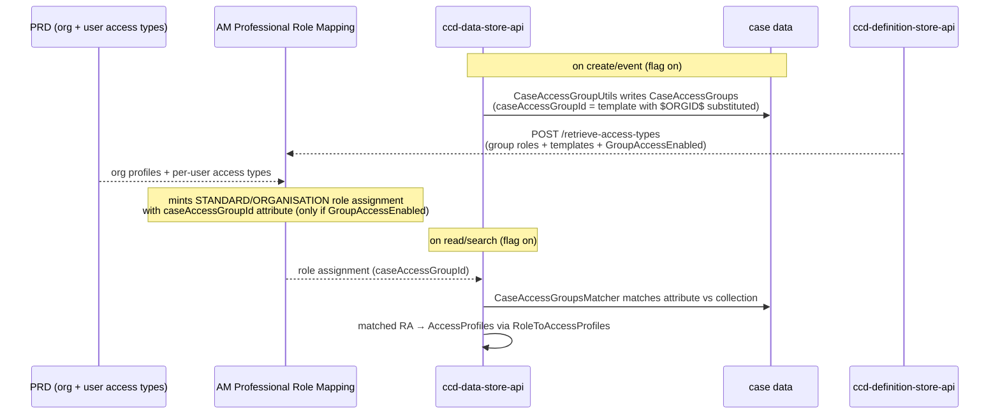

# Group Access

## TL;DR

- **Group access** grants a solicitor case-level visibility *by virtue of their Professional (PRD) organisation membership*, at whole-organisation grain — not per-case (NoC/case-assignment) and not via a STANDARD staff role.
- It is configured by two optional definition sheets, `AccessType` and `AccessTypeRole`, parsed by `ccd-definition-store-api`.
- At runtime it is realised as a `CaseAccessGroups` collection written into case data; an org's role assignment carries a `caseAccessGroupId` attribute that `CaseAccessGroupsMatcher` matches against that collection.
- The whole feature is gated by the `enable-case-group-access-filtering` flag, **default `false`**, in both definition-store and data-store. With the flag off, the sheets are silently ignored and `CaseAccessGroups` never filter.
- CCD stores and serves the configuration; the actual *minting* of the org-member role assignments (honouring `GroupAccessEnabled`) is done by the AM **Professional Role Mapping (PRM)** service from each member's PRD reference data — not part of these clones, and not `aac-manage-case-assignment`.
- It is the CCD-side delivery of HMCTS's "Professional (Group) Access" capability (Nov 2025): one organisation's users can be auto-granted access to *all* of their organisation's cases without per-case roles, with different access types selectable per user by an org administrator.

## The three "org-ish" access mechanisms

CCD has three distinct ways an organisation or an organisational role can confer case access. They are easy to conflate; they are not the same thing.

| Mechanism | Configured by | Grain | Bound to | Realised as |
|---|---|---|---|---|
| **Group access** | `AccessType` / `AccessTypeRole` sheets → `CaseAccessGroups` | Whole organisation | Every case whose data carries a matching `caseAccessGroupId` | `CaseAccessGroups` collection in case data + a `caseAccessGroupId` role-assignment attribute |
| **OrganisationPolicy + NoC / case-assignment** | `OrganisationPolicy` field + `ChangeOrganisationRequest` | One named org → one case role | A single case | Case-level (`CASE`/`SPECIFIC`) role assignments minted by `aac-manage-case-assignment` — see [`notice-of-change.md`](notice-of-change.md) |
| **STANDARD organisational roles** | `RoleToAccessProfiles` + `Authorisation*` sheets | Internal staff + role attributes (jurisdiction, region, location) | Case type / jurisdiction | Org-type role assignments resolved to AccessProfiles — see [`role-assignment.md`](role-assignment.md) |

Group access is the only one of the three keyed on *org membership at org grain*: any active member of the configured organisation profile is meant to see every case that org is associated with, without a per-case grant.

## End-to-end: how an org member ends up with access

Group access is the CCD-side slice of a larger access-management capability that spans PRD (Professional Reference Data), the AM **PRM** (Professional Role Mapping) service, and CCD. CCD owns only two of the steps below (4 and 6); the rest are context, drawn from HMCTS's onboarding guide and reconciled with the source where they touch CCD. <!-- CONFLUENCE-ONLY: the PRD/PRM/org-type model and onboarding flow are process facts from "Professional (Group) Access Onboarding" (1923744278); only steps 4 and 6 are verified in these clones -->

1. **Org type → org profiles (PRD).** Every organisation registered in PRD has a single *organisation type* (an "is-a", e.g. `SOLICITOR_ORG`, `LOCAL_AUTHORITY_ORG`, `DWP_ORG`). Each type maps to one-or-more *organisation profiles* (a "behaves-as-a", e.g. `SOLICITOR_PROFILE`, `LOCAL_AUTHORITY_PROFILE`, `DWP_PROFILE`). Access is cumulative across a type's profiles. This mapping is global, held in PRD. <!-- CONFLUENCE-ONLY: org type/profile model (1923744278; HLD 1764230653 §3.1.2.2, §3.3) -->
2. **Access types per profile (case definition).** A service defines *access types* in its `AccessType` sheet, one set per organisation profile relevant to the service. Each access type is mandatory or optional, and may or may not be shown in the ManageOrg UI (see [the column semantics below](#accesstype-sheet--access_type-table)).
3. **Org admin assigns access types to users (ManageOrg).** For optional, displayed access types, an organisation's administrator enables/disables them per user in ManageOrg. Each user receives the access types selected for them plus all mandatory ones. These selections are captured in PRD. <!-- CONFLUENCE-ONLY: ManageOrg admin flow (1923744278) -->
4. **CCD seeds `CaseAccessGroups` into case data.** On case create and on each event (flag on), `ccd-data-store-api` reads the org IDs from the case's `OrganisationPolicy` fields and writes `caseAccessGroupId` values into the case's `CaseAccessGroups` collection (verified — see [Runtime resolution](#runtime-resolution)).
5. **PRM mints the role assignments.** PRM, a batch service in the AM plane, reads each user's access types from PRD and the role mappings from the case definition (via definition-store's `/access-types`), and mints role assignments in the Role Assignment Service (HLD 1764230653 §3.7). Per its generation rule (§3.7.7.1 step 6) it mints a *group* role assignment only when `GroupAccessEnabled=true` and both `GroupRoleName` and `CaseAccessGroupIDTemplate` are set; that assignment carries a `caseAccessGroupId` attribute built by substituting the org ID into the template (§3.7.7.3). It separately mints an *organisational* role assignment when `OrganisationalRoleName` is set. PRM is **not** in these clones; the data-store research confirmed `aac-manage-case-assignment` contains zero group-access code. <!-- CONFLUENCE-ONLY: PRM as the minting service honouring GroupAccessEnabled (HLD 1764230653 §3.7.7; onboarding 1923744278) — not verifiable in these clones; the "not AAC" boundary IS verified -->
6. **CCD matches at access-control time.** When the user reads/searches, CCD's `CaseAccessGroupsMatcher` compares the role assignment's `caseAccessGroupId` against the case's `CaseAccessGroups` collection; a match grants access (verified — see [Runtime resolution](#runtime-resolution)).

Because the same template generates the ID on both sides — into case data from the case's `OrganisationPolicy`, and into the role assignment from the user's org membership — a user ends up with access to exactly the set of cases their organisation is involved in, in the capacity the template names.

> **PRM vs ORM (legacy):** Other Government Departments (OGDs, e.g. DWP on SSCS) whose users were historically managed in Staff Reference Data had their roles minted by the older AM **Organisational Role Mapping (ORM)** service. The Nov-2025 capability migrates those users to PRD + PRM. ORM and PRM are distinct AM services; neither is `aac-manage-case-assignment`. <!-- CONFLUENCE-ONLY: ORM/PRM distinction and OGD migration (1923744278) -->

## The definition surface

Two new optional sheets carry the configuration. Sheet names come from `SheetName.java`: `AccessType` (`SheetName.java:33`) and `AccessTypeRole` (`SheetName.java:34`).

### `AccessType` sheet → `access_type` table

One row per (case type, organisation profile) access type. Maps to `AccessTypeEntity`.

| Column / field | Spreadsheet column | Nullability | Notes |
|---|---|---|---|
| `accessTypeId` | `AccessTypeID` | NOT NULL | `AccessTypeEntity.java:44` |
| `organisationProfileId` | `OrganisationProfileID` | NOT NULL | The PRD organisation profile this access type belongs to (`AccessTypeEntity.java:47`) |
| `accessMandatory` | `AccessMandatory` | nullable (default false) | Mandatory access type: given to *all* users of orgs with this profile, cannot be removed by the admin (`AccessTypeEntity.java:50`) |
| `accessDefault` | `AccessDefault` | nullable (default false) | Whether a newly-added user receives this access type by default when no explicit per-user choice has been made (`AccessTypeEntity.java:53`) |
| `display` | `Display` | nullable (default false) | Whether the access type is shown in the ManageOrg Invite/Edit User UI. If `true`, `description`, `hint` and `displayOrder` all become required (`AccessTypesValidator.java:81`) |
| `description` | `Description` | nullable | Description rendered in the UI; max length 200; required when `display=true` (`AccessTypeEntity.java:59`) |
| `hint` | `HintText` | nullable | Longer UI hint; max length 300; required when `display=true` (`AccessTypeEntity.java:62`) |
| `displayOrder` | `DisplayOrder` | nullable | Must be > 0 and unique across case types in the jurisdiction when `display=true` (`AccessTypesValidator.java:118`) |

The tuple `(caseTypeReference, jurisdictionReference, accessTypeId, organisationProfileId)` must be unique within the sheet (`AccessTypesValidator.java:55`).

**Boolean column semantics** (per the CCD definition glossary, 207804327): for `AccessMandatory`, `AccessDefault` and `Display`, `true` maps from any of `T`/`True`/`Y`/`Yes`; `false` maps from any of `NULL`/`N`/`No`/`F`/`False`. The three flags compose as follows:

- **`AccessMandatory=Y`** — every user of an org with this profile is forced into the access type; the admin cannot turn it off (only disabling the whole jurisdiction for the user removes it).
- **`AccessDefault=Y` (with `AccessMandatory=N`)** — optional, but on by default for new users; the admin can turn it off per user.
- **`AccessMandatory=N`, `AccessDefault=N`** — optional and off by default; the admin must turn it on explicitly per user.
- **`Display=Y`** — visible/selectable in ManageOrg. The glossary notes `Display` "only really makes sense with `AccessMandatory=true` and `AccessDefault=true`" when the intent is to *show* users a role they cannot change; a common pattern is a mandatory, **non-displayed** (`Display=N`) "create-cases" access type applied silently to all members.

**`OrganisationProfileID` values.** This is a free-form technical identifier (max length 200) that must match the profile a user's org carries in PRD. In practice services use the PRD-defined profile keys — e.g. `SOLICITOR_PROFILE`, `LOCAL_AUTHORITY_PROFILE`, `DWP_PROFILE`. Creating a new org type/profile is currently a PRD code change, so the value must exist in PRD before the access type can take effect. <!-- CONFLUENCE-ONLY: concrete profile values and PRD-code-change caveat (1923744278) — definition-store stores the string verbatim and does not validate it against PRD -->

### Worked example (BEFTA_CIVIL, from the onboarding guide)

A single applicant/respondent case type where solicitor firms may represent either side, "all cases in my organisation" is optional, but all users may create cases:

```
AccessType:
  BEFTA_CIVIL | create-cases | SOLICITOR_PROFILE | AccessMandatory=Y | AccessDefault=Y | Display=N
  BEFTA_CIVIL | all-cases     | SOLICITOR_PROFILE | AccessMandatory=N | AccessDefault=N | Display=Y | "Can manage all cases of this type in your organisation"

AccessTypeRole:
  BEFTA_CIVIL | create-cases | SOLICITOR_PROFILE | OrganisationalRoleName=solicitor
  BEFTA_CIVIL | all-cases    | SOLICITOR_PROFILE | GroupRoleName=applicant-solicitor-all-cases | CaseAssignedRoleField=applicant-solicitor | GroupAccessEnabled=Y | CaseAccessGroupIDTemplate=befta-civil:befta-civil:all-cases:applicant-solicitor:$ORGID$
  BEFTA_CIVIL | all-cases    | SOLICITOR_PROFILE | GroupRoleName=respondent-solicitor-all-cases | CaseAssignedRoleField=respondent-solicitor | GroupAccessEnabled=Y | CaseAccessGroupIDTemplate=befta-civil:befta-civil:all-cases:respondent-solicitor:$ORGID$
```

The mandatory, non-displayed `create-cases` type silently gives every member the `solicitor` org role (which holds case-creation permission via `AuthorisationCaseType`). The optional `all-cases` type, when an admin enables it for a user, drives two group roles — applicant-side and respondent-side — each matched against whichever capacity the org plays on a given case. <!-- CONFLUENCE-ONLY: worked example transcribed from 1923744278 -->

### `AccessTypeRole` sheet → `access_type_role` table

One row per role granted under an access type. Maps to `AccessTypeRoleEntity`.

| Column / field | Spreadsheet column | Nullability | Notes |
|---|---|---|---|
| `caseTypeId` | `CaseTypeID` | NOT NULL | FK to case type (`AccessTypeRoleEntity.java:41`) |
| `accessTypeId` | `AccessTypeID` | NOT NULL | Must match a parsed `AccessType` row (`AccessTypeRolesValidator.java:44`) |
| `organisationProfileId` | `OrganisationProfileID` | NOT NULL | `AccessTypeRoleEntity.java:48` |
| `organisationalRoleName` | `OrganisationalRoleName` | nullable | One of this or `groupRoleName` must be set (`AccessTypeRolesValidator.java:92`) |
| `groupRoleName` | `GroupRoleName` | nullable | The group role to mint; setting it imposes the rules below (`AccessTypeRoleEntity.java:54`) |
| `caseAssignedRoleField` | `CaseAssignedRoleField` | nullable | The `OrgPolicyCaseAssignedRole` value that uniquely identifies the `OrganisationPolicy` field whose org ID is substituted at runtime; required when `groupRoleName` is set (`AccessTypeRoleEntity.java:57`) |
| `caseAccessGroupIdTemplate` | `CaseAccessGroupIDTemplate` | nullable | Template for the group ID; required when `groupRoleName` is set. Source enforces: must start `{jurisdictionReference}:` and end `:$ORGID$` (`AccessTypeRolesValidator.java:130`, `:138`) |
| `groupAccessEnabled` | `GroupAccessEnabled` | nullable (default false) | See below (`AccessTypeRoleEntity.java:60`) |

**Why the template shape matters.** The `caseAccessGroupId` must be globally unique across services so that one org's group ID can never accidentally match another's cases. The glossary recommends the pattern `<jurisdiction_id>:<case_type_id>:<role_information>:$ORGID$` and states the template "must be of the form `<service>[:<id1>[:<id2>…]]`" where exactly one segment is `$ORGID$` (207804327). The source is **stricter** than that prose: `AccessTypeRolesValidator` requires the template to *start* with `{jurisdictionReference}:` and *end* with `:$ORGID$` literally (`AccessTypeRolesValidator.java:130`, `:138`); a `$ORGID$` placed mid-template would pass the glossary's "exactly one `$ORGID$`" wording but be rejected by the importer. At runtime, `CaseAccessGroupUtils` substitutes the org ID for the `$ORGID$` token and, if the org ID can't be resolved, produces **no** `caseAccessGroupId` for that row (`CaseAccessGroupUtils.java:63`). <!-- DIVERGENCE: glossary 207804327 says CaseAccessGroupIDTemplate need only contain exactly one $ORGID$ segment anywhere; source AccessTypeRolesValidator.java:138 requires it to END with ":$ORGID$" (and start with "<jurisdiction>:" at :130). Source wins. -->

Both sheets are **optional** and are parsed only after `RoleToAccessProfiles` in the import pipeline (`ImportServiceImpl.java:330`), and only when the feature flag is on (`ImportServiceImpl.java:412`). `AccessType` is parsed first; the resulting entities plus the already-parsed `RoleToAccessProfiles` entities are passed into the `AccessTypeRole` parse step (`ImportServiceImpl.java:430`). If `enable-case-group-access-filtering` is `false` (the default), both sheets are silently skipped even when present in the spreadsheet.

## GroupAccessEnabled

`GroupAccessEnabled` is a boolean on each `AccessTypeRole` row. Definition-store stores it (`AccessTypeRoleEntity.java:60`) and serves it verbatim via `POST /retrieve-access-types` (`AccessTypeRoleResult.groupAccessEnabled`), but **does not branch on it** beyond one import-time rule:

- If `groupRoleName` is set, then `groupAccessEnabled` MUST be `true` (`AccessTypeRolesValidator.java:102`). The converse is allowed — `groupAccessEnabled=true` with no `groupRoleName` is not rejected.

Data-store likewise carries the flag on `AccessTypeRoleDefinition` but does not consume it in any main-path logic. `CaseAccessGroupUtils.filterAccessRoles()` checks only that `groupRoleName` and `caseAssignedRoleField` are non-blank and that a matching `OrganisationPolicy` is present — it does **not** check `groupAccessEnabled` (`CaseAccessGroupUtils.java:226`).

The **design intent** is safe rollout. The glossary and AM HLD put it plainly (207804327; 1764230653 §3.4.2.3): when `GroupAccessEnabled=false`, "all of the group access logic is implemented, except for the generation of a role assignment for the user" — IDs are still stamped into case data, but no user gains access. The intended three-step rollout is: (1) deploy the config with the flag off so CCD starts stamping `caseAccessGroupId`s into case data; (2) back-fill existing cases by running an event over them; (3) flip the flag on so PRM mints the role assignments — and the flag doubles as a kill switch, since turning it back off stops minting without stopping ID stamping, avoiding a later data migration.

> ⚠️ **The shipped definition-store does not accept this rollout as written.** `AccessTypeRolesValidator` *rejects* an `AccessTypeRole` row that sets `groupRoleName` but leaves `groupAccessEnabled=false` — the import fails with "`GroupAccessEnabled` must be enabled if `GroupRoleName` is set" (`AccessTypeRolesValidator.java:102-108`). So a **group** row cannot be imported in the disabled state at all; only an organisation-role-only row (`groupRoleName` empty) may carry `groupAccessEnabled=false`. In shipped code the flag therefore has no reachable "group config present but disabled" state via the importer, and data-store never branches on it either (`CaseAccessGroupUtils.filterAccessRoles()` checks `groupRoleName`/`caseAssignedRoleField`/`OrganisationPolicy` presence but **not** `groupAccessEnabled` — `CaseAccessGroupUtils.java:226`). The flag's only live consumer is PRM (out of these clones). Practical staging is instead gated by the data-store feature flag `enable-case-group-access-filtering` (and by PRM enablement), not by importing group rows with the flag off. <!-- DIVERGENCE: glossary 207804327 + HLD 1764230653 §3.4.2.3 describe staging by deploying group config with GroupAccessEnabled=N; shipped AccessTypeRolesValidator.java:102-108 rejects groupRoleName + groupAccessEnabled=false at import, so that state is unreachable for a group row. Source wins. -->

**The role-assignment minting that honours this flag is performed by the AM Professional Role Mapping (PRM) service, which is not part of these clones.** It is not done by `aac-manage-case-assignment`: a full search of that repo found zero references to AccessType, GroupRoleName, `GroupAccessEnabled` or `/retrieve-access-types`. PRM is a batch service specified in `HLD - Professional Access Management v1.2` (1764230653 §3.7); it polls definition-store's `/access-types`, PRD for organisation/user changes, and regenerates each user's role assignments. The minting rule is precise (1764230653 §3.7.7.1 step 6): for each enabled access-type-role, it mints a **group** role assignment only when `group_access_enabled = true` **and** `group_role_name` is non-empty **and** `case_group_id_template` is non-empty — and, independently, an **organisational** role assignment when `organisational_role_name` is non-empty (a single row can yield both). This is why definition-store's import-time rule forces `groupAccessEnabled=true` whenever `groupRoleName` is set, yet PRM still treats the flag as the live on/off switch. (OGD/staff users use the sibling Organisational Role Mapping (ORM) service for the equivalent minting — also not in these clones.)

## Validation gotcha: asymmetric reference checking

There is an asymmetry in what the importer validates, worth calling out because a misconfiguration here fails silently at runtime rather than at import.

- **`caseAssignedRoleField` IS validated** against `RoleToAccessProfiles.roleName`. The validator builds the role list from `accessProfileEntities` and rejects the import if `caseAssignedRoleField` is not present (`AccessTypeRolesValidator.java:159`). The error: `"'CaseAssignedRoleField' ... is not a listed 'RoleName' in the sheet 'RoleToAccessProfiles'"`.
- **`groupRoleName` is NOT validated** against anything. It is stored as a free-form string with no referential check. A misspelled `groupRoleName` — or one with no matching `RoleToAccessProfiles` row — imports cleanly and then silently no-ops at runtime, because there is no `RoleToAccessProfileDefinition` for the matcher's filtered role assignment to resolve to. The glossary acknowledges this exact gap: it says both `GroupRoleName` and `OrganisationalRoleName` "should have a corresponding entry in `RoleToAccessProfiles` otherwise it will not take effect. This is not validated on case definition import to CCD" (207804327) — confirming the asymmetry is by design, not an oversight in the doc.

## Runtime resolution

At runtime the feature splits across two responsibilities in `ccd-data-store-api`, both gated by `enable-case-group-access-filtering` (default `false`, `application.properties:271`).

**1. Seeding `CaseAccessGroups` into case data.** `CaseAccessGroupUtils.updateCaseAccessGroupsInCaseDetails()` (`CaseAccessGroupUtils.java:49`) runs on case create (`SubmitCaseTransaction.submitCase`) and on each event save (`CreateCaseEventService`). For each `AccessTypeRole` with a non-blank `groupRoleName` and `caseAssignedRoleField` and a matching `OrganisationPolicy` in case data, it reads `Organisation.OrganisationID` from that policy and substitutes it into `caseAccessGroupIdTemplate`, replacing the `$ORGID$` placeholder (`CaseAccessGroupUtils.java:63`). The result is a `CaseAccessGroup` with `caseAccessGroupType = "CCD:all-cases-access"`, merged into the `CaseAccessGroups` collection field. Existing `CCD:all-cases-access` entries are cleared first, so the update is idempotent per event (`CaseAccessGroupUtils.java:177`).

The collection is a standard CCD top-level collection. Each entry's value carries two fields — `caseAccessGroupType` and `caseAccessGroupId`:

```json
"CaseAccessGroups": [
  { "id": "…", "value": {
      "caseAccessGroupType": "CCD:all-cases-access",
      "caseAccessGroupId": "befta-civil:befta-civil:all-cases:applicant-solicitor:SOL00341" } }
]
```

(The original "Case Group Access Scope of Delivery" design (1624180466) named these fields `caseGroupType`/`caseGroupID` for the Civil-bulk/ET-multiples case; the shipped CCD `all-cases-access` mechanism uses `caseAccessGroupType`/`caseAccessGroupId` and the literal type `CCD:all-cases-access` — `CaseAccessGroupUtils.java:30-31`.) <!-- DIVERGENCE: scope-of-delivery 1624180466 shows collection field names caseGroupType/caseGroupID; source CaseAccessGroupUtils.java uses caseAccessGroupType/caseAccessGroupId with fixed type "CCD:all-cases-access". Source wins. -->

**2. Matching a role assignment against the collection.** `CaseAccessGroupsMatcher` is registered only when `enable-case-group-access-filtering=true` (`CaseAccessGroupsMatcher.java:19`). It matches a role assignment's `caseAccessGroupId` attribute (`RoleAssignmentAttributes.java:22`) against the `CaseAccessGroups` collection in case data (`CaseAccessGroupsMatcher.java:29`). A role assignment that matches survives filtering and then resolves to AccessProfiles via `RoleToAccessProfiles` exactly like any other STANDARD role assignment — `AccessProfileServiceImpl` joins on `roleName` (`AccessProfileServiceImpl.java:34`). From there, the standard ACL evaluation applies; see [`permissions.md`](permissions.md). The same `caseAccessGroupId` term is also injected into ES and SQL search queries so group-scoped users see their org's cases in search results.



> The minted group role assignment's shape is specified in the AM design (`HLD - Professional Access Management v1.2`, 1764230653 §3.7.7.3): `RoleType = ORGANISATION`, `RoleCategory = PROFESSIONAL`, `Classification = RESTRICTED`, `GrantType = STANDARD`, `RoleName = group_role_name`, with a single `caseAccessGroupId` attribute holding the template-substituted ID. It is generated identically to the organisational role assignment except for the role name and that attribute. This is PRM's behaviour and lives in the AM role-mapping plane, so it is not verifiable in these clones — but it is authoritatively documented, not merely the data-store team's expectation. <!-- CONFLUENCE-ONLY: minted group RA attributes sourced from AM HLD 1764230653 §3.7.7.3 (PRM service, not in these clones) -->

**The configuration consumed by PRM** comes from definition-store's `POST /retrieve-access-types` (`AccessTypesController.java:32`). The request body is an optional `OrganisationProfileIds` filter; the response is an `AccessTypeJurisdictionResults` tree (`jurisdictions[] → accessTypes[] → roles[]`). Each role result carries `caseTypeId`, `organisationalRoleName`, `groupRoleName`, `caseGroupIdTemplate` and `groupAccessEnabled` (`AccessTypeRoleResult.java:10`). This is what tells PRM which group roles to mint and under what template. Note that **`caseAssignedRoleField` is stored but NOT returned** by this endpoint — it exists only as an import-time validation reference and a runtime lookup key inside data-store (`AccessTypesService.java:156`).

## SDK note

The `ccd-config-generator` SDK has **no AccessType support**. There is no `accessType(...)` method on `ConfigBuilder` (`ConfigBuilder.java:13`), no `AccessTypeGenerator`, and no example anywhere in the repo. Service teams that need group access must ship `AccessType` / `AccessTypeRole` as raw JSON fragments matching the column schema `ccd-definition-store-api` expects, and merge them via the SDK's `static/` directory pattern — the README's documented workaround for features the generator does not cover (`README.md:591`):

```groovy
task generateCCDDefinition(type: Copy) {
  from tasks.generateCCDConfig.outputs
  from file('static')
  into layout.buildDirectory.dir('json-definitions')
}
```

## Example

The JSON fragments below are from the `BEFTA_MASTER_GROUPACCESS` functional-test jurisdiction, case type `FT_CaseProfessionalGroupAccess`. They show the exact shape that `ccd-definition-store-api` ingests (the same format produced by `ccd-definition-processor`'s `json2xlsx` / `xlsx2json` tooling).

### AccessType.json

Two access types: one for a solicitor profile, one for a government organisation profile. Both are optional (`AccessMandatory: No`, `AccessDefault: No`) and displayed in ManageOrg (`Display: Yes`), with description, hint text and a display order.

```json
// apps/ccd/ccd-test-definitions/src/main/resources/uk/gov/hmcts/ccd/test_definitions/valid/BEFTA_MASTER_GROUPACCESS/common/AccessType.json
[ {
  "LiveFrom" : "01/01/2023",
  "LiveTo" : "",
  "CaseTypeID" : "FT_CaseProfessionalGroupAccess",
  "AccessTypeID" : "GA_SOLICITOR",
  "OrganisationProfileID" : "SOLICITOR_PROFILE",
  "AccessMandatory" : "No",
  "AccessDefault" : "No",
  "Display" : "Yes",
  "Description" : "BEFTA GA Solicitor Respondent for Org description",
  "HintText" : "BEFTA GA Solicitor Respondent for Org hint",
  "DisplayOrder" : 1
}, {
  "LiveFrom" : "01/01/2023",
  "LiveTo" : "",
  "CaseTypeID" : "FT_CaseProfessionalGroupAccess",
  "AccessTypeID" : "GA_OGD",
  "OrganisationProfileID" : "GOVERNMENT_ORGANISATION_PROFILE",
  "AccessMandatory" : "No",
  "AccessDefault" : "No",
  "Display" : "Yes",
  "Description" : "BEFTA GA OGD Respondent for Org description2",
  "HintText" : "BEFTA GA OGD Respondent for Org hint2",
  "DisplayOrder" : 2
} ]
```

### AccessTypeRole.json

Three role rows across the two access types. The first row (`GA_SOLICITOR`) uses only a `GroupRoleName` with `GroupAccessEnabled: Yes` — the standard group-access case. The second row (`GA_OGD`) sets both `OrganisationalRoleName` and `GroupRoleName`, showing how the same access type can grant both an org role and a group role. The third row is an **organisation-role-only** row: `OrganisationalRoleName` is set while `GroupRoleName` and `CaseAccessGroupIDTemplate` are empty, which is exactly why it is permitted to carry `GroupAccessEnabled: No` — the importer's "`groupRoleName` ⇒ `groupAccessEnabled=true`" rule (`AccessTypeRolesValidator.java:102`) only bites when a group role is present. It is **not** a staged/disabled group-access row (the importer rejects those — see [GroupAccessEnabled](#groupaccessenabled)); the `No` here is simply the default flag value on a row that grants no group access.

Note the `CaseAccessGroupIDTemplate` value: `BEFTA_MASTER:FT_CaseProfessionalGroupAccess:CaseProfessionalGroupAccess_GA_Role:$ORGID$` — it starts with the jurisdiction ID, includes the case type and role information as further segments, and ends with `:$ORGID$`, satisfying the validator's requirements.

```json
// apps/ccd/ccd-test-definitions/src/main/resources/uk/gov/hmcts/ccd/test_definitions/valid/BEFTA_MASTER_GROUPACCESS/common/AccessTypeRole.json
[ {
  "LiveFrom" : "01/01/2023",
  "LiveTo" : "",
  "CaseTypeID" : "FT_CaseProfessionalGroupAccess",
  "AccessTypeID" : "GA_SOLICITOR",
  "OrganisationProfileID" : "SOLICITOR_PROFILE",
  "OrganisationalRoleName" : "",
  "GroupRoleName" : "CaseProfessionalGroupAccess_GA_Role",
  "CaseAssignedRoleField" : "CaseProfessionalGroupAccess_GA_Role",
  "GroupAccessEnabled" : "Yes",
  "CaseAccessGroupIDTemplate" : "BEFTA_MASTER:FT_CaseProfessionalGroupAccess:CaseProfessionalGroupAccess_GA_Role:$ORGID$"
}, {
  "LiveFrom" : "01/01/2023",
  "LiveTo" : "",
  "CaseTypeID" : "FT_CaseProfessionalGroupAccess",
  "AccessTypeID" : "GA_OGD",
  "OrganisationProfileID" : "GOVERNMENT_ORGANISATION_PROFILE",
  "OrganisationalRoleName" : "CaseProfessionalGroupAccess_Org_Role",
  "GroupRoleName" : "CaseProfessionalGroupAccess_GA_Role",
  "CaseAssignedRoleField" : "CaseProfessionalGroupAccess_GA_Role",
  "GroupAccessEnabled" : "Yes",
  "CaseAccessGroupIDTemplate" : "BEFTA_MASTER:FT_CaseProfessionalGroupAccess:CaseProfessionalGroupAccess_GA_Role:$ORGID$"
}, {
  "LiveFrom" : "01/01/2023",
  "LiveTo" : "",
  "CaseTypeID" : "FT_CaseProfessionalGroupAccess",
  "AccessTypeID" : "GA_OGD",
  "OrganisationProfileID" : "GOVERNMENT_ORGANISATION_PROFILE",
  "OrganisationalRoleName" : "CaseProfessionalGroupAccess_Org_Role",
  "GroupRoleName" : "",
  "CaseAssignedRoleField" : "",
  "GroupAccessEnabled" : "No",
  "CaseAccessGroupIDTemplate" : ""
} ]
```

## Failure modes

- **Misspelled / unmatched `groupRoleName`** — imports cleanly (not validated) then silently no-ops: the matched role assignment resolves to no AccessProfile.
- **Feature flag off in an environment** — `CaseAccessGroups` are never written and `CaseAccessGroupsMatcher` is never registered, so group access never filters; the sheets are skipped at import even if present.
- **Expecting to stage a group row with `groupAccessEnabled=false`** — the import is rejected (`AccessTypeRolesValidator.java:102-108`); a group row must be imported enabled. The HLD/glossary safe-rollout-via-disabled-flag story does not match shipped behaviour (see [GroupAccessEnabled](#groupaccessenabled)). Stage instead via the data-store `enable-case-group-access-filtering` flag and PRM enablement.
- **`accessMandatory` misuse** — `AccessMandatory=true` makes the access type essential for the organisation profile: it cannot be disabled by the org admin except by disabling the whole jurisdiction for the user (per the glossary, 207804327, and HLD 1764230653 §3.4.2.2). Marking optional access as mandatory silently forces every member of the profile into it; review against the org-onboarding intent before import. (`Display=true` is only meaningful alongside `AccessMandatory`/`AccessDefault` — it surfaces the type in the Invite/Edit User UI.)

## See also

- [`role-assignment.md`](role-assignment.md) — STANDARD organisational roles and how role assignments resolve to AccessProfiles
- [`permissions.md`](permissions.md) — how matched role assignments resolve to ACLs and effective CRUD
- [`notice-of-change.md`](notice-of-change.md) — per-case OrganisationPolicy / case-assignment access (the contrast case)
- [`../reference/api-definition-store.md`](../reference/api-definition-store.md) — the `POST /retrieve-access-types` endpoint and response model
- [`definition-import.md`](definition-import.md) — where the AccessType/AccessTypeRole sheets sit in the import pipeline

### Authoritative design sources (HMCTS Confluence, AM space)

- [HLD - Case Group Access v1.1](https://tools.hmcts.net/confluence/spaces/AM/pages/1667695490/HLD+-+Case+Group+Access+v1.1) (1667695490) — the generic case-group-access ABAC extension: case group role assignments, structured `caseAccessGroupId`s, the `caseAccessGroups`-in-case-data decision (and why not supplementary data), prefix registration.
- [HLD - Professional Access Management v1.2](https://tools.hmcts.net/confluence/spaces/AM/pages/1764230653/HLD+-+Professional+Access+Management+v1.2) (1764230653) — the "All Cases" professional application built on top: the `AccessType`/`AccessTypeRole` data model (§3.4.2), the PRM batch service and its role-assignment generation rules (§3.7.7), the `/access-types` API contract (§3.4.4), and organisation/OGD onboarding.
