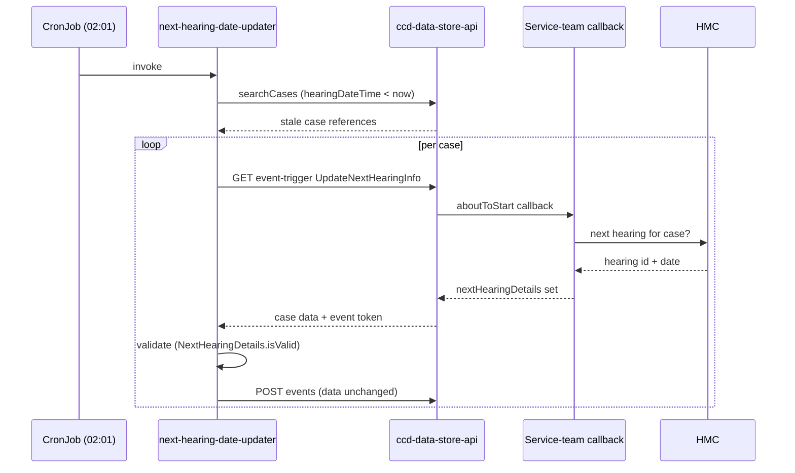

# Next Hearing Date

## TL;DR

- "Next Hearing Date" caches the upcoming hearing for a case in a `nextHearingDetails` complex field so case lists, the work-basket and search can render and sort by hearing date **without** a per-row call to HMC.
- **`nextHearingDetails` is NOT a platform-managed field.** Neither `ccd-data-store-api` nor `ccd-definition-store-api` has any special handling for it. The service team declares it themselves as a conventional complex type with sub-fields `hearingID` (Number) and `hearingDateTime` (DateTime), plus an `UpdateNextHearingInfo` event.
- The date is kept current by the `ccd-next-hearing-date-updater` batch job — a Kubernetes `CronJob` (default `01 02 * * *`, `concurrencyPolicy: Forbid`) that finds cases with a stale `hearingDateTime` and fires `UpdateNextHearingInfo` on each.
- The updater is **only a trigger**. It has no HMC dependency. Your own `aboutToStart` callback on `UpdateNextHearingInfo` queries HMC and sets the real date; the updater submits the data unchanged.
- The updater has **two mutually-exclusive input modes**: the scheduled Elasticsearch sweep, and a CSV of case references for ad-hoc correction/migration (any case type, no date check). Supplying both is a fatal misconfiguration.
- The updater authenticates as a cached IDAM user with the cross-jurisdictional `next-hearing-date-admin` role plus the S2S service `ccd_next_hearing_date_updater`.

## What you have to build yourself

This is the part service teams most often get wrong: CCD does **not** provide the next-hearing-date field for you. There is no platform code in the data-store or definition-store keyed on `nextHearingDetails` or `UpdateNextHearingInfo` — they are pure convention, significant only to the batch updater. To opt in you declare three things in your case-type definition:

1. **A complex type** named `nextHearingDetails` with two sub-fields: `hearingID` of type `Number` (the HMC hearing identifier) and `hearingDateTime` of type `DateTime`. See the BEFTA reference definition at `ccd-test-definitions/src/main/resources/uk/gov/hmcts/ccd/test_definitions/valid/BEFTA_MASTER/common/ComplexTypes.json:2333-2369`.
2. **A case field** of that complex type on each case type that needs it.
3. **An `UpdateNextHearingInfo` event** with `pre_states: ["*"]` (so it can fire from any state) and an ACL granting `create` to the `next-hearing-date-admin` role — confirmed by the test case type in `ccd-data-store-api/src/test/resources/tests/BEFTA_MASTER-jurisdiction-payload.json:1552-1574`.

If a case type lacks either the field or the event, the updater fails silently for that case: its start-event call returns a Feign error which is logged and skipped (`ccd-next-hearing-date-updater/src/main/java/uk/gov/hmcts/reform/next/hearing/date/updater/repository/CcdCaseEventRepository.java:53-61`).

On a live case the field appears as `data.nextHearingDetails` with `hearingID` (e.g. `1234`) and `hearingDateTime` as an ISO-8601 datetime without timezone (e.g. `"2022-07-22T10:00:00.000"`).

## Why a batch updater rather than a live join

HMC (the Hearings Management Component) is the authoritative source of hearing data. CCD does not query HMC at search time — its Elasticsearch index has no view of HMC. Caching the next hearing's id and date as ordinary case data means CCD search, work-basket filtering and sorting can use `hearingDateTime` like any other field, with no live HMC call per row.

The trade-off is staleness: once a cached hearing time passes, the value is wrong until something refreshes it. The updater closes that gap by re-firing the event at least daily after the hearing time has elapsed, even if HMC pushed no notification.

## How the updater keeps the date current

The `ccd-next-hearing-date-updater` is a non-web Spring Boot batch job (`spring.main.web-application-type: NONE`) that runs once per invocation and exits. In production it is a Kubernetes `CronJob` at `01 02 * * *` (daily 02:01 UTC) with `concurrencyPolicy: Forbid` — the only overlap guard, as there is no in-app lock (`ccd-next-hearing-date-updater/charts/ccd-next-hearing-date-updater/values.yaml:13-18`).

Each run:

1. **Find stale cases.** For each configured case type (`CASE_TYPES` env var), it runs an Elasticsearch `range` query on `data.nextHearingDetails.hearingDateTime` with `"lt": "now"`, sorting ascending on `reference.keyword`, returning only the `reference` field and paging with `search_after` (default page size 100, `ES_QUERY_SIZE`). Cases where `hearingDateTime` is null or in the future are not matched — null is not `< now` in an ES range query (`ccd-next-hearing-date-updater/src/main/java/uk/gov/hmcts/reform/next/hearing/date/updater/repository/ElasticSearchQuery.java:10-26`). The query goes through the data-store `/searchCases` API, not directly to ES.

   <!-- DIVERGENCE: The "Maintain Next Hearing Date Scope of Work" Confluence page (RCCD 1588729072) specifies the cut-off as "nextHearingDetails.hearingDateTime less than 00:00:00 today (the date part of today)". Source ElasticSearchQuery.java uses "lt": "now" — the current instant, not midnight. Source wins. In practice the difference only affects cases whose hearing time is earlier the same day as the run; with the cron at 02:01 the gap is small, but the behaviour is "before now", not "before today". -->

   The design also calls for paging via an explicit Elasticsearch *Point In Time* (PIT) handle with a 1-hour TTL to escape the 10,000-result `searchCases` ceiling. The source query relies on `search_after` with a sorted `reference.keyword` rather than constructing a PIT itself — the PIT/sort-metadata plumbing lives in the data-store `/searchCases` endpoint, not the updater. <!-- CONFLUENCE-ONLY: the PIT endpoint and 10,000-result ceiling are described in RCCD 1588729072; the updater source only emits the search_after query, so the PIT lifecycle is not visible here. -->

   <!-- CONFLUENCE-ONLY: RCCD 1588729072 also describes the intended *business* semantics of the date — for a multi-day hearing in progress the value should be "today", and once a hearing completes with no further scheduled hearing it should be empty or the next scheduled date. This logic lives in the service-team callback, not in CCD or the updater, so it is not verifiable in this source. -->

   <!-- CONFLUENCE-ONLY: the data-store /searchCases internal/external endpoints were extended to return native ES sort metadata to support paging (RCCD 1588729072); not separately confirmed in ccd-data-store-api source here. -->

   The list of case types to sweep is supplied via the `CASE_TYPES` property (Confluence calls this "the List of CaseTypes for Which NextHearingDate is Active" — a deliberate opt-in so adoption can be staged).
2. **Trigger the event.** Per case reference it calls `GET /cases/{caseRef}/event-triggers/UpdateNextHearingInfo` to obtain an event token and the current case data. This start call fires your registered `aboutToStart` callback — that callback queries HMC, finds the next upcoming hearing and returns an updated `nextHearingDetails` in the response.
3. **Validate, then submit.** The updater reads `nextHearingDetails` from the start-event response, validates it (below), and on success submits `POST /cases/{caseRef}/events` with the case data **unchanged** — `event.id = UpdateNextHearingInfo` and the same data the callback returned (`ccd-next-hearing-date-updater/src/main/java/uk/gov/hmcts/reform/next/hearing/date/updater/repository/CcdCaseEventRepository.java:64-79`).

The updater never invents a hearing date — it carries forward whatever your callback set. All downstream failures are caught, logged and skipped; the job moves to the next case. There is no retry. Idempotency is implicit: a case whose callback set a future date no longer matches the ES query on the next run.

The whole run is gated by a kill-switch property `next-hearing-date-updater.processing.enabled` (`HEARING_NEXT_DAY_CRON_JOB_PROCESSING_ENABLED`, default `true`); when false the `ApplicationRunner` does nothing and exits. After processing — successful or not — the job flushes the Application Insights `TelemetryClient` and sleeps for a configurable grace period (`telemetry.wait.period`, default 10s) before the process exits, so telemetry is not lost when the short-lived pod terminates (`ccd-next-hearing-date-updater/src/main/java/uk/gov/hmcts/reform/next/hearing/date/updater/ApplicationBootstrap.java`).



## The two input modes: scheduled sweep vs CSV list

The updater is not only a scheduler. `NextHearingDateUpdaterService.execute()` gathers case references from **two independent sources** and they are mutually exclusive (`ccd-next-hearing-date-updater/src/main/java/uk/gov/hmcts/reform/next/hearing/date/updater/service/NextHearingDateUpdaterService.java`):

- **Elasticsearch sweep** — the scheduled mode described above. Active when `CASE_TYPES` is set and the ES query returns references.
- **CSV list** — a file of case references supplied via `FILE_LOCATION` (`next-hearing-date-updater.csv.caseReferences.fileLocation`). Used for ad-hoc correction or the initial migration when the field is first established. The case references can be of **any** case type, and **no date check is applied** — every listed case has `UpdateNextHearingInfo` triggered regardless of whether its current `hearingDateTime` is stale.

If *both* sources yield references the job throws `InvalidConfigurationError` ("Invalid Configuration: CSV file and Case Types are both specified") and aborts — you run one mode or the other, not both. If neither yields references it logs "No Case References found to be processed" and exits cleanly.

CSV references are validated up front by `CsvService` before any event is triggered:

| Check | Behaviour |
|---|---|
| More than `MAX_CSV_RECORDS` entries (default 10,000) | Fatal — error `001`, `TooManyCsvRecordsException`, whole job aborts |
| Each reference must be 16 digits **and** pass a Luhn checksum (`LuhnCheckDigit`) | Per-bad-reference — error `002` logged, that reference dropped, processing continues with the rest |
| File path set but unreadable | Fatal — `CsvFileException` wrapped as `InvalidConfigurationError` |

The 16-digit-plus-Luhn rule is the same validity rule CCD applies to its UUID-style case references (four random digits provide the "guess protection" and the Luhn digit catches transcription errors). Invalid references are silently pruned from the batch rather than failing the run, mirroring the per-case skip behaviour of the sweep.

<!-- CONFLUENCE-ONLY: RCCD 1588729072 frames the CSV mode as running "as the same system user" with "no requirement for any additional authentication ... since the process only ever corrects next hearing dates and provides no means for changing any other case data". That security rationale is a design statement, not something asserted by the source. -->

## Validation applied by the updater

Before submitting, the updater checks the `nextHearingDetails` returned by the start event with `NextHearingDetails.isValid()` (`ccd-next-hearing-date-updater/src/main/java/uk/gov/hmcts/reform/next/hearing/date/updater/data/NextHearingDetails.java:35-57`):

| Condition | Result |
|---|---|
| `hearingDateTime` non-null and in the past | Invalid — error `003`, submit skipped |
| `hearingID` non-null, `hearingDateTime` null | Invalid — error `004`, submit skipped |
| `hearingID` null, `hearingDateTime` non-null | Invalid — error `005`, submit skipped |
| both null / both absent | **Valid** — "cleared" state, submit proceeds |
| both non-null, `hearingDateTime` in the future | Valid — submit proceeds |

Validation runs against the start-event response (the data your callback produced), not on something the updater computes. Note the "cleared" state: when no future hearing exists, your callback returns null for both sub-fields, and the updater submits that — clearing the cached date. This is by design.

### Full error-code vocabulary

The updater logs a small set of numbered error codes, used by operations to monitor the job (the design routes these into Dynatrace, which raises ServiceNow tickets on the same pattern as HMC). Codes `001`/`002` are CSV-input failures; `003`–`005` are per-case validation failures; `006` is a downstream call failure (`ccd-next-hearing-date-updater/src/main/java/uk/gov/hmcts/reform/next/hearing/date/updater/exceptions/ErrorMessages.java`):

| Code | Meaning | Severity |
|---|---|---|
| `001` | More than the configured maximum number of references in the CSV | Fatal (aborts the run) |
| `002` | Invalid case reference in the CSV (not 16 digits / fails Luhn) | Per-reference (dropped, run continues) |
| `003` | `hearingDateTime` returned by the callback is in the past | Per-case (submit skipped) |
| `004` | `hearingDateTime` is null but `hearingID` is set | Per-case (submit skipped) |
| `005` | `hearingID` is null but `hearingDateTime` is set | Per-case (submit skipped) |
| `006` | Downstream error (start-event or submit-event call failed) for a given endpoint and case | Per-case (logged, run continues) |

The Confluence design (RCCD 1588729072) additionally calls out two operational error conditions that the source surfaces only through generic Feign/downstream handling rather than a dedicated code: "there was no `UpdateNextHearingInfo` event available to be triggered on the case", and (command-line only) "the case does not exist or is not available to the system user". Both manifest in source as a caught downstream exception logged under `006` and skipped, not as distinct codes. <!-- DIVERGENCE: Confluence lists "no UpdateNextHearingInfo event" and "case does not exist" as named error conditions; source has no dedicated codes for these — they fall through to the generic 006 downstream-error path in CcdCaseEventRepository. Source wins on the actual code set. -->

## Authentication

Every outbound call (ES search, start event, submit event) carries two tokens:

- A **user Bearer token** for the IDAM system user (default `next.hearing.date.admin@gmail.com`) holding the `next-hearing-date-admin` role, obtained via `IdamClient.getAccessToken` and cached for 1800s.
- An **S2S service token** for microservice `ccd_next_hearing_date_updater`.

The `next-hearing-date-admin` role is configured as **cross-jurisdictional** in the data-store (`ccd-data-store-api/src/main/resources/application.properties:275`, `ccd.access-control.cross-jurisdictional-roles`), so the one system user can read and submit events across every jurisdiction without jurisdiction-specific role assignments. The data-store must also list `ccd_next_hearing_date_updater` in its authorised S2S services.

## Local testing with rse-cft-lib

The updater ships a `bootWithCCD` Gradle task that spins up the full CCD stack in-process via the `rse-cft-lib` plugin (`ccd-next-hearing-date-updater/build.gradle`). `CftLibConfig.configure` registers the `next-hearing-date-admin` role and the `next.hearing.date.admin@gmail.com` user, then imports the test case-type definitions; a `ccd-test-stubs-service` container stands in for the service-team callback. Run it with:

```
./gradlew bootWithCCD
```

To exercise the ES-driven path against a specific case type with a small page size:

```
./gradlew bootRun --args="--CASE_TYPES=FT_NextHearingDate --ES_QUERY_SIZE=3"
```

To exercise the CSV mode instead, point `FILE_LOCATION` at a file of newline-separated 16-digit case references and leave `CASE_TYPES` unset (setting both triggers the mutual-exclusivity error):

```
./gradlew bootRun --args="--FILE_LOCATION=/tmp/refs.csv"
```

The test-stubs image is pulled from `hmctsprod.azurecr.io` and requires `az acr login --name hmctsprod` first. The BEFTA reference definition ships both an `FT_NextHearingDate` case type and an `FT_NextHearingDate_Clear` variant (per the BEFTA master definition) so the populated and cleared states can both be exercised.

## Where the cached date is consumed

The point of caching the date is so Expert UI (XUI) can show and sort by it in Work Allocation screens without a per-row HMC call. The XUI work (epic EUI-5952) added a "Next hearing date" column to the case and task lists, reading the value straight from the case-data API:

- **My Work → My Tasks / Available Tasks** — column added, sortable.
- **My Work → My Cases** — column added and sortable; notably this is the *only* sortable column on that tab, and a "Reset sorting" control was added alongside it.
- **All Work → Tasks tab** — column added, sortable.
- **All Work → Cases tab** — column added but **not sortable**, deliberately, "due to complexity and potential volume of data".

Global Search was explicitly out of scope for the column — it neither displays nor sorts on the next hearing date. <!-- CONFLUENCE-ONLY: the per-screen sortability matrix and the Global Search exclusion come from the EUI feature page (EUI 1584334378); these are XUI front-end behaviours not modelled in CCD or updater source. -->

This consumer behaviour is the whole justification for the design: a column that sorts thousands of rows by hearing date is only cheap because the date is denormalised onto the case as ordinary searchable data, which in turn is only kept honest by the nightly updater.

## Example

The following fragments are taken directly from the BEFTA master test definitions (`FT_NextHearingDate` case type), which is the reference implementation the updater functional tests run against.

### ComplexTypes.json — the `nextHearingDetails` sub-field declarations

```json
// apps/ccd/ccd-test-definitions/src/main/resources/uk/gov/hmcts/ccd/test_definitions/valid/BEFTA_MASTER/common/ComplexTypes.json
[
  {
    "LiveFrom": "07/01/2017",
    "ID": "nextHearingDetails",
    "ListElementCode": "hearingID",
    "FieldType": "Number",
    "ElementLabel": "Hearing Id",
    "SecurityClassification": "Public"
  },
  {
    "LiveFrom": "07/01/2017",
    "ID": "nextHearingDetails",
    "ListElementCode": "hearingDateTime",
    "FieldType": "DateTime",
    "ElementLabel": "Hearing Date",
    "SecurityClassification": "Public"
  }
]
```

### CaseField.json — the case field of type `nextHearingDetails`

```json
// apps/ccd/ccd-test-definitions/src/main/resources/uk/gov/hmcts/ccd/test_definitions/valid/BEFTA_MASTER/FT_NextHearingDate/CaseField.json
[
  {
    "LiveFrom": "01/01/2017",
    "CaseTypeID": "FT_NextHearingDate",
    "ID": "nextHearingDetails",
    "Label": "Next Hearing Details",
    "FieldType": "nextHearingDetails",
    "SecurityClassification": "Public"
  }
]
```

### CaseEvent.json — the `UpdateNextHearingInfo` event declaration

```json
// apps/ccd/ccd-test-definitions/src/main/resources/uk/gov/hmcts/ccd/test_definitions/valid/BEFTA_MASTER/FT_NextHearingDate/CaseEvent.json
{
  "LiveFrom": "01/01/2017",
  "CaseTypeID": "FT_NextHearingDate",
  "ID": "UpdateNextHearingInfo",
  "Name": "Update Next Hearing Info",
  "DisplayOrder": 2,
  "PreConditionState(s)": "*",
  "PostConditionState": "*",
  "CallBackURLAboutToStartEvent": "${TEST_STUB_SERVICE_BASE_URL:http://ccd-test-stubs-service-aat.service.core-compute-aat.internal}/callback_nextHearingDate",
  "SecurityClassification": "Public",
  "Publish": ""
}
```

### AuthorisationCaseEvent.json — granting `create` to `next-hearing-date-admin`

```json
// apps/ccd/ccd-test-definitions/src/main/resources/uk/gov/hmcts/ccd/test_definitions/valid/BEFTA_MASTER/FT_NextHearingDate/AuthorisationCaseEvent.json
{
  "LiveFrom": "01/01/2017",
  "CaseTypeID": "FT_NextHearingDate",
  "CaseEventID": "UpdateNextHearingInfo",
  "UserRole": "next-hearing-date-admin",
  "CRUD": "CRUD"
}
```

## See also

- [Hearings Integration (HMC)](hearings-integration.md) — how service teams integrate with HMC, the authoritative source of the hearing data this feature caches.
- [Work Basket](work-basket.md) — where caseworkers see the cached `hearingDateTime` rendered and sorted.
- [Search Architecture](search-architecture.md) — the Elasticsearch index and `/searchCases` API the updater queries for stale cases.
- [Audit and History](audit-and-history.md) — `UpdateNextHearingInfo` is a normal CCD event and appears in case history like any other.
