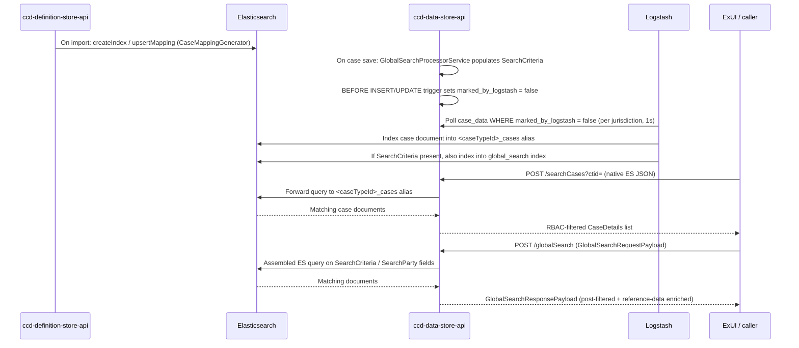

# Search Architecture

## TL;DR

- CCD exposes three distinct search surfaces: **work-basket search** (DB-backed, UI-driven), **global search** (`/globalSearch`, cross-jurisdiction ES with a fixed payload schema), and **query_search** (`/searchCases` and `/internal/searchCases`, native-Elasticsearch v2).
- Work-basket inputs and results are configured via `WorkBasketInputFields` / `WorkBasketResultFields` definition sheets; they drive what filter inputs ExUI renders and what columns appear in the list. The DB-backed work-basket page is being progressively migrated onto `/internal/searchCases` with `use_case=WORKBASKET`.
- Global search is fed by `SearchCriteria` / `SearchParty` complex fields written into case data at save time by `GlobalSearchProcessorService`; Logstash also routes a subset of those documents into a dedicated cross-jurisdiction `global_search` index.
- `POST /searchCases?ctid=` accepts a native Elasticsearch JSON body (or a `native_es_query`-wrapped custom request); `POST /internal/searchCases?ctid=&use_case=` is the internal UI variant that applies configured sort and shapes results for display.
- ES indexes are owned by `ccd-definition-store-api`: case-type-specific indexes (`<caseTypeId>_cases-NNNNNN` behind a `<caseTypeId>_cases` alias) are created/upserted on definition import; cases are indexed by Logstash polling `case_data.marked_by_logstash`.
- Elasticsearch must be explicitly enabled via `ELASTIC_SEARCH_ENABLED=true`; the work-basket-inputs configuration endpoint (`GET .../work-basket-inputs`) is always served regardless.

---

## The three search surfaces

### 1. Work-basket search (DB-backed)

Work-basket search is the oldest surface. It is driven entirely by definition configuration and does not require Elasticsearch.

**Definition sheets involved:**

| Sheet | DB table | Definition-store endpoint |
|---|---|---|
| `WorkBasketInputFields` | `workbasket_input_case_field` | `GET /api/display/work-basket-input-definition/{id}` |
| `WorkBasketResultFields` | `workbasket_case_field` | `GET /api/display/work-basket-definition/{id}` |

`WorkBasketInputFields` rows specify which fields to render as filter inputs in the ExUI work-basket panel. Each row carries `CaseFieldID`, `CaseFieldElementPath` (dot-notation into complex types), `Label`, `DisplayOrder`, `AccessProfile`, `ShowCondition`, and `DisplayContextParameter` (`WorkBasketInputCaseFieldEntity.java:7,12`).

`WorkBasketResultFields` adds `SortOrder` (direction + priority columns) so the result list can be pre-sorted (`WorkBasketCaseFieldEntity.java:9,27`).

**Runtime endpoint:** `GET /caseworkers/{uid}/jurisdictions/{jid}/case-types/{ctid}/cases` (`QueryEndpoint.java:156`). This hits the relational DB, not Elasticsearch. The companion endpoint `GET .../work-basket-inputs` (`QueryEndpoint.java:205`) returns the input field configuration that ExUI uses to render the filter form.

The work-basket surface is **per-case-type** and **single-jurisdiction**. It cannot search across multiple case types simultaneously.

<!-- CONFLUENCE-ONLY: not verified in source -->
**Status:** ExUI's Manage Case "Workbasket" and "Search" pages are being migrated off this DB-backed endpoint and onto `/internal/searchCases` with `use_case=WORKBASKET` and `use_case=SEARCH` respectively (Internal Search API LLD § 2.2; tracking ticket `EUI-1777`). The legacy `WorkBasketResultFields` and `SearchResultFields` tabs are retained for now but are slated to be merged into the more general `SearchCasesResultFields` tab.

---

### 2. Global search (`/globalSearch`)

Global search is a cross-jurisdiction, cross-case-type surface built on Elasticsearch. It is driven by two special case-data fields — `SearchCriteria` and `SearchParty` — that service teams must declare in their case type definition.

**How the index is fed:**

When a case is saved, `GlobalSearchProcessorService.populateGlobalSearchData()` (`GlobalSearchProcessorService.java:47`) runs. If the case type has a `SearchCriteria` field, the processor extracts `SearchParty` entries (name, date of birth, address, email, phone) and `OtherCaseReference` values from the case data and writes them back as structured `SearchCriteria` collection entries. Two important behavioural details from the API LLD:

- The `SearchCriteria` complex field is **cleared and repopulated on every create/update event** before the case is saved. Any direct writes to `SearchCriteria` from a callback or API payload are discarded.
- No fine-grained access control is applied to writes of `SearchCriteria` or to reads of the source fields it derives from — population happens regardless of the user triggering the event.
- Mapping errors are logged but do **not** block the case save (alerts are raised separately).
- Because every save resets the collection IDs inside `SearchCriteria`, case-history diffs that compare entire JSON blobs will see false positives on this field. Diffing logic should exclude it.

**Logstash routing:** when Logstash sees a case whose data contains a `SearchCriteria` field, it sends a subset of the case data to the dedicated **global search ES index** in addition to the case-type-specific index. The presence of the field is the trigger.

There are two distinct `SearchCriteria` Java types that are easy to conflate:

- `domain.model.globalsearch.SearchCriteria` — the **case-data-level** complex field definition (what goes into the case JSON and gets indexed).
- `domain.model.search.global.SearchCriteria` — the **request-level** model used to build the ES query payload inside `GlobalSearchServiceImpl`.

**Runtime endpoint:** `POST /globalSearch` (`GlobalSearchEndpoint.java:62`). The request body is a `GlobalSearchRequestPayload`; the response is a `GlobalSearchResponsePayload`. `GlobalSearchServiceImpl.assembleSearchQuery()` translates the payload into an ES query. After ES returns results, `GlobalSearchParser.filterCases()` applies in-memory post-filtering.

#### Required case-type fields

For a case type to participate in global search, its definition must include:

| Field | Type | Required | Purpose |
|---|---|---|---|
| `SearchCriteria` | `SearchCriteria` complex type | yes | Auto-populated structured field; primary search target |
| `caseNameHmctsInternal` | `Text` | no | Returned in results; cannot be searched on |
| `caseManagementLocation` | `CaseLocation` | no | Indexed as `region`, `baseLocation`; both searchable |
| `caseManagementCategory` | `DynamicList` | no | Returned in results; sort target via `caseManagementCategoryName` |
| `HMCTSServiceId` (supplementary data) | string | no | Set via supplementary-data API; returned in results |

The `SearchCriteria` complex type contains:

- `OtherCaseReferences` — collection of text (each entry generated from the `SearchCriteria` mapping tab's `OtherCaseReference` configuration).
- `SearchParties` — collection of `SearchParty` complex (`Name`, `EmailAddress`, `AddressLine1`, `PostCode`, `DateOfBirth`, `DateOfDeath`).

Each row of the `SearchCriteria` and `SearchParty` definition tabs becomes a separate collection entry. A single `SearchParty` config row maps multiple case fields belonging to one party; multiple parties on the same case (or multiple address/email combinations for the same party) require multiple rows. Configuration tables are `search_criteria` and `search_party` in the definition store.

#### Request payload schema

The `/globalSearch` endpoint enforces a fixed JSON schema rather than accepting raw ES queries:

```json
{
  "startRecordNumber": 1,
  "maxReturnRecordCount": 25,
  "sortCriteria": [
    { "sortBy": "caseName", "sortDirection": "descending" }
  ],
  "searchCriteria": {
    "caseReferences": ["1634137077523886"],
    "CCDJurisdictionIds": ["BEFTA_MASTER"],
    "CCDCaseTypeIds": ["FT_GlobalSearch"],
    "stateIds": ["CaseCreated"],
    "caseManagementBaseLocationIds": ["123"],
    "caseManagementRegionIds": ["1"],
    "otherReferences": ["4444333322221111"],
    "parties": [
      {
        "partyName": "FirstName LastName",
        "addressLine1": "Address Value",
        "postCode": "SW1A 1AA",
        "dateOfBirth": "2012-04-21"
      }
    ]
  }
}
```

Validation rules (all return HTTP 400 on violation):

| Field | Constraint |
|---|---|
| `startRecordNumber` | integer, minimum 1; defaults to 1 |
| `maxReturnRecordCount` | integer, 1–10000; defaults to 25 |
| `sortCriteria[].sortBy` | enum: `caseName`, `caseManagementCategoryName`, `createdDate` |
| `sortCriteria[].sortDirection` | enum: `ascending`, `descending` |
| `searchCriteria` | at least one non-empty property required |
| `caseReferences[]` | regex `^[\d\*?-]*$` (digits and wildcards `*`/`?`) |
| `CCDJurisdictionIds[]` / `CCDCaseTypeIds[]` / `stateIds[]` | max length 70 each |
| `parties[].dateOfBirth` / `parties[].dateOfDeath` | regex `^\d{4}-(0[1-9]|1[012])-(0[1-9]|[12][0-9]|3[01])$` |

`SearchParties` are indexed as ES **nested** objects, so when a `parties[]` entry specifies multiple properties (e.g. name + postcode), all properties must match against a **single** party on the case — not against the union of parties. This avoids false-positive matches across distinct parties.

#### Result columns and reference-data enrichment

Configured via `SearchCasesResultFields` sheet → `search_cases_result_fields` table. This sheet has a `UseCase` column that allows different column sets for different contexts (e.g. `ORGCASES`, `WORKBASKET`). The definition-store endpoint is `GET /api/display/search-cases-result-fields/{id}?use_case=<value>` (`DisplayApiController.java:131–144`).

<!-- CONFLUENCE-ONLY: not verified in source -->
For `/globalSearch` specifically, the endpoint enriches each result with reference-data lookups (`baseLocationName`, `regionName`, `caseManagementCategoryName`, `HMCTSServiceShortDescription`, `CCDJurisdictionName`, `CCDCaseTypeName`) drawn from a daily-refreshed in-process cache (TTL 5 days). The cache is hydrated from `refdata/location/building-locations` and `refdata/location/orgServices`. `SearchCriteria` field contents are **not** returned in the response; only the standard result envelope.

---

### 3. Query search — `searchCases` (Elasticsearch v2)

This is the primary Elasticsearch surface for service teams and integrations.

**External endpoint:** `POST /searchCases?ctid=` (`CaseSearchEndpoint.java:59`). The `ctid` parameter is mandatory and accepts a comma-separated list of case type ids (`/searchCases?ctid=CaseTypeX,CaseTypeY`). Passing `ctid=*` causes `elasticsearchQueryHelper.getCaseTypesAvailableToUser()` to expand to all case types accessible to the caller (`CaseSearchEndpoint.java:101–106`) — discouraged on performance grounds. `ctid` values must match imported case type ids exactly; otherwise the request returns 404.

The body is a **native Elasticsearch JSON query** wrapped as an `ElasticsearchRequest`. Results are filtered through `AuthorisedCaseSearchOperation` (RBAC wrapper).

**Internal UI endpoint:** `POST /internal/searchCases?ctid=&use_case=` (`UICaseSearchController.java:47,73`). This variant accepts a single case type and an optional `use_case` value (e.g. `WORKBASKET`, `SEARCH`, `orgCases`). The `use_case` drives which `SearchCasesResultFields` column set to apply and which sort configuration `ElasticsearchSortService` applies. Omitting `use_case` returns all fields (`UICaseSearchController.java:149–155`).

The internal endpoint also returns extra display metadata (field labels, hint text, formatted values, type info) so a UI can render columns without consulting the definition store separately. It delegates the actual ES call to the external endpoint then enriches the response with definition data.

#### Request formats

The search API supports two equivalent formats:

- **Native ES query** — body is a raw Elasticsearch search request.
- **Custom request** — body is `{"native_es_query": {...}, "supplementary_data": [...], ...}`. The wrapper adds CCD-specific properties (e.g. supplementary-data field selection) without breaking the underlying ES format.

Sending only `native_es_query` is equivalent to sending the raw query — both are accepted for backward compatibility.

The following ES query types are **blacklisted** and return HTTP 400 (configurable via `ELASTIC_SEARCH_BLACKLIST`, default `query_string,runtime_mappings`):

- `query_string` — performance risk.

#### Search request examples

Match all cases, return first 50:

```json
{ "query": { "match_all": {} }, "size": 50 }
```

Exact match on a YesOrNo field:

```json
{
  "query": {
    "bool": { "filter": { "match": { "data.YesOrNoField": "Yes" } } }
  }
}
```

Wildcard search on a Text field's keyword sub-field (supported wildcards: `*`, `?`):

```json
{
  "query": { "wildcard": { "data.TextField.keyword": "Lance*" } }
}
```

Range query on Date field:

```json
{
  "query": {
    "bool": {
      "filter": {
        "range": { "data.DateField": { "gte": "now-7d/d", "lt": "now/d" } }
      }
    }
  }
}
```

Cases associated with an organisation (matches `OrganisationPolicy.Organisation.OrganisationID` anywhere in the case):

```json
{
  "query": {
    "bool": {
      "filter": [{
        "multi_match": {
          "query": "<organisationID>",
          "type": "phrase",
          "fields": ["data.*.Organisation.OrganisationID"]
        }
      }]
    }
  }
}
```

Important quirks:

- ES returns at most **10 results by default**. Always set `size` explicitly when expecting more.
- `match` queries are analysed; `term` queries are not. Use `term` on `.keyword` sub-fields for exact, case-sensitive matches on text. Use `match` (analysed) for human-friendly search.
- `data.*` is the case data namespace. Top-level metadata (`reference`, `state`, `jurisdiction`, `case_type_id`, `created_date`, `last_modified`) sits **outside** `data`.
- All case metadata fields are always returned, regardless of `_source` filter.
- **PhoneUK exact-match limitation:** if the stored phone number contains spaces (e.g. `"01234 567890"`), an exact-match query for the same string will **not** match. Workaround: search for one of the number "blocks" individually. (Tracked by `RDM-8698`.)

**Definition sheets that shape this surface:**

| Sheet | What it controls |
|---|---|
| `SearchInputFields` | Which fields ExUI renders as filter inputs on the Search screen |
| `SearchResultFields` | Which columns ExUI renders in search results; includes `SortOrder` |
| `SearchCasesResultFields` | Per-`UseCase` column set returned by `/internal/searchCases` |

These sheets (`search_input_case_field`, `search_result_case_field`, `search_cases_result_fields` tables) are UI hints only. They do not constrain which ES fields are queryable — any field with `searchable=true` on `CaseFieldEntity` can be queried in the native ES body.

---

## How Elasticsearch indexes are created and maintained

Index lifecycle is owned entirely by `ccd-definition-store-api`. `ccd-data-store-api` queries whatever index the alias points to; it does not push or modify mappings.

### Index creation on definition import

When a definition is imported via `POST /import`, `ImportServiceImpl` publishes a `DefinitionImportedEvent` (`ImportServiceImpl.java:300`). Either `SynchronousElasticDefinitionImportListener` (blocks import on ES failure, `failImportIfError=true`) or `AsynchronousElasticDefinitionImportListener` (ES errors do not fail import) handles the event.

For each `CaseTypeEntity` in the event:

1. If the alias does not yet exist, a new index `<name>-000001` is created and the alias is set (`ElasticDefinitionImportListener.java:68–71`).
2. `CaseMappingGenerator.generateMapping()` (`CaseMappingGenerator.java:33`) produces the ES mapping JSON from the case type's field definitions. This includes a `data` object (per-field, type-driven), `data_classification`, and alias mappings for any `SearchAliasField` entries. Text fields automatically get a `<name>_keyword` alias pointing to `field.keyword` for sort support (`CaseMappingGenerator.java:118–131`).
3. On the normal path (`reindex=false`), `HighLevelCCDElasticClient.upsertMapping()` merges the generated mapping into the existing index.

Index names follow the pattern `String.format(config.getCasesIndexNameFormat(), caseTypeId.toLowerCase())` (default format `%s_cases`), typically producing something like `divorce_divorcecase_cases-000001` (`ElasticDefinitionImportListener.java:165–168`).

The Admin UI's **Create Elasticsearch Indices** page invokes the definition-store `/elastic-support/index` API to recreate every case type's index in one go — used after an ES redeploy. The **Import Case Definition** path triggers the same listeners on a single case type.

### Reindex path

If `reindex=true` is passed at import time, definition-store sets the current index read-only, creates a new incremented index (e.g. `-000002`), reindexes data asynchronously, then atomically flips the alias. On failure it removes the new index and restores write access on the old one (`ElasticDefinitionImportListener.java:73–143`).

### Definition-update impact on existing mappings

| CCD definition change | Import allowed? | Mapping update | Workaround needed? |
|---|---|---|---|
| Field added | yes | new field appended to mapping | no |
| Field removed | yes | none — old mapping entry retained (harmless) | no |
| Field type changed (compatible ES type) | yes | mapping updated | no |
| Field type changed (incompatible ES type, e.g. Text → Date) | **no** | n/a | delete index, re-import, reindex, possibly migrate data |
| Field flipped between searchable / non-searchable | technically allowed, but mapping conflict | n/a | delete index, re-import, reindex |

For incompatible changes, definition-store's `ElasticsearchErrorHandler` raises a tailored exception identifying the offending case type. Note that reindexing is not guaranteed to recover 100% of cases — old values incompatible with the new mapping must be migrated in the data store DB by the owning service before they become searchable again.

On test environments, setting `ELASTIC_SEARCH_FAIL_ON_IMPORT=false` lets definition-store skip the ES initialisation entirely (use sparingly — leaves indexes out of sync).

### Field searchability

`CaseFieldEntity.searchable` (default `true`) controls whether a field appears in the ES mapping at all. Fields whose CCD base type appears in the `config.getCcdIgnoredTypes()` list are excluded via `MappingGenerator.shouldIgnore()`. Non-searchable fields are present in case data but absent from the ES index.

The `Searchable` column lives on both `CaseField` (top-level) and `ComplexTypes` (nested) tabs:

- A non-searchable complex field cascades — all of its nested elements become non-searchable too.
- Setting a nested field to searchable does **not** override a non-searchable parent; every ancestor must also be searchable.
- Non-searchable fields generate ES mappings with `"enabled": false`; queries against them return no results, but the data is still returned in case bodies.

Real-world impact: on a definition that originally generated 6,000+ ES fields, marking everything not in `*InputFields` as non-searchable reduced the mapping to ~300 fields. ES has hard caps on per-index field counts; large schemas hit them without this trimming.

### SearchAliasField

`SearchAliasFieldEntity` (sheet `SearchAliasFields`, table `search_alias_field`) maps a short alias name to a `caseFieldPath`. `CaseMappingGenerator.aliasMapping()` emits ES alias entries pointing to `data.<caseFieldPath>`, letting callers query by alias name instead of the full nested path (`SearchAliasFieldEntity.java:23–41`).

Alias rules:

- Alias IDs are case-sensitive and must be unique within a case type.
- An alias must point to a concrete field, not to an object or another alias.
- Across case types, the same alias ID must point to the same field type (e.g. `LIPLastName` cannot be Text on case type A and Date on case type B).
- Removing an alias from the sheet does **not** remove it from the existing ES mapping.
- For collection fields, the alias path requires the `.value` suffix: `Payments.value.PaymentStatus`.

In queries, alias references must be prefixed with `alias.`:

```json
{ "query": { "wildcard": { "alias.LIPLastName_keyword": "Lance*" } } }
```

For text aliases, a `_keyword` sibling alias is generated automatically (pointing at the underlying field's `.keyword` sub-field) so the alias can be sorted.

### Logstash — how cases reach ES

`ccd-data-store-api` writes case data to Postgres, not directly to ES. Logstash polls the `case_data` table for the case-type's jurisdiction, takes any rows where `marked_by_logstash = false`, indexes them into ES, and flips the column to `true`. The flag is reset to `false` by the `trg_case_data_updated` trigger on insert/update of any tracked column.

Operational characteristics:

- Per-jurisdiction Logstash instances are deployed to AKS; jurisdictions producing >10,000 events/month get a dedicated one. Default poll interval is 1 second.
- "Near real time" — typical lag from case save to searchable is ~2 seconds.
- Failed indexing events go to the `.logstash_dead_letter` index; when Dead Letter is enabled, Logstash does not log indexing errors to its main log — the failure reason is only on the dead-letter document.
- For bulk reindexing (e.g. after an ES redeploy), the on-demand `ccd-logstash-indexer` instance is brought up. It paginates through every case in the DB rather than relying on the `marked_by_logstash` flag.
- Service teams with bespoke ingestion needs (e.g. legacy data import) can run their own Logstash pipeline — `probate-logstash` is the canonical example.

If new columns are added to `case_data`, the Logstash SQL query and the trigger's column list must both be updated; otherwise updates won't propagate.

### Global search ES index

The global search index uses a **separate** mapping defined in `globalSearchCasesMapping.json` in the definition store. Key paths:

| Property | Path | Type |
|---|---|---|
| State | `state` | text |
| Reference | `reference` | text |
| Jurisdiction / Case type | `jurisdiction`, `case_type_id` | text |
| Search Criteria object | `data.SearchCriteria` | object |
| Other case references | `data.SearchCriteria.OtherCaseReferences.value` | text |
| Search Parties | `data.SearchCriteria.SearchParties` | **nested** |
| Party fields | `data.SearchCriteria.SearchParties.value.{Name,EmailAddress,AddressLine1,PostCode,DateOfBirth,DateOfDeath}` | text / date |
| Case management location | `data.caseManagementLocation.{region,baseLocation}` | text |
| Case name (internal) | `data.caseNameHmctsInternal` | text |
| Category | `data.caseManagementCategory.value.{code,label}` | text |
| Service ID (supplementary) | `supplementary_data.HMCTSServiceId` | text |
| Data classification | `data_classification` | indexed with `enabled: false` (returned but not searchable) |

Definition-store exposes a dedicated **Global Search Index Creation** endpoint to (re)create this index, surfaced through the Admin UI's ES management page.

---

## Choosing the right surface

| Need | Surface | Endpoint |
|---|---|---|
| Caseworker work-basket list, single case type (legacy) | Work-basket (DB) | `GET .../case-types/{ctid}/cases` |
| Cross-jurisdiction party / case-reference lookup with fixed schema | Global search (ES) | `POST /globalSearch` |
| Service-to-service ES query, flexible criteria | Query search external | `POST /searchCases?ctid=` |
| ExUI search screen, column/sort config applied | Query search internal | `POST /internal/searchCases?ctid=&use_case=SEARCH` |
| ExUI work-basket screen via ES | Query search internal | `POST /internal/searchCases?ctid=&use_case=WORKBASKET` |
| ExUI Manage Org "unassigned cases" view | Query search internal | `POST /internal/searchCases?ctid=&use_case=orgCases` |

Work-basket DB search and the ES surfaces can coexist. The `ELASTIC_SEARCH_ENABLED` environment variable (`application.properties:209`) gates all ES paths; the work-basket-inputs configuration endpoint is always served regardless.

For single-case access, the LLD recommends doing a `searchCases` lookup over the v1/v2 single-case GET endpoints to offload the data-store DB. The trade-off is the ~2-second Logstash lag — fine for read paths, not for read-after-write within an event handler.

---

## Cross-case-type search behaviour

When `ctid=A,B,C` is used, ES executes the query against each case type's index in order and the results are concatenated. Important consequences:

- **Pagination is per-case-type**, not global. With `size=10` across two case types, you can get up to 20 results back (10 per type, fewer if a type has less).
- **Sort order is per-case-type, not global.** A request sorted ascending across types A (values 1, 2, 3) and B (values 4, 5, 6) returns `1, 2, 3, 4, 5, 6` — case-type A's results first, then case-type B's. There is no way to get a globally-merged ordering today.
- By default, cross-case-type searches return only **metadata** (no `case_data`). To get fields back, alias them via `SearchAlias` and request via `_source: ["alias.foo"]`.

---

## Data flow summary



---

## See also

- [Enable global search](../how-to/enable-global-search.md) — how to add `SearchCriteria` / `SearchParty` fields to a case type
- [Enable query search](../how-to/enable-query-search.md) — how to configure `SearchInputFields` and `SearchResultFields`
- [Work-basket](work-basket.md) — the DB-backed work-basket surface and how it relates to ES search

## Glossary

See [Glossary](../reference/glossary.md) for term definitions used in this page.

