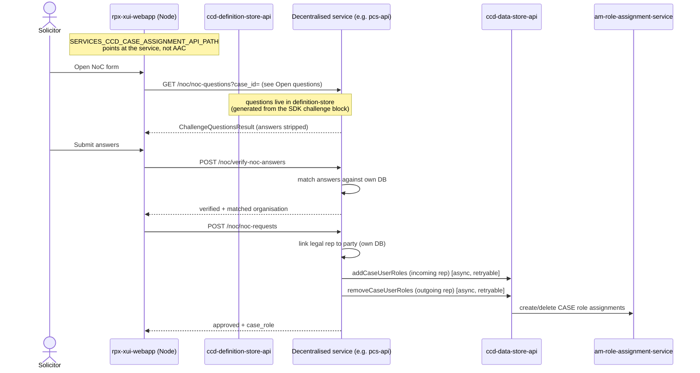

# Implement Notice of Change for a decentralised service

> **Status: proof-of-concept.** This guide is reverse-engineered from the
> `noc-xui-native` (config-generator) and `noc-xui-native-pcs` (pcs-api) PoC
> branches. APIs and SDK builder names will change before this lands on master.
> Treat the code snippets as the shape of the solution, not a stable contract.

## TL;DR

- In the **centralised** model, `aac-manage-case-assignment` (AAC) owns the whole NoC flow: it discovers a `ChangeOrganisationRequest` (COR) field by structure-scanning case data, verifies challenge answers against case fields, drives four CCD events, writes role assignments to data-store `/case-users`, maintains an `OrganisationPolicy.PreviousOrganisations` audit trail, and emails the outgoing solicitor via GOV.UK Notify. See [Implement Notice of Change](implement-noc.md) for that model.
- In the **decentralised** model the service owns its own database and its own case lifecycle, so **AAC is bypassed entirely**. The service implements the NoC verify + submit logic itself, against its own tables, and applies role changes directly to AMRAS via the CCD data-store `addCaseUserRoles` / `removeCaseUserRoles` client.
- The ccd-config-generator SDK (`noc-xui-native`) grows a `builder.noticeOfChange()` block with two parts: **challenge questions** (generated into `ChallengeQuestion.json` and imported into definition-store, exactly as before — this is what XUI reads to render the form) and a **runtime endpoint** (`validate` + `submit` handlers) served by an auto-registered `NocController` in the `decentralised-runtime` at `POST /noc/verify-noc-answers` and `POST /noc/noc-requests`.
- **You do not need a `ChangeOrganisationRequest` field, and you do not need an `OrganisationPolicy` field**, in the PCS PoC. Representation state lives in the service's own entities (PCS: `LegalRepresentativeEntity` linked to `PartyEntity`). The "put OrganisationPolicy in a list" advice solved AAC's one-org-per-role limitation; decentralised services sidestep that by not modelling representation as CCD `OrganisationPolicy` at all. See [Do you still need OrganisationPolicy?](#do-you-still-need-organisationpolicy) for the nuance — XUI may still want one for display.
- **Who sends the email?** The service does — there is no AAC to do it. The PoC has not wired Notify yet; the `noc-provider-routing` branch leaves an explicit `TODO` to send the outgoing-representative email from the service's own job queue, using AAC's Notify template as the content baseline.
- **Multi-party** works because the service writes its own matching logic. AAC's "one Role filled by one Org" assumption lives in `OrganisationPolicy` + COR; once you drop those and match parties in your own code, a case can have any number of represented parties.

---

## How the two models differ

| Concern | Centralised (AAC) | Decentralised (this guide) |
|---|---|---|
| Who serves `/noc/*` to XUI | AAC (`aac-manage-case-assignment`, port 4454) | The service itself, via the SDK's `decentralised-runtime` `NocController` |
| Challenge questions | `ChallengeQuestion` group id `NoCChallenge` in definition-store | Same — generated by the SDK into `ChallengeQuestion.json`, imported to definition-store |
| Answer verification | AAC `ChallengeAnswerValidator` against CCD case fields | Your `validate` handler against your own DB |
| In-flight request holder | `ChangeOrganisationRequest` complex field on the case | None — service tracks state in its own entities |
| Representation model | `OrganisationPolicy` per role (one org ↔ one role) | Service entities (PCS: `LegalRepresentativeEntity`); no `OrganisationPolicy` required |
| CCD events | 2–4 events (Request / Approval / Rejection / Decision) | None required — the submit handler does the work synchronously |
| Role assignment | AAC → data-store `/case-users` → AMRAS | Service → data-store `addCaseUserRoles`/`removeCaseUserRoles` → AMRAS |
| Audit trail | `OrganisationPolicy.PreviousOrganisations` collection | Service entities (PCS: `ClaimPartyLegalRepresentative` rows marked `active = NO` with `endDate`) |
| Outgoing-solicitor email | AAC via GOV.UK Notify | The service must do this itself (not yet wired in PoC) |

The decentralised flow collapses the AAC orchestration into two service-owned handlers. There is no PENDING/approval state machine in the PoC — verify and submit are synchronous and the request is auto-approved on a successful match.

---

## Architecture: what calls what



The decisive change is the XUI base URL: `SERVICES_CCD_CASE_ASSIGNMENT_API_PATH` (used by `api/noc/index.ts` to build `/noc/noc-questions`, `/noc/verify-noc-answers`, `/noc/noc-requests`) must resolve to the decentralised service rather than AAC. How XUI picks that per-case-type is the main open routing question — see [Open questions](#open-questions-and-gaps-in-the-poc).

---

## Step 1 — Declare the NoC block in your SDK config

On the `noc-xui-native` branch, `ConfigBuilder` gains `noticeOfChange()`, returning a builder with two responsibilities: **challenge questions** (definition-store config) and **runtime handlers** (`validate` / `submit`).

```java
// pcs-api: PcsNoticeOfChange.java (PoC)
@Component
@RequiredArgsConstructor
public class PcsNoticeOfChange implements CCDConfig<PCSCase, State, UserRole> {

    static final String FIRST_NAME_QUESTION_ID = "pcs-defendant-first-name";
    static final String LAST_NAME_QUESTION_ID = "pcs-defendant-last-name";
    static final String CHALLENGE_ID = "NoC";
    private static final UserRole CASE_ROLE = UserRole.DEFENDANT_SOLICITOR;

    @Override
    public void configure(ConfigBuilder<PCSCase, State, UserRole> builder) {
        var noticeOfChange = builder.noticeOfChange()
            .validate(this::validate)   // POST /noc/verify-noc-answers
            .submit(this::submit);      // POST /noc/noc-requests

        var challenge = noticeOfChange.challenge(CHALLENGE_ID);
        challenge
            .question(FIRST_NAME_QUESTION_ID, "What is the defendant's first name?")
            .answer(CASE_ROLE)
                .complex(PCSCase::getDefendant1)
                .field(DefendantDetails::getFirstName)
            .done()
            .question(LAST_NAME_QUESTION_ID, "What is the defendant's last name?")
            .answer(CASE_ROLE)
                .complex(PCSCase::getDefendant1)
                .field(DefendantDetails::getLastName)
            .done();
    }
    // validate(...) and submit(...) below
}
```

Two things happen at config-resolution time:

1. **Challenge questions** are emitted by `ChallengeQuestionGenerator` into `ChallengeQuestion.json` (case type, challenge id, question id/text/order, and an `Answer` expression `${path.to.field}:[ROLE]`). This is imported into definition-store like any other config and is what XUI reads to render the form. The challenge id here (`"NoC"`) is the group id — the centralised model hardcodes `NoCChallenge`, so confirm what the decentralised XUI route expects (see [Open questions](#open-questions-and-gaps-in-the-poc)).
2. **Runtime handlers** are bundled into a `NocEndpoint` (`NoticeOfChange.build(caseTypeId)`), discovered at runtime by the auto-registered `NocController`.

The `.answer(role).complex(...).field(...)` builder records a dot-path into the model and binds it to a case role; the generator turns each into `${defendant1.firstName}:[DEFENDANTSOLICITOR]`. Note the answer expression is generated for definition-store/XUI display purposes — **the actual matching is done by your `validate` handler in code**, not by AAC's `ChallengeAnswerValidator`.

---

## Step 2 — Implement the `validate` handler (verify answers)

`validate` receives a `NocSubmitContext` (the authenticated caller — IDAM uid, email, name, roles, plus their bearer token) and a `NocAnswersRequest` (`case_id` + a list of `{question_id, value}`). It returns a `NocAnswersResponse`: either `verified(organisation)` or one of the typed errors.

```java
public NocAnswersResponse validate(NocSubmitContext context, NocAnswersRequest request) {
    // 1. structural checks: answers present, right count, expected question ids
    Optional<NocAnswersResponse> error = validateRequest(request);
    if (error.isPresent()) {
        return error.get();
    }

    // 2. match answers against YOUR OWN data
    PcsCaseEntity pcsCase = loadCase(request.caseId());
    List<PartyEntity> matches = matchingDefendants(pcsCase, request);
    error = validateMatches(matches);          // empty -> not-matched; >1 -> not-identify
    if (error.isPresent()) {
        return error.get();
    }

    // 3. "already represents" guard, against your own representation table
    PartyEntity matchedParty = matches.getFirst();
    UUID currentUserId = UUID.fromString(context.userId());
    if (legalRepresentativeRepository.isLegalRepresentativeLinkedToPartyAndActive(
            currentUserId, matchedParty.getId())) {
        return NocAnswersResponse.requestingOrgAlreadyRepresentsParty();
    }

    // 4. resolve the caller's organisation (PRD) for the response payload
    OrganisationDetailsResponse org =
        organisationDetailsService.getOrganisationDetails(context.userId());
    return NocAnswersResponse.verified(
        new NocOrganisation(org.getOrganisationIdentifier(), org.getName()));
}
```

The SDK provides typed error factories on `NocAnswersResponse` mapping to stable codes (`NocError`): `answersEmpty()`, `answersMismatchQuestions(expected, received)`, `noAnswerProvidedForQuestion(id)`, `answersNotMatchedAnyLitigant()`, `answersNotIdentifyLitigant()`, `requestingOrgAlreadyRepresentsParty()`. These mirror the AAC error vocabulary so XUI's existing error map keeps working.

Matching is your code's responsibility. PCS normalises (trim, collapse whitespace, lowercase) and requires **exactly one** matching party — zero is `answers-not-matched-any-litigant`, more than one is `answers-not-identify-litigant`. This is the decentralised equivalent of AAC's "exactly one caseRoleId must match" rule, but you own the comparison and can match across as many parties as you like (multi-party).

---

## Step 3 — Implement the `submit` handler (apply the change)

`submit` re-runs `validate` (defence in depth — never trust that the client called verify first), then performs the representation change against your own DB and schedules the role-assignment side effects.

```java
public NocSubmissionResponse submit(NocSubmitContext context, NocAnswersRequest request) {
    NocAnswersResponse validation = validate(context, request);
    if (!validation.isValid()) {
        return NocSubmissionResponse.invalid(validation.code(), validation.message());
    }

    PcsCaseEntity pcsCase = loadCase(request.caseId());
    PartyEntity matchedParty = matchingDefendants(pcsCase, request).getFirst();
    UUID currentUserId = UUID.fromString(context.userId());
    Optional<LegalRepresentativeEntity> incumbent =
        legalRepresentativeRepository.findLegalRepresentativeForParty(matchedParty.getId());

    // Decide GRANT (incoming) + optional REVOKE (outgoing) before mutating
    NocAccessChangePlan plan =
        planAccessChanges(pcsCase, matchedParty, incumbent, currentUserId, context.userId());

    // 1. Update representation in our own DB (links new rep, unlinks old)
    legalRepresentativePartyLinkService.linkLegalRepresentativeToParty(
        pcsCase.getCaseReference(), matchedParty.getId().toString(), userInfo(context));

    // 2. Apply RAS changes asynchronously, with retry (see Step 4)
    scheduleAccessChanges(plan);

    return NocSubmissionResponse.approved(CASE_ROLE.getRole());
}
```

Key design choices in the PoC:

- **No COR, no approval state.** A successful match auto-approves. `NocSubmissionResponse.approved(caseRole)` returns `approval_status: "APPROVED"`; `pending(caseRole)` exists if you ever add an approver gate.
- **Representation is a DB write, not a CCD field.** `linkLegalRepresentativeToParty` creates/links a `LegalRepresentativeEntity` to the `PartyEntity` and marks the previous representation's join rows `active = NO` with an `endDate` — this is the audit trail (the decentralised equivalent of `PreviousOrganisations`).
- **Plan, then act.** `planAccessChanges` computes whether to GRANT the incoming rep (skip if they already hold case access) and whether to REVOKE the incumbent (skip if the incumbent still represents another party on the same case — the multi-party safety check). Only then are side effects scheduled.

---

## Step 4 — Apply role changes durably (RAS side effects)

Role assignment talks to a shared system (AMRAS) over the network, so the PoC pushes it behind a **durable job** (`db-scheduler` / kagkarlsson `SchedulerClient`) rather than doing it inline. The submit transaction commits the representation change to the service's own DB; the RAS calls happen in a retryable task.

```java
// NocAccessChangeTaskComponent — retryable task
@Bean
public CustomTask<NocAccessChangeTaskData> nocAccessChangeTask() {
    return Tasks.custom(NOC_ACCESS_CHANGE_TASK_DESCRIPTOR)
        .onFailure(new FailureHandler.MaxRetriesFailureHandler<>(
            maxRetries, new FailureHandler.ExponentialBackoffFailureHandler<>(backoffDelay)))
        .execute((taskInstance, ctx) -> {
            NocAccessChangeTaskData data = taskInstance.getData();
            long caseReference = Long.parseLong(data.getCaseReference());
            switch (data.getAction()) {
                case GRANT  -> caseRoleAssignmentService.assignRasRole(
                                   caseReference, data.getUserId(), UserRole.DEFENDANT_SOLICITOR);
                case REVOKE -> caseRoleAssignmentService.revokeRasRole(
                                   caseReference, data.getUserId(), UserRole.DEFENDANT_SOLICITOR);
                default -> throw new IllegalStateException("Unexpected NoC access change action");
            }
            return new CompletionHandler.OnCompleteRemove<>();
        });
}
```

`CaseRoleAssignmentService` uses the CCD `CaseAssignmentApi` Feign client with a **system-user token** (not the solicitor's), exactly like AAC does:

```java
public CaseAssignmentUserRolesResponse assignRasRole(long caseRef, String userId, UserRole role) {
    String s2s = authTokenGenerator.generate();
    String userToken = idamService.getSystemUserAuthorisation();
    var assignment = CaseAssignmentUserRoleWithOrganisation.builder()
        .caseDataId(String.valueOf(caseRef)).caseRole(role.getRole()).userId(userId).build();
    return caseAssignmentApi.addCaseUserRoles(userToken, s2s,
        CaseAssignmentUserRolesRequest.builder()
            .caseAssignmentUserRolesWithOrganisation(List.of(assignment)).build());
}
// revokeRasRole is identical but calls removeCaseUserRoles
```

This is the same data-store endpoint AAC's `ApplyNoCDecisionService` ultimately calls — you are just calling it yourself. Roles land as `CASE`-scoped assignments in AMRAS.

> **Idempotency.** PCS derives a stable task id (`noc-{grant|revoke}-{caseRef}-{userId}`) and uses `scheduleIfNotExists`, so a double-submit or a retry won't create duplicate role assignments.

---

## Step 5 — Send the outgoing-representative email

**This is the answer to "who is responsible for the email": you are.** AAC sent it via GOV.UK Notify because AAC owned the flow. In the decentralised model there is no AAC, so the service must send it.

The PoC has **not** wired this yet. The `noc-provider-routing` branch leaves an explicit marker:

> `// TODO: Move NoC side effects behind a durable job boundary … RAS role assignment, RAS role revocation, and outgoing representative notification should be retried from the PCS job queue. Use the AAC outgoing representative Notify template as the content baseline.`

Recommended approach when you implement it:

- Send from the **same durable job boundary** as the RAS revoke (add a `NOTIFY` action alongside `GRANT`/`REVOKE`, or a dedicated task), so a Notify outage retries rather than losing the email.
- Only notify on the **REVOKE** path (a solicitor was actually displaced) — pure add-representation (LiP → represented) has no outgoing solicitor.
- Reuse AAC's Notify template content as the baseline so the email wording matches what users already receive on centralised services. (AAC's template reference: `aac-manage-case-assignment/src/main/resources/application.yaml`, `notify.*`.)

---

## Step 6 — Service auth and the runtime controller

The SDK's `decentralised-runtime` auto-registers `NocController` at `/noc` when a `ResolvedConfigRegistry` bean is present. You don't write it. It:

- exposes `POST /noc/verify-noc-answers` → your `validate`, and `POST /noc/noc-requests` → your `submit`;
- validates the `ServiceAuthorization` S2S token and checks the caller against the endpoint's **authorised services** (default: `xui_webapp`). Override via `authorisedServices(...)` on the endpoint builder if a different caller needs access;
- authenticates the user from the `Authorization` bearer token via IDAM and packs it into the `NocSubmitContext` your handlers receive;
- returns `200` (verify) / `201` (submit) on success, `400` with `{code, message}` on a typed validation failure, and `401/403` on auth failures.

You must add `xui_webapp` to your service's S2S allow-list. In the PCS PoC:

```yaml
# application.yaml
idam:
  s2s-authorised:
    services: ${S2S_NAMES_WHITELIST:pcs_api,pcs_frontend,xui_webapp,ccd_data,payment_app}
```

---

## Do you still need OrganisationPolicy?

Short answer for the **service backend**: **no.** The PCS PoC contains no `OrganisationPolicy` field and no `ChangeOrganisationRequest` field anywhere — representation is modelled by `LegalRepresentativeEntity` ↔ `PartyEntity` join rows in the service's own schema. Matching, the "already represents" guard, and the audit trail all run against those tables.

The "put OrganisationPolicy in a list" advice you were given is a workaround for AAC's hard assumption that one role is filled by one organisation (the COR and `OrganisationPolicy` both encode a 1:1 role↔org relationship, which breaks for multi-party). By **not** routing through AAC and **not** modelling representation as CCD `OrganisationPolicy`, the decentralised service avoids that limitation entirely — a case can carry any number of represented parties because your own schema and matching code decide the cardinality.

The nuance — and an open question to confirm with the ExUI team — is **display**. XUI historically reads `OrganisationPolicy` fields to show "who represents whom" on the case. If your service's XUI tab needs to show current representation, you may still want to **surface** an `OrganisationPolicy`-shaped value in your `CaseView` projection for display, even though it plays no part in the NoC mechanics. That is a read-model concern, not a NoC requirement, and the PoC doesn't address it. Don't add a writable `OrganisationPolicy` field expecting AAC semantics — nothing will drive it.

---

## Open questions and gaps in the PoC

These are genuinely unresolved on the PoC branches — flag them with the ExUI / RCCD platform team before committing to a design:

1. **The questions endpoint.** XUI calls `GET /noc/noc-questions?case_id=` (`api/noc/index.ts`), but the `noc-xui-native` `NocController` only serves `verify-noc-answers` and `noc-requests`. The challenge questions are generated into definition-store, so either (a) XUI fetches questions from definition-store/data-store directly for decentralised case types, or (b) the questions call still goes somewhere central. The separate `noc-provider-routing` branch instead adds a `questions(...)` handler to the SDK (`builder.noc().questions(...).verifyAnswers(...).submit(...)`) so the **service** serves questions too — a different shape from `noc-xui-native`. Decide which model wins.
2. **XUI routing per case type.** `SERVICES_CCD_CASE_ASSIGNMENT_API_PATH` is a single base URL. How XUI decides, per case type, to call the decentralised service instead of AAC is not in these branches. This is the core "ExUI decentralisation" routing problem and likely needs a platform-level resolver.
3. **Challenge group id.** PCS uses challenge id `"NoC"`; the centralised XUI/AAC path hardcodes `NoCChallenge`. Confirm what the decentralised XUI route expects.
4. **Two divergent SDK shapes.** `noc-xui-native` exposes `builder.noticeOfChange().validate(...).submit(...)`; `noc-provider-routing` exposes `builder.noc().questions(...).verifyAnswers(...).submit(...)`. They are competing PoCs — only one should survive.
5. **No approval gate.** The PoC auto-approves on match. If a service needs a caseworker approval step, that state machine has to be designed (the SDK has `NocSubmissionResponse.pending(...)` as a hook but nothing consumes it yet).
6. **Email not implemented** (Step 5).
7. **config-generator merge status.** The challenge-question + NoC builder support is on the `noc-xui-native` branch and is **not merged** — your observation that "support in ccd-config-generator is [not] fully merged" is correct.

---

## See also

- [Implement Notice of Change](implement-noc.md) — the centralised, AAC-based model (contrast)
- [Notice of Change](../explanation/notice-of-change.md) — conceptual overview of the AAC flow
- [Decentralise a Service](decentralise-a-service.md) — how decentralised case persistence works (the foundation this builds on)
- [Role assignment](../explanation/role-assignment.md) — how `CASE`-scoped assignments are written to AMRAS

## Glossary

See [Glossary](../reference/glossary.md) for term definitions used in this page.
