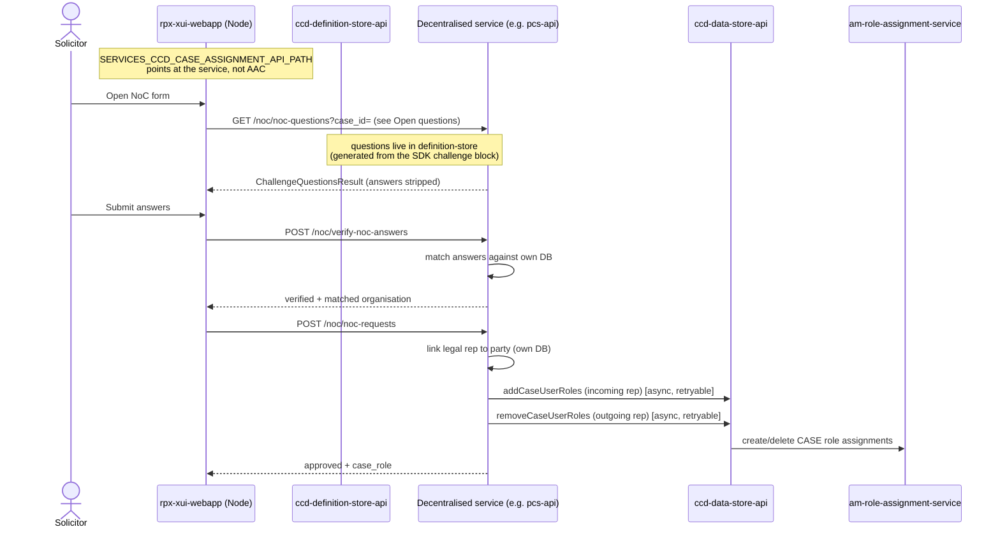

# Implement Notice of Change for a decentralised service

> **Status: SDK merged, service wiring still PoC.** The ccd-config-generator half has
> landed on master — `builder.noticeOfChange()`, the `Noc*` API types, and the
> `decentralised-runtime` `NocController` are all released SDK surface, so treat those
> snippets as a real contract. The **PCS-side** examples are still reverse-engineered
> from the unmerged `noc-xui-native-pcs` / `noc-provider-routing` branches and show the
> shape of the solution, not a stable contract. The questions endpoint is still served
> by AAC, which is what forces an `OrganisationPolicy` (see below).

## TL;DR

- In the **centralised** model, `aac-manage-case-assignment` (AAC) owns the whole NoC flow: it discovers a `ChangeOrganisationRequest` (COR) field by structure-scanning case data, verifies challenge answers against case fields, drives four CCD events, writes role assignments to data-store `/case-users`, maintains an `OrganisationPolicy.PreviousOrganisations` audit trail, and emails the outgoing solicitor via GOV.UK Notify. See [Implement Notice of Change](implement-noc.md) for that model.
- In the **decentralised** model the service owns its own database and its own case lifecycle, so **AAC is bypassed entirely**. The service implements the NoC verify + submit logic itself, against its own tables, and applies role changes directly to AMRAS via the CCD data-store `addCaseUserRoles` / `removeCaseUserRoles` client.
- The ccd-config-generator SDK provides a `builder.noticeOfChange()` block with two parts: **challenge questions** (generated into `ChallengeQuestion.json` and imported into definition-store, exactly as before — this is what XUI reads to render the form) and a **runtime endpoint** (`validate` + `submit` handlers) served by `NocController` in the `decentralised-runtime` at `POST /noc/verify-noc-answers` and `POST /noc/noc-requests`. The controller is opt-in via `ccd.decentralised-runtime.noc.enabled: true`.
- **You do not need a `ChangeOrganisationRequest` field**, and the PCS verify/submit *logic* never reads an `OrganisationPolicy` — representation state lives in the service's own entities (PCS: `LegalRepresentativeEntity` linked to `PartyEntity`). **But you almost certainly still need at least one `OrganisationPolicy` field on the case**, because the questions-rendering path still goes through AAC, which refuses to return challenge questions for a case that has no matching OrganisationPolicy. This is exactly what blocks XUI from rendering the form. See [Do you still need OrganisationPolicy?](#do-you-still-need-organisationpolicy) for the precise mechanism and the "put them in a list" nuance.
- **Who sends the email?** The service does — there is no AAC to do it. The PoC has not wired Notify yet; the `noc-provider-routing` branch leaves an explicit `TODO` to send the outgoing-representative email from the service's own job queue, using AAC's Notify template as the content baseline.
- **Multi-party** works because the service writes its own matching logic. AAC's "one Role filled by one Org" assumption lives in `OrganisationPolicy` + COR; once you drop those and match parties in your own code, a case can have any number of represented parties.

---

## How the two models differ

| Concern | Centralised (AAC) | Decentralised (this guide) |
|---|---|---|
| Who serves `verify-noc-answers` / `noc-requests` to XUI | AAC (`aac-manage-case-assignment`, port 4454) | The service itself, via the SDK's `decentralised-runtime` `NocController` |
| Who serves `noc-questions` to XUI | AAC | **Still AAC in the PoC** — and AAC requires an OrganisationPolicy here (see below) |
| Challenge questions | `ChallengeQuestion` group id `NoCChallenge` in definition-store | Same — generated by the SDK into `ChallengeQuestion.json`, imported to definition-store |
| Answer verification | AAC `ChallengeAnswerValidator` against CCD case fields | Your `validate` handler against your own DB |
| In-flight request holder | `ChangeOrganisationRequest` complex field on the case | None — service tracks state in its own entities |
| Representation model | `OrganisationPolicy` per role (one org ↔ one role) | Service entities (PCS: `LegalRepresentativeEntity`) — but an `OrganisationPolicy` field is still needed to satisfy AAC's question-rendering gate |
| CCD events | 2–4 events (Request / Approval / Rejection / Decision) | None required — the submit handler does the work synchronously |
| Role assignment | AAC → data-store `/case-users` → AMRAS | Service → data-store `addCaseUserRoles`/`removeCaseUserRoles` → AMRAS |
| Audit trail | `OrganisationPolicy.PreviousOrganisations` collection | Service entities (PCS: `ClaimPartyLegalRepresentative` rows marked `active = NO` with `endDate`) |
| Outgoing-solicitor email | AAC via GOV.UK Notify | The service must do this itself (not yet wired in PoC) |

The decentralised flow collapses the AAC orchestration into two service-owned handlers. There is no PENDING/approval state machine in the PoC — verify and submit are synchronous and the request is auto-approved on a successful match.

---

## Architecture: what calls what


```mermaid
sequenceDiagram
    actor Solicitor
    participant XUI as rpx-xui-webapp (Node)
    participant DefStore as ccd-definition-store-api
    participant Svc as Decentralised service (e.g. pcs-api)
    participant DS as ccd-data-store-api
    participant AMRAS as am-role-assignment-service

    Note over XUI: SERVICES_CCD_CASE_ASSIGNMENT_API_PATH<br/>points at the service, not AAC
    Solicitor->>XUI: Open NoC form
    XUI->>Svc: GET /noc/noc-questions?case_id= (see Open questions)
    Note over Svc,DefStore: questions live in definition-store<br/>(generated from the SDK challenge block)
    Svc-->>XUI: ChallengeQuestionsResult (answers stripped)
    Solicitor->>XUI: Submit answers
    XUI->>Svc: POST /noc/verify-noc-answers
    Svc->>Svc: match answers against own DB
    Svc-->>XUI: verified + matched organisation
    XUI->>Svc: POST /noc/noc-requests
    Svc->>Svc: link legal rep to party (own DB)
    Svc->>DS: addCaseUserRoles (incoming rep) [async, retryable]
    Svc->>DS: removeCaseUserRoles (outgoing rep) [async, retryable]
    DS->>AMRAS: create/delete CASE role assignments
    Svc-->>XUI: approved + case_role
```

The decisive change is the XUI base URL: `SERVICES_CCD_CASE_ASSIGNMENT_API_PATH` (used by `api/noc/index.ts` to build `/noc/noc-questions`, `/noc/verify-noc-answers`, `/noc/noc-requests`) must resolve to the decentralised service rather than AAC. How XUI picks that per-case-type is the main open routing question — see [Open questions](#open-questions-and-gaps-in-the-poc).

---

## Step 1 — Declare the NoC block in your SDK config

On master, `ConfigBuilder` provides `noticeOfChange()`, returning a builder with two responsibilities: **challenge questions** (definition-store config) and **runtime handlers** (`validate` / `submit`).

```java
// pcs-api: PcsNoticeOfChange.java (PoC)
@Component
@RequiredArgsConstructor
public class PcsNoticeOfChange implements CCDConfig<PCSCase, State, UserRole> {

    static final String FIRST_NAME_QUESTION_ID = "pcs-defendant-first-name";
    static final String LAST_NAME_QUESTION_ID = "pcs-defendant-last-name";
    static final String CHALLENGE_ID = "NoC";
    private static final UserRole CASE_ROLE = UserRole.DEFENDANT_SOLICITOR;

    @Override
    public void configure(ConfigBuilder<PCSCase, State, UserRole> builder) {
        var noticeOfChange = builder.noticeOfChange()
            .validate(this::validate)   // POST /noc/verify-noc-answers
            .submit(this::submit);      // POST /noc/noc-requests

        var challenge = noticeOfChange.challenge(CHALLENGE_ID);
        challenge
            .question(FIRST_NAME_QUESTION_ID, "What is the defendant's first name?")
            .answer(CASE_ROLE)
                .complex(PCSCase::getDefendant1)
                .field(DefendantDetails::getFirstName)
            .done()
            .question(LAST_NAME_QUESTION_ID, "What is the defendant's last name?")
            .answer(CASE_ROLE)
                .complex(PCSCase::getDefendant1)
                .field(DefendantDetails::getLastName)
            .done();
    }
    // validate(...) and submit(...) below
}
```

Two things happen at config-resolution time:

1. **Challenge questions** are emitted by `ChallengeQuestionGenerator` into `ChallengeQuestion.json` (case type, challenge id, question id/text/order, and an `Answer` expression `${path.to.field}:[ROLE]`). This is imported into definition-store like any other config and is what XUI reads to render the form. The challenge id here (`"NoC"`) is the group id — the centralised model hardcodes `NoCChallenge`, so confirm what the decentralised XUI route expects (see [Open questions](#open-questions-and-gaps-in-the-poc)).
2. **Runtime handlers** are bundled into a `NocEndpoint` (`NoticeOfChange.build(caseTypeId)`), discovered at runtime by `NocController` (which you must enable — see [Step 6](#step-6--service-auth-and-the-runtime-controller)).

The `.answer(role).complex(...).field(...)` builder records a dot-path into the model and binds it to a case role; the generator turns each into `${defendant1.firstName}:[DEFENDANTSOLICITOR]`. Note the answer expression is generated for definition-store/XUI display purposes — **the actual matching is done by your `validate` handler in code**, not by AAC's `ChallengeAnswerValidator`.

---

## Step 2 — Implement the `validate` handler (verify answers)

`validate` receives a `NocSubmitContext` (the authenticated caller — IDAM uid, email, name, roles, plus their bearer token) and a `NocAnswersRequest` (`case_id` + a list of `{question_id, value}`). It returns a `NocAnswersResponse`: either `verified(organisation)` or one of the typed errors.

```java
public NocAnswersResponse validate(NocSubmitContext context, NocAnswersRequest request) {
    // 1. structural checks: answers present, right count, expected question ids
    Optional<NocAnswersResponse> error = validateRequest(request);
    if (error.isPresent()) {
        return error.get();
    }

    // 2. match answers against YOUR OWN data
    PcsCaseEntity pcsCase = loadCase(request.caseId());
    List<PartyEntity> matches = matchingDefendants(pcsCase, request);
    error = validateMatches(matches);          // empty -> not-matched; >1 -> not-identify
    if (error.isPresent()) {
        return error.get();
    }

    // 3. "already represents" guard, against your own representation table
    PartyEntity matchedParty = matches.getFirst();
    UUID currentUserId = UUID.fromString(context.userId());
    if (legalRepresentativeRepository.isLegalRepresentativeLinkedToPartyAndActive(
            currentUserId, matchedParty.getId())) {
        return NocAnswersResponse.requestingOrgAlreadyRepresentsParty();
    }

    // 4. resolve the caller's organisation (PRD) for the response payload
    OrganisationDetailsResponse org =
        organisationDetailsService.getOrganisationDetails(context.userId());
    return NocAnswersResponse.verified(
        new NocOrganisation(org.getOrganisationIdentifier(), org.getName()));
}
```

The SDK provides typed error factories on `NocAnswersResponse` mapping to stable codes (`NocError`): `answersEmpty()`, `answersMismatchQuestions(expected, received)`, `noAnswerProvidedForQuestion(id)`, `answersNotMatchedAnyLitigant()`, `answersNotIdentifyLitigant()`, `requestingOrgAlreadyRepresentsParty()`. These mirror the AAC error vocabulary so XUI's existing error map keeps working.

Matching is your code's responsibility. PCS normalises (trim, collapse whitespace, lowercase) and requires **exactly one** matching party — zero is `answers-not-matched-any-litigant`, more than one is `answers-not-identify-litigant`. This is the decentralised equivalent of AAC's "exactly one caseRoleId must match" rule, but you own the comparison and can match across as many parties as you like (multi-party).

---

## Step 3 — Implement the `submit` handler (apply the change)

`submit` re-runs `validate` (defence in depth — never trust that the client called verify first), then performs the representation change against your own DB and schedules the role-assignment side effects.

```java
public NocSubmissionResponse submit(NocSubmitContext context, NocAnswersRequest request) {
    NocAnswersResponse validation = validate(context, request);
    if (!validation.isValid()) {
        return NocSubmissionResponse.invalid(validation.code(), validation.message());
    }

    PcsCaseEntity pcsCase = loadCase(request.caseId());
    PartyEntity matchedParty = matchingDefendants(pcsCase, request).getFirst();
    UUID currentUserId = UUID.fromString(context.userId());
    Optional<LegalRepresentativeEntity> incumbent =
        legalRepresentativeRepository.findLegalRepresentativeForParty(matchedParty.getId());

    // Decide GRANT (incoming) + optional REVOKE (outgoing) before mutating
    NocAccessChangePlan plan =
        planAccessChanges(pcsCase, matchedParty, incumbent, currentUserId, context.userId());

    // 1. Update representation in our own DB (links new rep, unlinks old)
    legalRepresentativePartyLinkService.linkLegalRepresentativeToParty(
        pcsCase.getCaseReference(), matchedParty.getId().toString(), userInfo(context));

    // 2. Apply RAS changes asynchronously, with retry (see Step 4)
    scheduleAccessChanges(plan);

    return NocSubmissionResponse.approved(CASE_ROLE.getRole());
}
```

Key design choices in the PoC:

- **No COR, no approval state.** A successful match auto-approves. `NocSubmissionResponse.approved(caseRole)` returns `approval_status: "APPROVED"`; `pending(caseRole)` exists if you ever add an approver gate.
- **Representation is a DB write, not a CCD field.** `linkLegalRepresentativeToParty` creates/links a `LegalRepresentativeEntity` to the `PartyEntity` and marks the previous representation's join rows `active = NO` with an `endDate` — this is the audit trail (the decentralised equivalent of `PreviousOrganisations`).
- **Plan, then act.** `planAccessChanges` computes whether to GRANT the incoming rep (skip if they already hold case access) and whether to REVOKE the incumbent (skip if the incumbent still represents another party on the same case — the multi-party safety check). Only then are side effects scheduled.

---

## Step 4 — Apply role changes durably (RAS side effects)

Role assignment talks to a shared system (AMRAS) over the network, so the PoC pushes it behind a **durable job** (`db-scheduler` / kagkarlsson `SchedulerClient`) rather than doing it inline. The submit transaction commits the representation change to the service's own DB; the RAS calls happen in a retryable task.

```java
// NocAccessChangeTaskComponent — retryable task
@Bean
public CustomTask<NocAccessChangeTaskData> nocAccessChangeTask() {
    return Tasks.custom(NOC_ACCESS_CHANGE_TASK_DESCRIPTOR)
        .onFailure(new FailureHandler.MaxRetriesFailureHandler<>(
            maxRetries, new FailureHandler.ExponentialBackoffFailureHandler<>(backoffDelay)))
        .execute((taskInstance, ctx) -> {
            NocAccessChangeTaskData data = taskInstance.getData();
            long caseReference = Long.parseLong(data.getCaseReference());
            switch (data.getAction()) {
                case GRANT  -> caseRoleAssignmentService.assignRasRole(
                                   caseReference, data.getUserId(), UserRole.DEFENDANT_SOLICITOR);
                case REVOKE -> caseRoleAssignmentService.revokeRasRole(
                                   caseReference, data.getUserId(), UserRole.DEFENDANT_SOLICITOR);
                default -> throw new IllegalStateException("Unexpected NoC access change action");
            }
            return new CompletionHandler.OnCompleteRemove<>();
        });
}
```

`CaseRoleAssignmentService` uses the CCD `CaseAssignmentApi` Feign client with a **system-user token** (not the solicitor's), exactly like AAC does:

```java
public CaseAssignmentUserRolesResponse assignRasRole(long caseRef, String userId, UserRole role) {
    String s2s = authTokenGenerator.generate();
    String userToken = idamService.getSystemUserAuthorisation();
    var assignment = CaseAssignmentUserRoleWithOrganisation.builder()
        .caseDataId(String.valueOf(caseRef)).caseRole(role.getRole()).userId(userId).build();
    return caseAssignmentApi.addCaseUserRoles(userToken, s2s,
        CaseAssignmentUserRolesRequest.builder()
            .caseAssignmentUserRolesWithOrganisation(List.of(assignment)).build());
}
// revokeRasRole is identical but calls removeCaseUserRoles
```

This is the same data-store endpoint AAC's `ApplyNoCDecisionService` ultimately calls — you are just calling it yourself. Roles land as `CASE`-scoped assignments in AMRAS.

> **Idempotency.** PCS derives a stable task id (`noc-{grant|revoke}-{caseRef}-{userId}`) and uses `scheduleIfNotExists`, so a double-submit or a retry won't create duplicate role assignments.

---

## Step 5 — Send the outgoing-representative email

**This is the answer to "who is responsible for the email": you are.** AAC sent it via GOV.UK Notify because AAC owned the flow. In the decentralised model there is no AAC, so the service must send it.

The PoC has **not** wired this yet. The `noc-provider-routing` branch leaves an explicit marker:

> `// TODO: Move NoC side effects behind a durable job boundary … RAS role assignment, RAS role revocation, and outgoing representative notification should be retried from the PCS job queue. Use the AAC outgoing representative Notify template as the content baseline.`

Recommended approach when you implement it:

- Send from the **same durable job boundary** as the RAS revoke (add a `NOTIFY` action alongside `GRANT`/`REVOKE`, or a dedicated task), so a Notify outage retries rather than losing the email.
- Only notify on the **REVOKE** path (a solicitor was actually displaced) — pure add-representation (LiP → represented) has no outgoing solicitor.
- Reuse AAC's Notify template content as the baseline so the email wording matches what users already receive on centralised services. (AAC's template reference: `aac-manage-case-assignment/src/main/resources/application.yaml`, `notify.*`.)

---

## Step 6 — Service auth and the runtime controller

The SDK's `decentralised-runtime` ships `NocController` at `/noc` — you don't write it. It is **opt-in**: as
well as needing a `ResolvedConfigRegistry` bean, the controller is annotated
`@ConditionalOnProperty(prefix = "ccd.decentralised-runtime.noc", name = "enabled", havingValue = "true")`,
so services that don't use NoC never register the routes. Enable it explicitly:

```yaml
ccd:
  decentralised-runtime:
    noc:
      enabled: true
```

Once enabled it:

- exposes `POST /noc/verify-noc-answers` → your `validate`, and `POST /noc/noc-requests` → your `submit`;
- validates the `ServiceAuthorization` S2S token and checks the caller against the endpoint's **authorised services** (default: `xui_webapp`). Override via `authorisedServices(...)` on the endpoint builder if a different caller needs access;
- authenticates the user from the `Authorization` bearer token via IDAM and packs it into the `NocSubmitContext` your handlers receive;
- returns `200` (verify) / `201` (submit) on success, `400` with `{code, message}` on a typed validation failure, and `401/403` on auth failures.

You must add `xui_webapp` to your service's S2S allow-list. In the PCS PoC:

```yaml
# application.yaml
idam:
  s2s-authorised:
    services: ${S2S_NAMES_WHITELIST:pcs_api,pcs_frontend,xui_webapp,ccd_data,payment_app}
```

---

## Do you still need OrganisationPolicy?

**Yes — at least one, despite the service backend never reading it.** This is the subtle part, and it's worth being precise because the two halves of the system disagree:

- **Your service's verify/submit logic does not use OrganisationPolicy at all.** The PCS PoC contains no `OrganisationPolicy` field and no `ChangeOrganisationRequest` field in its own model — matching, the "already represents" guard, and the audit trail all run against `LegalRepresentativeEntity` ↔ `PartyEntity` rows. If the only thing that mattered were the decentralised handlers, you'd need no OrgPolicy.

- **But AAC still serves the questions endpoint, and AAC hard-requires an OrganisationPolicy to return questions at all.** The merged SDK `NocController` only serves `verify-noc-answers` and `noc-requests`. XUI's `GET /noc/noc-questions?case_id=` still goes to AAC. AAC's `NoticeOfChangeQuestions.challengeQuestions()` fetches the challenge questions from definition-store, then calls `checkOrgPoliciesForRoles(...)` (`NoticeOfChangeQuestions.java:80-101`):

  ```java
  List<OrganisationPolicy> organisationPolicies = findPolicies(caseDetails);
  checkOrgPoliciesForRoles(challengeQuestionsResult, organisationPolicies);
  // ...
  private void checkOrgPoliciesForRoles(ChallengeQuestionsResult result,
                                        List<OrganisationPolicy> organisationPolicies) {
      if (organisationPolicies.isEmpty()) {
          throw new NoCException(NO_ORG_POLICY_WITH_ROLE);     // <-- no OrgPolicy at all
      }
      result.getQuestions().forEach(challengeQuestion -> {
          boolean missingRole = challengeQuestion.getAnswers().stream()
              .anyMatch(a -> !isRoleInOrganisationPolicies(organisationPolicies, a.getCaseRoleId()));
          if (missingRole) {
              throw new NoCException(NO_ORG_POLICY_WITH_ROLE); // <-- question role not covered
          }
      });
  }
  ```

  So if the case has **no** OrganisationPolicy, or has one whose `OrgPolicyCaseAssignedRole` doesn't match the `CaseRoleId` of every challenge question, AAC throws `NO_ORG_POLICY_WITH_ROLE` ("No Organisation Policy for one or more of the roles…") and XUI gets nothing to render. **This is exactly the symptom the developer hit.** Note: definition-store *import* validation (`ChallengeQuestionValidator`) does **not** require an OrgPolicy — it only checks the answer-field role against case roles and the dot-paths against case fields. The coupling is purely AAC's runtime questions path.

**What to do, then:**

- Add an `OrganisationPolicy` field for each case role referenced by your challenge questions, with `OrgPolicyCaseAssignedRole` set to that bracket role (e.g. `[DEFENDANTSOLICITOR]`). It exists to satisfy AAC's question gate; your own handlers ignore it.
- The **"put them in a list"** advice fits here: AAC's COR + `OrganisationPolicy` model assumes one role is filled by one organisation, which breaks for multi-party. Your decentralised handlers sidestep that (your DB decides cardinality), but AAC still needs to *see* an OrgPolicy per question role, so modelling the policies as a collection is the pragmatic way to cover multiple parties while keeping AAC's questions endpoint happy.

This requirement disappears only once the questions endpoint also moves off AAC — which is what the alternative `noc-provider-routing` branch explores (it adds a service-side `questions(...)` handler). Until that lands and XUI is routed to it, **keep the OrganisationPolicy field(s).** See [Open questions](#open-questions-and-gaps-in-the-poc) item 1.

---

## Open questions and gaps

The SDK builder is settled, but these remain unresolved — flag them with the ExUI / RCCD platform team before committing to a design:

1. **The questions endpoint (and the OrgPolicy gate it imposes).** XUI calls `GET /noc/noc-questions?case_id=` (`api/noc/index.ts`); the merged `NocController` does **not** serve it, so it still hits AAC — which throws `NO_ORG_POLICY_WITH_ROLE` unless the case carries an OrganisationPolicy matching every question's role (see [Do you still need OrganisationPolicy?](#do-you-still-need-organisationpolicy)). That is the root cause of "XUI won't render the questions". The separate `noc-provider-routing` branch instead adds a `questions(...)` handler to the SDK (`builder.noc().questions(...).verifyAnswers(...).submit(...)`) so the **service** serves questions too — which, if XUI is routed to it, would remove the OrgPolicy requirement entirely. The two branches are different shapes; decide which model wins, and whether the questions endpoint moves off AAC.
2. **XUI routing per case type.** `SERVICES_CCD_CASE_ASSIGNMENT_API_PATH` is a single base URL. How XUI decides, per case type, to call the decentralised service instead of AAC is not in these branches. This is the core "ExUI decentralisation" routing problem and likely needs a platform-level resolver.
3. **Challenge group id.** PCS uses challenge id `"NoC"`; the centralised XUI/AAC path hardcodes `NoCChallenge`. Confirm what the decentralised XUI route expects.
4. **Two divergent SDK shapes — resolved in favour of `noticeOfChange()`.** `builder.noticeOfChange().validate(...).submit(...)` is what merged to master. The competing `noc-sdk-refinement` / `noc-provider-routing` shape (`builder.noc().questions(...).verifyAnswers(...).submit(...)`, with the service serving questions) did **not** merge and remains branch-only. Its `questions(...)` handler is still the only route that would remove the OrgPolicy gate in (1), so the question of whether questions moves off AAC is still open even though the builder naming is settled.
5. **No approval gate.** Submit auto-approves on match. If a service needs a caseworker approval step, that state machine has to be designed (the SDK has `NocSubmissionResponse.pending(...)` as a hook but nothing consumes it yet).
6. **Email not implemented** (Step 5).
7. **Merge status.** The config-generator side is **merged**: challenge questions, the `noticeOfChange()` builder, the `Noc*` API types, and the runtime `NocController` are all on master (the controller now gated behind `ccd.decentralised-runtime.noc.enabled`). The **service-side** wiring is not — on pcs-api master only `CaseRoleAssignmentService` and `LegalRepresentativePartyLinkService` exist; `PcsNoticeOfChange`, `NocAccessChangeTaskComponent`, and `NocService` are still branch-only.

---

## See also

- [Implement Notice of Change](implement-noc.md) — the centralised, AAC-based model (contrast)
- [Notice of Change](../explanation/notice-of-change.md) — conceptual overview of the AAC flow
- [Decentralise a Service](decentralise-a-service.md) — how decentralised case persistence works (the foundation this builds on)
- [Role assignment](../explanation/role-assignment.md) — how `CASE`-scoped assignments are written to AMRAS

## Glossary

See [Glossary](../reference/glossary.md) for term definitions used in this page.
