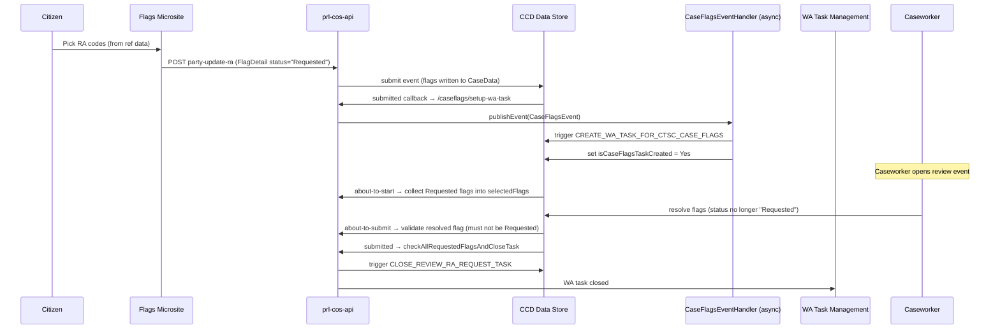

# Implement Reasonable Adjustments

## TL;DR

- Reasonable Adjustments (RA) is **not** a separate data structure — it rides on top of the standard CCD Case Flags v2.1 mechanism. There is a constrained vocabulary of RA flag codes (`RA0001`..`RA0047`) mastered in CFT Reference Data; you don't invent them.
- The vocabulary reaches your service through one `rd-commondata-api` call, and that API **rewrites the data on the way out**: every parent node comes back with `flagCode: "CATGRY"` (its real code moves to `nativeFlagCode`), an `OT0001` "Other" leaf is injected under every category, and parents whose children were all filtered out disappear. Don't assume the response mirrors the CSVs.
- Each party slot on `AllPartyFlags` holds a `Flags` complex type; RA flags are `FlagDetail` entries on those collections, identified by `flagCode`. Citizens / external users only ever see flags whose ref-data `availableExternally = true`.
- When an RA request is submitted, `FlagDetail.status` is set to the **magic string** `"Requested"`. CCD does not enforce this value — the entire WA task lifecycle depends on the exact string.
- Two CCD events drive WA tasks: a `setUpWaTaskForCaseFlagsEventHandler` event publication sets `isCaseFlagsTaskCreated = Yes` (via async `CaseFlagsEventHandler` triggering `CREATE_WA_TASK_FOR_CTSC_CASE_FLAGS`); the caseworker review event resolves flags out of `"Requested"` and the `submitted` callback closes the WA task via `CLOSE_REVIEW_RA_REQUEST_TASK` when all are actioned.
- For mapping RA flags to downstream systems (HMC hearing requests, etc.) **always use `flagCode`, never string-match on display names.** This is explicit guidance from the Case Flags HLD and the IAC interpreter mapping pattern.
- Configuration boilerplate (`FlagLauncher` field, hidden flag collections, `#ARGUMENT(CREATE|UPDATE|READ)` `DisplayContextParameter`) is identical to base Case Flags — see [`apps/ccd/docs/explanation/case-flags.md`](../explanation/case-flags.md) for the full mechanism.

## Prerequisites

- Your service has **already onboarded to Case Flags v1**. RA is an extension to v2.1; you cannot "do RA only".
- Your case type declares the `Flags` complex type on `CaseData` (case-level via `caseFlags`, and per-party via `AllPartyFlags` — or your service's equivalent).
- Reference Data has been updated on your behalf to (a) make the RA flags you want available to your service, (b) set `AvailableExternally = TRUE` for any flag external users should see, and (c) set `DefaultStatus` (`Active` or `Requested`). This is **not** a service deployment — see [Changing reference data](#changing-reference-data) for the governance cycle it goes through, and budget for it in your plan.
- WA task management is configured — the `sdk/task-management` module is on the classpath, or your service has an equivalent WA integration.
- The CCD events that host the caseworker RA review (`CREATE_WA_TASK_FOR_CTSC_CASE_FLAGS`, `CLOSE_REVIEW_RA_REQUEST_TASK`, plus your review event) are defined in your case definition.

## RA flag vocabulary (reference data)

The vocabulary of RA flag codes is mastered in `FlagDetails[…].csv` at the **MRD** (Master
Reference Data) level, and per-CFT-service behaviour overrides live in `FlagService[…].csv`.
Neither file is in this workspace, but the API that serves them is: `rd-commondata-api`
assembles both into the response of
`GET /refdata/commondata/caseflags/service-id={service-id}`
(`CaseFlagApiController.java:68-93`, `CaseFlagRepository.java:15-95`). Everything below that is
cited to that repo is verifiable behaviour; everything cited to Confluence is CSV content or
governance that source cannot show.

### Hierarchy

Flags form a tree by **integer id**, not by flag code: a row's `category_id` holds the `id` of
its parent, and `category_id = 0` marks a root (`CaseFlagServiceImpl.java:91`). The two roots are
`Case` and `Party`, matching the `flag-type` values. `RA0001` "Reasonable adjustment" is *not* a
root — its `category_id` is 2, so it hangs off an intermediate category, and it is reached via
`flag-type=PARTY`. The tree is walked by a recursive CTE that also builds each flag's `Path` as a
`/`-joined chain of English display names
(`CaseFlagRepository.java:15-27`, `CaseFlagServiceImpl.java:99`).

Two levels of ownership sit behind those CSVs. **MRD** (Master Reference Data) spans more than
CFT — its flag data feeds reporting, Scheduling & Listing and the video-hearings platform — and
defines what a flag *is* and where it sits in the tree. **CFT** ref data sits below it and
defines how a flag *behaves* for CFT services. That split is why adding a flag code and changing
a flag's behaviour are two different requests with two different blast radii.

| `id` | Flag code | Name (`value_en`) | Parent `category_id` |
|---|---|---|---|
| 4 | `RA0001` | Reasonable adjustment | 2 |
| 5 | `RA0002` | I need documents in an alternative format | 4 |
| 6 | `RA0003` | I need help with forms | 4 |
| 7 | `RA0004` | I need adjustments to get to, into and around our buildings | 4 |
| 8 | `RA0005` | I need to bring support with me to a hearing | 4 |
| 9 | `RA0006` | I need something to feel comfortable during my hearing | 4 |
| 10 | `RA0007` | I need to request a certain type of hearing | 4 |
| 11 | `RA0008` | I need help communicating and understanding | 4 |
| 12 | `RA0009` | I need an Hearing Enhancement System | 11 |
| 45 | `RA0042` | Sign Language Interpreter | 11 |

Leaf codes by branch (names abbreviated for readability — the authoritative `value_en` is in
`FlagDetails[…].csv`, and you should not be matching on it anyway):

| Parent | Children |
|---|---|
| `RA0002` (id 5) | `RA0010` Documents in a specified colour · `RA0011` Easy read · `RA0012` Braille · `RA0013` Large print · `RA0014` Audio translation · `RA0015` Read out to me · `RA0016` Emailed to me |
| `RA0003` (id 6) | `RA0017` Guidance on how to complete forms · `RA0018` Support filling in forms |
| `RA0004` (id 7) | `RA0019` Step free / wheelchair access · `RA0020` Venue wheelchair · `RA0021` Parking space close to the venue · `RA0022` Accessible toilet · `RA0023` Help using a lift · `RA0024` A different type of chair · `RA0025` Guiding in the building |
| `RA0005` (id 8) | `RA0026` Support worker or carer · `RA0027` Friend or family · `RA0028` Assistance / guide dog · `RA0029` Therapy animal |
| `RA0006` (id 9) | `RA0030` Appropriate lighting · `RA0031` Regular breaks · `RA0032` Space to get up and move around · `RA0033` Private waiting area |
| `RA0007` (id 10) | `RA0034` In person hearing · `RA0035` Video hearing · `RA0036` Phone hearing |
| `RA0008` (id 11) | `RA0037` Extra time to think and explain myself · `RA0009` Hearing Enhancement System · `RA0038` Intermediary · `RA0039` Speech to text reporter · `RA0040` Need to be close to who is speaking · `RA0041` Lip speaker · `RA0042` Sign Language Interpreter · `RA0046` Visit to court before the hearing · `RA0047` Explanation of the court and who's in the room |
| `RA0009` (id 12) | `RA0043` Hearing loop · `RA0044` Infrared receiver · `RA0045` Induction loop |

<!-- CONFLUENCE-ONLY: the id / flag_code / category_id table is CSV content transcribed from Ref Data Flag Overview (page 1682839538, v27). Source can show how the tree is assembled but not what is in it. -->

### Sub-list (type-ahead) flags

Two flag codes are not leaves and not category parents — selecting them makes ref data go and
fetch a **list of values** for the user to type-ahead against. Which codes behave this way is
driven by the `flaglist` property (`application.yaml:3` — `PF0015,RA0042`), and the mapping from
code to list category is a hard `switch` (`CaseFlagServiceImpl.java:206-226`):

| Flag code | Name | `CategoryKey` queried |
|---|---|---|
| `PF0015` | Language Interpreter | `InterpreterLanguage` (`Constant.java:11`) |
| `RA0042` | Sign Language Interpreter | `SignLanguage` (`Constant.java:12`) |

For such a flag the response replaces `childFlags` with `listOfValues` (plus a
`listOfValuesLength` count) — each entry a `{key, value}` pair, with `value_cy` when Welsh is
requested (`CaseFlagServiceImpl.java:218-224`, `ListOfValue.java:14-26`). The user's pick is
what ends up in `FlagDetail.subTypeKey` / `subTypeValue` on the case.

`SignLanguage` keys: `ase` ASL · `bfi` BSL · `sign-hos` Hands on signing · `ils` International
Sign · `sign-lps` Lipspeaker · `sign-mkn` Makaton · `sign-dma` Deafblind manual alphabet ·
`sign-ntr` Notetaker · `sign-dfr` Deaf Relay · `sign-sse` Speech Supported English ·
`sign-vfs` Visual frame signing · `sign-pst` Palantypist / Speech to text.

`RA0039` (Speech to text reporter) and `RA0041` (Lip speaker) are **deprecated as RA codes** —
they duplicate the `sign-pst` and `sign-lps` sub-list values under `RA0042`, and ref data's
intent is to remove them. Don't build against them. <!-- CONFLUENCE-ONLY: deprecation intent from Ref Data Flag Overview (page 1682839538, v27). Both codes were still present in the CSV excerpt on that page. -->

> **Adding a third sub-list flag needs a code change, not just config.** `flaglist` is
> externalised, but the `switch` that turns a code into a `CategoryKey` is not: any code in
> `flaglist` that isn't `PF0015` or `RA0042` falls to `default` and throws
> `InvalidRequestException("invalid lov flag")` — a `400` on the whole flag-retrieval call, not
> a skipped flag (`CaseFlagServiceImpl.java:215-216`).

> **Sub-lists are not service-scoped.** `findListOfValues` selects on `categoryKey` alone
> (`ListOfVenueRepository.java:14-16`), so every service sees the same interpreter and sign
> language lists. The blank-`serviceID`-means-default convention that applies to
> `ListofValues[…].csv` generally has no effect on the flag sub-lists.

### Reference-data per-flag attributes that affect RA behaviour

These columns live in `FlagService[…].csv`, are configured in CFT Ref Data, and reach your
service as fields on the ref-data API's `FlagDetail` (`FlagDetail.java:21-47`):

| Column | API field | Effect on RA |
|---|---|---|
| `ServiceID` | — (query parameter) | `XXXX` = the CFT-wide default row for that flag code; a row under your own service ID replaces it. |
| `HearingRelevant` | `hearingRelevant` | Marks the flag as something Scheduling & Listing needs to see, so services can filter before sending support needs into the hearing request. Most RA flags are `true`, but not all — the shipped defaults have `RA0003`, `RA0017` and `RA0018` (help with forms) as `false`, since form-filling help doesn't affect listing. |
| `RequestReason` | `flagComment` (boolean) | Whether to ask "why?". In Case Flags (ExUI) `true` makes the free-text box **mandatory** and `false` makes it optional; in CUIYS `true` shows the box and `false` omits it entirely. Note the API renames this to `flagComment`, which is also the name of the *value* field on the CCD-side `FlagDetail` — they are different things. |
| `DefaultStatus` | `defaultStatus` | `Active` = granted on request, no approval needed (a hearing loop is not controversial). `Requested` = a human must approve or reject. |
| `AvailableExternally` | `externallyAvailable` | Whether citizens (CUIYS) and external professionals (solicitors in ExUI Manage Cases) may see the flag. Filtered server-side when the caller passes `available-external-flag=Y`. Every flag surfaced in CUIYS must be `true`, because every CUIYS user is external. |

All RA-category flags are expected to be externally available; special measures varies by
service; language-interpreter and Welsh flags are external too. Being externally available is
necessary but not sufficient — the flag also has to be *consumed* on the CUIYS / Manage Cases
side to appear. <!-- CONFLUENCE-ONLY: category-level expectations from Ref Data Flag Overview (page 1682839538, v27). -->

> **Overrides are whole-row, per flag code — not per column.** The consolidated view is
> "every `XXXX` row whose `flag_code` does *not* appear under this service" `UNION` "every row
> under this service" (`CaseFlagRepository.java:28-42`). So an override row must restate every
> column, not just the one you're changing; and not every default is *permitted* to be
> overridden for business reasons — new overrides go past the Case Flags / CUIYS service
> manager. <!-- CONFLUENCE-ONLY: the governance restriction on which defaults may be overridden comes from page 1682839538; source enforces no such rule. -->

#### Parent flags are pruned, not inherited

Confluence describes this as the parent's visibility being "also overridden". The mechanism is
the other way round: parents are **exempt** from the external filter and then discarded if
nothing survives beneath them.

1. When `available-external-flag=Y`, a row is skipped only if `externallyAvailable` is false
   **and** it is not a parent (`CaseFlagServiceImpl.java:132-135`) — so category nodes always
   get built regardless of their own flag.
2. After the tree is assembled, `removeFlags` walks it bottom-up and deletes every parent left
   with an empty `childFlags` (`:69-78`).

The observable result matches Confluence — flip one child to `AvailableExternally = TRUE` and
its parent appears even though the parent's own row says `FALSE` — but the reason matters when
debugging: a parent you expected to see is missing because *all* of its children were filtered
out, not because of anything on the parent's own row.

#### Parent nodes carry the flag code `CATGRY`

Category rows are synthesised by the query with a literal `flag_code` of `'CATGRY'`,
`default_status = 'Active'`, and `hearing_relevant` / `request_reason` /
`available_externally` all forced to `'FALSE'` (`CaseFlagRepository.java:78-82`, `:86-89`). The
real code (`RA0002`, `RA0008`, …) is preserved in **`nativeFlagCode`**
(`FlagDetail.java:32-33`).

So the CSV tables above describe the *database*, not the API response. If you consume the
ref-data API and key on `flagCode`, every non-leaf node collides on `"CATGRY"` — use
`nativeFlagCode` for parents, or don't select parents at all. The same rewrite means a parent's
`defaultStatus` and `externallyAvailable` in the response are placeholders and tell you nothing
about its CSV configuration.

#### The "Other" flag is generated, not configured

`OT0001` "Other" (`Arall` in Welsh) is appended in code to **every** parent that has at least
one surviving child, with `defaultStatus = "Requested"`, `externallyAvailable = true`,
`hearingRelevant = true`, `flagComment = true` and the first sibling's `Path`
(`CaseFlagServiceImpl.java:256-293`). It is never uploaded via CSV, and because it is added
*after* `removeFlags`, an "Other" option appears under every category a user can see. Its
`isParent` is `false`, so it is a selectable leaf.

### Service-specific flag exclusions

To keep an RA flag away from external users, a service supplies its **own** `FlagService[…].csv`
row for that flag code with `AvailableExternally = FALSE`. PRL does this for `RA0021` (parking
space close to the venue) and `RA0024` (a different type of chair) — not relevant to remote
hearings — having first had its 38 RA flag codes added at the MRD level. Court admins are
internal users, so they call without `available-external-flag=Y` and still see everything.
<!-- CONFLUENCE-ONLY: PRL's specific exclusions and the "38 flagcodes" count come from pages 1712767862 and 1682839538 (v27). -->

> **Omitting a flag code does not exclude it.** Leaving a code out of the service's rows is what makes the `XXXX` default apply to it (`CaseFlagRepository.java:33-36`), so the flag stays visible externally. Exclusion needs an explicit service row with `available_externally = FALSE`.

### Changing reference data

Nothing in this section is a deployment you control. Plan RA work around the ref-data governance
cycle, not your own release train:

1. Raise a JIRA ticket against reference data with the amended CSV attached — you make the edit,
   in a fresh copy of the current file.
2. Take the proposed change to the weekly ref-data forum, where a panel spanning CFT reference
   data, List Assist, the DAI (reporting) team and the Case Flags / CUIYS service managers
   (Mark Naylor, Alison Revitt) weighs the business and technical impact. Not every default is
   open to override.
3. The Ref Data BA manually reviews the file for accidental or unauthorised edits, backed by a
   software diff against the previous version.
4. The file is ingested into the CFT ref-data database and promoted through the test
   environments to production. Per-version, per-environment release status is visible in the
   `FlagService` table.
5. **Two downstream systems are updated separately**: someone types the change into List Assist
   by hand, and the DAI team runs its own reporting ingest. A flag that works in your service
   can still be unknown to Scheduling & Listing until that happens.

<!-- CONFLUENCE-ONLY: the whole governance workflow is process documented on Ref Data Flag Overview (page 1682839538, v27). No part of it is visible in source. -->

### Retrieving the vocabulary at runtime

Whichever front end you build, the flag list comes from one ref-data call — described in full in
[Implement Case Flags](implement-case-flags.md), summarised here for the three parameters that
change RA behaviour (`CaseFlagApiController.java:68-102`):

| Parameter | Values | Effect |
|---|---|---|
| `flag-type` | `PARTY` or `CASE` | Keeps only the matching root. Validated against the `FlagType` enum up front — anything else is a `400 "Allowed values are PARTY or CASE"` (`ValidationUtil.java:16-28`) — and then applied by comparing the value **case-insensitively against each root's display name**, not a code (`CaseFlagServiceImpl.java:295-302`). It is the one place in the flag model where string-matching a name is the sanctioned mechanism, and it means the roots must stay literally named `Case` and `Party` in ref data. |
| `welsh-required` | `Y` or `N` | With `N` (or absent), every `name_cy` / `value_cy` is set to the sentinel `IGNORE_JSON` and dropped from the JSON by a value filter rather than being returned null (`CaseFlagServiceImpl.java:43`, `:191-193`, `FlagDetail.java:29-31`). |
| `available-external-flag` | `Y` or `N` | `Y` applies the external filter and parent pruning described above. Citizen and legal-rep journeys must pass `Y`; staff journeys must not. |

An empty result after filtering is a `404`, not an empty list — `retrieveCaseFlagByServiceId`
throws `ResourceNotFoundException("Data not found")` (`CaseFlagServiceImpl.java:59-61`). So an
unrecognised service ID and a valid-but-unmatched `flag-type` (asking for `CASE` on a service
that only configures party flags) produce the same response. Don't treat that `404` as "this
service has no flags configured".

## Steps

### 1. Declare flag fields on CaseData

Add a case-level `Flags` field and an `AllPartyFlags` holder to your `CaseData` class.

```java
// Case-level flags
@CCD(label = "Case flags")
private Flags caseFlags;                          // CaseData.java:714

// Per-party flags
@CCD(label = "All party flags")
private AllPartyFlags allPartyFlags;              // CaseData.java:786
```

`AllPartyFlags` holds up to five applicants, five respondents, solicitors, and barristers — each typed `Flags`. Field names such as `caApplicant1ExternalFlags` must match exactly the names used by the introspection logic in `CaseFlagsWaService` (`CaseFlagsWaService.java:273-281`).

`Flags` (`libs/ccd-config-generator:sdk/.../type/Flags.java`) carries: `partyName`, `roleOnCase`, `details` (collection of `FlagDetail`), and — new in v2.1 — `visibility` (`Internal` / `External`, **not enforced by CCD**) and `groupId` (UUID; services may use any string).

`FlagDetail` (`libs/ccd-config-generator:sdk/.../type/FlagDetail.java`) carries the per-flag fields that ref-data fills in (`flagCode`, `name`, `path`, `hearingRelevant`, `availableExternally`) and the per-instance state (`status`, `flagComment`, `dateTimeCreated`, `dateTimeModified`, `flagUpdateComment`, plus Welsh variants).

> **Case-level vs party-level layout.** Per the Case Flags HLD, instances of `Flags` are *not* required to be co-located in a collection — services can place them wherever the data model fits (per-party complex types, role-prefixed attributes, etc.). However, **case-level** flags are fixed: a hidden top-level `caseFlags` field of type `Flags` (its `details` collection holds `FlagDetail` entries directly).

### 2. Configure the Flags Tab and CCD events

This is identical to standard Case Flags v2.1 setup — RA inherits all of it.

**Tab**: Configure a tab named `'Case Flags'` visible only to HMCTS staff and judiciary (use a show-condition). All flag collections must be configured as **hidden** fields on the tab. A top-level `FlagLauncher`-typed field must be configured as **visible** with `CaseTypeTab.DisplayContextParameter = #ARGUMENT(READ)`.

**Events**: Configure two CCD events — `'Create Flag'` and `'Manage Flags'`:

| Event | DisplayContextParameter | Purpose |
|---|---|---|
| Create Flag | `#ARGUMENT(CREATE)` | Launches Flags web component in create mode |
| Manage Flags | `#ARGUMENT(UPDATE)` | Launches Flags web component in update mode |

For each event: hide all flag collections, expose a visible `FlagLauncher` field. The `#ARGUMENT(...)` vocabulary is **not validated by CCD** — the literal strings are interpreted by the ExUI web component. Multi-arg form like `#ARGUMENT(READ,LARGE_FONT)` is supported.

For services serving external professionals (LRs / citizens), additionally configure:

- A separate tab called `'Support'` (visible to external users)
- Events called `'Request Support'` and `'Manage Support'`

> **Event Summary and Event Description** are **not** displayed for any Case Flag event (Create Flag, Manage Flags, Request Support, Manage Support). ExUI suppresses these fields for flag journeys specifically. They remain displayed for all other event types per business configuration. <!-- CONFLUENCE-ONLY: Event Summary suppression from ExUI Reasonable Adjustments page (page 1638180516, A38). -->

> `FlagLauncher` (`libs/ccd-config-generator:sdk/.../type/FlagLauncher.java`) is an **empty** complex type — its sole purpose is to mark the field that launches the ExUI Flags web component. ExUI requires a *unique* `FlagLauncher` instance per Case View tab; **do not assign one `FlagLauncher` to multiple tabs**.

### Status visibility rules on tabs vs Manage screens

| Surface | Which flags are shown |
|---|---|
| Case Flags tab / Support tab | **All** instances: `Requested`, `Active`, `Inactive`, `Not approved` |
| Manage Flags / Manage Support screen | Only `Requested` and `Active` — `Inactive` and `Not approved` cannot be amended and are excluded |

When displaying a `Not approved` entry on the tab, both the flag comment (entered by the requester) and the "Not approved" decision reason text (entered by the approver) are shown in the format: `{<Flag comments>; Decision : <Not approved decision reason text>}`. <!-- CONFLUENCE-ONLY: status display rules from ExUI Reasonable Adjustments page (page 1638180516, A31). -->

### 3. Expose citizen RA endpoints

Wire citizen-facing endpoints so that the frontend can submit and retrieve RA flags per party.

```
POST  {caseId}/{eventId}/party-update-ra         # update citizen RA flags
GET   {caseId}/retrieve-ra-flags/{partyId}       # retrieve Flags object for a party
POST  {caseId}/language-support-notes            # append language support notes
```

These correspond to the methods in `ReasonableAdjustmentsController` (`ReasonableAdjustmentsController.java:42-107`). The POST delegates to `CaseService.updateCitizenRAflags`; the GET returns the `Flags` object directly.

PRL is the first service consuming the shared **"Flags Microsite"** — a citizen-facing UI that lets users pick RA codes from the ref-data list and submit them back to the service. <!-- CONFLUENCE-ONLY: "Flags Microsite" is the cross-service citizen UI per CUI RA Confluence page (1689789638); not modelled in PRL source. -->

### 4. Set flag status to "Requested" on submission

When a citizen (or LR) submits an RA request, set `FlagDetail.status = "Requested"` on the relevant party flag. This is the trigger string that downstream WA logic watches for (`CaseFlagsWaService.java:42`).

```java
flagDetail.setStatus("Requested");   // magic string — not an enum
```

Do not use any other string. The entire task-creation and close-task flow depends on this exact value. CCD itself does **not** validate the value (the HLD is explicit: status can be `Requested`, `Active`, `Inactive`, or `Not approved`, with no enforcement).

> **DefaultStatus vs explicit "Requested".** ExUI uses the `DefaultStatus` ref-data attribute differently depending on user type. For **Legal Rep** users, the flag is automatically created with `DefaultStatus` value (which may be `Active` for non-controversial adjustments like hearing loop). For **Staff** users, `DefaultStatus` is merely the pre-selected radio button on the "Confirm the status of the flag" screen — staff can override it before submission. If your citizen endpoints set status programmatically, always use `"Requested"` regardless of `DefaultStatus` — the citizen pathway requires caseworker approval. <!-- CONFLUENCE-ONLY: DefaultStatus UI behaviour from ExUI Reasonable Adjustments page (page 1638180516). -->

### 5. Configure the WA task creation callbacks

Register CCD callbacks on the events that write updated flags back to the case:

| Endpoint | Service method | Effect |
|---|---|---|
| `/caseflags/setup-wa-task` | `CaseFlagsWaService.setUpWaTaskForCaseFlagsEventHandler` | Publishes a `CaseFlagsEvent`. Async `CaseFlagsEventHandler` (`CaseFlagsEventHandler.java:39`) then triggers the CCD system event `CREATE_WA_TASK_FOR_CTSC_CASE_FLAGS` and sets `isCaseFlagsTaskCreated = Yes` — but only if there is at least one `Requested` flag on the case. |
| `/caseflags/check-wa-task-status` | `CaseFlagsWaService.checkCaseFlagsToCreateTask(caseData, caseDataBefore)` | If the case **previously had** `Requested` flags but now has **none**, sets `isCaseFlagsTaskCreated = No`. This is essentially a "task no longer needed" signal triggered by data changes. |

In your CCD definition (or `CCDConfig` implementation), wire the `submitted` webhook of the citizen / LR write event to `/caseflags/setup-wa-task`:

```java
event.submittedCallback((payload, caseDetails) ->
    caseFlagsWaService.setUpWaTaskForCaseFlagsEventHandler(authorisation, callbackRequest));
```

> **Asynchronous task creation.** `setUpWaTaskForCaseFlagsEventHandler` only publishes a Spring application event. The actual CCD `CREATE_WA_TASK_FOR_CTSC_CASE_FLAGS` event is fired by `CaseFlagsEventHandler.triggerDummyEventForCaseFlags` running on `@Async`. **Don't expect `isCaseFlagsTaskCreated` to be `Yes` synchronously after the callback returns** — it's set on the next case data update, by `CaseFlagsEventHandler.java:39`. Note that `checkCaseFlagsToCreateTask` is not the setter for `Yes`; it only sets the flag back to **No**, when a case transitions from having requested flags to having none (`CaseFlagsWaService.java:93-105`).

> **WA task not created for draft applications.** When a support request is submitted as part of a draft application (before case creation), no WA task is raised. The RA flags are instead reviewed as part of the "Check Application" task. Only flags submitted or edited **after case creation** trigger the `CREATE_WA_TASK_FOR_CTSC_CASE_FLAGS` flow. <!-- CONFLUENCE-ONLY: draft-application WA suppression from PRL requirements (page 1712767862). -->

### 6. Configure the caseworker review event

Define a CCD event for caseworkers to review RA requests. Wire its callbacks to:

| Stage | Endpoint | Purpose |
|---|---|---|
| `about-to-start` | `/caseflags/about-to-start` | Collects all `"Requested"` flags into `ReviewRaRequestWrapper.selectedFlags` (`CaseFlagsWaService.java:120-171`). Deep-copies via Jackson round-trip (line 326–332). |
| `about-to-submit` | `/caseflags/about-to-submit` | Validates the most-recently-modified flag is no longer `"Requested"` (`CaseFlagsController.java:125-152`). If the user left a flag at `"Requested"`, returns the validation error `"Please select status other than Requested"`. |
| `submitted` | `/caseflags/submitted-to-close-wa-task` | If **all** flags on the case are no longer `"Requested"`, fires CCD system event `CLOSE_REVIEW_RA_REQUEST_TASK` and sets `isCaseFlagsTaskCreated = No` (`CaseFlagsWaService.java:57-84`). |

For language and special-measures flags there is a parallel review path via `/review-lang-sm/about-to-start` and `/review-lang-sm/about-to-submit` (`CaseFlagsController.java:171-216`).

> **Legal Rep deactivation is auto-approved.** When a Legal Rep or citizen indicates they no longer need a particular RA, the flag is immediately set to `Inactive` without requiring caseworker approval. The reason for deactivation is captured in `flagComment` but is not displayed to other users. Only **creation** of flags requires the `"Requested"` → review cycle. <!-- CONFLUENCE-ONLY: LR auto-deactivation behaviour from ExUI Reasonable Adjustments page (page 1638180516, assumption A13/A37). -->

### 7. Handle deep-copy correctly

`CaseFlagsWaService.setSelectedFlags` deep-copies flags via a Jackson round-trip (`writeValueAsString` then `readValue`) to avoid mutating originals (`CaseFlagsWaService.java:326-332`). If you extend or override this method, preserve that pattern — in-place mutation will corrupt the before/after comparison used by the WA task gate.

### 8. Align AllPartyFlags field names

`AllPartyFlags` is introspected via Java reflection to iterate its `Flags`-typed fields generically (`CaseFlagsWaService.java:273-281`, `253-271`). Any field added to `AllPartyFlags` must be of type `Flags` and follow the naming convention already used (e.g. `caApplicant1ExternalFlags`). A mismatch will cause silent skipping — the field won't be included in `"Requested"` flag aggregation.

Solicitor flag fields get a second filter on top of that. `shouldIncludeFieldForCurrentRepresentation` (`CaseFlagsWaService.java:284-315`) drops a solicitor field when the corresponding party is not legally represented, so those names are matched rather than just conventional:

| Field-name form | Matched how | Represented party resolved from |
|---|---|---|
| `caApplicantSolicitor<N>ExternalFlags` / `…InternalFlags` | regex, `<N>` is a 1-based index | `CaseData.applicants` |
| `caRespondentSolicitor<N>ExternalFlags` / `…InternalFlags` | regex, `<N>` is a 1-based index | `CaseData.respondents` |
| `daApplicantSolicitorExternalFlags` / `daApplicantSolicitorInternalFlags` | exact string | `CaseData.applicantsFL401` |
| `daRespondentSolicitorExternalFlags` / `daRespondentSolicitorInternalFlags` | exact string | `CaseData.respondentsFL401` |

A party counts as represented when `doTheyHaveLegalRepresentation == yes` or `user.solicitorRepresented == Yes`. An index out of range, or a missing party, excludes the field. If you name a solicitor field so it *nearly* matches one of these patterns — a zero-padded index, say — it falls through to the default `true` and is always included, which is the failure mode to watch for: the flags appear for parties with no solicitor.

### 9. Map flag codes — never display strings

The Case Flags HLD is unambiguous on this: when consuming flags downstream (HMC hearing requests, work allocation rules, business logic), **use `flagCode`. Do not pattern-match against `name` or other display strings.** Names are localised (Welsh variants) and may change without altering the code; codes are stable across ref-data versions.

Two carve-outs, both from ref data rather than CCD. When you are reading the *ref-data API*
response rather than flags already stored on a case, parent nodes carry the literal `flagCode`
`"CATGRY"` and you need `nativeFlagCode` instead (`CaseFlagRepository.java:78-82`). And
`flag-type` filtering is itself implemented as a display-name comparison
(`CaseFlagServiceImpl.java:295-302`) — it is the exception, not a precedent.

## Downstream consumption: HMC hearing request mapping

If your service participates in Hearings Management, RA flags map into the manual hearing
request message via three fields. The IAC implementation pattern (Confluence ref:
*Interpreter languages and Reasonable Adjustments*, page 1700661767) is the canonical
example.

| Hearing-request field | Source flags | Behaviour |
|---|---|---|
| `interpreterLanguage` | `RA0042` (Sign Language Interpreter) or `PF0015` (Language Interpreter) | First active flag's `subTypeKey` only — single value field. |
| `reasonableAdjustments` | RA-prefixed and SM-prefixed flags on the party | List of `flagCode`s where `hearingRelevant = true`. |
| `otherReasonableAdjustmentDetails` | Free text composed from: secondary languages (when more than one), free-text languages added without a `subTypeKey`, and `flagComment` for each RA included | `name + ":" + comment + "; "` per flag. |

Pseudocode for setting reasonable adjustments (per IAC):

```
for each active RA case flag on party:
  if flag.hearingRelevant:
    reasonableAdjustments += flag.flagCode
    if flag.flagComment is not null:
      otherReasonableAdjustmentDetails += flag.name + ":" + flag.flagComment + "; "

for each active SM case flag on party:
  // same logic
```

<!-- CONFLUENCE-ONLY: HMC mapping rules are an IAC implementation, not in the PRL/CCD source tree. Other services should mirror the pattern. -->

## How RA flags propagate downstream



## Verify

1. Submit a citizen RA request and confirm `FlagDetail.status = "Requested"` with the expected `flagCode` is stored on the case via the CCD UI or the data-store API (`GET /cases/{caseId}`).
2. Confirm a WA task of the expected type appears in the task list for the case — `isCaseFlagsTaskCreated` on `ReviewRaRequestWrapper` should be `Yes` (allow a moment for the async handler to fire).
3. Confirm the case event audit shows `CREATE_WA_TASK_FOR_CTSC_CASE_FLAGS` in history.
4. Open the caseworker review event, resolve all flags, submit, and confirm the WA task is closed (task no longer appears; `CLOSE_REVIEW_RA_REQUEST_TASK` event in case history).

## See also

- [`apps/ccd/docs/explanation/case-flags.md`](../explanation/case-flags.md) — overview of the CCD Flags complex type and flag lifecycle (the v2.1 mechanism this how-to builds on)
- [`apps/ccd/docs/how-to/implement-case-flags.md`](implement-case-flags.md) — the base Case Flags configuration this page extends: `FlagLauncher` fields, `#ARGUMENT` vocabulary, internal/external routing, and the full ref-data retrieval endpoint
- [`apps/ccd/docs/reference/glossary.md`](../reference/glossary.md) — definitions for `Flags`, `FlagDetail`, `AllPartyFlags`, WA
- Confluence: *Case Flags HLD Version 2.1* (page 1700663346) — canonical architecture
- Confluence: *Ref Data Flag Overview* (page 1682839538) — how the FlagDetails / FlagService / ListofValues CSVs feed CFT Ref Data
- Confluence: *Interpreter languages and Reasonable Adjustments* (page 1700661767) — IAC pattern for HMC mapping

## Glossary

See [Glossary](../reference/glossary.md) for term definitions used in this page.
