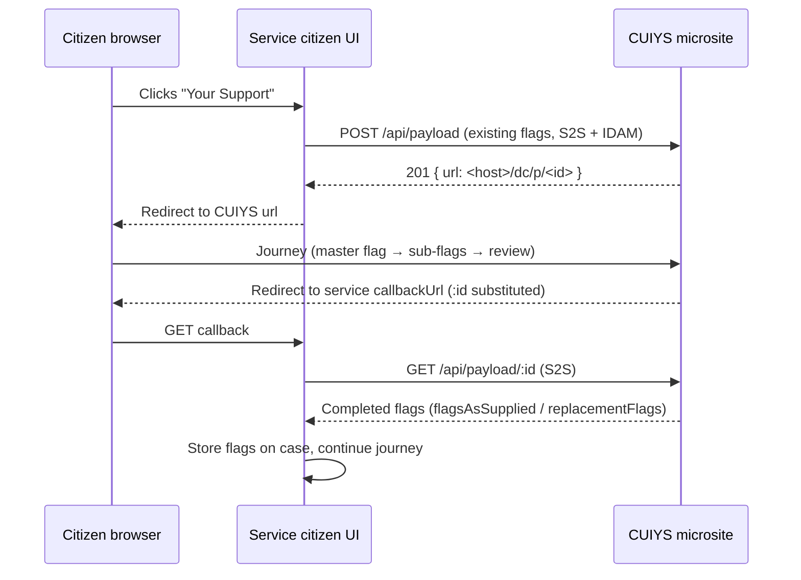

# CUIYS Overview

**CUIYS** ("CUI Your Support") is a shared HMCTS **microsite** that lets citizens
request, view and update the support they need for their case. Today it covers
**Reasonable Adjustments** (RAs); special measures and other "your support"
categories are planned. The repo and S2S microservice are named `cui-ra` /
`cui_ra` — a legacy of its original name, **CUIRA** (Citizen UI Reasonable
Adjustments). Treat "CUIRA" in older Confluence pages as "CUIYS".

## Why it exists

Reasonable Adjustments are things a party may need to attend a hearing — large-print
documents, a sign-language interpreter, a hearing loop, bringing a support person,
and so on. HMCTS records these as **CCD Case Flags (v2.1)** on each party, with the
available adjustments held in **reference data**.

Adjustments can be requested two ways:

- Caseworkers and solicitors request them through **EXUI Manage Case**.
- Citizens request them through their service's **citizen UI**, which hands off to
  CUIYS.

Rather than every service team building the RA capture journey itself, CUIYS
provides it **once** as a common component. A service redirects the citizen's
browser into CUIYS, the citizen makes their selections, and CUIYS redirects back
with the resulting flags for the service to store on the case.

## The integration model

CUIYS is a **redirect-and-callback** integration, not an embedded library:

1. When the citizen chooses to manage their support, the service `POST`s the flags
   it already holds to CUIYS and receives a one-time URL.
2. The service redirects the browser to that URL. The citizen completes the CUIYS
   journey.
3. CUIYS redirects the browser back to the service's `callbackUrl`.
4. The service `GET`s the completed flags and writes them to the case (via CCD
   manage-flag / create-flag events), then continues its own journey.

The wire contract — endpoints, headers, payload schema, environments — is in the
[Payload API reference](../reference/payload-api.md). The service-side steps are
in [Onboard a service to CUIYS](../how-to/onboard-a-service.md).

## The citizen journey

CUIYS runs one of two journeys depending on whether the citizen has requested
adjustments before.

**First submission.** The service shows its own *"Tell us if you need support"*
interstitial; *Start now* enters the microsite:

1. **Master parent flag page** — "Do you have a … disability or health condition
   that means you need support during your case?" The service configures which
   flags appear. The citizen selects any that apply.
2. **Non-master parent flag pages** — one per category selected, shown
   alphabetically, each offering the specific adjustments in that category.
3. **Sub-type pages** — for adjustments with sub-types (e.g. hearing enhancement,
   sign-language interpreter). The presentation depends on list size
   (`builders/formBuilder.ts`): **1–9 sub-types render as radio buttons; 10 or
   more render as an accessible type-ahead dropdown** (threshold `10`,
   `config/default.json`).
4. **Review page** — the citizen can change a request, add a new one, submit, or
   cancel. Submit sends the payload back to the service; cancel discards
   everything.

**Subsequent submission.** The citizen is shown their existing adjustments and
their statuses. *Change my support options* re-enters the journey above; on the
review page they can additionally mark items *"I no longer need this"* /
*"I still need this"* to toggle them between requested and no-longer-needed.

Validation rules enforced in the journey: continuing with nothing selected is an
error, and ticking a box that has an associated free-text field without filling it
in is an error.

## What a service owns vs what CUIYS owns

| Owned by the onboarding service | Owned by CUIYS |
|---|---|
| Case Flags v2.1 on the case, plus RA reference data | The capture/amend journey and all its screens |
| The *"Your Support"* interstitial and the callback screen | Rendering flags, sub-types, Welsh, the review page |
| Storing returned flags on the case (CCD events) | Session, 1-hour payload cache, redirect handling |
| Service-specific footer HTML, privacy/T&C links, flag hint JSON (supplied to CUIYS via tickets) | Applying that configuration |

## Prerequisites and relationships

- A service **must already be on Case Flags v2.1** before onboarding — CUIYS reads
  and writes flags, it does not introduce them. See the RCCD
  [Case Flags v2.1 How-To](https://tools.hmcts.net/confluence/spaces/RCCD/pages/1702505636/How+To+Guide+-+Case+Flags+v2.1).
- CUIYS reads available flags from **`rd-commondata-api`** reference data using the
  citizen's IDAM token.
- Known integrating services (S2S allowlist): `prl_citizen_frontend`,
  `pcs_frontend` (extendable via `S2S_ALLOWED_SERVICES`).

## See also

- [Payload API reference](../reference/payload-api.md)
- [Onboard a service to CUIYS](../how-to/onboard-a-service.md)
