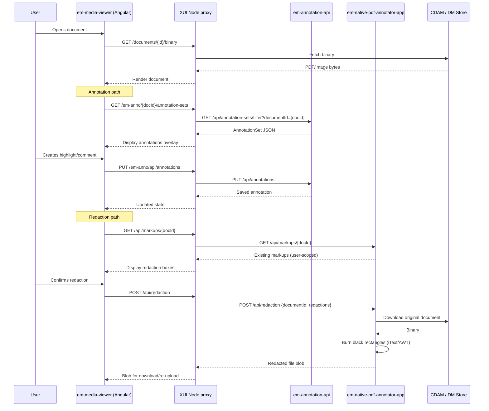

## TL;DR

- Annotations (highlights, comments, bookmarks) and redactions are two distinct flows sharing the same frontend — `em-media-viewer` — but backed by different APIs.
- `em-media-viewer` renders the document (PDF.js for PDFs, `` for images), provides the annotation/redaction overlays using absolutely positioned DIVs, and makes relative HTTP calls that the consuming app proxies to backend services.
- Annotation persistence uses `em-annotation-api` (proxied at `/em-anno`); the data model is one `AnnotationSet` per (user, document), containing `Annotation` entities with `Comment` and `Rectangle` children. Supported annotation types: `AREA`, `HIGHLIGHT`, `POINT`, `TEXTBOX`.
- Redaction persistence uses `em-native-pdf-annotator-app` at `/api/markups`; final irreversible burning of redactions calls `POST /api/redaction` which downloads the source document, draws black rectangles, and returns the modified file.
- All annotation/redaction data is user-scoped — each user sees only their own markups until the redaction is applied and the document is replaced. A planned Access Management integration for annotation sharing exists in Confluence design docs but is not yet implemented.
- The coordinate system differs: PDFs use a `0.75 * pixel` conversion from screen space to PDF points; images use pixel values directly.

## Architecture overview



## Annotation path in detail

### Frontend: em-media-viewer

The Angular library (`@hmcts/media-viewer`, selector `mv-media-viewer`) renders documents and provides the annotation UI. The annotation overlay uses **absolutely positioned DIVs** (not HTML5 Canvas) layered on top of the PDF.js or `` rendering. Two interaction modes exist: **text mode** (text highlighting) and **draw mode** (shape/area highlighting, with touch support via Hammer.js).

Key inputs that control annotation behaviour:

| Input | Type | Effect |
|-------|------|--------|
| `url` | `string` | Document URL (required) — typically from HMCTS Doc Store |
| `contentType` | `string` | `'pdf'`, `'image'`, or multimedia types — selects viewer strategy |
| `enableAnnotations` | `boolean` | Enables annotation overlays and toolbar buttons |
| `annotationApiUrl` | `string` | Overrides default `/em-anno` proxy path |
| `enableRedactions` | `boolean` | Enables redaction overlays and redaction toolbar |
| `enableRedactSearch` | `boolean` | Enables the redact-by-text-search toolbar |
| `enableICP` | `boolean` | Enables In-Court Presentation session controls |
| `caseId` | `string` | Case ID passed to redaction API for audit |
| `showToolbar` | `boolean` | Show/hide the default toolbar (default: `true`) |
| `toolbarButtonOverrides` | `object` | Toggle individual toolbar buttons on/off |
| `downloadFileName` | `string` | Custom filename for downloads |

Output events: `mediaLoadStatus` (SUCCESS/FAILURE/UNSUPPORTED), `viewerException`, `toolbarEventsOutput`, `unsavedChanges`.

When `enableAnnotations=true` and the document URL changes, the component dispatches a `LoadAnnotationSet(documentId)` NgRx action. The corresponding effect calls `GET /em-anno/{documentId}/annotation-sets` to fetch the current user's annotation set (`media-viewer.component.ts:158`).

The `documentId` is extracted from the document URL by stripping `/documents/`, `/documentsv2/`, and `/binary` path segments (`media-viewer.component.ts:255-259`).

### Backend: em-annotation-api

`em-annotation-api` is a Spring Boot service backed by PostgreSQL (database `emannotationapp`). Its own S2S microservice name is `em_annotation_app`. Authentication requires both an IDAM JWT and an S2S token (whitelisted services: `em_gw`, `xui_webapp` — `application.yaml:115`). A separate deletion endpoint whitelist allows `em_gw`, `dm_store`.

**Domain model:**

| Entity | Role | Key constraint |
|--------|------|----------------|
| `AnnotationSet` | Root aggregate; one per (user, document) | `UNIQUE(created_by, document_id)` — `AnnotationSet.java:21` |
| `Annotation` | Individual annotation (highlight, comment area) | FK to `AnnotationSet`; holds `annotationType`, `page`, `color` — `Annotation.java:28-69` |
| `Comment` | Text content on an annotation | Max 5000 chars — `Comment.java:28` |
| `Rectangle` | Bounding box coordinates | `x, y, width, height` as `Double` — `Rectangle.java:27-37` |
| `Bookmark` | Named page bookmark (independent of annotations) | Linked to `document_id` directly; tree structure via `parent`/`previous` — `Bookmark.java:19-50` |
| `Tag` | User-scoped label on annotations | Composite PK `(name, created_by)` — `Tag.java:16-28` |

**Key endpoints:**

| Method | Path | Behaviour |
|--------|------|-----------|
| `GET` | `/api/annotation-sets/filter?documentId={id}` | Returns the calling user's annotation set for that document (user-scoped) — `FilterAnnotationSet.java:56` |
| `POST` | `/api/annotation-sets` | Creates a new annotation set (caller must supply UUID `id` in body) — `AnnotationSetResource.java:90` |
| `PUT` | `/api/annotations` | Creates/updates an annotation; also calls `CcdService.buildCommentHeader()` — `AnnotationResource.java:94-95` |
| `GET` | `/{documentId}/bookmarks` | Lists bookmarks for the document (user-scoped) — `BookmarkResource.java:219` |

User-scoping is enforced by `SecurityUtils.getCurrentUserLogin()` in the service layer — `AnnotationSetServiceImpl.java:97-99`. The `AnnotationSet` uniqueness constraint at DB level ensures a user cannot have duplicate sets for the same document.

**Comment header enrichment:** On annotation creation, `CcdService.buildCommentHeader()` fetches case data from CCD data store and extracts jurisdiction-specific fields (configured for IA, SSCS, PUBLICLAW) to populate a `commentHeader` field — `Annotation.java:68-71`, `CcdService.java:36-52`.

**Audit trail:** All entities except `Bookmark` extend `AbstractAuditingEntity` which uses Hibernate Envers (`@Audited`) to maintain a full revision history — `AbstractAuditingEntity.java:25-55`.

## Redaction path in detail

### Frontend: em-media-viewer

When `enableRedactions=true`, the media viewer dispatches `LoadRedactions(documentId)` which calls `GET /api/markups/{documentId}` via `RedactionApiService`. The user draws redaction boxes on screen using the redaction toolbar (`RedactionToolbarComponent`).

On confirming redaction, the effect posts to `POST /api/redaction` with `responseType: 'blob'` (`redaction-api.service.ts:57`). The response is a binary file blob. The `RedactSuccess` action carries the blob and filename extracted from the `Content-Disposition` header — `redaction.effects.ts:83-93`. There is no automatic re-upload to CDAM from the Angular layer; the caller (XUI) handles storage of the redacted file.

The redaction API URL is hardcoded to `/api/markups` and `/api/redaction` — unlike the annotation API URL, it cannot be overridden via an input.

### Backend: em-native-pdf-annotator-app

This Spring Boot service (S2S name `em_npa_app`) provides two capabilities:

#### 1. Markup persistence (`/api/markups`)

Stores redaction rectangle coordinates in PostgreSQL. The schema has `redaction` rows (document_id, page) and `rectangle` rows (x, y, width, height) with `ON DELETE CASCADE` — `V1__baseline_migration.sql:156-178`.

| Method | Path | Behaviour |
|--------|------|-----------|
| `POST` | `/api/markups` | Save a single redaction markup — `MarkUpResource.java:104` |
| `POST` | `/api/markups/search` | Bulk-save a set of markups — `MarkUpResource.java:146` |
| `GET` | `/api/markups/{documentId}` | Get all markups for a document (user-scoped) — `MarkUpResource.java:233` |
| `DELETE` | `/api/markups/{documentId}` | Delete all markups for a document — `MarkUpResource.java:273` |
| `DELETE` | `/api/markups/{documentId}/{redactionId}` | Delete single markup — `MarkUpResource.java:349` |

All reads and deletes are scoped to the authenticated user via `securityUtils.getCurrentUserLogin()` — `MarkUpServiceImpl.java:80`, `MarkUpServiceImpl.java:100`. A user attempting to delete another user's markup gets no error; the operation silently has no effect.

#### 2. Final redaction rendering (`POST /api/redaction`)

This is the destructive, irreversible step. The endpoint:

1. Downloads the original document from CDAM (or DM Store if `toggles.cdam_enabled=false`) — `RedactionServiceImpl.java:51`
2. Determines the file type by extension
3. For PDFs: uses iText `PdfCleanUpTool` to burn black rectangles at the specified coordinates — `PdfRedaction.java:42`
4. For images: uses Java AWT `Graphics2D.fill()` with black colour — `ImageRedaction.java:27`
5. Returns the redacted file as a streaming binary response with `Content-Disposition: attachment`

The endpoint does **not** re-upload the result to CDAM. The calling layer receives the blob and is responsible for persistence — `RedactionResource.java:74`.

**Coordinate conversion (PDF):** Media viewer sends pixel coordinates. The service converts to PDF points using a `0.75 * pixel` factor (`PdfRedaction.java:151`). Page rotation (0/90/180/270 degrees) is handled by swapping axes — `PdfRedaction.java:115-140`.

**Coordinate handling (images):** Pixel values are used directly — `ImageRedaction.java:32-38`.

**Error recovery (PDF):** If the initial redaction fails (corrupt PDF), the service retries once after running a repair pass (re-saves without append mode) — `PdfRedaction.java:77`.

**Request shape:**

```json
{
  "caseId": "1234567890",
  "documentId": "a1b2c3d4-...",
  "redactions": [
    {
      "redactionId": "uuid",
      "documentId": "uuid",
      "page": 1,
      "rectangles": [
        { "id": "uuid", "x": 100.0, "y": 200.0, "width": 150.0, "height": 20.0 }
      ]
    }
  ]
}
```

## Proxy configuration

The consuming frontend (typically XUI) must configure Node proxy routes for the annotation and redaction backends. Required mappings:

| Frontend path | Backend service | Notes |
|---------------|----------------|-------|
| `/em-anno/*` | `em-annotation-api` | Annotation CRUD |
| `/api/markups/*` | `em-native-pdf-annotator-app` | Redaction markup CRUD |
| `/api/redaction` | `em-native-pdf-annotator-app` | Final redaction rendering |
| `/documents/*` | DM Store / CDAM | Document binary retrieval |

## Annotation types

The `AnnotationType` enum defines the supported annotation shapes — `AnnotationType.java`:

| Type | UI behaviour |
|------|-------------|
| `AREA` | User draws a rectangle (click-and-drag) around arbitrary content — used for non-textual or mixed content |
| `HIGHLIGHT` | User selects text; the viewer creates one or more rectangles covering the selected text runs |
| `POINT` | A single coordinate marker (rarely used in current UI) |
| `TEXTBOX` | A free-form text annotation placed at a coordinate |

Note: the `annotationType` field on the `Annotation` entity is stored as a `String` in the database, not enum-constrained at the JPA layer — `Annotation.java:36`. The frontend typically sends `"highlight"` or `"area"`.

<!-- DIVERGENCE: Confluence "Annotation LLD" (303989415) lists Drawing and Strikeout as annotation types, but the source enum (AnnotationType.java) only defines AREA, HIGHLIGHT, POINT, TEXTBOX. Drawing/Strikeout came from the deprecated pdf-annotate.js library and are not supported in current code. Source wins. -->

## Metadata endpoint (rotation persistence)

`em-annotation-api` includes a `Metadata` entity that stores a per-document `rotationAngle` (integer, 0/90/180/270). This powers the "Persist Rotation" feature: when a user rotates a document, the angle is saved server-side so all users subsequently see that document in the same orientation.

| Method | Path | Behaviour |
|--------|------|-----------|
| `POST` | `/api/metadata/` | Create/save rotation angle for a document — `MetaDataResource.java:76` |
| `GET` | `/api/metadata/{documentId}` | Retrieve saved rotation angle; returns `204 No Content` if none saved — `MetaDataResource.java:115` |

The endpoint is feature-toggled via `endpoint-toggles.metadata` (default: `true`) — `application.yaml:136`.

## Document data deletion (retain and dispose)

Both `em-annotation-api` and `em-native-pdf-annotator-app` expose endpoints for bulk-deleting all annotation/markup data associated with a document. These are called by `dm-store` (Doc Disposer) during GDPR retain-and-dispose flows.

**em-annotation-api:**

| Method | Path | Behaviour |
|--------|------|-----------|
| `DELETE` | `/api/documents/{docId}/data` | Deletes all annotation sets, annotations, bookmarks, and metadata for the document — `DocumentDataResource.java:55` |

Feature-toggled via `endpoint-toggles.document-data-deletion` (default: `true`). S2S whitelist for this endpoint: `em_gw,dm_store` — `application.yaml:181`.

**em-native-pdf-annotator-app:**

| Method | Path | Behaviour |
|--------|------|-----------|
| `DELETE` | `/api/markups/document/{documentId}` | Deletes all redaction markups for the document (not user-scoped) — `MarkUpResource.java:302` |

This endpoint is guarded by a `deleteEnabled` flag; if disabled, throws `AccessDeniedException`.

The deletion is orchestrated by Doc Disposer: it calls both delete endpoints and only proceeds with document binary deletion after receiving `204` from both. Deleted IDs are logged in AppInsights for audit.

## Additional annotation-api endpoints (full surface)

Beyond the primary annotation-set and annotation CRUD, `em-annotation-api` exposes independent CRUD for sub-resources:

| Resource | Method | Path | Notes |
|----------|--------|------|-------|
| Comment | `POST` | `/api/comments` | Create comment (must reference annotation ID) |
| Comment | `PUT` | `/api/comments` | Update comment |
| Comment | `GET` | `/api/comments/{id}` | Get single comment |
| Comment | `DELETE` | `/api/comments/{id}` | Delete comment |
| Rectangle | `POST` | `/api/rectangles` | Create rectangle (must reference annotation ID) |
| Rectangle | `PUT` | `/api/rectangles` | Update rectangle |
| Rectangle | `GET` | `/api/rectangles/{id}` | Get single rectangle |
| Rectangle | `DELETE` | `/api/rectangles/{id}` | Delete rectangle |
| Tag | `GET` | `/api/tags/{createdBy}` | List tags for a user |

These are typically called internally by the media viewer during annotation CRUD operations rather than directly by consuming services.

## Access management and annotation sharing (planned)

<!-- CONFLUENCE-ONLY: not verified in source -->

Confluence design documents describe a planned integration with a central Access Management (AM/GRANTS) service to enable annotation sharing between users. The envisioned model:

| Role | Create Annotations? | Default Visibility | Can Share |
|------|--------------------:|-------------------:|----------:|
| Judge | Yes | Private | Yes |
| Legal Representation | Yes | Private | Yes |
| Case Worker | No | - | - |

The planned permission model uses UNIX-style numeric values: `0` = no access, `4` = read-only, `6` = read/write. Sharing would be at the annotation level (not individual comment level in MVP).

**Current state:** This AM integration is **not implemented**. Annotations remain strictly user-scoped — only the creator can see their own annotations. The `em-annotation-api` enforces this via `SecurityUtils.getCurrentUserLogin()` in the service layer. The design is documented in Confluence page "Annotation Access Management" (1122501633) for future reference.

## Redaction toolbar UX

The redaction secondary toolbar (visible when `enableRedactions=true`) provides:

| Tool | Action |
|------|--------|
| Draw a box | Draw rectangle around content; translucent yellow during drawing, red border once placed |
| Redact text | Select text for redaction (highlight-style selection) |
| Unmark all | Remove all redaction markings from the document |
| Preview | Overlay marked content in solid black to preview the final result |
| Save (apply) | Calls `POST /api/redaction`, downloads the redacted file |

The `enableRedactSearch` input (default: `false`) adds a text-search-based redaction tool that finds and marks all occurrences of a search term — `media-viewer.component.ts:91`.

## Key differences between annotation and redaction

| Aspect | Annotation | Redaction |
|--------|-----------|-----------|
| Backend service | `em-annotation-api` | `em-native-pdf-annotator-app` |
| Data model | `AnnotationSet` → `Annotation` → `Comment`/`Rectangle` | `Redaction` → `Rectangle` |
| Persistence scope | User-scoped; visible only to author | User-scoped markups; rendered redaction replaces document for all |
| Destructive? | No — overlays only | Yes — `POST /api/redaction` permanently obscures content |
| Coordinate system | Stored in screen-space pixels | Stored in pixels; converted to PDF points server-side |
| ID generation | Caller must supply UUID | Caller must supply UUID |
| CDAM interaction | None (references document by URL) | Downloads source document for rendering |
| Deletion endpoint | `DELETE /api/documents/{docId}/data` | `DELETE /api/markups/document/{documentId}` |

## Examples

### Annotation entity (domain model)

The `Annotation` JPA entity stores annotation type, page, colour, and coordinates. `annotationType` is a plain `String` column (not enum-constrained) so the frontend can send values beyond the `AnnotationType` enum without a server-side failure.

```java
// Source: apps/em/em-annotation-api/src/main/java/uk/gov/hmcts/reform/em/annotation/domain/Annotation.java
@Entity
@Table(name = "annotation")
public class Annotation extends AbstractAuditingEntity implements Serializable {

    @Id
    private UUID id;

    @Column(name = "annotation_type")
    private String annotationType;   // stored as String, not enum

    @Column(name = "page")
    private Integer page;

    @Column(name = "color")
    private String color;

    @OneToMany(mappedBy = "annotation", cascade = CascadeType.ALL, orphanRemoval = true)
    private Set<Comment> comments = new HashSet<>();

    @ManyToMany(fetch = FetchType.EAGER, cascade = CascadeType.PERSIST)
    @JoinTable(
        name = "annotation_tags",
        joinColumns = @JoinColumn(name = "annotation_id"),
        inverseJoinColumns = {
            @JoinColumn(name = "name", referencedColumnName = "name"),
            @JoinColumn(name = "createdBy", referencedColumnName = "created_by")
        })
    private Set<Tag> tags = new LinkedHashSet<>();

    @OneToMany(mappedBy = "annotation", cascade = CascadeType.ALL, orphanRemoval = true)
    private Set<Rectangle> rectangles = new HashSet<>();

    @ManyToOne
    @JsonIgnoreProperties("annotations")
    private AnnotationSet annotationSet;

    @Column(name = "case_id")
    private String caseId;

    @Column(name = "jurisdiction")
    private String jurisdiction;

    @Column(name = "comment_header")
    private String commentHeader;
    // ...
}
```

## See also

- [Add Annotations](../how-to/add-annotations.md) — step-by-step instructions for calling `em-annotation-api` to create annotation sets, annotations, bookmarks, and metadata
- [API: Annotation](../reference/api-annotation.md) — full endpoint reference for `em-annotation-api`, including all CRUD paths, field constraints, and known status-code inconsistencies
- [Media Viewer](media-viewer.md) — the Angular library that renders annotation and redaction overlays and calls the backend services via proxy routes
- [Embed Media Viewer](../how-to/embed-media-viewer.md) — how to configure the `enableAnnotations` and `enableRedactions` inputs and proxy the required backend routes
