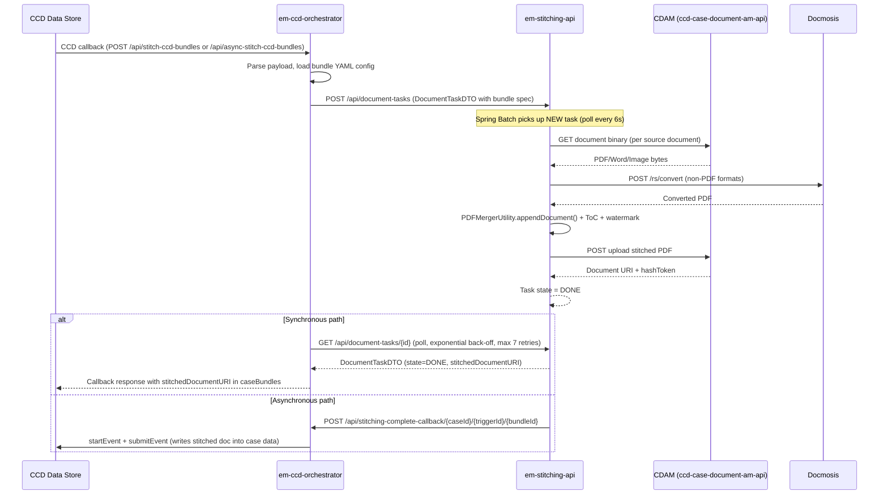
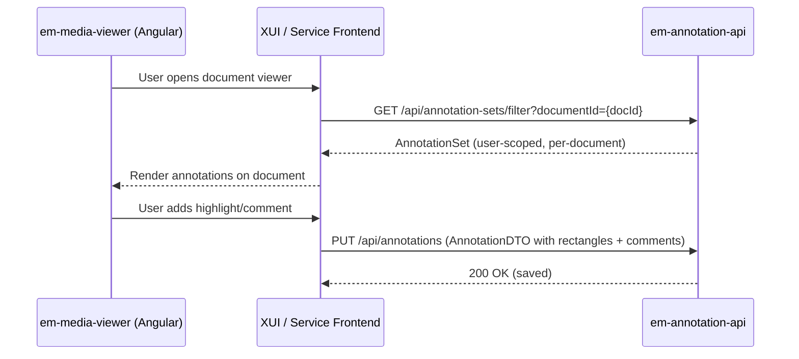
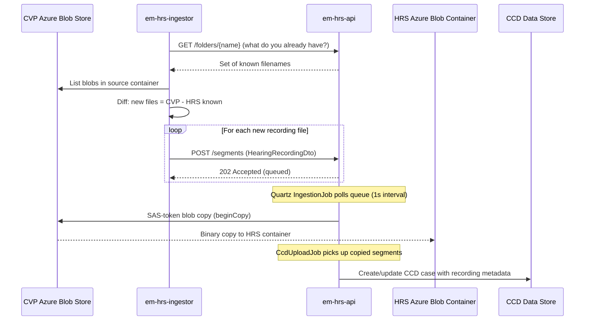

## TL;DR

- Evidence Management (EM) is 9 repos providing document stitching/bundling, annotation/redaction, in-court presentation, and hearing recording ingest/playback.
- The primary flow is CCD callback to `em-ccd-orchestrator` to `em-stitching-api` to CDAM — producing a merged PDF bundle stored as a case document. CCD's 10-second callback timeout constrains synchronous stitching; the async path exists for larger bundles.
- The orchestrator exposes 4 callback endpoints: synchronous stitch, asynchronous stitch, new-bundle (async without polling), and clone-bundle.
- Annotation is a separate path: `em-media-viewer` (Angular) calls `em-annotation-api` (Spring Boot + PostgreSQL) for per-user, per-document highlights and comments. A separate metadata endpoint and tag system support document-level metadata.
- Hearing recordings flow from CVP/VH Azure Blob Store through `em-hrs-ingestor` into `em-hrs-api`, which copies blobs and registers metadata in CCD.
- All Java services authenticate via IDAM OAuth2 JWT + S2S tokens; databases are PostgreSQL with Flyway; local dev uses `rse-cft-lib` (`bootWithCCD`).

## Service inventory

| Repo | Role | Port | Database | S2S name |
|------|------|------|----------|----------|
| `em-ccd-orchestrator` | CCD callback mediator; triggers stitching, clones bundles, writes stitched doc back to CCD | 8080 | None (stateless) | `em_ccd_orchestrator` |
| `em-stitching-api` | Async PDF merge engine (PDFBox + Docmosis); Spring Batch job processor | 4630 | PostgreSQL (`emstitch`) | `em_stitching_api` |
| `em-annotation-api` | Annotation/bookmark CRUD for documents; user-scoped | 8080 | PostgreSQL (`emannotationapp`) | `em_annotation_app` |
| `em-native-pdf-annotator-app` | Native PDF redaction markups and final rendering | 8080 | PostgreSQL | `em_npa_app` |
| `em-hrs-api` | Hearing recording metadata, blob storage, download, and reporting | 8080 | PostgreSQL (`emhrs`) | `em_hrs_api` |
| `em-hrs-ingestor` | Polls CVP blob store; submits new recordings to `em-hrs-api` | N/A (batch) | None | `em_hrs_ingestor` |
| `em-icp-api` | In-Court Presentation session management (Node/TypeScript) | 8080 | Redis + Azure Web PubSub | N/A |
| `em-media-viewer` | Angular library for document rendering (PDF, images, annotations, ICP) | N/A (NPM package) | None | N/A |
| `em-test-helper` | Shared test helper library (IDAM/S2S/CCD utilities) | N/A (library) | None | N/A |

## Document stitching flow

The primary consumer-facing flow assembles multiple case documents into a single PDF bundle.

### Key mechanics

**Orchestrator** (`em-ccd-orchestrator`):
- All inbound CCD callbacks route through `DefaultUpdateCaller.executeUpdate()` which parses the `caseBundles` field from case data (`DefaultUpdateCaller.java:51`).
- Four callback endpoints serve different use cases:
  - `POST /api/stitch-ccd-bundles` — synchronous: orchestrator polls stitching-api until done, then returns result in the CCD callback response.
  - `POST /api/async-stitch-ccd-bundles` — asynchronous: creates the task and returns immediately; stitching-api calls back via the completion endpoint when done.
  - `POST /api/new-bundle` — asynchronous without polling: creates bundle and task, returns bundle metadata without the stitched document URL; stitching-api updates CCD directly on completion.
  - `POST /api/clone-ccd-bundles` — clones an existing bundle (prefixes title/filename with `CLONED_`), does not trigger stitching.
- Bundle configuration is loaded from YAML files packaged inside the JAR under `bundleconfiguration/` (26+ jurisdiction-specific configs). The config filename is read from `case_data.bundleConfiguration` or `case_data.multiBundleConfiguration`.
- In async mode, a callback URL is constructed via `CallbackUrlCreator` using `CALLBACK_DOMAIN` (the orchestrator's own internal hostname) so stitching-api can POST back on completion.
- On failure, a GOV.UK Notify email is sent to the user (if `enableEmailNotification: true` in the bundle config).

**CCD callback timeout constraint**:
- CCD imposes a 10-second timeout on all callbacks, with up to 3 retries (each also subject to 10 seconds). The only configuration option is to disable retries, leaving a single 10-second window.
- Synchronous stitching of a single small bundle typically completes in 5-11 seconds (first task may hit a ~6-second batch poll delay; subsequent tasks benefit from a warm executor).
- For multi-bundle scenarios, consumer services are advised to call the orchestrator concurrently or use the async path to avoid exceeding the timeout.
<!-- CONFLUENCE-ONLY: CCD 10-second callback timeout and retry behaviour from "Addressing CCD timeouts when stitching multiple documents" - not verified in source -->

**Stitching engine** (`em-stitching-api`):
- Tasks are persisted to `versioned_document_task` in PostgreSQL. A Spring Batch job polls every 6 seconds (`spring.batch.document-task-milliseconds: 6000`) with chunk size 5 and pessimistic write locking.
- Task state lifecycle: `NEW` -> `IN_PROGRESS` -> `DONE` | `FAILED` (enum `TaskState`). The stitching-api also tracks `CallbackState` (`NEW`, `SUCCESS`, `FAILURE`) for async completion notification.
- Documents are routed to CDAM when both `caseTypeId` and `jurisdictionId` are populated on the task; otherwise the legacy DM Store path is used (`DocumentTaskItemProcessor.java:110-113`).
- Non-PDF formats (Word, Excel, images) are converted via Docmosis (`/rs/convert`) or PDFBox's `ImageConverter` before merge.
- Versioned tasks enable zero-downtime deployments: old-version pods only pick up tasks with `version <= their build number` (`BatchConfiguration.java:218-225`).
- ShedLock prevents duplicate processing across pods (lock name from `TASK_ENV` env var, 5-minute max hold).
- The Docmosis API key is loaded from the Azure Key Vault for each environment.

## Annotation flow

### Key mechanics

- `em-annotation-api` stores annotations in PostgreSQL with a user+document uniqueness constraint (`annotation_set(created_by, document_id)`).
- The domain model is: `AnnotationSet` (1 per user per doc) contains N `Annotation` entities, each with N `Comment` and N `Rectangle` children. `Bookmark` is a separate entity tree scoped to document + user. `Tag` entities support user-defined tagging of annotations.
- Callers must supply a UUID `id` in the request body (IDs are not auto-generated).
- The `GET /api/annotation-sets/filter?documentId=` endpoint is user-scoped (uses `SecurityUtils.getCurrentUserLogin()`). The unfiltered `GET /api/annotation-sets` is paginated and not user-scoped (admin use).
- A feature-toggled **Metadata** endpoint (`/api/metadata`) allows storing document-level metadata (enabled by default via `ENABLE_METADATA_ENDPOINT`). A separate **document data deletion** endpoint supports Retain and Dispose compliance (enabled by `ENABLE_DOCUMENT_DELETE_ENDPOINT`).
- `em-native-pdf-annotator-app` handles a parallel path for redaction markups (`/api/markups`) and the final redaction rendering step (`/api/redaction`), integrating with CDAM for the redacted output document.

## Hearing recording ingest path

### Key mechanics

- `em-hrs-ingestor` is a batch poller that runs on startup, compares CVP blobs against what HRS already holds, and submits new recordings. It has no persistent state or functional tests by design.
- `em-hrs-api` accepts ingest requests onto a `LinkedBlockingQueue`; if the queue is full, HTTP 429 is returned (`HearingRecordingController.java:119`).
- Blob copy uses Azure `BlockBlobClient.beginCopy` with SAS tokens (5-minute or 95-minute expiry depending on AD auth mode). Existing non-zero-byte blobs are skipped (`HearingRecordingStorageImpl.java:147-149`).
- Download access is controlled by a custom `PermissionEvaluator`: users with `caseworker-hrs-searcher` or `caseworker-hrs` IDAM roles get unconditional access; others can access via sharee email grants (valid for 72 hours).
- Operational reports (monthly hearing, weekly, audit) are sent via SMTP, while sharee notification emails use GOV.UK Notify.
- The service runs with 4 replicas; throughput is approximately 4 recordings/second (1-second Quartz interval per pod).
- A `DELETE /delete` endpoint supports Retain and Dispose compliance for hearing recording disposal.

### Recording sources and business context

- **CVP (Cloud Video Platform)**: the original tactical recording source, with ~2000 virtual meeting rooms allocated to CFT. CVP stores recordings in Azure Blob but has no backup/archive, and file management is informal.
- **VH (Video Hearings)**: the strategic replacement for CVP; HRS supports ingestion from both sources with the same architecture. VH includes a Service ID in its file naming convention.
- Recording filenames encode metadata (hearing date, service ID, room reference) allowing HRS to extract and index without external lookup.
- The design supports VHOs (Video Hearing Officers) searching and sharing recordings with CTSC caseworkers, listing officers, and judges. Streaming is not currently supported — download only.
- Anti-virus/media scanning is explicitly out of scope (Palo Alto doesn't support media scanning; this is a platform-wide challenge).
<!-- CONFLUENCE-ONLY: CVP/VH business context and out-of-scope items from "HRS - HLD Ingestion of CVP hearing recordings" - not verified in source -->

## Cross-cutting concerns

| Concern | Approach |
|---------|----------|
| Authentication | IDAM OAuth2 JWT (resource server) on all Java services |
| Service-to-service | `service-auth-provider-java-client` S2S tokens; each service has its own S2S name and whitelist |
| Document storage | CDAM (`ccd-case-document-am-api`) for new documents; legacy DM Store path remains for tasks without `caseTypeId`/`jurisdictionId` |
| Document size limits | Video (.MP4): 500MB max; Audio (.MP3): 500MB max; all other files: 300MB max; bundle output: ~1GB practical max before timeouts |
| Database | PostgreSQL with Flyway migrations on all stateful services |
| Distributed locking | ShedLock (JDBC-backed) on `em-stitching-api` and `em-hrs-api` scheduled jobs |
| Local development | `rse-cft-lib` (`bootWithCCD` Gradle task) for annotation, stitching, NPA, and HRS services |
| Contract testing | Pact (consumer + provider) published to Pact Broker |
| Retain and Dispose | `em-annotation-api` and `em-native-pdf-annotator-app` have deletion endpoints for R&D compliance; `em-hrs-api` has `DELETE /delete` for recording disposal |

<!-- CONFLUENCE-ONLY: Document size limits (500MB video/audio, 300MB other, 1GB bundle) from "DTS - Evidence Management" - not verified in source -->

## Non-functional requirements

Design targets documented in the Bundling & Stitching HLD and EM HLD:

| Target | Value |
|--------|-------|
| Service availability | 99.95% |
| Data durability | >= 99.9999999% |
| Estimated bundles per annum | ~1.4M (based on 33% of 4.5M Reform cases going to hearings) |
| Response time (90th percentile) | 1.0 seconds (annotation/viewer interactions) |
| Data retention | 100 years (document store level) |

<!-- CONFLUENCE-ONLY: NFR targets from "Document Bundling & Stitching HLD Release v1.1" and "Evidence Management HLD" - not verified in source -->

## CCD bundle data model

Bundles are stored as CCD Complex Types within case data — CCD holds only document URIs, not the document content. The data model is:

| Complex Type | Description |
|-------------|-------------|
| `caseBundles` | Collection field on the case; holds N `Bundle` entries |
| `Bundle` | Individual bundle: title, description, stitched document URI, bundle configuration reference, stitch status, list of folders and documents |
| `Folder` | Logical grouping within a bundle; contains N `BundleDocument` entries |
| `BundleDocument` | Reference to a single source document (URI, name, sort index) |

Bundle states (tracked in `stitchStatus` on the Bundle complex type):
- **open** — bundle is being edited, documents can be added/removed
- **in-progress** — stitching is actively running
- **locked** — stitching complete, bundle is immutable

Services define these complex types in their CCD configuration spreadsheet and trigger bundling via CCD events configured as `aboutToSubmit` callbacks to the orchestrator.

<!-- CONFLUENCE-ONLY: Bundle states (open, in-progress, locked) from "Document Bundling & Stitching HLD Release v1.1" - not verified in source -->

## See also

- [Overview](overview.md) — product summary, capability areas, and service consumer table
- [Stitching and Bundling](stitching-and-bundling.md) — full detail on the bundle YAML format, Spring Batch processing pipeline, and CCD timeout constraints
- [Annotation Flow](annotation-flow.md) — annotation and redaction data models, proxy configuration, and user-scoping rules
- [Hearing Recordings](hearing-recordings.md) — CVP/VH ingest pipeline, `FilenameParser`, and HRS access control
- [API: Orchestrator](../reference/api-orchestrator.md) — `em-ccd-orchestrator` endpoint reference with request/response shapes
- [API: Stitching](../reference/api-stitching.md) — `em-stitching-api` endpoint reference and `DocumentTask` lifecycle
