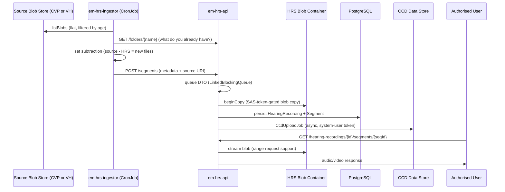

## TL;DR

- The Hearing Recording Service (HRS) pipeline moves audio/video recordings from the CVP (Court Video Platform) and VH (Video Hearings) Azure Blob Stores into managed HRS blob containers, stores metadata in PostgreSQL, and serves playback to authorised users.
- Three components: source blob store (CVP or VH) -> `em-hrs-ingestor` (batch poller, Kubernetes CronJob) -> `em-hrs-api` (metadata store, blob copy, download serving, notifications).
- Deduplication is filename-based: the ingestor queries HRS for already-known filenames per folder before submitting new ones.
- Access control is layered: S2S + IDAM JWT on all endpoints; downloads additionally require either an allowed IDAM role (`caseworker-hrs-searcher`) or a valid sharee email grant (time-limited, 72h default).
- CCD is used as a metadata/search database (not as a case management tool): each `HearingRecording` maps to one CCD "case" to allow VHOs and caseworkers to search via ExUI.
- Default recording TTL is 20 years (`P20Y`). Notification emails to sharees use GOV.UK Notify; operational reports (monthly/weekly CSV) use SMTP.

## Pipeline overview



## Blob polling (em-hrs-ingestor)

The ingestor is a one-shot Spring Boot application deployed as a Kubernetes CronJob. On `ApplicationReadyEvent`, it runs a single ingest cycle and calls `System.exit(0)` (`IngestWhenApplicationReadyListener.java:67`).

**Production scheduling**: runs on a 30-minute pattern staggered between the two production AKS clusters, scheduled for off-peak hours (9pm through to 5am). The Kubernetes CronJob uses `.spec.concurrencyPolicy=Forbid` to prevent overlapping runs. Since the two clusters are disconnected, overlaps are still theoretically possible; in practice this produces log warnings but cannot create duplicate data (filename uniqueness enforced at the database level).

**On/off switch**: the `ENABLE_CRON_JOB` flux variable controls whether the job fires; disabling is achieved by setting a non-triggerable cron schedule (31st Feb) rather than removing the CronJob resource.

**Blob discovery** uses a flat (non-hierarchical) `listBlobs` call against the source container (CVP or VH). Blobs are filtered to those created within a configurable window (`CVP_PROCESS_BACK_TO_DAY`, default 2 days) (`BlobstoreClientHelperImpl.java:67`). Folder names are extracted from the blob path (everything before the first `/`). Folders are shuffled before processing to prevent starvation of any single room (`DefaultIngestorService.java:103`).

**Batch cap**: `MAX_FILES_TO_PROCESS` (default 50) limits how many files a single run will submit. If more are pending, subsequent CronJob invocations will pick them up.

**Azure auth**: connection-string SAS by default; can switch to managed-identity (DefaultAzureCredential) via `USE_AD_AUTH_FOR_SOURCE_BLOB_CONNECTION`. In production, the pod uses the `rpa-prod-mi` managed identity with the "Storage Blob Data Reader" IAM role on the source blob store.

## Comparison and deduplication

For each discovered folder, the ingestor:

1. Calls `GET /folders/{folder}` on `em-hrs-api` to retrieve the set of filenames HRS already holds (both completed segments and in-progress jobs).
2. Performs a set subtraction: CVP filenames minus HRS filenames equals files needing ingestion (`IngestionFiltererImpl.java:16-21`).
3. Comparison is purely by **filename string** -- no hash or size check at this stage.

The HRS API returns in-progress filenames (from the `JobInProgress` table) alongside completed ones, preventing duplicate submissions for files mid-copy.

## Filename parsing and metadata extraction

CVP/VH filenames encode hearing metadata. `FilenameParser` applies four regex patterns in priority order, plus a minimal fallback (`FilenameParser.java:83-101`):

| Priority | Pattern name | Regex | Example |
|----------|-------------|-------|---------|
| 1 | RCJ with location | `^([A-Z][A-Z][A-Z]\d)-(0372|0266)-([A-Z0-9-]*)_([0-9-.]*)-([A-Z]{3})_(\d+)$` | `CVP1-0372-A3-2020-0001_2020-09-29-12.33.36.255-UTC_0` |
| 2 | Civil and Family | `^([A-Z][A-Z][A-Z]\d)-(\\d{3,4})-([A-Z0-9-]*)_([0-9-.]*)-([A-Z]{3})_(\d+)$` | `CVP1-0331-D4F6FN1K_2020-09-29-12.33.36.255-UTC_0` |
| 3 | Tribunals / RCJ without location | `^([A-Z][A-Z][A-Z]\d)-([A-Z0-9-]*)_([0-9-.]*)-([A-Z]{3})_(\d+)$` | `EEA1-ABC123_2020-09-29-12.33.36.255-UTC_0` |
| 4 | Minimal fallback | `^(.*?)_([0-9-.]*)-([A-Z]{3})_(\d+)$` | everything left of timestamp becomes caseRef |

All patterns are applied case-insensitively. The RCJ-with-location pattern fires first because it checks for specific court codes (0372 = Royal Courts of Justice Strand, 0266 = Rolls Building).

**Location code normalisation**: if 4 digits, leading zero is stripped to produce a 3-digit code (`FilenameParser.java:110-112`).

**Hearing room reference**: the folder name (blob path prefix) can have prefixes like "HMCTS", "CloudRoom", or "SAND" before the numeric room ID. Only the numeric portion is retained.
<!-- CONFLUENCE-ONLY: Folder prefix stripping detail (HMCTS/CloudRoom/SAND) from Confluence page 1468013320; not directly visible in FilenameParser source but handled in DefaultIngestorService -->

Extracted fields become the `Metadata` POST body:

| Field | Source |
|-------|--------|
| `folder` | Blob path prefix (before `/`) |
| `filename` | Full blob name |
| `sourceBlobUrl` | Blob URI |
| `recordingRef` | Derived from `uniqueIdentifier` (serviceCode + locationCode + caseID + timestamp) |
| `caseRef` | Parsed case reference |
| `segment` | Segment index (integer, from last `_` delimited group) |
| `recordingDateTime` | Parsed from filename (`yyyy-MM-dd-HH.mm.ss.SSS-TZ`) |
| `serviceCode` | 4-char code (e.g. `CVP1`, `EEA1`); null for minimal format |
| `courtLocationCode` | 3-4 digit location code; null for tribunal/minimal formats |
| `jurisdictionCode` | Derived from service code |
| `hearingRoomRef` | Parsed from folder name (numeric portion only) |
| `interpreter` | String field on the segment entity |

<!-- DIVERGENCE: Confluence (page 1468013320) says five regex patterns are applied. Source (FilenameParser.java) has four patterns: RCJ-with-location, civil/family, tribunals/RCJ-without-location (identical regex), and minimal fallback. The "tribunals" and "RCJ without location" patterns share the same regex. Source wins. -->

Files that fail all patterns throw `FilenameParsingException`, are logged, counted as `itemsIgnoredOk`, and skipped -- the batch continues (`DefaultIngestorService.java:154-173`).

## Ingest processing (em-hrs-api)

When `POST /segments` arrives at the API:

1. The DTO is offered to a `LinkedBlockingQueue`. If the queue is full, `429 Too Many Requests` is returned immediately (`HearingRecordingController.java:119`).
2. A Quartz-scheduled `IngestionJob` (fires every 1 second by default) polls one item per firing (`application.yaml:143`). With 4 replicas, throughput is approximately 4 files/second.
3. A `JobInProgress` row is created to mark the file as being processed.
4. `HearingRecordingStorageImpl.copyRecording` generates a SAS token (5-minute or 95-minute expiry depending on auth mode) and calls `BlockBlobClient.beginCopy` with polling (`HearingRecordingStorageImpl.java:176-183`).
5. If the destination blob already exists with non-zero size, the copy is skipped (`HearingRecordingStorageImpl.java:147-149`). A zero-byte blob is treated as needing re-copy.
6. On copy failure, the destination blob is deleted to avoid partial state (`HearingRecordingStorageImpl.java:218`).
7. After successful copy, the DTO is offered to a `ccdUploadQueue` for the `CcdUploadJob` to register the recording in CCD Data Store.

## Metadata storage

The PostgreSQL schema holds:

| Table | Purpose |
|-------|---------|
| `folder` | Groups recordings by room/folder name. Unique on `name` (`Folder.java:35`) |
| `hearing_recording` | Root aggregate: `id`, `recordingRef`, `caseRef`, `ccdCaseId` (unique), `hearingLocationCode`, `hearingRoomRef`, `hearingSource` (CVP/VH), `jurisdictionCode`, `serviceCode`, `ttl` (DATE), `deleted`. Composite unique constraint on `(folder_id, recordingRef)` |
| `hearing_recording_segment` | Per-file: `filename` (globally unique dedup key), `fileExtension`, `fileMd5Checksum`, `fileSizeMb` (Long), `recordingSegment`, `blobUuid`, `ingestionFileSourceUri`, `recordingLengthMins`, `mimeType`, `interpreter` (String) |
| `hearing_recording_sharee` | Access grants for email-based sharing |
| `job_in_progress` | Tracks segments currently being copied (cleaned hourly via scheduled task, TTL 1h) |
| `audit_entry` | Download/share audit trail |

<!-- DIVERGENCE: Confluence (page 1468013320) states Folder uniqueness is on (name, hearing_source). Source (Folder.java:35) shows @Column(unique = true) on name alone -- no hearing_source column on Folder. Source wins. -->

A single CCD case maps to exactly one `HearingRecording` (`ccdCaseId` unique constraint). Multi-segment hearings share one `HearingRecording` via the `segments` set. CCD is deliberately used as a searchable metadata store (not case management): the "case" is simply a container for recording data that enables ExUI wildcard search by VHOs and caseworkers.

**Hearing sources**: the `hearingSource` field distinguishes recordings by origin. The `HearingSource` enum (`HearingSource.java`) has two values: `CVP` and `VH`. Each source has its own destination blob container (`hrs-cvp-dest-blob-container-name`, `hrs-vh-dest-blob-container-name` in `application.yaml:120-121`).

Default recording TTL is 20 years (`ttl.default-ttl: P20Y`, `application.yaml:209`).

## Access control

All endpoints require both an S2S token (from the whitelist: `ccd_gw, em_gw, em_hrs_ingestor, xui_webapp, ccd, ccd_data, ccd_case_disposer`) and a valid IDAM JWT.

**Download authorisation** uses a custom `PermissionEvaluator` (`PermissionEvaluatorImpl.java:71-78`):

1. If the user holds an allowed IDAM role (`caseworker-hrs-searcher` or `caseworker-hrs`), access is granted unconditionally.
2. Otherwise, if the user's email matches a `HearingRecordingSharee` record for the requested recording AND the share has not expired, access is granted.
3. Sharee access expires after `validityInHours` (default 72 hours, `application.yaml:155`) from the `sharedOn` timestamp.
4. All denied attempts are audit-logged as `USER_DOWNLOAD_UNAUTHORIZED`.

**DELETE endpoint** has an additional S2S whitelist (`ccd_case_disposer, em_gw`) enforced by `DeleteRequestInterceptor`, plus a feature flag (`DELETE_CASE_ENDPOINT_ENABLED`, default true).

## Playback serving

Downloads are served directly from the HRS blob container with HTTP range-request support, enabling seek/scrub in audio/video players. The endpoint is `@PreAuthorize`-gated via the permission evaluator described above (`SegmentDownloadServiceImpl.java:157`). The download service resolves the correct blob container (CVP or VH) based on the `hearingSource` field of the parent `HearingRecording` entity (`SegmentDownloadServiceImpl.java:163`).

## Business context and volumetrics

HRS was developed as the strategic storage solution for CFT hearing recordings, approved by the PDG board in March 2020. CVP (Cloud Video Platform) was a tactical COVID-19 response that recorded remote hearings via Kinly-hosted virtual meeting rooms (~2000 rooms allocated to CFT). VH (Video Hearings) is the strategic replacement for CVP; both sources are ingested in parallel.

**Observed volumes** (from initial rollout, Dec 2020):

| Metric | Value |
|--------|-------|
| Daily recordings (steady state) | ~300 files |
| Peak daily volume | 35 GB from 340 files |
| Worst-case single file size | 3.09 GB (~55 hours at 56 MB/hour) |
| Target state | 6,000 half-hour recordings/day at avg 27 MB = 172 GB/day |
| Average file size | ~27 MB (half-hour recording) |

<!-- CONFLUENCE-ONLY: Volumetric figures from HLD page 1460539669. Current production volumes may differ significantly from 2020 estimates. not verified in source -->

**Data classification**: Private (per HMCTS data classification scheme).

## Notification emails

Two independent email mechanisms coexist:

### GOV.UK Notify (sharee links)

When a recording is shared via `POST /sharees`, `NotificationServiceImpl` sends an email to the sharee using GOV.UK Notify (`notifications-java-client`). Template ID: `1e10b560-4a3f-49a7-81f7-c3c6eceab455`. Personalisation keys: `case_reference`, `hearing_recording_datetime`, `hearing_recording_segment_urls` (`NotificationServiceImpl.java:59-62`). Reference format: `hrs-grant-{shareeId}`.

### SMTP operational reports

Three scheduled report types, all gated by `@ConditionalOnProperty` (disabled by default):

| Report | Schedule | Content |
|--------|----------|---------|
| Monthly hearing report | `MONTHLY_HEARING_REPORT_CRON` (default `0 0 6 ? * *`) | CSV of recordings for the month |
| Weekly hearing report | Weekly schedule | CSV of the prior week's recordings |
| Monthly audit report | Monthly schedule | CSV from `AuditReportService` (download/share audit entries) |

All report tasks use ShedLock (`scheduling.lock_at_most_for: PT10M`) to prevent duplicate execution across pods.

## Service-to-service connectivity

The following table summarises the inter-service authentication for the production deployment:

| From | To | Mechanism | Identity |
|------|-----|-----------|----------|
| em-hrs-ingestor | CVP/VH Azure Storage | "Storage Blob Data Reader" IAM role via Managed Identity | `rpa-prod-mi` |
| em-hrs-api | CVP/VH Azure Storage | "Storage Blob Data Reader" + "Storage Blob Delegator" IAM roles | `rpa-prod-mi` |
| em-hrs-ingestor | em-hrs-api | S2S OAuth (`microservicekey-em-hrs-ingestor`) | `em_hrs_ingestor` |
| em-hrs-api | CCD Data Store | IDAM system-user (`hrs-api@hmcts.net` in prod) with roles `caseworker, caseworker-hrs, caseworker-hrs-searcher` + S2S | `em_hrs_api` |
| em-hrs-api | GOV.UK Notify | API key (stored in Azure vault) | evidence management key |
| CCD (share event) | em-hrs-api | S2S (`ccd_data`) | |
| XUI proxy | em-hrs-api | S2S (`xui_webapp`) + user IDAM JWT | |

<!-- CONFLUENCE-ONLY: Production managed identity name (rpa-prod-mi) and system-user email from Confluence page 1468013320; partially confirmed by application.yaml system-user config. not verified in source -->

## Kubernetes deployment model

- **em-hrs-api**: continuously running service, 4 replicas. Internal Quartz scheduler handles async blob copy and CCD upload.
- **em-hrs-ingestor**: Kubernetes CronJob (`ENABLE_CRONJOB` toggle). ConcurrencyPolicy is `Forbid`. Runs once per invocation, sleeps 200 seconds post-completion for Application Insights telemetry flush, then exits. No REST API beyond `/health` on port 8090. Production schedule: every 30 minutes, staggered between the two AKS clusters, off-peak hours only (21:00-05:00).

## Failure handling and retry

The ingestor does not auto-recover from failures. If a run fails to execute, it raises an exception handled by Kubernetes CronJob orchestration. For individual file failures:

1. Files that fail parsing are skipped (counted in `itemsIgnoredOk`) and will be retried on the next cycle since they remain in the source container.
2. Files that fail blob copy are cleaned up (partial destination blobs deleted) and will be retried on the next cycle.
3. The methodology of processing only files not in the intersection of source and successfully-ingested means failures are automatically reattempted until the underlying problem is fixed.

On the CVP/VH side, if a file is at fault, the standard recovery is to re-save with a new version/segment number in the filename, then delete the faulty blob.

## Future: role-based access via CCD categories

An alternative access control model is under consideration (Jan 2025) that would use CCD Case Access Categories and Staff Reference Data skills to provide fine-grained, per-service sharing permissions:

- Define an HRS "service" in Staff Reference Data with skills per jurisdiction (e.g. `SKILL:HRS1:SHARE:CIVIL`)
- Set `caseAccessCategory` on each HRS case based on the recording's service (e.g. `HRS-CIVIL`)
- Use `RoleToAccessProfiles` CCD configuration to match user skills against case categories
- This would replace the current flat `caseworker-hrs-searcher` role with granular per-service authorization

<!-- CONFLUENCE-ONLY: Future access model from Confluence page 1825021794 (Jan 2025 proposal). Implementation status unknown. not verified in source -->

## Examples

### FilenameParser: regex patterns and dispatch logic

`FilenameParser` is the sole entry point for CVP/VH filename decoding. It compiles four patterns and tests them in priority order. The RCJ-with-location pattern is checked first because it has the most specific court-code constraint (`0372|0266`), preventing false positives against the broader civil/family pattern.

```java
// Source: apps/em/em-hrs-ingestor/src/main/java/uk/gov/hmcts/reform/em/hrs/ingestor/parse/FilenameParser.java
private static final String ROYAL_COURTS_OF_JUSTICE_FILE_WITH_LOCATION_FORMAT_REGEX
    = "^([A-Z][A-Z][A-Z]\\d)-(0372|0266)-([A-Z0-9-]*)_([0-9-.]*)-([A-Z]{3})_(\\d+)$";
private static final String CIVIL_AND_FAMILY_FILE_FORMAT_REGEX
    = "^([A-Z][A-Z][A-Z]\\d)-(\\d{3,4})-([A-Z0-9-]*)_([0-9-.]*)-([A-Z]{3})_(\\d+)$";
private static final String TRIBUNALS_FILE_FORMAT_REGEX
    = "^([A-Z][A-Z][A-Z]\\d)-([A-Z0-9-]*)_([0-9-.]*)-([A-Z]{3})_(\\d+)$";
private static final String MINIMAL_FORMAT_REGEX
    = "^(.*?)_([0-9-.]*)-([A-Z]{3})_(\\d+)$";

// Dispatch order: RCJ-with-location → civil/family → RCJ-without-location / tribunals → minimal
if (royalCourtsOfJusticeWithLocationMatcher.matches()) {
    return processLocationMatcher(royalCourtsOfJusticeWithLocationMatcher);
} else if (civilAndFamilyMatcher.matches()) {
    return processLocationMatcher(civilAndFamilyMatcher);
} else if (royalCourtsOfJusticeWithoutLocationMatcher.matches()) {
    return processNonLocationMatcher(royalCourtsOfJusticeWithoutLocationMatcher);
} else if (tribunalsMatcher.matches()) {
    return processNonLocationMatcher(tribunalsMatcher);
} else if (caseRefAndTimeStampOnlyFormatMatcher.matches()) {
    return processBadFormatMatcher(caseRefAndTimeStampOnlyFormatMatcher);
} else {
    throw new FilenameParsingException("Bad format");
}
```

For location-bearing patterns, a 4-digit location code has its leading zero stripped to produce a 3-digit code:

```java
// Source: apps/em/em-hrs-ingestor/src/main/java/uk/gov/hmcts/reform/em/hrs/ingestor/parse/FilenameParser.java
.locationCode(
    matcher.group(2).trim().length() == 4
    ? matcher.group(2).replaceFirst("^0*", "")
    : matcher.group(2))
```

## See also

- [API: HRS](../reference/api-hrs.md) — full `em-hrs-api` endpoint reference, domain model, filename-parsing regex patterns, TTL configuration, and role assignments
- [Architecture](architecture.md) — service inventory and HRS ingest path sequence diagram in the context of the full EM product
- [Overview](overview.md) — high-level summary of HRS access control, scheduling, and operational characteristics
- [Glossary](../reference/glossary.md#cvp-cloud-video-platform) — definitions for CVP, VH, HRS, and FilenameParser
