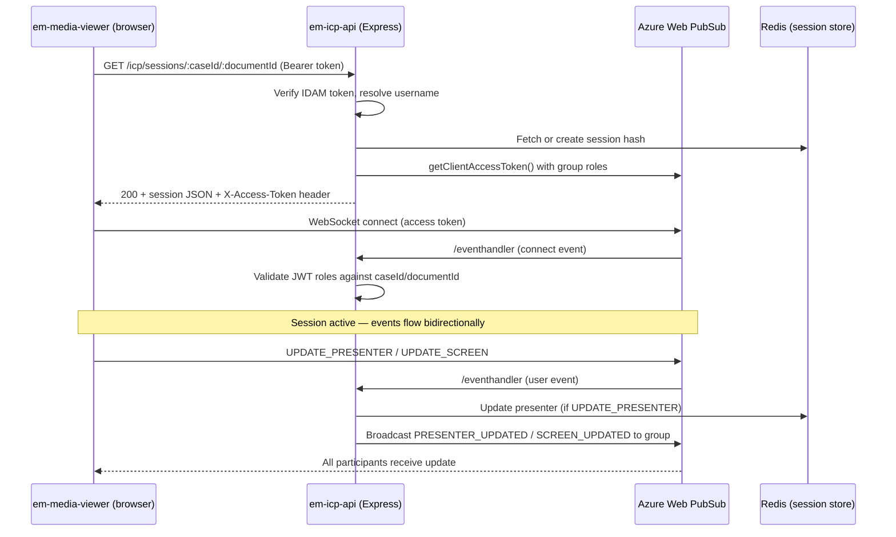

## TL;DR

- In-Court Presentation (ICP), now branded **Presenting Evidence Digitally (PED)**, is a live collaborative document-viewing feature — a presenter controls which page all session participants see simultaneously.
- Backend is `em-icp-api`, a Node.js/TypeScript Express service; the frontend lives in `em-media-viewer` (Angular). The feature is toggled on/off per consuming service (e.g. Civil, IAC) via ExUI/Case File View.
- Real-time event fan-out uses **Azure Web PubSub** (HMCTS's first use of this Azure service); session state is persisted in **Redis** hashes keyed `${caseId}--${documentId}`.
- Screen updates broadcast a `PdfPosition` payload: `{ pageNumber, scale, top, left, rotation }`.
- Sessions are scoped to a single calendar day — a new session is created if the hearing date changes.
- The repository is **archived** (no active development), but the code, infrastructure, and OpenAPI spec (`em-icp.json`) remain deployed/present.

## Business context and naming

ICP was originally developed as a **Hearing Optimisation Tool** — a common capability required across CFT Reform to allow parties in a hearing to digitally share evidence, providing a common but personalised view of bundle documents. The feature has been **rebranded to Presenting Evidence Digitally (PED)** in recent releases and infrastructure (Terraform resources use `ped_web_pubsub`, the AAT instance is named `em-ped-api-webpubsub-aat`), although the codebase still uses the `icp` naming throughout.

<!-- CONFLUENCE-ONLY: not verified in source -->
The business problem: during hearings, time is wasted as users struggle to navigate to the correct page — due to stress, different bundle versions, or simply large document sizes. ICP/PED allows all authorised users in the hearing (in-person or remote) to be "on the same page" simultaneously.

### Service demand and pilot history

| Service | Status |
|---------|--------|
| IAC (Immigration and Asylum) | Original pilot service |
| Civil | PED 1.0.0 Early Adopter (~20 users) |
| SSCS | Planned |
| Financial Remedy | Planned |
| Family Public Law & Adoption | Planned |

<!-- CONFLUENCE-ONLY: not verified in source -->
The pilot was scoped for expert users only, single-document viewing, with capacity estimates of 200 hearings/day (IAC) and 3 participants per hearing. NFR targets: 99.95% availability, p90 response under 1 second.

### Entry point for users

ICP/PED is accessed through the **Case File View (CFV)** in ExUI. The consuming application (e.g. `xui-webapp`) enables or disables the ICP feature via configuration passed to the `em-media-viewer` Angular library. When enabled, the Media Viewer toolbar displays a "Launch Presentation" button.

## Architecture overview

ICP involves three runtime components:



| Component | Technology | Purpose |
|-----------|-----------|---------|
| `em-icp-api` | Node.js / TypeScript / Express | REST session endpoint, Web PubSub event handler, Redis state management |
| Azure Web PubSub | Managed WebSocket service (Standard_S1) | Real-time event fan-out to all session participants |
| Redis | Azure Redis v6 (ioredis client) | Session state persistence (hash per session) |
| `em-media-viewer` | Angular library | UI — renders documents, sends/receives ICP events |

## Session lifecycle

### Creation and retrieval

A client calls `GET /icp/sessions/:caseId/:documentId` with an IDAM Bearer token (`sessions.ts:16`). The service verifies the token against IDAM's `/o/userinfo` endpoint and resolves the caller's username.

The session key in Redis is a composite: `${caseId}--${documentId}` (`redis-client.ts:63`). If no session exists, or the stored `dateOfHearing` does not match today's date (`new Date().toDateString()`), a fresh session is created with a `uuidv4()` identifier (`sessions.ts:57-70`). This means sessions are implicitly scoped to one calendar day — stale sessions from prior days are silently replaced.

The response includes:
- The `Session` object (JSON body): `sessionId`, `caseId`, `documentId`, `dateOfHearing`, `presenterId`, `presenterName`, `participants`, `connectionUrl`
- An `X-Access-Token` header containing a Web PubSub client access token with roles granting join/leave and send-to-group permissions for the session's group (`sessions.ts:44-45`).

### Session data model

The `Session` interface (`api/model/interfaces.ts:10-19`):

```typescript
interface Session {
  sessionId: string;      // uuidv4
  caseId: string;
  documentId: string;
  dateOfHearing: string;  // new Date().toDateString()
  presenterId: string;
  presenterName: string;
  participants: string;   // JSON: { connectionId: username, ... }
  connectionUrl: string;  // ICP_WS_URL env var
}
```

Redis stores this as a hash with one field per property. The `participants` field is a JSON-serialised object mapping Web PubSub connection IDs to usernames.

## Real-time event flow via Azure Web PubSub

Once a client has the access token, it opens a WebSocket to Azure Web PubSub. The PubSub service calls back to `em-icp-api` at `/eventhandler` for system and user events.

### Event types

The `Actions` enum (`api/model/actions.ts:1-13`) defines 11 named events. The most important:

| Action | Direction | Effect |
|--------|-----------|--------|
| `SESSION_JOIN` | Client to server | Adds participant to Redis, adds connection to group, sends `CLIENT_JOINED` back with current presenter state |
| `UPDATE_PRESENTER` | Client to server | Updates `presenterId`/`presenterName` in Redis, broadcasts `PRESENTER_UPDATED` to group |
| `UPDATE_SCREEN` | Client to server | Broadcasts `SCREEN_UPDATED` to group (page/document change) — **not** persisted to Redis |
| `REMOVE_PARTICIPANT` | Client to server | Removes a participant by connectionId from the group |
| `SESSION_LEAVE` | Client to server | Logs to AppInsights only — actual cleanup happens on disconnect |

### Connection authorisation

The `handleConnect` callback (`em-web-pub-event-handler-options.ts:20-36`) validates that the connecting user's JWT contains the required `webpubsub.joinLeaveGroup.${caseId}--${documentId}` role. This role was embedded in the access token issued at session-GET time — no further IDAM call occurs during the WebSocket lifetime.

### Disconnect handling

When a participant's WebSocket drops unexpectedly, Azure Web PubSub fires a `disconnected` system event. The `onDisconnected` handler (`em-web-pub-event-handler-options.ts:87-95`) retrieves the connection's stored state (caseId, documentId, username) and calls `onRemoveParticant()` to remove them from the participants map. If the disconnected user was the presenter, the presenter is cleared by calling `onUpdatePresenter` with empty values.

## Presenter control

The core ICP concept is **presenter control**: one participant at a time acts as presenter, and their screen state is broadcast to all others.

1. A client sends an `UPDATE_PRESENTER` user event with a `PresenterUpdate` payload: `{ caseId, documentId, sessionId, presenterId, presenterName }` (`interfaces.ts:21-27`).
2. The server acquires a Redis WATCH lock (optimistic concurrency) on the session key (`redis-client.ts:21`).
3. `presenterId` and `presenterName` are written to the session hash via `multi().hset()...exec()` (`em-web-pub-event-handler-options.ts:143-151`).
4. `PRESENTER_UPDATED` is broadcast to the group with `{ id, username }`.
5. Late joiners receive the current presenter identity via the `CLIENT_JOINED` payload sent on `SESSION_JOIN` (`em-web-pub-event-handler-options.ts:117-122`).

Screen updates (`UPDATE_SCREEN`) are broadcast-only — they are not persisted. However, source code shows that when a new participant joins (`NEW_PARTICIPANT_JOINED` event), the presenter service automatically re-sends the current `PdfPosition` and presenter identity (`icp-presenter.service.ts:57-59`), ensuring late joiners receive the current state immediately.

### Screen update payload

The `UPDATE_SCREEN` event carries an `IcpScreenUpdate` object containing a `PdfPosition` (`em-media-viewer:store/reducers/document.reducer.ts`):

```typescript
interface PdfPosition {
  pageNumber: number;  // current page
  scale: number;       // zoom level
  top: number;         // scroll position Y
  left: number;        // scroll position X
  rotation: number;    // 0, 90, 180, or 270 degrees
}

interface IcpScreenUpdate {
  pdfPosition: PdfPosition;
  document: string;    // document identifier (for future multi-doc navigation)
}
```

The presenter subscribes to the NgRx store's `getPdfPosition` selector and emits an `UPDATE_SCREEN` event on every position change. Each user can zoom independently — zoom state is local and not broadcast.

<!-- DIVERGENCE: Confluence LLD says "limit of 2 messages a second passed to the web socket server to prevent flooding", but neither em-icp-api nor em-media-viewer source contains any WebSocket message throttle. The only rate limiting is express-rate-limit on the REST /icp/sessions endpoint (10 requests per 15-second window, config/default.yaml). Source wins. -->

## User flow

The end-to-end ICP flow from the user's perspective (confirmed across Confluence LLD and source code):

1. User logs into ExUI and navigates to a case
2. User opens a document via Case File View — the document loads in `em-media-viewer`
3. If the consuming application has ICP enabled, a **"Launch Presentation"** button appears in the toolbar
4. User clicks "Launch Presentation" — the frontend calls `GET /icp/sessions/:caseId/:documentId` to get or create a session
5. An ICP sub-toolbar appears showing: current presenter name (or "waiting for presenter"), a Present/Stop button, and a Leave button
6. If no one is presenting, any user can click "Present" to become the presenter
7. The presenter navigates through the document; their position (page, scroll, rotation) is broadcast to all followers
8. Followers see their screen auto-update to match the presenter's position
9. A follower can navigate independently at any time — they will snap back to the presenter's view on the next position update
10. The presenter can click "Stop Presenting" to relinquish the role; if they close their browser, the role is also released (`checkIfConnectionIsPrenseterAndRemove`)
11. Users can leave the session at any time; the WebSocket room is cleaned up by Azure Web PubSub when all connections disconnect

### What is **not** shared

- Annotations and comments remain private — each user sees only their own markup during an ICP session
- Zoom level is per-user — each participant can zoom independently without affecting others
- Only the presenter's navigation (page, scroll position, rotation) is broadcast

## WebSocket protocol

The media viewer connects to Azure Web PubSub using the `json.webpubsub.azure.v1` subprotocol (`socket.service.ts:135`). Messages are sent as JSON with the shape:

```json
{
  "type": "event",
  "event": "<IcpEvents enum value>",
  "data": { ... }
}
```

Connection parameters are passed as query strings on the WebSocket URL: `?access_token=<token>&sessionId=<id>&caseId=<id>&documentId=<id>`.

The server-side event handler (`/eventhandler`) validates the connection by checking that the JWT's role claims include `webpubsub.joinLeaveGroup.${caseId}--${documentId}` matching the query parameters. The caseId and documentId are read from `connectRequest.queries` (not from the JWT body).

## REST rate limiting

The `/icp/sessions` endpoint is protected by `express-rate-limit`:

| Setting | Default value | Source |
|---------|---------------|--------|
| Window | 15,000 ms (15 seconds) | `config/default.yaml` |
| Max requests per window | 10 | `config/default.yaml` |

Health check endpoints (`/health`) are not rate-limited (the limiter is mounted only on `/icp/sessions` at `app.ts:83`).

## Infrastructure

| Resource | Detail |
|----------|--------|
| Azure Web PubSub | Resource name: `em-icp-webpubsub-${env}` (Terraform: `ped_web_pubsub`). SKU `Standard_S1`, capacity 1, private endpoint on `cft-${env}-vnet`, `public_network_access_enabled = false`. Live trace enabled with messaging logs. (`main.tf:135-153`) |
| Hub name | Terraform defines `"hub"` (lowercase, `main.tf:186`); code uses `"Hub"` in service client constructor — see gotchas |
| Event handler URL | `https://em-icp.${env}.platform.hmcts.net/eventhandler` (prod omits env segment). Handles events: `connect`, `connected`, `disconnected`, plus `*` user events (`main.tf:34,188-191`) |
| Connection string | Key Vault secret `em-icp-web-pubsub-primary-connection-string` (`main.tf:199-203`) |
| Redis | v6 via `cnp-module-redis`, product name `em-icp-redis-cache`, deployed to `core-infra-subnet-1-${env}` with private endpoint enabled (`main.tf:111-133`) |
| Redis password | Key Vault secret `redis-password` |
| Private endpoint | Subnet: `private-endpoints` in `cft-${env}-vnet` (separate subscription for VNet provider, `main.tf:155-168`) |
| App Insights | Shared EM instance: `em-${env}` in resource group `rpa-${env}` |

## Known issues and gotchas

- **No Redis TTL**: session keys are never expired. Old sessions accumulate indefinitely — they are only replaced when a request arrives for the same caseId/documentId on a new day.
- **Hub name case mismatch**: `sessions.ts:44` and `app.ts:68` use `"Hub"` when creating the `WebPubSubServiceClient`, but `app.ts:70` uses `"hub"` for the `WebPubSubEventHandler` registration, and `infrastructure/main.tf:186` defines the hub as `"hub"` (lowercase). Azure Web PubSub hub names are case-sensitive — this inconsistency between the service client (`"Hub"`) and the Terraform-provisioned hub (`"hub"`) could cause token/group mismatches in some configurations.
- **No authorisation on REMOVE_PARTICIPANT**: any group member can remove any other participant by connection ID — there is no check that only a judge or presenter may eject participants (`em-web-pub-event-handler-options.ts`).
- **Screen state not persisted**: `UPDATE_SCREEN` is broadcast only. Late joiners must wait for the next screen update or rely on client-side reconciliation.
- **Optimistic locking without retry**: `getLock()` issues a Redis `WATCH` but the code does not retry on transaction failure — concurrent presenter updates may silently fail (`redis-client.ts:22-28`).
- **S2S not implemented**: config blocks for S2S exist but no runtime code path uses service-to-service tokens.
- **All functional tests commented out**: both `test/functional/sessions.test.ts` and `test/functional/socket.test.ts` contain no active assertions.
- **Anonymous connections enabled**: `infrastructure/main.tf:193` sets `anonymous_connections_enabled = true` on the Web PubSub hub, which may be more permissive than intended for production — though the `handleConnect` callback still validates JWT roles.
- **Stale connection cleanup on join**: the `onJoin` handler iterates all existing participants and calls `client.connectionExists()` for each, removing stale entries (`em-web-pub-event-handler-options.ts:129-138`). This is an O(n) network call per participant and could add latency to joins in larger sessions.

## Security

<!-- CONFLUENCE-ONLY: not verified in source -->
An ITHC (IT Health Check) was performed on PED from 24-28 February 2025. Six vulnerabilities were identified: 2 Medium, 2 Low, 2 Informational. None were deemed blockers for release. The remaining vulnerabilities are tracked by the project team.

Authentication layers:
1. **IDAM token verification** — the REST endpoint verifies the Bearer token against IDAM's `/o/userinfo` before issuing a session (`sessions.ts:24`)
2. **Web PubSub access token** — scoped roles (`webpubsub.joinLeaveGroup`, `webpubsub.sendToGroup`) embedded in the token at session-GET time
3. **Connection validation** — the `/eventhandler` connect callback checks JWT role claims match the requested caseId/documentId

There is no S2S (service-to-service) token validation at runtime, despite config blocks existing for it.

## Architectural decision: Azure Web PubSub over SignalR

The HLD documents the rationale for choosing Azure Web PubSub over Azure SignalR:

- **Scalability**: Web PubSub handles higher concurrent connections and messages with lower latency
- **Native WebSocket**: Web PubSub supports native WebSocket protocol directly (the `json.webpubsub.azure.v1` subprotocol), avoiding the need for a SignalR SDK
- **Custom routing**: more flexibility with custom event routing and message handling
- **SSL termination**: handled by the Azure Web PubSub service, reducing backend complexity

<!-- CONFLUENCE-ONLY: not verified in source -->

## Local development

The ICP API runs locally with:

```bash
yarn start  # starts Express on http://localhost:8080
```

For Azure Web PubSub integration locally, a reverse proxy (ngrok) is required because the PubSub service needs to reach the event handler endpoint:

1. Start ngrok: `ngrok http http://localhost:8080`
2. In Azure Portal, navigate to the `em-ped-api-webpubsub-aat` instance > Settings > Hub > edit the event handler URL to the ngrok forwarding URL
3. Update `em-showcase` (or the consuming app) config to point at the ngrok URL for ICP
4. Run `yarn setup` to refresh the dist folder

This is required because Azure Web PubSub calls back to the `/eventhandler` path on system and user events — it cannot reach `localhost` directly.

## Archived status

The repository README states: "Archieving this repo for time been to update the Delivery Report on grafana" (sic). Despite the "archived" label, recent Confluence activity (June 2025 local-setup guide, 2025 release IA for PED 1.0.0) indicates the feature is actively being deployed for Civil. The code remains functionally complete, the OpenAPI spec is still published to `cnp-api-docs`, and the Azure infrastructure (Web PubSub, Redis, App Service) remains provisioned.

## Examples

### Session creation endpoint (sessions.ts)

The single REST endpoint on `em-icp-api`. It verifies the IDAM token, creates or reuses a Redis session keyed by `${caseId}--${documentId}`, issues a Web PubSub access token with scoped group roles, and returns the session JSON plus the token in the `X-Access-Token` response header.

```typescript
// Source: apps/em/em-icp-api/api/routes/sessions.ts
router.get("/icp/sessions/:caseId/:documentId", async (req, res) => {
  const token = req.header("Authorization");
  if (!token) {
    return res.status(401).send({ error: "Unauthorized user" });
  }

  await idam.verifyToken(token);
  const userInfo: UserInfo = await idam.getUserInfo(token);
  const username = userInfo.name;
  const caseId: string = req.params.caseId;
  const documentId: string = req.params.documentId;

  const service = new WebPubSubServiceClient(primaryConnectionstring, "Hub");
  const accessToken = await service.getClientAccessToken({
    userId: username,
    roles: [
      `webpubsub.joinLeaveGroup.${caseId}--${documentId}`,
      `webpubsub.sendToGroup.${caseId}--${documentId}`
    ]
  });

  const today = new Date().toDateString();
  const sessionId = `${caseId}--${documentId}`;
  await redis.hgetall(sessionId, (err, session: Session) => {
    if (!session || session.dateOfHearing !== today) {
      const newSession: Session = {
        sessionId: uuidv4(),
        caseId, documentId,
        dateOfHearing: today,
        presenterId: "",
        presenterName: "",
        participants: "",
        connectionUrl: config.icp.wsUrl,
      };
      redis.hmset(sessionId, newSession);
      res.header("X-Access-Token", accessToken.token);
      return res.send({ username, session: newSession });
    } else {
      session.connectionUrl = config.icp.wsUrl;
      res.header("X-Access-Token", accessToken.token);
      return res.send({ username, session });
    }
  });
});
```

### Session and presenter data models (interfaces.ts)

```typescript
// Source: apps/em/em-icp-api/api/model/interfaces.ts
export interface Session {
  sessionId: string;
  caseId: string;
  documentId: string;
  dateOfHearing: string;
  presenterId: string;
  presenterName: string;
  participants: string;   // JSON: { connectionId: username, ... }
  connectionUrl: string;
}

export interface PresenterUpdate {
  caseId: string;
  documentId: string;
  sessionId: string;
  presenterId: string;
  presenterName: string;
}
```

### Web PubSub event handler: connection authorisation and user events

The event handler validates that the connecting user's JWT contains the required group role for the session, then routes incoming user events (`SESSION_JOIN`, `UPDATE_PRESENTER`, `UPDATE_SCREEN`, `REMOVE_PARTICIPANT`) to their respective handlers.

```typescript
// Source: apps/em/em-icp-api/api/em-web-pub-event-handler-options.ts
handleConnect = async (connectRequest: ConnectRequest, connectResponse: ConnectResponseHandler) => {
  if (connectRequest.claims.role) {
    const roles = this.extractRolesFromConnectRequest(connectRequest);
    const caseId: string = connectRequest.queries.caseId[0];
    const documentId: string = connectRequest.queries.documentId[0];
    const hasAccess = roles.some(element =>
      element.caseId == caseId && element.documentId == documentId
    );
    if (hasAccess) {
      connectResponse.success();
      return;
    }
  }
  connectResponse.fail(401, "User not authorized to access session");
};

handleUserEvent = async (userEventRequest: UserEventRequest, userEventResponse: UserEventResponseHandler) => {
  if (userEventRequest.context.eventName === Actions.SESSION_JOIN) {
    await this.onJoin(userEventRequest.data, userEventRequest.context.connectionId);
  } else if (userEventRequest.context.eventName === Actions.UPDATE_PRESENTER) {
    await this.onUpdatePresenter(userEventRequest.data as PresenterUpdate);
  } else if (userEventRequest.context.eventName === Actions.UPDATE_SCREEN) {
    await this.onUpdateScreen(userEventRequest.data);
  } else if (userEventRequest.context.eventName === Actions.REMOVE_PARTICIPANT) {
    await this.onRemoveParticant(
      userEventRequest.context.connectionId,
      userEventRequest.data.caseId,
      userEventRequest.data.documentId
    );
  }
  userEventResponse.success();
};
```

## See also

- [Media Viewer](media-viewer.md) — the `@hmcts/media-viewer` Angular library that hosts the ICP UI, including session lifecycle, event constants, and viewport payload details
- [Embed Media Viewer](../how-to/embed-media-viewer.md) — how to configure the `enableICP` input and proxy the `/icp/sessions` route in a consuming application
- [Architecture](architecture.md) — where ICP fits in the broader EM service inventory
- [Glossary](../reference/glossary.md#icp-in-court-presentation--ped-presenting-evidence-digitally) — ICP/PED definition and related terms
