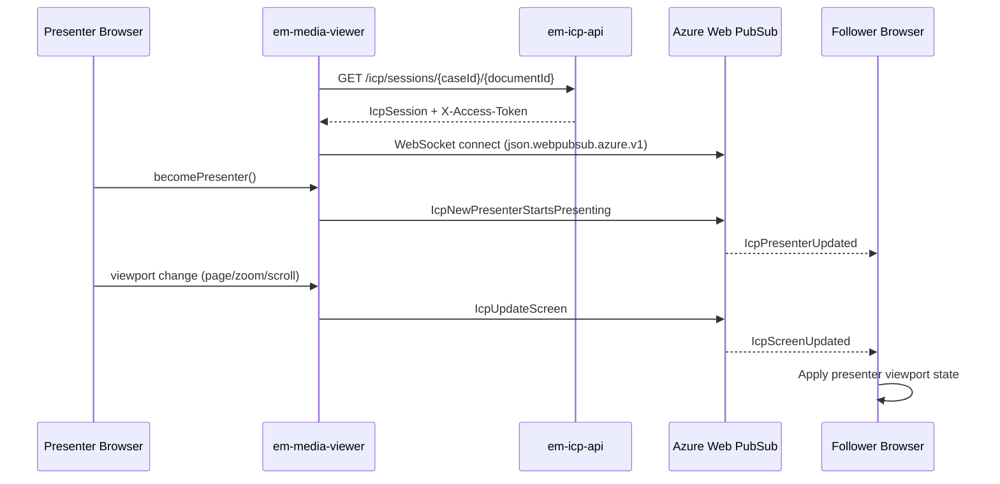

## TL;DR

- `@hmcts/media-viewer` is an Angular library (currently v4.2.18) that renders PDFs, images, multimedia (MP4/MP3), and convertible content (Word, Excel, PowerPoint, TXT, RTF) inline in browser-based frontends.
- Consumed by XUI and service-team frontends via `MediaViewerModule` import; all backend calls are relative paths that the consuming app must proxy.
- Annotation overlays (highlights, comments) persist via `em-annotation-api`; redaction markings and final redaction rendering go through `em-native-pdf-annotator-app`. Annotations are private to the creating user.
- In-Court Presentation (ICP) mode allows a presenter to synchronise document view state across multiple participants via Azure Web PubSub; sessions are per case+document and valid for one calendar day.
- Published to NPM via a Jenkins pipeline (`Jenkinsfile_CNP`) on merge to master; the package bundles `pdfjs-dist` and other non-peer dependencies.
- Uses NgRx for state management (annotations, redactions, bookmarks, ICP, document position) — host apps must declare `StoreModule.forRoot({}, {})`. Additional features include PDF bookmarks, rotation persistence, and a sidebar with document outline.

## What the library renders

`MediaViewerComponent` (selector `mv-media-viewer`) routes to an internal viewer based on the `contentType` string input. The classification logic in `ngOnChanges()` (`media-viewer.component.ts:158`) checks against three content-type groups:

| Group | Types | Viewer | Rendering engine |
|-------|-------|--------|-----------------|
| Core | `pdf` | `PdfViewerComponent` | PDF.js (`pdfjs-dist ^4.10.38`) |
| Core | `image` | `ImageViewerComponent` | Native `` with CSS transforms |
| Multimedia | `mp4`, `mp3` | `MultimediaPlayerComponent` | Native HTML5 `<video>`/`<audio>` |
| Convertible | `excel`, `word`, `powerpoint`, `txt`, `rtf` | `ConvertibleContentViewerComponent` | Server-side conversion (external) |

For PDFs, `PdfJsWrapper` (`pdf-js-wrapper.ts:11`) sets the global worker source to `/assets/build/pdf.worker.min.js`. The wrapper subscribes to the PDF.js event bus for `pagesloaded`, `scalechanging`, `rotationchanging`, `pagechanging`, and other events (`pdf-js-wrapper.ts:42-64`), exposing them as RxJS Subjects that annotations and ICP consume.

For images, rotation and zoom are applied via CSS transforms. After each transform, `initAnnoPage()` dispatches an `AddPages` action with updated offsets/dimensions so annotation overlays stay aligned (`image-viewer.component.ts:179-195`).

For unsupported types, `UnsupportedViewerComponent` immediately emits `ResponseType.UNSUPPORTED` via `loadStatus` and offers a download link. If the file URL is also unreachable, a `ViewerException` is emitted containing the HTTP status code and error message.

## Annotation and redaction capabilities

### Annotations

When `enableAnnotations=true` and the document URL changes, the component dispatches `LoadAnnotationSet(documentId)` to the NgRx store. The corresponding effect calls `AnnotationApiService.getAnnotation(documentId)` which issues `GET /em-anno/{documentId}/annotation-sets`. Annotations are rendered as overlay layers atop the PDF/image viewer.

The annotation system supports:
- **Text highlights** (PDF only) — enabled via `showHighlightButton` toolbar option. Text must be machine-recognisable (scanned-as-image documents cannot be text-highlighted). Highlighting cannot span two pages.
- **Box-draw annotations** (PDF and image) — enabled via `showDrawButton` toolbar option. Boxes can be resized after creation by dragging corners.
- **Comments** — attached to highlight/box regions; the `unsavedChanges` output emits `true` when edits are pending. Comments include user name, text, and timestamp (displayed in local timezone). Removing a highlight also removes its associated comment.

<!-- CONFLUENCE-ONLY: Annotations are private to the creating user only (no sharing). This is stated in the User Guide but the visibility rule is enforced server-side by em-annotation-api, not verified in em-media-viewer source. -->

The annotation overlay layer uses absolutely positioned `<div>` elements (not HTML5 Canvas), chosen because Canvas complicates bubbling HTML events. Two modes are available: **text mode** (intercepts text-selection events from the PDF.js text layer) and **draw mode** (listens for click-and-drag events to create a selection rectangle).

<!-- CONFLUENCE-ONLY: Touch support in draw mode (for creating annotations via touch gestures) was originally implemented using Hammer.js according to the LLD, but the current source does not import Hammer.js — this may have been replaced by native pointer events. -->

### Redactions

When `enableRedactions=true`, the component dispatches `LoadRedactions(documentId)` whose effect calls `GET /api/markups/{documentId}`. Redaction markings are stored separately from annotations via `em-native-pdf-annotator-app`.

The final redaction step — burning redactions into the PDF — is triggered by `RedactionApiService.redact()` which posts to `/api/redaction` with `responseType: 'blob'` (`redaction-api.service.ts:57`). The response is a redacted PDF binary; the consuming application is responsible for uploading this to CDAM.

A bulk redaction feature (`enableRedactSearch=true`) shows a `RedactionSearchBarComponent` that searches text and creates markings for all matching occurrences via `POST /api/markups/search`.

Note: the redaction API URL is hardcoded to `/api/markups` and `/api/redaction` — there is no input to override it, unlike `annotationApiUrl` which can be set per-instance.

## Bookmarks

The PDF viewer sidebar includes a bookmarks feature (available when `showSidebar=true` in toolbar options). Bookmarks are persisted via the annotation API (`/em-anno/bookmarks`) and managed through NgRx actions:

- **Load** — `LoadBookmarks` dispatched on document load; retrieves existing bookmarks from the backend
- **Create** — user selects text and chooses "Bookmark" from the context menu, or clicks the bookmark button in the sidebar. A `CreateBookmark` action captures the current PDF.js page location/destination
- **Navigate** — clicking a bookmark uses PDF.js destination handling to jump to that location
- **Update/Move/Delete** — bookmarks can be renamed, reordered, and deleted via the sidebar UI

The sidebar also shows the document's native PDF outline (table of contents) when the PDF includes one. This is distinct from user-created bookmarks.

## Rotation persistence

The `RotationPersistDirective` (selector `[mvRotationPersist]`) enables saving rotation state for a document across sessions. It uses `RotationApiService` which calls:

- `GET /em-anno/metadata/{documentId}` — retrieve saved rotation
- `POST /em-anno/metadata/` — persist rotation state

The toolbar option `showSaveRotationButton` controls whether the save-rotation button is visible. By default this is `false` in all presets — consuming services must explicitly enable it.

<!-- CONFLUENCE-ONLY: The User Guide states rotation persistence is currently "dormant" and must be explicitly activated per-service. This aligns with the default being false in source. -->

## Error handling and load status

The library communicates document load outcomes to the host application via two `@Output()` events:

| Event | Type | Description |
|-------|------|-------------|
| `mediaLoadStatus` | `ResponseType` enum | Emits `SUCCESS`, `FAILURE`, or `UNSUPPORTED` |
| `viewerException` | `ViewerException` object | Emits on load failure with `exceptionType`, HTTP response code, and error message |

The `ResponseType` enum (`viewer-exception.model.ts`) has three values:

```typescript
export enum ResponseType {
  SUCCESS = 'SUCCESS',
  FAILURE = 'FAILURE',
  UNSUPPORTED = 'UNSUPPORTED'
}
```

The consuming application is responsible for presenting these errors in its own UI. Typical error scenarios include: document not found (404), corrupt PDF, and unsupported file type.

## Toolbar customisation

`ToolbarButtonVisibilityService` controls which toolbar buttons appear. Default presets are selected based on content type:

| Preset | Applies to | Enabled buttons |
|--------|-----------|-----------------|
| `defaultPdfOptions` | PDF | print, download, navigation, zoom, rotate, searchBar, sidebar, grabNDrag, commentSummary, presentationMode, redact |
| `defaultImageOptions` | Images | print, download, zoom, rotate, grabNDrag, commentSummary, redact |
| `defaultMultimediaOptions` | MP4/MP3 | download |
| `defaultUnsupportedOptions` | Unsupported types | download, print |

The full set of overrideable boolean properties on `ToolbarButtonVisibilityService` is:

| Property | Purpose |
|----------|---------|
| `showPrint` | Print button |
| `showDownload` | Download button |
| `showNavigation` | Page number input + prev/next arrows |
| `showZoom` | Zoom +/- buttons and dropdown |
| `showRotate` | Rotate left/right buttons |
| `showPresentationMode` | ICP "Present" button |
| `showRedact` | Redaction mode toggle |
| `showOpenFile` | Open file button |
| `showBookmark` | Bookmark button |
| `showHighlightButton` | Text highlight tool |
| `showDrawButton` | Draw-a-box tool |
| `showSearchBar` | Text search overlay |
| `showSidebar` | Sidebar (outline + bookmarks) |
| `showCommentSummary` | Comment summary panel |
| `showGrabNDragButton` | Grab and drag mode |
| `showSaveRotationButton` | Save rotation button |

Zoom operates via PDF.js scale values. Available zoom presets are: **10%, 25%, 50%, 75%, 100%, 125%, 150%, 250%, 300%, 500%** (`main-toolbar.component.ts:67`). The +/- buttons step by 10% increments (`stepZoom(0.1)` / `stepZoom(-0.1)`). The minimum zoom is clamped at 10%.

Consumers override defaults via the `toolbarButtonOverrides` input — a partial object whose keys must match `ToolbarButtonVisibilityService` property names exactly (e.g. `showPrint`, `showDownload`, `showZoom`, `showRotate`, `showRedact`). The input is typed as `any`; unknown keys are silently ignored (`toolbar-button-visibility.service.ts:44-47`).

The `toolbarEventsOutput` EventEmitter exposes the `ToolbarEventService` instance to the host app, allowing imperative subscription to toolbar actions (zoom, rotate, print, search, redaction mode) from outside the component (`media-viewer.component.ts:82`).

## In-Court Presentation (ICP)

ICP enables a presenter to control what document page all participants see simultaneously during a hearing. It requires `enableICP=true` and a `caseId` input.



The WebSocket connection uses native `WebSocket` with the `json.webpubsub.azure.v1` subprotocol (`socket.service.ts:135`). Messages are structured as `{ type: 'event', event: IcpEvents, data: any }`. ICP only works for PDF content — `PdfViewerComponent` imports `IcpService` and dispatches `SetCaseId` to the ICP store.

### ICP session lifecycle

Sessions are managed by `em-icp-api` (Node.js + Redis + Azure Web PubSub):

- **One session per case + document per day** — the session key in Redis is `{caseId}--{documentId}`. If a session exists for today (`dateOfHearing === today`), it is reused; otherwise a new one is created.
- **Session data structure** (`em-icp-api:api/model/interfaces.ts`):
  ```typescript
  interface Session {
    sessionId: string;     // UUID, regenerated daily
    caseId: string;
    documentId: string;
    dateOfHearing: string; // e.g. "Tue May 13 2026"
    presenterId: string;
    presenterName: string;
    participants: string;
    connectionUrl: string;
  }
  ```
- **Authentication** — the API verifies the JWT (`Authorization` header) via IDAM before returning a session. The Azure Web PubSub access token (returned in `X-Access-Token` response header) grants the user `joinLeaveGroup` and `sendToGroup` roles scoped to `{caseId}--{documentId}`.
- **Presenter role** — only one presenter at a time. If the presenter closes their browser or stops presenting, the role is relinquished and available to others.
- **Follower behaviour** — followers see presenter viewport updates (page, scale, top, left, rotation). Each follower can zoom independently (not shared). If a follower navigates away, their view updates on the next presenter publish.
- **Cleanup** — when all users leave, Azure Web PubSub automatically deletes the room. Redis sessions are effectively daily-scoped by the `dateOfHearing` check.

### ICP viewport payload (`PdfPosition`)

```typescript
interface PdfPosition {
  pageNumber: number;
  scale: number;
  top: number;
  left: number;
  rotation: number;  // 0, 90, 180, 270
}
```

### ICP events (`icp.events.ts`)

| Event constant | Wire value | Direction |
|---------------|------------|-----------|
| `SESSION_JOIN` | `IcpClientJoinSession` | Client -> Server |
| `SESSION_LEAVE` | `IcpClientLeaveSession` | Client -> Server |
| `UPDATE_PRESENTER` | `IcpNewPresenterStartsPresenting` | Client -> Server |
| `UPDATE_SCREEN` | `IcpUpdateScreen` | Client -> Server |
| `SESSION_JOINED` | `IcpClientJoinedSession` | Server -> Client |
| `PRESENTER_UPDATED` | `IcpPresenterUpdated` | Server -> Client |
| `SCREEN_UPDATED` | `IcpScreenUpdated` | Server -> Client |
| `NEW_PARTICIPANT_JOINED` | `IcpNewParticipantJoinedSession` | Server -> Client |
| `PARTICIPANTS_UPDATED` | `IcpParticipantsListUpdated` | Server -> Client |
| `CLIENT_DISCONNECTED` | `IcpClientDisconnectedFromSession` | Server -> Client |

<!-- CONFLUENCE-ONLY: The ICP LLD states a limit of 2 messages per second to prevent flooding the WebSocket server. This throttle is not visible in the em-media-viewer client source; it may be enforced server-side by em-icp-api or Azure Web PubSub configuration. -->

Note: `em-icp-api` is marked as archived in its README, but the code and its API spec remain present and the client code in `em-media-viewer` remains fully functional.

## NPM publishing and consumption

### Package identity

- **Name**: `@hmcts/media-viewer`
- **Version**: `4.2.18`
- **Package manager**: Yarn 4.5.0
- **Registry**: NPM (published via `Jenkinsfile_CNP` on merge to master)

### Build chain

1. `build:lib` — runs ng-packagr to produce `dist/media-viewer/` (ESM2022, FESM2022 bundles + type declarations)
2. `copy:lib-files` — copies `pdfjs-dist/build` worker, assets, README, LICENCE into dist
3. `npm-pack` — creates the `.tgz` tarball
4. `publish:dist` — `cd dist/media-viewer && yarn install --no-immutable && yarn npm publish`

### Bundled vs peer dependencies

| Category | Packages |
|----------|----------|
| **Bundled** (shipped in the package) | `pdfjs-dist`, `mutable-div`, `socket.io-client`*, `uuid`, `@swimlane/ngx-datatable` |
| **Peer** (must be in consuming app) | `@angular/*` 20.x, `@ngrx/*` 20, RxJS, `govuk-frontend`, `rpx-xui-translation` |

\* `socket.io-client` is declared in `package.json` but **not imported anywhere** in the library source. ICP now uses native `WebSocket` with Azure Web PubSub. This is a dead dependency retained from the earlier Socket.IO-based implementation.

### Consumer integration checklist

1. Import `MediaViewerModule` in a feature module (host must have `StoreModule.forRoot({}, {})` and `EffectsModule.forRoot([])` at app level)
2. Add `node_modules/@hmcts/media-viewer/assets` to the `assets` array in `angular.json`
3. Import `RpxTranslationModule.forRoot()` in the app module (library uses `RpxTranslationModule.forChild()` internally)
4. Configure the Node proxy layer to forward required paths:

| Path | Backend service | Used for |
|------|----------------|----------|
| `/documents` | DM Store (or CDAM gateway) | Document binary retrieval |
| `/em-anno` | `em-annotation-api` | Annotations, bookmarks, rotation metadata |
| `/api/markups`, `/api/redaction` | `em-native-pdf-annotator-app` | Redaction markings and burn-in |
| `/icp/sessions` | `em-icp-api` | ICP session creation/retrieval |

## Key gotchas

- **PDF worker path**: The consuming app must serve `pdfjs-dist` worker at `/assets/build/pdf.worker.min.js`. If missing, PDFs will not render.
- **ViewEncapsulation.None**: `MediaViewerComponent` uses `ViewEncapsulation.None` (`media-viewer.component.ts:59`) — its styles leak into the host application's global scope.
- **contentType is a plain string**: Classification uses case-insensitive key matching. Typos cause documents to be treated as unsupported (routed to `UnsupportedViewerComponent`).
- **Redact button visibility vs enablement**: `showRedact` is on by default for PDF/image toolbar presets even when `enableRedactions=false`. The button appears but API calls only fire when the input is `true`.
- **No version bump automation**: The version in `package.json` must be manually bumped before publishing.
- **Copy text disabled during rotation**: After a document is rotated, text selection/copy is disabled (PDF rendering artifact).
- **Text highlights cannot span pages**: The highlight tool only works within a single page boundary; highlights across page breaks are not supported.
- **Responsive toolbar overflow**: When the viewport is narrow, toolbar buttons wrap into a "More options" dropdown starting from the right. The secondary toolbars (redaction, ICP) stack icons vertically rather than collapsing.
- **ICP button visibility**: The "Present" button only appears if `showPresentationMode` is `true` in toolbar options. Consuming services control this; if ICP is not configured for a jurisdiction, the button is absent.

## Version history

The media viewer has evolved through several major architectural phases:

| Era | Package | Supported formats | Key capability |
|-----|---------|-------------------|----------------|
| JUI Document Viewer | Embedded in JUI codebase | PDF, JPEG, GIF, PNG | Text annotation, rotation |
| External Document Viewer | `@hmcts/document-viewer-webcomponent` | PDF, JPEG, GIF, PNG | Same as JUI, externalised as web component |
| Media Viewer 1.x | `@hmcts/media-viewer` | PDF, JPEG, GIF, PNG | Zoom, rotate, go-to page, lazy loading, native annotations |
| Media Viewer 2.x | `@hmcts/media-viewer` | + MP4, MP3 | Multimedia playback |
| Media Viewer 3.x | `@hmcts/media-viewer` | + Word, Excel, PPT, TXT, RTF | Server-side conversion, redaction, ICP, bookmarks |
| Media Viewer 4.x (current) | `@hmcts/media-viewer` | Same | Angular 20, NgRx 20, Azure Web PubSub |

The original annotation layer used `pdf-annotate.js` (now unmaintained). The 1.x rewrite replaced it with a bespoke overlay using absolutely positioned DIVs atop the Mozilla PDF.js viewer.

## Examples

### MediaViewerComponent: @Input and @Output declarations

The component selector is `mv-media-viewer`. The following excerpt shows the complete set of public inputs and outputs as declared in the source. Note that `enableAnnotations`, `enableRedactions`, `enableICP`, and `multimediaPlayerEnabled` all default to `false`.

```typescript
// Source: apps/em/em-media-viewer/projects/media-viewer/src/lib/media-viewer.component.ts
@Component({
    selector: 'mv-media-viewer',
    templateUrl: './media-viewer.component.html',
    styleUrls: ['./media-viewer.component.scss'],
    encapsulation: ViewEncapsulation.None,  // styles leak into host
    standalone: false
})
export class MediaViewerComponent implements OnChanges, OnDestroy, AfterContentInit, AfterViewChecked {

  @Input() url;
  @Input() downloadFileName: string;
  @Input() contentType: string;  // 'pdf' | 'image' | 'mp4' | 'mp3' | 'excel' | 'word' | 'powerpoint' | 'txt' | 'rtf'

  @Input() showToolbar = true;
  @Input() toolbarButtonOverrides: any = {};

  @Input() public height: string;
  @Input() width = '100%';

  @Output() mediaLoadStatus = new EventEmitter<ResponseType>();
  @Output() viewerException = new EventEmitter<ViewerException>();
  @Output() toolbarEventsOutput = new EventEmitter<ToolbarEventService>();
  @Output() unsavedChanges = new EventEmitter<boolean>();

  @Input() enableAnnotations = false;
  @Input() annotationApiUrl;          // defaults to '/em-anno' when undefined

  @Input() enableRedactions = false;
  @Input() enableICP = false;
  @Input() multimediaPlayerEnabled = false;
  @Input() enableRedactSearch = false;

  @Input() caseId: string;            // required for ICP session lookup
}
```

Content type enums (used internally for routing to the correct viewer):

```typescript
// Source: apps/em/em-media-viewer/projects/media-viewer/src/lib/media-viewer.component.ts
enum CoreContentTypes {
  PDF = 'pdf',
  IMAGE = 'image'
}

enum MultimediaContentTypes {
  MP4 = 'mp4',
  MP3 = 'mp3',
}

enum ConvertibleContentTypes {
  EXCEL = 'excel',
  WORD = 'word',
  POWERPOINT = 'powerpoint',
  TXT = 'txt',
  RTF = 'rtf'
}
```

## See also

- [Embed Media Viewer](../how-to/embed-media-viewer.md) — step-by-step setup guide: installing the package, configuring `angular.json` assets, importing `MediaViewerModule`, and wiring proxy routes
- [Annotation Flow](annotation-flow.md) — how `em-annotation-api` and `em-native-pdf-annotator-app` back the annotation and redaction overlays
- [In-Court Presentation](in-court-presentation.md) — how `em-icp-api` and Azure Web PubSub back the ICP/PED session feature surfaced through the viewer
- [API: Annotation](../reference/api-annotation.md) — full reference for the annotation and redaction backend APIs that the library calls via proxy
