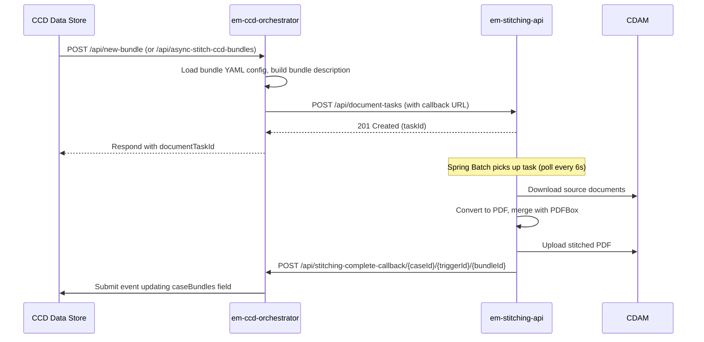

## TL;DR

- Evidence Management (EM) is the document processing and presentation layer for HMCTS CFT services, providing four capability areas: stitching/bundling, annotations/redactions, hearing recordings, and in-court presentation.
- Service teams trigger bundling via CCD callbacks to `em-ccd-orchestrator`, which submits stitching jobs to `em-stitching-api` and returns the merged PDF URL back into CCD case data. Maximum bundle size is 1GB (higher is possible but may cause timeouts).
- `em-stitching-api` downloads source documents from CDAM, converts non-PDF formats via Docmosis, merges them with Apache PDFBox, and uploads the result — all asynchronously via Spring Batch.
- Annotations and redactions are managed by `em-annotation-api` and `em-native-pdf-annotator-app`, surfaced through the `@hmcts/media-viewer` Angular library embedded in XUI. Annotations are private to the author by default.
- Hearing recordings flow from CVP/VH Blob Storage through `em-hrs-ingestor` (a Kubernetes CronJob, off-peak 9pm-5am) into `em-hrs-api` for metadata storage, CCD case creation, and authorised playback via share links (72-hour TTL).
- The service is classified as **High** criticality, runs 24/7/365, and is deployed with at least 2 pods per cluster across 2 AKS clusters for auto failover.

## Capability areas

### 1. Document stitching and bundling

Stitching is the most commonly consumed EM capability. It assembles multiple case documents — evidence PDFs, witness statements, expert reports — into a single indexed PDF bundle suitable for a hearing.

**Key services:**

| Service | Role |
|---------|------|
| `em-ccd-orchestrator` | Receives CCD callbacks, resolves bundle configuration, submits tasks to stitching-api, writes the stitched document reference back to CCD |
| `em-stitching-api` | Asynchronous stitching engine — downloads, converts, merges, uploads |

**How bundling works (async path):**

The synchronous path (`POST /api/stitch-ccd-bundles`) follows the same flow but the orchestrator polls the stitching-api until the task reaches `DONE` or `FAILED` rather than using a callback.

**Bundle configuration:**

Each jurisdiction ships a YAML configuration file inside `em-ccd-orchestrator` under `src/main/resources/bundleconfiguration/` (26+ configs for IAC, SSCS, ET, PRL, Civil, SPTRIBS, etc.). The CCD event specifies which config to use via `case_data.bundleConfiguration` or `case_data.multiBundleConfiguration`. Configuration defines folder structure, document selectors (JSON Pointers into case data), sort order, cover page templates, pagination style, and table of contents preferences (`em-ccd-orchestrator:src/main/resources/bundleconfiguration/`).

Adding a new bundle configuration requires a code change and redeployment of `em-ccd-orchestrator` — there is no external config volume.

**Stitching-api internals:**

- Tasks are persisted to PostgreSQL as `DocumentTask` entities mapped to `versioned_document_task` (`em-stitching-api:src/main/java/.../domain/DocumentTask.java:26`).
- A Spring Batch job polls every 6 seconds with chunk size 5, using `PESSIMISTIC_WRITE` locking to prevent double-processing across pods (`em-stitching-api:src/main/java/.../config/BatchConfiguration.java:218-225`).
- ShedLock ensures only one pod runs the batch schedule at a time in HA deployments.
- Documents are downloaded in parallel, converted via the converter chain (PDFConverter, DocmosisConverter, ImageConverter), then merged using `PDFMergerUtility` (`em-stitching-api:src/main/java/.../batch/DocumentTaskItemProcessor.java:112-118`).
- CDAM is used when `caseTypeId` and `jurisdictionId` are both set on the task; otherwise the legacy DM Store path is used (`em-stitching-api:src/main/java/.../batch/DocumentTaskItemProcessor.java:110-113`).
- Zero-downtime deployments are supported via task versioning — each task carries the build number of the pod that created it, and workers only process tasks with `version <= their own build number` (`em-stitching-api:src/main/java/.../config/BatchConfiguration.java:218-225`).

### 2. Annotations and redactions

Annotations (highlights, comments, bookmarks) and redactions are managed by two backend services and surfaced through a shared Angular viewer library:

| Service | Role |
|---------|------|
| `em-annotation-api` | Stores and retrieves annotations per document, backed by PostgreSQL. Exposes `/api/annotation-sets` (CRUD), plus resources for individual annotations, comments, rectangles, bookmarks, and tags |
| `em-native-pdf-annotator-app` | Handles redaction markings (`/api/markups`) and final burn-in redaction rendering (`/api/redaction`), integrating with CDAM |
| `em-media-viewer` | Angular library (`@hmcts/media-viewer`) embedded in XUI and service frontends; renders PDFs with annotation and redaction tooling |

The viewer communicates with the backend services via proxy routes configured in the consuming application (typically `/em-anno` for annotations and `/api/markups` for redactions).

**Media Viewer component properties:**

Consuming applications configure `@hmcts/media-viewer` with inputs including:

| Property | Type | Description |
|----------|------|-------------|
| `contentType` | `string` | `pdf` (default), `image`, `video`, `audio` — selects the viewer strategy |
| `url` | `string` | Web-accessible URI of the document (typically a CDAM/DM Store URL) |
| `enableAnnotations` | `boolean` | Enables the annotation layer (retrieves existing, allows creation) |
| `annotationApiUrl` | `string` | Backend route for annotations (default: `em-anno`) |
| `enableRedactions` | `boolean` | Enables redaction markup and burn-to-document |
| `showToolbar` | `boolean` | Show/hide the default toolbar (set `false` to build a custom UI) |

Output events: `mediaLoadStatus` (SUCCESS/FAILURE/UNSUPPORTED), `viewerException`, `toolbarEventsOutput`, `unsavedChanges`.

**Annotation rendering:**

- Annotations use **absolutely positioned DIVs** overlaid on the PDF viewer (not HTML5 Canvas), enabling standard DOM event handling.
- Two modes: **text mode** (highlights selected text) and **draw mode** (box highlights with Hammer.js touch support).
- Redaction reuses the same highlighting mechanism with different CSS classes and backend API routes.
- Bookmarks are stored via the annotations API and use PDF.js location/destination handling for navigation.
<!-- CONFLUENCE-ONLY: not verified in source -->
- Annotations are private to the creating user by default. The Confluence LLD describes an Access Management GRANT system for sharing annotations (Public grants override user-specific grants), but this may not be fully implemented.

**Annotation data model** (from `em-annotation-api` REST resources):

- `AnnotationSet` — top-level container scoped to a document
- `Annotation` — a highlight (one or more `Rectangle` elements) with coordinates
- `Comment` — text comment attached to an annotation
- `Bookmark` — PDF.js location-based bookmark for quick navigation
- `Tag` — categorisation label on an annotation

### 3. Hearing recordings

Hearing recordings are captured by CVP (Cloud Video Platform) and VH (Video Hearings) systems and stored in Azure Blob Storage. EM provides the ingest and access layer:

| Service | Role |
|---------|------|
| `em-hrs-ingestor` | Kubernetes CronJob that compares CVP Blob Store contents against what HRS already holds; submits new recordings to `em-hrs-api` |
| `em-hrs-api` | Stores recording metadata in PostgreSQL, creates CCD cases, serves audio/video to authorised users, manages share links, sends reporting emails |

**Scheduling and execution:**

The ingestor is deployed as a **Kubernetes CronJob** scheduled at 30-minute intervals during off-peak hours (9pm through 5am), staggered between the two production clusters. It is controlled by two environment variables: `ENABLE_CRON_JOB` (on/off) and `MAX_FILES_TO_PROCESS` (batch size, default 50). When triggered, the Spring Boot application starts, runs ingestion once, then calls `System.exit(0)` (`em-hrs-ingestor:src/main/java/.../listener/IngestWhenApplicationReadyListener.java:67`). Parallel operation is forbidden via `.spec.concurrencyPolicy=Forbid`, though overlapping runs between disconnected clusters will produce warnings but not duplicate data.
<!-- DIVERGENCE: Confluence says ingestor processes back 60 minutes of files; source shows CVP_PROCESS_BACK_TO_DAY=2 (processes back 2 days). Source wins. -->

**Ingestion flow:**

1. Obtain list of all folders in the CVP source container
2. For each folder, call `GET /folders/{name}` on HRS-API to get already-ingested files
3. Diff source files against ingested list; for each new file:
   - Extract metadata using the **Case Data Filename Parser** (jurisdiction, location, case reference, datetime, segment number)
   - `POST /segments` to HRS-API with parsed metadata and source blob URI
4. HRS-API initiates an Azure storage-to-storage copy (no streaming through the application) and creates a CCD case with the recording metadata

**CVP filename format:**

Recordings follow a naming convention parsed by the ingestor:

| Format | Pattern | Used by |
|--------|---------|---------|
| With location code | `JJ-LLLL-CCCCCCC_yyyy-MM-dd-HH.mm.ss.SSS-zzz_V` | Civil, Family, Royal Courts of Justice |
| Without location code | `JJ-CCCCCCC_yyyy-MM-dd-HH.mm.ss.SSS-zzz_V` | Tribunals (EE, ES, GR, HWE, IA, PC, SE, TC, WP, EA, AU, IU, LU, TUX, CI, QB, HF, BP, SC, CR) |
| Invalid/fallback | Everything left of timestamp becomes case reference | Unparseable filenames |
<!-- CONFLUENCE-ONLY: not verified in source -->

**HRS-API endpoints:**

| Method | Path | Description |
|--------|------|-------------|
| `GET` | `/folders/{name}` | List ingested files for a folder (used by ingestor for diffing) |
| `POST` | `/segments` | Ingest new recording segment (202 accepted, 200 if already copied) |
| `POST` | `/sharees` | Grant a user access to a hearing recording by email; triggers GOV.UK Notify email with download link |
| `GET` | `/hearing-recordings/{recordingId}/segments/{segment}` | Download a recording segment (binary stream) |
| `GET` | `/hearing-recordings/{recordingId}/file/{fileName}` | Download by filename |

**Access control:**

- Allowed IDAM roles: `caseworker-hrs-searcher`, `caseworker-hrs` (`em-hrs-api:src/main/resources/application.yaml:146`)
- S2S whitelist: `ccd_gw`, `em_gw`, `em_hrs_ingestor`, `xui_webapp`, `ccd`, `ccd_data`, `ccd_case_disposer`
- Share links expire after a configurable TTL (default 72 hours, `shareelink.ttl` property)
- Azure Managed Identity (`rpa-prod-mi`) used for blob storage access via IAM roles (Storage Blob Data Reader, Storage Blob Delegator)
<!-- CONFLUENCE-ONLY: not verified in source -->

**Reporting:**

`em-hrs-api` supports scheduled reporting via ShedLock-managed cron jobs (all disabled by default):
- Summary report, monthly hearing report, weekly hearing report, monthly audit report
- Reports are sent via SMTP (not GOV.UK Notify) to configured recipient lists

### 4. In-court presentation (ICP)

`em-icp-api` is a Node/TypeScript service that provides live document-viewing sessions for courtrooms. A presenter controls which document and page all participants see simultaneously, backed by Azure Web PubSub and Redis pub/sub. The viewer UI is integrated into `em-media-viewer`.

Note: this service is currently archived per its README. The functionality remains deployed but is not actively maintained.

## Service consumers

The following HMCTS services depend on EM capabilities:

| Consumer | EM capabilities used |
|----------|---------------------|
| SSCS | Document Store, Media Viewer, Redaction, Document Bundling, HRS |
| Immigration and Asylum (IAC) | Document Store, Document Bundling, HRS |
| Divorce / No Fault Divorce | Document Store, Media Viewer |
| Financial Remedy | Document Store, Media Viewer |
| Probate | Document Store, Media Viewer |
| Family Public Law (FPLA) | Redaction, Media Viewer |
| Private Law (PRL) | Document Bundling, Media Viewer |
| Civil | Document Bundling, Media Viewer |
| Employment Tribunals (ET) | Document Bundling |
| Special Tribunals (SPTRIBS) | Document Bundling |
<!-- CONFLUENCE-ONLY: not verified in source -->

## Operational characteristics

| Parameter | Value |
|-----------|-------|
| Service criticality | High (Document Store is Critical) |
| Service hours | 24/7/365 |
| DTS support hours | 08:00-18:00 M-F excl. English bank holidays |
| Availability model | 2+ pods per cluster, 2 AKS clusters, auto failover |
| Recovery time | ~2 hours to full restore |
| Maximum bundle size | 1GB (can be increased; higher may cause timeouts) |
| Database backup | Azure geo-replicated; transaction logs every 5 min, differential every 12h, full weekly |
| Data retention | 7 days of backups; recording default TTL is 20 years (`DEFAULT_TTL: P20Y`) |
<!-- CONFLUENCE-ONLY: not verified in source -->

## Integration patterns for service teams

Service teams interact with EM primarily through two integration points:

**Triggering a bundle** — configure a CCD event callback to hit `em-ccd-orchestrator`. The orchestrator is an S2S-authorised service; whitelisted callers include `ccd_data`, `xui_webapp`, `civil_service`, `prl_cos_api`, `sptribs_case_api`, `et_cos`, `ethos_repl_service`, and `civil_general_applications`. Your case definition must include a `caseBundles` complex field and a `bundleConfiguration` field that names the YAML config file.

**Embedding document viewing** — add the `@hmcts/media-viewer` Angular library to your frontend. It handles PDF rendering, annotation CRUD (against `em-annotation-api`), and redaction workflows (against `em-native-pdf-annotator-app`). The library communicates with backend services via proxy routes you configure in your Express/nginx layer.

**Supported file types for document storage:**
<!-- CONFLUENCE-ONLY: not verified in source -->

| Type | Max size | Notes |
|------|----------|-------|
| Video (.MP4) | 500 MB | Download only, streaming not supported |
| Audio (.MP3) | 500 MB | Download only, streaming not supported |
| All other files | 300 MB | PDF, Word, images, etc. |

**Consuming HRS recordings** — HRS roles (`caseworker-hrs-searcher`, `caseworker-hrs`) must be assigned via IDAM. Recordings are accessed through ExUI via CCD case data. Share links (sent via GOV.UK Notify) allow external parties to download specific segments via authenticated download URLs with a 72-hour TTL.

## Authentication

All EM Java services follow the same auth pattern:

- **User auth**: OAuth2 resource server (IDAM JWT) on all `/api/**` endpoints.
- **Service auth**: S2S token validated via `ServiceAuthFilter` before JWT validation.
- Both tokens are required for any API call. Health and Swagger endpoints are open.

## See also

- [Architecture](architecture.md) — detailed service inventory, sequence diagrams, and cross-cutting concerns for all EM components
- [Stitching and Bundling](stitching-and-bundling.md) — deep-dive into the document stitching pipeline, bundle YAML configuration, and CCD callback timeout behaviour
- [Annotation Flow](annotation-flow.md) — how annotations and redactions are stored, rendered, and scoped to users
- [Hearing Recordings](hearing-recordings.md) — the CVP/VH ingest pipeline, access control, and HRS metadata model
- [In-Court Presentation](in-court-presentation.md) — the ICP/PED live-session feature backed by Azure Web PubSub
- [Media Viewer](media-viewer.md) — the `@hmcts/media-viewer` Angular library that surfaces annotations, redactions, and ICP
- [Glossary](../reference/glossary.md) — definitions for CDAM, DocumentTask, HRS, ICP, and other EM terms
