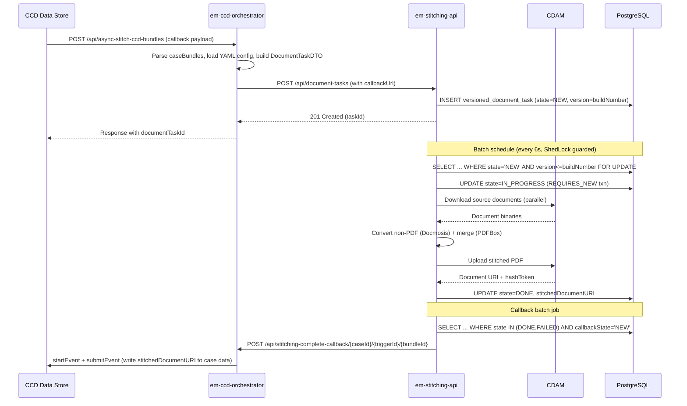

## TL;DR

- Document stitching merges multiple case documents into a single PDF bundle; triggered by CCD callbacks through `em-ccd-orchestrator`, processed asynchronously by `em-stitching-api` via Spring Batch.
- The orchestrator receives CCD callbacks at `/api/stitch-ccd-bundles` (sync) or `/api/new-bundle` / `/api/async-stitch-ccd-bundles` (async), maps bundle YAML config to a `DocumentTask`, and POSTs it to stitching-api.
- Stitching-api persists `DocumentTask` to the `versioned_document_task` table, then a scheduled Spring Batch job picks it up, downloads source documents from CDAM, converts non-PDF formats via Docmosis/ImageConverter, merges using Apache PDFBox `PDFMergerUtility`, and uploads the result.
- Bundle structure is driven by YAML configuration files (`bundleconfiguration/*.yaml`) that define folders, document filters, pagination, cover pages, watermarks, and email notifications.
- CCD imposes a 10-second callback timeout -- sync stitching must complete within this window or the callback fails; the async path avoids this constraint entirely.
- On completion, stitching-api POSTs back to the orchestrator's `/api/stitching-complete-callback/{caseId}/{triggerId}/{bundleId}` endpoint, which writes the stitched document URI into CCD case data.

## The CCD callback trigger

A CCD event callback initiates the stitching flow. Service teams configure their CCD definition to invoke one of the orchestrator's endpoints:

| Endpoint | Mode | Behaviour |
|----------|------|-----------|
| `POST /api/stitch-ccd-bundles` | Synchronous | Submits task then polls stitching-api until DONE/FAILED |
| `POST /api/async-stitch-ccd-bundles` | Asynchronous | Submits task with a callback URL; returns immediately |
| `POST /api/new-bundle` | Asynchronous (automated) | Same as above but uses the automated bundling config path |

All three endpoints delegate to `DefaultUpdateCaller.executeUpdate()` which parses the CCD payload looking for the `caseBundles` field in `case_data` (`DefaultUpdateCaller.java:51`). Bundles marked `eligibleForStitching = true` are processed.

The bundle structure is determined by YAML configuration files shipped inside the orchestrator JAR under `bundleconfiguration/`. The CCD event places the config filename in `case_data.bundleConfiguration` (or `case_data.multiBundleConfiguration` for multi-bundle). The orchestrator loads the config, walks the case data extracting document URIs via JSON Pointers, and assembles a `DocumentTaskDTO` for submission.

## The orchestrator's role

`em-ccd-orchestrator` is a stateless mediator (no database) that bridges CCD and stitching-api.

### Sync path

`CcdBundleStitchingService.stitchBundle()` calls `StitchingService.stitch()` which POSTs the task to `{EM_STITCHING_API_URL}/api/document-tasks` and then polls `GET /api/document-tasks/{id}` with exponential back-off starting at 1 second (`StitchingService.java:180-191`). Maximum 7 retries (`MAX_RETRY_TO_POLL_STITCHING`); each attempt increases sleep time by `SLEEP_TIME * (i + 2)` where `SLEEP_TIME=1000ms`. After exhausting retries, a `StitchingTaskMaxRetryException` is thrown.

### Async path

`AutomatedStitchingExecutor.startStitching()` constructs a callback URL using `CallbackUrlCreator` and sets it on the `DocumentTaskDTO.callback.callbackUrl`. The URL format is:

```
{scheme}://{CALLBACK_DOMAIN}:{port}/api/stitching-complete-callback/{caseId}/{triggerId}/{bundleId}
```

In cloud environments `CALLBACK_DOMAIN` resolves to the orchestrator's own internal hostname (e.g. `em-ccd-orchestrator-aat.service.core-compute-aat.internal`). The task is POSTed to stitching-api and the orchestrator returns the task ID immediately.

When stitching completes, stitching-api calls the callback URL. `StitchingCompleteCallbackController` receives the completed `DocumentTaskDTO`, calls CCD data-store (`startEvent` + `submitEvent`) to write `stitchedDocumentURI` and `hashToken` back into the bundle in case data (`StitchingCompleteCallbackController.java:103-113`).

## How stitching-api processes DocumentTask jobs

### Task creation

The orchestrator POSTs a `DocumentTaskDTO` to `POST /api/document-tasks`. The controller persists it via `DocumentTaskServiceImpl.save()`, which stamps `documentTask.setVersion(buildInfo.getBuildNumber())` (`DocumentTaskServiceImpl.java:55`) and sets `taskState = NEW`.

### Batch job pickup

A `@Scheduled` method runs every 6 seconds (configurable via `spring.batch.document-task-milliseconds`). It executes two Spring Batch jobs sequentially within a single ShedLock interval:

1. **processDocumentJob** (step1) - chunk size 5; picks up NEW tasks
2. **processDocumentCallbackJob** (callBackStep1) - chunk size 10; picks up DONE/FAILED tasks with `callbackState = NEW`

The item reader uses a JPA paging query with `LockModeType.PESSIMISTIC_WRITE`:

```sql
WHERE task_state = 'NEW' AND version <= :buildNumber ORDER BY created_date
```

(`BatchConfiguration.java:218-225`)

### Processing pipeline

`DocumentTaskItemProcessor` executes the following stages:

1. **Double-processing guard** - Re-fetches the task from the entity manager; returns null (skip) if state is no longer NEW (`DocumentTaskItemProcessor.java:77-79`).
2. **Mark IN_PROGRESS** - `DocumentTaskStateMarker.commitTaskAsInProgress()` runs in a `REQUIRES_NEW` transaction so the state change is visible to other pods immediately (`DocumentTaskStateMarker.java:27`).
3. **Download** - Source documents downloaded in parallel (`Stream.parallel()`). CDAM path is used when both `caseTypeId` and `jurisdictionId` are non-blank; otherwise falls back to legacy DM Store (`DocumentTaskItemProcessor.java:110-113`).
4. **Convert** - Non-PDF formats converted via the converter chain: `PDFConverter` (no-op for PDFs), `DocmosisConverter` (Word/Excel/PowerPoint/RTF via Docmosis `/rs/convert`), `ImageConverter` (wraps images in a PDF page using PDFBox).
5. **Watermark** - If `bundle.documentImage` is set, a watermark overlay is applied via `PDFWatermark` using PDFBox `Overlay`.
6. **Merge** - `PDFMerger.merge()` assembles the final PDF.
7. **Upload** - Merged PDF uploaded to CDAM (or DM Store); `stitchedDocumentURI` and `hashToken` set on the bundle.
8. **Set DONE** - Task state set to `DONE`.

On failure at any stage, the task state is set to `FAILED` with a `failureDescription`.

### PDF merging internals

`PDFMerger` delegates to an inner `StatefulPDFMerger` which:

- Adds the cover page (if a `coverpageTemplate` is configured and rendered via `DocmosisClient`)
- Inserts table-of-contents pages with clickable links (if `hasTableOfContents = true`)
- Iterates `bundle.getSortedItems()` (empty folders are filtered out), adding each document via `PDFMergerUtility.appendDocument()`
- Applies pagination (page numbers) per document according to `paginationStyle` (`PDFMerger.java:180-186`)
- Falls back to resetting `PDStructureTreeRoot` on `IndexOutOfBoundsException` during append - a known PDFBox compatibility workaround (`PDFMerger.java:173-176`)
- Saves to a temp file (`stitched*.pdf`), closes all `PDDocument` instances, and returns the file

The `pdfbox.fontcache` system property is set to `/tmp` to work around font-cache access issues in containerised read-only-root environments (`BatchConfiguration.java:252`).

### Callback delivery

After the main batch job, `processDocumentCallbackJob` picks up tasks in DONE or FAILED state with `callbackState = NEW`. `DocumentTaskCallbackProcessor` POSTs the `DocumentTaskDTO` to the callback URL with `ServiceAuthorization` (fresh S2S token) and `Authorization` (stored JWT) headers (`DocumentTaskCallbackProcessor.java:43-46`).

If the callback receives a non-2xx response, `attempts` is incremented. Once `attempts >= CALLBACK_MAX_ATTEMPTS` (default 3), the callback state is set to `FAILURE` (`DocumentTaskCallbackProcessor.java:79,92-98`).

## Versioned tasks for zero-downtime deploys

The `versioned_document_task` table has a `version` column (int NOT NULL). Every saved task gets `version = buildInfo.getBuildNumber()` (`DocumentTaskServiceImpl.java:55`).

The batch reader query filters with `version <= buildNumber`:

- **Old pods** (buildNumber N) query `version <= N` - they only see tasks created by themselves or older versions.
- **New pods** (buildNumber N+1) query `version <= N+1` - they see all tasks including those from old pods.

This means during a rolling deployment:
- Tasks created by old pods (`version=N`) are visible to both old and new pods.
- Tasks created by new pods (`version=N+1`) are invisible to old pods (`N+1 <= N` is false).
- Old pods safely drain their own queue while new pods take over everything.

`BuildInfo.getBuildNumber()` returns `Integer.parseInt(build)` where `build` comes from `${info.app.build}` (populated from `build-info.properties` at CI build time); defaults to `1` in local development (`BuildInfo.java:55-57`).

A schema constraint follows from this design: any non-nullable columns added to `versioned_document_task` must have a default value, since old-version tasks will not populate new fields.

## Spring Batch with ShedLock

### ShedLock configuration

The service uses `@EnableSchedulerLock` with defaults `lockAtMostFor = PT5M`, `lockAtLeastFor = PT5S` (`BatchConfiguration.java:53`). The lock provider is `JdbcTemplateLockProvider` backed by the main PostgreSQL DataSource, storing locks in the `shedlock` table (columns: `name` varchar(64) PK, `lock_until`, `locked_at`, `locked_by`).

Four scheduled methods each hold a distinct lock:

| Method | Lock name | Schedule |
|--------|-----------|----------|
| `schedule()` | `${task.env}` | Every 6s (fixedDelay) |
| `scheduleCleanup()` | `${task.env}-historicExecutionsRetention` | Every 1h |
| `scheduleDocumentTaskCleanup()` | `${task.env}-historicDocumentTaskRetention` | Cron `0 15 22 * * ?` (daily 22:15) |
| `scheduleUpdateDocumentTaskStatus()` | `${task.env}-updateDocumentTaskStatus` | Cron `0 0/15 * * * *` (every 15 min) |

`task.env` defaults to `documentTaskLock-local` and must be set to an environment-specific value in production (env var `TASK_ENV`).

### Double-processing safeguards

Two independent mechanisms prevent the same task being processed by multiple pods:

1. **Pessimistic write lock** on the JPA reader query - prevents two pods reading the same row in the same batch cycle.
2. **`checkAlreadyInProgress()` re-read** in the processor - catches the case where the lock was released between read and process phases (`DocumentTaskItemProcessor.java:77-79`).

### Cleanup jobs

- `UpdateDocumentTaskTasklet` marks NEW tasks with null `jurisdictionId` as FAILED (guards against legacy pre-CDAM tasks).
- `RemoveOldDocumentTaskTasklet` bulk-deletes tasks older than a configurable number of days.
- `RemoveSpringBatchHistoryTasklet` cleans Spring Batch metadata tables in FK-dependency order.

The entire `BatchConfiguration` is gated on `@ConditionalOnProperty(name = "scheduling.enabled")`, disabled in test profiles.

## Sequence diagram



## Supported file formats

The stitching pipeline supports converting various non-PDF formats before merging. Three converters are chained in order:

| Converter | Accepted MIME types | Method |
|-----------|-------------------|--------|
| `PDFConverter` | `application/pdf` | No-op passthrough |
| `DocmosisConverter` | `application/msword`, `application/vnd.openxmlformats-officedocument.wordprocessingml.document`, `application/x-tika-ooxml`, `application/x-tika-msoffice`, `application/vnd.openxmlformats-officedocument.spreadsheetml.sheet`, `application/vnd.ms-excel`, `application/vnd.openxmlformats-officedocument.spreadsheetml.template`, `application/vnd.openxmlformats-officedocument.presentationml.presentation`, `application/vnd.ms-powerpoint`, `application/vnd.openxmlformats-officedocument.presentationml.template`, `application/vnd.openxmlformats-officedocument.presentationml.slideshow`, `application/octet-stream`, `text/plain`, `application/rtf` | HTTP POST to Docmosis `/rs/convert` endpoint |
| `ImageConverter` | `image/bmp`, `image/gif`, `image/jpeg`, `image/png`, `image/svg+xml`, `image/tiff`, `image/jpg` | Creates a single-page PDF with the image scaled to fit page bounds, centred on an A4 page using PDFBox |

In summary: Word (.doc/.docx), Excel (.xls/.xlsx), PowerPoint (.ppt/.pptx), RTF, plain text, and common image formats are all supported. The Docmosis API key is loaded from the environment vault.

<!-- CONFLUENCE-ONLY: Confluence (page 1114964598) states a 4MB file size limit was observed during Docmosis conversion testing. This limit is not enforced in source code and may be a Docmosis service constraint. not verified in source -->

## Bundle configuration YAML

Service teams define bundle structure via YAML configuration files stored in `em-ccd-orchestrator/src/main/resources/bundleconfiguration/`. The CCD payload references the config filename through `case_data.bundleConfiguration` (single bundle) or `case_data.multiBundleConfiguration` (multi-bundle). If both are present, multi-bundle takes precedence.

### Configurable attributes

| Attribute | Purpose | Example |
|-----------|---------|---------|
| `title` | Bundle title | `title: Hearing Bundle` |
| `filename` | Output PDF filename (max 50 chars, alphanumeric, optional `.pdf` suffix) | `filename: bundle.pdf` |
| `filenameIdentifier` | Case field to prefix filename (e.g. case reference) | `filenameIdentifier: /case_details/id` |
| `hasTableOfContents` | Generate clickable index page | `hasTableOfContents: true` |
| `hasCoversheets` | Generate cover sheets per document | `hasCoversheets: true` |
| `hasFolderCoversheets` | Generate cover sheets per folder | `hasFolderCoversheets: true` |
| `coverpageTemplate` | Docmosis template for the bundle cover page | `coverpageTemplate: CC-EDM-GOR-ENG-12345.docx` |
| `paginationStyle` | Page number position | `paginationStyle: topCenter` |
| `pageNumberFormat` | How page numbers display in the TOC | `pageNumberFormat: numberOfPages` |
| `enableEmailNotification` | Send GOV.UK Notify email on success/failure | `enableEmailNotification: true` |
| `documentImage` | Watermark/image overlay configuration | See below |
| `sort` | Document sort order within section | `sort: { field: /fieldName, order: ascending }` |
| `documentNameValue` | Override the standard `documentName` attribute path | `documentNameValue: /documentFileName` |
| `documentLinkValue` | Override the standard `documentLink` attribute path | `documentLinkValue: /document` |
| `customDocument` | Enable distinguishing between document types (e.g. original vs redacted) | `customDocument: true` |
| `customDocumentLinkValue` | Path to alternate document link for custom documents | `customDocumentLinkValue: /customDocumentLink` |

### Pagination styles

Defined in `PaginationStyle.java` enum:

- `off` (default) -- no page numbers
- `topLeft`, `topCenter`, `topRight`
- `bottomLeft`, `bottomCenter`, `bottomRight`

### Page number formats

Defined in `PageNumberFormat.java` enum:

| Value | TOC column header | Display format |
|-------|------------------|----------------|
| `numberOfPages` (default) | "Total Pages" | e.g. "12 pages" |
| `pageRange` | "Page" | e.g. "15 - 26" |

### Document image (watermark)

The `documentImage` block overlays an image on document pages within the stitched PDF (not on cover pages, index pages, or cover sheets):

```yaml
documentImage:
  docmosisAssetId: hmcts.png       # Image filename from Docmosis asset repository
  imageRenderingLocation: allPages  # allPages | firstPage
  coordinateX: 50                   # 0-100 (percentage, clamped by DocumentImage.verifyCoordinates())
  coordinateY: 50                   # 0-100 (percentage)
  imageRendering: opaque            # opaque (foreground) | translucent (background)
```

`ImageRendering.OPAQUE` maps to PDFBox `Overlay.Position.FOREGROUND`; `TRANSLUCENT` maps to `Overlay.Position.BACKGROUND`. Note that `translucent` images may be obscured by other PDF content layers.

### Document filtering

Document sets can be filtered by property/value pairs. Multiple filters on one `documentSet` use AND logic:

```yaml
documents:
  - type: documentSet
    property: /caseDocuments
    filters:
      - property: /documentType
        value: Witness Statement
      - property: /ownerCaseRole
        value: Claimant
```

For OR logic, declare multiple `documentSet` entries pointing to the same collection with different filter criteria.

### Example: complex nested structure

```yaml
title: CMC bundle sample
filename: bundle.pdf
filenameIdentifier: /case_details/id
coverpageTemplate: CC-EDM-GOR-ENG-12345.docx
hasTableOfContents: true
hasCoversheets: true
hasFolderCoversheets: true
paginationStyle: topCenter
pageNumberFormat: numberOfPages
enableEmailNotification: false
documentImage:
  docmosisAssetId: hmcts.png
  imageRendering: opaque
  imageRenderingLocation: allPages
  coordinateX: 50
  coordinateY: 50
folders:
  - name: Claimant Evidence
    folders:
      - name: Witness Statements
        documents:
          - type: documentSet
            property: /caseDocuments
            filters:
              - property: /documentType
                value: Witness Statement
              - property: /ownerCaseRole
                value: Claimant
  - name: Defendant Evidence
    folders:
      - name: Medical Reports
        documents:
          - type: documentSet
            property: /caseDocuments
            filters:
              - property: /documentType
                value: Medical Report
              - property: /ownerCaseRole
                value: Defendant
```

## CCD callback timeout constraint

CCD imposes a **10-second timeout** on all callbacks. By default, it retries failed callbacks 3 times, each also subject to a 10-second limit. The only downstream configuration option is to disable retries entirely (still a single 10-second attempt).

<!-- CONFLUENCE-ONLY: The 10-second timeout and 3-retry default is documented in Confluence page 1945632872 but the CCD callback timeout config is in ccd-data-store-api, not in EM repos. not verified in source -->

This timeout is the primary reason the async path exists:

- **Sync path risk**: The orchestrator's polling loop (`StitchingService.poll()`) sleeps with exponential back-off (`1s, 3s, 5s, 7s, ...` up to 7 retries). A cold stitching-api that hasn't run its batch job in the last 6 seconds will add up to 6 seconds of batch-schedule delay before the task is even picked up. Combined with document download, conversion, and merge time, sync stitching frequently exceeds 10 seconds for anything beyond trivial bundles.

- **Async path solution**: The async endpoints (`/api/async-stitch-ccd-bundles`, `/api/new-bundle`) return immediately after submitting the task. Stitching completes out-of-band; the callback writes results back to CCD independently of the original event timeout.

Service teams that stitch during `aboutToSubmit` callbacks should use the async path unless the bundle is guaranteed to be very small (1-2 small PDFs).

## Email notifications

When `enableEmailNotification: true` is set in the bundle configuration, the orchestrator sends email notifications via GOV.UK Notify (`NotificationService.java`) for the following outcomes:

- Automated create-and-stitch successful
- Automated create failed
- Automated stitch failed
- Manual create failed
- Manual stitch failed

The email is sent to the user who triggered the event (their email is resolved via IDAM `/details` endpoint using the stored JWT). The notification includes case reference, bundle name, and any error message.

## Performance characteristics

Real-world timing from production (sourced from Confluence performance testing and operational data):

| Scenario | Documents | Pages | Time |
|----------|-----------|-------|------|
| IAC production (business proving) | 7 (2 Word + 5 PDF) | 298 | ~21 seconds |
| IAC estimated (extrapolation) | ~20 | ~1000 | ~60 seconds |
| Small bundle (warmed pod) | 2 PDF | ~10 | 1-2 seconds |

<!-- CONFLUENCE-ONLY: Performance figures from Confluence page 1114964598 based on 2019 production data. Current infrastructure may differ. not verified in source -->

Key performance factors:

1. **Batch schedule latency**: Up to 6 seconds if the task is created just after a batch cycle completes.
2. **Docmosis conversion**: Word/Excel/PowerPoint files add per-document conversion overhead via HTTP to Docmosis.
3. **Document download**: Parallel download from CDAM, but network-bound for large files.
4. **PDF merge**: PDFBox in-memory merge; large bundles (>500 pages) consume significant heap.
5. **Polling overhead** (sync path): Each poll iteration adds 1-7 seconds of sleep.

The HLD estimates annual volume at approximately 1.4 million bundles (based on 33% of 4.5 million Reform cases requiring hearing bundles).

## Examples

### Real bundle configuration: SSCS

The following is a complete, production bundle config shipped inside the orchestrator JAR for the SSCS service. It shows how `documentNameValue` overrides the default document name path, how folders use `documentSet` with `filters`, and how a cover page template is applied.

```yaml
// Source: apps/em/em-ccd-orchestrator/src/main/resources/bundleconfiguration/sscs-bundle-config.yaml
title: SSCS Bundle Original
filename: SscsBundle
filenameIdentifier: /case_details/id
coverpageTemplate: TB-SCS-LET-ENG-Cover-Letter-IB.docx
hasTableOfContents: true
hasCoversheets: true
hasFolderCoversheets: false
pageNumberFormat: numberOfPages
documentNameValue: /documentFileName
folders:
  - name: FTA
    documents:
      - type: documentSet
        property: /dwpDocuments
        filters:
          - property: /documentType
            value: dwpResponse
      - type: documentSet
        property: /dwpDocuments
        filters:
          - property: /documentType
            value: dwpEvidenceBundle
  - name: Further additions
    documents:
      - type: documentSet
        property: /sscsDocument
        filters:
          - property: /bundleAddition
            value: \w+
      - type: document
        property: /audioVideoEvidenceBundleDocument
```

### DocumentTask entity

The `DocumentTask` JPA entity maps to the `versioned_document_task` table. The `version` field is set to the deploying build number at save-time, enabling zero-downtime rolling deployments.

```java
// Source: apps/em/em-stitching-api/src/main/java/uk/gov/hmcts/reform/em/stitching/domain/DocumentTask.java
@Entity
@Table(name = "versioned_document_task")
public class DocumentTask extends AbstractAuditingEntity implements Serializable {

    @Id
    @GeneratedValue(strategy = GenerationType.SEQUENCE)
    private Long id;

    @OneToOne(cascade = CascadeType.ALL)
    private Bundle bundle;

    @Enumerated(EnumType.STRING)
    @Column(name = "task_state")
    private TaskState taskState = TaskState.NEW;

    @Column(name = "failure_description", length = 5000)
    private String failureDescription;

    @Column(name = "case_type_id")
    private String caseTypeId;

    @Column(name = "jurisdiction_id")
    private String jurisdictionId;

    @OneToOne(cascade = CascadeType.ALL)
    private Callback callback;

    private int version;
    // ...
}
```

### DocumentTaskItemProcessor: CDAM vs DM Store branching

The processor chooses the CDAM download/upload path when both `caseTypeId` and `jurisdictionId` are non-blank; otherwise it falls back to legacy DM Store.

```java
// Source: apps/em/em-stitching-api/src/main/java/uk/gov/hmcts/reform/em/stitching/batch/DocumentTaskItemProcessor.java
if (StringUtils.isNotBlank(documentTask.getCaseTypeId())
    && StringUtils.isNotBlank(documentTask.getJurisdictionId())) {
    bundleFiles = cdamService
        .downloadFiles(documentTask)
        .map(documentConverter::convert)
        .map(file -> pdfWatermark.processDocumentWatermark(
                documentImage, file,
                documentTask.getBundle().getDocumentImage()))
        .collect(Collectors.toMap(Pair::getFirst, Pair::getSecond));
    outputFile = pdfMerger.merge(documentTask.getBundle(), bundleFiles, coverPageFile);
    cdamService.uploadDocuments(outputFile, documentTask);
} else {
    bundleFiles = dmStoreDownloader
        .downloadFiles(documentTask.getBundle().getSortedDocuments(), documentTask.getJwt())
        .map(documentConverter::convert)
        // ...
        .collect(Collectors.toMap(Pair::getFirst, Pair::getSecond));
    outputFile = pdfMerger.merge(documentTask.getBundle(), bundleFiles, coverPageFile);
    dmStoreUploader.uploadFile(outputFile, documentTask);
}
documentTask.setTaskState(TaskState.DONE);
```

## See also

- [Trigger Bundle Stitching](../how-to/trigger-bundle-stitching.md) — step-by-step guide to configuring a CCD event callback, writing bundle YAML, and handling responses
- [API: Orchestrator](../reference/api-orchestrator.md) — `em-ccd-orchestrator` endpoint reference, bundle DTO validation, and async callback flow
- [API: Stitching](../reference/api-stitching.md) — `em-stitching-api` endpoint reference, `DocumentTask` lifecycle, and callback mechanism
- [Architecture](architecture.md) — service inventory table and end-to-end sequence diagrams for all EM components
- [Local Development with cftlib](../how-to/local-development-cftlib.md) — how to run `em-stitching-api` locally with `bootWithCCD` and test end-to-end stitching
