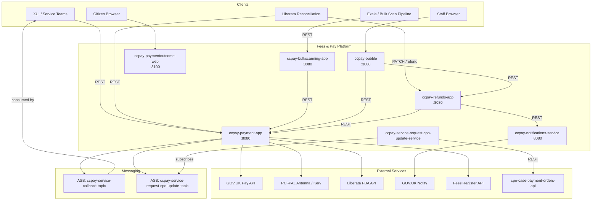

## TL;DR

- HMCTS Fees and Pay is a hub-and-spoke platform: `ccpay-payment-app` (port 8080) is the central gateway wrapping GOV.UK Pay, PCI-PAL telephony, and Liberata PBA; spokes handle refunds, notifications, bulk-scanning, and UI.
- Nine repos: the hub (`ccpay-payment-app`), refunds API, notifications service, bulk-scanning intake, PayBubble staff UI, payment-outcome citizen page, an API gateway (Terraform-only), scheduled jobs (embedded JAR), and a CPO update listener.
- Payment lifecycle: Fee Identification, Service Request Creation, Payment Initiation, Processing (via payment channel), Status Update, Apportionment (fees paid chronologically by creation date), then Case Progression via callback.
- Inter-service messaging uses Azure Service Bus topics (`ccpay-service-callback-topic`, `ccpay-service-request-cpo-update-topic`) with `ccpay-functions-node` (Azure Function) forwarding callbacks to service endpoints; retries 5 times at 30-minute intervals.
- Each Java service owns a dedicated PostgreSQL database with Liquibase-managed schema migrations.
- No CCD dependency at runtime -- the platform records case references against payments but does not store or manage case data.

## Hub-and-spoke topology

The platform follows a hub-and-spoke pattern where `ccpay-payment-app` is the single point of entry for payment creation, retrieval, and reconciliation. All other services either feed data into the hub or consume data from it.



## The hub: ccpay-payment-app

A multi-module Gradle project assembled into a single Spring Boot 3.4 / Java 21 fat jar running on port 8080 (`ccpay-payment-app:build.gradle:191-213`).

### Internal modules

| Module | Directory | Purpose |
|--------|-----------|---------|
| `:payment-api` | `api/` | Controllers, schedulers, ASB senders, domain services |
| `:payment-model` | `model/` | JPA entities, repositories, GOV.UK Pay delegating service, PCI-PAL service, Liberata account service |
| `:payment-gov-pay-client` | `gov-pay-client/` | Apache HttpClient 5 wrapper for GOV.UK Pay public API |
| `:payment-reference-data` | `reference-data/` | `Site` entity and `/reference-data/**` endpoints |
| `:payment-otp` | `otp/` | OTP bootstrap (Aerogear OTP) |
| `:payment-api-contract` | `api-contract/` | Shared request/response DTOs |
| `:case-payment-orders-client` | `case-payment-orders-client/` | Feign client for `cpo-case-payment-orders-api` |

Module dependencies are declared in `ccpay-payment-app:settings.gradle:1-17`. The root `build.gradle` only depends on `:payment-api`, which transitively pulls all other modules.

### Outbound integrations from the hub

| Target | Protocol | Config property |
|--------|----------|-----------------|
| GOV.UK Pay | HTTPS (Apache HC5, Resilience4j circuit breaker) | `gov.pay.url` / `GOV_PAY_URL` |
| PCI-PAL Antenna | OAuth2 + launch URL | `pci-pal.antenna.*` env vars |
| PCI-PAL Kerv | OAuth2 + launch URL | `pci-pal.kerv.*` env vars |
| Liberata PBA | OAuth2 password grant + account API | `liberata.api.account.url` / `LIBERATA_API_ACCOUNT_URL` |
| Fees Register | Feign client | `fees.register.url` / `FEES_REGISTER_URL` |
| Case Payment Orders | REST | `case-payment-orders.api.url` |
| Azure Service Bus | AMQP | `ASB_CONNECTION_STRING` |

### Azure Service Bus topics

The hub publishes to two ASB topics:

<!-- REVIEW: FF4j flag name is wrong. The actual flag name is "payment-callback-service" (from CallbackService.FEATURE in model/src/main/java/uk/gov/hmcts/payment/api/service/CallbackService.java:8), not "service-callback". -->
1. **`ccpay-service-callback-topic`** -- card/PBA payment status callbacks to consuming services (civil, ia, pcs, etc.). Published by `CallbackServiceImpl` (`ccpay-payment-app:api/src/main/java/uk/gov/hmcts/payment/api/servicebus/CallbackServiceImpl.java:46-89`), gated by FF4j flag `service-callback`. The `TopicClientProxy` handles message sending with up to 3 retries with exponential backoff (1s, 2s, 3s) before failing (`ccpay-payment-app:api/src/main/java/uk/gov/hmcts/payment/api/servicebus/TopicClientProxy.java:36-51`).
2. **`ccpay-service-request-cpo-update-topic`** -- service-request payment updates forwarded to the Case Payment Orders API. Published by `ServiceRequestDomainServiceImpl` (`ccpay-payment-app:api/src/main/java/uk/gov/hmcts/payment/api/domain/service/ServiceRequestDomainServiceImpl.java:534-572`).

The ASB subscription for the callback topic is `serviceCallbackPremiumSubscription` (`application.properties:201`). Messages are consumed by `ccpay-functions-node`, an Azure Function (separate from the payment repos) that delivers the payment status payload to each service's registered callback URL.

## Payment lifecycle

The payment lifecycle defines the stages a payment moves through from initiation to completion. This is the integration contract consuming services must follow:

1. **Fee Identification** -- the consuming service retrieves the applicable fee from the Fees Register API.
2. **Service Request Creation** -- the service calls `POST /service-request` to create a Service Request (payment group) representing the payment required for a case. The request includes a `callBackUrl` the platform will use to notify the service of payment outcomes.
3. **Payment Initiation** -- the service calls the payment endpoint for the chosen channel (e.g. `POST /service-request/{ref}/card-payments` for card, `POST /service-request/{ref}/pba-payments` for PBA). For card payments, the response includes a GOV.UK Pay redirect URL and payment reference.
4. **Payment Processing** -- the user completes the payment journey on the external provider (GOV.UK Pay, PCI-PAL, or Liberata PBA).
5. **Payment Status Update** -- the provider returns a status. For card payments, either the service polls the status using the payment reference, or the Payment Status Update Job detects the change and triggers a callback.
6. **Payment Allocation (Apportionment)** -- once confirmed, the payment is allocated across outstanding fees sorted by `dateCreated` (earliest first). Apportionment operates within a single Service Request boundary; payments do not auto-cross to other SRs on the same case (`ccpay-payment-app:model/src/main/java/uk/gov/hmcts/payment/api/service/FeePayApportionServiceImpl.java:88-93`).
7. **Case Progression** -- the consuming service receives the callback and progresses the case workflow (typically via a CCD event).

<!-- CONFLUENCE-ONLY: Step 7 case progression via CCD event is described in Confluence but not enforced by the payment platform source — it is the consuming service's responsibility -->

## Payment and service request statuses

### Payment statuses

Defined in `PaymentStatus.java` (`ccpay-payment-app:model/src/main/java/uk/gov/hmcts/payment/api/model/PaymentStatus.java:19-24`):

| Status | Description |
|--------|-------------|
| `created` | Payment initiated (shown as "Initiated" in PayBubble UI) |
| `pending` | Used for real-time PBA transactions awaiting Liberata response |
| `success` | Payment confirmed by the provider |
| `failed` | Payment failed at the provider |
| `cancelled` | Payment cancelled by the user |
| `error` | System error during processing |

### Service request statuses

Computed dynamically by `ServiceRequestUtil` based on fee totals, remission totals, and successful payment totals (`ccpay-payment-app:api/src/main/java/uk/gov/hmcts/payment/api/util/ServiceRequestUtil.java:14-37`):

| Status | Condition |
|--------|-----------|
| `Disputed` | Any payment on the service request is disputed (checked first) |
| `Paid` | Fee total minus remissions minus payments <= 0 |
| `Partially paid` | Some payment or remission exists but outstanding balance > 0 |
| `Not paid` | No successful payments and no remissions applied |

<!-- DIVERGENCE: Confluence "Service Callback LLD" documents service_request_status as one of "Paid", "Not paid", "Partially paid", but ccpay-payment-app:api/src/main/java/uk/gov/hmcts/payment/api/util/ServiceRequestUtil.java:27-28 also returns "Disputed" when any payment is disputed. Source wins. -->

## Service callback mechanism

When a payment reaches a terminal state (success or failure), the platform publishes a callback message to `ccpay-service-callback-topic` on Azure Service Bus. The message flow is:

1. **Publisher**: `CallbackServiceImpl` in `ccpay-payment-app` publishes a JSON message with the `serviceCallbackUrl` as a message property. It checks `payment.getServiceCallbackUrl()` first, then falls back to `paymentFeeLink.getCallBackUrl()` (`ccpay-payment-app:api/src/main/java/uk/gov/hmcts/payment/api/servicebus/CallbackServiceImpl.java:46-89`).
2. **Transport**: Azure Service Bus topic `ccpay-service-callback-topic` with subscription `serviceCallbackPremiumSubscription`.
3. **Consumer**: `ccpay-functions-node` (an Azure Function, not in the payment repos) reads messages from the subscription and sends HTTP PUT requests to the service's callback URL.
4. **Retry**: If the service does not respond with HTTP 200/201, the function retries up to 5 times at 30-minute intervals before giving up.

<!-- CONFLUENCE-ONLY: The ccpay-functions-node retry behaviour (5 retries at 30 min) is documented in Confluence "Service Callback LLD" but the function code is not in the payment product repos — not verified in source -->

### Callback triggers

| Scenario | Endpoint | Trigger component | Callback URL source |
|----------|----------|-------------------|---------------------|
| Online card payment | `POST /card-payments` | Payment Status Update Job | `payment.service_callback_url` |
| W2P card payment | `POST /service-request/{ref}/card-payments` | Payment Status Update Job | `payment_fee_link.service_request_callback_url` |
| W2P PBA payment | `POST /service-request/{ref}/pba-payments` | Payment App (immediate) | `payment_fee_link.service_request_callback_url` |
| Legacy PBA payment | `POST /credit-account-payments` | N/A (no callback) | N/A |

The **Payment Status Update Job** (`PATCH /jobs/card-payments-status-update`) polls GOV.UK Pay for all `created`-status card payments, updates the local status, and triggers a callback if the status has changed. It only processes online card payments -- telephony and disputed payments are out of scope for this job.

### Callback payload shape

The callback JSON sent to consuming services follows this structure (`PaymentStatusDto`):

```json
{
  "service_request_reference": "2024-1750000047245",
  "ccd_case_number": "1693844866384051",
  "service_request_amount": 288.00,
  "service_request_status": "Paid",
  "payment": {
    "payment_amount": 288.00,
    "payment_reference": "RC-1693-8460-7863-3217",
    "payment_method": "card",
    "case_reference": "128554/001/JR/KR",
    "account_number": null
  }
}
```

The request is sent as a PUT with `ServiceAuthorization` header from the `payment_app` S2S microservice. Consuming services must include `payment_app` in their S2S authorised callers list.

## Payment channels and methods

The platform supports four payment channels, each with specific rules:

| Channel | Provider | Users | Key rules |
|---------|----------|-------|-----------|
| Online card | GOV.UK Pay | Citizens, professionals | Redirect-based; async status via polling or callback |
| Telephony | PCI-PAL (Antenna/Kerv) | Staff (CTSC) | Must cover all outstanding fees for a case; partial telephony payments not permitted |
| Payment by Account (PBA) | Liberata | Professional users | Credit account; v3 API is current for new integrations |
| Bulk Scan | Exela pipeline | Offline (cash/cheque/postal order) | Processed operationally; allocated via same apportionment rules |

<!-- CONFLUENCE-ONLY: Telephony rule "must cover all outstanding fees" and "partial telephony payments not permitted" documented in Confluence "Payment Methods" page — not verified in source -->

### Real-time PBA processing (in development)

The PBA integration is moving from overnight reconciliation to real-time processing. Under the new model:

- An RC transaction reference is created immediately when the request is received (before the Liberata call).
- PayHub calls the new real-time Liberata PBA API to validate the account and debit in real-time.
- The transaction status moves through `Pending` then to `Success` or `Failed` based on the response.
- Overnight reconciliation is eliminated for PBA transactions.
- Failure mode: if the Liberata call times out, the transaction remains in `Pending` -- a scheduled job monitors for stuck pending transactions.

<!-- CONFLUENCE-ONLY: Real-time PBA flow is documented as WIP in Confluence "Real Time PBA Payments HLD" (DTSFP space, version 24) — not verified as fully deployed in source -->

## Responsibility boundary

The platform and consuming services have clearly delineated responsibilities:

| Responsibility | Fees & Payments platform | Consuming service |
|---------------|-------------------------|-------------------|
| Provide payment APIs | Yes | -- |
| Integrate with payment providers (GOV.UK Pay, PCI-PAL, Liberata) | Yes | -- |
| Generate payment references (RC-xxxx-xxxx-xxxx-xxxx) | Yes | -- |
| Create Service Requests | -- | Yes |
| Redirect users to payment providers | -- | Yes |
| Host callback URL endpoint | -- | Yes |
| Retrieve and act on payment status | -- | Yes |
| Progress case workflow after payment (CCD event) | -- | Yes |

## Spokes

### ccpay-refunds-app

Owns the `refunds` PostgreSQL schema and the full refund state machine: Sent for approval, Approved, Update required, Rejected, Accepted, Cancelled, Expired, Reissued, Closed. The state machine is encoded in `RefundState` enum with events SUBMIT, APPROVE, REJECT, UPDATEREQUIRED, ACCEPT, CANCEL (`ccpay-refunds-app:src/main/java/uk/gov/hmcts/reform/refunds/state/RefundState.java:8-133`).

Calls `ccpay-payment-app` for payment lookups and `ccpay-notifications-service` for GOV.UK Notify dispatch. Liberata reconciliation enters via `PATCH /refund/{reference}` -- when Liberata accepts a refund, the service triggers a notification immediately.

S2S trust: `payment_app, ccpay_bubble, api_gw, ccd_gw, xui_webapp, pcs_api`.

### ccpay-notifications-service

A GOV.UK Notify gateway exclusively called by `ccpay-refunds-app`. Owns the `notifications` PostgreSQL schema with tables `notification`, `contact_details`, `service_contact`, and `notification_refund_reasons`.

Exposes:
- `POST /notifications/email` -- send email via Notify
- `POST /notifications/letter` -- send letter via Notify
- `GET /notifications/{reference}` -- retrieve notification history
- `POST /notifications/doc-preview` -- generate template preview
- `GET /notifications/postcode-lookup/{postcode}` -- OS Places address validation

Two `NotificationClientApi` beans (Email and Letter) are created with separate API keys (`EMAIL_APIKEY`, `LETTER_APIKEY`) in `EmailNotificationConfig` (`ccpay-notifications-service:src/main/java/uk/gov/hmcts/reform/notifications/config/EmailNotificationConfig.java:11-25`).

S2S trust: `refunds_api, ccpay_bubble, api_gw, ccd_gw, xui_webapp`.

### ccpay-bulkscanning-app

Receives cash/cheque payment data from the bulk-scan pipeline (Exela gateway) and forwards it to `ccpay-payment-app` via its bulk-scanning REST API. Owns its own Liquibase-managed PostgreSQL schema.

### ccpay-bubble (PayBubble)

Angular 18 + Express.js staff-facing web UI served on port 3000. Connects directly to `ccpay-payment-app` and `ccpay-refunds-app` for payment/refund operations. Embeds two web components: `view-payment` and `fee-register-search`.

### ccpay-paymentoutcome-web

Express/TypeScript citizen-facing application on port 3100. Displays the post-payment outcome page after a GOV.UK Pay redirect completes.

### ccpay-payment-api-gateway

Terraform-only repo (no deployable artefact). Configures Azure API Management (APIM) policies for the Liberata reconciliation endpoints exposed by `ccpay-payment-app`.

### ccpay-scheduled-jobs

Not a standalone deployment -- it is a JAR dependency included in `ccpay-payment-app`. Jobs are triggered by shell scripts calling HTTP endpoints:

| Endpoint | Method | Purpose |
|----------|--------|---------|
| `/jobs/email-pay-reports` | POST | Generate CSV payment reports and email per service/method |
| `/jobs/duplicate-payment-process` | POST | Detect and report duplicate payments |
| `/jobs/card-payments-status-update` | PATCH | Poll GOV.UK Pay for initiated card payment statuses |
| `/jobs/unprocessed-payment-update` | PATCH | Update unprocessed payment references (LaunchDarkly gated) |
| `/jobs/dead-letter-queue-process` | PATCH | Reprocess DLQ from `ccpay-service-request-cpo-update-topic` |
| `/jobs/refund-notification-update` | PATCH | Retry failed email/letter notifications (on `ccpay-refunds-app`) |

The card-payment status update job (`ccpay-payment-app:api/src/main/java/uk/gov/hmcts/payment/api/controllers/MaintenanceJobsController.java:53-84`) fetches all `initiated` card payments, polls GOV.UK Pay for their current status, and publishes callbacks via ASB.

### ccpay-service-request-cpo-update-service

A Spring Boot listener that subscribes to the `ccpay-service-request-cpo-update-topic` ASB topic and pushes service-request payment status updates to the Case Payment Orders API (`cpo-case-payment-orders-api`).

## Databases and Liquibase

All Java services use PostgreSQL with Liquibase-managed schemas. No service uses Flyway.

| Service | Database name | Changelog master | Notable tables |
|---------|--------------|------------------|----------------|
| `ccpay-payment-app` | `payment` | `db.changelog-master.xml` (32 changesets, 0.0.1 -- 0.1.16) | `payment`, `payment_fee_link`, `fee`, `remission`, `fee_pay_apportion`, `status_history`, `idempotency_keys` |
| `ccpay-refunds-app` | `refunds` | `db.changelog-master.yaml` (12 changesets, 0.1 -- 0.1.2) | `refunds`, `status_history`, `refund_reasons`, `refund_status`, `rejection_reasons`, `refund_fees` |
| `ccpay-notifications-service` | `notifications` | `db.changelog-master.yaml` (7 changesets, 0.1 -- 0.7) | `notification`, `contact_details`, `service_contact`, `notification_refund_reasons` |
| `ccpay-bulkscanning-app` | <!-- TODO: research note insufficient for bulk-scanning DB name --> | Liquibase | <!-- TODO --> |

Liquibase auto-runs on startup: `spring.liquibase.enabled=${SPRING_LIQUIBASE_ENABLED:true}` (`ccpay-payment-app:api/src/main/resources/application.properties:25`). The Jenkins pipeline for each service calls `enableDbMigration('ccpay')`.

A Gradle task `./gradlew migratePostgresDatabase` is available on `ccpay-payment-app` for manual migration (`ccpay-payment-app:build.gradle:281-287`).

## Authentication and S2S

All inbound API requests require:
1. **IDAM JWT** (`Authorization` header) -- validated via `auth-checker-lib`
2. **S2S JWT** (`ServiceAuthorization` header) -- validated against a per-service trusted-callers list

The hub's S2S trusted callers list spans approximately 20 CFT services (`ccpay-payment-app:api/src/main/resources/application.properties:110`):

```
cmc, cmc_claim_store, probate_frontend, divorce_frontend, ccd_gw, api_gw,
finrem_payment_service, ccpay_bubble, jui_webapp, xui_webapp, fpl_case_service,
iac, probate_backend, civil_service, paymentoutcome_web, adoption_web,
prl_cos_api, refunds_api, civil_general_applications, notifications_service,
nfdiv_case_api, ccpay_gw, pcs_api
```

External-facing paths (S2S only, no user token) include `/payments`, `/payments/**`, `/card-payments/*/status`, `/telephony/callback`, and `/jobs/**`.

## Feature flags

Two feature-flag mechanisms coexist:

| Mechanism | Use case | Examples |
|-----------|----------|----------|
<!-- REVIEW: FF4j flag for callback is "payment-callback-service" not "service-callback". See CallbackService.java:8 and FF4jConfiguration.java:59-63. -->
| FF4j (static/infra) | Service-level feature gates | `payment-search`, `payment-cancel`, `bulk-scan-check`, `service-callback` |
| LaunchDarkly (dynamic) | Runtime behaviour toggles | `apportion-feature`, `payment-status-update-flag`, `refunds-release` |

Both are accessed through a common `FeatureToggler` interface.

## See also

- [Overview](overview.md) — what the platform does and who uses it
- [Payment Lifecycle](payment-lifecycle.md) — detailed stage-by-stage payment flow with status transitions
- [Reconciliation](reconciliation.md) — APIM gateway, Liberata integration, and scheduled CSV reports
- [Payment Status Callbacks](../reference/payment-status-callbacks.md) — ASB topic schemas, `TopicClientProxy` retry, and `ccpay-functions-node` delivery
- [Reference: API Payments](../reference/api-payments.md) — full endpoint catalogue for `ccpay-payment-app`
- [Glossary](../reference/glossary.md) — definitions for ASB, APIM, PayHub, PayBubble, W2P, and more

## Glossary

| Term | Definition |
|------|------------|
| PBA | Pay By Account -- solicitor firm credit accounts validated against Liberata |
| PCI-PAL | Payment Card Industry compliant telephony payment provider (Antenna and Kerv variants) |
| Service Request | A payment group (`PaymentFeeLink`) containing one or more fees to be paid; reference format `YYYY-NNNN-...` |
| CPO | Case Payment Orders -- the API that links service requests to CCD cases |
| ASB | Azure Service Bus -- the async messaging layer between payment hub and consuming services |
| Apportionment | The rules that distribute a payment across multiple outstanding fees (chronological by `dateCreated`, earliest first) within a single Service Request boundary |
| RC reference | Payment reference generated by the platform; format `RC-NNNN-NNNN-NNNN-NNNN` -- unique to every payment attempt |
| W2P | Ways to Pay -- the standardised service-request-based integration pattern for new services |
| ccpay-functions-node | Azure Function (not in payment repos) that subscribes to the callback ASB topic and delivers payment status updates to consuming services via HTTP PUT |
| Callback URL | The endpoint a consuming service registers when creating a Service Request; the platform sends payment status updates to this URL via ASB |
