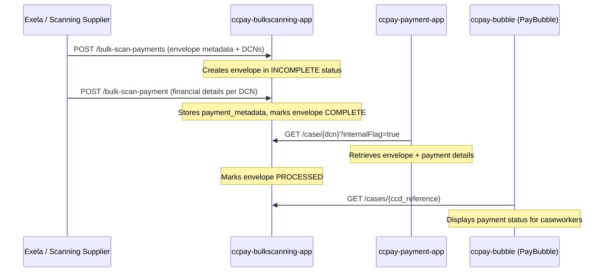

## TL;DR

- `ccpay-bulkscanning-app` is the intermediary that receives cash/cheque payment data from the bulk-scan pipeline (Exela gateway) and makes it available to `ccpay-payment-app` via a pull model.
- Two separate inbound calls create a complete payment record: (1) initial envelope metadata from the bulk-scan system, and (2) financial details from Exela.
- An envelope transitions through `INCOMPLETE` -> `COMPLETE` -> `PROCESSED` as data arrives and is consumed.
- External access from Exela/XBP is via Azure APIM with OAuth2 authentication (migrated from client certificates); APIM generates the S2S token for the backend.
- PO Box to site ID mapping is hard-coded in an enum; valid site IDs are `AA07`, `AA08`, `AA09`, `ABA1`, `ABA5`.
- No PII is stored in this service -- only DCNs, amounts, and payment method metadata. Banking reconciliation is handled by Liberata pulling data from PayHub.

## How the flow works

The bulk-scan payment pipeline involves three systems operating in sequence:



### Step 1: Initial envelope notification

The bulk-scan system (scanning supplier) sends `POST /bulk-scan-payments` (`PaymentController:56`) with:

```json
{
  "site_id": "AA07",
  "ccd_case_number": "1234567890123456",
  "is_exception_record": false,
  "document_control_numbers": ["123456789012345678901"]
}
```

This calls `PaymentServiceImpl.saveInitialMetadataFromBs()` (`PaymentServiceImpl:131`) which creates an `envelope` record with status `INCOMPLETE` and links the DCNs via the `envelope_payment` table. If DCNs already exist, `BulkScanningUtils.handlePaymentStatus()` reconciles the state.

Validation constraints on this payload:
- `site_id` must be exactly 4 characters and one of the allowed values
- `ccd_case_number` must be exactly 16 digits
- Each DCN must be exactly 21 digits numeric (`BulkScanPaymentRequest:59`)

### Step 2: Exela payment notification

Exela sends `POST /bulk-scan-payment` (note: singular, a different endpoint) with financial details (`PaymentController:71`):

```json
{
  "document_control_number": "123456789012345678901",
  "amount": 100.00,
  "currency": "GBP",
  "method": "Cash",
  "bank_giro_credit_slip_number": 12345,
  "banked_date": "2024-01-15"
}
```

This calls `PaymentServiceImpl.processPaymentFromExela()` (`PaymentServiceImpl:94`) which:

1. Creates a `payment_metadata` row (amount, currency, method, BGC slip, banked date).
2. Looks up the matching `envelope_payment` record by DCN.
3. If the envelope is `INCOMPLETE`, marks the payment `COMPLETE`, sets source to `Both`, and updates envelope status.

Validation constraints:
- `method` accepts only `Cash`, `Cheque`, `PostalOrder` (`BulkScanPayment:106`)
- `currency` accepts only `GBP` (`BulkScanPayment:112`)
- `banked_date` must be `YYYY-MM-DD` and not a future date (`BulkScanPayment:83`)
- `bank_giro_credit_slip_number` max 6 digits, required (`BulkScanPayment:68`)
- If payment metadata already exists for the DCN, HTTP 409 Conflict is returned (`PaymentController:77`)

### Step 3: ccpay-payment-app pulls completed data

`ccpay-payment-app` calls `GET /case/{document_control_number}?internalFlag=true` (`SearchController:73`) to retrieve envelope and payment details for completed envelopes. This is a pull model -- there is no outbound dependency from `ccpay-bulkscanning-app` to `ccpay-payment-app` (no URL property exists in `application.yaml`).

The `internalFlag=true` parameter enables an internal variant of the DCN lookup with a different response shape than the external search endpoints.

After processing, `ccpay-payment-app` patches the envelope status to `PROCESSED` via `PATCH /bulk-scan-payments/{dcn}/status/{status}` (`PaymentController:126`).

### PayBubble (staff UI) access

`ccpay-bubble` uses the external search endpoints to display bulk-scan payment status:
- `GET /cases/{ccd_reference}` -- search by CCD case reference (`SearchController:37`)
- `GET /cases?document_control_number=` -- search by DCN (`SearchController:62`)

Note the difference: internal endpoints use `/case/` (singular, path param); external use `/cases` (plural, query param or path param with CCD reference).

## Envelope status lifecycle

| Status | Meaning |
|--------|---------|
| `INCOMPLETE` | Only one source received (either bulk-scan metadata or Exela financial details, but not both) |
| `COMPLETE` | Both sources received for all DCNs in the envelope |
| `PROCESSED` | `ccpay-payment-app` has consumed and processed the envelope |

Status transitions are tracked in the `status_history` table via `BulkScanningUtils.insertStatusHistoryAudit()` (`BulkScanningUtils:155`).

## PO Box to site ID mapping

The `site_id` field identifies which HMCTS service the scanned payment relates to. The mapping is hard-coded in the `ResponsibleSiteId` enum (`ResponsibleSiteId.java:4-9`):

| Site ID | Service |
|---------|---------|
| `AA07` | Divorce |
| `AA08` | Probate |
| `AA09` | Financial Remedy |
| `ABA1` | Divorce |
| `ABA5` | Family Private Law |

Key points about this mapping:

- The caller (Exela/scanning supplier) must already know the site ID -- there is no PO Box number to site ID translation within this service (`BulkScanPaymentRequest:31-56`).
- Two site IDs map to "Divorce" (`AA07` and `ABA1`) representing different PO Boxes for the same jurisdiction (`ResponsibleSiteId.java:5,8`).
- No database-level lookup exists -- the mapping is purely in the enum and the validation array at `BulkScanPaymentRequest:53`. Adding a new site requires updating both.
- Validation uses `@AssertFalse` on `isValidResponsibleServiceId()` which returns `true` when the value is NOT in the allowed list (i.e., "is invalid").

## Database schema

The service owns a `bspayment` PostgreSQL schema with five Liquibase-managed tables:

| Table | Purpose | Key columns |
|-------|---------|-------------|
| `envelope` | Top-level payment envelope | `responsible_service_id`, `payment_status`, timestamps |
| `envelope_case` | Links envelope to CCD case | `ccd_reference`, `exception_record_reference`, FK to `envelope` |
| `envelope_payment` | DCN records per envelope | `dcn_reference`, `envelope_payment_status`, `source`, FK to `envelope` |
| `payment_metadata` | Financial details from Exela | `dcn_reference`, `bgc_reference`, `amount`, `currency`, `payment_method`, `date_banked` |
| `status_history` | Audit trail of status changes | `payment_status`, FK to `envelope` |

## Authentication

All endpoints require an IDAM JWT (`Authorization` header) and an S2S token (`ServiceAuthorization` header). Trusted S2S callers are configured in `application.yaml:79`: `ccpay_bubble`, `cmc`, `bulk_scan_payment_processor`, `api_gw`, `probate_frontend`, `divorce_frontend`, `ccd_gw`, `payment_app`.

### APIM gateway (external callers)

Exela/XBP does not call the microservice directly. External calls are routed through Azure API Management (APIM) at:

```
POST https://cft-api-mgmt.{env}.platform.hmcts.net/payments-bulk-scanning-api/bulk-scan-payment
```

The APIM product is `payments-bulk-scanning` (configured in `cft-api-mgmt-oauth2.tf`). Two authentication mechanisms exist in the infrastructure:

| Mechanism | Policy file | Status |
|-----------|-------------|--------|
| Client certificate (thumbprint) | `cft-api-policy.xml` | Legacy -- being migrated away |
| OAuth2 (Azure AD) | `cft-api-policy-oauth2.xml` | Current strategic approach |

The **OAuth2 flow** works as follows:

1. Exela obtains an access token from `https://login.microsoftonline.com/{tenant-id}/oauth2/v2.0/token` using `client_credentials` grant.
2. Token is valid for 3599 seconds (1 hour); Exela should cache it.
3. Exela calls the APIM endpoint with `Authorization: Bearer <token>`.
4. APIM validates the Azure AD token (`validate-azure-ad-token` policy), strips the `Authorization` header, generates an S2S TOTP from named values (`ccpay-s2s-client-id`, `ccpay-s2s-client-secret`), and injects a `ServiceAuthorization` header for the backend microservice.

This means the bulk-scanning service backend does **not** need Exela-specific auth logic -- it sees a normal S2S-authenticated request.

App registrations are managed in `hmcts/central-app-registration`. Secrets rotate every 18 months; the client secret is passed to XBP via Password Pusher. Key vault secrets:

- `apim-bulk-scanning-tenant-id` -- Azure tenant ID
- `apim-bulk-scanning-client-id` -- OAuth2 client app ID (passed to Exela)
- `apim-bulk-scanning-app-id` -- OAuth2 audience app ID (passed to Exela)
- Client secrets in `central-app-reg-kv` vault (separate prod/non-prod)

<!-- CONFLUENCE-ONLY: not verified in source -->
<!-- Confluence (page 1815107002) states token validity is 3599 seconds and recommends caching. This is standard Azure AD behaviour but not configured in source code. -->

## Additional endpoints

Beyond the primary ingest/search flow, the service exposes two administrative endpoints:

### Update case reference for exception record

`PUT /bulk-scan-payments?exception_reference=<16-digit-ref>` (`PaymentController:97`) accepts a `CaseReferenceRequest` body. This is called when a caseworker creates a case from an exception record, linking the payment envelope to the real CCD case number.

Validation: `exception_reference` must be exactly 16 characters.

### Delete payment by DCN

`DELETE /bulk-scan-payment/{dcn}` (`PaymentController:139`) removes a bulk-scan payment record. Returns HTTP 204 on success, 404 if not found. This is a support/cleanup endpoint.

## Banking reconciliation

The reconciliation flow between Exela, PayHub, and Liberata operates as follows:

1. Exela does **not** scan the cheque image and does **not** extract any PII from the cheque.
2. Before banking cheques, Exela obtains a payment reference from PayHub and imprints it on the back of the cheque.
3. PayHub is now aware of the cheque that will be banked.
4. Liberata pulls payment information from PayHub at regular intervals (daily) via the reconciliation API exposed through APIM (`ccpay-payment-api-gateway`).
5. In case of errors (e.g. payment mismatch), banks share the scanned image of the cheque with Liberata. The scanned image has the PayHub "payment reference" on the back.
6. Liberata reconciles using the payment reference to match bank records against PayHub records.

<!-- CONFLUENCE-ONLY: not verified in source -->
<!-- Confluence (page 866485912) describes the banking reconciliation process. This is a business/operational process not modelled in ccpay-bulkscanning-app source code. -->

## Payment allocation

Once a bulk-scan payment is processed into `ccpay-payment-app`, it follows the same allocation rules as other payment channels:

- Payments are allocated to outstanding fees on the case.
- Fees are paid in chronological order.
- Payments may be partial (underpayment) or exceed the total fee value (overpayment).
- The `PaymentGroup` entity in PayHub calculates whether payments cover fees, resulting in: **Balanced**, **Overpayment** (triggers refund), or **Underpayment** (additional payment required).

<!-- CONFLUENCE-ONLY: not verified in source -->
<!-- Confluence (pages 1791351069, 1794557345) describes apportionment logic. This lives in ccpay-payment-app, not ccpay-bulkscanning-app. -->

## Data retention and PII

- **No PII is stored** in the bulk-scanning service or PayHub from the bulk-scan channel. Exela does not extract sort codes, payer names, or any personally identifiable information from cheques.
- The only data transferred is: DCN (numeric identifier), amount, currency, payment method, BGC slip number, and banked date.
- Payment data is retained for **7 years** per HMCTS data retention policy.

## Auto case creation impact

When the bulk-scan auto-case-creation feature is active, the payment pipeline is affected as follows:

- Previously, all scanned applications created **exception records** in CCD; caseworkers manually created cases. Payment envelopes referenced the exception record number.
- With auto-case-creation, Bulk Scanning creates/updates a case directly from the envelope. Exception records are only created when validation fails.
- Impact on PayBubble: the `case_reference` field (previously mapped to exception record number) may be blank for auto-created cases. Unidentified payment journeys become largely obsolete.
- Impact on Liberata: the `case_reference` attribute in the reconciliation API may not always be populated for scanned payments. The field is not mandatory.
- Orphaned payments (payment without application form) are handled offline by Exela and not sent to CCD.

<!-- CONFLUENCE-ONLY: not verified in source -->
<!-- Confluence (page 1440508905) describes auto-case-creation business impact. This is a cross-cutting feature affecting multiple systems, not solely modelled in ccpay-bulkscanning-app source. -->

## Examples

### Bulk scanning ingest endpoints

```java
// Source: apps/payment/ccpay-bulkscanning-app/src/main/java/uk/gov/hmcts/reform/bulkscanning/controller/PaymentController.java

@RestController
@Tag(name = "Bulk Scanning Payment API")
public class PaymentController {

    // Step 1: initial envelope metadata from the scanning supplier
    @PostMapping("/bulk-scan-payments")
    public ResponseEntity<PaymentResponse> consumeInitialMetaDataBulkScanning(
        @Valid @RequestBody BulkScanPaymentRequest bsPaymentRequest) {
        return new ResponseEntity<>(PaymentResponse.paymentResponseWith()
            .paymentDcns(paymentService.saveInitialMetadataFromBs(bsPaymentRequest))
            .build(), HttpStatus.CREATED);
    }

    // Step 2: financial details from Exela (after banking)
    @PostMapping("/bulk-scan-payment")
    public ResponseEntity<String> processPaymentFromExela(
        @Valid @RequestBody BulkScanPayment bulkScanPayment) {
        if (Optional.ofNullable(paymentService.getPaymentMetadata(
                bulkScanPayment.getDcnReference())).isPresent()) {
            return ResponseEntity.status(HttpStatus.CONFLICT)
                .body("Payment DCN already exists"); // 409 if metadata already submitted
        }
        paymentService.processPaymentFromExela(bulkScanPayment, bulkScanPayment.getDcnReference());
        return ResponseEntity.status(HttpStatus.CREATED).body("Created");
    }

    // Step 3b: mark envelope as PROCESSED after ccpay-payment-app pulls it
    @PatchMapping("/bulk-scan-payments/{dcn}/status/{status}")
    public ResponseEntity markPaymentAsProcessed(
        @NotEmpty @PathVariable("dcn") String dcn,
        @NotNull @PathVariable("status") PaymentStatus status) {
        paymentService.updatePaymentStatus(dcn, status);
        return ResponseEntity.status(HttpStatus.OK).body("Updated");
    }
}
```

### Site ID to responsible service mapping

```java
// Source: apps/payment/ccpay-bulkscanning-app/src/main/java/uk/gov/hmcts/reform/bulkscanning/model/enums/ResponsibleSiteId.java

public enum ResponsibleSiteId {
    AA07("Divorce"),
    AA08("Probate"),
    AA09("Financial Remedy"),
    ABA1("Divorce"),       // two site IDs map to Divorce (different PO Boxes)
    ABA5("Family Private Law");

    private String value;

    ResponsibleSiteId(String value) {
        this.value = value;
    }

    public String value() {
        return value;
    }
}
```

## See also

- [Reference: API Bulk Scanning](../reference/api-bulk-scanning.md) — full endpoint catalogue, request/response shapes, and envelope status machine
- [Reconciliation](reconciliation.md) — how bulk-scan payments feed into Liberata reconciliation and the internal CSV reports
- [Architecture](architecture.md) — `ccpay-bulkscanning-app` spoke description and APIM gateway
- [Payment Lifecycle](payment-lifecycle.md) — how bulk-scan payments follow the same apportionment rules as other channels
- [Glossary](../reference/glossary.md) — definitions for DCN, BGC slip, Envelope, Exela, Site ID, APIM

## Glossary

| Term | Definition |
|------|-----------|
| DCN | Document Control Number -- a 21-digit numeric identifier assigned to each scanned document/payment by the scanning supplier (Exela) |
| BGC slip | Bank Giro Credit slip number -- a max-6-digit reference from Exela identifying the banking batch/transaction |
| Site ID | A 4-character code identifying the HMCTS PO Box / service responsible for a scanned payment |
| Envelope | A logical grouping of one or more DCNs submitted together, representing a single bulk-scan submission |
| Exela / XBP | The scanning supplier contracted by HMCTS to open postal envelopes, scan documents, and bank cheques. Also known as XBP (current trading name) |
| Liberata | The reconciliation processor that pulls payment data from PayHub via API for financial reconciliation |
| CTSC | Courts and Tribunals Service Centre -- the operational teams that process bulk-scanned payments |
| PayHub | Informal name for `ccpay-payment-app`, the central payment recording system |
| PayBubble | The staff-facing Angular UI (`ccpay-bubble`) used by caseworkers to manage payments |
| APIM | Azure API Management -- the gateway through which Exela calls the bulk-scanning service externally |
| Exception Record | A CCD record created when scanned envelope data cannot be automatically matched to/create a case |
