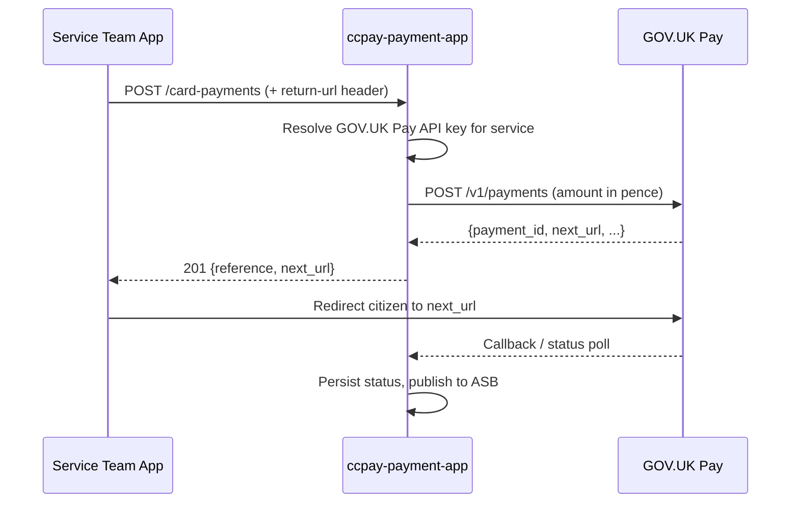

## TL;DR

- HMCTS Fees & Pay (`ccpay-payment-app`) is the central payment gateway; it wraps GOV.UK Pay (card), PCI-PAL (telephony), and Liberata (Pay By Account) behind a unified REST API with IDAM + S2S authorisation.
- Service teams never call GOV.UK Pay or PCI-PAL directly; they call the Payment API which routes to the correct provider, maps credentials per-service, and persists a structured payment reference (format `RC-XXXX-XXXX-XXXX-XXXC` with Luhn check digit) for reconciliation.
- The "Service Request" model is the strategic integration pattern: services create a service request, attach payments to it, and receive status callbacks -- enabling retry without duplicate records.
- Payment-status callbacks flow through Azure Service Bus to a Function Node that delivers PUT requests to consuming services with retry (5 attempts at 30-minute intervals).
- Liberata reconciles payment data twice per day via `/payments` and `/reconciliation-payments` endpoints; a Real Time PBA initiative is shifting PBA payments to instant Liberata validation with no overnight reconciliation needed.
- The service is NOT CCD-based. It records `ccd_case_number` against payment records but does not store case data in CCD.

## Platform responsibilities

The Fees & Payments platform and its consuming services have clearly delineated responsibilities:

| Responsibility | Fees & Payments | Consuming Service |
|----------------|:-:|:-:|
| Provide payment APIs | Y | |
| Integrate with payment providers (GOV.UK Pay, PCI-PAL, Liberata) | Y | |
| Generate payment references | Y | |
| Manage payment status tracking | Y | |
| Create Service Requests | | Y |
| Redirect users to payment providers | | Y |
| Retrieve payment status (poll or receive callback) | | Y |
| Progress case workflow after payment (CCD event) | | Y |

## Payment lifecycle

The typical end-to-end payment lifecycle:

1. **Fee identification** — service retrieves the applicable fee from the Fees Register API.
2. **Service request creation** — service creates a Service Request to represent the payment requirement.
3. **Payment initiation** — service requests a payment link or initiates PBA payment via the relevant endpoint.
4. **Payment processing** — Fees & Payments routes to the appropriate provider.
5. **Status update** — provider returns outcome; the Payment Status Update Job polls GOV.UK Pay for outstanding card payments.
6. **Payment allocation** — payment is allocated to fees via Apportionment rules (when `apportion-feature` LaunchDarkly flag is enabled).
7. **Callback delivery** — status is published to ASB and delivered to the service's callback URL.
8. **Case progression** — service fires a CCD event to advance the case.

## What problem does Payment solve?

GOV.UK Pay provides the card-payment rails for government services, but each HMCTS jurisdiction requires its own GOV.UK Pay account (with separate API keys), its own PCI-PAL telephony flow, and its own PBA billing reference. Without a central gateway, every service team would independently integrate with these providers, duplicate auth/retry logic, and fragment reconciliation data.

`ccpay-payment-app` solves this by:

1. **Abstracting provider integration** — a single `POST /card-payments` or `POST /credit-account-payments` endpoint regardless of underlying provider.
2. **Enforcing authentication** — all inbound requests require both an IDAM user JWT and an S2S service JWT (`application.properties:110` defines ~20 trusted S2S callers including `xui_webapp`, `civil_service`, `pcs_api`, `nfdiv_case_api`).
3. **Generating structured payment references** — the `payment_fee_link.payment_reference` ties a payment group (fees + remissions + payments) together for downstream reconciliation.
4. **Aggregating for reconciliation** — Liberata pulls payment data via `/payments` and `/reconciliation-payments` with filters on `payment_method`, `service_name`, `ccd_case_number`, `start_date`, `end_date`.

## Payment channels

### Card payments (GOV.UK Pay)

The primary online payment channel. The flow is:



Key implementation details:

- Each HMCTS service has a named GOV.UK Pay API key configured via `gov.pay.auth.key.<service>` properties (`GovPayConfig:9`). The `ServiceToTokenMap` maps human-readable service names (e.g. `"divorce"`) to property key names (e.g. `"divorce_frontend"`) (`ServiceToTokenMap:13-27`).
- Amounts are converted from pounds to pence with `movePointRight(2).intValue()` before forwarding to GOV.UK Pay (`GovPayDelegatingPaymentService:46-52`).
- `return-url` and `service-callback-url` are passed as request headers, not in the body (`CardPaymentController:119-121`).
- Resilience4j circuit breakers protect both create and retrieve calls (`GovPayClient:55-77`).
- GOV.UK Pay URL: `gov.pay.url=${GOV_PAY_URL:https://publicapi.payments.service.gov.uk/v1/payments}` (`application.properties:101`).

### Telephony payments (PCI-PAL)

For telephone-channel payments, PCI-PAL handles PCI-DSS-compliant card capture. Two providers exist:

| Provider | Jurisdictions | Config prefix |
|----------|--------------|---------------|
| Antenna | Probate, Divorce, PRL, IAC, Specified Money Claims | `PCI_PAL_ANTENNA_*` |
| Kerv | Default / other services | `PCI_PAL_KERV_*` |

The flow: the call agent's application calls `PciPalPaymentService.getTelephonyProviderLink()` which obtains an OAuth token from the provider (`PciPalPaymentService:116-132`), then launches a PCI-PAL flow with a per-jurisdiction `flowId` (`TelephonySystem:35-48`). PCI-PAL redirects the agent into a framed card-capture page. On completion, PCI-PAL calls back to `POST /telephony/callback` with `orderReference` and `transactionResult` (`TelephonyController:47-53`).

<!-- CONFLUENCE-ONLY: not verified in source -->
**Business rule**: telephony payments must cover **all outstanding fees** for a case. Partial telephony payments are not permitted. This contrasts with card payments where partial payment scenarios can occur via separate service requests.

### Pay By Account (Liberata PBA)

Professional users (solicitors) pay using their PBA account. The flow:

1. Service team calls `POST /credit-account-payments` with the PBA number.
2. Payment API calls Liberata's account validation endpoint (`GET ${liberata.api.account.url}/{pbaCode}`) to check the account is `ACTIVE` (`AccountServiceImpl:72-76`).
3. If the account is `ON_HOLD` or `DELETED`, the payment is rejected with HTTP 412 or 410 respectively.
4. If active and sufficient funds, the payment is created with status `success`.

Liberata integration uses OAuth2 password grant for token acquisition (`LiberataService:36-58`) and Resilience4j time-limiters (15s timeout, `application.properties:247-248`).

<!-- CONFLUENCE-ONLY: not verified in source -->
The PBA API has evolved through multiple versions (v1, v2, v3). New services are expected to integrate with **PBA v3** (via the service-request endpoint `POST /service-request/{ref}/pba-payments`). PBA payments are ultimately settled through **direct debit** by Liberata.

### Real Time PBA (in development)

<!-- CONFLUENCE-ONLY: not verified in source -->
The current PBA model relies on credit-limit checks using data updated overnight, meaning decisions can be based on information up to 24 hours old. A "Real Time PBA" initiative is changing this:

- The RC transaction reference is generated **upfront** (before calling Liberata), so every request is tracked from the start.
- PayHub calls the **new** Liberata PBA API which validates the account and debits it in real time.
- Outcomes are instant: `Success` or `Failed` with no overnight reconciliation needed for these transactions.
- Transactions can enter a `Pending` state if the Liberata API times out; a scheduled job monitors pending transactions and brings them to a terminal state.
- Idempotency is enforced to prevent duplicate transactions.

This enables bulk-claim scenarios (Civil, TEC) where multiple PBA payments in a batch need real-time credit validation to avoid exceeding limits.

### Bulk scan (cash/cheque)

`ccpay-bulkscanning-app` receives payment envelopes from the Exela bulk-scan pipeline (cash and cheque payments posted by citizens) and forwards them into `ccpay-payment-app` via its bulk-scanning REST endpoint.

## Service Request model

The strategic integration pattern uses "service requests" (also called "Ways to Pay") rather than direct payment creation. A Service Request represents a single payment requirement for a case and acts as the persistent container for payment attempts.

### Lifecycle

1. **Fee identification** — the service retrieves the applicable fee from the Fees Register API.
2. **Service request creation** — `POST /service-request` creates a payment group (fees, amounts, case reference, callback URL).
3. **Payment initiation** — `POST /service-request/{ref}/card-payments` or `POST /service-request/{ref}/pba-payments` attaches a payment to the group.
4. **Payment processing** — the payment is processed through the relevant channel (GOV.UK Pay / Liberata PBA).
5. **Status callback** — on payment completion, a callback is sent to the service's registered URL.
6. **Case progression** — the service progresses the case workflow (typically a CCD event).

If a payment attempt fails, the **same Service Request is reused** for the next attempt. Services must not create duplicate Service Requests for the same fee requirement -- doing so leads to duplicate payment records.

### Service request statuses

The callback response carries a `service_request_status` field with one of:

| Status | Meaning |
|--------|---------|
| `Paid` | Full payment received |
| `Partially paid` | Payment covers some but not all of the required amount |
| `Not paid` | Payment failed |

These values are computed by `ServiceRequestUtil.getServiceRequestStatus()`.

### Idempotency

PBA payments via service requests include idempotency protection: a request hashcode is checked against the `idempotency_keys` table before creating a duplicate (`ServiceRequestController:166-199`).

### Ways to Pay (citizen vs professional)

<!-- CONFLUENCE-ONLY: not verified in source -->

| Feature | Citizens | Professionals |
|---------|----------|---------------|
| Payment channels | Online card payment (GOV.UK Pay) | PBA + online card payment |
| User interface | Service UI | Expert UI (Manage Cases) |
| Account required | No | Optional PBA account |
| Retry payment | Yes (same SR) | Yes (same SR) |

### CPO updates

On payment completion, updates are also published to `ccpay-service-request-cpo-update-topic` for the Case Payment Orders API (`ServiceRequestDomainServiceImpl:534-572`).

## Asynchronous callbacks (Azure Service Bus)

Two ASB topics carry payment events to consuming services:

| Topic | Purpose | Consumers |
|-------|---------|-----------|
| `ccpay-service-callback-topic` | Card/PBA payment status updates | Service teams (civil, PCS, etc.) via `serviceCallbackUrl` |
| `ccpay-service-request-cpo-update-topic` | Service-request/CPO lifecycle events | `ccpay-service-request-cpo-update-service` |

### Publishing to the topic

`CallbackServiceImpl` (`CallbackServiceImpl.java:46-89`) publishes to the callback topic when a payment reaches a terminal state. It selects the callback URL from one of two locations:

| Scenario | Callback URL source (DB column) |
|----------|-------------------------------|
| Legacy card payment (`POST /card-payments`) | `payment.service_callback_url` |
| W2P card/PBA payment (`POST /service-request/{ref}/...`) | `payment_fee_link.service_request_callback_url` |
| Legacy PBA (`POST /credit-account-payments`) | **No callback** — not supported |

<!-- DIVERGENCE: Confluence says "ccpay-function-node application" picks up the message and sends callback to services, but no function-node code exists in ccpay-payment-app repos. The TopicClientProxy in ccpay-payment-app publishes to the topic with 3 retry attempts and linear backoff (1s, 2s, 3s). Source wins for the publish-side retry. -->

The `TopicClientProxy` (`TopicClientProxy.java:36-52`) handles publish-side retry: 3 attempts with linear backoff (`1000ms * attempt`). The message carries the `serviceCallbackUrl` as a custom property so the downstream subscriber knows where to forward the status.

### Callback delivery and retry

<!-- CONFLUENCE-ONLY: not verified in source -->
A separate component (referred to as the "CCPAY Function Node" in Confluence) subscribes to the topic and delivers the payment status to the service endpoint via HTTP PUT. If the service does not return HTTP 200 or 201, the function node retries **30 minutes later** for up to **5 additional attempts**, after which delivery is abandoned.

### Callback JSON response shape

The response delivered to the consuming service's callback URL:

```json
{
  "service_request_reference": "2024-1750000047245",
  "ccd_case_number": "1693844866384051",
  "service_request_amount": "288.00",
  "service_request_status": "Paid",
  "payment": {
    "payment_amount": "288.00",
    "payment_reference": "RC-1693-8460-7863-3217",
    "payment_method": "card",
    "case_reference": "128554/001/JR/KR",
    "account_number": "PBA0087272"
  }
}
```

| Field | Notes |
|-------|-------|
| `service_request_status` | One of `Paid`, `Not paid`, `Partially paid` |
| `payment_method` | `"payment by account"` or `"card"` |
| `account_number` | Present only for PBA payments |
| `case_reference` | Service-specific reference set at SR creation; absent if SR was created in PayBubble |

The request includes a `ServiceAuthorization` header from the `payment_app` S2S microservice. Consuming services must whitelist `payment_app` in their trusted S2S caller list.

### Callback trigger points

| Payment path | Trigger |
|--------------|---------|
| W2P PBA payment | Immediate (within the API call) |
| W2P Card payment | Via Payment Status Update Job (after GOV.UK Pay confirms) |
| Legacy card payment (`/card-payments`) | Via Payment Status Update Job |
| Legacy PBA (`/credit-account-payments`) | **No callback** |

## Payment references

Each payment transaction is assigned a unique reference that persists across the system for tracking, status queries, and reconciliation.

### Reference format

```
RC-XXXX-XXXX-XXXX-XXXC   (receipt / payment)
RF-XXXX-XXXX-XXXX-XXXC   (refund)
```

### Reference components

| Component | Description | Source |
|-----------|-------------|--------|
| Prefix | `RC` = receipt, `RF` = refund | Passed to `ReferenceUtil.getNext(prefix)` |
| Digits 1-11 | UTC timestamp in tenths of a second (`millis / 100`) | `ReferenceUtil:19` |
| Digits 12-15 | 4 random digits (`SecureRandom.nextInt(10000)`) | `ReferenceUtil:24` |
| Digit 16 (C) | Luhn check digit | `ReferenceUtil:28-29` |

The 16 digits are formatted into four groups of four, separated by hyphens. This format is used universally across PayHub, PayBubble, CCD, and reconciliation reports.

## Payment statuses

Payment statuses represent the current state of a transaction. Different systems use different status terminology; Fees & Payments normalises these so consuming services can interpret outcomes consistently.

### PayHub internal statuses

These are the values stored in the `payment_status` table:

| Status | DB value | Meaning |
|--------|----------|---------|
| Created | `created` | Payment initiated, awaiting provider response |
| Success | `success` | Payment completed successfully |
| Failed | `failed` | Payment rejected by provider |
| Cancelled | `cancelled` | Payment cancelled by user or service |
| Pending | `pending` | PBA awaiting verification (Real Time PBA) |
| Error | `error` | System error from provider |

### Cross-system status mapping

<!-- CONFLUENCE-ONLY: not verified in source -->

| CCD Status | PayHub | GOV.UK Pay | PCI Pal |
|------------|--------|-----------|---------|
| Awaiting payment | Created (initiated) | In Progress | Not received |
| Case progression allowed | Success | Success | Success |
| Case progression paused | Failed / Declined | Declined | Decline |
| Case progression paused | Timed out | Timed Out | Not received |
| Case progression paused | Cancelled | Cancelled | Cancelled |
| Case progression paused | Error | Error | Error |

### PBA-specific statuses

<!-- CONFLUENCE-ONLY: not verified in source -->

| Status | Description |
|--------|-------------|
| Pending | PBA account entered, awaiting real-time verification |
| Success | Payment authorised against the account |
| Failed | Payment rejected (insufficient funds, inactive account) |
| Settled | Payment collected through direct debit |

### Payment Status Update Job

A scheduled job (`PATCH /jobs/card-payments-status-update` in `MaintenanceJobsController`) polls GOV.UK Pay for outstanding card payments in `created` status and updates them if the provider has recorded a different outcome. This typically runs within 15 minutes of payment initiation.

<!-- CONFLUENCE-ONLY: not verified in source -->
The job only processes online card payments -- telephony payments, disputed payments, and refunds are out of scope. If a service proactively fetches status via API before the job runs, the job will no longer recognise that payment as initiated and will skip it; the service must then handle the status itself.

## Data model (core entities)

| Entity | Table | Role |
|--------|-------|------|
| `PaymentFeeLink` | `payment_fee_link` | The "payment group" / service request; holds `payment_reference`, links fees, payments, remissions |
| `Payment` | `payment` | Individual payment record; links to a provider (`govpay`, `pci_pal`, `pba`); stores `ccd_case_number`, `s2s_service_name` |
| `PaymentFee` | `fee` | Fee line item with `code`, `version`, `calculated_amount`, `volume` |
| `Remission` | `remission` | Help-with-fees remission against a fee |
| `FeePayApportion` | `fee_pay_apportion` | Maps payment amounts to individual fees (when `apportion-feature` LaunchDarkly flag enabled) |

The schema is managed with Liquibase (32 changelog files, `db.changelog-master.xml`). The initial full schema was established in `db.changelog-0.0.2.yaml`.

## Authentication and authorisation

All endpoints require S2S authentication. The trusted caller list (`application.properties:110`) includes: `cmc`, `cmc_claim_store`, `probate_frontend`, `divorce_frontend`, `ccd_gw`, `xui_webapp`, `fpl_case_service`, `iac`, `civil_service`, `prl_cos_api`, `nfdiv_case_api`, `pcs_api`, and others.

Endpoints are split into two security profiles:

- **External** (S2S only, no user token): `/payments`, `/payments/**`, `/card-payments/*/status`, `/telephony/callback`, `/jobs/**`
- **Internal** (S2S + IDAM user token): all other endpoints

IDAM roles used: `citizen`, `payments`, `pui-finance-manager`, `pui-case-manager`, `payments-refund`, `payments-refund-approver`.

## Feature flags

Two mechanisms coexist:

<!-- REVIEW: FF4j flag name is wrong. The actual flag name is "payment-callback-service" (from CallbackService.FEATURE in model/src/main/java/uk/gov/hmcts/payment/api/service/CallbackService.java:8), not "service-callback". The FF4jConfiguration registers it via CallbackService.FEATURE constant. -->
- **FF4j** — static/infrastructure flags configured in `application.properties` (e.g. `payment-cancel`, `service-callback`, `bulk-scan-check`).
- **LaunchDarkly** — dynamic runtime flags (e.g. `apportion-feature`, `payment-status-update-flag`, `iac-supplementary-details-feature`).

Both are accessed through a unified `FeatureToggler` interface.

## Reconciliation

Liberata (the HMCTS finance partner, also referred to as the "Middle Office supplier") pulls aggregated payment data via:

- `GET /payments` — filterable by payment method, service, date range, CCD case number, PBA number.
- `GET /reconciliation-payments` — same filters plus IAC supplementary info.

<!-- CONFLUENCE-ONLY: not verified in source -->
Reconciliation occurs **twice per day**. Liberata compares payment records in Fees & Payments against financial transactions from payment providers (GOV.UK Pay, Barclays ePDQ). If discrepancies are found (jurisdiction errors, transaction mismatches, missing/duplicate records), an incident is raised for investigation.

CSV reports are generated on demand via `POST /jobs/email-pay-reports?payment_method=&service_name=&start_date=&end_date=` and emailed to configured addresses per service/payment-method combination.

## See also

- [Architecture](architecture.md) — hub-and-spoke topology, all nine repos, database and auth details
- [Payment Lifecycle](payment-lifecycle.md) — detailed status transitions, apportionment, and failure types
- [GOV.UK Pay Integration](govuk-pay-integration.md) — multi-account key resolution, idempotency, and status polling
- [How-to: Integrate from a Service](../how-to/integrate-from-a-service.md) — step-by-step onboarding guide for new service teams
- [Reference: API Payments](../reference/api-payments.md) — full endpoint catalogue for `ccpay-payment-app`
- [Glossary](../reference/glossary.md) — definitions for PBA, Service Request, RC reference, W2P, and more
