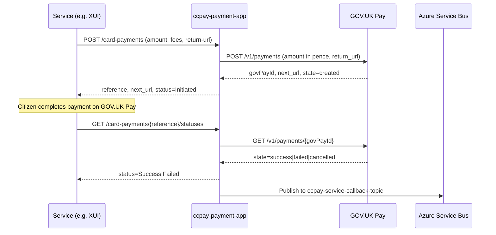
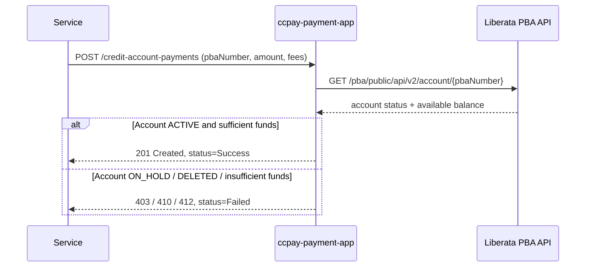
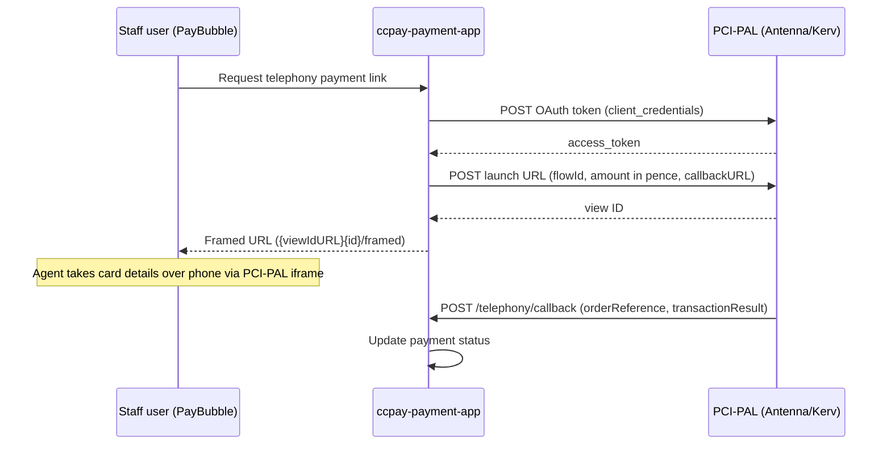

## TL;DR

- A payment in `ccpay-payment-app` transitions through: **Initiated** (created locally) -> **Success / Failed / Declined** (confirmed by the external provider) -> **Reconciled** (pulled by Liberata via `/reconciliation-payments`). Internal DB status `created` maps to display status `Initiated` via `PayStatusToPayHubStatus`.
- Four payment channels: card payments via GOV.UK Pay, PBA (Pay By Account) via Liberata, telephony via PCI-PAL (Antenna or Kerv providers), and bulk scan (cash/cheque/postal order via Exela).
- The **Service Request** model (`PaymentFeeLink`) groups fees, payments, and remissions into a single billable unit tied to a CCD case; its computed status is one of `Paid`, `Partially paid`, `Not paid`, or `Disputed` (calculated by `ServiceRequestUtil.getServiceRequestStatus()`).
<!-- REVIEW: Payment references are NOT generated from a database sequence. They are generated from a UTC timestamp (millis/100) + 4 random digits + Luhn check digit. See model/src/main/java/uk/gov/hmcts/payment/api/util/ReferenceUtil.java:17-33. -->
- Payment references follow the format `RC-XXXX-XXXX-XXXX-XXXX` (generated from a database sequence).
- Payment failures (chargebacks, bounced cheques) are recorded in the `payment_failures` table and trigger service callbacks with dispute details.
- A scheduled job (`PATCH /jobs/card-payments-status-update`) polls GOV.UK Pay for all `created`-status card payments to advance their status and publish callbacks.

## High-level lifecycle stages

A payment progresses through these stages in the Fees & Payments platform:

1. **Fee Identification** -- The service retrieves the applicable fee from the Fees Register API.
2. **Service Request Creation** -- A Service Request (`PaymentFeeLink`) is created to represent the payment requirement for a case.
3. **Payment Initiation** -- The service requests a payment link (card) or submits a payment (PBA/telephony) via the relevant PayHub API endpoint.
4. **Payment Processing** -- The payment is processed by the external provider (GOV.UK Pay, Liberata PBA, or PCI-PAL).
5. **Status Update** -- The provider returns a status; PayHub normalises it via `PayStatusToPayHubStatus` and persists the result.
6. **Payment Allocation (Apportionment)** -- When the `apportion-feature` flag is enabled, `FeePayApportionService.processApportion()` distributes the payment across outstanding fees within the service request.
7. **Service Callback** -- A message is published to `ccpay-service-callback-topic` notifying the consuming service of the outcome.
8. **Case Progression** -- The consuming service uses the callback (or polls status) to trigger the next CCD event.

## Payment channels

### Card payments (GOV.UK Pay)

Card payments follow a redirect-based flow. The caller creates a payment record and receives a GOV.UK Pay `next_url` for the citizen to complete the payment.

**Sequence:**



Key implementation details:

- `POST /card-payments` is handled by `CardPaymentController:115-189`. The `return-url` and `service-callback-url` are passed as request **headers**, not body fields (`CardPaymentController:119-121`).
- Amount is converted to pence via `movePointRight(2).intValue()` inside `GovPayDelegatingPaymentService:46-52`.
- Each consuming service has its own GOV.UK Pay API key, resolved via `ServiceToTokenMap` which maps service names to `gov.pay.auth.key.<name>` config properties.
- The GOV.UK Pay client is protected by Resilience4j circuit breakers (`@CircuitBreaker(name = "createCardPayment")`) — see `GovPayClient:55-66`.
- The `payment-cancel` feature (FF4j flag) gates `POST /card-payments/{reference}/cancel`.
- When the `apportion-feature` LaunchDarkly flag is enabled, `FeePayApportionService.processApportion()` runs after payment creation (`CardPaymentController:183`).

### PBA payments (Liberata)

PBA (Pay By Account) payments are synchronous. The balance check happens at creation time against the Liberata account API.

**Sequence:**



Key implementation details:

- `POST /credit-account-payments` is handled by `CreditAccountPaymentController:117-186`.
- Services listed in `pba.config1.service.names` bypass the Liberata balance check entirely; their payments are created with status `pending` (legacy flow).
- The Liberata call uses OAuth2 password grant (`LiberataService:36-58`) and is wrapped with a Resilience4j `@CircuitBreaker` and `@TimeLimiter` (named `retrievePbaAccountTimeLimiter`) in `AccountServiceImpl.java`.
- Liberata account statuses map to HTTP responses: `DELETED` -> 410, `ON_HOLD` -> 412, `NOT_FOUND` -> 404 (`AccountController:58-77`).
- A duplicate payment check (`paymentValidator.checkDuplication()`) runs before the Liberata call (`CreditAccountPaymentController:161`).
- **Real-time PBA processing**: The platform is transitioning to real-time PBA validation. In the new model, the RC reference is created immediately upon request (before the Liberata call), the payment is set to `Pending`, and the outcome is updated to `Success` or `Failed` based on the real-time Liberata response. This eliminates the need for overnight reconciliation for PBA transactions.
<!-- CONFLUENCE-ONLY: not verified in source -->
- A scheduled job handles the failure mode where transactions remain stuck in `Pending` (e.g. due to network failure or Liberata timeout) by checking pending transactions and bringing them to an end state.

### Telephony payments (PCI-PAL)

Telephony payments use PCI-PAL's hosted payment page, launched in an iframe. Two providers are supported: **Antenna** (strategic — probate, divorce, PRL, IAC) and **Kerv**.

**Sequence:**



Key implementation details:

- The callback arrives as `application/x-www-form-urlencoded` at `POST /telephony/callback` (`TelephonyController:47-53`).
- Per-jurisdiction flow IDs are configured via environment variables for each provider (e.g. `PCI_PAL_ANTENNA_PROBATE_FLOW_ID`). `TelephonySystem.getFlowId(serviceType)` resolves the mapping (`TelephonySystem.java:35-48`).
- The default telephony system is Kerv (`TelephonySystem.DEFAULT_SYSTEM_NAME = "kerv"` at `TelephonySystem.java:33`).
- Amount conversion to pence happens inside `PciPalPaymentService.getTelephonyProviderLink()` (`PciPalPaymentService.java:70-113`).

### Bulk scan payments (Exela)

Bulk scan handles offline payments (cash, cheques, postal orders). These arrive via the Exela scanning pipeline and are processed through `ccpay-bulkscanning-app`, which forwards them to `ccpay-payment-app`.

<!-- CONFLUENCE-ONLY: not verified in source -->
The bulk scan payment channel does not involve user interaction with a payment provider. Payments are allocated to cases based on Document Control Numbers (DCNs) matched against payment records.

Key implementation details:

- `ccpay-bulkscanning-app` receives payment envelopes from the bulk-scan/Exela pipeline and posts them into `ccpay-payment-app` via its bulk-scanning REST API endpoint.
- The `BulkScanningReportController` in `ccpay-payment-app` exposes `GET /payment/bulkscan-data-report` for reporting on bulk scan payment data.
- A LaunchDarkly flag `feature.bulk.scan.payments.check` gates bulk-scan validation logic.

## The Service Request model

The **Service Request** (entity: `PaymentFeeLink`, table: `payment_fee_link`) is the aggregation point that groups one or more fees, payments, and remissions into a single billable unit. It is identified by a `paymentReference` and linked to a CCD case via `ccdCaseNumber`.

Key behavioural characteristics:

- A Service Request remains associated with its case indefinitely and can be used for **multiple payment attempts** without creating duplicate records.
- Failed payment attempts remain associated with the original Service Request, allowing users to retry without creating new ones.
- The Service Request supports all payment channels (card, PBA, telephony, bulk scan) interchangeably.
- The service request reference follows the format `YYYY-XXXXXXXXXXXXX` (year prefix + timestamp-based identifier).

### Creating a service request

`POST /service-request` creates the `PaymentFeeLink` record and immediately publishes a message to the `ccpay-service-request-cpo-update-topic` Azure Service Bus topic (`ServiceRequestController:138-148`). The message payload is a `ServiceRequestCpoDto` containing `action`, `case_id`, `order_reference`, and `responsible_party`, with a message property pointing to `{case-payment-orders.api.url}/case-payment-orders` (`ServiceRequestDomainServiceImpl:534-572`).

### Paying against a service request

Two endpoints allow payment against an existing service request:

| Endpoint | Channel | Notes |
|----------|---------|-------|
| `POST /service-request/{ref}/pba-payments` | PBA | Idempotency-protected via `IdempotencyKeys` entity; checks `requestHashCode` for duplicates (`ServiceRequestController:166-199`) |
| `POST /service-request/{ref}/card-payments` | Card (GOV.UK Pay) | Returns `next_url` for redirect |

For PBA payments against service requests, Liberata error codes map to specific HTTP statuses:

| Liberata code | Meaning | HTTP status |
|---------------|---------|-------------|
| `CA-E0004` | PBA account deleted | 410 Gone |
| `CA-E0003` | PBA account on hold | 412 Precondition Failed |
| `CA-E0001` | Insufficient funds | 402 Payment Required |

### Status callbacks

When a card payment status is retrieved (`GET /card-payments/{internal-reference}/status`), the service publishes the updated status to the `ccpay-service-callback-topic` (`ServiceRequestController:351`). The consuming service's callback URL is stored as `serviceCallbackUrl` on the payment record.

## Case Payment Orders

Case Payment Orders (CPOs) represent the link between a payment/service-request and a CCD case in the Case Payment Orders API (`cpo-case-payment-orders-api`). The flow is:

1. `ccpay-payment-app` publishes a message to `ccpay-service-request-cpo-update-topic` when a service request is created.
2. `ccpay-service-request-cpo-update-service` consumes the topic and calls the CPO API to create/update the order.
3. Dead-letter messages can be reprocessed via `PATCH /jobs/dead-letter-queue-process` (`ServiceRequestController:289-294`), which reads from the subscription's `$deadletterqueue`.

The `case-payment-orders-client` module within `ccpay-payment-app` provides a Feign/RestTemplate client for direct CPO API calls when needed.

## Status progression

### Payment statuses (persisted)

The `payment_status` table holds these values (`PaymentStatus.java`):

| DB status | Description |
|-----------|-------------|
| `created` | Payment record created locally; awaiting provider confirmation |
| `success` | Provider confirmed payment completed |
| `failed` | Provider rejected the payment |
| `cancelled` | Payment cancelled by user or timeout |
| `pending` | PBA config1 services (legacy) — awaiting offline reconciliation |
| `error` | An error occurred during processing |

### Display status mapping (`PayStatusToPayHubStatus`)

GOV.UK Pay / internal statuses are mapped to normalised display values exposed to consuming services:

| Provider status | PayHub display status |
|----------------|----------------------|
| `created` | Initiated |
| `started` | Initiated |
| `submitted` | Initiated |
| `success` | Success |
| `failed` | Failed |
| `cancelled` | Failed |
| `error` | Failed |
| `pending` | Pending |
| `decline` | Declined |

<!-- DIVERGENCE: Confluence (Technical Integration Overview, page 1952815065) lists "Timed Out" as a payment status, but PayStatusToPayHubStatus.java has no such mapping. Source wins. -->

Transient fields on the `Payment` entity (`status`, `finished`, `nextUrl`, `cancelUrl`) are `@Transient` — they are populated from the GOV.UK Pay response on retrieval but are not persisted (`Payment.java:16-184`). The persisted status is held in the `paymentStatus` FK relationship.

### Service Request statuses (computed)

Service Request status is not stored directly but **calculated** by `ServiceRequestUtil.getServiceRequestStatus()` based on the totals of fees, remissions, and successful payments:

| Computed status | Condition |
|----------------|-----------|
| `Disputed` | Any payment on the service request has an active dispute |
| `Paid` | Total payments (minus disputes) >= total fees minus remissions |
| `Partially paid` | Some payments/remissions exist but outstanding amount > 0 |
| `Not paid` | No successful payments and no remissions applied |

## Reconciliation

Liberata (the **Middle Office supplier**) pulls payment data for financial reconciliation via:

- `GET /payments` — filterable by `payment_method`, `service_name`, `ccd_case_number`, `pba_number`, `start_date`, `end_date`
- `GET /reconciliation-payments` — same filters, with additional IAC supplementary info support

These endpoints are exposed through the Azure API Management gateway configured in `ccpay-payment-api-gateway`. They are external-path endpoints requiring S2S authentication only (no IDAM user token).

The reconciliation process ensures that payment records in Fees & Payments match financial transactions from payment providers, discrepancies are identified and investigated, and financial reporting remains accurate. With the move to real-time PBA processing, nightly reconciliation is no longer required for PBA transactions that receive an immediate outcome from Liberata.

## Scheduled status synchronisation

The `PATCH /jobs/card-payments-status-update` endpoint (`MaintenanceJobsController:53-84`) is called by scheduled shell scripts to poll GOV.UK Pay for all payments still in `initiated` status. For each, it calls `delegatingPaymentService.retrieveWithCallBack()` which:

1. Retrieves the current state from GOV.UK Pay.
2. Updates the local payment status.
3. Publishes a callback message to `ccpay-service-callback-topic` if a `serviceCallbackUrl` or `callBackUrl` is configured.

The job uses `topicClientProxy.setKeepClientAlive(true)` for batch efficiency when publishing multiple messages.

## Payment failures (chargebacks and bounced cheques)

Payment failures occur when a previously-successful payment is reversed. These are recorded in the `payment_failures` table (`PaymentFailures.java`) and handled by `PaymentStatusController`.

### Failure types

| Endpoint | Failure type | Description |
|----------|-------------|-------------|
| `POST /payment-failures/bounced-cheque` | Bounced cheque | A cheque payment was returned unpaid |
| `POST /payment-failures/chargeback` | Chargeback | A card payment was disputed and reversed |
| `POST /payment-failures/unprocessed-payment` | Unprocessed | A payment reference update for a failure that could not be matched |
| `PATCH /payment-failures/{failureReference}` | Update (ping 2) | Adds representment outcome to an existing failure |

### Failure entity fields

| Field | Description |
|-------|-------------|
| `failure_reference` | Unique reference for the failure event |
| `payment_reference` | The `RC-XXXX-XXXX-XXXX-XXXX` of the original payment |
| `ccd_case_number` | 16-digit CCD case number |
| `amount` | Disputed/failed amount |
| `failure_type` | Type of failure (chargeback, bounced cheque) |
| `failure_event_date_time` | When the failure occurred |
| `has_amount_debited` | Whether money was debited |
| `representment_success` | Outcome of representment (ping 2) |
| `representment_outcome_date` | Date of representment outcome |
| `dcn` | Document Control Number (bulk scan failures) |

### Behaviour on failure

When a payment failure is recorded:

1. The failure is inserted into `payment_failures`.
2. Any associated refund in progress is cancelled via `cancelFailurePaymentRefund()`.
3. A callback message with `event: 'Payment-Failure'` and a `dispute` section is published to the service callback topic.

The `payment-status-update-flag` LaunchDarkly toggle can disable all failure endpoints by returning `503 Service Unavailable`.

## Service Request cancellation

Service Request cancellation allows the system to prevent payments from being taken after a deadline.

<!-- CONFLUENCE-ONLY: not verified in source -->
This functionality is currently under development. Planned scenarios include:

- **Civil Hearing Trials**: auto-cancel Service Request if payment not made within 28 days
- **Divorce / No Fault Divorce**: auto-cancel after a defined time window

Once cancelled, a Service Request will no longer accept further payment attempts. The final implementation details (how cancellation interacts with partial payments, how it is recorded, and downstream effects) are still being confirmed.

## Azure Service Bus topics

| Topic | Purpose | Publisher | Consumer |
|-------|---------|-----------|----------|
| `ccpay-service-callback-topic` | Notifies service teams of payment status changes | `CallbackServiceImpl`, `ServiceRequestDomainServiceImpl` | Service teams (civil, ia, pcs, etc.) |
| `ccpay-service-request-cpo-update-topic` | Triggers CPO creation/update | `ServiceRequestDomainServiceImpl` | `ccpay-service-request-cpo-update-service` |

<!-- REVIEW: FF4j flag name is wrong. The actual flag name is "payment-callback-service" (from CallbackService.FEATURE in model/src/main/java/uk/gov/hmcts/payment/api/service/CallbackService.java:8), not "service-callback". -->
`CallbackServiceImpl.callback()` (`CallbackServiceImpl.java:46-89`) is a `synchronized` method gated by the FF4j `service-callback` feature flag. It sends messages via `TopicClientProxy` with `serviceCallbackUrl` as a message property.

The callback has two code paths depending on where the callback URL is stored:

1. **`payment.serviceCallbackUrl` is set** (legacy card payments): sends `PaymentDto` JSON — the full payment object including amount, reference, status, fees, and a `_links.self` HATEOAS link.
2. **`paymentFeeLink.callBackUrl` is set** (service-request-based payments): sends `PaymentStatusDto` JSON — a lighter payload containing `service_request_reference`, `ccd_case_number`, `service_request_amount`, `service_request_status`, and a nested `payment` object.

### Callback message format (service-request path)

```json
{
  "service_request_reference": "2022-1648229603982",
  "ccd_case_number": "1648229404992811",
  "service_request_amount": 232,
  "service_request_status": "Paid",
  "payment": {
    "payment_amount": 232,
    "payment_reference": "RC-1648-2296-4212-7303",
    "payment_method": "card",
    "case_reference": "1648229404992811",
    "account_number": ""
  }
}
```

The `event` field in the extended callback format identifies the source workflow:

| Event value | Trigger |
|-------------|---------|
| `PBA-Payment` | PBA payment against a service request |
| `Card-Payment` | Card payment status retrieved |
| `Card-Payment-Status-Update` | Scheduled job status update |
| `Telephony-payment` | PCI-PAL telephony callback |
| `Retro-remission` | Retrospective remission applied |
| `Bulk Scan Payment Allocation` | Bulk scan payment allocated to SR |
| `Payment-Failure` | Chargeback or bounced cheque |

## Error handling considerations

Services integrating with Fees & Payments should handle these scenarios:

- **Duplicate payment requests** — the idempotency mechanism (`IdempotencyKeys` entity, `requestHashCode` check) prevents double-charging on PBA service-request payments. Card payments have separate duplicate detection via `paymentValidator.checkDuplication()`.
- **Payment session expiry** — GOV.UK Pay payment links expire; the scheduled status update job will detect these and transition the payment to `Failed`.
- **Failed redirects** — if the citizen does not complete the GOV.UK Pay journey, the payment stays in `created` status until the scheduled job picks it up.
- **Declined payments** — the `decline` status from the provider maps to display status `Declined`, distinguishing it from hard failures.
- **Payment status delays** — the scheduled job runs periodically (typically within ~15 minutes) to catch any missed status updates.
<!-- CONFLUENCE-ONLY: not verified in source -->
- **Reconciliation discrepancies** — differences between payment provider records and PayHub records are investigated during the reconciliation process with the Middle Office supplier.

## Examples

### GOV.UK Pay status to PayHub display status mapping

```java
// Source: apps/payment/ccpay-payment-app/model/src/main/java/uk/gov/hmcts/payment/api/util/PayStatusToPayHubStatus.java

public enum PayStatusToPayHubStatus {
    created("Initiated"),
    started("Initiated"),
    submitted("Initiated"),
    success("Success"),
    failed("Failed"),
    cancelled("Failed"),
    error("Failed"),
    pending("Pending"),
    decline("Declined");

    @Getter @Setter
    private String mappedStatus;

    PayStatusToPayHubStatus(String status) {
        this.mappedStatus = status;
    }
}
```

### Service callback publishing (two code paths by callback URL location)

```java
// Source: apps/payment/ccpay-payment-app/api/src/main/java/uk/gov/hmcts/payment/api/servicebus/CallbackServiceImpl.java

public synchronized void callback(PaymentFeeLink paymentFeeLink, Payment payment) {
    if (!ff4j.check(CallbackService.FEATURE)) {
        LOG.warn("Service callback feature is disabled");
        return;
    }

    if (null != payment.getServiceCallbackUrl()) {
        // Legacy path: full PaymentDto published; callback URL from payment record
        PaymentDto dto = paymentDtoMapper.toResponseDto(paymentFeeLink, payment);
        Message msg = new Message(objectMapper.writeValueAsString(dto));
        msg.setProperties(Collections.singletonMap(
            "serviceCallbackUrl", payment.getServiceCallbackUrl()));
        topicClient.send(msg);

    } else if (null != paymentFeeLink.getCallBackUrl()) {
        // Ways2Pay path: lighter PaymentStatusDto published; callback URL from SR record
        String serviceRequestStatus =
            paymentGroupDtoMapper.toPaymentGroupDto(paymentFeeLink).getServiceRequestStatus();
        PaymentStatusDto paymentStatusDto =
            paymentDtoMapper.toPaymentStatusDto(paymentFeeLink.getPaymentReference(),
                "", payment, serviceRequestStatus);
        Message msg = new Message(objectMapper.writeValueAsString(paymentStatusDto));
        msg.setProperties(Collections.singletonMap(
            "serviceCallbackUrl", paymentFeeLink.getCallBackUrl()));
        topicClient.send(msg);
    }
}
```

## See also

- [Overview](overview.md) — platform responsibilities, payment channels, and service request model summary
- [GOV.UK Pay Integration](govuk-pay-integration.md) — multi-account key resolution, idempotency logic, and status-polling details
- [PCI-PAL Telephony](pci-pal-telephony.md) — telephony payment lifecycle, Antenna vs Kerv providers, and callback handling
- [Reconciliation](reconciliation.md) — how Liberata pulls data, APIM gateway auth, and scheduled CSV reports
- [Payment Status Callbacks](../reference/payment-status-callbacks.md) — ASB topic schemas, dual callback paths, and `ccpay-functions-node` retry
- [How-to: Troubleshoot Payment Status](../how-to/troubleshoot-payment-status.md) — diagnosing stuck payments, manual callback replay, and DLQ reprocessing
