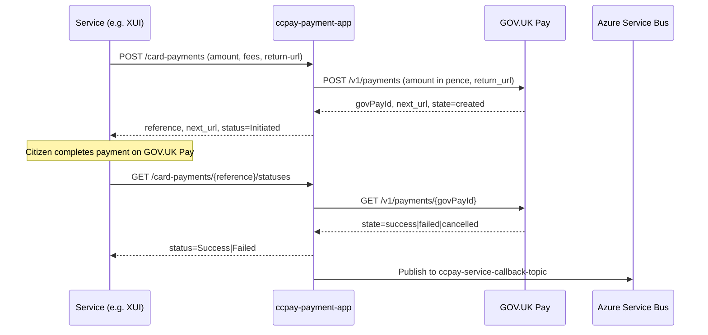
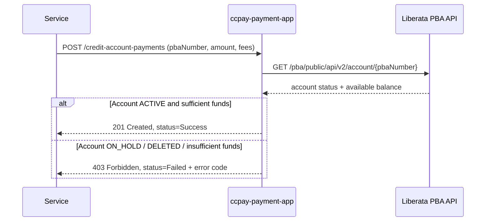
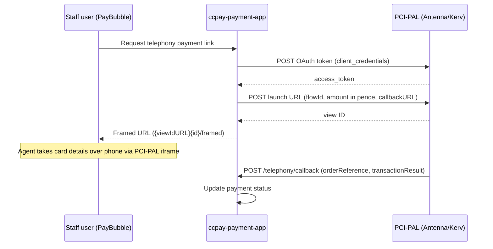

## TL;DR

- A payment in `ccpay-payment-app` transitions through: **Initiated** (created locally) -> **Success / Failed / Declined** (confirmed by the external provider) -> **Reconciled** (pulled by Liberata via `/reconciliation-payments`). Internal DB status `created` maps to display status `Initiated` via `PayStatusToPayHubStatus`.
- Four payment channels: card payments via GOV.UK Pay, PBA (Pay By Account) via Liberata, telephony via PCI-PAL (Antenna or Kerv providers), and bulk scan (cash/cheque/postal order via Exela).
- The **Service Request** model (`PaymentFeeLink`) groups fees, payments, and remissions into a single billable unit tied to a CCD case; its computed status is one of `Paid`, `Partially paid`, `Not paid`, or `Disputed` (calculated by `ServiceRequestUtil.getServiceRequestStatus()`).
- Payment references follow the format `RC-XXXX-XXXX-XXXX-XXXC`, assembled in application code from a UTC timestamp in tenths of a second, four `SecureRandom` digits and a Luhn check digit (`ReferenceUtil:17-33`) — there is no database sequence involved, so two instances generating in the same tenth of a second rely on the random suffix for uniqueness.
- Payment failures (chargebacks, bounced cheques) are recorded in the `payment_failures` table and trigger service callbacks with dispute details.
- A CronJob on `*/30 * * * *` calls `PATCH /jobs/card-payments-status-update`, which polls GOV.UK Pay for every `GOV_PAY` payment not already in a terminal status, advances it and publishes callbacks.

## High-level lifecycle stages

A payment progresses through these stages in the Fees & Payments platform:

1. **Fee Identification** -- The service retrieves the applicable fee from the Fees Register API.
2. **Service Request Creation** -- A Service Request (`PaymentFeeLink`) is created to represent the payment requirement for a case.
3. **Payment Initiation** -- The service requests a payment link (card) or submits a payment (PBA/telephony) via the relevant PayHub API endpoint.
4. **Payment Processing** -- The payment is processed by the external provider (GOV.UK Pay, Liberata PBA, or PCI-PAL).
5. **Status Update** -- The provider returns a status; PayHub normalises it via `PayStatusToPayHubStatus` and persists the result.
6. **Payment Allocation (Apportionment)** -- When the `apportion-feature` flag is enabled, `FeePayApportionService.processApportion()` distributes the payment across outstanding fees within the service request.
7. **Service Callback** -- A message is published to `ccpay-service-callback-topic` notifying the consuming service of the outcome.
8. **Case Progression** -- The consuming service uses the callback (or polls status) to trigger the next CCD event.

## Payment channels

### Card payments (GOV.UK Pay)

Card payments follow a redirect-based flow. The caller creates a payment record and receives a GOV.UK Pay `next_url` for the citizen to complete the payment.

**Sequence:**


```mermaid
sequenceDiagram
    participant Caller as Service (e.g. XUI)
    participant PayAPI as ccpay-payment-app
    participant GovPay as GOV.UK Pay
    participant ASB as Azure Service Bus

    Caller->>PayAPI: POST /card-payments (amount, fees, return-url)
    PayAPI->>GovPay: POST /v1/payments (amount in pence, return_url)
    GovPay-->>PayAPI: govPayId, next_url, state=created
    PayAPI-->>Caller: reference, next_url, status=Initiated

    Note over Caller: Citizen completes payment on GOV.UK Pay

    Caller->>PayAPI: GET /card-payments/{reference}/statuses
    PayAPI->>GovPay: GET /v1/payments/{govPayId}
    GovPay-->>PayAPI: state=success|failed|cancelled
    PayAPI-->>Caller: status=Success|Failed

    PayAPI->>ASB: Publish to ccpay-service-callback-topic
```

Key implementation details:

- `POST /card-payments` is handled by `CardPaymentController:115-189`. The `return-url` and `service-callback-url` are passed as request **headers**, not body fields (`CardPaymentController:119-121`).
- Amount is converted to pence via `movePointRight(2).intValue()` inside `GovPayDelegatingPaymentService:46-52`.
- Each consuming service has its own GOV.UK Pay API key, resolved via `ServiceToTokenMap` which maps service names to `gov.pay.auth.key.<name>` config properties.
- The GOV.UK Pay client is protected by Resilience4j circuit breakers (`@CircuitBreaker(name = "createCardPayment")`) — see `GovPayClient:55-66`.
- `POST /card-payments/{reference}/cancel` delegates straight to `delegatingPaymentService.cancel()` with no feature gate (`CardPaymentController:241-245`); a cancellation GOV.UK Pay refuses surfaces as HTTP 400 (`CardPaymentController:247-250`).
- When the `apportion-feature` LaunchDarkly flag is enabled, `FeePayApportionService.processApportion()` runs after payment creation (`CardPaymentController:183`).

### PBA payments (Liberata)

PBA (Pay By Account) payments are synchronous. The balance check happens at creation time against the Liberata account API.

**Sequence:**


```mermaid
sequenceDiagram
    participant Caller as Service
    participant PayAPI as ccpay-payment-app
    participant Liberata as Liberata PBA API

    Caller->>PayAPI: POST /credit-account-payments (pbaNumber, amount, fees)
    PayAPI->>Liberata: GET /pba/public/api/v2/account/{pbaNumber}
    Liberata-->>PayAPI: account status + available balance
    alt Account ACTIVE and sufficient funds
        PayAPI-->>Caller: 201 Created, status=Success
    else Account ON_HOLD / DELETED / insufficient funds
        PayAPI-->>Caller: 403 Forbidden, status=Failed + error code
    end
```

Key implementation details:

- `POST /credit-account-payments` is handled by `CreditAccountPaymentController:117-186`.
- Services listed in `pba.config1.service.names` bypass the Liberata balance check entirely; their payments are created with status `pending` (legacy flow). The property defaults to `dummy` (`application.properties:218`) and is split into a list at `CreditAccountPaymentController:81` and matched at `CreditAccountPaymentController:120`; the branch that sets `pending` without calling Liberata is at `CreditAccountPaymentController:158-162`, carrying a source comment marking it removable "once all Services are on-boarded to PBA Config 2".
- The Liberata call uses OAuth2 password grant (`LiberataService:36-58`) and is wrapped with a Resilience4j `@CircuitBreaker` and `@TimeLimiter` (named `retrievePbaAccountTimeLimiter`) in `AccountServiceImpl.java`.
- On this endpoint every unusable-account outcome collapses to a single HTTP status: insufficient funds, on hold and deleted all produce a `failed` payment and HTTP 403, so the caller must read the `CA-E000x` code from the status history in the response body to tell them apart (`PBAStatusErrorMapper:23-56`; `CreditAccountPaymentController:168-171`). An account lookup that 4xx-es at Liberata gives 404 and an unreachable Liberata gives 504 (`CreditAccountPaymentController:149-155`).
- The distinct account statuses are only surfaced as distinct HTTP codes by the standalone lookup `GET /accounts/{accountNumber}`: `DELETED` -> 410 and `ON_HOLD` -> 412 (`AccountController:65-69`), with `AccountNotFoundException` mapped to 404 by that controller's own handler (`AccountController:109-110`).
- The duplicate payment check (`checkDuplication()`) runs *after* the Liberata call and after the status has been set, immediately before persistence (`CreditAccountPaymentController:164`) — a duplicate request still costs a Liberata round-trip.
- **Real-time PBA processing (in design)**: the Real Time PBA Payments HLD describes moving PBA off the two-step "validate now, settle overnight" model. In the designed flow the RC reference is created immediately upon request (before the Liberata call), the payment is set to `Pending`, and the outcome is updated to `Success` or `Failed` from a single Liberata call that both validates the account and debits it. That removes the need for nightly reconciliation of PBA transactions, so real-time PBA payments would be excluded from `/reconciliation-payments`. The design also retires `POST /credit-account-payments` (see [Architecture](architecture.md#real-time-pba-processing-in-design) for the full picture, including the change of Liberata auth scheme and the IAC fail-closed behaviour).
<!-- CONFLUENCE-ONLY: design-only. Verified absent from source at origin/master: LiberataService (model module) exposes only getAccessToken() over an OAuth2 password grant, there is no pbaPayment() method anywhere, and application.properties:81-90 still configures the v2 account-lookup URL. -->
- A scheduled job would handle the failure mode where transactions remain stuck in `Pending` (e.g. due to network failure or Liberata timeout) by checking pending transactions and bringing them to an end state. No such job exists in source today.
<!-- CONFLUENCE-ONLY: design-only, part of the Real Time PBA HLD. -->

### Telephony payments (PCI-PAL)

Telephony payments use PCI-PAL's hosted payment page, launched in an iframe. Two provider configurations exist as Spring components — **Antenna** (`antenna`) and **Kerv** (`kerv`) — each reading credentials and flow IDs from its own property prefix. Only Kerv is reachable through `POST /payment-groups/{payment-group-reference}/telephony-card-payments`: a missing or empty `telephonySystem` defaults to `kerv` and any other value raises a `TelephonyServiceException` (`PaymentGroupController:629-638`).

**Sequence:**


```mermaid
sequenceDiagram
    participant Staff as Staff user (PayBubble)
    participant PayAPI as ccpay-payment-app
    participant PCI as PCI-PAL (Antenna/Kerv)

    Staff->>PayAPI: Request telephony payment link
    PayAPI->>PCI: POST OAuth token (client_credentials)
    PCI-->>PayAPI: access_token
    PayAPI->>PCI: POST launch URL (flowId, amount in pence, callbackURL)
    PCI-->>PayAPI: view ID
    PayAPI-->>Staff: Framed URL ({viewIdURL}{id}/framed)

    Note over Staff: Agent takes card details over phone via PCI-PAL iframe

    PCI->>PayAPI: POST /telephony/callback (orderReference, transactionResult)
    PayAPI->>PayAPI: Update payment status
```

Key implementation details:

- The callback arrives as `application/x-www-form-urlencoded` at `POST /telephony/callback` (`TelephonyController:47-53`).
- Flow IDs are keyed by service type, not by provider. `TelephonySystem.getFlowId(serviceType)` recognises only `Probate`, `Divorce`, `Specified Money Claims`, `Financial Remedy`, `Family Private Law` and `Immigration and Asylum Appeals`, and throws a `PaymentException` for anything else (`TelephonySystem:35-48`) — a service outside that set cannot take a telephony payment at all. `Specified Money Claims` and `Financial Remedy` share the `strategic` flow ID.
- The default telephony system is Kerv (`TelephonySystem.DEFAULT_SYSTEM_NAME = "kerv"` at `TelephonySystem:33`).
- The `transactionResult` from the callback is lower-cased and looked up directly against the `payment_status` table, so a value that is not a seeded status name fails the lookup (`PaymentServiceImpl:114-119`). A payment already in `success` is left alone and the attempt is recorded as a `DUPLICATE_STATUS_UPDATE` audit event (`PaymentServiceImpl:139-147`).
- Amount conversion to pence happens inside `PciPalPaymentService.getTelephonyProviderLink()` (`PciPalPaymentService.java:70-113`).

### Bulk scan payments (Exela)

Bulk scan handles offline payments (cash, cheques, postal orders). These arrive via the Exela scanning pipeline and are processed through `ccpay-bulkscanning-app`, which forwards them to `ccpay-payment-app`.

The bulk scan channel involves no payment provider at all. `paymentProvider` is populated only if the request supplies an `externalProvider`, and the payment status comes straight out of the request body rather than from any provider response (`PaymentGroupController:400`). The Document Control Number is the identity that ties a scanned slip to a payment: it is stored on the payment record (`PaymentGroupController:405`) and is the key used both to reject a second record for the same slip (`PaymentGroupController:378-383`, `PaymentGroupController:450-455`) and to mark the slip processed back in `ccpay-bulkscanning-app` (`PaymentGroupController:515`, `PaymentGroupController:543`).

Key implementation details:

- `ccpay-bulkscanning-app` receives payment envelopes from the bulk-scan/Exela pipeline and posts them into `ccpay-payment-app` via its bulk-scanning REST API endpoint.
- Four endpoints record bulk scan payments: `POST /payment-groups/{payment-group-reference}/bulk-scan-payments` and `POST /payment-groups/bulk-scan-payments` (`PaymentGroupController:250`, `PaymentGroupController:312`), plus the `-strategic` variants at `PaymentGroupController:368` and `PaymentGroupController:441`. The unsolicited variants generate their own payment-group reference.
- Both strategic endpoints are wholly gated by the `prod-strategic-fix` LaunchDarkly flag (`PaymentGroupController:375`, `PaymentGroupController:447`). With the flag off they reject the request with `PaymentException("This feature is not available to use !!!")`, which the controller maps to HTTP 400 (`PaymentGroupController:429-431`, `PaymentGroupController:725-729`) — the DCN de-duplication lives inside the same gated block, so it is only in force when the flag is on.
- After the payment is created, `allocateThePaymentAndMarkBulkScanPaymentAsProcessed` attaches the request's `PaymentAllocationDto` to the payment and PATCHes `/bulk-scan-payments/{dcn}/status/PROCESSED` on `ccpay-bulkscanning-app` with a freshly generated S2S token (`PaymentGroupController:495-544`). A failure on that call throws, so the whole record-payment request fails rather than leaving the slip un-marked.
- The `BulkScanningReportController` in `ccpay-payment-app` exposes `GET /payment/bulkscan-data-report` for reporting on bulk scan payment data.

## The Service Request model

The **Service Request** (entity: `PaymentFeeLink`, table: `payment_fee_link`) is the aggregation point that groups one or more fees, payments, and remissions into a single billable unit. It is identified by a `paymentReference` and linked to a CCD case via `ccdCaseNumber`.

Key behavioural characteristics:

- A Service Request remains associated with its case indefinitely and can be used for **multiple payment attempts** without creating duplicate records.
- Failed payment attempts remain associated with the original Service Request, allowing users to retry without creating new ones.
- The Service Request supports all payment channels (card, PBA, telephony, bulk scan) interchangeably.
- The service request reference follows the format `YYYY-XXXXXXXXXXXXX` (year prefix + timestamp-based identifier).

### Creating a service request

`POST /service-request` creates the `PaymentFeeLink` record and immediately publishes a message to the `ccpay-service-request-cpo-update-topic` Azure Service Bus topic (`ServiceRequestController:138-148`). The message payload is a `ServiceRequestCpoDto` containing `action`, `case_id`, `order_reference`, and `responsible_party`, with a message property pointing to `{case-payment-orders.api.url}/case-payment-orders` (`ServiceRequestDomainServiceImpl:534-572`).

### Paying against a service request

Two endpoints allow payment against an existing service request:

| Endpoint | Channel | Notes |
|----------|---------|-------|
| `POST /service-request/{ref}/pba-payments` | PBA | Idempotency-protected via `IdempotencyKeys` entity; checks `requestHashCode` for duplicates (`ServiceRequestController:166-199`) |
| `POST /service-request/{ref}/card-payments` | Card (GOV.UK Pay) | Returns `next_url` for redirect |

For PBA payments against service requests, Liberata error codes map to specific HTTP statuses:

| Liberata code | Meaning | HTTP status |
|---------------|---------|-------------|
| `CA-E0004` | PBA account deleted | 410 Gone |
| `CA-E0003` | PBA account on hold | 412 Precondition Failed |
| `CA-E0001` | Insufficient funds | 402 Payment Required |

The codes are raised in `PBAStatusErrorMapper.java:31,44,52` and translated to HTTP statuses in `ServiceRequestController.java:223-227`.

Under the designed real-time PBA model these codes would arrive differently: Liberata's payment API returns HTTP 403 with a body-level reason code rather than distinct HTTP statuses, so PayHub would map 403/1 to 402 `CA-E0001` and 403/4 to 412 `CA-E0003`. The `CA-E0004`/410 case is not part of that mapping.
<!-- CONFLUENCE-ONLY: design-only, from the Real Time PBA Payments HLD/LLD. Source today reads Liberata's account-lookup response, not a payment-API error body. -->

### Status callbacks

When a card payment status is retrieved (`GET /card-payments/{internal-reference}/status`), the handler refreshes the payment from GOV.UK Pay and then publishes a `PaymentStatusDto` to the callback topic itself via `sendMessageToTopic` (`ServiceRequestController:351-358`). This endpoint requires the payment to have apportionment records: if `findByPaymentId` returns an empty list it throws `PaymentNotSuccessException`, which the controller maps to HTTP 400 with the message "Payment is not successful" (`ServiceRequestController:342-345`, `ServiceRequestController:365-369`) — a caller polling too early gets a 400 rather than an in-progress status.

## Case Payment Orders

Case Payment Orders (CPOs) represent the link between a payment/service-request and a CCD case in the Case Payment Orders API (`cpo-case-payment-orders-api`). The flow is:

1. `ccpay-payment-app` publishes a message to `ccpay-service-request-cpo-update-topic` when a service request is created.
2. `ccpay-service-request-cpo-update-service` consumes the topic and calls the CPO API to create/update the order.
3. Dead-letter messages can be reprocessed via `PATCH /jobs/dead-letter-queue-process` (`ServiceRequestController:289-294`), which reads from the subscription's `$deadletterqueue`.

The `case-payment-orders-client` module within `ccpay-payment-app` provides a Feign/RestTemplate client for direct CPO API calls when needed.

## Status progression

### Payment statuses (persisted)

The `payment_status` table is seeded by Liquibase with nine rows:

| DB status | Seeded description | Seeded by |
|-----------|--------------------|-----------|
| `created` | Valid payment instructions entered and recorded successfully | `db.changelog-refdata.yaml:23` |
| `success` | Valid payment details and user successfully made payment | `db.changelog-refdata.yaml:24` |
| `failed` | Invalid payment details/unsuccessful payment | `db.changelog-refdata.yaml:25` |
| `cancelled` | User cancels session | `db.changelog-refdata.yaml:26` |
| `error` | Missing payment parameters | `db.changelog-refdata.yaml:27` |
| `submitted` | Payment submitted | `db.changelog-refdata.yaml:128` |
| `started` | Payment started and awaiting card details | `db.changelog-0.0.6.yaml:11` |
| `pending` | Payment awaiting confirmation from external provider | `db.changelog-0.0.8.yaml:19` |
| `decline` | Payment declined | `db.changelog-0.0.9.yaml:179` |

`PaymentStatus.java:19-24` declares constants for six of them — `CREATED`, `SUCCESS`, `CANCELLED`, `PENDING`, `ERROR` and `FAILED`. `started`, `submitted` and `decline` exist only as reference-data rows and are reached by name lookup (for example `paymentStatusRepository.findByNameOrThrow(status)` on the telephony callback path, `PaymentServiceImpl:119`), so those three are only as safe as the Liquibase seed.

`pending` is set on a PBA payment whose service is listed in `pba.config1.service.names`; that branch skips the Liberata check entirely and leaves the payment for offline reconciliation (`CreditAccountPaymentController:158-162`).

### Display status mapping (`PayStatusToPayHubStatus`)

GOV.UK Pay / internal statuses are mapped to normalised display values exposed to consuming services:

| Provider status | PayHub display status |
|----------------|----------------------|
| `created` | Initiated |
| `started` | Initiated |
| `submitted` | Initiated |
| `success` | Success |
| `failed` | Failed |
| `cancelled` | Failed |
| `error` | Failed |
| `pending` | Pending |
| `decline` | Declined |

<!-- DIVERGENCE: Confluence (Technical Integration Overview, page 1952815065) lists "Timed Out" as a payment status, but PayStatusToPayHubStatus.java has no such mapping. Source wins. -->

Transient fields on the `Payment` entity (`status`, `finished`, `nextUrl`, `cancelUrl`) are `@Transient` — they are populated from the GOV.UK Pay response on retrieval but are not persisted (`Payment.java:16-184`). The persisted status is held in the `paymentStatus` FK relationship.

### Service Request statuses (computed)

Service Request status is not stored directly but **calculated** by `ServiceRequestUtil.getServiceRequestStatus()` based on the totals of fees, remissions, and successful payments:

| Computed status | Condition |
|----------------|-----------|
| `Disputed` | Any payment on the service request has an active dispute |
| `Paid` | Total payments (minus disputes) >= total fees minus remissions |
| `Partially paid` | Some payments/remissions exist but outstanding amount > 0 |
| `Not paid` | No successful payments and no remissions applied |

## Reconciliation

Liberata (the **Middle Office supplier**) pulls payment data for financial reconciliation via:

- `GET /payments` — filterable by `payment_method`, `service_name`, `ccd_case_number`, `pba_number`, `start_date`, `end_date`
- `GET /reconciliation-payments` — same filters, with additional IAC supplementary info support

These endpoints are exposed through the Azure API Management gateway configured in `ccpay-payment-api-gateway`. They are external-path endpoints requiring S2S authentication only (no IDAM user token).

The reconciliation process ensures that payment records in Fees & Payments match financial transactions from payment providers, discrepancies are identified and investigated, and financial reporting remains accurate. All PBA payments go through it today. The designed real-time PBA model would take PBA transactions that receive an immediate outcome from Liberata out of scope — the HLD proposes excluding them from `/reconciliation-payments` behind a new environment toggle — but nothing in source does that yet.

## Scheduled status synchronisation

The `PATCH /jobs/card-payments-status-update` endpoint (`MaintenanceJobsController:53-84`) is driven by a CronJob on `*/30 * * * *` in production (`cnp-flux-config:apps/fees-pay/status-payment-job/status-payment-job.yaml:11`). Its candidate set comes from `listInitiatedStatusPaymentsReferences()`, which selects payments whose provider is `GOV_PAY` and whose status is *not* already `success`, `failed`, `error` or `cancelled`, created more than `callback.payments.cutoff.time.in.minutes` ago (`PaymentServiceImpl:167-173`, `PaymentServiceImpl:62-63`). That property defaults to `0` (`application.properties:204`), so with no environment override there is no quiet period. The provider filter excludes PCI-PAL and PBA payments outright.

For each reference, it calls `delegatingPaymentService.retrieveWithCallBack()` which:

1. Retrieves the current state from GOV.UK Pay.
2. Updates the local payment status.
3. Publishes a callback message to `ccpay-service-callback-topic` if a `serviceCallbackUrl` or `callBackUrl` is configured.

The job uses `topicClientProxy.setKeepClientAlive(true)` for batch efficiency when publishing multiple messages.

## Payment failures (chargebacks and bounced cheques)

Payment failures occur when a previously-successful payment is reversed. These are recorded in the `payment_failures` table (`PaymentFailures.java`) and handled by `PaymentStatusController`.

### Failure types

| Endpoint | Failure type | Description |
|----------|-------------|-------------|
| `POST /payment-failures/bounced-cheque` | Bounced cheque | A cheque payment was returned unpaid |
| `POST /payment-failures/chargeback` | Chargeback | A card payment was disputed and reversed |
| `POST /payment-failures/unprocessed-payment` | Unprocessed | A payment reference update for a failure that could not be matched |
| `PATCH /payment-failures/{failureReference}` | Update (ping 2) | Adds representment outcome to an existing failure |

### Failure entity fields

| Field | Description |
|-------|-------------|
| `failure_reference` | Unique reference for the failure event |
| `payment_reference` | The `RC-XXXX-XXXX-XXXX-XXXX` of the original payment |
| `ccd_case_number` | 16-digit CCD case number |
| `amount` | Disputed/failed amount |
| `failure_type` | Type of failure (chargeback, bounced cheque) |
| `failure_event_date_time` | When the failure occurred |
| `has_amount_debited` | Whether money was debited |
| `representment_success` | Outcome of representment (ping 2) |
| `representment_outcome_date` | Date of representment outcome |
| `dcn` | Document Control Number (bulk scan failures) |

### Behaviour on failure

When a payment failure is recorded:

1. The failure is inserted into `payment_failures`.
2. Any associated refund in progress is cancelled via `cancelFailurePaymentRefund()`.
3. A callback message with `event: 'Payment-Failure'` and a `dispute` section is published to the service callback topic.

The `payment-status-update-flag` LaunchDarkly toggle can disable all failure endpoints by returning `503 Service Unavailable`.

## Service Request cancellation

Service Request cancellation allows the system to prevent payments from being taken after a deadline.

<!-- CONFLUENCE-ONLY: not verified in source -->
This functionality is currently under development. Planned scenarios include:

- **Civil Hearing Trials**: auto-cancel Service Request if payment not made within 28 days
- **Divorce / No Fault Divorce**: auto-cancel after a defined time window

Once cancelled, a Service Request will no longer accept further payment attempts. The final implementation details (how cancellation interacts with partial payments, how it is recorded, and downstream effects) are still being confirmed.

## Azure Service Bus topics

| Topic | Purpose | Publisher | Consumer |
|-------|---------|-----------|----------|
| `ccpay-service-callback-topic` | Notifies service teams of payment status changes | `CallbackServiceImpl`, `ServiceRequestDomainServiceImpl` | Service teams (civil, ia, pcs, etc.) |
| `ccpay-service-request-cpo-update-topic` | Triggers CPO creation/update | `ServiceRequestDomainServiceImpl` | `ccpay-service-request-cpo-update-service` |

`CallbackServiceImpl.callback()` (`CallbackServiceImpl.java:42-79`) is a `synchronized` method with no feature gate — publishing is unconditional once a callback URL is present. It sends messages via `TopicClientProxy` with `serviceCallbackUrl` as a message property. Serialisation or send failures are swallowed: the `catch` blocks only set the thread's interrupt flag and return, so a payment can reach a terminal status with its callback silently undelivered (`CallbackServiceImpl.java:56-58`, `CallbackServiceImpl.java:75-77`).

The callback has two code paths depending on where the callback URL is stored:

1. **`payment.serviceCallbackUrl` is set** (legacy card payments): sends `PaymentDto` JSON — the full payment object including amount, reference, status, fees, and a `_links.self` HATEOAS link.
2. **`paymentFeeLink.callBackUrl` is set** (service-request-based payments): sends `PaymentStatusDto` JSON — a lighter payload containing `service_request_reference`, `ccd_case_number`, `service_request_amount`, `service_request_status`, and a nested `payment` object.

### Callback message format (service-request path)

```json
{
  "service_request_reference": "2022-1648229603982",
  "ccd_case_number": "1648229404992811",
  "service_request_amount": 232,
  "service_request_status": "Paid",
  "payment": {
    "payment_amount": 232,
    "payment_reference": "RC-1648-2296-4212-7303",
    "payment_method": "card",
    "case_reference": "1648229404992811",
    "account_number": ""
  }
}
```

The `event` field in the extended callback format identifies the source workflow:

| Event value | Trigger |
|-------------|---------|
| `PBA-Payment` | PBA payment against a service request |
| `Card-Payment` | Card payment status retrieved |
| `Card-Payment-Status-Update` | Scheduled job status update |
| `Telephony-payment` | PCI-PAL telephony callback |
| `Retro-remission` | Retrospective remission applied |
| `Bulk Scan Payment Allocation` | Bulk scan payment allocated to SR |
| `Payment-Failure` | Chargeback or bounced cheque |

## Error handling considerations

Services integrating with Fees & Payments should handle these scenarios:

- **Duplicate payment requests** — the idempotency mechanism (`IdempotencyKeys` entity, `requestHashCode` check) prevents double-charging on PBA service-request payments. Card payments have separate duplicate detection via `paymentValidator.checkDuplication()`. A recorded response is only replayable — i.e. the caller may retry the same idempotency key — for the statuses in `IdempotencyServiceImpl.HTTP_CODE_ALLOWABLE_RETRIES`, which at `origin/master` is `{ 504, 500, 412, 402, 410 }` (`IdempotencyServiceImpl.java:20`). Anything else is treated as a settled outcome and returned as-is.
<!-- DIVERGENCE: The Real Time PBA Payments LLD states this array is {504, 500, 412, 402} and that "the only HTTP code missing is HTTP 410 for deleted accounts". Source already includes 410, so that gap has been closed. Source wins. -->
- **Payment session expiry** — GOV.UK Pay payment links expire; the scheduled status update job will detect these and transition the payment to `Failed`.
- **Failed redirects** — if the citizen does not complete the GOV.UK Pay journey, the payment stays in `created` status until the scheduled job picks it up.
- **Declined payments** — the `decline` status from the provider maps to display status `Declined`, distinguishing it from hard failures.
- **Payment status delays** — the status-update CronJob runs every thirty minutes (`cnp-flux-config:apps/fees-pay/status-payment-job/status-payment-job.yaml:11`), so a service relying on the callback alone can wait that long for a missed status.
- **Reconciliation discrepancies** — differences between payment provider records and PayHub records are investigated during the reconciliation process with the Middle Office supplier.
<!-- CONFLUENCE-ONLY: not verified in source -->

## Examples

### GOV.UK Pay status to PayHub display status mapping

```java
// Source: apps/payment/ccpay-payment-app/model/src/main/java/uk/gov/hmcts/payment/api/util/PayStatusToPayHubStatus.java

public enum PayStatusToPayHubStatus {
    created("Initiated"),
    started("Initiated"),
    submitted("Initiated"),
    success("Success"),
    failed("Failed"),
    cancelled("Failed"),
    error("Failed"),
    pending("Pending"),
    decline("Declined");

    @Getter @Setter
    private String mappedStatus;

    PayStatusToPayHubStatus(String status) {
        this.mappedStatus = status;
    }
}
```

### Service callback publishing (two code paths by callback URL location)

```java
// Source: apps/payment/ccpay-payment-app/api/src/main/java/uk/gov/hmcts/payment/api/servicebus/CallbackServiceImpl.java

public synchronized void callback(PaymentFeeLink paymentFeeLink, Payment payment) {
    if (null != payment.getServiceCallbackUrl()) {
        // Legacy path: full PaymentDto published; callback URL from payment record
        try {
            PaymentDto dto = paymentDtoMapper.toResponseDto(paymentFeeLink, payment);
            LOG.info("PaymentDto: {}", dto);

            Message msg = new Message(objectMapper.writeValueAsString(dto));

            msg.setContentType("application/json");
            msg.setLabel("Service Callback Message");
            msg.setProperties(Collections.singletonMap("serviceCallbackUrl", payment.getServiceCallbackUrl()));

            topicClient.send(msg);

        } catch (Exception e) {
            Thread.currentThread().interrupt();
        }
    } else if (null != paymentFeeLink.getCallBackUrl()) {
        // Ways2Pay path: lighter PaymentStatusDto published; callback URL from SR record
        try {
            String serviceRequestStatus =
                    paymentGroupDtoMapper.toPaymentGroupDto(paymentFeeLink).getServiceRequestStatus();
            PaymentStatusDto paymentStatusDto =
                    paymentDtoMapper.toPaymentStatusDto(paymentFeeLink.getPaymentReference(), "", payment,
                            serviceRequestStatus);
            LOG.info("PaymentStatusDto: {}", paymentStatusDto);
            Message msg = new Message(objectMapper.writeValueAsString(paymentStatusDto));

            msg.setContentType("application/json");
            msg.setLabel("Service Callback Message");
            msg.setProperties(Collections.singletonMap("serviceCallbackUrl", paymentFeeLink.getCallBackUrl()));

            topicClient.send(msg);

        } catch (Exception e) {
            Thread.currentThread().interrupt();
        }
    }
}
```

## See also

- [Overview](overview.md) — platform responsibilities, payment channels, and service request model summary
- [GOV.UK Pay Integration](govuk-pay-integration.md) — multi-account key resolution, idempotency logic, and status-polling details
- [PCI-PAL Telephony](pci-pal-telephony.md) — telephony payment lifecycle, Antenna vs Kerv providers, and callback handling
- [Reconciliation](reconciliation.md) — how Liberata pulls data, APIM gateway auth, and scheduled CSV reports
- [Payment Status Callbacks](../reference/payment-status-callbacks.md) — ASB topic schemas, dual callback paths, and `ccpay-callback-function` retry
- [How-to: Troubleshoot Payment Status](../how-to/troubleshoot-payment-status.md) — diagnosing stuck payments, manual callback replay, and DLQ reprocessing
