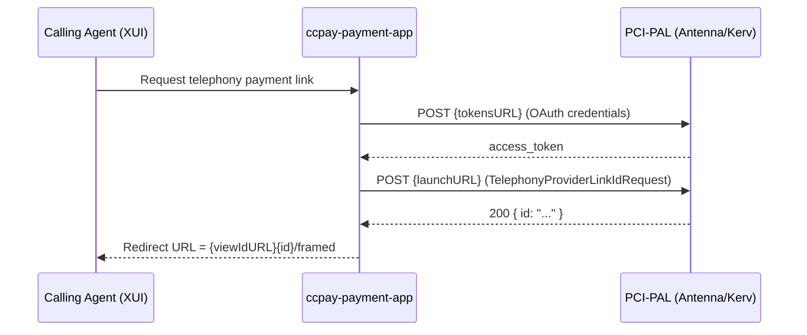

## TL;DR

- PCI-PAL is the telephony card-payment provider used by HMCTS for agent-assisted phone payments at CTSCs, integrated via `ccpay-payment-app`. The underlying call-centre infrastructure has migrated from 8x8 to Antenna to Kerv (Nexus/Genesis).
- Two provider implementations exist: **Antenna** (legacy) and **Kerv** (current default, enforced by `validateDefaultTelephonySystem`). PayBubble exposes system selection behind the `pci-pal.telephony-selection` config value, set from the `TELEPHONY_FEATURE` environment variable (`ccpay-bubble:config/custom-environment-variables.yaml:14`, `ccpay-bubble:express/mvc/controller/PayhubController.js:52-67`).
- Each provider has its own OAuth2 credentials and per-jurisdiction **flow IDs** that route calls to the correct PCI-PAL payment form. The payment gateway under PCI-PAL is Barclays ePDQ.
- The launch flow: acquire OAuth token, POST to the provider's launch URL with payment details, build a redirect URL from the response. Kerv uses a hash of the logged-in IDAM user ID as the username; Antenna uses a static secret.
- PCI-PAL posts results back via APIM to `POST /telephony/callback` as form-urlencoded data containing `orderReference` and `transactionResult` (SUCCESS, DECLINE, ERROR, CANCELLED).
- Telephony payments must cover all outstanding fees for a case; partial telephony payments are not permitted.

## Business Context

PCI-PAL was selected by the HMCTS Reform Programme to allow telephone payments to be captured in a PCI-compliant way at Courts and Tribunals Service Centres (CTSCs). PCI-PAL itself is the payment-capture layer; the underlying telephony infrastructure (call-centre backbone) has evolved through three generations:

1. **8x8** -- original system (decommissioned)
2. **Antenna** (Fournet) -- introduced ~2020, now legacy
3. **Kerv** (Nexus/Genesis) -- current strategic system

From `ccpay-payment-app`'s perspective, the PCI-PAL API contracts are the same regardless of which telephony backbone is active. What changes per system is: the PCI-PAL tenant, OAuth credentials, flow IDs, and launch/view URLs.

<!-- CONFLUENCE-ONLY: not verified in source -->
Telephony payments are typically used when: a citizen is digitally averse, a previous online card payment has failed, the citizen is signposted to the CTSC, or a supplementary fee is required in a service journey that does not yet support online payments.

## Providers: Antenna and Kerv

`ccpay-payment-app` abstracts telephony providers behind an inheritance hierarchy rooted at `TelephonySystem` (`model/src/main/java/uk/gov/hmcts/payment/api/service/TelephonySystem.java:19`). Two concrete implementations exist:

| Provider | Class | System Name | Status | Jurisdictions |
|----------|-------|-------------|--------|---------------|
| Antenna | `AntennaTelephonySystem` | `"antenna"` | Fully configured but unreachable — the request validator rejects `"antenna"` | Probate, Divorce, Specified Money Claims, Financial Remedy, Family Private Law, Immigration and Asylum Appeals |
| Kerv | `KervTelephonySystem` | `"kerv"` | Active default | Same set, different flow IDs |

Both providers expose the same interface methods: `getTokensURL()`, `getLaunchURL()`, `getViewIdURL()`, and `getFlowId(serviceType)`.

### System Selection Logic

The telephony system is selected via the `telephony_system` JSON body parameter on the `POST /payment-groups/{payment-group-reference}/telephony-card-payments` endpoint (`PaymentGroupController.java`):

1. **`validateDefaultTelephonySystem()`** (defined at `PaymentGroupController.java:629-639`, called at `:562`) runs first. If `telephony_system` is null or empty it is set to `"kerv"` (`:632-634`). If the value is anything other than `"kerv"` it throws `TelephonyServiceException("Invalid telephony system name")`, which maps to HTTP 422 (`:636-637`, handler at `:737-741`). This enforces Kerv-only at the validation gate.
2. **`getTelephonySystem()`** (`PaymentGroupController.java:641-659`) then resolves the `TelephonySystem` bean. If the value is `"kerv"` it returns `kervTelephonySystem`; otherwise it falls back to `antennaTelephonySystem` (`:645`, `:654-656`). Its own guard against unrecognised names (`:647-651`) is unreachable, because validation has already rejected everything except `"kerv"`.

<!-- DIVERGENCE: Confluence (Kerv Telephony LLD, page 1859518531) says both systems should be selectable via the radio buttons and the backend defaults to antenna if telephony_system is missing. But source (PaymentGroupController.java:629-639) shows validateDefaultTelephonySystem defaults a missing value to kerv and throws TelephonyServiceException (422) for any other value. Source wins -- Antenna is currently blocked. -->

PayBubble presents system selection radio buttons (displaying "Antenna" and "Trinity" for Kerv) when `getPciPalTelephonyConf()` returns true, which happens only if the `pci-pal.telephony-selection` config value equals `enabled` (`ccpay-bubble:express/mvc/controller/PayhubController.js:52-67`). That value comes from the `TELEPHONY_FEATURE` environment variable (`ccpay-bubble:config/custom-environment-variables.yaml:14`), which is set to `enabled` in production (`cnp-flux-config:apps/fees-pay/ccpay-bubble-frontend/prod.yaml:25`). The consequence is that production agents are offered an Antenna radio button whose selection the API answers with HTTP 422.

### Username Handling

The username passed in the OAuth token request differs by system (`PaymentGroupController.java:600`):

- **Kerv**: `getIdamUserId()` resolves the caller's IDAM `sub` from the request headers and returns `String.valueOf(Objects.hash(idamUserId))` — the value sent to PCI-PAL is a hash of the ID, not the ID itself (`PaymentGroupController.java:673-686`, hash at `:678`)
- **Antenna**: uses a static secret from `pci-pal.antenna.user.name` / `PCI_PAL_ANTENNA_USER_NAME`, injected at `PaymentGroupController.java:142-143`

The hash is not reversible, so the username reaching PCI-PAL cannot be turned back into an IDAM ID; tracing a telephony payment to the staff member who took the call has to be done from the `ccpay-payment-app` side.

## OAuth2 Token Acquisition

Before launching a payment session, the service obtains an OAuth2 access token from the provider. This is the first of two PCI-PAL API calls made by the backend.

`PciPalPaymentService.getPaymentProviderAuthorisationTokens()` (`PciPalPaymentService.java:116-132`) POSTs a URL-encoded form to the provider's token endpoint with:

| Field | Source |
|-------|--------|
| `grant_type` | `PCI_PAL_ANTENNA_GRANT_TYPE` or `PCI_PAL_KERV_GRANT_TYPE` (configurable, typically `client_credentials`) |
| `tenantname` | `PCI_PAL_ANTENNA_TENANT_NAME` / `PCI_PAL_KERV_TENANT_NAME` |
| `username` | Hash of the caller's IDAM ID (Kerv) or static secret `PCI_PAL_ANTENNA_USER_NAME` (Antenna) |
| `client_id` | `PCI_PAL_ANTENNA_CLIENT_ID` / `PCI_PAL_KERV_CLIENT_ID` |
| `client_secret` | `PCI_PAL_ANTENNA_CLIENT_SECRET` / `PCI_PAL_KERV_CLIENT_SECRET` |

The token URL is provider-specific: `PCI_PAL_ANTENNA_GET_TOKENS_URL` and `PCI_PAL_KERV_GET_TOKENS_URL` respectively.

The response returns an `accessToken` and `refreshToken`. The access token expires after approximately 5 minutes (299 seconds), but this timeout applies only to the API calls, not to the payment page session once loaded.

The `local` Spring profile points both providers at the PCI-PAL staging token endpoint `https://pcipalstaging.cloud/api/v1/token` (`application-local.properties:134` for Antenna, `:149` for Kerv). Deployed environments supply the URL from an Azure Key Vault secret mapped through the chart (`charts/payment-api/values.yaml:210-211`, `:234-235`).

## Per-Jurisdiction Flow IDs

Each jurisdiction is assigned a distinct PCI-PAL flow ID that determines which payment form the caller agent sees. The mapping is defined in `TelephonySystem.getFlowId(serviceType)` (`TelephonySystem.java:35-48`):

| Service Type | Environment Variable Pattern | Notes |
|---|---|---|
| Probate | `PCI_PAL_{PROVIDER}_PROBATE_FLOW_ID` | |
| Divorce | `PCI_PAL_{PROVIDER}_DIVORCE_FLOW_ID` | |
| Specified Money Claims | `PCI_PAL_{PROVIDER}_STRATEGIC_FLOW_ID` | Also known as CMC |
| Financial Remedy | `PCI_PAL_{PROVIDER}_STRATEGIC_FLOW_ID` | Shares the strategic flow ID |
| Family Private Law | `PCI_PAL_{PROVIDER}_PRL_FLOW_ID` | |
| Immigration and Asylum Appeals | `PCI_PAL_{PROVIDER}_IAC_FLOW_ID` | |

Where `{PROVIDER}` is either `ANTENNA` or `KERV`. Attempting to launch a flow for an unsupported service type raises a `PaymentException`.

**Financial Remedy** and **Specified Money Claims** both map to `getStrategicFlowId()` (`TelephonySystem.java:39-40`). There is no separate `FINANCIAL_REMEDY_FLOW_ID` environment variable, so the two jurisdictions cannot be given different PCI-PAL forms without a code change.

Each flow ID is unique per telephony system -- the Probate flow ID for Antenna differs from the Probate flow ID for Kerv. Onboarding a new service to a telephony system requires PCI-PAL to configure the flow on their side and provide the new flow ID to HMCTS.

## Launch Endpoint Flow

The end-to-end telephony launch is orchestrated by `PciPalPaymentService.getTelephonyProviderLink()` (`PciPalPaymentService.java:70-114`):


```mermaid
sequenceDiagram
    participant Agent as Calling Agent (XUI)
    participant PayAPI as ccpay-payment-app
    participant PCI as PCI-PAL (Antenna/Kerv)

    Agent->>PayAPI: Request telephony payment link
    PayAPI->>PCI: POST {tokensURL} (OAuth credentials)
    PCI-->>PayAPI: access_token
    PayAPI->>PCI: POST {launchURL} (TelephonyProviderLinkIdRequest)
    PCI-->>PayAPI: 200 { id: "..." }
    PayAPI-->>Agent: Redirect URL = {viewIdURL}{id}/framed
```

The `TelephonyProviderLinkIdRequest` JSON body sent to the launch URL has a nested structure, serialised with plain camelCase field names — there is no `@JsonNaming` override on the class (`TelephonyProviderLinkIdRequest.java:16-32`):

```json
{
  "flowId": "<resolved from getFlowId(serviceType)>",
  "initialValues": {
    "orderId": "RC-XXXX-XXXX-XXXX-XXXX",
    "amount": "10000",
    "currencyCode": "GBP",
    "callbackURL": "https://cft-mtls-api-mgmt-appgw.{env}.platform.hmcts.net/telephony-api/telephony/callback",
    "returnURL": "https://paybubble.{env}.platform.hmcts.net/ccd-search"
  }
}
```

| Field | Value |
|-------|-------|
| `flowId` | Resolved from `getFlowId(serviceType)` (`PciPalPaymentService.java:72`) |
| `initialValues.amount` | Payment amount converted to pence (`movePointRight(2)`, `:80`) |
| `initialValues.callbackURL` | Configured via `pci-pal.callback-url` property (`:81`) |
| `initialValues.returnURL` | Taken from the `return_url` field of the incoming request (`:82`) |
| `initialValues.orderId` | The payment reference (format `RC-XXXX-XXXX-XXXX-XXXX`, `:83`) |
| `initialValues.currencyCode` | Hard-coded `GBP` (`:84`) |

On a 200 response, the service extracts the `id` field from `TelephonyProviderLinkIdResponse` and constructs the redirect URL as `{viewIdURL}{id}/framed` (`PciPalPaymentService.java:97`). The agent's browser is then redirected to this URL, which renders the PCI-PAL payment capture iframe.

On a **400** response the service logs the PCI-PAL response body alongside the flow ID, launch URL and view URL (`:100-103`) and throws `PciPalConfigurationException("This telephony system does not support telephony calls for the service '<serviceType>'.")` (`:104`), which maps to HTTP **412 Precondition Failed** (`PaymentGroupController.java:743-747`). The PCI-PAL body — typically reporting that the flow identifier was not found — reaches the application log only, never the API response.

On any other non-200 response the body is logged the same way (`:106-109`) and `PaymentException("Received error from PCI PAL!!!")` is thrown (`:110`), which maps to HTTP 400 (`PaymentGroupController.java:725-729`).

## Callback Handling

After the caller completes (or abandons) the payment, PCI-PAL posts back to `ccpay-payment-app` via the Azure API Management (APIM) gateway with mutual TLS:

- **Endpoint**: `POST /telephony/callback`
- **Content-Type**: `application/x-www-form-urlencoded`
- **Security**: Routed through APIM (`cft-mtls-api-mgmt-appgw`) with client certificate authentication and `Ocp-Apim-Subscription-Key` header. No IDAM user token is needed, but an S2S `ServiceAuthorization` token is: `/telephony/callback` sits in the service-only filter chain, which applies `AuthCheckerServiceOnlyFilter` and requires `POST /telephony/callback` to be `.authenticated()` (`SpringSecurityConfiguration.java:53-75`, matcher at `:60`, rule at `:70`). The token is attached by the gateway rather than by PCI-PAL, and whichever microservice name it leases the token as must appear in `trusted.s2s.service.names` (`application.properties:111`). The sibling Liberata gateway in `ccpay-payment-api-gateway` shows the same pattern applied to a different APIM product: the inbound policy validates the client certificate thumbprint, leases an S2S token from `/lease` using a TOTP generated from named values, and sets the `ServiceAuthorization` header (`ccpay-payment-api-gateway:template/cft-api-policy.xml`). The `telephony-api` APIM product itself is configured outside this workspace.
- **Handler**: `TelephonyController.updateTelephonyPaymentStatus()` (`TelephonyController.java:51-55`)

### Callback URL by Environment

| Environment | Callback URL |
|-------------|-------------|
| AAT | `https://cft-mtls-api-mgmt-appgw.aat.platform.hmcts.net/telephony-api/telephony/callback` (chart template) |
| Demo | `https://cft-mtls-api-mgmt-appgw.demo.platform.hmcts.net/telephony-api/telephony/callback` (`cnp-flux-config:apps/fees-pay/ccpay-payment-api/demo.yaml:15`) |
| Production | `https://cft-mtls-api-mgmt-appgw.prod.platform.hmcts.net/telephony-api/telephony/callback` (`cnp-flux-config:apps/fees-pay/ccpay-payment-api/prod.yaml:24`) |

The default comes from the chart template (`charts/payment-api/values.yaml:43`), which interpolates the environment name:
```
PCI_PAL_CALLBACK_URL: https://cft-mtls-api-mgmt-appgw.{{ .Values.global.environment }}.platform.hmcts.net/telephony-api/telephony/callback
```

Demo and production set `PCI_PAL_CALLBACK_URL` explicitly in Flux, and both resolve to the same host the template would produce, so the environment segment is present in every environment including production.

### Callback Fields

The form body is bound to `TelephonyCallbackDto` (`TelephonyCallbackDto.java`):

| Field | Type | Description | Required |
|-------|------|-------------|----------|
| `orderCurrency` | string | Order currency (e.g. GBP) -- often blank | No |
| `orderAmount` | string | Amount transacted in pence (e.g. `19395` = 193.95) | Yes |
| `orderReference` | string | Payment reference (e.g. `RC-1550-0785-8859-7805`) | Yes |
| `ppAccountID` | string | PCI-PAL account ID the transaction was performed on | No |
| `transactionResult` | string | Outcome: `SUCCESS`, `DECLINE`, `ERROR`, `CANCELLED` | Yes |
| `transactionAuthCode` | string | Auth code if successful (e.g. `T1234`) | No |
| `transactionID` | string | Transaction ID from payment gateway (ePDQ PAYID) | No |
| `transactionResponseMsg` | string | Gateway response message (e.g. `Insufficient Funds`) | No |
| `cardExpiry` | string | Card expiry (e.g. `0419`) -- excluded from logging | No |
| `cardLast4` | string | Last 4 digits of card | No |
| `ppCallID` | string | Unique PCI-PAL call ID for debugging | No |
| `customData1` | string | PCI-PAL order reference + timestamp | No |
| `customData2` | string | Card type (same as cardType in older versions) | No |
| `customData3` | string | Payment method (e.g. `CreditCard`) | No |
| `customData4` | string | Reserved (always blank) | No |

The controller extracts `orderReference` and `transactionResult` (lowercased), then delegates to `paymentService.updateTelephonyPaymentStatus()` (`PaymentServiceImpl.java:114-148`). That method writes the new status only if the payment's current status is not already `success`; a second callback for an already-successful payment leaves the record untouched and instead records a `DUPLICATE_STATUS_UPDATE` audit event (`:146`). Either way the endpoint answers 204, so a duplicate callback is indistinguishable from the first one at the HTTP level. The onward service callback is published only when the payment carries a `serviceCallbackUrl` (`:124`), and the fee apportionment update on a successful result runs only when the LaunchDarkly flag `apportion-feature` is on (`:131-137`).

### Retry Behaviour

<!-- CONFLUENCE-ONLY: not verified in source -->
If PCI-PAL cannot connect to the callback API or does not receive a successful response, it retries a specified number of times. After maximum retries are exhausted, PCI-PAL emails the transaction result to a configured address.

### Security Requirements

The APIM gateway enforces:
- Mutual TLS with client certificate (PCI-PAL owns the certificate; thumbprint shared with HMCTS)
- TLS 1.2 minimum
- `Ocp-Apim-Subscription-Key` header for subscription validation
- PCI-PAL IP addresses whitelisted

The callback URL is not per-request; it is a single configured value stored via the `pci-pal.callback-url` property (`application.properties`). All telephony payments for a given environment share the same callback endpoint. The callback URL is unchanged when migrating between Antenna and Kerv.

## Payment Lifecycle and Statuses

A telephony payment moves through the following statuses:

| Stage | DB Status | Trigger |
|-------|-----------|---------|
| Payment record created | `created` | `POST /payment-groups/{ref}/telephony-card-payments` called |
| Successful payment | `success` | PCI-PAL callback with `transactionResult=SUCCESS` |
| Failed payment | `failed` | PCI-PAL callback with `transactionResult=DECLINE` or `ERROR` |
| Cancelled payment | `cancelled` | PCI-PAL callback with `transactionResult=CANCELLED` |

`createTelephonyCardPayment` is annotated `@Transactional` (`PaymentGroupController.java:556`) and the launch call happens inside it (`:602`), after the payment record is written (`:585-586`). Every launch failure raises a `RuntimeException`, so the transaction rolls back and no payment record survives — a flow ID that PCI-PAL does not recognise leaves nothing in the database to reconcile, not a `failed` row.

<!-- CONFLUENCE-ONLY: not verified in source -->
Telephony payments must cover all outstanding fees for a case. Partial telephony payments are not permitted. This means if multiple fees exist for a case, the telephony payment must cover the total outstanding balance.

The API applies no such rule. `TelephonyCardPaymentsRequest` validates only that `amount` is present, at least 0.01, positive and has at most two decimal places (`TelephonyCardPaymentsRequest.java:34-38`); nothing compares it against the fees on the payment group. Enforcement therefore rests with the caller.

## Configuration Properties

All telephony configuration lives in `application.properties:30-70` (overridden by environment variables in deployed environments). The property structure for each provider follows the same pattern:

```
pci-pal.{provider}.grant.type
pci-pal.{provider}.tenant.name
pci-pal.{provider}.user.name        # only the antenna one is read by the application
pci-pal.{provider}.client.id
pci-pal.{provider}.client.secret
pci-pal.{provider}.get.tokens.url
pci-pal.{provider}.launch.url
pci-pal.{provider}.view.id.url
pci-pal.{provider}.{jurisdiction}.flow.id
```

Where `{provider}` is `antenna` or `kerv`, and `{jurisdiction}` is `strategic`, `probate`, `divorce`, `prl`, or `iac`.

Two of these properties are defined but never injected:

- `pci-pal.kerv.user.name` is declared with a `PCI_PAL_KERV_USER_NAME` override (`application.properties:60`) but no `@Value` binding reads it, and the chart declares no Key Vault secret for it (`charts/payment-api/values.yaml:228-249`). Only `pci-pal.antenna.user.name` is injected (`application.properties:44`, `PaymentGroupController.java:142-143`). Setting `PCI_PAL_KERV_USER_NAME` has no effect on the username sent to Kerv, which is always the hash of the caller's IDAM ID.
- `pci-pal.antenna.return.url` is declared (`application.properties:50`) and mapped to a Key Vault secret (`charts/payment-api/values.yaml:216-217`), but nothing reads it either. The `returnURL` in the launch request always comes from the `return_url` field of the incoming API request (`PaymentGroupController.java:670`, `PciPalPaymentService.java:82`). PayBubble fills that field from its own `pci-pal.return-url` config value, set from `PCIPAL_ANTENNA_URL` (`ccpay-bubble:config/custom-environment-variables.yaml:15`, `ccpay-bubble:express/services/PayhubService.js:8`, `:38`) — so the return URL is owned by the frontend, not by the payment API's configuration.

Shared properties (not per-provider):
- `pci-pal.callback-url` -- the callback URL sent to PCI-PAL in every launch request (`PciPalPaymentService.java:63`, used at `:81`)
- `pci-pal.api.url` -- injected into the `PciPalPaymentService` constructor and stored in a field (`PciPalPaymentService.java:57`, `:62-64`) that nothing else in the class reads; every outbound URL comes from the `TelephonySystem` instead. The constructor still requires the property to be present, so it cannot simply be deleted from `application.properties` without a code change.

## Adding a New Telephony Provider

When PCI-PAL migrates to a new telephony backbone (as happened 8x8 -> Antenna -> Kerv), the following changes are needed:

1. **Backend**: Create a new `TelephonySystem` subclass (use `KervTelephonySystem.java` as template). Add corresponding `application.properties` entries and Azure Key Vault secrets.
2. **Configuration files**: Update `charts/payment-api/values.yaml`, `values.preview.template.yaml`, and the Flux repository for secret mappings.
3. **Frontend** (`ccpay-web-component`): Uncomment/add radio button in `fee-summary.component.html` for the new system name. The `telephony_system` value sent to the backend must match the new system's `TELEPHONY_SYSTEM_NAME`.
4. **Validation**: Update `validateDefaultTelephonySystem()` and `getTelephonySystem()` in `PaymentGroupController` to accept the new system name.
5. **Secrets**: Obtain tenant name, client ID, client secret, and per-service flow IDs from PCI-PAL.
6. **Feature flag**: Control whether PayBubble shows the selection radio buttons with `TELEPHONY_FEATURE` (`ccpay-bubble:config/custom-environment-variables.yaml:14`); the frontend shows them only when the resulting `pci-pal.telephony-selection` value is exactly `enabled` (`ccpay-bubble:express/mvc/controller/PayhubController.js:52-67`).

## Gotchas

- `PciPalPaymentService.create()` (`PciPalPaymentService.java:148-153`) returns a stub `PciPalPayment` with `paymentId="spoof_id"`. The real payment session is established through `getTelephonyProviderLink()`, not `create()`.
- The amount input to `getTelephonyProviderLink()` is in pounds; pence conversion (`movePointRight(2)`) happens inside the method. PCI-PAL expects the amount in pence (base units).
- The default telephony system name is `"kerv"` (`TelephonySystem.java:33`), and `validateDefaultTelephonySystem()` in `PaymentGroupController` currently rejects any value other than `"kerv"`.
- `Financial Remedy` and `Specified Money Claims` share the same `strategicFlowId` -- there is no separate Financial Remedy flow ID despite the environment variable naming pattern suggesting otherwise.
- The OAuth access token expires in ~5 minutes, but this only applies to API calls (token, launch). Once the PCI-PAL payment page is loaded in the agent's browser, it does not expire on the 5-minute timer.
- Selecting "Antenna" in PayBubble fails at validation with HTTP 422 before any PCI-PAL call is made (`PaymentGroupController.java:636-637`). A service whose flow ID is not configured on the PCI-PAL side instead reaches PCI-PAL and comes back as HTTP 400, which becomes HTTP 412 to the frontend.
- `TelephonySystem.getFlowId()` and the 400 branch of `getTelephonyProviderLink()` throw different exception types carrying the identical message `This telephony system does not support telephony calls for the service '<serviceType>'.` (`TelephonySystem.java:44-46`, `PciPalPaymentService.java:104`). An unknown service type surfaces as HTTP 400 and a missing PCI-PAL flow as HTTP 412, so the status code is the only way to tell the two apart from the response.
- The payment gateway under PCI-PAL is **Barclays ePDQ**. PCI-PAL handles the card capture and ePDQ integration; HMCTS never sees raw card data.
- The `cardExpiry` field in `TelephonyCallbackDto` is annotated with `@ToString.Exclude` to prevent it appearing in logs.

## Examples

### PCI-PAL callback handler

```java
// Source: apps/payment/ccpay-payment-app/api/src/main/java/uk/gov/hmcts/payment/api/controllers/pcipal/TelephonyController.java

@RestController
@Tag(name = "Telephony", description = "Telephony Payment REST API")
public class TelephonyController {

    @PaymentExternalAPI
    @PostMapping(path = "/telephony/callback", consumes = MediaType.APPLICATION_FORM_URLENCODED_VALUE)
    public ResponseEntity updateTelephonyPaymentStatus(@Valid @ModelAttribute TelephonyCallbackDto callbackDto) {
        LOG.info("Received callback request from pci-apl : {}", callbackDto);
        paymentService.updateTelephonyPaymentStatus(
            callbackDto.getOrderReference(),
            callbackDto.getTransactionResult().toLowerCase(), // lowercased before storing
            callbackDto.toString());
        return ResponseEntity.noContent().build();
    }
}
```

### Per-jurisdiction flow ID mapping

```java
// Source: apps/payment/ccpay-payment-app/model/src/main/java/uk/gov/hmcts/payment/api/service/TelephonySystem.java

public abstract class TelephonySystem {
    // ...
    public static final String DEFAULT_SYSTEM_NAME = "kerv";

    public String getFlowId(String serviceType) {
        Map<String, String> flowIdMap = new HashMap<>();
        flowIdMap.put("Probate", this.getProbateFlowId());
        flowIdMap.put("Divorce", this.getDivorceFlowId());
        flowIdMap.put("Specified Money Claims", this.getStrategicFlowId());
        flowIdMap.put("Financial Remedy", this.getStrategicFlowId()); // shares strategic flow ID
        flowIdMap.put("Family Private Law", this.getPrlFlowId());
        flowIdMap.put("Immigration and Asylum Appeals", this.getIacFlowId());

        if (!flowIdMap.containsKey(serviceType)) {
            throw new PaymentException(
                "This telephony system does not support telephony calls for the service '" + serviceType + "'.");
        }
        return flowIdMap.get(serviceType);
    }
}
```

### Callback DTO fields

```java
// Source: apps/payment/ccpay-payment-app/api/src/main/java/uk/gov/hmcts/payment/api/dto/TelephonyCallbackDto.java

@Getter
@Setter
@ToString
@Builder(builderMethodName = "telephonyCallbackWith")
public class TelephonyCallbackDto {

    private String orderCurrency;
    @NotNull
    private String orderAmount;
    @NotNull
    private String orderReference;
    private String ppAccountID;
    @NotNull
    private String transactionResult; // SUCCESS, DECLINE, ERROR, or CANCELLED
    private String transactionAuthCode;
    private String transactionID;
    private String transactionResponseMsg;
    @ToString.Exclude  // excluded from logs to avoid leaking card data
    private String cardExpiry;
    private String cardLast4;
    private String ppCallID;
    private String customData1;
    private String customData2;
    private String customData3;
    private String customData4;
}
```

## See also

- [Payment Lifecycle](payment-lifecycle.md) — how telephony payments fit into the full payment lifecycle and status model
- [How-to: Configure a PCI-PAL Flow](../how-to/configure-pci-pal-flow.md) — step-by-step guide for adding a new jurisdiction or migrating providers
- [Reference: API Payments](../reference/api-payments.md) — `POST /telephony/callback` endpoint spec and `TelephonyCallbackDto` fields
- [Reconciliation](reconciliation.md) — how telephony payments (via Barclays ePDQ) feed into the Liberata reconciliation process
- [Glossary](../reference/glossary.md) — definitions for PCI-PAL, Flow ID, CTSC, APIM
