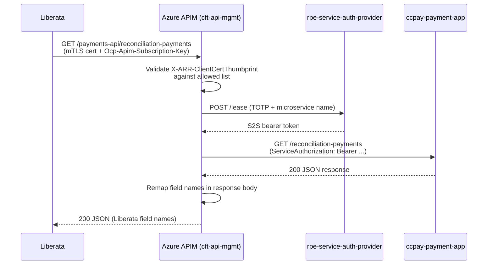

# Reconciliation

## TL;DR

- Financial reconciliation is the process by which `ccpay-payment-app` exposes aggregated payment data to Liberata (the external reconciliation supplier) via a dedicated APIM gateway. Liberata pulls data **twice per day**.
- `ccpay-payment-app` holds payments from multiple GOV.UK Pay accounts (one per service), PBA (Liberata account) payments, telephony payments, and bulk-scan cash/cheque receipts in a single PostgreSQL database.
- Liberata pulls reconciliation data via `GET /reconciliation-payments` exposed through Azure API Management at the `payments-api` base path; additional endpoints expose refunds and fee register data via separate APIM products.
- The APIM gateway (`ccpay-payment-api-gateway`) authenticates Liberata using mTLS client-certificate thumbprint validation and generates an S2S token before forwarding to the backend.
- Scheduled CronJobs (`ccpay-scheduled-jobs`) trigger CSV report generation at 2:30 AM daily and email delivery for internal reconciliation per payment method and service.
- Liberata also calls inbound endpoints for payment failures (bounced cheques, chargebacks, unprocessed payments) which trigger refund cancellations and status updates.

## How payment data is aggregated

`ccpay-payment-app` acts as the single source of truth for all payment channels in CFT. Every payment, regardless of origin, is stored in the `payment` table with a foreign key to `payment_fee_link` (the "service request" or payment group). The service manages separate GOV.UK Pay API keys for each consuming service (CMC, divorce, probate, PCS, etc.) via `gov.pay.auth.key.<service>` properties (`ccpay-payment-app:model/src/main/java/uk/gov/hmcts/payment/api/v1/model/govpay/GovPayConfig.java:9`). The `ServiceToTokenMap` (`ccpay-payment-app:model/src/main/java/uk/gov/hmcts/payment/api/service/govpay/ServiceToTokenMap.java:13-27`) maps human-readable service names to their key property names.

This multi-account design means a single `GET /reconciliation-payments` query can return card payments from any GOV.UK Pay account, PBA payments validated against Liberata's own account API, and telephony payments captured via PCI-PAL callbacks.

### Payment reference format

Each payment is assigned a unique reference used for tracking and reconciliation (`ccpay-payment-app:model/src/main/java/uk/gov/hmcts/payment/api/util/ReferenceUtil.java`):

| Component | Description |
|---|---|
| Prefix | `RC` (receipt) or `RF` (refund) |
| Digits 1-11 | Generated from UTC timestamp in tenths of a second (`millis / 100`) |
| Digits 12-15 | 4 random digits for uniqueness |
| Digit 16 | Luhn check digit for validation |

Example: `RC-1234-5678-9012-3456`

<!-- CONFLUENCE-ONLY: not verified in source -->
<!-- Confluence "Payment Processing" states that if a payment attempt fails and another is initiated, the new payment should remain associated with the original Service Request. Creating additional Service Requests for the same payment requirement may lead to duplicate records. -->

## Liberata reconciliation endpoint

The primary endpoint Liberata calls is:

```
GET /reconciliation-payments?payment_method=...&service_name=...&start_date=...&end_date=...
```

This endpoint supports filtering by `payment_method`, `service_name`, `ccd_case_number`, `pba_number`, `start_date`, and `end_date`. It also handles IAC supplementary info via `iacService` when that service's data is requested (`ccpay-payment-app:api/src/main/java/uk/gov/hmcts/payment/api/controllers/PaymentController.java:184-221`).

A companion `GET /payments` endpoint exists with similar filtering capabilities but without the IAC supplementary enrichment.

Both endpoints are classified as "external" in security configuration (`ccpay-payment-app:api/src/main/resources/application.properties`) -- they require S2S authentication only (no IDAM user token), making them suitable for machine-to-machine calls from Liberata via the gateway.

### Feature flags controlling reconciliation behaviour

The reconciliation endpoint is gated by several feature flags (`ccpay-payment-app:api/src/main/java/uk/gov/hmcts/payment/api/controllers/PaymentController.java`):

| Flag | Type | Effect |
|---|---|---|
| `payment-search` | FF4j | Master gate: if disabled, `/reconciliation-payments` returns an error |
| `apportion-feature` | LaunchDarkly | When enabled, responses include apportioned fee amounts (allocated amount per fee) rather than raw fee amounts |
| `bulk-scan-check` | FF4j | When enabled, includes Exela bulk-scan payments in the response; when disabled, they are filtered out |
| `iac-supplementary-details-feature` | LaunchDarkly | When enabled and IAC payments are present, enriches the response with IAC supplementary details (returns HTTP 206 on partial success) |

### Apportionment logic

When `apportion-feature` is enabled and the payment has apportionment records, the reconciliation DTO mapper (`ccpay-payment-app:api/src/main/java/uk/gov/hmcts/payment/api/dto/mapper/PaymentDtoMapper.java:336-374`) replaces the standard fee list with apportioned fees that include the allocated amount (apportionment amount + call surplus amount). This ensures Liberata receives the actual amounts allocated to each fee rather than just the fee's calculated amount.

### Fee enrichment

The reconciliation response enriches each fee with data from the Fees Register (`fees-register-api`):
- `jurisdiction1` and `jurisdiction2` (from fee code lookup)
- `memo_line` (accounting description)
- `natural_account_code` (GL code for Liberata's ledger)

### Reconciliation frequency

<!-- CONFLUENCE-ONLY: not verified in source -->
Liberata calls the reconciliation API **twice per day** to pull payment information for reconciliation purposes. Date-range parameters (`start_date`, `end_date`) control which payments are returned.

## The APIM gateway

The `ccpay-payment-api-gateway` repo configures Azure API Management to sit between Liberata and the internal payment API.

### Architecture



### Authentication layers

Liberata must pass two independent credential checks:

1. **mTLS client certificate** -- the Azure Application Gateway forwards the certificate thumbprint in the `X-ARR-ClientCertThumbprint` header. The APIM inbound policy validates this against an allowed list compiled from per-environment `.tfvars` files (`ccpay-payment-api-gateway:template/cft-api-policy.xml:7-18`). Production carries 6 allowed thumbprints.

2. **APIM subscription key** -- Liberata must present its `Ocp-Apim-Subscription-Key` header. The key is stored in Key Vault as `liberata-cft-apim-payment-subscription-key` (`ccpay-payment-api-gateway:cft-api-mgmt-subscriptions.tf:29-33`).

<!-- CONFLUENCE-ONLY: not verified in source -->
For production environments, Liberata issues their own certificates and shares the digital thumbprint with the HMCTS F&P team. For test environments, HMCTS issues self-signed certificates to Liberata. The Security Operations Centre (SOC) provides operational monitoring of the API.

### S2S token generation

After authenticating Liberata, the policy generates an S2S token inline:

- Reads `{{ccpay-s2s-client-id}}` and `{{ccpay-s2s-client-secret}}` from APIM named values (sourced from Key Vault secrets `gateway-s2s-client-id` and `gateway-s2s-client-secret`).
- Computes a TOTP using RFC 6238 (HMAC-SHA1, 30-second time step) in embedded C# within the policy XML (`ccpay-payment-api-gateway:template/cft-api-policy.xml:30-53`).
- POSTs the TOTP and microservice name to `${s2s_base_url}/lease` (`ccpay-payment-api-gateway:template/cft-api-policy.xml:55-67`).
- Sets the resulting token as the `ServiceAuthorization` header on the backend request.

### Response field remapping

On HTTP 200/206 responses, the outbound policy applies string replacements to translate internal field names to the names Liberata expects (`ccpay-payment-api-gateway:template/cft-api-policy.xml:76-80`):

| Internal field | Liberata field |
|---|---|
| `giro_slip_no` | `bank_giro_credit_slip_number` |
| `volume` | `volume_amount` |
| `"reference"` (JSON key) | `"fee_reference"` |

### API spec

The gateway registers the OpenAPI spec `ccpay-payment-app.recon-payments-v0.3.json` from `hmcts/reform-api-docs` at the `payments-api` base path (`ccpay-payment-api-gateway:cft-api-mgmt.tf:75`). The backend URL resolves to `http://payment-api-<env>.service.core-compute-<env>.internal`.

### Full external URL

The production mTLS APIM endpoint for reconciliation is:
```
GET https://cft-mtls-api-mgmt-appgw.platform.hmcts.net/payments-api/reconciliation-payments
```

## Additional Liberata inbound endpoints

Beyond reconciliation, the APIM gateway exposes several other endpoints that Liberata uses for payment failure management and refund processing. These are all annotated with `@PaymentExternalAPI` in source (`ccpay-payment-app:api/src/main/java/uk/gov/hmcts/payment/api/controllers/PaymentStatusController.java:58-162`):

| Endpoint | Method | Purpose |
|---|---|---|
| `/payments-api/payments` | GET | Retrieve a list of payments |
| `/payments-api/payments/{payment_reference}` | GET | Get payment by reference |
| `/payments-api/payment-failures/bounced-cheque` | POST | Report a bounced cheque; triggers refund cancellation |
| `/payments-api/payment-failures/chargeback` | POST | Report a chargeback; triggers refund cancellation |
| `/payments-api/payment-failures/unprocessed-payment` | POST | Report an unprocessed failed payment |
| `/payments-api/payment-failures/{failureReference}` | PATCH | Update an existing payment failure (e.g. disputed payment) |
| `/refunds-api/refunds?start_date=...&end_date=...` | GET | Reconciliation of refunds (separate APIM product) |
| `/feeRegister-api/fees-register/approvedFees` | GET | All approved fees from the fee register (separate APIM product) |

<!-- CONFLUENCE-ONLY: not verified in source -->
The refunds and fee register endpoints are served through separate APIM products (`refunds` and `feeRegister` respectively) but share the same mTLS gateway at `cft-mtls-api-mgmt-appgw.platform.hmcts.net`.

All payment-failure endpoints are gated by the `payment-status-update-flag` LaunchDarkly toggle -- when enabled, they return HTTP 503 (Service Unavailable).

## Scheduled CSV reports

Internal reconciliation uses CSV email reports generated by `ccpay-payment-app` and triggered by Kubernetes CronJobs running `ccpay-scheduled-jobs`.

### Job architecture

`ccpay-scheduled-jobs` is a plain Java JAR (no Spring context) deployed as Kubernetes CronJobs. Each pod run:

1. Reads S2S credentials from volume mounts at `/mnt/secrets/ccpay/`.
2. Generates an S2S token via `rpe-service-auth-provider`.
3. Makes a single REST call to `ccpay-payment-app`'s `/jobs/*` endpoints.

The `REPORT_NAME` environment variable determines which job runs (`ccpay-scheduled-jobs:src/main/java/uk/gov/hmcts/payment/processors/JobProcessorFactory.java:5-46`).

### Reconciliation-relevant jobs

| Job name | CronJob name | Schedule | Endpoint called | What it does |
|---|---|---|---|---|
| `card-csv-report` | `card-payment-job-job` | 2:30 AM daily | `POST /jobs/email-pay-reports?payment_method=CARD` | Generates and emails a CSV of all card payments |
| `pba-csv-report` | `pba-payment-job-job` | 2:30 AM daily | `POST /jobs/email-pay-reports?payment_method=PBA&service_name=<X>` (x8 services) | One CSV per PBA service: Specified Money Claims, Divorce, Finrem, Probate, Family Public Law, Family Private Law, Damages, Immigration and Asylum Appeals |
| `pba-finrem-weekly-csv-report` | `finrem-payment-job-job` | 2:30 AM Thursdays | `POST /jobs/email-pay-reports?payment_method=PBA&service_name=Finrem&start_date=<7d ago>` | Weekly Finrem PBA summary |
| `bar-csv-report` | `bar-payment-job-job` | 2:30 AM daily | `POST /jobs/email-pay-reports?payment_method=...` | Bar (bulk-scan) payment report |
| `duplicate-payment-process` | -- | -- | `POST /jobs/duplicate-payment-process?start_date=<yesterday>&end_date=<yesterday>` | Identifies and reports duplicate payments from the previous day |
| `duplicate-sr-report` | -- | -- | `POST /jobs/email-duplicate-sr-report?date=<yesterday>` | Identifies duplicate service requests |

### Non-report scheduled jobs

| Job name | CronJob name | Schedule | What it does |
|---|---|---|---|
| `status-update` | `status-payment-job-job` | Every 30 minutes | Fetches card payments in `initiated` status and refreshes from GOV.UK Pay |
| `refund-notifications` | `refund-notifications-job-job` | Every 30 minutes | Processes refund notification queue |
| `dead-letter-queue` | `dead-letter-queue-process-job` | 2:30 AM daily | Reprocesses failed messages from the service bus dead letter queue |
| `unprocessed-payment-update` | `unprocessed-payment-update-job` | 15 past the hour, Mon-Fri | Updates payment references for unprocessed payments |

### CSV file naming and delivery

Card payment reports use the naming convention:
```
hmcts_card_payments_yyyy-mm-dd-hh-mm-ss.csv
```

PBA (credit account) reports use:
```
hmcts_credit_account_payments_yyyy-mm-dd-hh-mm-ss.csv
```

Card payment CSV reports are sent to Liberata at `MiddleOffice.Developments@liberata.gse.gov.uk` plus internal HMCTS recipients. PBA reports are sent to service-specific distribution lists.

<!-- CONFLUENCE-ONLY: not verified in source -->
The report email implementation uses `spring-boot-starter-mail` with a retry policy (`@Retryable`, delay=100ms, maxDelay=500ms) for resilience against SMTP failures.

### Card payment status synchronisation

The `status-update` job (`PATCH /jobs/card-payments-status-update`) fetches all card payments in `initiated` status and calls GOV.UK Pay to refresh their state (`ccpay-payment-app:api/src/main/java/uk/gov/hmcts/payment/api/controllers/MaintenanceJobsController.java:53-84`). This ensures the local payment table reflects the authoritative GOV.UK Pay status before reconciliation reports are generated.

<!-- CONFLUENCE-ONLY: not verified in source -->
The status check typically occurs within 15 minutes of a payment being initiated. The `status-payment-job-job` runs every 30 minutes to catch up on any payments still in initiated state.

## Bulk scan reconciliation

For payments received via the bulk scan pipeline (Exela cash/cheque), additional reconciliation reports are available in PayBubble:

| Report | Description |
|---|---|
| Data Loss | Missing transactions where data received from only Exela or only Bulk Scan |
| Unprocessed Transactions | Transaction records still unprocessed by staff |
| Processed: Unallocated | Payments marked as "Unidentified" or "Transferred" (unsolicited requests) |
| Shortfalls and Surplus | Requests with balance shortfall/surplus requiring further case management (refund approval, customer contact) |

<!-- CONFLUENCE-ONLY: not verified in source -->
These reports follow the naming convention: `<Report_Name>_<FromDate>_To_<ToDate>_RUN_<RunDateTime>` (format: `Report_name_DDMMYY_To_DDMMYY_Run_DDMMYY_HHMMSS`). The reconciliation between Exela and HMCTS is performed once every 3 business days by a senior manager, comparing the control totals (BGC Number, Volume, Amount) sent by Exela against the payment details in PayHub.

## Payment status mapping

Payment statuses from different systems are mapped to determine case progression:

| CCD Status | PayHub | GOV.UK Pay | PCI Pal |
|---|---|---|---|
| Awaiting payment | Payment initiated | In Progress | Not received |
| Case progression allowed | Success | Success | Success |
| Case progression paused | Declined | Declined | Decline |
| Case progression paused | Timed out | Timed out | Not received |
| Case progression paused | Cancelled | Cancelled | Cancelled |
| Case progression paused | Error | Error | Error |

<!-- CONFLUENCE-ONLY: not verified in source -->
PBA payments have an additional status `Settled` indicating the payment has been collected through direct debit. Reconciliation issues such as jurisdiction errors, transaction mismatches, and missing/duplicate records result in an incident being raised by Liberata.

## Operational notes

- The APIM policy XML changes are not detected by Terraform automatically. To force re-deployment after editing `template/cft-api-policy.xml`, a thumbprint value must be added or changed in the relevant `.tfvars` file.
- The S2S lease request in the APIM policy has a 20-second timeout. If the S2S service is slow or unavailable, Liberata receives an error response.
- Certificate expiry is NOT enforced in the active code path -- only thumbprint matching is checked. The commented-out alternative in the policy would validate expiry via `context.Request.Certificate`.
- All scheduled job HTTP calls use `relaxedHTTPSValidation()` in RestAssured, disabling TLS certificate verification for internal cluster calls.
- The report jobs are all based on current database state, making them idempotent -- they can be safely re-run after a database migration without data loss. The exception is `dead-letter-queue-process-job` which reads from a service bus topic and may lose messages on failure.
- None of the cron jobs connect to the database directly; they all go through backend service REST APIs.

<!-- DIVERGENCE: Confluence "Payment Hub and API Gateway" (id: 764249996) shows a paginated response schema with `index`, `page_size`, `total`, `first`, `next`, `previous`, `last` fields. However, ccpay-payment-app:api/src/main/java/uk/gov/hmcts/payment/api/controllers/PaymentController.java:184-221 shows no pagination parameters on the /reconciliation-payments endpoint. The response returns all matching payments as a flat list. Source wins. -->

## Examples

### Card payment status update batch job

```java
// Source: apps/payment/ccpay-payment-app/api/src/main/java/uk/gov/hmcts/payment/api/controllers/MaintenanceJobsController.java

@PatchMapping(value = "/jobs/card-payments-status-update")
public void updatePaymentsStatus() {
    List<Reference> referenceList = paymentService.listInitiatedStatusPaymentsReferences();

    // Reuse the ASB connection for the whole batch (efficiency)
    if (topicClientProxy != null && !referenceList.isEmpty()) {
        topicClientProxy.setKeepClientAlive(true);
    }

    long count = referenceList.stream()
        .filter(reference -> {
            try {
                PaymentFeeLink paymentFeeLink =
                    delegatingPaymentService.retrieveWithCallBack(reference.getReference());
                return paymentFeeLink != null
                    && paymentFeeLink.getPayments() != null
                    && paymentFeeLink.getPayments().get(0).getStatus() != null;
            } catch (Exception e) {
                LOG.error("Error while updating payment status for reference {}",
                    reference.getReference(), e);
                return false;
            }
        })
        .count();

    if (topicClientProxy != null) {
        topicClientProxy.setKeepClientAlive(false);
        topicClientProxy.close();
    }
}
```

### Scheduled job processor dispatch (JobProcessorFactory)

```java
// Source: apps/payment/ccpay-scheduled-jobs/src/main/java/uk/gov/hmcts/payment/processors/JobProcessorFactory.java

public class JobProcessorFactory {
    public JobProcessor getJobType(String jobType) {
        if (jobType.equalsIgnoreCase("status-update"))
            return new StatusUpdateProcessor();
        if (jobType.equalsIgnoreCase("card-csv-report"))
            return new CardCsvReportProcessor();
        if (jobType.equalsIgnoreCase("pba-csv-report"))
            return new PbaCsvReportProcessor();
        if (jobType.equalsIgnoreCase("pba-finrem-weekly-csv-report"))
            return new PbaFinremWeeklyCsvReportProcessor();
        if (jobType.equalsIgnoreCase("refund-notifications-job"))
            return new RefundNotificationUpdateProcessor();
        if (jobType.equalsIgnoreCase("duplicate-payment-process"))
            return new DuplicatePaymentProcessor();
        // ...
        return null;
    }
}
```

### Card CSV report job calling the payment API

```java
// Source: apps/payment/ccpay-scheduled-jobs/src/main/java/uk/gov/hmcts/payment/processors/CardCsvReportProcessor.java

public class CardCsvReportProcessor implements JobProcessor {
    @Override
    public void process(String serviceToken, String baseURL) {
        headers.put("ServiceAuthorization", serviceToken);
        RestAssured.given().relaxedHTTPSValidation()
            .contentType(ContentType.JSON)
            .headers(headers)
            .post(baseURL + "/jobs/email-pay-reports?payment_method=CARD");
    }
}
```

### Job runner entry point (reads REPORT_NAME env var)

```java
// Source: apps/payment/ccpay-scheduled-jobs/src/main/java/uk/gov/hmcts/payment/JobProcessorRunner.java

public static void run(JobProcessorConfiguration configuration) {
    String s2sToken = new S2SHelper(configuration).generateToken();
    String reportName = configuration.getReportName();
    String payUrl = configuration.getPayUrl();
    String refundsUrl = configuration.getRefundsUrl();

    if (!reportName.equalsIgnoreCase("refund-notifications-job")) {
        new JobProcessorFactory().getJobType(reportName).process(s2sToken, payUrl);
    } else {
        new JobProcessorFactory().getJobType(reportName).process(s2sToken, refundsUrl);
    }
}
```

## See also

- [Architecture](architecture.md) — `ccpay-payment-api-gateway` spoke, APIM overview, and `ccpay-scheduled-jobs` description
- [Payment Lifecycle](payment-lifecycle.md) — payment statuses and how they map to CCD states referenced in reconciliation reports
- [Bulk Scan Payments](bulk-scan-payments.md) — banking reconciliation flow for cash/cheque payments via Exela
- [Reference: API Payments](../reference/api-payments.md) — `/payments` and `/reconciliation-payments` endpoint query parameters
- [Glossary](../reference/glossary.md) — definitions for Liberata, APIM, Reconciliation, RC reference
