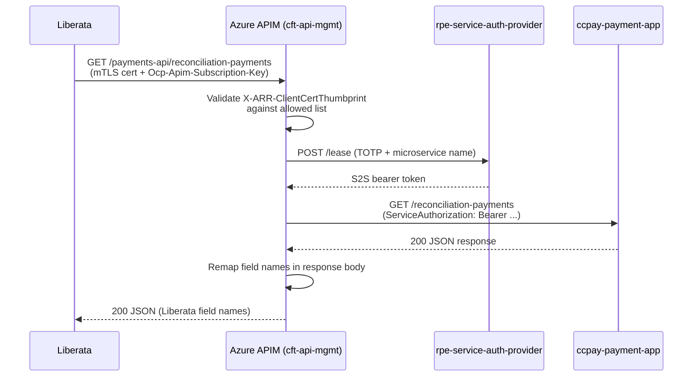

# Reconciliation

## TL;DR

- Financial reconciliation is the process by which `ccpay-payment-app` exposes aggregated payment data to Liberata (the external reconciliation supplier) via a dedicated APIM gateway. Liberata pulls data **twice per day**.
- `ccpay-payment-app` holds payments from multiple GOV.UK Pay accounts (one per service), PBA (Liberata account) payments, telephony payments, and bulk-scan cash/cheque receipts in a single PostgreSQL database.
- Liberata pulls reconciliation data via `GET /reconciliation-payments` exposed through Azure API Management at the `payments-api` base path; additional endpoints expose refunds and fee register data via separate APIM products.
- The APIM gateway (`ccpay-payment-api-gateway`) authenticates Liberata using mTLS client-certificate thumbprint validation and generates an S2S token before forwarding to the backend.
- Scheduled CronJobs (`ccpay-scheduled-jobs`) trigger CSV report generation at 2:30 AM daily and email delivery for internal reconciliation per payment method and service.
- Liberata also calls inbound endpoints for payment failures (bounced cheques, chargebacks, unprocessed payments) which trigger refund cancellations and status updates.

## How payment data is aggregated

`ccpay-payment-app` acts as the single source of truth for all payment channels in CFT. Every payment, regardless of origin, is stored in the `payment` table with a foreign key to `payment_fee_link` (the "service request" or payment group). The service manages separate GOV.UK Pay API keys for each consuming service (CMC, divorce, probate, PCS, etc.) via `gov.pay.auth.key.<service>` properties (`ccpay-payment-app:model/src/main/java/uk/gov/hmcts/payment/api/v1/model/govpay/GovPayConfig.java:9`). The `ServiceToTokenMap` (`ccpay-payment-app:model/src/main/java/uk/gov/hmcts/payment/api/service/govpay/ServiceToTokenMap.java:13-27`) maps human-readable service names to their key property names.

This multi-account design means a single `GET /reconciliation-payments` query can return card payments from any GOV.UK Pay account, PBA payments validated against Liberata's own account API, and telephony payments captured via PCI-PAL callbacks.

### Payment reference format

Each payment is assigned a unique reference used for tracking and reconciliation (`ccpay-payment-app:model/src/main/java/uk/gov/hmcts/payment/api/util/ReferenceUtil.java`):

| Component | Description |
|---|---|
| Prefix | `RC` (receipt) or `RF` (refund) |
| Digits 1-11 | Generated from UTC timestamp in tenths of a second (`millis / 100`) |
| Digits 12-15 | 4 random digits for uniqueness |
| Digit 16 | Luhn check digit for validation |

Example: `RC-1234-5678-9012-3456`

### Retrying after a failed payment

A retry stays on the original service request. `POST /service-request/{reference}/card-payments` cancels any GOV.UK Pay session still in `created` state and less than 90 minutes old, then creates a fresh payment against the same `payment_fee_link` (`ccpay-payment-app:api/src/main/java/uk/gov/hmcts/payment/api/domain/service/ServiceRequestDomainServiceImpl.java:221`, `:429-443`). If a successful GOV.UK Pay payment already exists on that service request, the caller is redirected to its return URL instead of getting a new payment (`ccpay-payment-app:api/src/main/java/uk/gov/hmcts/payment/api/domain/service/ServiceRequestDomainServiceImpl.java:212-218`).

Raising a second service request for the same fee rather than retrying against the first one produces two `payment_fee_link` rows for one liability, and both land on the duplicate-service-request report: the query behind `POST /jobs/email-duplicate-sr-report` groups the day's fees by fee code, CCD case number and enterprise service name and returns every group occurring more than once (`ccpay-payment-app:model/src/main/java/uk/gov/hmcts/payment/api/model/PaymentFeeLinkRepository.java:33-44`, `ccpay-payment-app:api/src/main/java/uk/gov/hmcts/payment/api/controllers/ServiceRequestReportController.java:40`).

## Liberata reconciliation endpoint

The primary endpoint Liberata calls is:

```
GET /reconciliation-payments?payment_method=...&service_name=...&start_date=...&end_date=...
```

This endpoint supports filtering by `payment_method`, `service_name`, `ccd_case_number`, `pba_number`, `start_date`, and `end_date`. It also handles IAC supplementary info via `iacService` when that service's data is requested (`ccpay-payment-app:api/src/main/java/uk/gov/hmcts/payment/api/controllers/PaymentController.java:184-221`).

A companion `GET /payments` endpoint exists with similar filtering capabilities but without the IAC supplementary enrichment.

Both endpoints are classified as "external" in security configuration (`ccpay-payment-app:api/src/main/resources/application.properties`) -- they require S2S authentication only (no IDAM user token), making them suitable for machine-to-machine calls from Liberata via the gateway.

### Feature flags controlling reconciliation behaviour

Two LaunchDarkly flags change what the reconciliation response contains. Both are read through `LaunchDarklyFeatureToggler` and default to `false` when LaunchDarkly is unreachable, so a flag outage yields unapportioned, unenriched payloads rather than an error:

| Flag | Effect |
|---|---|
| `apportion-feature` | Responses carry apportioned fee amounts (apportionment amount plus call surplus) in place of the fee's calculated amount (`ccpay-payment-app:api/src/main/java/uk/gov/hmcts/payment/api/controllers/PaymentController.java:366`) |
| `iac-supplementary-details-feature` | When any IAC payment is in the result set, the response is enriched with IAC supplementary details and returns HTTP 206 on partial retrieval (`ccpay-payment-app:api/src/main/java/uk/gov/hmcts/payment/api/controllers/PaymentController.java:215-230`) |

Nothing gates access to the endpoint itself. The four `feature.*` properties in `application.properties:190-193` (`feature.check.liberata.account.for.all.services`, `feature.duplicate.payment.check`, `feature.case.reference.validation`, `feature.discontinued.fees`) are not bound to any component, so editing them changes no behaviour; the service uses no FF4j.

### Apportionment logic

When `apportion-feature` is enabled and the payment has apportionment records, the reconciliation DTO mapper (`ccpay-payment-app:api/src/main/java/uk/gov/hmcts/payment/api/dto/mapper/PaymentDtoMapper.java:336-374`) replaces the standard fee list with apportioned fees that include the allocated amount (apportionment amount + call surplus amount). This ensures Liberata receives the actual amounts allocated to each fee rather than just the fee's calculated amount.

### Fee enrichment

The reconciliation response enriches each fee with data from the Fees Register (`fees-register-api`):
- `jurisdiction1` and `jurisdiction2` (from fee code lookup)
- `memo_line` (accounting description)
- `natural_account_code` (GL code for Liberata's ledger)

### Reconciliation frequency

<!-- CONFLUENCE-ONLY: not verified in source -->
Liberata calls the reconciliation API **twice per day** to pull payment information for reconciliation purposes. Date-range parameters (`start_date`, `end_date`) control which payments are returned.

## The APIM gateway

The `ccpay-payment-api-gateway` repo configures Azure API Management to sit between Liberata and the internal payment API.

### Architecture


```mermaid
sequenceDiagram
    participant Liberata
    participant APIM as Azure APIM (cft-api-mgmt)
    participant S2S as rpe-service-auth-provider
    participant PayAPI as ccpay-payment-app

    Liberata->>APIM: GET /payments-api/reconciliation-payments<br/>(mTLS cert + Ocp-Apim-Subscription-Key)
    APIM->>APIM: Validate X-ARR-ClientCertThumbprint<br/>against allowed list
    APIM->>S2S: POST /lease (TOTP + microservice name)
    S2S-->>APIM: S2S bearer token
    APIM->>PayAPI: GET /reconciliation-payments<br/>(ServiceAuthorization: Bearer ...)
    PayAPI-->>APIM: 200 JSON response
    APIM->>APIM: Remap field names in response body
    APIM-->>Liberata: 200 JSON (Liberata field names)
```

### Authentication layers

Liberata must pass two independent credential checks:

1. **mTLS client certificate** -- the Azure Application Gateway forwards the certificate thumbprint in the `X-ARR-ClientCertThumbprint` header. The APIM inbound policy validates this against an allowed list compiled from per-environment `.tfvars` files (`ccpay-payment-api-gateway:template/cft-api-policy.xml:7-18`). Production carries 6 allowed thumbprints.

2. **APIM subscription key** -- Liberata must present its `Ocp-Apim-Subscription-Key` header. The key is stored in Key Vault as `liberata-cft-apim-payment-subscription-key` (`ccpay-payment-api-gateway:cft-api-mgmt-subscriptions.tf:29-33`).

<!-- CONFLUENCE-ONLY: not verified in source -->
For production environments, Liberata issues their own certificates and shares the digital thumbprint with the HMCTS F&P team. For test environments, HMCTS issues self-signed certificates to Liberata. The Security Operations Centre (SOC) provides operational monitoring of the API.

### S2S token generation

After authenticating Liberata, the policy generates an S2S token inline:

- Reads `{{ccpay-s2s-client-id}}` and `{{ccpay-s2s-client-secret}}` from APIM named values (sourced from Key Vault secrets `gateway-s2s-client-id` and `gateway-s2s-client-secret`).
- Computes a TOTP using RFC 6238 (HMAC-SHA1, 30-second time step) in embedded C# within the policy XML (`ccpay-payment-api-gateway:template/cft-api-policy.xml:30-53`).
- POSTs the TOTP and microservice name to `${s2s_base_url}/lease` (`ccpay-payment-api-gateway:template/cft-api-policy.xml:55-67`).
- Sets the resulting token as the `ServiceAuthorization` header on the backend request.

### Response field remapping

On HTTP 200/206 responses, the outbound policy applies string replacements to translate internal field names to the names Liberata expects (`ccpay-payment-api-gateway:template/cft-api-policy.xml:76-80`):

| Internal field | Liberata field |
|---|---|
| `giro_slip_no` | `bank_giro_credit_slip_number` |
| `volume` | `volume_amount` |
| `"reference"` (JSON key) | `"fee_reference"` |

### API spec

The gateway registers the OpenAPI spec `ccpay-payment-app.recon-payments-v0.3.json` from `hmcts/reform-api-docs` at the `payments-api` base path (`ccpay-payment-api-gateway:cft-api-mgmt.tf:75`). The backend URL resolves to `http://payment-api-<env>.service.core-compute-<env>.internal`.

### Full external URL

The production mTLS APIM endpoint for reconciliation is:
```
GET https://cft-mtls-api-mgmt-appgw.platform.hmcts.net/payments-api/reconciliation-payments
```

## Additional Liberata inbound endpoints

Beyond reconciliation, the APIM gateway exposes several other endpoints that Liberata uses for payment failure management and refund processing. These are all annotated with `@PaymentExternalAPI` in source (`ccpay-payment-app:api/src/main/java/uk/gov/hmcts/payment/api/controllers/PaymentStatusController.java:60-170`):

| Endpoint | Method | Purpose |
|---|---|---|
| `/payments-api/payments` | GET | Retrieve a list of payments |
| `/payments-api/payments/{payment_reference}` | GET | Get payment by reference |
| `/payments-api/payment-failures/bounced-cheque` | POST | Report a bounced cheque; triggers refund cancellation |
| `/payments-api/payment-failures/chargeback` | POST | Report a chargeback; triggers refund cancellation |
| `/payments-api/payment-failures/unprocessed-payment` | POST | Report an unprocessed failed payment |
| `/payments-api/payment-failures/{failureReference}` | PATCH | Update an existing payment failure (e.g. disputed payment) |
| `/refunds-api/refunds?start_date=...&end_date=...` | GET | Reconciliation of refunds (separate APIM product) |
| `/feeRegister-api/fees-register/approvedFees` | GET | All approved fees from the fee register (separate APIM product) |

The refunds endpoint is a separate APIM product owned by a different repo: `ccpay-refunds-app` registers its own product named `refunds` on the same `cft-api-mgmt-<env>` instance, publishes it at base path `refunds-api`, and renders the same mTLS-thumbprint-plus-inline-S2S policy template from its own thumbprint list (`ccpay-refunds-app:infrastructure/variables.tf:74-77`, `ccpay-refunds-app:infrastructure/main.tf:12`, `ccpay-refunds-app:infrastructure/cft-api-mgmt.tf:9-51`). Changing the allowed thumbprints for reconciliation therefore does not change them for refunds — the two lists are maintained independently, in different repos.

<!-- CONFLUENCE-ONLY: not verified in source -->
The fee register endpoint is served through a further separate APIM product (`feeRegister`) sharing the same mTLS gateway at `cft-mtls-api-mgmt-appgw.platform.hmcts.net`. That product is declared by `fees-register-api`, which is not cloned in this workspace.

The `payment-status-update-flag` LaunchDarkly toggle is a kill switch, not an enable switch: while it is on, the three `/payment-failures/*` write endpoints and the PATCH by failure reference return an empty HTTP 503 (`ccpay-payment-app:api/src/main/java/uk/gov/hmcts/payment/api/controllers/PaymentStatusController.java:65-66`, `:164-165`), and `GET /payment-failures/failure-report` throws `LiberataServiceInaccessibleException` (`:203-204`). The same flag is read with inverted sense by the unprocessed-payment job at `:180` — turning the switch on silently stops that job doing any work rather than failing it, so Liberata failure notifications are rejected *and* the catch-up job stalls for as long as the flag stays on.

## Scheduled CSV reports

Internal reconciliation uses CSV email reports generated by `ccpay-payment-app` and triggered by Kubernetes CronJobs running `ccpay-scheduled-jobs`.

### Job architecture

`ccpay-scheduled-jobs` is a plain Java JAR (no Spring context) deployed as Kubernetes CronJobs. Each pod run:

1. Reads S2S credentials from volume mounts at `/mnt/secrets/ccpay/`.
2. Generates an S2S token via `rpe-service-auth-provider`.
3. Makes a single REST call to `ccpay-payment-app`'s `/jobs/*` endpoints.

The `REPORT_NAME` environment variable determines which job runs (`ccpay-scheduled-jobs:src/main/java/uk/gov/hmcts/payment/processors/JobProcessorFactory.java:5-46`).

### Reconciliation-relevant jobs

| `REPORT_NAME` | HelmRelease | Schedule | Endpoint called | What it does |
|---|---|---|---|---|
| `card-csv-report` | `card-payment-job` | `30 2 * * *` | `POST /jobs/email-pay-reports?payment_method=CARD` | One CSV of card payments |
| `pba-csv-report` | `pba-payment-job` | `30 2 * * *` | `POST /jobs/email-pay-reports?payment_method=PBA&service_name=<service>`, once per service | Nine sequential CSVs: Specified Money Claims, Divorce, Finrem, Probate, Family Public Law, Family Private Law, Damages, Immigration and Asylum Appeals, Mortgage and Landlord Possession Claims |
| `pba-finrem-weekly-csv-report` | `finrem-payment-job` | `30 2 * * 4` | `POST /jobs/email-pay-reports?payment_method=PBA&service_name=Finrem&start_date=<7d ago>` | Weekly Finrem PBA summary |
| `duplicate-payment-process` | `duplicate-payment-process` | `30 2 * * *` | `POST /jobs/duplicate-payment-process?start_date=<yesterday>&end_date=<yesterday>` | Reports potential duplicate payments from the previous day |
| `duplicate-sr-report` | `duplicate-sr-job` | `30 2 * * *` | `POST /jobs/email-duplicate-sr-report?date=<yesterday>` | Reports duplicate service requests |

Schedules and `REPORT_NAME` values come from the HelmReleases in `cnp-flux-config:apps/fees-pay/card-payment-job/card-payment-job.yaml:11-13`, `cnp-flux-config:apps/fees-pay/pba-payment-job/pba-payment-job.yaml:11-13`, `cnp-flux-config:apps/fees-pay/finrem-payment-job/finrem-payment-job.yaml:11-13`, `cnp-flux-config:apps/fees-pay/duplicate-payment-process/duplicate-payment-process.yaml:10-12` and `cnp-flux-config:apps/fees-pay/duplicate-sr-job/duplicate-sr-job.yaml:11-13`.

The nine PBA service names are hard-coded in the job image (`ccpay-scheduled-jobs:src/main/java/uk/gov/hmcts/payment/processors/PbaCsvReportProcessor.java:19-30`), so adding a tenth PBA report needs a code change and a new image, not a flux value.

The two duplicate-detection releases are declared only for demo (`cnp-flux-config:apps/fees-pay/demo/base/kustomization.yaml:32`, `:34`). Production cluster 00 carries the card, PBA, Finrem, status and refund-notification releases (`cnp-flux-config:apps/fees-pay/prod/00/kustomization.yaml:5-9`), the shared production base adds the dead-letter-queue and unprocessed-payment releases (`cnp-flux-config:apps/fees-pay/prod/base/kustomization.yaml:7-8`), and cluster 01 takes only that base (`cnp-flux-config:apps/fees-pay/prod/01/kustomization.yaml:3-4`) — so each report is emailed once per day rather than once per cluster.

### Non-report scheduled jobs

| `REPORT_NAME` | HelmRelease | Schedule | Endpoint called | What it does |
|---|---|---|---|---|
| `status-update` | `status-payment-job` | `*/30 * * * *` | `PATCH /jobs/card-payments-status-update` | Refreshes unfinished GOV.UK Pay payments |
| `refund-notifications-job` | `refund-notifications-job` | `*/30 * * * *` | `PATCH /jobs/refund-notification-update` | Processes queued refund notifications |
| `dead-letter-queue-process` | `dead-letter-queue-process` | `30 2 * * *` | `PATCH /jobs/dead-letter-queue-process` | Reprocesses failed messages from the service bus dead letter queue |
| `unprocessed-payment-update` | `unprocessed-payment-update` | `*/2 * * * *` | `PATCH /jobs/unprocessed-payment-update` | Attaches payment references to unprocessed-payment failures |

Schedules from `cnp-flux-config:apps/fees-pay/status-payment-job/status-payment-job.yaml:11-13`, `cnp-flux-config:apps/fees-pay/refund-notifications-job/refund-notifications-job.yaml:11-13`, `cnp-flux-config:apps/fees-pay/dead-letter-queue-process/dead-letter-queue-process.yaml:10-12` and `cnp-flux-config:apps/fees-pay/unprocessed-payment-update/unprocessed-payment-update.yaml:10-12`. Non-production overlays patch some of them: demo runs refund notifications every five minutes (`cnp-flux-config:apps/fees-pay/refund-notifications-job/demo.yaml:10`) and the unprocessed-payment job every fifteen minutes on weekdays only (`cnp-flux-config:apps/fees-pay/unprocessed-payment-update/demo.yaml:9`), so a timing problem reproduced in demo will not reproduce with production cadence.

`refund-notifications-job` is the one `REPORT_NAME` dispatched against the refunds API base URL rather than the payment API, so it depends on `ccpay-refunds-app` being reachable, not `ccpay-payment-app`.

### CSV file naming and delivery

The attachment name is the report config's prefix followed by the generation timestamp formatted `yyyy-MM-dd-HH-mm-ss` and `.csv` (`ccpay-payment-app:api/src/main/java/uk/gov/hmcts/payment/api/reports/PaymentsReportService.java:48`, `:137`):

```
hmcts_card_payments_2026-08-20-02-30-04.csv
hmcts_credit_account_payments_civil_2026-08-20-02-30-11.csv
hmcts_potential_duplicate_payments_2026-08-20-02-30-19.csv
```

PBA prefixes carry a per-service suffix — `hmcts_credit_account_payments_civil_`, `_divorce_`, `_finrem_`, `_fpl_`, `_iac_`, `_pcs_`, `_prl_` and so on, one `PaymentReportConfig` implementation per service (`ccpay-payment-app:api/src/main/java/uk/gov/hmcts/payment/api/reports/config/CardPaymentReportConfig.java:22`, `ccpay-payment-app:api/src/main/java/uk/gov/hmcts/payment/api/reports/config/PbaCivilPaymentReportConfig.java:22`, `ccpay-payment-app:api/src/main/java/uk/gov/hmcts/payment/api/reports/config/DuplicatePaymentReportConfig.java:22`). The timestamp is the moment the CSV is built, not the reporting date, so two runs on the same day produce differently named files.

Recipients are not held in the repo. Each report config binds `from`, `to`, `subject` and `message` from per-report properties (`ccpay-payment-app:api/src/main/java/uk/gov/hmcts/payment/api/reports/config/CardPaymentReportConfig.java:24-33`), and every `*.payments.email.to` property is supplied by a Key Vault secret named `<report>-payments-email-to`, aliased onto the property name and mounted as a config tree at `/mnt/secrets/ccpay/` (`ccpay-payment-app:charts/payment-api/values.yaml:180-197`, `ccpay-payment-app:api/src/main/resources/application.properties:8`). `to` is bound as a `String[]`, so each secret holds a comma-separated distribution list. Changing who receives a reconciliation report is a Key Vault change, not a deployment; and because the property default is the literal `dummy`, a missing secret makes the send fail rather than silently emailing the wrong people.

Report emails go out through `spring-boot-starter-mail` (`ccpay-payment-app:api/build.gradle:135`). `EmailService.sendEmail` is annotated `@Retryable` for `EmailFailedException` with `@Backoff(delay = 100, maxDelay = 500)` (`ccpay-payment-app:api/src/main/java/uk/gov/hmcts/payment/api/email/EmailService.java:23-24`), so an SMTP blip is retried in-process within a second; a longer outage loses that run's report, because nothing persists the generated CSV.

### Card payment status synchronisation

The `status-update` job (`PATCH /jobs/card-payments-status-update`) selects payments by exclusion rather than by an `initiated` status: every payment whose provider is GOV_PAY, whose status is **not** one of `success`, `failed`, `error` or `cancelled`, and which was created before a cut-off, ordered oldest first (`ccpay-payment-app:model/src/main/java/uk/gov/hmcts/payment/api/service/PaymentServiceImpl.java:167-173`). Each reference is then re-read through `retrieveWithCallBack`, which fetches the authoritative GOV.UK Pay status and persists it (`ccpay-payment-app:api/src/main/java/uk/gov/hmcts/payment/api/controllers/MaintenanceJobsController.java:56-87`). Because `pending` and `decline` are not in the exclusion list, payments in those states are re-queried on every run.

The cut-off is `callback.payments.cutoff.time.in.minutes`, which the deployed chart sets to 2 (`ccpay-payment-app:charts/payment-api/values.yaml:39`, `ccpay-payment-app:api/src/main/resources/application.properties:204`). Payments younger than that are skipped, leaving GOV.UK Pay time to settle before the local record is overwritten. The batch holds one Service Bus connection open for its whole run (`ccpay-payment-app:api/src/main/java/uk/gov/hmcts/payment/api/controllers/MaintenanceJobsController.java:65-67`, `:83-86`), so a payment status refreshed here also emits its service callback.

<!-- CONFLUENCE-ONLY: not verified in source -->
The status check typically occurs within 15 minutes of a payment being initiated.

## Bulk scan reconciliation

For payments received via the bulk scan pipeline (Exela cash/cheque), `ccpay-bulkscanning-app` serves reconciliation reports that PayBubble downloads. `report_type` is bound to an enum with exactly two values, so `GET /report/download` and `GET /report/data` reject anything else with a 400 (`ccpay-bulkscanning-app:src/main/java/uk/gov/hmcts/reform/bulkscanning/model/enums/ReportType.java:3-6`, `ccpay-bulkscanning-app:src/main/java/uk/gov/hmcts/reform/bulkscanning/controller/ReportController.java:53-59`):

| `report_type` | Description |
|---|---|
| `DATA_LOSS` | Missing transactions, where data arrived from only Exela or only bulk scan |
| `UNPROCESSED` | Transaction records still unprocessed by staff |

Unallocated and shortfall/surplus handling is a PayBubble case-transaction workflow rather than a downloadable report — `ccpay-bubble` routes `CONFIRMALLOCATION_SURPLUS` and `CONFIRMALLOCATION_SHORTFALL` as UI states (`ccpay-bubble:src/app/shared/components/phase-banner/phase-banner.component.ts:21`).

The download filename is built from the enum name, the requested date range and the run time, as `<REPORT_TYPE>_ddMMyy_To_ddMMyy_RUN_ddMMyy_HHmmss.xls`, and returned in the `Content-Disposition` header (`ccpay-bulkscanning-app:src/main/java/uk/gov/hmcts/reform/bulkscanning/controller/ReportController.java:75-80`, `ccpay-bulkscanning-app:src/main/java/uk/gov/hmcts/reform/bulkscanning/utils/DateUtil.java:29-36`). Dates in the name use a two-digit year in `ddMMyy` form, and the run time is formatted in the JVM's default zone.

<!-- CONFLUENCE-ONLY: not verified in source -->
The reconciliation between Exela and HMCTS is performed once every 3 business days by a senior manager, comparing the control totals (BGC Number, Volume, Amount) sent by Exela against the payment details in PayHub.

## Payment status mapping

Stored statuses are the nine rows of the `payment_status` reference table — `created`, `success`, `failed`, `cancelled`, `error` seeded with the table (`ccpay-payment-app:api/src/main/resources/db/changelog/db.changelog-refdata.yaml:21-27`), then `submitted` (`:126-128`), `started` (`ccpay-payment-app:api/src/main/resources/db/changelog/db.changelog-0.0.6.yaml:9-11`), `pending` (`ccpay-payment-app:api/src/main/resources/db/changelog/db.changelog-0.0.8.yaml:17-19`) and `decline` (`ccpay-payment-app:api/src/main/resources/db/changelog/db.changelog-0.0.9.yaml:179`). Those names are collapsed to five external labels for reporting (`ccpay-payment-app:model/src/main/java/uk/gov/hmcts/payment/api/util/PayStatusToPayHubStatus.java:7`):

| Stored status | PayHub label |
|---|---|
| `created`, `started`, `submitted` | Initiated |
| `success` | Success |
| `failed`, `cancelled`, `error` | Failed |
| `pending` | Pending |
| `decline` | Declined |

A cancelled payment and an errored payment are therefore indistinguishable in a reconciliation report: both read `Failed`, and only the stored status or the payment's status history tells them apart. There is no `Timed out` status anywhere in the reference data.

For telephony payments the PCI-PAL `transactionResult` is lower-cased and looked up directly in `payment_status`, so a result value with no matching row aborts the callback rather than storing an unknown status, and a payment already in `success` is never overwritten (`ccpay-payment-app:model/src/main/java/uk/gov/hmcts/payment/api/service/PaymentServiceImpl.java:114-123`).

<!-- DIVERGENCE: Confluence "Payment Processing" (id: 1952812014) states that PBA payments have an additional status `Settled` indicating collection by direct debit. No such status exists: the `payment_status` reference table holds only created, started, pending, submitted, success, failed, decline, cancelled and error, per the Liquibase changelogs listed above, and ccpay-payment-app:model/src/main/java/uk/gov/hmcts/payment/api/util/PayStatusToPayHubStatus.java:7 maps no value to Settled. Collection of a PBA payment is not represented as a payment status. Source wins. -->

<!-- CONFLUENCE-ONLY: not verified in source -->
Reconciliation issues such as jurisdiction errors, transaction mismatches, and missing/duplicate records result in an incident being raised by Liberata.

## Operational notes

- The APIM policy XML changes are not detected by Terraform automatically. To force re-deployment after editing `template/cft-api-policy.xml`, a thumbprint value must be added or changed in the relevant `.tfvars` file.
- The S2S lease request in the APIM policy has a 20-second timeout. If the S2S service is slow or unavailable, Liberata receives an error response.
- Certificate expiry is NOT enforced in the active code path -- only thumbprint matching is checked. The commented-out alternative in the policy would validate expiry via `context.Request.Certificate`.
- All scheduled job HTTP calls use `relaxedHTTPSValidation()` in RestAssured, disabling TLS certificate verification for internal cluster calls.
- The report jobs are all based on current database state, making them idempotent -- they can be safely re-run after a database migration without data loss. The exception is `dead-letter-queue-process-job` which reads from a service bus topic and may lose messages on failure.
- None of the cron jobs connect to the database directly; they all go through backend service REST APIs.

<!-- DIVERGENCE: Confluence "Payment Hub and API Gateway" (id: 764249996) shows a paginated response schema with `index`, `page_size`, `total`, `first`, `next`, `previous`, `last` fields. However, ccpay-payment-app:api/src/main/java/uk/gov/hmcts/payment/api/controllers/PaymentController.java:184-221 shows no pagination parameters on the /reconciliation-payments endpoint. The response returns all matching payments as a flat list. Source wins. -->

## Examples

### Card payment status update batch job

```java
// Source: apps/payment/ccpay-payment-app/api/src/main/java/uk/gov/hmcts/payment/api/controllers/MaintenanceJobsController.java

@PatchMapping(value = "/jobs/card-payments-status-update")
public void updatePaymentsStatus() {
    List<Reference> referenceList = paymentService.listInitiatedStatusPaymentsReferences();

    // Reuse the ASB connection for the whole batch (efficiency)
    if (topicClientProxy != null && !referenceList.isEmpty()) {
        topicClientProxy.setKeepClientAlive(true);
    }

    long count = referenceList.stream()
        .filter(reference -> {
            try {
                PaymentFeeLink paymentFeeLink =
                    delegatingPaymentService.retrieveWithCallBack(reference.getReference());
                return paymentFeeLink != null
                    && paymentFeeLink.getPayments() != null
                    && paymentFeeLink.getPayments().get(0).getStatus() != null;
            } catch (Exception e) {
                LOG.error("Error while updating payment status for reference {}",
                    reference.getReference(), e);
                return false;
            }
        })
        .count();

    if (topicClientProxy != null) {
        topicClientProxy.setKeepClientAlive(false);
        topicClientProxy.close();
    }
}
```

### Scheduled job processor dispatch (JobProcessorFactory)

```java
// Source: apps/payment/ccpay-scheduled-jobs/src/main/java/uk/gov/hmcts/payment/processors/JobProcessorFactory.java

public class JobProcessorFactory {
    public JobProcessor getJobType(String jobType) {
        if (jobType.equalsIgnoreCase("status-update"))
            return new StatusUpdateProcessor();
        if (jobType.equalsIgnoreCase("card-csv-report"))
            return new CardCsvReportProcessor();
        if (jobType.equalsIgnoreCase("pba-csv-report"))
            return new PbaCsvReportProcessor();
        if (jobType.equalsIgnoreCase("pba-finrem-weekly-csv-report"))
            return new PbaFinremWeeklyCsvReportProcessor();
        if (jobType.equalsIgnoreCase("refund-notifications-job"))
            return new RefundNotificationUpdateProcessor();
        if (jobType.equalsIgnoreCase("duplicate-payment-process"))
            return new DuplicatePaymentProcessor();
        // ...
        return null;
    }
}
```

### Card CSV report job calling the payment API

```java
// Source: apps/payment/ccpay-scheduled-jobs/src/main/java/uk/gov/hmcts/payment/processors/CardCsvReportProcessor.java

public class CardCsvReportProcessor implements JobProcessor {
    @Override
    public void process(String serviceToken, String baseURL) {
        headers.put("ServiceAuthorization", serviceToken);
        RestAssured.given().relaxedHTTPSValidation()
            .contentType(ContentType.JSON)
            .headers(headers)
            .post(baseURL + "/jobs/email-pay-reports?payment_method=CARD");
    }
}
```

### Job runner entry point (reads REPORT_NAME env var)

```java
// Source: apps/payment/ccpay-scheduled-jobs/src/main/java/uk/gov/hmcts/payment/JobProcessorRunner.java

public static void run(JobProcessorConfiguration configuration) {
    String s2sToken = new S2SHelper(configuration).generateToken();
    String reportName = configuration.getReportName();
    String payUrl = configuration.getPayUrl();
    String refundsUrl = configuration.getRefundsUrl();

    if (!reportName.equalsIgnoreCase("refund-notifications-job")) {
        new JobProcessorFactory().getJobType(reportName).process(s2sToken, payUrl);
    } else {
        new JobProcessorFactory().getJobType(reportName).process(s2sToken, refundsUrl);
    }
}
```

## See also

- [Architecture](architecture.md) — `ccpay-payment-api-gateway` spoke, APIM overview, and `ccpay-scheduled-jobs` description
- [Payment Lifecycle](payment-lifecycle.md) — payment statuses and how they map to CCD states referenced in reconciliation reports
- [Bulk Scan Payments](bulk-scan-payments.md) — banking reconciliation flow for cash/cheque payments via Exela
- [Reference: API Payments](../reference/api-payments.md) — `/payments` and `/reconciliation-payments` endpoint query parameters
- [Glossary](../reference/glossary.md) — definitions for Liberata, APIM, Reconciliation, RC reference
