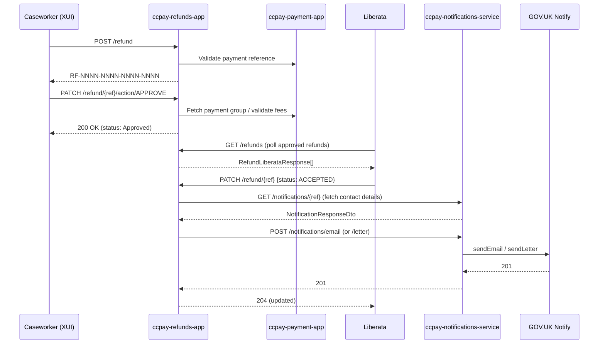

## TL;DR

- The refund lifecycle is managed by `ccpay-refunds-app`, which owns a state machine: Sent for approval → Approved → Accepted/Rejected/Cancelled/Expired/Closed/Reissued.
- A refund request is submitted via `POST /refund`, reviewed (approved/rejected) via `PATCH /refund/{reference}/action/{reviewer-action}`, and reconciled by Liberata via `PATCH /refund/{reference}`.
- Notifications (GOV.UK Notify emails and letters) are dispatched only when Liberata accepts the refund — not at approval time. If a card refund fails, the PayIt flow (NatWest) is triggered automatically.
- When Liberata cannot apply a refund to the original card, it sends a "Rejected" status with reason `"Unable to apply refund to Card"`, which triggers the PayIt journey: the refund is auto-approved by the system, and the citizen receives a link to the Liberata BPA Refunds Portal to provide bank details.
- Expired refunds (unclaimed after 21 days) can be reissued by caseworkers via `POST /refund/reissue-expired/{reference}`, which atomically closes the old refund and creates a new one.
- Refund references follow the pattern `RF-NNNN-NNNN-NNNN-NNNN` (regex: `^RF-\d{4}-\d{4}-\d{4}-\d{4}$`).

## Lifecycle overview

```mermaid
stateDiagram-v2
    [*] --> SentForApproval : SUBMIT
    SentForApproval --> Approved : APPROVE
    SentForApproval --> Rejected : REJECT
    SentForApproval --> NeedMoreInfo : UPDATEREQUIRED
    NeedMoreInfo --> SentForApproval : SUBMIT (resubmit)
    Approved --> Accepted : ACCEPT (Liberata)
    Approved --> Rejected : REJECT (Liberata)
    Approved --> Expired : EXPIRE (Liberata, 21 days unclaimed)
    Expired --> Closed : RESET (caseworker reissue)
    Closed --> [*]
    SentForApproval --> Cancelled : CANCEL
    Approved --> Cancelled : CANCEL
    NeedMoreInfo --> Cancelled : CANCEL

    note right of Expired : PayIt refund unclaimed after 21 days
    note right of Closed : Original refund closed; new RF created
```



The state machine is encoded in the `RefundState` enum (`RefundState.java:8–133`). Events that drive transitions are defined in `RefundEvent`: SUBMIT, APPROVE, REJECT, UPDATEREQUIRED, ACCEPT, CANCEL. Note that `RefundState` only models six states (SENTFORAPPROVAL, NEEDMOREINFO, APPROVED, ACCEPTED, REJECTED, CANCELLED); the additional statuses EXPIRED, CLOSED, and REISSUED are defined in `RefundStatus.java` and are set directly on the entity without going through the state machine transitions.

### All RefundStatus values

| Status | Name | Description | Set by |
|--------|------|-------------|--------|
| SENTFORAPPROVAL | "Sent for approval" | Initial submission | Caseworker |
| APPROVED | "Approved" | Team Leader or System approval | Team Leader / System |
| UPDATEREQUIRED | "Update required" | More information needed | Reviewer |
| ACCEPTED | "Accepted" | Liberata has processed the refund | Liberata |
| REJECTED | "Rejected" | Rejected by reviewer or Liberata | Reviewer / Liberata |
| CANCELLED | "Cancelled" | Cancelled by caseworker | Caseworker |
| EXPIRED | "Expired" | PayIt refund unclaimed for 21 days | Liberata |
| CLOSED | "Closed" | Old refund closed during reissue | System (via caseworker reset) |
| REISSUED | "Reissued" | Marker on new refund linking to original | System (via caseworker reset) |

## Request submission

A caseworker submits a refund via `POST /refund` on `ccpay-refunds-app`. The controller delegates to `RefundsServiceImpl.initiateRefund()` (`RefundsController.java:148–151`), which:

1. Validates the caller's IDAM role against the service type (`RefundServiceRoleUtil.validateRefundRoleWithServiceName`).
2. Generates a reference in the format `RF-NNNN-NNNN-NNNN-NNNN` using `ReferenceUtil`.
3. Persists the `Refund` entity with status **Sent for approval**.
4. Returns `RefundResponse` containing the generated reference.

The request body (`RefundRequest`) carries: `paymentReference`, `refundReason` (code such as `RR001`), `ccdCaseNumber`, `refundAmount`, `paymentAmount`, `feeIds`, `contactDetails`, `refundFees[]`, and `serviceType`.

Refund reason codes are HMCTS-defined values stored with a code and human-readable name. Known categories include:

- Retrospective remission
- Discretionary deduction
- Duplicate payment
- Service amendment
- Service cannot be provided
- System or staff error
- Change in policy on fees (e.g. Employment Tribunal)
- Case withdrawal

<!-- CONFLUENCE-ONLY: The full list of refund reason codes (RR001, RR002, etc.) and their human-readable labels are managed in the refunds database and fetched from reference data at runtime. The exact mapping is not hardcoded in source. not verified in source -->

All endpoints require both an IDAM JWT and an S2S token. Trusted S2S services: `payment_app`, `ccpay_bubble`, `api_gw`, `ccd_gw`, `xui_webapp`, `pcs_api` (`application.yaml:70`).

## Approval review

A second caseworker reviews the refund via `PATCH /refund/{reference}/action/{reviewer-action}` (`RefundsController.java:312–325`). The service enforces that the reviewer is not the same IDAM user who submitted the request (`RefundReviewServiceImpl.java:140–150`).

Possible reviewer actions:

| Action | Effect |
|--------|--------|
| APPROVE | Sets status to **Approved**. Validates fees against payment group by calling `ccpay-payment-app`. Does NOT trigger a notification. |
| REJECT | Sets status to **Rejected**. |
| UPDATEREQUIRED | Sets status to **Need More Info**. The submitter can resubmit via `PATCH /refund/resubmit/{reference}`. |

On approval, the refund becomes visible to Liberata via the `GET /refunds` endpoint, which Liberata polls to discover approved refunds awaiting reconciliation.

## Liberata reconciliation callback

Liberata (the middle-office provider) processes the financial refund externally and then calls back into the system via `PATCH /refund/{reference}` with a `RefundStatusUpdateRequest` body:

```json
{
  "status": "ACCEPTED",
  "reason": "optional reason text"
}
```

Valid status values: `ACCEPTED`, `REJECTED`, `EXPIRED`.

The callback is handled by `RefundStatusServiceImpl` and is notably **not gated** by the `refunds-release` LaunchDarkly flag — it remains available even when all user-facing endpoints are disabled (`RefundsController.java:236–244`).

### On ACCEPTED

This is the only point in the lifecycle where a notification is sent:

1. The service fetches the most recent `Notification` record from `ccpay-notifications-service` via `GET /notifications/{reference}` to reconstruct contact details (`RefundStatusServiceImpl.java:68–113`).
2. Selects a GOV.UK Notify template ID via `RefundsUtil.getTemplate()`.
3. Calls `notificationService.updateNotification()` which dispatches the email or letter via `ccpay-notifications-service`.
4. Sets `notification_sent_flag` on the refund record.
5. Updates `createdBy`/`updatedBy` to `"Middle office provider"`.

### On REJECTED (special case — PayIt trigger)

If the rejection reason is exactly `"Unable to apply refund to Card"`, the service does not reject the refund — instead it internally sets the status to **Approved** and changes `refundInstructionType` to `"RefundWhenContacted"` (`RefundStatusServiceImpl.java:132–144`). The `updatedBy` is set to `"System user"` and the status history records `"Refund approved by system"`.

This triggers the **PayIt flow**: on the next Liberata acceptance, the "Refund When Contacted" notification template is used, which includes a link to the Liberata BPA Refunds Portal (`https://bparefunds.liberata.com`). The citizen enters their RF (refund reference) and RC (payment reference) to be redirected to NatWest PayIt, where they provide bank details to receive the refund digitally.

<!-- CONFLUENCE-ONLY: PayIt portal URL https://bparefunds.liberata.com and the 3-attempt lockout behaviour are documented in Confluence but not verified in source -->

### On REJECTED (normal)

For other rejection reasons (e.g. "Case details do not match", "Insufficient funds", "Settlement not received", "Transaction not yet received in API"), the status is updated to **Rejected**. No notification is sent. `updatedBy` is set to `"Middle office provider"`.

### On EXPIRED

When a PayIt refund goes unclaimed for 21 days, Liberata sends `{status: "EXPIRED", reason: "Unable to process expired refund"}`. The status is updated to **Expired** with `updatedBy` = `"Middle office provider"`. No notification is sent. The refund becomes eligible for reissue by a caseworker (see [Reissue flow](#reissue-expired-refunds) below).

## Notification dispatch

`ccpay-refunds-app` delegates all notification delivery to `ccpay-notifications-service` via two REST endpoints:

- `POST /notifications/email` — sends a GOV.UK Notify email
- `POST /notifications/letter` — sends a GOV.UK Notify letter

The notifications service is the only component that holds `NotificationClient` beans and communicates directly with GOV.UK Notify (`notifications-java-client:5.2.1-RELEASE`). It uses separate API keys for emails (`EMAIL_APIKEY`) and letters (`LETTER_APIKEY`) (`EmailNotificationConfig.java:11–25`).

### Template selection

Template ID selection lives in `RefundsUtil.getTemplate()` (`RefundsUtil.java:56–84`) within the refunds app:

| Condition | Template set |
|-----------|-------------|
| `refundInstructionType == "RefundWhenContacted"` AND reason == `"Unable to apply refund to Card"` | `refund-when-contacted` templates |
| `refundInstructionType == "RefundWhenContacted"` with any other reason | `cheque-po-cash` templates |
| All other cases | `card-pba` templates |

Each template set has an email and a letter variant, yielding six config keys total under `notify.template.*` in `application.yaml:159–169`.

### Personalisation

The notifications service resolves the human-readable refund reason from its own `notification_refund_reasons` table (keyed by code such as `RR036`) before passing personalisation to Notify (`NotificationServiceImpl.java:452–470`). Personalisation keys sent to GOV.UK Notify:

- **Email**: `refundReference`, `ccdCaseNumber`, `serviceMailbox`, `refundAmount`, `reason`, `customerReference`
- **Letter**: `address_line_1..5`, plus the same fields as email

The `serviceMailbox` is looked up from the `service_contact` table by `serviceName` (`NotificationServiceImpl.java:146–151`).

### Error handling and retry

When `ccpay-notifications-service` returns a 5xx error, `ccpay-refunds-app` sets `notification_sent_flag` to `EMAIL_NOT_SENT` or `LETTER_NOT_SENT` and persists the refund. The retry job endpoint `PATCH /jobs/refund-notification-update` (`RefundsController.java:378–385`) scans the `refunds` table for these flags and re-attempts dispatch using a service account token rather than a user token (`RefundNotificationServiceImpl.java:212–218`).

On 4xx errors from the notifications service, the exception is propagated immediately — no retry is scheduled. GOV.UK Notify errors are wrapped by `GovNotifyExceptionWrapper`: invalid template returns HTTP 422, rate-limit exceeded returns 429, and Notify server errors return 504 (`GovNotifyExceptionWrapper.java:31–90`).

## Reissue expired refunds

When a PayIt refund expires (unclaimed for 21 days), caseworkers with `payments-refund` or `payments-refund-approver` roles can reissue it via the PayBubble UI. The backend endpoint is:

```
POST /refund/reissue-expired/{reference}
```

The reference must match `^RF-\d{4}-\d{4}-\d{4}-\d{4}$`. The endpoint is transactional (`@Transactional(rollbackFor = Exception.class)`) and performs these steps atomically (`RefundsServiceImpl.java:1034–1060`):

1. **Validate** the referenced refund exists and has status EXPIRED.
2. **Close** the original refund: set status to CLOSED, add status history entry with notes `"Refund closed by caseworker"`.
3. **Clone** the refund: copy amount, CCD case number, payment reference, reason, refund instruction type, contact details, service type, and all fee records.
4. **Generate** a new RF reference for the clone.
5. **Set statuses** on the new refund:
   - REISSUED with notes in format `"Nth reissue of original refund: RF-NNNN-NNNN-NNNN-NNNN"` (the original reference, not the expired one if it was itself a reissue).
   - APPROVED with notes `"Refund approved by system"`, `updatedBy` = `"System user"`.
6. **Return** `201 Created` with `{"refundReference": "RF-..."}`.

The reissued refund then follows the normal flow: Liberata picks it up, sends ACCEPTED, and the PayIt notification is triggered.

<!-- CONFLUENCE-ONLY: No explicit cap on number of resets is defined (PAY-8160). Confluence notes reissue count restarts if a refund is closed and a new one created for the same payment reference. not verified in source -->

## Liberata rejection reasons

Liberata sends rejection reasons via `PATCH /refund/{reference}`. The following reasons are documented:

| Rejection Reason | Scenario | Triggers PayIt? |
|-----------------|----------|-----------------|
| `Unable to apply refund to Card` | Card expired/cancelled, refund initially accepted but subsequently fails | Yes — auto-approves for PayIt |
| `Unable to process expired refund` | PayIt refund unclaimed for 21 days | No — sets EXPIRED status |
| `Case details do not match` | CCD case number or fee code mismatch | No |
| `Insufficient funds` | Already refunded, partial refund exists, chargeback | No |
| `Settlement not received` | No receipted transaction from bank | No |
| `Transaction not yet received in API` | Payment not yet in the Payment API | No |

<!-- CONFLUENCE-ONLY: Rejection reason table sourced from Confluence "Natwest PayIT LLD" page. The first two reasons are verified in source (RefundsUtil.REFUND_WHEN_CONTACTED_REJECT_REASON and RefundStatusServiceImpl EXPIRED handling). The remaining four are not verified in source -->

## Notification types (v2.1 distinction)

Refunds v2.1 distinguishes between two notification types sent to citizens:

| Notification | When sent | Content | Applies to |
|-------------|-----------|---------|------------|
| **Offer and Send** | After Liberata sends ACCEPTED status | Confirmation that refund is being processed. Does NOT include a PayIt link. | Card refunds returned to original card |
| **Refund When Contacted** / **Offer and Contact** | After Liberata sends ACCEPTED status for a PayIt-routed refund | Includes link to BPA Refunds Portal for citizen to provide bank details | Online payments where card refund failed; offline payments |

In source, the template selection is driven by `refundInstructionType` and the rejection reason (see [Template selection](#template-selection) above). The "Refund When Contacted" template is used when `refundInstructionType == "RefundWhenContacted"` and reason == `"Unable to apply refund to Card"`.

<!-- CONFLUENCE-ONLY: Confluence states "Offer and Send" is sent immediately after Team Leader approval, but source code only triggers notifications on Liberata ACCEPTED status (RefundStatusServiceImpl.java:68-113). This may reflect v2.1 changes that moved the trigger point. not verified in source -->

## Sequence diagram



## Key data model details

The `refunds` table stores the core entity with fields including `reference`, `ccd_case_number`, `amount`, `reason` (raw code like `RR036`), `refund_status`, `payment_reference`, `notification_sent_flag`, `contact_details` (JSON), `refund_instruction_type`, and `service_type`. Status history is tracked in a separate `status_history` table with FK to `refunds.id`.

### contact_details JSON shape

The `contact_details` column is persisted as JSON with the following structure (defined in `ContactDetails.java`, serialised with snake_case naming):

```json
{
  "address_line": "string",
  "city": "string",
  "country": "string",
  "county": "string",
  "postal_code": "string",
  "email": "string",
  "notification_type": "string",
  "template_id": "string"
}
```

The `notification_type` determines whether an email or letter is sent. The `template_id` is stored at submission time and reused by the mop-up job if the initial notification fails.

### notification_sent_flag values

| Value | Meaning |
|-------|---------|
| `SENT` | Notification dispatched successfully |
| `EMAIL_NOT_SENT` | Email dispatch failed (5xx from notifications service) |
| `LETTER_NOT_SENT` | Letter dispatch failed (5xx from notifications service) |
| `NOT APPLICABLE` | Refund was rejected; no notification required |

There is an inconsistency between upper-case values used during retry queries and lower-case values set during the initial send attempt (`NotificationServiceImpl.java:248,281`).

### service_contact table

The `ccpay-notifications-service` maintains a `service_contact` table that maps service names to mailbox addresses used in notification personalisation. Known service names include: Digital Bar, Family Public Law, Specified Money Claims, Adoption, Immigration and Asylum Appeals, Civil Money Claims, Finrem, Divorce, Financial Remedy, Civil, Family Private Law, Probate.

<!-- CONFLUENCE-ONLY: The full list of service_contact entries is from Confluence "Refunds Notifications LLD". The table exists in source but the exact values are managed via Liquibase migrations. not verified in source -->

## IDAM roles and security

| Role | Permissions |
|------|-------------|
| `payments-refund` | Submit refund, resubmit, view refunds, doc-preview, reissue expired |
| `payments-refund-approver` | All of the above plus approve/reject refunds (`PATCH /refund/*/action/*`) |
| `payments` | View refunds, doc-preview |
| `payments-refund-<service>` | Service-scoped refund role (e.g. `payments-refund-probate`) |
| `payments-refund-approver-<service>` | Service-scoped approver role |

The `PATCH /refund/*` endpoint (Liberata callback) and `/jobs/**` endpoints are configured as `permitAll()` in Spring Security — they rely on S2S token validation rather than IDAM role checks (`SpringSecurityConfiguration.java:128–129`).

## Feature flags

| Flag | Effect |
|------|--------|
| `refunds-release` | When `true`, returns 503 for all user-facing endpoints. Does NOT gate the Liberata callback or the retry job. |
| `payment-status-update-flag` | Gates the payment-failure-report endpoint only. |

## Examples

### Refund state machine enum

```java
// Source: apps/payment/ccpay-refunds-app/src/main/java/uk/gov/hmcts/reform/refunds/state/RefundState.java

public enum RefundState {

    SENTFORAPPROVAL {
        @Override
        public RefundEvent[] nextValidEvents() {
            return new RefundEvent[]{RefundEvent.APPROVE, RefundEvent.REJECT, RefundEvent.UPDATEREQUIRED};
        }

        @Override
        public RefundState nextState(RefundEvent event) {
            switch (event) {
                case APPROVE:     return APPROVED;
                case REJECT:      return REJECTED;
                case UPDATEREQUIRED: return NEEDMOREINFO;
                case CANCEL:      return CANCELLED;
                default:          return this;
            }
        }
    },
    APPROVED {
        @Override
        public RefundEvent[] nextValidEvents() {
            return new RefundEvent[]{RefundEvent.ACCEPT, RefundEvent.REJECT};
        }

        @Override
        public RefundState nextState(RefundEvent refundEvent) {
            switch (refundEvent) {
                case ACCEPT: return ACCEPTED;
                case REJECT: return REJECTED;
                case CANCEL: return CANCELLED;
                default:     return this;
            }
        }
    },
    // ... NEEDMOREINFO, ACCEPTED, REJECTED, CANCELLED
    ;
}
```

### Liberata callback: auto-approve for PayIt on card-refund failure

```java
// Source: apps/payment/ccpay-refunds-app/src/main/java/uk/gov/hmcts/reform/refunds/services/RefundStatusServiceImpl.java

// When Liberata sends REJECTED with reason "Unable to apply refund to Card",
// the system auto-approves for the PayIt journey instead of rejecting.
if (null != statusUpdateRequest.getReason()
    && statusUpdateRequest.getReason().equalsIgnoreCase(
        RefundsUtil.REFUND_WHEN_CONTACTED_REJECT_REASON)) {

    refund.setRefundInstructionType(RefundsUtil.REFUND_WHEN_CONTACTED);
    refund.setRefundStatus(RefundStatus.APPROVED);
    refund.setUpdatedBy(SYSTEM_USER); // "System user"
    // status history records "Refund approved by system"
}
```

## See also

- [Reference: API Refunds](../reference/api-refunds.md) — full endpoint catalogue, request/response shapes, and notification template matrix
- [Reconciliation](reconciliation.md) — how Liberata's refund callbacks fit into the broader financial reconciliation picture
- [Architecture](architecture.md) — `ccpay-refunds-app` and `ccpay-notifications-service` spoke descriptions
- [Glossary](../reference/glossary.md) — definitions for Liberata, PayIt, RF reference, S2S
