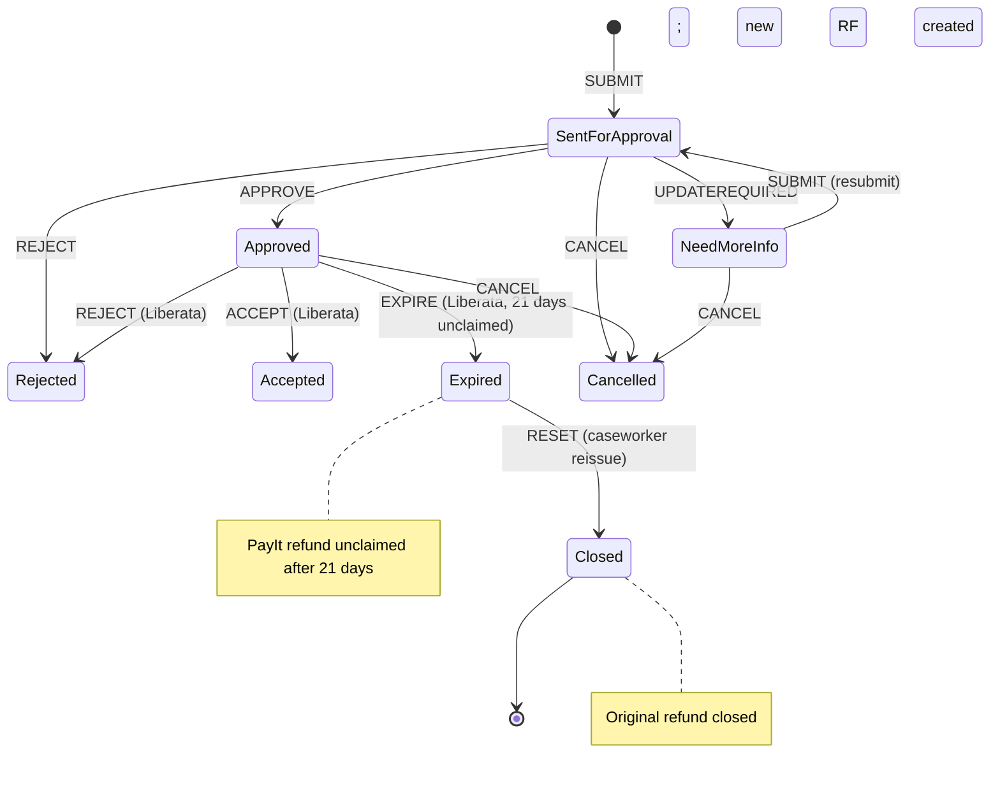
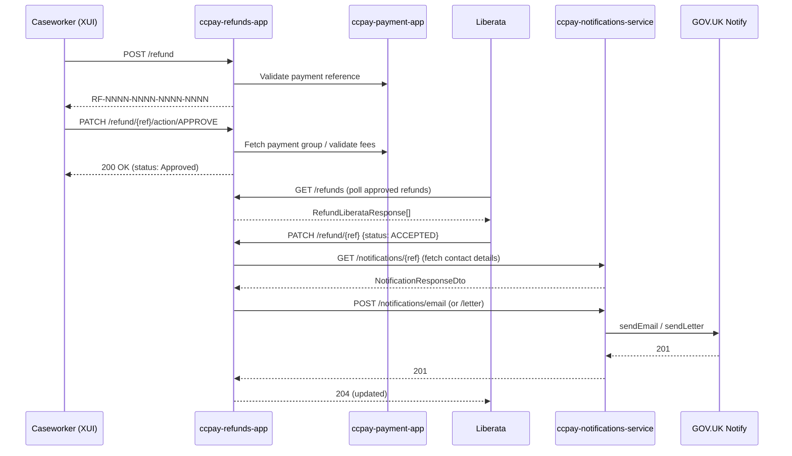

## TL;DR

- The refund lifecycle is managed by `ccpay-refunds-app`, which owns a state machine: Sent for approval → Approved → Accepted/Rejected/Cancelled/Expired/Closed/Reissued.
- A refund request is submitted via `POST /refund`, reviewed (approved/rejected) via `PATCH /refund/{reference}/action/{reviewer-action}`, and reconciled by Liberata via `PATCH /refund/{reference}`.
- Notifications (GOV.UK Notify emails and letters) are dispatched only when Liberata accepts the refund — not at approval time. If a card refund fails, the PayIt flow (NatWest) is triggered automatically.
- When Liberata cannot apply a refund to the original card, it sends a "Rejected" status with reason `"Unable to apply refund to Card"`, which triggers the PayIt journey: the refund is auto-approved by the system, and the citizen receives a link to the Liberata BPA Refunds Portal to provide bank details.
- Expired refunds (unclaimed after 21 days) can be reissued by caseworkers via `POST /refund/reissue-expired/{reference}`, which atomically closes the old refund and creates a new one.
- Refund references follow the pattern `RF-NNNN-NNNN-NNNN-NNNN` (regex: `^RF-\d{4}-\d{4}-\d{4}-\d{4}$`).

## Lifecycle overview


```mermaid
stateDiagram-v2
    [*] --> SentForApproval : SUBMIT
    SentForApproval --> Approved : APPROVE
    SentForApproval --> Rejected : REJECT
    SentForApproval --> NeedMoreInfo : UPDATEREQUIRED
    NeedMoreInfo --> SentForApproval : SUBMIT (resubmit)
    Approved --> Accepted : ACCEPT (Liberata)
    Approved --> Rejected : REJECT (Liberata)
    Approved --> Expired : EXPIRE (Liberata, 21 days unclaimed)
    Expired --> Closed : RESET (caseworker reissue)
    Closed --> [*]
    SentForApproval --> Cancelled : CANCEL
    Approved --> Cancelled : CANCEL
    NeedMoreInfo --> Cancelled : CANCEL

    note right of Expired : PayIt refund unclaimed after 21 days
    note right of Closed : Original refund closed; new RF created
```

The state machine is encoded in the `RefundState` enum (`RefundState.java:8–133`). Events that drive transitions are defined in `RefundEvent`: SUBMIT, APPROVE, REJECT, UPDATEREQUIRED, ACCEPT, CANCEL. Note that `RefundState` only models six states (SENTFORAPPROVAL, NEEDMOREINFO, APPROVED, ACCEPTED, REJECTED, CANCELLED); the additional statuses EXPIRED, CLOSED, and REISSUED are defined in `RefundStatus.java` and are set directly on the entity without going through the state machine transitions.

### All RefundStatus values

| Status | Name | Description | Set by |
|--------|------|-------------|--------|
| SENTFORAPPROVAL | "Sent for approval" | Initial submission | Caseworker |
| APPROVED | "Approved" | Team Leader or System approval | Team Leader / System |
| UPDATEREQUIRED | "Update required" | More information needed | Reviewer |
| ACCEPTED | "Accepted" | Liberata has processed the refund | Liberata |
| REJECTED | "Rejected" | Rejected by reviewer or Liberata | Reviewer / Liberata |
| CANCELLED | "Cancelled" | Cancelled by caseworker | Caseworker |
| EXPIRED | "Expired" | PayIt refund unclaimed for 21 days | Liberata |
| CLOSED | "Closed" | Old refund closed during reissue | System (via caseworker reset) |
| REISSUED | "Reissued" | Marker on new refund linking to original | System (via caseworker reset) |

## Request submission

A caseworker submits a refund via `POST /refund` on `ccpay-refunds-app`. The controller delegates to `RefundsServiceImpl.initiateRefund()` (`RefundsController.java:148–151`), which:

1. Validates the caller's IDAM role against the service type (`RefundServiceRoleUtil.validateRefundRoleWithServiceName`).
2. Generates a reference in the format `RF-NNNN-NNNN-NNNN-NNNN` using `ReferenceUtil`.
3. Persists the `Refund` entity with status **Sent for approval**.
4. Returns `RefundResponse` containing the generated reference.

The request body (`RefundRequest`) carries: `paymentReference`, `refundReason` (code such as `RR001`), `ccdCaseNumber`, `refundAmount`, `paymentAmount`, `feeIds`, `contactDetails`, `refundFees[]`, and `serviceType`.

Refund reason codes are reference data in the refunds schema, seeded by the app's own Liquibase changelogs and served to the UI by `GET /refund/reasons` (`RefundsController.java:123-129`). Each row carries a code, a caseworker-facing `name`, a `description`, and a `recently_used` boolean that marks the codes surfaced first in the picker.

Thirty-five codes are in effect: `RR001`–`RR037` less `RR013` and `RR018`, which are seeded and then deleted by a later changeset (`db.changelog-0.3.yaml:30-35`, `db.changelog-0.6.yaml:16-60`, `db.changelog-0.7.yaml:9-60`, `db.changelog-0.9.yaml:29-31`). They cover amendment and withdrawal (`RR001` Amended claim, `RR004` Application/case withdrawn), court and customer error (`RR005`, `RR006`, `RR008`), duplication and overpayment (`RR009`, `RR010`, `RR011`, `RR037`), remission (`RR036` Retrospective remission), and a per-jurisdiction free-text family `RR027`–`RR035` whose names all begin `Other - ` (`Other - Probate`, `Other - Tribunals`, and so on).

That `Other - ` prefix changes how the request body is validated. `validateRefundReason` accepts either a bare code or the pattern `RR0NN-<text>`; a bare code whose name starts with `Other - ` is rejected with "reason required", and the `RR0NN-<text>` form is rejected for any code whose name does not start with `Other - `. Accepted free-text reasons are stored as `<code>-<jurisdiction>-<text>`, built by stripping `Other - ` from the name and the first six characters from the submitted string (`RefundsServiceImpl.java:539-563`).

All endpoints require both an IDAM JWT and an S2S token. Trusted S2S services: `payment_app`, `ccpay_bubble`, `api_gw`, `ccd_gw`, `xui_webapp`, `pcs_api`, `pt_api` (`application.yaml:70`).

## Approval review

A second caseworker reviews the refund via `PATCH /refund/{reference}/action/{reviewer-action}` (`RefundsController.java:312–325`). The service enforces that the reviewer is not the same IDAM user who submitted the request (`RefundReviewServiceImpl.java:140–150`).

Possible reviewer actions:

| Action | Effect |
|--------|--------|
| APPROVE | Sets status to **Approved**. Validates fees against payment group by calling `ccpay-payment-app`. Does NOT trigger a notification. |
| REJECT | Sets status to **Rejected**. |
| UPDATEREQUIRED | Sets status to **Need More Info**. The submitter can resubmit via `PATCH /refund/resubmit/{reference}`. |

On approval, the refund becomes visible to Liberata via the `GET /refunds` endpoint, which Liberata polls to discover approved refunds awaiting reconciliation.

## Liberata reconciliation callback

Liberata (the middle-office provider) processes the financial refund externally and then calls back into the system via `PATCH /refund/{reference}` with a `RefundStatusUpdateRequest` body:

```json
{
  "status": "ACCEPTED",
  "reason": "optional reason text"
}
```

Valid status values: `ACCEPTED`, `REJECTED`, `EXPIRED`.

The callback is handled by `RefundStatusServiceImpl` and is notably **not gated** by the `refunds-release` LaunchDarkly flag — it remains available even when all user-facing endpoints are disabled (`RefundsController.java:236–244`).

### On ACCEPTED

This is the only point in the lifecycle where a notification is sent (`RefundStatusServiceImpl.java:79–125`):

1. If the refund is a clone produced by a reissue, or its own history contains a rejection noted `"Unable to apply refund to Card"`, `refundInstructionType` is forced to `RefundWhenContacted` and the callback's `reason` is replaced with that original rejection note (`:84–93`). Any cloned refund is therefore treated as refund-when-contacted on acceptance, whatever instruction type it was cloned with.
2. Status becomes ACCEPTED and a status-history entry is added with `createdBy` = `"Middle office provider"` and notes `"Sent to Middle Office for Processing"` (`:95–100`). The refund's own `updatedBy` column is not written on this branch, unlike the EXPIRED and REJECTED branches.
3. A token is minted from the `liberataUser` service-account credentials and swapped into the header map, so the downstream notification calls run as that account rather than on the caller's token (`:102–104`).
4. Contact details are rebuilt from the most recent `Notification` record for the *original* refund reference, fetched from `ccpay-notifications-service` (`:106`, `NotificationServiceImpl.java:306–344`). A successful send nulls `contactDetails` on the refund (`NotificationServiceImpl.java:248`), so this re-fetch is what supplies the address or email. When the lookup returns nothing the miss is logged and the flow continues with whatever is already on the refund (`:108–121`).
5. `RefundsUtil.getTemplate()` picks the GOV.UK Notify template from the instruction type and reason, and `updateNotification()` dispatches it, recording `SENT`, `EMAIL_NOT_SENT`, `LETTER_NOT_SENT` or `ERROR` in `notification_sent_flag` (`:124–125`, `NotificationServiceImpl.java:242–261`).

### On REJECTED (special case — PayIt trigger)

A rejection reason matching `"Unable to apply refund to Card"` (compared case-insensitively) is handled inside the ordinary rejection branch rather than short-circuiting it (`RefundStatusServiceImpl.java:135–158`). The branch first sets REJECTED, `updatedBy` = `"Middle office provider"`, and a status-history entry carrying Liberata's reason. It then sets `refundInstructionType` to `RefundWhenContacted`, overwrites the status with APPROVED, sets `updatedBy` to `"System user"`, and replaces the status-history list with a single `"Refund approved by system"` entry created by `"System user"` (`:144–158`).

This triggers the **PayIt flow**: on the next Liberata acceptance, the "Refund When Contacted" notification template is used, which includes a link to the Liberata BPA Refunds Portal (`https://bparefunds.liberata.com`). The citizen enters their RF (refund reference) and RC (payment reference) to be redirected to NatWest PayIt, where they provide bank details to receive the refund digitally.

<!-- CONFLUENCE-ONLY: PayIt portal URL https://bparefunds.liberata.com and the 3-attempt lockout behaviour are documented in Confluence but not verified in source -->

### On REJECTED (normal)

For other rejection reasons (e.g. "Case details do not match", "Insufficient funds", "Settlement not received", "Transaction not yet received in API"), the status is updated to **Rejected**. No notification is sent. `updatedBy` is set to `"Middle office provider"`.

### On EXPIRED

When a PayIt refund goes unclaimed for 21 days, Liberata sends `{status: "EXPIRED", reason: "Unable to process expired refund"}`. The status is updated to **Expired** with `updatedBy` = `"Middle office provider"`. No notification is sent. The refund becomes eligible for reissue by a caseworker (see [Reissue flow](#reissue-expired-refunds) below).

## Notification dispatch

`ccpay-refunds-app` delegates all notification delivery to `ccpay-notifications-service` via two REST endpoints:

- `POST /notifications/email` — sends a GOV.UK Notify email
- `POST /notifications/letter` — sends a GOV.UK Notify letter

The notifications service is the only component that holds `NotificationClient` beans and communicates directly with GOV.UK Notify via `notifications-java-client` (exact pin — read it from `build.gradle`). It uses separate API keys for emails (`EMAIL_APIKEY`) and letters (`LETTER_APIKEY`) (`EmailNotificationConfig.java:11–25`).

### Template selection

Template ID selection lives in `RefundsUtil.getTemplate()` (`RefundsUtil.java:51–85`) within the refunds app. The reason comparison is case-insensitive, and a refund with a null `refundInstructionType` yields a null template ID rather than a default one:

| Condition | Template set |
|-----------|-------------|
| `refundInstructionType == "RefundWhenContacted"` AND reason == `"Unable to apply refund to Card"` | `refund-when-contacted` templates |
| `refundInstructionType == "RefundWhenContacted"` with any other reason | `cheque-po-cash` templates |
| All other cases | `card-pba` templates |

Each template set has an email and a letter variant, yielding six config keys total under `notify.template.*` in `application.yaml:163–173`.

### Personalisation

The notifications service resolves the human-readable refund reason from its own `notification_refund_reasons` table (keyed by code such as `RR036`) before passing personalisation to Notify (`NotificationServiceImpl.java:452–470`). Personalisation keys sent to GOV.UK Notify:

- **Email**: `refundReference`, `ccdCaseNumber`, `serviceMailbox`, `refundAmount`, `reason`, `customerReference`
- **Letter**: `address_line_1..5`, plus the same fields as email

The `serviceMailbox` is looked up from the `service_contact` table by `serviceName` (`NotificationServiceImpl.java:146–151`).

### Error handling and retry

When `ccpay-notifications-service` returns a 5xx error, `ccpay-refunds-app` sets `notification_sent_flag` to `EMAIL_NOT_SENT` or `LETTER_NOT_SENT` and persists the refund. The retry job endpoint `PATCH /jobs/refund-notification-update` (`RefundsController.java:378–385`) scans the `refunds` table for these flags and re-attempts dispatch using a service account token rather than a user token (`RefundNotificationServiceImpl.java:212–218`).

On 4xx errors from the notifications service, the exception is propagated immediately — no retry is scheduled. GOV.UK Notify errors are wrapped by `GovNotifyExceptionWrapper`: invalid template returns HTTP 422, rate-limit exceeded returns 429, and Notify server errors return 504 (`GovNotifyExceptionWrapper.java:31–90`).

## Reissue expired refunds

When a PayIt refund expires (unclaimed for 21 days), caseworkers with `payments-refund` or `payments-refund-approver` roles can reissue it via the PayBubble UI. The backend endpoint is:

```
POST /refund/reissue-expired/{reference}
```

The reference must match `^RF-\d{4}-\d{4}-\d{4}-\d{4}$`. The endpoint is transactional (`@Transactional(rollbackFor = Exception.class)`, `RefundsController.java:430–431`) and performs these steps atomically (`RefundsServiceImpl.java:1033–1060`, `:1073–1124`):

1. **Validate** the caller's roles against the refund's service type, and that the refund's status is EXPIRED — any other status raises `ReissueExpiredRefundException` with "There was a problem processing the supplied refund reference." (`:1038–1039`, `:1067–1071`).
2. **Close** the original refund: status CLOSED, `updatedBy` set to the caseworker's IDAM user ID, and a status-history entry appended (not replacing the existing history) with notes `"Refund closed by case worker"` (`:1040–1050`).
3. **Clone** the refund: amount, CCD case number, payment reference, reason, refund instruction type, contact details, notification-sent flag, service type, and a fresh copy of every fee row, under a newly generated `RF-` reference (`:1076–1104`).
4. **Set the clone straight to APPROVED**, with `createdBy` = the caseworker's user ID and `updatedBy` = `"System user"`, and two status-history entries, both created by the caseworker: REISSUED carrying the reissue label, then APPROVED with notes `"Refund approved by system"` (`:1092`, `:1101–1116`).
5. **Return** `201 Created` with `{"refundReference": "RF-..."}`.

The reissue label is built by `StatusHistoryUtil.getReissueLabel()` as an ordinal plus the head of the chain — `"1st re-issue of original refund RF-NNNN-NNNN-NNNN-NNNN"` (`StatusHistoryUtil.java:77–103`). The ordinal is derived by counting the distinct refunds under the same payment reference whose history already names that original reference, so numbering follows the chain rather than the payment: a second, unrelated refund on the same payment starts again at `1st`. The original reference is recovered by regex from the earliest REISSUED note, which is why a clone of a clone still points at the first refund in the chain (`StatusHistoryUtil.java:38–62`).

Nothing in the reissue path caps how many times a refund may be reissued; the ordinal simply increments (`StatusHistoryUtil.java:93–100`).

The reissued refund then follows the normal flow: Liberata picks it up, sends ACCEPTED, and the refund-when-contacted notification is triggered.

## Liberata rejection reasons

Liberata sends rejection reasons via `PATCH /refund/{reference}`. The following reasons are documented:

| Rejection Reason | Scenario | Triggers PayIt? |
|-----------------|----------|-----------------|
| `Unable to apply refund to Card` | Card expired/cancelled, refund initially accepted but subsequently fails | Yes — auto-approves for PayIt |
| `Unable to process expired refund` | PayIt refund unclaimed for 21 days | No — sets EXPIRED status |
| `Case details do not match` | CCD case number or fee code mismatch | No |
| `Insufficient funds` | Already refunded, partial refund exists, chargeback | No |
| `Settlement not received` | No receipted transaction from bank | No |
| `Transaction not yet received in API` | Payment not yet in the Payment API | No |

<!-- CONFLUENCE-ONLY: Rejection reason table sourced from Confluence "Natwest PayIT LLD" page. The first two reasons are verified in source (RefundsUtil.REFUND_WHEN_CONTACTED_REJECT_REASON and RefundStatusServiceImpl EXPIRED handling). The remaining four are not verified in source -->

## Notification types (v2.1 distinction)

Refunds v2.1 distinguishes between two notification types sent to citizens:

| Notification | When sent | Content | Applies to |
|-------------|-----------|---------|------------|
| **Offer and Send** | After Liberata sends ACCEPTED status | Confirmation that refund is being processed. Does NOT include a PayIt link. | Card refunds returned to original card |
| **Refund When Contacted** / **Offer and Contact** | After Liberata sends ACCEPTED status for a PayIt-routed refund | Includes link to BPA Refunds Portal for citizen to provide bank details | Online payments where card refund failed; offline payments |

Template selection is driven by `refundInstructionType` and the rejection reason (see [Template selection](#template-selection) above). The refund-when-contacted template is used when `refundInstructionType == "RefundWhenContacted"` and the reason matches `"Unable to apply refund to Card"`.

Approval by a Team Leader dispatches nothing. The APPROVE branch validates the refund fees against `ccpay-payment-app` and moves the status to APPROVED with no notification call (`RefundReviewServiceImpl.java:83–96`); the REJECT branch nulls the refund's contact details and sets `notification_sent_flag` to `NOT_APPLICABLE` (`:98–105`). The single dispatch point is the ACCEPTED branch of the Liberata callback (`RefundStatusServiceImpl.java:124–125`), so a citizen hears nothing between submission and Liberata's acceptance.

<!-- DIVERGENCE: Confluence states the "Offer and Send" notification goes out immediately after Team Leader approval. In ccpay-refunds-app the APPROVE branch sends no notification at all; dispatch happens only when Liberata calls back with ACCEPTED. Source wins. -->

## Sequence diagram


```mermaid
sequenceDiagram
    participant CW as Caseworker (XUI)
    participant RA as ccpay-refunds-app
    participant PA as ccpay-payment-app
    participant LIB as Liberata
    participant NS as ccpay-notifications-service
    participant GOV as GOV.UK Notify

    CW->>RA: POST /refund
    RA->>PA: Validate payment reference
    RA-->>CW: RF-NNNN-NNNN-NNNN-NNNN

    CW->>RA: PATCH /refund/{ref}/action/APPROVE
    RA->>PA: Fetch payment group / validate fees
    RA-->>CW: 200 OK (status: Approved)

    LIB->>RA: GET /refunds (poll approved refunds)
    RA-->>LIB: RefundLiberataResponse[]

    LIB->>RA: PATCH /refund/{ref} {status: ACCEPTED}
    RA->>NS: GET /notifications/{ref} (fetch contact details)
    NS-->>RA: NotificationResponseDto
    RA->>NS: POST /notifications/email (or /letter)
    NS->>GOV: sendEmail / sendLetter
    GOV-->>NS: 201
    NS-->>RA: 201
    RA-->>LIB: 204 (updated)
```

## Key data model details

The `refunds` table stores the core entity with fields including `reference`, `ccd_case_number`, `amount`, `reason` (raw code like `RR036`), `refund_status`, `payment_reference`, `notification_sent_flag`, `contact_details` (JSON), `refund_instruction_type`, and `service_type`. Status history is tracked in a separate `status_history` table with FK to `refunds.id`.

### contact_details JSON shape

The `contact_details` column is persisted as JSON with the following structure (defined in `ContactDetails.java`, serialised with snake_case naming):

```json
{
  "address_line": "string",
  "city": "string",
  "country": "string",
  "county": "string",
  "postal_code": "string",
  "email": "string",
  "notification_type": "string",
  "template_id": "string"
}
```

The `notification_type` determines whether an email or letter is sent. The `template_id` is stored at submission time and reused by the mop-up job if the initial notification fails.

### notification_sent_flag values

| Value | Meaning |
|-------|---------|
| `SENT` | Notification dispatched successfully; `contactDetails` is also nulled on the refund |
| `EMAIL_NOT_SENT` | Email dispatch failed (5xx from notifications service) |
| `LETTER_NOT_SENT` | Letter dispatch failed (5xx from notifications service) |
| `ERROR` | Notifications service returned neither 2xx nor 5xx |
| `NOT_APPLICABLE` | Refund was rejected by the reviewer; no notification required |

`sendNotification` writes lower-case `email_not_sent` or `letter_not_sent` as a placeholder before calling the notifications service, and the upper-case outcome is written afterwards from the response status (`NotificationServiceImpl.java:281`, `:297`, then `:246–260`). When the call throws instead of returning — a 4xx is rethrown as `InvalidRefundNotificationResendRequestException` (`:218–233`) — the lower-case placeholder is what remains, and the mop-up job queries the flag by exact upper-case value (`RefundNotificationServiceImpl.java:133–136`, `:171–175`), so those refunds are never retried.

### service_contact table

The `ccpay-notifications-service` maintains a `service_contact` table mapping a service name to a `service_mailbox`, a `from_email_address` and a `from_mail_address`, all used in notification personalisation. The rows are seeded and amended by its Liquibase changelogs, leaving thirteen services in effect: Family Public Law, Specified Money Claims, Adoption, Immigration and Asylum Appeals, Civil Money Claims, Finrem, Divorce, Financial Remedy, Civil, Family Private Law, Probate, Damages, and Mortgage and Landlord Possession Claims (`db.changelog-0.2.yaml:155–168`, `db.changelog-0.5.yaml:116`, `:164–166`, `db.changelog-0.8.yaml:9–14`).

Lookup is an exact match on the `serviceName` in the notification request. A service name absent from the table does not fail the request — `findByServiceName` returns empty, an empty `ServiceContact` is used instead, and the `serviceMailbox` personalisation key goes to GOV.UK Notify as null (`NotificationServiceImpl.java:146–150`, `:204–209`, `:260–266`).

## IDAM roles and security

| Role | Permissions |
|------|-------------|
| `payments-refund` | Submit refund, resubmit, view refunds, doc-preview, reissue expired |
| `payments-refund-approver` | All of the above plus approve/reject refunds (`PATCH /refund/*/action/*`) |
| `payments` | View refunds, doc-preview |
| `payments-refund-<service>` | Service-scoped refund role (e.g. `payments-refund-probate`) |
| `payments-refund-approver-<service>` | Service-scoped approver role |

`/jobs/**` is configured as `permitAll()` in Spring Security and relies on S2S token
validation rather than IDAM role checks.

`PATCH /refund/*` — the Liberata callback — is gated by a custom `AuthorizationManager`,
`RefundStatusUpdateAuthorizationManager` (`SpringSecurityConfiguration.java:133`), which
admits a request on either of two grounds and rejects everything else
(`RefundStatusUpdateAuthorizationManager.java:45–60`):

1. **A user token carrying a refund role.** The authentication is a
   `JwtAuthenticationToken` and one of its authorities is `payments-refund` or
   `payments-refund-approver`.
2. **An anonymous call from the payments gateway.** There is no authenticated user at
   all, *and* the `ServiceAuthorization` header resolves — via `AuthTokenValidator` —
   to the microservice `ccpay_gw`, which must also appear in
   `idam.s2s-authorised.services`.

The two are exclusive by construction: branch 2 requires the request to be anonymous,
so a caller that presents a user token without a refund role is rejected even when it
arrives through APIM with a valid `ccpay_gw` S2S token. Adding the S2S token does not
rescue a wrong-role user token — drop the user token instead.

Only `ccpay_gw` qualifies, hardcoded as a constant and required alongside the configured
list, so listing another service in `idam.s2s-authorised.services` does not grant it this
endpoint (`RefundStatusUpdateAuthorizationManager.java:28`, `:90`).

## Feature flags

| Flag | Effect |
|------|--------|
| `refunds-release` | When `true`, returns 503 for all user-facing endpoints. Does NOT gate the Liberata callback or the retry job. |
| `payment-status-update-flag` | Gates the payment-failure-report endpoint only. |

## Examples

### Refund state machine enum

```java
// Source: apps/payment/ccpay-refunds-app/src/main/java/uk/gov/hmcts/reform/refunds/state/RefundState.java

public enum RefundState {

    SENTFORAPPROVAL {
        @Override
        public RefundEvent[] nextValidEvents() {
            return new RefundEvent[]{RefundEvent.APPROVE, RefundEvent.REJECT, RefundEvent.UPDATEREQUIRED};
        }

        @Override
        public RefundState nextState(RefundEvent event) {
            switch (event) {
                case APPROVE:     return APPROVED;
                case REJECT:      return REJECTED;
                case UPDATEREQUIRED: return NEEDMOREINFO;
                case CANCEL:      return CANCELLED;
                default:          return this;
            }
        }
    },
    APPROVED {
        @Override
        public RefundEvent[] nextValidEvents() {
            return new RefundEvent[]{RefundEvent.ACCEPT, RefundEvent.REJECT};
        }

        @Override
        public RefundState nextState(RefundEvent refundEvent) {
            switch (refundEvent) {
                case ACCEPT: return ACCEPTED;
                case REJECT: return REJECTED;
                case CANCEL: return CANCELLED;
                default:     return this;
            }
        }
    },
    // ... NEEDMOREINFO, ACCEPTED, REJECTED, CANCELLED
    ;
}
```

### Liberata callback: auto-approve for PayIt on card-refund failure

```java
// Source: apps/payment/ccpay-refunds-app/src/main/java/uk/gov/hmcts/reform/refunds/services/RefundStatusServiceImpl.java

// When Liberata sends REJECTED with reason "Unable to apply refund to Card",
// the system auto-approves for the PayIt journey instead of rejecting.
if (null != statusUpdateRequest.getReason()
    && statusUpdateRequest.getReason().equalsIgnoreCase(
        RefundsUtil.REFUND_WHEN_CONTACTED_REJECT_REASON)) {

    refund.setRefundInstructionType(RefundsUtil.REFUND_WHEN_CONTACTED);
    refund.setRefundStatus(RefundStatus.APPROVED);
    refund.setUpdatedBy(SYSTEM_USER); // "System user"
    // status history records "Refund approved by system"
}
```

## See also

- [Reference: API Refunds](../reference/api-refunds.md) — full endpoint catalogue, request/response shapes, and notification template matrix
- [Reconciliation](reconciliation.md) — how Liberata's refund callbacks fit into the broader financial reconciliation picture
- [Architecture](architecture.md) — `ccpay-refunds-app` and `ccpay-notifications-service` spoke descriptions
- [Glossary](../reference/glossary.md) — definitions for Liberata, PayIt, RF reference, S2S
