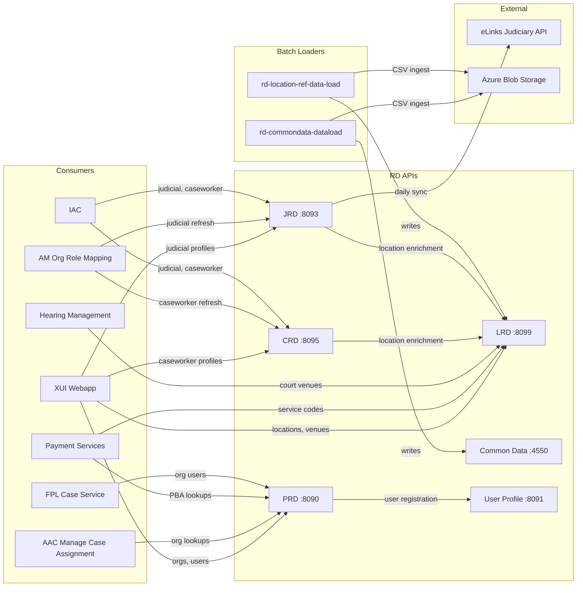

## TL;DR

- Reference Data is 6 independent Spring Boot 3 / Java 21 REST APIs plus 2 batch-load Kubernetes CronJobs, each with its own PostgreSQL database.
- Service ports: PRD 8090, User Profile 8091, JRD 8093, CRD 8095, LRD 8099, Common Data 4550.
- CRD and JRD publish domain events to Azure Service Bus topics (`rd-caseworker-topic`, `rd-judicial-topic`) consumed by AM Org Role Mapping.
- The two batch loaders (`rd-commondata-dataload`, `rd-location-ref-data-load`) are Apache Camel jobs that ingest CSVs from Azure Blob Storage — they have no persistent HTTP surface.
- All APIs use S2S + IDAM OAuth2 authentication; each declares an `s2s-authorised.services` allowlist. All use LaunchDarkly (`LD_SDK_KEY`) for runtime feature flags.
- JRD integrates with the external eLinks judiciary middleware API (`/people`, `/leavers`, `/deleted` endpoints) for daily data refresh; a design exists to consolidate to `/people` only with a 90-day leaver grace period, but this refactoring is not yet implemented.

## Service inventory

| Service | Repo | Port | DB Schema | S2S name |
|---------|------|------|-----------|----------|
| Professional Reference Data (PRD) | `rd-professional-api` | 8090 | `dbrefdata` | `rd_professional_api` |
| User Profile | `rd-user-profile-api` | 8091 | `dbuserprofile` | `rd_user_profile_api` |
| Judicial Reference Data (JRD) | `rd-judicial-api` | 8093 | `dbjudicialdata` | `rd_judicial_api` |
| Caseworker Reference Data (CRD) | `rd-caseworker-ref-api` | 8095 | `dbrdcaseworker` | `rd_caseworker_ref_api` |
| Location Reference Data (LRD) | `rd-location-ref-api` | 8099 | `locrefdata` | `rd_location_ref_api` |
| Common Data | `rd-commondata-api` | 4550 | `dbcommondata` | `rd_commondata_api` |

Each service runs independently with its own PostgreSQL instance, Flyway-managed schema migrations (`src/main/resources/db/migration/`), and Azure Key Vault secrets mounted at `/mnt/secrets/rd/`.

## Consumer topology



## Inter-service dependencies

Within the RD product, services call each other:

- **PRD -> User Profile**: PRD delegates all IDAM user creation/management to `rd-user-profile-api` via `UserProfileFeignClient`. When an organisation is activated, the super user is registered through this channel (`rd-professional-api:src/main/java/.../controller/SuperController.java:370`).
- **CRD -> LRD**: CRD calls LRD at `${LOCATION_REF_DATA_URL}` (endpoints `/refdata/location/building-locations` and `/refdata/location/orgServices`) to validate and enrich caseworker location assignments (`rd-caseworker-ref-api:src/main/resources/application.yaml:129`).
- **JRD -> LRD**: JRD calls LRD's `/refdata/location/orgServices` endpoint via `LocationReferenceDataFeignClient` when the `ccdServiceNames` refresh parameter is used (`rd-judicial-api:src/main/java/.../service/impl/ElinkUserServiceImpl.java:153`).

## Azure Service Bus topics

Two services publish domain events after data mutations:

| Topic | Publisher | Payload | Consumers |
|-------|-----------|---------|-----------|
| `rd-caseworker-topic` | CRD | `{"userIds": ["<caseWorkerId>", ...]}` batched in chunks of 50 | AM Org Role Mapping |
| `rd-judicial-topic` | JRD | `{"userIds": ["<sidamId>", ...]}` batched in chunks of 50 | AM Org Role Mapping |

Both publishers use `ServiceBusSenderClient` with transactional sends. The batch size is configurable: `crd.publisher.caseWorkerDataPerMessage` for CRD (`rd-caseworker-ref-api:src/main/java/.../servicebus/TopicPublisher.java:41`) and `${JRD_DATA_PER_MESSAGE:50}` for JRD (`rd-judicial-api:src/main/java/.../servicebus/ElinkTopicPublisher.java:42`).

Publishing happens after profile create/update operations. If the ASB publish fails, the database transaction has already committed — the profile is saved but the event is lost. CRD throws `CaseworkerMessageFailedException`; JRD throws `ElinksException` and sends a failure email to `DLRefDataSupport@hmcts.net`.

## Batch loaders

The two batch-load services are not persistent HTTP servers. They run as Kubernetes CronJobs (once daily per cluster):

| Job | Source | Target DB | Blob container |
|-----|--------|-----------|----------------|
| `rd-commondata-dataload` | GPG-encrypted CSVs (FlagDetails, FlagService, OtherCategories, ListOfValues, CaseLinkingReasons) | `dbcommondata` | `rd-common-data` |
| `rd-location-ref-data-load` | CSVs (CourtVenue, BuildingLocation, OrgServiceCCDMapping) | `locrefdata` | `lrd-ref-data` |

Both use Apache Camel routes from `data-ingestion-lib`, decrypt (GPG) or read files from Azure Blob Storage, validate and transform records, then write directly to the database. ShedLock prevents concurrent runs. Files are archived to a separate blob container after processing.

## eLinks integration (JRD only)

`rd-judicial-api` runs a daily scheduled job (`ElinksApiJobScheduler`, cron `${CRON_EXPRESSION:* 55 15 * * *}`) that pulls judicial profile data from the external eLinks judiciary middleware API at `${ELINKS_URL}` (default: `https://judiciary-middleware-futureehr.herokuapp.com/api/v5`). The scheduler is gated by `${SCHEDULER_ENABLED:false}` and uses ShedLock (lock `lockedTask`, `lockAtMostFor` 20 min, `lockAtLeastFor` 10 min) to prevent concurrent runs across pods. A once-per-day guard also prevents re-runs if the job has already completed today.

The pipeline runs in sequence (each step individually try/caught so a failure does not abort subsequent steps):

1. **Locations** — fetches base location reference data from `/reference_data/location`
2. **People** — fetches/updates judicial office holder profiles from `/people` (paginated, `${PER_PAGE:50}` per page, with configurable retry on 503/429 up to threshold of 5)
3. **Leavers** — fetches from `/leavers` and marks profiles that have left the judiciary
4. **Deleted** — fetches from `/deleted` and marks profiles deleted in eLinks
5. **IDAM Elastic Search** — back-fills `sidamId` via IDAM Elastic Search
6. **IDAM SSO Search** — finds IDAM accounts via `/idam/find`
7. **ASB publish** — publishes all known SIDAM IDs to `rd-judicial-topic`
8. **Cleanup** — removes raw eLinks responses older than `${Clean_Elinks_Responses_Days:30}` days; physically deletes profiles flagged as deleted for over `${Del_Joh_Profiles_Years:7}` years

<!-- DIVERGENCE: Confluence "Judicial Reference Data - eLinks Load" (id 1838620475) proposes using ONLY the /people endpoint and retiring /leavers and /deleted. Source code (ElinksApiJobScheduler.java + ElinksFeignClient.java) still calls all three endpoints. The refactoring is a design target, not yet implemented. Source wins. -->

Authentication uses a token header (`Authorization: Token <key>`) from Key Vault secret `judicial_api_elinks_api_key`. Each step is gated by a LaunchDarkly feature flag (e.g. `jrd-elinks-location`, `jrd-elinks-load-people`, `jrd-elinks-leavers`, `jrd-elinks-load-deleted`, `jrd-elinks-idam-elastic-search`, `jrd-elinks-idam-sso-search`, `jrd-elinks-publish-service-bus`) — if the flag is off, the step returns 403 and is recorded as failed without aborting the pipeline.

### Data volumes (from HLD)

The JRD HLD estimates end-state volumes at approximately:

| Entity | Estimated records |
|--------|------------------|
| Judicial profiles | ~30,000 (26k active magistrates from eLinks) |
| Judicial appointments | ~60,000 (est. 2 per profile) |
| Judicial authorisations | ~150,000 (est. 5 per profile) |

<!-- CONFLUENCE-ONLY: not verified in source -->

### Planned refactoring: eLinks load consolidation

A Confluence design document ("Judicial Reference Data - eLinks Load") proposes the following changes that are **not yet implemented**:

- Retire `/leavers` and `/deleted` endpoints; use only `/people` (which returns all record types)
- Introduce a 90-day **leaver grace period**: leavers remain active with `left_flag=true`, appointments/roles extended by grace period duration, enabling completion of in-flight work
- Handle JOH corrections by matching on `object_id` when `personal_code` records are merged
- JRD to allocate CFT IdAM IDs directly (by personal_code or object_id match, or new UUID)
- Periodic full refreshes to mitigate incremental-load bugs

<!-- CONFLUENCE-ONLY: not verified in source -->

## Authentication and authorisation

All six APIs enforce a two-layer auth model:

1. **S2S (service-to-service)**: `ServiceAuthFilter` validates the `ServiceAuthorization` JWT header against the S2S provider at `${S2S_URL}`. The calling service name must appear in the `s2s-authorised.services` allowlist. Example allowlist for PRD: `rd_professional_api, rd_user_profile_api, xui_webapp, finrem_payment_service, fpl_case_service, iac, aac_manage_case_assignment, divorce_frontend` (`rd-professional-api:src/main/resources/application.yaml:114`).

2. **IDAM OAuth2**: Bearer token validation via Spring Security resource server. Endpoints are secured with `@Secured` role annotations (e.g. `prd-admin`, `staff-admin`, `jrd-system-user`). Some endpoints (org creation in PRD, refresh-users in CRD, internal eLinks pipelines in JRD) are on the `permitAll` path — they require S2S but not a bearer token.

## Non-functional requirements

The master Reference Data HLD specifies platform-wide NFRs that apply to all six API services:

| Metric | Target |
|--------|--------|
| Availability | 99.5% service availability |
| Reliability | Maximum one P1 service fault per quarter |
| Data durability | 99.999999% |
| Recovery | Maximum 3.6 hours to restore live service; no loss of transactions |
| Response time (90th percentile) | 1.0 seconds |
| Response time (95th percentile) | 1.5 seconds |
| Response time (99th percentile) | 2.0 seconds |

<!-- CONFLUENCE-ONLY: not verified in source -->

CRD-specific: data load of ~17,000 caseworker profiles must complete within 2 hours during out-of-business hours with no degradation to API response during loading. JRD-specific: data load of ~30,000 judicial profiles must similarly complete within 2 hours.

## Data governance

- Reference Data does **not** master any data — it centralises and exposes a common facade over data mastered elsewhere (Judicial Office via eLinks, MRD team for locations/common data, service managers for caseworkers, SRA/Manage Org for professional organisations).
- Two classes of data: **System Reference Data** (read-only lookup values shared platform-wide) and **Business Reference Data** (operational structures managed by sub-teams).
- Every consumer of RD APIs is expected to have DPIA (Data Protection Impact Assessment) approval before API consumption is approved.
- Audit records are maintained for all CRUD operations across all services.

<!-- CONFLUENCE-ONLY: not verified in source -->

## Database conventions

- All services use Flyway with `out-of-order: true` to allow hotfix migrations.
- All Jenkinsfiles call `enableDbMigration('rd')` at deploy time.
- Each service uses a custom schema (not `public`): `dbrefdata`, `dbjudicialdata`, `dbrdcaseworker`, `locrefdata`, `dbcommondata`, `dbuserprofile`.
- Secrets (DB credentials, API keys, ASB connection strings) are read from Azure Key Vault mounted at `/mnt/secrets/rd/` via Spring's `configtree:` mechanism.

## CRD: caseworker user categories

The CRD HLD defines three categories of caseworker users whose profiles are managed:

- **CTRT users** — court users working in regional units, supporting judiciary
- **CTSC users** — contact centre users who use customer care platforms to support citizen queries via telephone or email
- **Legal Advisors** — users with delegated judicial responsibilities, managed by the Legal Office (not Judicial Office)

These profiles contain jurisdictional mapping and location markers used for XUI listing and work allocation optimisation. Source data comes from service managers who upload encrypted Excel files via a multipart HTTP POST through the Staff admin UI. A mandatory IDAM role `crd_caseworker` is added to every user provisioned through this process, enabling tracking of CRD-onboarded users.

<!-- CONFLUENCE-ONLY: not verified in source -->

## PRD: user deletion model

PRD uses **soft delete** for professional users removed from organisations. The deletion flow (designed for Manage Org self-service, currently implemented via support tickets for SQL hard-deletes):

1. Remove professional case roles via CCD Assign Case Access API
2. Remove all PROFESSIONAL-category role assignments via RAS delete-by-query
3. Remove professional IdAM roles (same set created at registration, including retired historic roles)
4. If no remaining IdAM roles or role assignments, delete the IdAM account entirely
5. Mark user as deleted in PRD database (soft delete)

Organisation administrator protection: any update is rejected if it would leave the organisation with no administrator users capable of adding/modifying other users.

<!-- CONFLUENCE-ONLY: not verified in source -->

## In-development: LRD Court Venue API V2

A design document describes breaking changes to the LRD Court Venue data model (extending V1.3):

- **Normalisation**: separate entities for venue names (by type and language), addresses, and contact details replace the flat `court_venue` table
- **New fields**: `MRD_Venue_ID` (strategic PK), `District_Registry_Venue_ID`, `Appeal_Centre_Venue_ID` (self-referencing FKs), `External_Short_Name` with Welsh variants, `Contact_Email`, `Breathing_Space_Email`
- **V2 endpoints**: `GET /refdata/location/v2/court-venues` and `/v2/court-venues/venue-search` returning nested JSON structure; V1 retained with deprecation headers until consumer migration
- **Security**: unchanged from V1 (IDAM role + S2S whitelist)

As of the current source code, no V2 endpoints or normalised entities exist — this remains a design target.

<!-- CONFLUENCE-ONLY: not verified in source -->

## Examples

### S2S allowlist configuration (PRD `application.yaml`)

```yaml
// Source: apps/rd/rd-professional-api/src/main/resources/application.yaml
idam:
  s2s-auth:
    microservice: rd_professional_api
    url: ${S2S_URL:http://rpe-service-auth-provider-aat.service.core-compute-aat.internal}
  s2s-authorised:
    services: ${PRD_S2S_AUTHORISED_SERVICES:rd_professional_api,rd_user_profile_api,xui_webapp,finrem_payment_service,fpl_case_service,iac,aac_manage_case_assignment,divorce_frontend}
```

### Security filter chain (PRD `SecurityConfiguration.java`)

The `ServiceAuthFilter` is wired before the Bearer token filter. Paths listed in `authorizeHttpRequests().permitAll()` still require a valid S2S token — they only skip IDAM bearer-token checking.

```java
// Source: apps/rd/rd-professional-api/src/main/java/uk/gov/hmcts/reform/professionalapi/configuration/SecurityConfiguration.java
@Bean
public SecurityFilterChain filterChain(HttpSecurity http) throws Exception {
    http.addFilterBefore(serviceAuthFilter, BearerTokenAuthenticationFilter.class)
            .authorizeHttpRequests(a -> a
                    .requestMatchers(HttpMethod.POST, "/refdata/external/v1/organisations").permitAll()
                    .requestMatchers(HttpMethod.GET, "/refdata/internal/v1/organisations/users").permitAll()
                    .requestMatchers(HttpMethod.POST,
                            "/refdata/internal/v1/organisations/getOrganisationsByProfile").permitAll()
                    // ... other S2S-only paths
                    .anyRequest().authenticated())
            .oauth2ResourceServer(a -> a.jwt(j -> j.jwtAuthenticationConverter(jwtAuthenticationConverter)));
    return http.build();
}
```

### ASB topic publisher — CRD (`TopicPublisher.java`)

Partitions the caseworker ID list into batches of `caseWorkerDataPerMessage` (default 50) and sends each as a transactional `ServiceBusMessage`.

```java
// Source: apps/rd/rd-caseworker-ref-api/src/main/java/uk/gov/hmcts/reform/cwrdapi/servicebus/TopicPublisher.java
@Value("${crd.publisher.caseWorkerDataPerMessage}")
int caseWorkerDataPerMessage;

public void sendMessage(@NotNull List<String> caseWorkerIds) {
    ServiceBusTransactionContext transactionContext = serviceBusSenderClient.createTransaction();
    try {
        // partition list into chunks of caseWorkerDataPerMessage
        ListUtils.partition(caseWorkerData, caseWorkerDataPerMessage)
                .forEach(data -> {
                    PublishCaseWorkerData chunk = new PublishCaseWorkerData();
                    chunk.setUserIds(data);
                    serviceBusMessages.add(new ServiceBusMessage(new Gson().toJson(chunk)));
                });
        serviceBusSenderClient.sendMessages(messageBatch, transactionContext);
        serviceBusSenderClient.commitTransaction(transactionContext);
    } catch (Exception exception) {
        serviceBusSenderClient.rollbackTransaction(transactionContext);
        throw new CaseworkerMessageFailedException(CaseWorkerConstants.ASB_PUBLISH_ERROR);
    }
}
```

### ASB topic publisher — JRD (`ElinkTopicPublisher.java`)

Identical batching pattern; uses `jrd.publisher.jrd-message-batch-size` (default 50).

```java
// Source: apps/rd/rd-judicial-api/src/main/java/uk/gov/hmcts/reform/judicialapi/elinks/servicebus/ElinkTopicPublisher.java
@Value("${jrd.publisher.jrd-message-batch-size}")
int jrdMessageBatchSize;

public void sendMessage(@NotNull List<String> judicalIds, String jobId) {
    ServiceBusTransactionContext elinktransactionContext = elinkserviceBusSenderClient.createTransaction();
    try {
        partition(judicalIds, jrdMessageBatchSize)
            .forEach(data -> {
                PublishingData chunk = new PublishingData();
                chunk.setUserIds(data);                          // key is "userIds" in JSON
                serviceBusMessages.add(new ServiceBusMessage(new Gson().toJson(chunk)));
            });
        elinkserviceBusSenderClient.commitTransaction(elinktransactionContext);
    } catch (Exception exception) {
        elinkserviceBusSenderClient.rollbackTransaction(elinktransactionContext);
        throw new ElinksException(HttpStatus.UNAUTHORIZED, UNAUTHORIZED_ERROR, UNAUTHORIZED_ERROR);
    }
}
```

### eLinks Feign client (`ElinksFeignClient.java`)

The four eLinks endpoints JRD calls during its daily pipeline.

```java
// Source: apps/rd/rd-judicial-api/src/main/java/uk/gov/hmcts/reform/judicialapi/elinks/feign/ElinksFeignClient.java
@FeignClient(name = "ElinksFeignClient", url = "${elinksUrl}",
        configuration = ElinksFeignInterceptorConfiguration.class)
public interface ElinksFeignClient {

    @GetMapping("/reference_data/location")
    Response getLocationDetails();

    @GetMapping("/people")
    Response getPeopleDetails(@RequestParam("updated_since") String updatedSince,
                              @RequestParam("per_page") String perPage,
                              @RequestParam("page") String page,
                              @RequestParam("include_previous_appointments") boolean includePreviousAppointments);

    @GetMapping("/leavers")
    Response getLeaversDetails(@RequestParam("left_since") String updatedSince,
                               @RequestParam("per_page") String perPage,
                               @RequestParam("page") String page);

    @GetMapping("/deleted")
    Response getDeletedDetails(@RequestParam("deleted_since") String updatedSince,
                               @RequestParam("per_page") String perPage,
                               @RequestParam("page") String page);
}
```

### eLinks scheduler cron + ShedLock (`ElinksApiJobScheduler.java`)

```java
// Source: apps/rd/rd-judicial-api/src/main/java/uk/gov/hmcts/reform/judicialapi/elinks/scheduler/ElinksApiJobScheduler.java
@Scheduled(cron = "${elinks.scheduler.cronExpression}")
@SchedulerLock(name = "lockedTask",
        lockAtMostFor = "${elinks.scheduler.lockAtMostFor}",
        lockAtLeastFor = "${elinks.scheduler.lockAtLeastFor}")
public void loadElinksJob() {
    if (isSchedulerEnabled) {
        // guard: skip if job already ran today
        DataloadSchedulerJob latestEntry = dataloadSchedulerJobRepository.findFirstByOrderByIdDesc();
        if (currentDate.equals(startDate) || currentDate.equals(endDate)) {
            log.info("JRD load failed since job has already ran for the day");
            return;
        }
        loadElinksData();   // calls location, people, leavers, deleted, idam, publish, cleanup
    }
}
```

eLinks configuration defaults (from `application.yaml`):

```yaml
// Source: apps/rd/rd-judicial-api/src/main/resources/application.yaml
elinksUrl: ${ELINKS_URL:https://judiciary-middleware-futureehr.herokuapp.com/api/v5}
elinks:
  people:
    perPage: ${PER_PAGE:50}
    lastUpdated: ${LAST_UPDATED:2015-01-01}
    threadPauseTime: ${THREAD_PAUSE_TIME:2000}
    retriggerThreshold: ${RETRIGGER_THRESHOLD:5}
  scheduler:
    cronExpression: ${CRON_EXPRESSION:* 55 15 * * *}
    enabled: ${SCHEDULER_ENABLED:false}
  delJohProfilesYears: ${Del_Joh_Profiles_Years:7}
  cleanElinksResponsesDays: ${Clean_Elinks_Responses_Days:30}
```

## See also

- [Overview](overview.md) — product-wide summary of all six RD services and the integration onboarding process
- [Batch Loading](batch-loading.md) — detailed explanation of how `rd-commondata-dataload` and `rd-location-ref-data-load` ingest data via Apache Camel CronJobs
- [Register as S2S Caller](../how-to/register-as-s2s-caller.md) — step-by-step guide for getting a new service onto an RD API's S2S allowlist
- [Glossary](../reference/glossary.md) — definitions of S2S, ASB, ShedLock, eLinks, EPIMMS, and other cross-cutting terms
