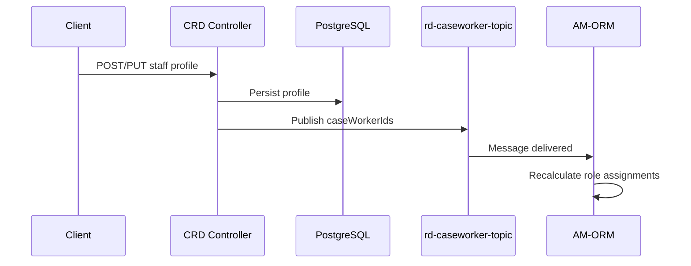

## TL;DR

- CRD (`rd-caseworker-ref-api`) is the authoritative store for HMCTS caseworker user profiles — name, email, region, roles, work areas, locations, and skills. It serves approximately 17,000 staff across England, Wales, Scotland, and Northern Ireland.
- Profiles are keyed on `caseWorkerId` (the IDAM user ID string), not a database-generated sequence. Profile creation orchestrates with IDAM (user identity) and User Profile (UP) services.
- IDAM role derivation uses a `(role_id, service_code) -> idam_role` mapping table (`case_worker_idam_role_assoc`), so CRD roles + work areas determine which IDAM roles a caseworker receives.
- After every create or update, CRD publishes the affected `caseWorkerId` values to the Azure Service Bus topic `rd-caseworker-topic`; the primary subscriber is `am_org_role_mapping_service` (AM-ORM), which triggers role mapping recalculation.
- Two controller families exist: the legacy `CaseWorkerRefUsersController` (bulk admin flows, secured by `cwd-admin`/`cwd-system-user`) and the newer `StaffRefDataController` (Staff UI, secured by `staff-admin`).
- Runs on port 8095, PostgreSQL schema `dbrdcaseworker`, Flyway-managed. Consumers include IAC, ExUI, Access Management, and Work Allocation.

## Profile data model

The central entity is `CaseWorkerProfile` (`src/main/java/uk/gov/hmcts/reform/cwrdapi/domain/CaseWorkerProfile.java:30`), mapped to the `case_worker_profile` table in the `dbrdcaseworker` schema.

Core fields:

| Field | Type | Notes |
|-------|------|-------|
| `caseWorkerId` | varchar(64), PK | IDAM user ID — not DB-generated |
| `firstName` | varchar | |
| `lastName` | varchar | |
| `emailId` | varchar, unique, not null | Primary lookup key |
| `userTypeId` | FK to `user_type` | e.g. CTSC, HMCTS |
| `region` | varchar | Human-readable region name |
| `regionId` | int | Numeric region identifier |
| `suspended` | boolean | Formerly `delete_flag` (renamed in V1_4) |
| `caseAllocator` | boolean | Added in V1_10 |
| `taskSupervisor` | boolean | Added in V1_10 |
| `userAdmin` | boolean | Added in V1_17 |

The profile owns four child collections, all with `CascadeType.ALL` and orphan removal (full replacement on update):

- **`caseWorkerLocations`** — court/building location assignments (table `case_worker_location`)
- **`caseWorkerWorkAreas`** — service/area-of-law assignments (table `case_worker_work_area`)
- **`caseWorkerRoles`** — CRD role assignments (table `case_worker_role`)
- **`caseWorkerSkills`** — skill assignments (table `case_worker_skill`)

All child collections use `FetchMode.SUBSELECT` for performance (`CaseWorkerProfile.java:84–122`).

The entity implements `Persistable<String>` with a transient `isNew` flag. The service layer sets this to `true` when creating a new record, forcing JPA to execute an `INSERT` rather than attempting a `MERGE` (`CaseWorkerProfile.java:103–116`).

## Skill assignments

Skills are stored in a static `skill` table (created in `V1_17__staff_ui_tables.sql:11–19`) with columns:

| Column | Description |
|--------|-------------|
| `skill_id` | PK, sequence-generated |
| `skill_code` | Convention: `SKILL:<SERVICE_CODE>:<NAME>` (e.g. `SKILL:ABA5:TEST1`) |
| `description` | Human-readable label |
| `service_id` | Groups skills by service |
| `user_type` | Constrains which user types can hold the skill |

The join entity `CaseWorkerSkill` (`CaseWorkerSkill.java:26–71`) links a caseworker to a skill with a unique constraint on `(case_worker_id, skill_id)`.

The Staff UI retrieves available skills via:

```
GET /refdata/case-worker/skill?service_codes=<csv>
```

This endpoint (`StaffRefDataController.java:164–176`) returns a `StaffWorkerSkillResponse` grouping skills by service. It is secured with the `staff-admin` role.

## Location assignments

Each caseworker can be assigned to one or more locations via the `case_worker_location` table. Key fields:

- `locationId` — integer referencing an EPIMMS ID in LRD
- `location` — human-readable building/court name
- `primaryFlag` — boolean indicating the caseworker's primary location (added in `V1_25__alter_case_worker_location.sql`)

CRD validates and enriches location data by calling LRD's `GET /refdata/location/building-locations` and `GET /refdata/location/orgServices` endpoints via a Feign client. The LRD URL is configured at `application.yaml:129` as:

```yaml
locationRefDataUrl: ${LOCATION_REF_DATA_URL:http://rd-location-ref-api-aat.service.core-compute-aat.internal}
```

S2S authentication is propagated through the Feign interceptor using the `rd_caseworker_ref_api` microservice identity.

## User types

The `user_type` table holds a static set of caseworker categories. These are maintained via Flyway migrations:

| user_type_id | Description | Notes |
|-------------|-------------|-------|
| 1 | CTSC | Contact centre users supporting citizen queries via phone/email |
| 2 | Future Operations | Originally "CTRT" (court users in regional units); renamed in V1_12 |
| 3 | Legal office | Legal advisors with delegated judicial responsibilities |
| 4 | NBC | National Business Centre; added in V1_12 |
| 5 | Other Government Department | OGD users (DWP, HMRC); added in V1_14 |

## Role types (CRD business roles)

The `role_type` table defines CRD-specific caseworker roles (distinct from IDAM roles). These are referenced by `CaseWorkerRole` and used in the IDAM role derivation mapping. Key entries:

| role_id | Description |
|---------|-------------|
| 1 | senior-tribunal-caseworker |
| 2 | tribunal-caseworker |
| 3 | Hearing Centre Team Leader |
| 4 | Hearing Centre Administrator |
| 5 | Court Clerk |
| 6 | National Business Centre Team leader |
| 7 | National Business Centre Listing team |
| 8 | National Business Centre Payments team |
| 9 | CTSC team leader |
| 10 | CTSC Administrator |
| 14 | DWP Caseworker |
| 15 | HMRC Caseworker |

Additional roles continue to be added via `V1_24` through `V1_33` migrations as new services onboard.

## Work areas (service assignments)

The `case_worker_work_area` table (`CaseWorkerWorkArea.java`) links a caseworker to one or more services. Key fields:

| Field | Type | Notes |
|-------|------|-------|
| `caseWorkerId` | varchar | FK to profile |
| `areaOfWork` | varchar(128) | Human-readable service name |
| `serviceCode` | varchar(16) | HMCTS service code (e.g. `BBA9`, `BAA1`, `ABA5`) |

Unique constraint: `(case_worker_id, service_code)` — a caseworker cannot be assigned to the same service twice.

The Excel upload template uses headers `Service1`, `Service1 ID`, `Service2`, `Service2 ID`, etc. (up to Service8) to assign multiple work areas per user (`application.yaml:144–149`).

## IDAM role derivation

CRD does not store IDAM roles directly on the profile. Instead, it derives them at create/update time using a mapping table:

```
case_worker_idam_role_assoc
  cw_idam_role_assoc_id  PK (sequence)
  role_id                FK -> role_type
  service_code           varchar(16)
  idam_role              varchar(64)
```

The derivation logic (`CaseWorkerIdamRoleAssociation.java`):

1. For each user, identify their CRD `role_id` values (from `case_worker_role`) and their `service_code` values (from `case_worker_work_area`).
2. Look up every `(role_id, service_code)` combination in `case_worker_idam_role_assoc` to get the set of IDAM roles.
3. Call IDAM to add these roles to the user. Roles are **only added, never removed** by this process (CRD11.2 was withdrawn as too risky for services not yet using WA/Staff Upload).
<!-- REVIEW: The mandatory IDAM role is "cwd-user" (hyphenated, lowercase), not "CWD_user". See rd-caseworker-ref-api:src/main/java/uk/gov/hmcts/reform/cwrdapi/util/CaseWorkerConstants.java:128 which defines ROLE_CWD_USER = "cwd-user". -->
4. A mandatory role `CWD_user` is added to every user provisioned through CRD, used as a marker that the user was onboarded via this system.

<!-- CONFLUENCE-ONLY: CWD_user mandatory role claim from HLD page 1391526853. Not explicitly visible as a constant in current source code, but the business rule is documented in Confluence. -->

The mapping is loaded via the `POST /refdata/case-worker/upload-file` API using a separate Excel file/sheet named "Service to CW Roles Mapping" (sheet must contain exactly one service code per file).

## Email domain validation

CRD validates that caseworker email addresses belong to an approved set of government domains. The `EmailValidator` class (`EmailValidator.java`) implements a `ConstraintValidator` that:

1. Extracts the domain portion of the email address.
2. Checks it against the configurable allowlist (`application.yaml:167`):
   ```
   justice.gov.uk, dwp.gov.uk, hmrc.gov.uk, hmcts.net, dfcni.gov.uk, ibca.org.uk, cabinetoffice.gov.uk
   ```
3. Validates the local part (before `@`) matches the regex pattern:
   ```
   ^[A-Za-z0-9]+[\w!#$%&''.*+/=?`{|}~^-]+(?:\.[\w!#$%&'*+/=?`{|}~^-]+)*
   ```

Emails failing validation are rejected with the error message "You must add a valid email address" (`CaseWorkerConstants.java:100`).

## Staff Data upload template

The legacy file-upload flow accepts an Excel (`.xlsx`/`.xls`) file via `POST /refdata/case-worker/upload-file`. The file must conform to these rules:

| Rule | Value |
|------|-------|
| File name prefix | Must start with `"staff"` (case-insensitive) |
| Max file name length | 60 characters |
| Required sheet name | `"Staff Data"` (for user profiles) or `"Service to CW Roles Mapping"` (for role mapping) |
| Max users per upload | 10 (per Confluence design — enforced by volumetric agreement) |
| Max uploads per day | 10 |

### Mandatory columns (Staff Data sheet)

`First Name`, `Last Name`, `Email`, `Region`, `Region ID`, `Primary Base Location Name`, `Primary Base Location ID`, `Secondary Location`, `Secondary Location ID`, `User type`, `Primary Role`, `Secondary Role`, `Service1`, `Service1 ID` ... `Service8`, `Service8 ID`, `IDAM Roles`, `Suspended`

<!-- CONFLUENCE-ONLY: Volumetric limits (10 users/file, 10 uploads/day) come from Confluence page 1460537514 and represent agreed capacity, not hard-coded enforcement in source. -->

### Validation behaviour

- **Partial success**: if some records pass and others fail validation, CRD returns HTTP 200 with both success count and error details for failed rows.
- **Total failure**: if all records fail, returns HTTP 400.
- Exception records are stored in the `case_worker_exception` table for operational review.
- If a user already exists in CRD as suspended, attempting to re-activate (Suspended=N) is blocked; the record is logged as an exception.
- If a user does not exist in IDAM but the Suspended flag is Y, creation is blocked.

## Staff UI auditing

The Staff UI endpoints (`StaffRefDataController`) record all create/update operations in the `staff_audit` table (`StaffAudit.java`):

| Column | Description |
|--------|-------------|
| `id` | PK, sequence-generated |
| `authenticated_user_id` | IDAM ID of the admin performing the operation |
| `request_timestamp` | When the request was received |
| `status` | Outcome (success/failure) |
| `error_description` | Failure detail (max 512 chars) |
| `case_worker_id` | The affected caseworker's IDAM ID |
| `operation_type` | `CREATE` or `UPDATE` |
| `request_log` | Full request payload as JSON |

## Profile creation and update lifecycle

The following state transitions govern how CRD handles profile operations, based on the user's existence in CRD, User Profile (UP), and IDAM:

| User in CRD? | User in IDAM? | IDAM State | Suspended flag in request | Outcome |
|:---:|:---:|:---:|:---:|---------|
| No | No | - | N | Create in IDAM + UP + CRD |
| No | Yes | Active | N | Link to IDAM ID, create CRD profile, update IDAM roles |
| No | Yes | Suspended | N | **Blocked** — exception logged |
| No | - | - | Y | **Blocked** — cannot suspend non-existent user |
| Yes | Yes | Active | N | Update CRD profile + IDAM roles |
| Yes | Yes | Active | Y | Suspend in IDAM + UP, set CRD suspended flag |
| Yes | Yes | Pending | N | Trigger re-invite via UP; if successful, update CRD |
| Yes | Yes | Suspended | N | **Blocked** — cannot re-activate previously suspended user |

Name synchronisation: when CRD detects a name mismatch between its records and IDAM, it updates IDAM to match the incoming file data (CRD is the source of truth for staff names).

## ASB topic publishing to AM-ORM

After any create, update, or sync of caseworker profiles, CRD publishes a message to the Azure Service Bus topic `rd-caseworker-topic`. The primary subscriber is `am_org_role_mapping_service` (AM-ORM), which uses the notification to trigger role-mapping recalculation for the affected users.

### Message payload

```json
{
  "userIds": ["<caseWorkerId-1>", "<caseWorkerId-2>", "..."]
}
```

The payload is a `PublishCaseWorkerData` object serialised to JSON via Gson.

### Publishing flow



### Implementation detail

`TopicPublisher.sendMessage(List<String> caseWorkerIds)` (`TopicPublisher.java:41–64`) partitions the ID list into chunks of `caseWorkerDataPerMessage` (default 50), serialises each chunk, and sends them as `ServiceBusMessage` batches within a `ServiceBusTransactionContext`. If any batch fails, the transaction rolls back the ASB send (not the database write — the profile is already persisted).

The `ServiceBusSenderClient` is built in `MessagingConfig.java:28–38` from a connection string assembled from:

| Config key | Description |
|-----------|-------------|
| `crd.publisher.azure.service.bus.host` | ASB namespace hostname |
| `crd.publisher.azure.service.bus.topic` | Topic name (default: `rd-caseworker-topic-sandbox`; prod set via `CWRD_MQ_TOPIC_NAME`) |
| `crd.publisher.azure.service.bus.username` | Shared access policy name |
| `crd.publisher.azure.service.bus.password` | Shared access key |
| `crd.publisher.caseWorkerDataPerMessage` | Batch size per message (default 50) |

### Trigger points

Publishing is triggered from three code paths:

1. **Staff UI create** — `StaffRefDataController.createStaffUserProfile` (line 330)
2. **Staff UI update** — `StaffRefDataController.updateStaffUserProfile` (line 439)
3. **Legacy bulk create** — `CaseWorkerRefUsersController` (line 151)
4. **Sync endpoint** — `PUT /refdata/case-worker/users/sync` (`CaseWorkerRefUsersController` line 342)

### Failure behaviour

Publishing failure raises `CaseworkerMessageFailedException`. Critically, this does **not** roll back the database transaction — the profile is already committed before the publish attempt. This means a profile can exist in CRD without AM-ORM having received a notification. Subsequent updates or a manual sync would re-trigger publishing.

## Controller families and security

| Controller | Path prefix | Required roles | Use case |
|-----------|-------------|----------------|----------|
| `StaffRefDataController` | `/refdata/case-worker/` | `staff-admin` | Staff UI (JSON REST, create/update/search) |
| `CaseWorkerRefUsersController` | `/refdata/case-worker/users` | `cwd-admin`, `cwd-system-user` | Bulk admin, sync, delete |
| `CaseWorkerRefController` | `/refdata/case-worker/upload-file` | `cwd-admin` | Legacy Excel upload (batch load) |

### API volumetrics (agreed capacity)

| Endpoint | Max per call | Max calls/day | Notes |
|----------|:---:|:---:|-------|
| `POST /refdata/case-worker/upload-file` | 10 users/file | 10 | Staff Data file |
| `POST /refdata/case-worker/users` | 50 users | 10 | Internal (called by upload-file) |
| `POST /refdata/case-worker/users/fetchUsersById` | 80 user IDs | 511 | Used by IAC, ORM, ExUI |
| `POST /refdata/case-worker/idam-roles-mapping` | 10 service codes | 20 | Service Role Mapping file |
| `GET /refdata/internal/staff/usersByServiceName` | paginated | internal | Used by ORM |

<!-- CONFLUENCE-ONLY: Volumetric limits from page 1460537514 represent design-time agreements, not necessarily hard-coded enforcement. -->

S2S authorised services (`application.yaml:113`): `rd_caseworker_ref_api`, `am_org_role_mapping_service`, `iac`, `xui_webapp`, `rd_profile_sync`.

The `DELETE /refdata/case-worker/users` endpoint is blocked in production — it throws `AccessDeniedException` when `environmentName` equals `PROD` (`CaseWorkerRefUsersController.java:270–271`).

## Database schema

The schema `dbrdcaseworker` is created by the initial Flyway migration (`V1_1__init_tables.sql:1`). A secondary schema `rdstaffreport` holds reporting views. Flyway scans both (`application.yaml:45`):

```yaml
spring.flyway.schemas: dbrdcaseworker,rdstaffreport
```

Notable migrations:

| Version | Purpose |
|---------|---------|
| V1_1 | Base tables: profile, location, work area, role, audit, exception |
| V1_4 | Rename `delete_flag` to `suspended` |
| V1_10 | Add `case_allocator`, `task_supervisor` columns |
| V1_17 | Add `case_worker_skill`, `skill`, `staff_audit` tables; add `user_admin` column |
| V1_18 | Reporting views |
| V1_25 | Add columns to `case_worker_location` (including `primary_flag`) |

## Examples

### Flyway initial schema (`V1_1__init_tables.sql`)

```sql
// Source: apps/rd/rd-caseworker-ref-api/src/main/resources/db/migration/V1_1__init_tables.sql
create schema if not exists dbrdcaseworker;

create table case_worker_profile(
    case_worker_id varchar(64),
    first_name     varchar(128),
    last_name      varchar(128),
    email_id       varchar(512) not null,
    user_type_id   int,
    region         varchar(64),
    region_id      integer not null,
    delete_flag    boolean,
    constraint case_worker_profile_pk primary key (case_worker_id),
    constraint email_id_unique unique (email_id)
);

create table case_worker_location(
    case_worker_location_id bigint,
    case_worker_id varchar(64),
    location       varchar(128),
    location_id    int not null,
    primary_flag   boolean,
    constraint case_worker_location_pk primary key (case_worker_location_id),
    constraint case_worker_locn_id_uq unique (case_worker_id, location_id)
);

create table case_worker_work_area(
    case_worker_work_area_id bigint,
    case_worker_id varchar(64) not null,
    area_of_work   varchar(128) not null,
    service_code   varchar(16) not null,
    constraint case_worker_work_area_pk primary key (case_worker_work_area_id),
    constraint case_worker_work_area_uq unique (case_worker_id, service_code)
);
// ...
```

### ASB topic publisher (`TopicPublisher.java`)

After every profile create or update, CRD publishes the affected caseworker IDs to `rd-caseworker-topic`. The payload key is `userIds` (not `caseWorkerIds`).

```java
// Source: apps/rd/rd-caseworker-ref-api/src/main/java/uk/gov/hmcts/reform/cwrdapi/servicebus/TopicPublisher.java
@Value("${crd.publisher.caseWorkerDataPerMessage}")
int caseWorkerDataPerMessage;   // default 50

@Value("${crd.publisher.azure.service.bus.topic}")
String topic;

public void sendMessage(@NotNull List<String> caseWorkerIds) {
    ServiceBusTransactionContext transactionContext = serviceBusSenderClient.createTransaction();
    try {
        ListUtils.partition(caseWorkerIds, caseWorkerDataPerMessage)
                .forEach(data -> {
                    PublishCaseWorkerData chunk = new PublishCaseWorkerData();
                    chunk.setUserIds(data);       // serialises as {"userIds": [...]}
                    serviceBusMessages.add(new ServiceBusMessage(new Gson().toJson(chunk)));
                });
        serviceBusSenderClient.sendMessages(messageBatch, transactionContext);
        serviceBusSenderClient.commitTransaction(transactionContext);
    } catch (Exception exception) {
        serviceBusSenderClient.rollbackTransaction(transactionContext);
        throw new CaseworkerMessageFailedException(CaseWorkerConstants.ASB_PUBLISH_ERROR);
    }
}
```

### S2S allowlist (`application.yaml`)

```yaml
// Source: apps/rd/rd-caseworker-ref-api/src/main/resources/application.yaml
idam:
  s2s-authorised:
    services: ${CRD_S2S_AUTHORISED_SERVICES:rd_caseworker_ref_api,am_org_role_mapping_service,iac,xui_webapp,rd_profile_sync}
```

## See also

- [Locations](locations.md) — LRD, which CRD calls to validate and enrich caseworker location assignments by `epimms_id`
- [Architecture](architecture.md) — explains the `rd-caseworker-topic` ASB topic, CRD's inter-service dependency on LRD, and the AM-ORM consumer
- [Query Reference Data](../how-to/query-reference-data.md) — practical examples of calling CRD endpoints with appropriate IDAM roles
- [Register as S2S Caller](../how-to/register-as-s2s-caller.md) — how to add a new service to the `CRD_S2S_AUTHORISED_SERVICES` allowlist

## Glossary

| Term | Definition |
|------|-----------|
| CRD | Caseworker Reference Data — the `rd-caseworker-ref-api` service (also called SRD / Staff Reference Data) |
| LRD | Location Reference Data — `rd-location-ref-api`, provides court/building lookup |
| AM-ORM | Access Management Org Role Mapping service — subscribes to CRD topic to recalculate organisational role assignments |
| ASB | Azure Service Bus — Microsoft's managed message broker used for topic publishing |
| EPIMMS ID | Electronic Property Information Mapping Management System identifier — unique ID for court/building locations |
| UP | User Profile — `rd-user-profile-api`, stores HMCTS user profile preferences and IDAM activation state |
| CTSC | Courts and Tribunals Service Centre — contact centre users |
| NBC | National Business Centre — caseworkers handling bulk administrative tasks |
| SOP | HR system used by HMCTS permanent and agency staff (source of personnel data) |
| CWD_user | Mandatory IDAM role added to every caseworker provisioned through CRD |
