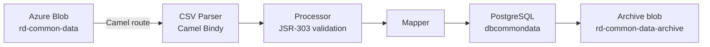

## TL;DR

- Common Data API (`rd-commondata-api`, port 4550) is a read-only REST service serving shared lookup tables consumed across CFT — case flags, panel member types, hearing channels, categories, and other list-of-values.
- Two endpoints: `GET /refdata/commondata/caseflags/service-id={service-id}` (hierarchical flag tree) and `GET /refdata/commondata/lov/categories/{categoryId}` (flat/hierarchical lookup tables).
- Data is batch-loaded daily by `rd-commondata-dataload`, a Kubernetes CronJob that reads CSVs from Azure Blob Storage (`rd-common-data` container) via Apache Camel routes.
- Flag data uses truncate-and-reload; category/LoV data uses upsert (`ON CONFLICT (categorykey, key, serviceid) ... DO UPDATE`).
- Both endpoints require IDAM + S2S authentication; the S2S production allowlist includes `ccd_data`, `xui_webapp`, `sscs`, `sscs_bulkscan`, `cui_ra`, `prl_cos_api`, `civil_service`, `iac`, `sptribs_case_api`, `et_cos`, `probate_backend`.
- Welsh bilingual support via conditional `nameCy`/`value_cy` fields, serialised using a custom `IgnoreJsonFilter` sentinel pattern.

## Architecture overview

The Common Data subsystem comprises two components:

| Component | Type | Purpose |
|-----------|------|---------|
| `rd-commondata-api` | Persistent Spring Boot service (port 4550) | Serves lookup data over REST |
| `rd-commondata-dataload` | Kubernetes CronJob (once/day) | Ingests CSVs from Azure Blob, writes to PostgreSQL |

Both share the same PostgreSQL database using the `dbcommondata` schema (not the default `public`). Flyway manages migrations in both repos. The API is strictly read-only; all writes happen through the batch loader.

## Database schema

The PostgreSQL database `dbcommondata` contains the following core tables:

### `flag_details`

| Column | Type | Constraints |
|--------|------|-------------|
| `id` | bigint | UNIQUE |
| `flag_code` | varchar(16) | PRIMARY KEY |
| `value_en` | text | NOT NULL |
| `value_cy` | text | — |
| `category_id` | bigint | NOT NULL |
| `mrd_created_time` | timestamp | — |
| `mrd_updated_time` | timestamp | — |
| `mrd_deleted_time` | timestamp | — |

The `category_id` encodes parent-child relationships: a flag with `category_id = N` is a child of the flag whose `id = N`. The root flags (`CF0001` for Case, `PF0001` for Party) have `category_id = 0`.

### `flag_service`

| Column | Type | Constraints |
|--------|------|-------------|
| `id` | bigint | PRIMARY KEY |
| `service_id` | varchar(16) | NOT NULL |
| `hearing_relevant` | boolean | NOT NULL |
| `request_reason` | boolean | NOT NULL |
| `flag_code` | varchar(16) | FK to `flag_details.flag_code` |
| `default_status` | varchar(64) | NOT NULL, default `'Active'` |
| `available_externally` | boolean | NOT NULL, default `false` |

### `list_of_values`

| Column | Type | Constraints |
|--------|------|-------------|
| `categorykey` | varchar(64) | NOT NULL |
| `serviceid` | varchar(16) | — |
| `key` | varchar(64) | NOT NULL, UNIQUE |
| `value_en` | varchar(128) | NOT NULL |
| `value_cy` | varchar(128) | — |
| `hinttext_en` | varchar(512) | — |
| `hinttext_cy` | varchar(512) | — |
| `lov_order` | bigint | — |
| `parentcategory` | varchar(64) | — |
| `parentkey` | varchar(64) | — |
| `active` | varchar(1) | — |
| `external_reference` | varchar(200) | — |
| `external_reference_type` | varchar(200) | — |

Check constraint: `external_reference` and `external_reference_type` must both be null or both be non-null.

### Audit tables

- **`dataload_schedular_audit`** — one record per job run; columns: `id`, `scheduler_name`, `file_name`, `scheduler_start_time`, `scheduler_end_time`, `status` (Success / Failure / PartialSuccess).
- **`dataload_exception_records`** — per-record validation failures; columns: `id`, `table_name`, `scheduler_name`, `scheduler_start_time`, `key`, `field_in_error`, `error_description`, `updated_timestamp`, `row_id`.

## The Case Flags endpoint

`GET /refdata/commondata/caseflags/service-id={service-id}`

Query parameters:

| Parameter | Values | Effect |
|-----------|--------|--------|
| `flag-type` | `PARTY` or `CASE` | Filters to `PF0001` (party) or `CF0001` (case) top-level flag |
| `welsh-required` | `Y` or `N` | Includes/excludes Welsh `nameCy` field |
| `available-external-flag` | `Y` or `N` | When `Y`, prunes flags not externally available |

### Response shape

The response is a hierarchical tree rooted at top-level flags (`CF0001` for case, `PF0001` for party). Each node is a `FlagDetail` with recursive `childFlags`. Flag code prefixes indicate type: `CF` = case flag, `PF` = party flag, `RA` = reasonable adjustment, `OT` = other.

A synthetic `OT0001` ("Other") leaf is injected into every group that has children (`CaseFlagServiceImpl.java:276-293`).

### Data provenance

The flag data comes from two separate sources:

1. **`FlagDetails.csv`** — received from the Master Reference Data (MRD) team. Contains the hierarchical definition of all flags (flag codes, names, parent relationships). Loaded as-is via ETL ingestion.
2. **`FlagService.csv`** — maintained by the CFT Reference Data team. Contains per-service flag configuration (which flags each service uses, whether they are hearing-relevant, externally available, etc.). Updated by BAs when services onboard or change their flag choices.

### Service-specific overrides

The repository query uses service `XXXX` as a generic/default set of flags (`CaseFlagRepository.java:34`). Flags registered against `XXXX` are included for all services unless a service-specific override exists. The query uses three CTEs to build a recursive path, merge generic with service-specific flags, and prune the tree to relevant categories only.

### List-of-values on specific flags

Two flags carry attached list-of-values data (`application.yaml` config `flaglist: PF0015,RA0042`):

- `PF0015` — Language Interpreter (queries `CATEGORY_KEY_LANGUAGE_INTERPRETER`)
- `RA0042` — Sign Language Interpreter (queries `CATEGORY_KEY_SIGN_LANGUAGE`)

This mapping is static configuration — adding a new flag code that needs LoV attachment requires a code change (`CaseFlagServiceImpl.java:40-41`).

## The Categories / List-of-Values endpoint

`GET /refdata/commondata/lov/categories/{categoryId}`

The `categoryId` path parameter selects a lookup table by key (e.g. `HearingChannel`, `PanelMemberType`, `CaseLinkingReasonCode`).

Query parameters (all optional):

| Parameter | Purpose |
|-----------|---------|
| `serviceId` | Filter by service |
| `parentCategory` | Filter by parent category key |
| `parentKey` | Filter by parent record key |
| `key` | Filter by specific key |
| `isChildRequired` | Include child records |
| `externalReferenceType` | Filter by external system reference type |
| `externalReference` | Filter by external system reference |

All list-of-values records share a uniform 13-column structure (the `ListOfValues.csv` and `OtherCategories.csv` files include all 13; `CaseLinkingReasons.csv` uses only the first 11):

<!-- DIVERGENCE: Draft originally said "11-column structure" but source (application-crd-list-of-values-router.yaml, application-crd-other-categories-router.yaml) shows 13 columns. The extra two (external_reference, external_reference_type) were added in V1_14__Alter_List_Of_Values.sql. Source wins. -->

| # | Column | Type | Length | Notes |
|---|--------|------|--------|-------|
| 1 | `CategoryKey` | varchar | 64 | Lookup table identifier |
| 2 | `ServiceID` | varchar | 16 | Empty = generic (all services) |
| 3 | `Key` | varchar | 64 | Record key (unique within category+service) |
| 4 | `Value_EN` | varchar | 128 | English display value |
| 5 | `Value_CY` | varchar | 128 | Welsh display value |
| 6 | `HintText_EN` | varchar | 512 | English hint text |
| 7 | `HintText_CY` | varchar | 512 | Welsh hint text |
| 8 | `Lov_Order` | bigint | — | Display ordering |
| 9 | `ParentCategory` | varchar | 64 | Parent lookup table key |
| 10 | `ParentKey` | varchar | 64 | Parent record key |
| 11 | `Active` | varchar | 1 | `Y`, `N`, or `D` (soft-delete) |
| 12 | `External_Reference` | varchar | 200 | External system reference |
| 13 | `External_Reference_Type` | varchar | 200 | External system type |

A check constraint enforces that `external_reference` and `external_reference_type` are both null or both non-null.

The upsert conflict key is `(categorykey, key, serviceid)`.

Hierarchical relationships are expressed via `ParentCategory` and `ParentKey` — for example, hearing sub-channels reference `ParentCategory=HearingChannel` and `ParentKey=telephone`.

The implementation uses Spring Data JPA `Specification` (built by `QuerySpecification`) to dynamically compose the WHERE clause from provided parameters.

### Known category keys

The following are the currently configured LoV categories (sourced from Confluence and verified against `ListOfValues.csv` and `OtherCategories.csv` routes):

<!-- CONFLUENCE-ONLY: not verified in source -->

| Category Key | Domain | Data source |
|---|---|---|
| `caseType` | Hearings | MRD (A&P team) |
| `caseSubType` | Hearings | MRD (A&P team) |
| `HearingChannel` | Hearings | MRD (A&P team) |
| `HearingSubChannel` | Hearings | MRD (A&P team) |
| `HearingPriority` | Hearings | MRD (A&P team) |
| `HearingType` | Hearings | MRD (A&P team) |
| `CaseManagementCancellationReasons` | Hearings | MRD (A&P team) |
| `EntityRoleCode` | Hearings | MRD (A&P team) |
| `PanelMemberType` | Hearings | MRD (A&P team) |
| `PanelMemberSpecialism` | Hearings | MRD (A&P team) |
| `ActualCancellationReasonCodes` | Hearings | MRD (A&P team) |
| `ActualPartHeardReasonCodes` | Hearings | MRD (A&P team) |
| `PartyRelationshipType` | Hearings | MRD (A&P team) |
| `ChangeReasons` | Hearings | MRD (A&P team) |
| `JudgeType` | Hearings | MRD (A&P team) |
| `AdditionalRoles` | Hearings | MRD (A&P team) |
| `CustodyStatus` | Hearings | MRD (A&P team) |
| `Facilities` | Hearings | MRD (A&P team) |
| `InterpreterLanguage` | Reasonable Adjustments | MRD (A&P team) |
| `SignLanguage` | Reasonable Adjustments | MRD (A&P team) |
| `ListingStatus` | Hearings | MRD (A&P team) |
| `UnavailableType` | Hearings | MRD (A&P team) |
| `AutoListChangeReasons` | Hearings | MRD (A&P team) |
| `PanelCategory` | Hearings | MRD (A&P team) |
| `PanelCategoryMember` | Hearings | MRD (A&P team) |
| `DefaultPanelCategory` | Hearings | MRD (A&P team) |
| `CaseLinkingReasonCode` | Case linking | Architecture team |

Generic categories (where `ServiceID` is empty) apply to all services. Service-specific entries override or supplement generics.

## The batch loader (`rd-commondata-dataload`)

### Execution model

The batch loader is a one-shot Spring Boot application that runs as a Kubernetes CronJob. On startup it:

1. Checks idempotency via `dataload_schedular_audit` — if a record exists for today's date (`select count(*) from dataload_schedular_audit where date(scheduler_start_time) = current_date`), it exits.
2. Executes a Spring Batch Job with ordered Steps: FlagDetails, FlagService, OtherCategories, (conditional via `caselinking-route-disable`) CaseLinkingReasons, ListOfValues (`BatchConfig.java:114-125`).
3. Archives processed CSVs to the `rd-common-data-archive` container with timestamped names (format `dd-MM-yyyy--HH-mm`).
4. Exits with `System.exit()` after a 7-second delay for App Insights flush (`CommonDataLoadApplication.java:37-39`).

### Data flow



Each route is configured entirely through YAML Spring profiles. The Java code wires tasklets to route names via `BaseTasklet` and `CommonDataExecutor`. The heavy lifting (Camel Azure Blob component, route orchestration, audit) lives in the shared `data-ingestion-lib` library.

### CSV files and load strategies

| CSV file | Target table | Strategy | Binder class | Columns |
|----------|-------------|----------|--------------|---------|
| `FlagDetails.csv` | `flag_details` | Truncate (`CASCADE`) + insert | `FlagDetails` | 8 (id, flag_code, value_en, value_cy, category_id, MRD_Created_Time, MRD_Updated_Time, MRD_Deleted_Time) |
| `FlagService.csv` | `flag_service` | Truncate + insert | `FlagService` | 7 (ID, ServiceID, HearingRelevant, RequestReason, FlagCode, DefaultStatus, AvailableExternally) |
| `OtherCategories.csv` | `list_of_values` | Upsert (ON CONFLICT) | `OtherCategories` | 13 (includes external_reference columns) |
| `ListOfValues.csv` | `list_of_values` | Upsert (ON CONFLICT) | `Categories` | 13 (includes external_reference columns) |
| `CaseLinkingReasons.csv` | `list_of_values` | Upsert (ON CONFLICT) | `Categories` | 11 (no external_reference columns) |

The `FlagDetails` truncation uses `CASCADE` which also empties `flag_service` (due to the FK constraint). The `FlagService` route then reloads its data after `FlagDetails`. A partial run that completes the FlagDetails step but fails on FlagService leaves both tables inconsistent — there is no rollback protection beyond Spring Batch step failure semantics.

The `CaseLinkingReasons` route is conditionally enabled via `${caselinking-route-disable:false}` — when disabled, its CSV is also excluded from archival. This allows the route to be toggled via environment configuration without code changes.

### Validation and error handling

- **Expired records**: `FlagDetailsProcessor` filters out records where `MRD_Deleted_Time` is in the past (`FlagDetailsProcessor.java:123-137`).
- **FK enforcement**: `FlagServiceProcessor` validates that each `FlagCode` exists in `flag_details.flag_code` before insertion.
- **Zero-byte characters**: all processors scan record content for invisible characters (zero-width space, non-breaking space) configured in `application.yaml:65-67`.
- **Header validation**: mismatched CSV headers fail the route immediately.
- **D-records**: after every route, `CommonDataDRecords.auditAndDeleteCategories()` selects rows in `list_of_values` where `active='D'`, audits them, then deletes them (`CommonDataDRecords.java:41-56`).
- **JSR-303 failures**: validation errors are written to `dataload_exception_records`. If all records fail, a `RouteFailedException` is thrown.

### Idempotency

There is no distributed lock (no ShedLock). Idempotency relies on the `dataload_schedular_audit` table — if a record exists for today's date, the job is skipped. A race condition exists: if two pods start simultaneously before either writes the audit record, both may run.

## Welsh bilingual support

Both endpoints support Welsh (`Cymraeg`) via `nameCy` on flags and `value_cy` on categories. Rather than using `@JsonInclude(NON_NULL)`, the codebase uses a custom `IgnoreJsonFilter` — when Welsh is not required, the field is set to the sentinel string `"IGNORE_JSON"` which the filter excludes from serialised output. This is an unusual pattern that consumers should be aware of when debugging responses.

## Security

Both endpoints sit under `/refdata/commondata` and require:

- `Authorization` header (IDAM bearer token — any valid IDAM role accepted)
- `ServiceAuthorization` header (S2S token)

The S2S allowlist is configured via `CRD_S2S_AUTHORISED_SERVICES`. The default in `application.yaml` is only `rd_commondata_api`, but the production Flux override (`cnp-flux-config/apps/rd/rd-commondata-api/prod.yaml`) expands this to:

```
ccd_data, xui_webapp, sscs, sscs_bulkscan, cui_ra, prl_cos_api,
civil_service, iac, sptribs_case_api, et_cos, probate_backend
```

Services not in this list must raise a change to the Flux config to gain access.

### Error response format

On failure the API returns a structured JSON error body:

```json
{
  "errorCode": "400",
  "status": "BAD_REQUEST",
  "errorMessage": "Malformed Input Request",
  "errorDescription": "<dynamic detail>",
  "timeStamp": "2019-05-28 14:02:47.071"
}
```

| HTTP code | Meaning |
|-----------|---------|
| 200 | Success — returns mapped data |
| 400 | Bad request — invalid parameters |
| 401 | Authentication failed |
| 403 | Access denied (S2S not allowed) |
| 404 | No data found for given request |
| 500 | Internal server error |

## Azure infrastructure

<!-- CONFLUENCE-ONLY: not verified in source -->

Storage account naming per environment:

| Environment | Storage account | Container (source) | Container (archive) |
|---|---|---|---|
| AAT | `rdcommondataaat` | `rd-common-data` | `rd-common-data-archive` |
| Demo | `rdcommondatademo` | `rd-common-data` | `rd-common-data-archive` |
| Perf Test | `rdcommondataperftest` | `rd-common-data` | `rd-common-data-archive` |
| ITHC | `rdcommondataithc` | `rd-common-data` | `rd-common-data-archive` |
| Prod | `rdcommondataprod` | `rd-common-data` | `rd-common-data-archive` |

The CronJob schedules are configurable per environment and can be suspended via Flux PRs (no code change required). The LoV CSV files are delivered monthly and/or whenever changes occur; FlagDetails is delivered whenever changes occur (driven by the MRD team).

## Examples

### Flyway seed data — `flag_details` initial inserts (`V1_1__init_tables.sql`)

The initial migration creates the `flag_details` table and seeds the root flags and all current reasonable-adjustment flags. The `category_id = 0` marks root-level flags (`CF0001`, `PF0001`).

```sql
// Source: apps/rd/rd-commondata-api/src/main/resources/db/migration/V1_1__init_tables.sql
create table flag_details(
    id          bigint,
    flag_code   varchar(16) NOT NULL,
    value_en    text NOT NULL,
    value_cy    text,
    category_id bigint NOT NULL,
    constraint flag_details_pk primary key (flag_code),
    constraint id_unique unique (id)
);

-- root flags (category_id=0 means top-level)
INSERT INTO public.flag_details (id, flag_code, value_en, value_cy, category_id) VALUES
    (1, 'CF0001', 'Case', '', 0),
    (2, 'PF0001', 'Party', '', 0),
    (3, 'RA0001', 'Reasonable adjustment', '', 2),
    (4, 'RA0002', 'I need documents in an alternative format', '', 3),
    // ...
    (44, 'RA0042', 'Sign Language Interpreter', '', 10);
```

### Case flags controller (`CaseFlagApiController.java`)

```java
// Source: apps/rd/rd-commondata-api/src/main/java/uk/gov/hmcts/reform/cdapi/controllers/CaseFlagApiController.java
@RequestMapping(path = "/refdata/commondata")
public class CaseFlagApiController {

    @GetMapping(
        produces = APPLICATION_JSON_VALUE,
        path = {"/caseflags/service-id={service-id}"}
    )
    public ResponseEntity<CaseFlag> retrieveCaseFlagsByServiceId(
        @PathVariable(value = "service-id") String serviceId,
        @RequestParam(value = "flag-type", required = false) String flagType,           // PARTY or CASE
        @RequestParam(value = "welsh-required", required = false) String welshRequired, // Y or N
        @RequestParam(value = "available-external-flag", required = false) String availableExternalFlag) {
        // ...
    }
}
```

### Batch route — `FlagDetails.csv` truncate-and-reload

```yaml
// Source: apps/rd/rd-commondata-dataload/src/main/resources/application-crd-flag-details-router.yaml
route:
  commondata-flag-details-load:
    id: commondata-flag-details-load
    file-name: FlagDetails.csv
    table-name: flag_details
    truncate-sql:
      sql:truncate table flag_details restart identity cascade?dataSource=#dataSource
    insert-sql:
      sql:insert into flag_details (id,flag_code,value_en,value_cy,category_id,
        mrd_created_time,mrd_updated_time,mrd_deleted_time)
      values (:#id,:#flag_code,:#value_en,:#value_cy,:#category_id,
        :#mrd_created_time,:#mrd_updated_time,:#mrd_deleted_time)?dataSource=#dataSource
    blob-path:
      azure-storage-blob://${azure.storage.account-name}/rd-common-data?credentials=#credsreg&operation=uploadBlockBlob&blobName=FlagDetails.csv
    csv-headers-expected: id,flag_code,value_en,value_cy,category_id,MRD_Created_Time,MRD_Updated_Time,MRD_Deleted_Time
    header-validation-enabled: true
```

The `CASCADE` on `TRUNCATE` also deletes `flag_service` rows — both files must always be uploaded together.

### Batch route — `ListOfValues.csv` upsert

```yaml
// Source: apps/rd/rd-commondata-dataload/src/main/resources/application-crd-list-of-values-router.yaml
route:
  commondata-list-of-values-load:
    id: commondata-list-of-values-load
    file-name: ListOfValues.csv
    table-name: list_of_values
    insert-sql:
      sql:insert into list_of_values
        (categorykey,serviceid,key,value_en,value_cy,hinttext_en,hinttext_cy,
         lov_order,parentcategory,parentkey,active,external_reference,external_reference_type)
      values (:#categoryKey,:#serviceId,:#key,:#value_en,:#value_cy,:#hinttext_en,:#hinttext_cy,
              :#lov_order,:#parentcategory,:#parentkey,:#active,:#external_reference,:#external_reference_type)
      on conflict (categorykey,key,serviceid) do UPDATE SET
        value_en = :#value_en, value_cy = :#value_cy, hinttext_en = :#hinttext_en,
        hinttext_cy = :#hinttext_cy, lov_order = :#lov_order, active = :#active
        // ... ?dataSource=#dataSource
    csv-headers-expected: categorykey,serviceid,key,value_en,value_cy,hinttext_en,hinttext_cy,lov_order,parentcategory,parentkey,active,external_reference,external_reference_type
```

### Batch job idempotency check (`application-camel-routes-common.yaml`)

```yaml
// Source: apps/rd/rd-commondata-dataload/src/main/resources/application-camel-routes-common.yaml
scheduler-audit-select: >
  select count(*) from dataload_schedular_audit
  where date(scheduler_start_time) = current_date
aggregation-strategy-completion-size: 100
aggregation-strategy-timeout: 2000
file-read-time-out: 180000
archival-file-names: >
  FlagDetails.csv,FlagService.csv,ListOfValues.csv,OtherCategories.csv
  #{"${caselinking-route-disable:false}" ? "" :",CaseLinkingReasons.csv"}
batchjob-name: CommonDataLoad
```

## See also

- [Batch Loading](batch-loading.md) — deep-dive into both batch loaders: route configuration, load strategies, idempotency, and error handling
- [Onboard Common Data](../how-to/onboard-common-data.md) — step-by-step guide for adding a new CSV data set to `rd-commondata-dataload`
- [Query Reference Data](../how-to/query-reference-data.md) — practical examples of calling the case flags and list-of-values endpoints
- [Architecture](architecture.md) — positions Common Data within the overall RD service suite
