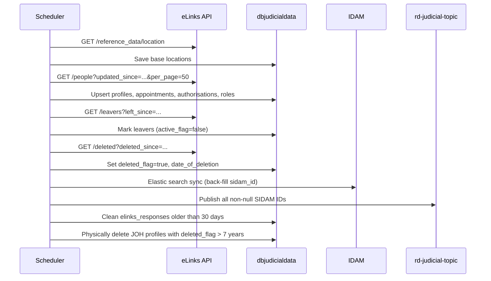

## TL;DR

- JRD (`rd-judicial-api`) is the Judicial Reference Data service: stores judicial office holder profiles, appointments, authorisations, and additional roles in the `dbjudicialdata` PostgreSQL schema.
- Ingests data from the external eLinks judiciary middleware API (hosted on Heroku by FutureEHR) on a daily cron schedule (default 15:55 UTC), with ShedLock preventing concurrent runs.
- At scale, JRD holds ~25,000 judicial profiles, ~26,000 appointments, and ~35,000 authorisations.
- Publishes SIDAM IDs to the Azure Service Bus topic `rd-judicial-topic` after each successful sync; primary consumer is AM (`am_org_role_mapping_service`).
- Exposes two public endpoints: `POST /refdata/judicial/users` (profile refresh, secured) and `POST /refdata/judicial/users/search` (free-text search, open).
- Allowed S2S callers: `rd_judicial_api`, `am_org_role_mapping_service`, `iac`, `xui_webapp`.

## Judicial profile model

The core domain is the `judicial_user_profile` table (PK `personal_code VARCHAR(32)`), with one-to-many relationships to three child tables:

| Entity | Table | Key fields |
|--------|-------|------------|
| `UserProfile` | `judicial_user_profile` | `personal_code`, `known_as`, `surname`, `full_name`, `ejudiciary_email`, `object_id`, `sidam_id`, `active_flag`, `deleted_flag`, `last_working_date`, `retirement_date` |
| `Appointment` | `judicial_office_appointment` | `appointment_id` (unique), `base_location_id`, `epimms_id`, `hmcts_region_id`, `start_date`, `end_date`, `is_principle_appointment`, `appointment_type` |
| `Authorisation` | `judicial_office_authorisation` | `authorisation_id`, `jurisdiction`, `ticket_code`, `lower_level`, `start_date`, `end_date`, `appointment_id` (nullable since V1_6) |
| `JudicialRoleType` | `judicial_additional_roles` | `role_id`, `title`, `jurisdiction_role_id`, `jurisdiction_role_name_id`, `start_date`, `end_date` |

All child collections use `FetchMode.SUBSELECT` with lazy loading to avoid N+1 queries (`UserProfile.java:100-110`). The response DTO deduplicates profiles by `emailId`; when two profiles share an email address, their appointments/authorisations/roles are merged into a single response object (`ElinkUserServiceImpl.java:280-313`).

Notable column-to-field mismatches: `ejudiciary_email` maps to Java field `emailId` (`UserProfile.java:58`); `date_of_deletion` maps to `deletedOn` (`UserProfile.java:97`); the appointment flag has a legacy typo: `isPrincipleAppointment` in both the DB column and Java field (`Appointment.java:55`).

### Derived fields

Several fields in the appointment table are not received directly from eLinks but are derived during ingestion:

| Field | Derivation logic |
|-------|-----------------|
| `base_location_id` | For **Tribunals** (`type = "Tribunals"`): uses the `parent_id` from the location hierarchy. For **Courts** (non-Tribunals): uses the `base_location_id` directly from the appointment. (`ElinksPeopleServiceImpl.java:770`) |
| `epimms_id` | Looked up from the `judicial_location_mapping` table by matching `base_location_id` |
| `hmcts_region_id` | Derived from the `location` text field in the appointment (e.g. "London", "Midlands") using `hmcts_region_type` mapping. Values "Unknown", "Unassigned", or empty map to `0`. (`ElinksPeopleServiceImpl.java:779-784`) |

The HMCTS region text-to-ID mapping:

| Location text | Region ID |
|---------------|-----------|
| London | 1 |
| Midlands | 2 |
| North East | 3 |
| North West | 4 |
| South East | 5 |
| South West | 6 |
| Wales | 7 |
| Scotland | 11 |
| National | 12 |

Additionally, `jo_base_location_id` stores the raw eLinks `base_location_id` value before the Tribunals/Courts derivation is applied.

## eLinks integration

JRD pulls judicial data from the eLinks judiciary middleware API (a third-party system maintained by FutureEHR, hosted on Heroku using AWS infrastructure). This is the only external data feed in the RD product suite. eLinks itself is populated by a nightly batch load from the underlying Judicial HR system (CIPHR e-HR), scheduled for approximately 1:00am local time and usually completing in minutes.

### eLinks API endpoints

eLinks exposes several endpoints. JRD currently calls all four:

| Endpoint | Purpose | eLinks behaviour |
|----------|---------|-----------------|
| `GET /reference_data/location` | Location hierarchy (courts, tribunals) | Returns full dataset (not paginated by date) |
| `GET /people?updated_since=...&per_page=50` | Active JOH profiles with appointments, authorisations, roles | Returns one record per `personal_code` changed since date |
| `GET /leavers?left_since=...` | JOHs who left during the period | Leaver records with `left_on` date |
| `GET /deleted?deleted_since=...` | JOHs whose records were deleted | Deleted records with `deleted_on` date |

eLinks treats `personal_code` as a primary key. In any retrieval, at most one record is returned per `personal_code` -- if multiple changes occur between JRD syncs, only the most recent is visible. The `/people` endpoint actually includes leaver and deleted records alongside active records, making `/leavers` and `/deleted` technically redundant (they return the same data for the same time window).

<!-- CONFLUENCE-ONLY: not verified in source -->
<!-- The eLinks "to-be" design (Confluence 1838620475) proposes retiring /leavers and /deleted in favour of /people only. Current source still uses all endpoints. -->

### JOH lifecycle

The "happy path" lifecycle of a Judicial Office Holder in eLinks:

1. **Onboarded** -- person records received as JOH joins HMCTS, gains appointments, roles, authorisations.
2. **Leaving date set** -- a `leaving_on` value added to the person record as a planned leaving date approaches.
3. **Left** -- a leaver record provided after the JOH has left.
4. **Deleted** -- at the end of the Judicial HR data retention period, a deleted record is provided.

Lifecycle variations:
- **Returning JOH**: Judicial HR attempts to reuse the same `personal_code` for the same individual across separate periods of service. A fresh person record can be received after a leaver record for the same code.
- **Corrections**: If duplicate records are found, one may be immediately deleted and merged into the other. A deleted record can appear at any point, not only following a leaver.
- **Object ID non-uniqueness**: eLinks does not guarantee uniqueness of `object_id` (Azure AD SSO ID) or email across JOH records. Duplicate records with different personal codes may share the same object ID.

<!-- CONFLUENCE-ONLY: not verified in source -->

### Authentication

A token-based API key (`Authorization: Token <key>`) is injected by `ElinksFeignInterceptorConfiguration`. The key is sourced from Key Vault at `/mnt/secrets/rd/judicial_api_elinks_api_key` (`application.yaml:149`). Additionally, access is restricted via Palo Alto static IP whitelisting (Nonprod: `20.49.168.141` / `20.49.168.17`; Production: `20.50.108.242` / `20.50.109.148`).

<!-- CONFLUENCE-ONLY: not verified in source -->

### Scheduler pipeline

The scheduler is a `@Scheduled` cron job (expression: `${CRON_EXPRESSION:* 55 15 * * *}`) guarded by ShedLock (`ElinksApiJobScheduler.java:87-128`). It checks the `dataload_schedular_job` table to skip if a job already ran today.

The pipeline runs the following steps sequentially, each individually try/caught so a failure does not abort subsequent steps:



The scheduler invokes its own REST endpoints over localhost (via `RestTemplate`) rather than calling services directly. These internal endpoints (`/refdata/internal/elink/*`) are in `security.anonymousPaths` and annotated `@Hidden` in Swagger (`ElinksController.java:38`, `application.yaml:108`).

### Pagination and retry

eLinks endpoints are paginated at `${PER_PAGE:50}` records per page. The `updated_since` parameter is derived from the last successful run timestamp in `dataload_schedular_audit`, falling back to `${lastUpdated:2015-01-01}`. Iteration continues until the response's `more_pages` field is `false`. On HTTP 503 or 429 responses, the people pipeline retries up to `${RETRIGGER_THRESHOLD:5}` times with a `${THREAD_RETRIGGER_TIME:1000}ms` pause between attempts. A standard inter-page pause of `${THREAD_PAUSE_TIME:2000}ms` applies between each page request.

### Rate limiting

eLinks enforces a rate limit of 20 requests in 20 seconds (`RefDataElinksConstants.java:20`). Under normal operation with 50 records per page, this is only problematic if more than 1,000 records are updated in a single day (unlikely) and each page is processed faster than 1 second. For initial/full data loads, the rate limit requires careful testing.

### Pagination risk

There is a **low** risk of data corruption due to eLinks' simple "page size and page number" pagination approach. If the underlying eLinks dataset is modified between paginated page fetches (e.g. by a concurrent eLinks internal refresh from Judicial HR), records can be missed or duplicated. The JHR-to-eLinks internal refresh runs at approximately 1:00am local time; the JRD-to-eLinks load defaults to 15:55 UTC (configurable). The risk only manifests if these windows overlap, which exceptional circumstances (e.g. eLinks re-running its refresh after an error) could trigger. Periodic full data refreshes mitigate any accumulated data drift.

<!-- CONFLUENCE-ONLY: not verified in source -->

### Data load rules

Each eLinks endpoint is processed with specific update strategies:

| Record type | Strategy | Notes |
|-------------|----------|-------|
| Person (from `/people`) | Upsert (on-conflict insert/update) for profile; truncate-and-reload for appointments and authorisations per `personal_code` | Active flag set to true |
| Leaver (from `/leavers`) | Soft delete: set `active_flag=false`, update `last_working_date` from `left_on`, update `last_loaded_date` | Profile remains in database |
| Deleted (from `/deleted`) | Soft delete: set `deleted_flag=true`, update `date_of_deletion` | Hard-deleted after 7 years |

### Excluded appointment types

The following appointment types are excluded during ingestion and never loaded into JRD:

- CRTS TRIB - RS Admin User
- MAGS - AC Admin User
- Person on a List
- Unknown
- Senior Coroner
- Assistant Coroner
- Area Coroner
- Acting Senior Coroner
- Initial Automated Record

<!-- CONFLUENCE-ONLY: not verified in source -->

### Raw response storage

All raw eLinks API responses are stored as JSONB in the `elinks_responses` table. Responses older than `${Clean_Elinks_Responses_Days:30}` days are purged at the end of each scheduler run (`ELinksServiceImpl.java:520-531`).

### Profile deletion

Profiles with `deleted_flag=true` are physically removed from the database after `${Del_Joh_Profiles_Years:7}` years, when enabled by `${Del_Joh_Profiles:true}` (`ELinksServiceImpl.java:536-551`).

## ASB topic publishing

After eLinks ingestion completes, the scheduler publishes all known SIDAM IDs to the Azure Service Bus topic `rd-judicial-topic`. This notifies downstream consumers (primarily AM) that judicial profile data has been refreshed.

### Message format

Messages are JSON with the structure:

```json
{
  "userIds": ["<sidamId1>", "<sidamId2>", ...]
}
```

Note: the key is `userIds`, not `sidamIds` (`PublishingData.java:12`). Consumers expecting a different key will silently receive nulls.

### Batching

The publisher partitions the full SIDAM ID list into chunks of `${JRD_DATA_PER_MESSAGE:50}` and sends each chunk within a transaction. If any send fails, the entire transaction is rolled back (`ElinkTopicPublisher.java:42-56`).

### Connection

ASB connection uses: host `${JRD_MQ_HOST:rd-servicebus-sandbox.servicebus.windows.net}`, topic `${JRD_MQ_TOPIC_NAME:rd-judicial-topic-sandbox}`, access key name `${JRD_MQ_USERNAME:SendAndListenSharedAccessKey}`, access key from Key Vault (`JUDICIAL_TOPIC_PRIMARY_SEND_LISTEN_SHARED_ACCESS_KEY`).

### Failure handling

On publish failure the job status is set to `FAILED` and an email alert is sent to `DLRefDataSupport@hmcts.net` via SendGrid (`PublishSidamIdServiceImpl.java:163-183`). The trigger endpoint is `GET /refdata/internal/elink/sidam/asb/publish`.

## Query endpoints

### Profile refresh: `POST /refdata/judicial/users`

Secured with `@Secured({"jrd-system-user", "jrd-admin"})`. Accepts a `RefreshRoleRequest` body with exactly one of:

| Parameter | Behaviour |
|-----------|-----------|
| `ccdServiceName` | Looks up service codes via LRD (`/refdata/location/orgServices`), then queries by ticket codes or service names |
| `object_ids` | Direct query by Azure AD object IDs |
| `sidam_ids` | Direct query by SIDAM IDs |
| `personal_code` | Direct query by eLinks personal codes |

Pagination is controlled via headers: `page_size` (default 200), `page_number`, `sort_direction`, `sort_column` (default `objectId`). The response includes a `total_records` header.

Only profiles with a non-empty `objectId` are returned; profiles without an Azure AD object ID are excluded from all refresh queries.

Special case: service code `BBA2` routes to `fetchUserProfileByTicketCodes` instead of `fetchUserProfileByServiceNames` (`ElinkUserServiceImpl.java:220-222`).

### User search: `POST /refdata/judicial/users/search`

No role restriction beyond a valid IDAM token. Request body:

```json
{
  "searchString": "Smith",    // min 3 characters
  "serviceCode": "BFA1",     // optional
  "location": "12345"        // optional EPIMMS ID
}
```

Matches case-insensitively against `knownAs`, `surname`, and `fullName` fields, filtering to active profiles with current (non-expired) appointments and authorisations (`ProfileRepository.java:19-45`).

### Content type

<!-- REVIEW: The content type is wrong. Source (rd-judicial-api:src/main/java/uk/gov/hmcts/reform/judicialapi/versions/V2.java:12) shows the actual value is "application/vnd.jrd.api+json;Version=2.0", not "application/vnd.uk.gov.hmcts.reform.juddata.v2+json;charset=UTF-8". -->
Both endpoints use a versioned media type: `application/vnd.uk.gov.hmcts.reform.juddata.v2+json;charset=UTF-8`.

## Database schema

Managed by Flyway (V1_1 through V1_8), schema `dbjudicialdata`, baseline version 1.1. Key supporting tables:

| Table | Purpose |
|-------|---------|
| `judicial_location_mapping` | Maps `epimms_id` + `judicial_base_location_id` to `service_code` |
| `judicial_service_code_mapping` | Maps `ticket_code` to `service_code` (for authorisation lookups) |
| `jrd_lrd_region_mapping` | Maps JRD region IDs to LRD region IDs |
| `location_type` | Base location reference data from eLinks |
| `dataload_schedular_job` | Daily job record with `publishing_status` |
| `dataload_schedular_audit` | Per-API-call audit with start/end time and status |
| `elinks_responses` | Raw eLinks JSON (JSONB), auto-cleaned after 30 days |
| `lock_details_provider` | ShedLock table (prevents concurrent scheduler runs) |

## Planned: leaver grace period

A design exists (Confluence: "Judicial Reference Data - eLinks Load") for a future refactoring that would:

1. Retire the `/leavers` and `/deleted` endpoints, using only `/people` (which already returns all record types).
2. Introduce a **leaver grace period** (proposed 90 days) where JOHs who have left remain active with limited access (case-role assignments, global search, specific access requests) to complete in-flight work.
3. Add `left_flag` and `left_on` fields to the profile model to track leaver state explicitly.
4. Support complete data refreshes by detecting orphaned JRD records not present in a full eLinks retrieval.
5. Improve SIDAM ID continuity for data corrections (using `object_id` matching alongside `personal_code` to maintain IdAM ID across record merges).

**This design is NOT yet implemented in source code.** The current codebase uses all four eLinks endpoints and does not have `left_flag`/`left_on` fields or grace period logic.

<!-- DIVERGENCE: Confluence (page 1838620475) proposes using only /people endpoint and retiring /leavers and /deleted. But ElinksApiJobScheduler.java:168-186 and ElinksFeignClient.java:36-37 show the source still calls /leavers and /deleted separately. Source wins. -->

## Examples

### eLinks Feign client definition (`ElinksFeignClient.java`)

JRD calls these four endpoints during the daily pipeline. The `ElinksFeignInterceptorConfiguration` injects the `Authorization: Token <key>` header from Key Vault.

```java
// Source: apps/rd/rd-judicial-api/src/main/java/uk/gov/hmcts/reform/judicialapi/elinks/feign/ElinksFeignClient.java
@FeignClient(name = "ElinksFeignClient", url = "${elinksUrl}",
        configuration = ElinksFeignInterceptorConfiguration.class)
public interface ElinksFeignClient {

    @GetMapping("/reference_data/location")
    Response getLocationDetails();

    @GetMapping("/people")
    Response getPeopleDetails(@RequestParam("updated_since") String updatedSince,
                              @RequestParam("per_page") String perPage,
                              @RequestParam("page") String page,
                              @RequestParam("include_previous_appointments") boolean includePreviousAppointments);

    @GetMapping("/leavers")
    Response getLeaversDetails(@RequestParam("left_since") String updatedSince,
                               @RequestParam("per_page") String perPage,
                               @RequestParam("page") String page);

    @GetMapping("/deleted")
    Response getDeletedDetails(@RequestParam("deleted_since") String updatedSince,
                               @RequestParam("per_page") String perPage,
                               @RequestParam("page") String page);
}
```

### Scheduler cron + ShedLock declaration (`ElinksApiJobScheduler.java`)

The scheduler is disabled by default (`SCHEDULER_ENABLED=false`). ShedLock uses the `lock_details_provider` table to prevent concurrent runs across pods.

```java
// Source: apps/rd/rd-judicial-api/src/main/java/uk/gov/hmcts/reform/judicialapi/elinks/scheduler/ElinksApiJobScheduler.java
@Scheduled(cron = "${elinks.scheduler.cronExpression}")
@SchedulerLock(name = "lockedTask",
        lockAtMostFor = "${elinks.scheduler.lockAtMostFor}",
        lockAtLeastFor = "${elinks.scheduler.lockAtLeastFor}")
public void loadElinksJob() {
    if (isSchedulerEnabled) {
        // once-per-day guard: skip if already ran today
        DataloadSchedulerJob latestEntry = dataloadSchedulerJobRepository.findFirstByOrderByIdDesc();
        if (currentDate.equals(startDate) || currentDate.equals(endDate)) {
            log.info("JRD load failed since job has already ran for the day");
            return;
        }
        loadElinksData();
    }
}

public void loadElinksData() {
    // each step individually try/caught so a failure does not abort subsequent steps
    try { retrieveLocationDetails(); }  catch (Exception ex) { /* audit + continue */ }
    try { retrievePeopleDetails(); }    catch (Exception ex) { /* audit + continue */ }
    try { retrieveLeaversDetails(); }   catch (Exception ex) { /* audit + continue */ }
    try { retrieveDeletedDetails(); }   catch (Exception ex) { /* audit + continue */ }
    try { retrieveIdamElasticSearchDetails(); } catch (Exception ex) { /* audit + continue */ }
    try { retrieveSidamids(); }         catch (Exception ex) { /* audit + continue */ }
    try { retrieveAsbPublishDetails(); } catch (Exception ex) { /* mark FAILED, email support */ }
    // cleanup: purge elinks_responses > 30 days, hard-delete JOH profiles > 7 years
}
```

### ASB topic publisher (`ElinkTopicPublisher.java`)

```java
// Source: apps/rd/rd-judicial-api/src/main/java/uk/gov/hmcts/reform/judicialapi/elinks/servicebus/ElinkTopicPublisher.java
@Value("${jrd.publisher.jrd-message-batch-size}")
int jrdMessageBatchSize;   // default 50

public void sendMessage(@NotNull List<String> judicalIds, String jobId) {
    ServiceBusTransactionContext elinktransactionContext = elinkserviceBusSenderClient.createTransaction();
    try {
        partition(judicalIds, jrdMessageBatchSize)
            .forEach(data -> {
                PublishingData chunk = new PublishingData();
                chunk.setUserIds(data);        // serialises as {"userIds": [...]}
                serviceBusMessages.add(new ServiceBusMessage(new Gson().toJson(chunk)));
            });
        elinkserviceBusSenderClient.commitTransaction(elinktransactionContext);
    } catch (Exception exception) {
        elinkserviceBusSenderClient.rollbackTransaction(elinktransactionContext);
        throw new ElinksException(HttpStatus.UNAUTHORIZED, UNAUTHORIZED_ERROR, UNAUTHORIZED_ERROR);
    }
}
```

### Key configuration defaults (`application.yaml`)

```yaml
// Source: apps/rd/rd-judicial-api/src/main/resources/application.yaml
elinksUrl: ${ELINKS_URL:https://judiciary-middleware-futureehr.herokuapp.com/api/v5}
elinks:
  people:
    perPage: ${PER_PAGE:50}
    lastUpdated: ${LAST_UPDATED:2015-01-01}
    threadPauseTime: ${THREAD_PAUSE_TIME:2000}
    retriggerThreshold: ${RETRIGGER_THRESHOLD:5}
    retriggerStatus: ${RETRIGGER_STATUSCODE:503,429}
  scheduler:
    cronExpression: ${CRON_EXPRESSION:* 55 15 * * *}
    enabled: ${SCHEDULER_ENABLED:false}
  delJohProfilesYears: ${Del_Joh_Profiles_Years:7}
  cleanElinksResponsesDays: ${Clean_Elinks_Responses_Days:30}
locationRefDataUrl: ${LOCATION_REF_DATA_URL:http://rd-location-ref-api-aat.service.core-compute-aat.internal}
idam:
  s2s-authorised:
    services: ${JRD_S2S_AUTHORISED_SERVICES:rd_judicial_api,am_org_role_mapping_service,iac,xui_webapp}
```

## See also

- [API Judicial](../reference/api-judicial.md) — full endpoint reference for JRD including request/response shapes, pagination, and deduplication behaviour
- [Locations](locations.md) — LRD, which JRD calls at `/refdata/location/orgServices` to resolve service codes to base locations during profile refresh
- [Architecture](architecture.md) — explains the `rd-judicial-topic` ASB topic, eLinks scheduler, and inter-service dependencies
- [Query Reference Data](../how-to/query-reference-data.md) — practical examples of calling the JRD search and refresh endpoints

## Glossary

| Term | Definition |
|------|-----------|
| eLinks | External judiciary middleware API (FutureEHR, hosted on Heroku) that is the source-of-truth for judicial office holder data |
| CIPHR e-HR | The upstream Judicial HR system from which eLinks is populated via nightly batch |
| JOH | Judicial Office Holder -- any person who holds a judicial appointment |
| SIDAM ID | The identity assigned to a judicial user within the HMCTS IDAM system |
| personal_code | The eLinks-assigned unique identifier for a judicial office holder (PK of the profile table) |
| object_id | The Azure AD object ID linked to a judicial user's SSO account (not guaranteed unique across JOH records) |
| base_location_id | Numeric ID from eLinks representing a court/tribunal location; for Tribunals, JRD uses the parent node |
| epimms_id | CFT-specific location identifier derived from `base_location_id` via `judicial_location_mapping` |
| ticket_code | Authorisation identifier linking a JOH to a specific jurisdiction/service area |
| ASB | Azure Service Bus -- the messaging infrastructure used to notify downstream services of data changes |
