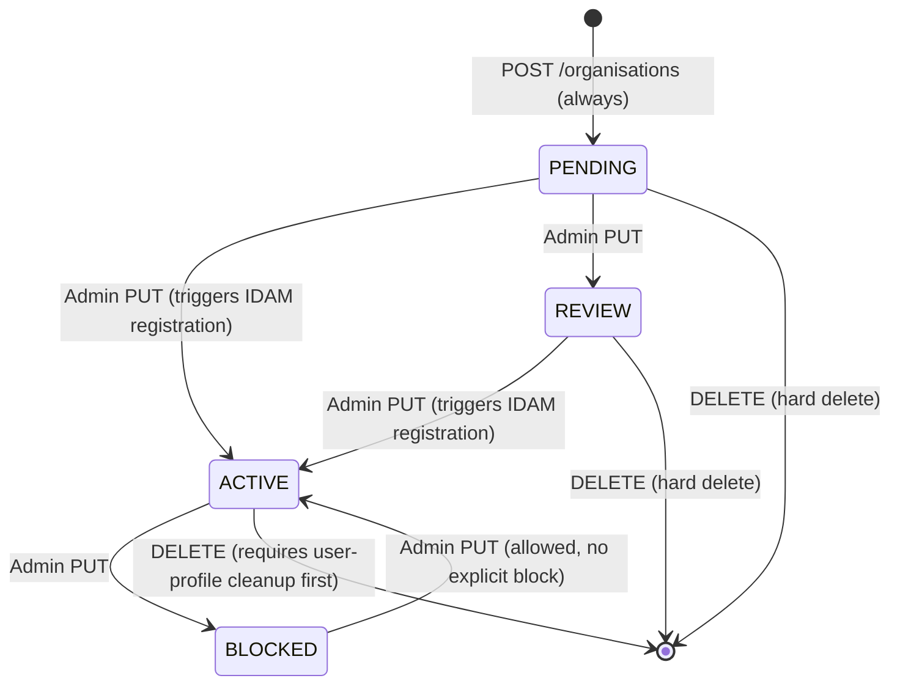

## TL;DR

- PRD (`rd-professional-api`) is the authority for solicitor organisations, their users, PBA accounts, MFA preferences, and PUI roles within HMCTS digital services.
- Organisations always start as `PENDING` and require a manual admin action to transition to `ACTIVE` — there is no automated approval.
- On activation, the super user is registered in IDAM via `rd-user-profile-api` and all pending PBAs are auto-accepted.
- Two controller layers exist: **internal** (`/refdata/internal/v1/`, secured by `prd-admin`) for back-office admin, and **external** (`/refdata/external/v1/`, secured by `pui-*` roles) for solicitor self-service.
- Each organisation has an MFA status (`EMAIL` default, `NONE`, `PHONE`, `AUTHENTICATOR`) consumed by IDAM during authentication flows.
- Primary consumers: XUI Manage Organisations, `aac_manage_case_assignment`, FPL, IA, finrem, and divorce frontend.

## What PRD manages

PRD is a Spring Boot 3 / Java 21 REST service (port 8090) backed by PostgreSQL (schema `dbrefdata`). It manages the following key entities:

| Entity | Purpose | Identifier |
|--------|---------|------------|
| Organisation | Solicitor firm or similar body | 7-char uppercase alphanumeric `organisationIdentifier` (regex: `^[A-Z0-9]{7}$`) |
| ProfessionalUser | A user belonging to an org | Internal UUID + IDAM `userIdentifier` (populated after IDAM registration) |
| PaymentAccount (PBA) | Pay-by-account number linked to an org | Case-insensitive match: `(?i)pba\w{7}$` (e.g. `PBA1234ABC`) |
| ContactInformation | Org address(es) and DX addresses | UUID |
| DxAddress | Document Exchange address linked to a contact | UUID; `dxNumber` (max 13 chars, `^[a-zA-Z0-9 ]*$`), `dxExchange` (max 40 chars) |
| OrganisationMfaStatus | Organisation-level MFA preference | One-to-one with Organisation (stored in `organisation_mfa_status` table) |
| BulkCustomerDetails | Bulk customer PBA linkage for specific SIDAM users | UUID; links `bulkCustomerId`, `sidamId`, `pbaNumber` to an organisation |
| OrgAttribute | Key/value extension pairs (added V13 migration) | UUID |
| Domain | Email domains associated with an org | UUID |

PRD does not hold CCD case data. It delegates all IDAM user creation and role management to `rd-user-profile-api` via `UserProfileFeignClient`.

## Data model

The core database schema (from Flyway migrations and JPA entities) comprises the following tables:

| Table | Key Columns | Notes |
|-------|-------------|-------|
| `organisation` | `id` (UUID PK), `name` (unique), `status`, `sra_id`, `sra_regulated`, `company_number`, `company_url`, `organisation_identifier`, `org_type`, `status_message`, `date_approved` | `status` defaults to PENDING |
| `professional_user` | `id` (UUID PK), `first_name`, `last_name`, `email_address` (unique), `status`, `organisation_id` (FK) | User status: PENDING, ACTIVE, DELETED, BLOCKED |
| `contact_information` | `id` (UUID PK), `address_line1/2`, `house_no_building_name`, `country`, `county`, `post_code`, `town_city`, `organisation_id` (FK) | Multiple per org |
| `dx_address` | `id` (UUID PK), `dx_number` (varchar 13), `dx_exchange` (varchar 20) | Composite unique on (dx_number, dx_exchange) |
| `payment_account` | `id` (UUID PK), `pba_number` (unique), `pba_status`, `status_message`, `organisation_id` (FK) | |
| `domain` | `id` (UUID PK), `name`, `organisation_id` (FK) | Email domain allowlisting |
| `organisation_mfa_status` | `organisation_id` (PK, FK), `mfa_status` | Default: `EMAIL` |
| `org_attributes` | `id` (UUID PK), `key`, `value`, `organisation_id` (FK) | Added in V13 migration |
| `bulk_customer_details` | `id` (UUID PK), `bulk_customer_id`, `sidam_id`, `pba_number`, `organisation_id` | Links to org via `organisation_identifier` |
| `prd_enum` | Seed table for PUI roles and other enumerated values | |

<!-- DIVERGENCE: Confluence data model (page 1001095739) shows DX_EXCHANGE as VARCHAR(20) with unique constraint on (DX_NUMBER, DX_EXCHANGE), but source code OrganisationCreationRequestValidator.java:314 validates DX Exchange max length as 40 chars. Source wins — the validator enforces max 40. -->

## Organisation status lifecycle

Every organisation passes through a defined set of states. The transition rules are enforced by `OrganisationStatusValidatorImpl` (`OrganisationStatusValidatorImpl.java:41-52`).



Key rules:

1. **Creation** always sets `PENDING` (`OrganisationServiceImpl.java:169`). No IDAM role is needed to create an org — only S2S auth. This was an explicit design decision: org registration happens before the solicitor has an IDAM account.
2. **Activation** (`PENDING`/`REVIEW` to `ACTIVE`) registers the super user in IDAM, sets `dateApproved`, and bulk-accepts all pending PBAs with `statusMessage = "Auto approved by Admin"` (`OrganisationServiceImpl.java:657-660`).
3. **Backward transitions** from `ACTIVE` to `PENDING` or `REVIEW` are forbidden (`OrganisationStatusValidatorImpl.java:46-52`).
4. **Deleted orgs** cannot transition to any other state.
5. **Deletion** is a hard delete (cascade), not a status change to `DELETED`. Deleting an `ACTIVE` org requires the super user to still be `PENDING` in IDAM and only one user associated with the organisation — if the super user is already active in IDAM, deletion fails with HTTP 400 (`OrganisationServiceImpl.java:929-938`).
6. The `DELETE` endpoint is gated by `deleteOrganisationEnabled` (`${DELETE_ORG:false}`) — off by default.

<!-- CONFLUENCE-ONLY: PRD 4.0.0 release notes state that active org deletion requires "Super User is Pending and only one user associated with organisation" — the one-user constraint is documented in Confluence but not verified in source beyond the super-user-pending check -->

## User status lifecycle

Professional users also have a status lifecycle, independent of their organisation:

| Status | Meaning |
|--------|---------|
| `PENDING` | Invited but not yet registered in IDAM |
| `ACTIVE` | Registered and active |
| `BLOCKED` | Suspended by admin |
| `DELETED` | Removed |

The super user (first user for an organisation) starts as `PENDING` and transitions to `ACTIVE` upon organisation activation, when PRD registers them in IDAM via `rd-user-profile-api`.

## Internal vs external API surface

All controllers extend `SuperController` which holds shared business logic. The split is purely about who can call what:

### Internal (`/refdata/internal/v1/organisations`)

Secured by the `prd-admin` IDAM role. Used by back-office tools (XUI Manage Organisations admin screens).

| Operation | Method + Path | Notes |
|-----------|---------------|-------|
| List orgs (paginated) | `GET /` | Supports `status`, `id`, `since` filters; 1-based `page` param |
| Activate/block org | `PUT /{orgId}` | Status transition endpoint |
| Delete org | `DELETE /{orgId}` | Feature-flagged off by default |
| Invite user to org | `POST /{orgId}/users/` | Creates user profile in IDAM |
| List org users | `GET /{orgId}/users` | `prd-aac-system` callers always get ACTIVE filter; supports `showDeleted`, `returnRoles`, `page`, `size` params |
| Update MFA preference | `PUT /mfa` | Secured by `prd-admin`; LaunchDarkly flag `prd-mfa-flag` |
| Review PBA status | `PUT /{orgId}/pba/status` | Supports partial success (200 with failures in body) |
| Refresh users (S2S only) | `GET /users` | No bearer token; keyset pagination via `searchAfter` + `pageSize` |
| Orgs by profile (S2S only) | `POST /getOrganisationsByProfile` | No bearer token; keyset pagination |

### External (`/refdata/external/v1/organisations`)

Secured by PUI roles (`pui-organisation-manager`, `pui-user-manager`, `pui-finance-manager`, `pui-case-manager`, `pui-caa`). Used by solicitor-facing XUI screens.

| Operation | Method + Path | Required role |
|-----------|---------------|--------------|
| Register org | `POST /` | S2S only (no IDAM role) |
| Get own org | `GET /` | Any PUI role (resolved from JWT via `@OrgId`) |
| Invite user | `POST /users/` | `pui-user-manager` |
| List own org users | `GET /users` | Any PUI role (non-managers default to ACTIVE filter) |
| Add PBA | `POST /pba` | `pui-finance-manager` |
| Delete PBA | `DELETE /pba` | `pui-finance-manager` |
| Get PBAs by email | `GET /pbas` | PUI roles |
| Get MFA status | `GET /mfa` | No role restriction (any authenticated user); requires `user_id` query param |
| Update org address | `PUT /` | `pui-organisation-manager` |

External controllers resolve the caller's organisation and user identity from the IDAM JWT using `@OrgId` and `@UserId` argument resolvers — the solicitor never provides an explicit org ID.

## PUI roles

PRD seeds its `prd_enum` table (migration `V2__add_enums.sql`) with the Professional User Interface roles:

| Role | Purpose |
|------|---------|
| `pui-user-manager` | Invite/manage users within the firm |
| `pui-organisation-manager` | View/edit organisation details |
| `pui-finance-manager` | Manage PBA accounts |
| `pui-case-manager` | Access cases on behalf of the firm |
| `pui-caa` | Case Access Administrator — share/assign cases within the organisation |

These roles are assigned to users during the invite flow and stored as `userAttributes` via the `prd_enum` join table. They are also provisioned into IDAM by the `UserProfileFeignClient`.

Additionally, the `caseworker-caa` role (a caseworker variant of the case-access-admin role) is accepted on some endpoints for the share-a-case flow, where caseworkers need to find users within a solicitor organisation.

## PBA (Pay By Account) lifecycle

PBAs have their own status lifecycle, separate from the organisation:

| Status | Meaning |
|--------|---------|
| `PENDING` | Newly added, awaiting admin review |
| `ACCEPTED` | Approved for use in payments |
| `REJECTED` | Declined by admin |

Key behaviours:

- All new PBAs start as `PENDING` (DB default, `PaymentAccount.java:44-45`).
- PBA numbers are validated against regex `(?i)pba\w{7}$` — must start with `PBA` (case-insensitive) followed by exactly 7 word characters (`PaymentAccountValidator.java:64-65`).
- When an organisation is activated, all its `PENDING` PBAs are bulk-accepted (`OrganisationServiceImpl.java:657-660`).
- Admin can explicitly accept/reject PBAs via `PUT /{orgId}/pba/status`. This endpoint supports partial success — invalid PBAs are returned in the response alongside successes.
- PBA numbers are globally unique across all organisations. A number registered to one org cannot be claimed by another (`PaymentAccountValidator.java:73-90`).

## Organisation MFA status

Each organisation has an MFA (Multi-Factor Authentication) preference stored in the `organisation_mfa_status` table. This is consumed by IDAM during the authentication flow to determine whether professional users from that organisation require MFA.

| MFA Status | Meaning |
|-----------|---------|
| `EMAIL` | MFA via email (default for all new organisations) |
| `NONE` | MFA disabled for the organisation |
| `PHONE` | MFA via phone/SMS |
| `AUTHENTICATOR` | MFA via authenticator app |

Key behaviours:

- Default is `EMAIL` (set in `OrganisationMfaStatus.java:44`).
- IDAM calls `GET /refdata/external/v1/organisations/mfa?user_id={userIdentifier}` to retrieve the MFA preference during login. This endpoint has no role restriction — any request with a valid S2S token can query it.
- Admin can update via `PUT /refdata/internal/v1/organisations/mfa` (secured by `prd-admin`).
- Feature-flagged behind LaunchDarkly flag `prd-mfa-flag` (`ProfessionalApiConstants.java:99`).

<!-- CONFLUENCE-ONLY: IDAM integration page (1504222914) states byPassPrdCheck=true in all environments including prod, with prdEndpointUrl pointing to real API — implies MFA check is configurable per environment but may be bypassed. Not verified in PRD source. -->

## Validation rules

PRD enforces the following validation rules on creation/update requests:

| Field | Rule | Source |
|-------|------|--------|
| `organisationIdentifier` | Exactly 7 uppercase alphanumeric: `^[A-Z0-9]{7}$` | `ProfessionalApiConstants.java:17` |
| `orgType` | 1-256 chars, alphanumeric + Unicode letters/numbers + `'` `-` spaces: `^[(a-zA-Z0-9 )\p{L}\p{N}''-]{1,256}$` | `ProfessionalApiConstants.java:170` |
| PBA number | Case-insensitive `PBA` + 7 word chars: `(?i)pba\w{7}$` | `PaymentAccountValidator.java:64` |
| DX Number | Max 13 chars, alphanumeric + spaces: `^[a-zA-Z0-9 ]*$` | `OrganisationCreationRequestValidator.java:316` |
| DX Exchange | Max 40 chars (no regex, length only) | `OrganisationCreationRequestValidator.java:314` |
| Email | RFC-compliant regex (allows `+`, `.`, special chars in local part) | `ProfessionalApiConstants.java:10` |
| Org name / other string fields | Rejects strings matching `[^A-Za-z0-9-]` (alpha-numeric with special char check) | `ProfessionalApiConstants.java:19` |

## How XUI Manage Organisations consumes PRD

XUI Manage Organisations is the primary UI for both admin and solicitor interactions with PRD:

1. **Organisation registration**: Solicitors submit a registration form that calls `POST /refdata/external/v1/organisations` (S2S auth only — no IDAM token required since the user does not yet have an account).
2. **Admin approval**: Back-office staff list pending orgs via `GET /refdata/internal/v1/organisations?status=PENDING`, review details, then activate via `PUT /refdata/internal/v1/organisations/{orgId}`.
3. **User management**: Organisation admins (with `pui-user-manager`) invite colleagues via `POST /refdata/external/v1/organisations/users/`.
4. **PBA management**: Finance managers (`pui-finance-manager`) add PBAs that enter `PENDING` state; back-office admins review and accept/reject them.

## How AAC consumes PRD

`aac_manage_case_assignment` (AAC) is authorised as an S2S caller and uses the `prd-aac-system` IDAM role. It calls:

- `GET /refdata/internal/v1/organisations/{orgId}/users` to retrieve active professional users for case-assignment and Notice of Change flows.
- The `prd-aac-system` role triggers an automatic ACTIVE status filter on user queries (`ProfessionalUserInternalController.java:97`), ensuring AAC only ever sees active users.
- The `returnRoles=false` query parameter can be used to skip individual IDAM calls for each user's roles, improving performance for large organisations.

## Share a Case (Assign Access)

PRD extends the user-listing endpoints to support the "share a case" feature in XUI Manage Cases. When a solicitor shares a case with colleagues in the same organisation, XUI needs to retrieve the list of users. PRD grants access to the `pui-caa` and `caseworker-caa` roles for this purpose (`OrganisationExternalController.java:162`, `ProfessionalExternalUserController.java:104`).

## S2S authorisation

PRD's S2S allowlist (development/AAT) is configured in `application.yaml:114`:

```
rd_professional_api, rd_user_profile_api, xui_webapp, finrem_payment_service,
fpl_case_service, iac, aac_manage_case_assignment, divorce_frontend
```

Production uses the `PRD_S2S_AUTHORISED_SERVICES` environment variable. Adding a new consumer requires updating this list and redeploying.

Endpoints that skip bearer-token auth (org creation, refresh users, `getOrganisationsByProfile`) still require a valid S2S token — the `ServiceAuthFilter` runs before `BearerTokenAuthenticationFilter` (`SecurityConfiguration.java:87`).

## V2 API extensions

V2 controllers (`/refdata/internal/v2/organisations`, `/refdata/external/v2/organisations`) extend the same business logic but add:

- `orgType` — free-text organisation type field validated by regex `^[(a-zA-Z0-9 )\p{L}\p{N}''-]{1,256}$`.
- `orgAttributes` — key/value extension pairs stored in the `org_attributes` table (added in V13 migration).

These extensions support future categorisation of organisations beyond the original solicitor-firm model.

## Non-functional characteristics

Based on production load metrics, PRD handles the following approximate daily volumes:

| Operation | Daily Volume | Peak Hourly |
|-----------|-------------|-------------|
| Create Organisation (external) | 200 | 34 |
| Activate Organisation (internal) | 150 | 25 |
| Invite User (external) | 1,120 | 187 |
| Add User (internal) | 480 | 80 |
| Retrieve Users by Email | 75 | 13 |
| Edit User Role | 1,500 | 250 |
| Check User Exists | 281 | 50 |

Performance targets: 95th-percentile response time of 0.5 seconds per API call; CPU utilisation <= 60%, memory <= 40%.

<!-- CONFLUENCE-ONLY: Load model volumes from Confluence page 1424066002 may be outdated (documented for Release 6b performance testing). Current production volumes not verified in source. -->

## Examples

### Flyway initial schema (`V1_1__init_tables.sql`)

The initial migration creates the `dbrefdata` schema and the core tables. Note `organisation_identifier` was originally a UUID — it was later changed to a 7-character string by a subsequent migration.

```sql
// Source: apps/rd/rd-professional-api/src/main/resources/db/migration/V1_1__init_tables.sql
create schema if not exists dbrefdata;

create table organisation(
    id uuid,
    name varchar(255),
    status varchar(50),
    sra_id varchar(255),
    sra_regulated boolean,
    company_number varchar(8),
    company_url varchar(512),
    organisation_identifier uuid,
    last_updated timestamp not null,
    created timestamp not null,
    constraint organisation_pk primary key (id),
    constraint organisation_identifier_uq1 unique (organisation_identifier)
);

create table professional_user(
    id uuid not null,
    first_name varchar(255) not null,
    last_name varchar(255) not null,
    email_address varchar(255) not null,
    status varchar(50) not null,
    organisation_id uuid not null,
    last_updated timestamp not null,
    created timestamp not null,
    constraint professional_user_pk primary key (id),
    constraint email_address_uq1 unique (email_address)
);

create table payment_account(
    id uuid not null,
    pba_number varchar(255) not null,
    organisation_id uuid not null,
    constraint pba_number_uq unique (pba_number),
    constraint payment_account_pk primary key (id)
);
// ...
alter table professional_user add constraint organisation_fk1
    foreign key (organisation_id) references organisation (id);
```

### External controller — organisation registration endpoint

Organisation self-registration requires only an S2S token (no IDAM Bearer). The method is marked `permitAll` in `SecurityConfiguration`.

```java
// Source: apps/rd/rd-professional-api/src/main/java/uk/gov/hmcts/reform/professionalapi/controller/external/OrganisationExternalController.java
@RequestMapping(path = "refdata/external/v1/organisations")
@RestController
public class OrganisationExternalController extends SuperController {

    @PostMapping(
            consumes = APPLICATION_JSON_VALUE,
            produces = APPLICATION_JSON_VALUE
    )
    @ResponseStatus(value = HttpStatus.CREATED)
    public ResponseEntity<OrganisationResponse> createOrganisationUsingExternalController(
            @Validated @NotNull @RequestBody OrganisationCreationRequest organisationCreationRequest) {
        return createOrganisationFrom(organisationCreationRequest);
    }
    // ...
}
```

### S2S allowlist — `application.yaml`

```yaml
// Source: apps/rd/rd-professional-api/src/main/resources/application.yaml
idam:
  s2s-auth:
    microservice: rd_professional_api
    url: ${S2S_URL:http://rpe-service-auth-provider-aat.service.core-compute-aat.internal}
  s2s-authorised:
    services: ${PRD_S2S_AUTHORISED_SERVICES:rd_professional_api,rd_user_profile_api,xui_webapp,finrem_payment_service,fpl_case_service,iac,aac_manage_case_assignment,divorce_frontend}
```

### S2S-only paths in `SecurityConfiguration.java`

These paths skip IDAM bearer-token checking but still enforce S2S.

```java
// Source: apps/rd/rd-professional-api/src/main/java/uk/gov/hmcts/reform/professionalapi/configuration/SecurityConfiguration.java
.authorizeHttpRequests(a -> a
        .requestMatchers(HttpMethod.POST, "/refdata/external/v1/organisations").permitAll()
        .requestMatchers(HttpMethod.POST, "/refdata/internal/v1/organisations").permitAll()
        .requestMatchers(HttpMethod.GET,  "/refdata/internal/v1/organisations/users").permitAll()
        .requestMatchers(HttpMethod.POST,
                "/refdata/internal/v1/organisations/getOrganisationsByProfile").permitAll()
        .requestMatchers(HttpMethod.POST, "/refdata/external/v2/organisations").permitAll()
        .requestMatchers(HttpMethod.POST, "/refdata/internal/v2/organisations").permitAll()
        .requestMatchers(HttpMethod.POST, "/refdata/internal/v2/organisations/users").permitAll()
        .anyRequest().authenticated())
```

## See also

- [API Professional](../reference/api-professional.md) — full endpoint reference for PRD including request/response shapes, status lifecycle, and PBA endpoints
- [Overview](overview.md) — describes how PRD fits within the wider RD service suite and the integration onboarding process
- [Register as S2S Caller](../how-to/register-as-s2s-caller.md) — how to get a new service added to PRD's `PRD_S2S_AUTHORISED_SERVICES` allowlist
- [Query Reference Data](../how-to/query-reference-data.md) — practical examples of calling PRD endpoints with S2S and IDAM tokens

## Glossary

| Term | Definition |
|------|------------|
| PRD | Professional Reference Data — the `rd-professional-api` service |
| PUI role | Professional User Interface role (`pui-user-manager`, `pui-organisation-manager`, `pui-finance-manager`, `pui-case-manager`, `pui-caa`) |
| PBA | Pay By Account — a payment account number (format `PBA` + 7 alphanumeric chars, case-insensitive) linked to an organisation |
| `organisationIdentifier` | 7-character uppercase alphanumeric external identifier for an organisation (not a UUID; regex `^[A-Z0-9]{7}$`) |
| Super user | The first user registered for an organisation; created in IDAM upon org activation |
| `@OrgId` resolver | Custom Spring argument resolver that extracts the caller's organisation from their IDAM JWT |
| MFA status | Organisation-level multi-factor authentication preference; one of `EMAIL`, `NONE`, `PHONE`, `AUTHENTICATOR` |
| `pui-caa` | Case Access Administrator role — enables solicitors to share/assign cases within their organisation |
| `prd-aac-system` | System role used by AAC (Assign Access to a Case); automatically filters to active users only |
| Bulk Customer | A linkage between a bulk customer ID, SIDAM user, PBA number, and organisation — stored in `bulk_customer_details` |
