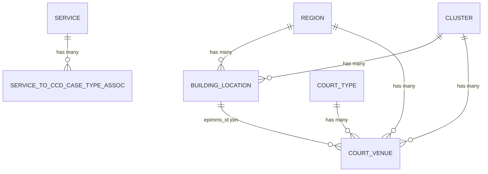

## TL;DR

- `rd-location-ref-api` (LRD) is the read-only REST API for court building locations, court venues, service codes, and region/cluster hierarchies; base path `/refdata/location`, port 8099.
- All endpoints require S2S + IDAM authentication; no role-based restrictions — any user with at least one valid IDAM role can access. S2S whitelist controls which services may call the API.
- `epimms_id` is the cross-service business key linking building locations and court venues; one building can have multiple venues. The special value `ALL` (case-insensitive) returns all records regardless of status.
- Query parameters within an endpoint are generally mutually exclusive — passing more than one returns HTTP 400. However, filter params (`is_hearing_location`, `is_case_management_location`, `location_type`, `is_temporary_location`) can be combined with the primary query param.
- Data is batch-loaded by `rd-location-ref-data-load`; the API itself has no write endpoints. All endpoints are gated behind the LaunchDarkly flag `lrd_location_api`.
- A V2 court venue API is in active design (May 2026) to normalise the data model and add service-level venue mapping, but is not yet implemented in source.

## Endpoints

All paths are relative to the service root. Authentication: S2S token + IDAM Bearer token on every request. API calls should be made directly to the LRD service, not routed through the CCD App gateway.

Swagger (AAT): `http://rd-location-ref-api-aat.service.core-compute-aat.internal/swagger-ui/index.html`
Published spec: [cnp-api-docs](https://hmcts.github.io/cnp-api-docs/swagger.html?url=https://hmcts.github.io/cnp-api-docs/specs/rd-location-ref-api.json)

### Building locations

| Method | Path | Description |
|--------|------|-------------|
| GET | `/refdata/location/building-locations` | Retrieve building locations by ID, name, region, or cluster |
| GET | `/refdata/location/building-locations/search` | Partial text search across building location names |

#### `GET /refdata/location/building-locations`

Source: `LrdApiController.java:162-184`

| Parameter | Type | Required | Notes |
|-----------|------|----------|-------|
| `epimms_id` | string (CSV) | No | Comma-separated list of EPIMMS IDs |
| `building_location_name` | string | No | Exact building location name |
| `region_id` | string | No | Region identifier |
| `cluster_id` | string | No | Cluster identifier |

Only one parameter may be supplied per request (enforced by `checkIfSingleValuePresent`). Passing multiple returns 400.

Special value: passing `epimms_id=ALL` (case-insensitive) returns all building locations regardless of status. When a CSV list contains `ALL` alongside other IDs, the `ALL` takes precedence (`LrdBuildingLocationServiceImpl.java:129-136`).

#### `GET /refdata/location/building-locations/search`

Source: `LrdApiController.java:272-286`

| Parameter | Type | Required | Notes |
|-----------|------|----------|-------|
| `search` | string | Yes | Minimum 3 characters; partial match on building location name |

### Court venues

| Method | Path | Description |
|--------|------|-------------|
| GET | `/refdata/location/court-venues` | Retrieve court venues with filtering |
| GET | `/refdata/location/court-venues/services` | Court venues grouped by service code |
| GET | `/refdata/location/court-venues/venue-search` | Partial text search across venues |

#### `GET /refdata/location/court-venues`

Source: `LrdCourtVenueController.java:120-162`

| Parameter | Type | Required | Notes |
|-----------|------|----------|-------|
| `epimms_id` | string | No | Building location EPIMMS ID |
| `court_type_id` | integer | No | Court type identifier |
| `region_id` | integer | No | Region identifier |
| `cluster_id` | integer | No | Cluster identifier |
| `court_venue_name` | string | No | Exact court venue name |
| `is_hearing_location` | string | No | `"Y"` or `"N"` |
| `is_case_management_location` | string | No | `"Y"` or `"N"` |
| `location_type` | string | No | e.g. `CTSC`, `NBC`, `Court`, `CCBC` |
| `is_temporary_location` | string | No | `"Y"` or `"N"` |

**Primary parameter rules**: `epimms_id` and `court_type_id` may coexist. All other primary parameters (`region_id`, `cluster_id`, `court_venue_name`) are mutually exclusive with each other and with the epimms/court-type pair.

**Filter parameters** (`is_hearing_location`, `is_case_management_location`, `location_type`, `is_temporary_location`) can be combined with any primary parameter and with each other. They act as additional narrowing filters on the result set.

**Status filtering by query type**:

| Primary parameter | Status filter |
|-------------------|---------------|
| `epimms_id` (specific value) | All statuses returned |
| `epimms_id=ALL` | All statuses returned |
| `court_type_id` | Only `courtStatus='Open'` (`CourtVenueRepository.java:18-20`) |
| `region_id` | Only `courtStatus='Open'` |
| `cluster_id` | Only `courtStatus='Open'` |
| No primary param | Only `courtStatus='Open'` |

**`court_venue_name`** performs a case-insensitive exact match against `court_name` OR `site_name` (`CourtVenueRepository.java:42-44`).

<!-- DIVERGENCE: Confluence (page 1482334973) says epimms_id+service_code can be combined on /court-venues, but LrdCourtVenueController.java:120-129 shows no service_code parameter on that endpoint. service_code is only on /court-venues/services. Source wins. -->

#### `GET /refdata/location/court-venues/services`

Source: `LrdCourtVenueController.java:206-218`

| Parameter | Type | Required | Notes |
|-----------|------|----------|-------|
| `service_code` | string | Yes | LRD service code (e.g. `ABA5`) |

Returns `LrdCourtVenuesByServiceCodeResponse` containing court type, service details, and a filtered list of venues for that service.

#### `GET /refdata/location/court-venues/venue-search`

Source: `LrdCourtVenueController.java:253-304`

| Parameter | Type | Required | Notes |
|-----------|------|----------|-------|
| `search-string` | string | Yes | Minimum 3 characters; matches against `siteName`, `courtName`, `postcode`, `courtAddress` |
| `court-type-id` | integer | No | Filter results by court type |
| `is_hearing_location` | string | No | `"Y"` or `"N"` |
| `is_case_management_location` | string | No | `"Y"` or `"N"` |
| `location_type` | string | No | e.g. `CTSC`, `NBC`, `Court`, `CCBC` |
| `is_temporary_location` | string | No | `"Y"` or `"N"` |

Search uses `LIKE %<search-string>%` across multiple fields (`CourtVenueRepository.java:52-65`).

### Org services (service codes)

| Method | Path | Description |
|--------|------|-------------|
| GET | `/refdata/location/orgServices` | Retrieve org service details by service code, CCD case type, or CCD service name |

#### `GET /refdata/location/orgServices`

Source: `LrdApiController.java:106-120`

| Parameter | Type | Required | Notes |
|-----------|------|----------|-------|
| `serviceCode` | string | No | LRD service code (e.g. `ABA5`) |
| `ccdCaseType` | string | No | CCD case type identifier |
| `ccdServiceNames` | string (CSV) | No | Comma-separated CCD service names (e.g. `Divorce`) |

Exactly one parameter must be supplied. All three are mutually exclusive — passing more than one returns 400.

### Regions

| Method | Path | Description |
|--------|------|-------------|
| GET | `/refdata/location/regions` | Retrieve region details |

#### `GET /refdata/location/regions`

Source: `LrdApiController.java:222-234`

| Parameter | Type | Required | Notes |
|-----------|------|----------|-------|
| `regionId` | string | No | Region PK (varchar 16) |
| `region` | string | No | Region description text |

Parameters are mutually exclusive. Only regions with `api_enabled=true` are returned (`Region.java:47-57`).

Special value: passing `regionId=ALL` (case-insensitive) returns all API-enabled regions (`RegionServiceImpl.java:58-68`).

## Response shapes

### Building location response

Key fields in `LrdBuildingLocationResponse`:

| Field | Type | Notes |
|-------|------|-------|
| `building_location_id` | integer | Surrogate PK |
| `epimms_id` | string | Cross-service business key (max 16 chars) |
| `building_location_name` | string | Max 256 chars |
| `building_location_status` | string | e.g. `Open`, `Closed` |
| `area` | string | Free-text zone indicator (max 16 chars) |
| `region_id` | string | FK to region |
| `region` | string | Region description |
| `cluster_id` | string | FK to cluster |
| `cluster_name` | string | Cluster name |
| `court_finder_url` | string | Link to Court Finder |
| `postcode` | string | |
| `address` | string | |
| `court_venues` | array | Nested `LrdCourtVenueResponse` objects |

### Court venue response

All fields in `LrdCourtVenueResponse` (source: `LrdCourtVenueResponse.java`):

| Field | Type | Notes |
|-------|------|-------|
| `court_venue_id` | integer | Surrogate PK |
| `epimms_id` | string | Links to building location |
| `site_name` | string | |
| `court_name` | string | |
| `venue_name` | string | |
| `court_status` | string | e.g. `Open`, `Closed` |
| `court_address` | string | |
| `postcode` | string | |
| `phone_number` | string | Contact phone number |
| `court_location_code` | string | Legacy court location identifier |
| `dx_address` | string | DX (Document Exchange) address |
| `region_id` | string | |
| `region` | string | |
| `court_type` | string | Court type description |
| `court_type_id` | integer | |
| `cluster_id` | string | |
| `cluster_name` | string | |
| `open_for_public` | string | e.g. `"YES"` |
| `court_open_date` | datetime | Nullable |
| `closed_date` | datetime | Nullable |
| `is_hearing_location` | string | `"Y"` / `"N"` (not boolean) |
| `is_case_management_location` | string | `"Y"` / `"N"` |
| `is_temporary_location` | string | `"Y"` / `"N"` |
| `is_nightingale_court` | string | `"Y"` / `"N"` — indicates COVID-era temporary venue |
| `location_type` | string | `CTSC`, `NBC`, `Court`, `CCBC`, etc. |
| `parent_location` | string | Parent location `epimms_id` |
| `uprn` | string | Unique Property Reference Number |
| `venue_ou_code` | string | Venue organisational unit code |
| `mrd_building_location_id` | string | MRD system cross-reference |
| `mrd_venue_id` | string | MRD system cross-reference |
| `service_url` | string | URL to service information |
| `fact_url` | string | URL to Find a Court or Tribunal page |
| `external_short_name` | string | Short display name for external consumers |
| `welsh_external_short_name` | string | Welsh bilingual short name |
| `welsh_site_name` | string | Welsh bilingual |
| `welsh_court_name` | string | Welsh bilingual |
| `welsh_court_address` | string | Welsh bilingual address |
| `welsh_venue_name` | string | Welsh bilingual |

### Org service response

Key fields in `LrdOrgInfoServiceResponse`:

| Field | Type | Notes |
|-------|------|-------|
| `service_id` | integer | Surrogate PK |
| `org_unit_id` | integer | Organisation unit FK |
| `business_area_id` | integer | Business area FK |
| `sub_business_area_id` | integer | Sub-business area FK |
| `jurisdiction_id` | integer | Jurisdiction FK |
| `service_code` | string | Unique service code (e.g. `ABA5`) |
| `service_description` | string | |
| `service_short_description` | string | |
| `ccd_service_name` | string | Linked CCD service name |
| `ccd_case_types` | array | Associated CCD case type strings |

### Region response

Key fields in `LrdRegionResponse`:

| Field | Type | Notes |
|-------|------|-------|
| `region_id` | string | PK (varchar 16) |
| `description` | string | English region name |
| `welsh_description` | string | Welsh bilingual |

## Data model relationships



- `epimms_id` is the natural join key between `building_location` and `court_venue` — one building location can contain multiple court venues.
- Unique constraint on `court_venue`: `(epimms_id, site_name, court_type_id)` (`CourtVenue.java:32`).
- `Region.api_enabled` controls visibility: regions with `api_enabled=false` are excluded from the `/regions` endpoint but can still be referenced as FKs on venues and buildings.

## S2S authorised services

The production whitelist (from `application.yaml` and Flux config) controls which microservices can call LRD. The default value in source is:

```
rd_location_ref_api, payment_app, rd_caseworker_ref_api, rd_judicial_api
```

Additional services added via Flux environment overrides (`LRD_S2S_AUTHORISED_SERVICES`):

| Service | Notes |
|---------|-------|
| `xui_webapp` | ExUI frontend — highest volume consumer |
| `ccd_data` | CCD Data Store |
| `prl_cos_api` | Private Law Case Orchestration |
| `sscs` | SSCS Tribunals |
| `sscs_bulkscan` | SSCS Bulk Scan |
| `adoption_web` | Adoption Web |
| `civil_service` | Civil Service |
| `civil_general_applications` | Civil General Applications |
| `sptribs_case_api` | Special Tribunals |
| `fis_hmc_api` | Family Integration Service / HMC |
| `et_cos` | Employment Tribunals Case Orchestration |
| `iac` | Immigration and Asylum |
| `probate_backend` | Probate (Prod/Demo/ITHC/PerfTest) |
| `pcs_api` | Possessions Claims (AAT/Demo/ITHC/PerfTest) |
| `civil_rtl_export` | Civil RTL Export (AAT only) |

## Key consumers and usage patterns

Based on production App Insights data (April 2026):

| Endpoint | Primary consumers | ~Weekly volume |
|----------|-------------------|----------------|
| `/court-venues/services` | `xui_webapp`, `iac`, `prl_cos_api` | ~116k |
| `/court-venues` | `xui_webapp`, `sscs`, `fis_hmc_api`, `civil_service` | ~52k |
| `/orgServices` | `rd_caseworker_ref_api`, `xui_webapp`, `payment_app` | ~100k |
| `/building-locations` | `ccd_data` | ~1.2k |
| `/court-venues/venue-search` | `xui_webapp` | ~5.3k |
| `/regions` | `xui_webapp`, `sptribs_case_api` | ~1.3k |
| `/building-locations/search` | (no recorded usage) | 0 |

## Gotchas

- Boolean-like fields (`is_hearing_location`, `is_case_management_location`, `is_temporary_location`, `is_nightingale_court`) are `varchar` not boolean — pass `"Y"` or `"N"` as strings.
- `location_type` is a free-text string with no backing enum — known values are `CTSC`, `NBC`, `Court`, `CCBC`.
- The `court_type_id` filter implicitly adds `courtStatus='Open'`, but querying by `epimms_id` returns venues of all statuses.
- `cluster_id` and `region_id` on `CourtVenue` are stored as `varchar` in the database, but the API endpoint accepts them as `Integer` — type coercion happens in the service layer.
- The `area` field on `BuildingLocation` is a max-16-char free-text zone indicator, not a foreign key to any hierarchy table.
- Schema name is `locrefdata` — relevant for direct DB queries and Flyway migration context.
- The LaunchDarkly feature flag `lrd_location_api` (`LocationRefConstants.LD_FLAG`) gates all endpoints — if toggled off, the API returns 403.
- API calls must NOT be routed through the CCD App gateway; they must be direct service-to-service calls.
- The IDAM scope for token generation is `openid` only (differs from other RD services).
<!-- CONFLUENCE-ONLY: not verified in source -->
- The `ALL` special value works on `epimms_id` (building-locations and court-venues) and `regionId` (regions) — it bypasses status filtering and returns the full dataset.

## V2 API (in development)

A V2 court venue API is in active design as of May 2026. Key planned changes:

- **Normalised data model**: Court Venue remains core, but names, addresses, and contact details become separate entities (`court_venue_name`, `address`, `contact_details`).
- **New fields**: `is_district_registry`, `is_appeal_centre`, `district_registry_venue_id`, `appeal_centre_venue_id`, `external_short_name` (Welsh variants), `contact_email`, `breathing_space_email`.
- **Service-level mapping**: Unique key shifts from `(epimms_id, court_type_id)` to `(epimms_id, service_id)`. `court_type_id` retained but deprecated.
- **Proposed V2 endpoints**:
  - `GET /refdata/location/v2/court-venues` — same filter params as V1 plus `is_district_registry`, `is_appeal_centre`, `service_code`; response uses nested arrays for names/addresses/contacts.
  - `GET /refdata/location/v2/court-venues/venue-search` — same search params; richer response.
- **Backward compatibility**: V1 endpoints remain unchanged during transition. V1 responses sourced from same table. Deprecation headers will be emitted. Formal sunset date TBD pending consumer migration sign-off.
- **Security**: Same S2S + IDAM model as V1.

**Status**: Design complete (Confluence page 1973487027, updated 2026-05-11). No V2 code exists in `rd-location-ref-api` source as of this writing.

<!-- CONFLUENCE-ONLY: not verified in source -->

### Service-level migration impact

The move from `court_type_id` to `service_code` is driven by the Civil Possessions Service. Impact assessment (from Confluence):

| Service | Impact |
|---------|--------|
| IAC, ET, FPL, Probate, Divorce/NFD, FR | No impact |
| SSCS | Impacted — uses court type lookup; straight swap expected |
| Private Law | Minimal — already uses `service_code` (ABA5) |
| CCD/ExUI | Separate analysis required |

<!-- CONFLUENCE-ONLY: not verified in source -->

## Examples

### Court venues controller signature (`LrdCourtVenueController.java`)

The filter parameters (`is_hearing_location`, `is_case_management_location`, `location_type`, `is_temporary_location`) can be combined with any primary parameter. Note that boolean-like fields are `String`, not `boolean` — pass `"Y"` or `"N"`.

```java
// Source: apps/rd/rd-location-ref-api/src/main/java/uk/gov/hmcts/reform/lrdapi/controllers/LrdCourtVenueController.java
@RequestMapping(path = "/refdata/location/court-venues")
@RestController
public class LrdCourtVenueController {

    @GetMapping(produces = APPLICATION_JSON_VALUE)
    public ResponseEntity<List<LrdCourtVenueResponse>> retrieveCourtVenues(
        @RequestParam(value = "epimms_id",                   required = false) String epimmsIds,
        @RequestParam(value = "court_type_id",               required = false) Integer courtTypeId,
        @RequestParam(value = "region_id",                   required = false) Integer regionId,
        @RequestParam(value = "cluster_id",                  required = false) Integer clusterId,
        @RequestParam(value = "court_venue_name",            required = false) String courtVenueName,
        // filter params — can combine with any primary param:
        @RequestParam(value = "is_hearing_location",         required = false) String isHearingLocation,
        @RequestParam(value = "is_case_management_location", required = false) String isCaseManagementLocation,
        @RequestParam(value = "location_type",               required = false) String locationType,
        @RequestParam(value = "is_temporary_location",       required = false) String isTemporaryLocation) {
        // epimms_id and court_type_id may coexist; all other primary params are mutually exclusive
        // ...
        return ResponseEntity.status(HttpStatus.OK).body(lrdCourtVenueResponses);
    }
}
```

### Flyway table definitions — core physical model (`V1_9__create_tables.sql`)

```sql
// Source: apps/rd/rd-location-ref-api/src/main/resources/db/migration/V1_9__create_tables.sql
create table region (
    region_id         varchar(16),
    description       varchar(256),
    welsh_description varchar(256),
    CONSTRAINT region_id_pk PRIMARY KEY (region_id)
);

create table building_location(
    building_location_id varchar(16),
    epimms_id            varchar(16) NOT NULL,
    building_location_name varchar(256) NOT NULL,
    building_location_status_id varchar(16),
    area                 varchar(16),
    region_id            varchar(16),
    cluster_id           varchar(16),
    court_finder_url     varchar(512),
    postcode             varchar(8) NOT NULL,
    address              varchar(512) NOT NULL,
    constraint building_location_pk primary key (building_location_id),
    constraint epimms_id_uq unique (epimms_id)
);

create table cluster (
    cluster_id         varchar(16) NOT NULL,
    cluster_name       varchar(256),
    welsh_cluster_name varchar(256),
    CONSTRAINT cluster_id_pk PRIMARY KEY (cluster_id)
);
```

### S2S allowlist (`application.yaml`)

```yaml
// Source: apps/rd/rd-location-ref-api/src/main/resources/application.yaml
idam:
  s2s-authorised:
    services: ${LRD_S2S_AUTHORISED_SERVICES:rd_location_ref_api,payment_app,rd_caseworker_ref_api,rd_judicial_api}
```

## See also

- [Locations](../explanation/locations.md) — explains the LRD data model, data loading, MRD source files, and the in-development V2 venue API in depth
- [Batch Loading](../explanation/batch-loading.md) — details on how `rd-location-ref-data-load` ingests `BuildingLocation.csv` and `CourtVenue.csv` via Apache Camel
- [Query Reference Data](../how-to/query-reference-data.md) — practical HTTP examples for calling LRD endpoints including venue-search, orgServices, and building-locations
- [Glossary](glossary.md) — definitions of epimms_id, service code, MRD, UPRN, CTSC, and NBC
