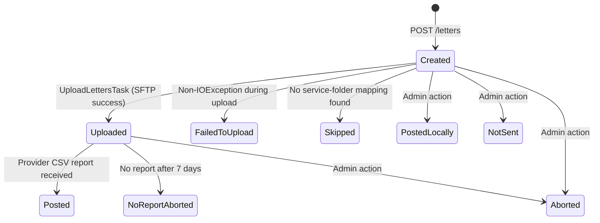

## TL;DR

- A letter transitions through three happy-path states: **Created** (accepted via `POST /letters`) then **Uploaded** (scheduler pushes ZIP/PGP to SFTP) then **Posted** (provider CSV report confirms printing).
- Error states: `FailedToUpload`, `Skipped`, `NoReportAborted`; manual/admin states: `Aborted`, `PostedLocally`, `NotSent`.
- The upload scheduler runs every 30 seconds, processes up to 10 letters per batch, and only targets letters created more than 2 minutes ago.
- Xerox processes letters on a per-service schedule on weekdays (e.g. CMC 17:30, SSCS 18:00) and has a 48-hour SLA from print to post.
- A letter stuck in `Uploaded` for more than 7 days without a matching provider report is automatically marked `NoReportAborted`.
- After reaching a terminal state (`Posted`, `Aborted`, etc.), the `file_content` column is nulled to reclaim storage; separate cleanup tasks purge SFTP files (12h TTL) and old DB content (31-day TTL).

## State machine



All nine values of `LetterStatus` (`LetterStatus.java:11-19`):

| Status | Set by | Meaning |
|--------|--------|---------|
| `Created` | `LetterService.save()` | Letter persisted, awaiting upload |
| `Uploaded` | `UploadLettersTask` | ZIP/PGP successfully written to SFTP |
| `Posted` | `MarkLettersPostedService` | Provider report confirms physical posting |
| `FailedToUpload` | `LetterEventService.failLetterUpload()` | Non-IO error during SFTP upload |
| `Skipped` | `UploadLettersTask` | No folder mapping for the calling service |
| `NoReportAborted` | `CheckLettersPostedService` | Uploaded > 7 days, no report ever received |
| `Aborted` | Admin (`ActionController`) | Manually aborted by operator |
| `PostedLocally` | Admin (`ActionController`) | Operator confirmed letter posted outside normal flow |
| `NotSent` | Admin (`ActionController`) | Operator marked letter as not sent |

## Phase 1: Created

When a calling service issues `POST /letters` (content type `application/vnd.uk.gov.hmcts.letter-service.in.letter.v2+json` or `.v3+json`), the service:

1. Authenticates the S2S token via `AuthTokenValidator`.
2. Validates the request body -- up to 30 documents, each base64-encoded PDF (`LetterWithPdfsRequest.java:23-25`).
3. Computes a checksum of the request for deduplication.
4. Checks for an existing `Created` letter with the same checksum. If found, returns its UUID without inserting (`LetterService.java:151-162`).
5. Assembles the PDF pages into a ZIP (optionally PGP-encrypted), stores the binary in `file_content`, and writes the `letters` row with status `Created` (`Letter.java:40`).
6. Returns a `SendLetterResponse` containing the `letter_id` UUID.

### Deduplication

Two layers prevent duplicate letters:

- **Java-level**: `findByChecksumAndStatusOrderByCreatedAtDesc(checksum, Created)` before insert.
- **DB-level**: Unique index on `(checksum, status) WHERE status = 'Created'` (migration V019). If a race condition hits this constraint, the async path writes the entry to the `duplicates` table instead of failing.

### Async mode

The `isAsync` query parameter (default `"false"`) controls whether PDF assembly and the DB write happen on the HTTP thread or a separate `@Async("AsyncExecutor")` thread pool. When async, the UUID is returned immediately; `GET /letters/{id}` retries the DB lookup up to 3 times with 1-second sleep to handle write lag (`LetterService.java:554-566`).

## Phase 2: Uploaded

The `UploadLettersTask` scheduler transitions letters from `Created` to `Uploaded`.

### Scheduler mechanics

- **Interval**: every 30 seconds (`tasks.upload-letters.interval-ms` = 30000, `application.yaml:176`).
- **Concurrency**: ShedLock (`@SchedulerLock(name = "UploadLetters")`) ensures only one pod runs the task at a time (`UploadLettersTask.java:78`).
- **Batch size**: up to 10 letters per run (`UploadLettersTask.BATCH_SIZE`, `UploadLettersTask.java:38`).
- **Poll delay**: only picks letters created more than 2 minutes ago to avoid reading mid-commit async writes (`application.yaml:177`).
- **FTP availability check**: `FtpAvailabilityChecker` suppresses uploads during a configurable downtime window (default 16:00-17:00 London time, `application.yaml:139-140`).
- **Scheduling disabled by default**: `SCHEDULING_ENABLED` must be `true` in deployed environments (`application.yaml:171`).

### Upload flow

1. `UploadLettersTask.run()` checks `FtpAvailabilityChecker.isFtpAvailable()`. If in the downtime window, the run is skipped entirely (`UploadLettersTask.java:82-84`).
2. Queries `LetterRepository.findFirstLetterCreated(LocalDateTime)` to find the next eligible letter (`LetterRepository.java:29-32`).
3. Opens a single SFTP session via `FtpClient.runWith(...)` and iterates up to 10 letters (`UploadLettersTask.java:98-130`).
4. For each letter, resolves the target folder from `ServiceFolderMapping.getFolderFor(serviceName)`:
   - If no mapping exists, the letter is marked `Skipped` (`UploadLettersTask.java:160-163`).
   - If `additionalData.isInternational = true`, appends `/International` to the folder path (`UploadLettersTask.java:147-151`).
5. Uploads the file via SSHJ to `{targetFolder}/{serviceFolder}/{filename}`.
6. On success: sets status to `Uploaded`, records `sentToPrintAt` timestamp (`UploadLettersTask.java:153-155`).

### Error handling during upload

- **IOException** (network/SFTP failure): the exception propagates, the SFTP session closes, and the letter remains `Created` for retry on the next scheduler run.
- **Non-IOException** (e.g. encryption failure, data corruption): `LetterEventService.failLetterUpload(letter, ex)` marks the letter `FailedToUpload` and writes to the `letter_events` audit table (`LetterEventService.java:46-56`). The batch loop then **breaks** -- one bad letter halts the entire batch (`UploadLettersTask.java:119-124`). This prevents cascading failures but means subsequent healthy letters are blocked until the bad letter is resolved.
- **TimeoutException** during upload: the service attempts to delete the partially-written SFTP file before rethrowing (`FtpClient.java:99-105`).
- **Retry**: `RetryConfig` wraps FTP operations with exponential backoff (default 5 retries, 2000ms initial wait) for `FtpException` (`RetryConfig.java:22-31`).

## Phase 3: Posted

The `MarkLettersPostedService` transitions letters from `Uploaded` to `Posted` when the external print provider's CSV report confirms printing.

### Report processing

1. `POST /tasks/process-reports` (admin API-key protected) triggers `MarkLettersPostedService.processReports()` asynchronously via a single-thread executor (`TaskController.java:57-63`).
2. Downloads all `.csv` files from the SFTP reports folder (`FtpClient.downloadReports()`).
3. Parses each CSV with Apache Commons CSV. Key columns: `InputFileName`, `StartDate`, `StartTime` (`ReportParser.java:80-88`).
4. Extracts the letter UUID from each `InputFileName` using `FileNameHelper.extractIdFromPdfName(...)` (`ReportParser.java:82`).
5. For each matched letter, marks it `Posted` only if the current status is `Uploaded` (`MarkLettersPostedService.java:178-192`). Letters in any other status are skipped with a warning log.
6. `markLetterAsPosted` sets `printedAt` and **nulls** `fileContent` to reclaim DB storage (`LetterRepository.java:150-152`).
7. If all CSV rows parse cleanly, the report file is deleted from SFTP and a `ReportStatus.SUCCESS` row is written to the `reports` table. If any row fails parsing, the file is kept and `ReportStatus.FAIL` is recorded (`MarkLettersPostedService.java:142-151`).

There is no scheduled trigger for report processing -- it is operator-initiated only via the admin endpoint.

### Report code resolution

The service code is extracted from the CSV filename pattern `MOJ_<CODE>_...` using `REPORT_CODE_PATTERN` (`MarkLettersPostedService.java:66`). SSCS has special handling: letters with `additionalData.isIbca = true` map to report code `SSCS-IB`; others to `SSCS-REFORM` (`ReportsServiceConfig.java:140-147`).

### Xerox print processing times

Once uploaded to SFTP, Xerox processes letters on a per-service schedule on weekdays. The Xerox SLA is 48 hours from receipt of file to posting via Royal Mail. Once posted, there is no further tracking -- Xerox has no responsibility after handoff to Royal Mail.
<!-- CONFLUENCE-ONLY: not verified in source -->

| Service folder | Xerox processing time (weekdays) |
|----------------|----------------------------------|
| CMC | 17:30 |
| FINREM | 16:30 |
| PRIVLAW | 18:00 |
| DIVORCE | 17:30 |
| NFDIVORCE | 17:05 |
| SSCS | 18:00 |
| SSCSIB | 17:55 |
| PROBATE | 19:00 |
| FPL | 18:15 |

These times are Xerox-side configuration and are not represented in the send-letter-service source code. They determine when letters uploaded before the cutoff will be physically printed and enveloped for posting.
<!-- CONFLUENCE-ONLY: not verified in source -->

### What happens after `Posted`

Once the service marks a letter as `Posted`, the letter lifecycle within HMCTS is complete. If a citizen reports non-receipt, there is no mechanism to investigate further -- the letter is with Royal Mail and Xerox has no visibility or responsibility beyond the handoff to postal services.
<!-- CONFLUENCE-ONLY: not verified in source -->

## Error and stale-letter detection

### NoReportAborted (automatic)

`CheckLettersPostedService` (triggered via `GET /tasks/check-posted`) identifies letters that have been `Uploaded` for more than 7 days (`stale-letters.min-age-in-days-for-no-report-abort`) without a corresponding entry in the `reports` table. These are marked `NoReportAborted` (`CheckLettersPostedService.java:53-76`). This state indicates likely provider failure -- the letter was uploaded but never appeared in any printing report.

### StaleLettersTask (alerting)

`StaleLettersTask` runs on a schedule with a 15-second minimum lock hold (`StaleLettersTask.java:59`). It queries for `Created` letters that have not been uploaded within an expected window and logs them to Application Insights for alerting. It does **not** change letter status -- it is purely observational.

### DelayAndStaleReport (email)

The `DelayAndStaleReport` scheduled task (daily at 1pm London time) generates two CSV email attachments: delayed-print letters (uploaded more than N business days ago without reaching `Posted`) and stale letters. This is sent to configured recipients for manual triage (`DelayAndStaleReport.java:73-91`).

## Storage reclamation

Letters carry their full ZIP/PGP payload in the `file_content` bytea column. To manage DB growth, three separate mechanisms operate:

### 1. Immediate content nulling

- `markLetterAsPosted` nulls `fileContent` upon transition to `Posted` (`LetterRepository.java:150-152`).
- Manual `Aborted`/`PostedLocally` transitions via `ActionController` also null the file content.

### 2. SFTP file cleanup

The `file-cleanup` task (gated by `FILE_CLEANUP_ENABLED`, default `false`) deletes uploaded files from the SFTP server after a configurable TTL (default 12 hours). It runs on a cron schedule at 15 minutes past each hour (`application.yaml:184-187`). This only runs in production -- the flag must be explicitly enabled.

### 3. Old letter content cleanup

The `old-letter-content-cleanup` task (gated by `OLD_LETTER_CONTENT_CLEANUP_ENABLED`, default `false`) nulls `file_content` for letters older than a configurable TTL (default 31 days / `P31D`). It runs daily at 07:00 (`application.yaml:189-192`). This catches any letters whose content was not already nulled by the status transition (e.g. letters stuck in intermediate states).

### 4. Permanent row deletion

`DeleteOldLettersTask` (gated by LaunchDarkly flag `send-letter-service-delete-letters-cron`) runs a PostgreSQL function `batch_delete_letters(...)` with per-service retention intervals to permanently delete old letter rows from the database (`DeleteOldLettersTask.java:75-77`).

**Important**: If a letter is deleted from the SFTP server but its DB row still exists, it can still appear in stale-letter reports. If the DB row is also deleted, the letter becomes completely unrecoverable and untraceable.

## Operational interventions

### Stopping a letter before printing

Two scenarios exist depending on the letter's current state:

1. **Letter still `Created` (not yet uploaded)**: An operator can set the status to `Aborted` via the admin `ActionController`. This prevents the upload scheduler from picking it up.
2. **Letter already `Uploaded` (on Xerox SFTP)**: The letter is already with the print provider. A ServiceNow ticket must be raised and assigned to the Xerox team (service offering: "Offsite Bulk Print Services", assignment group: "Offsite\_Bulk\_Printing\_Xerox") to request deletion from their SFTP server before processing.
<!-- CONFLUENCE-ONLY: not verified in source -->

### Checking letter status in production

The letter status can be queried at:
```
http://rpe-send-letter-service-prod.service.core-compute-prod.internal/letters/<letter-id>?include-additional-info=true
```
This requires VPN access. The `letter_id` UUID is returned by `POST /letters` at creation time.
<!-- CONFLUENCE-ONLY: not verified in source -->

## Document format requirements

The print provider (Xerox) imposes physical layout requirements on PDFs:

- **Paper size**: A4 only (both colour and black-and-white, portrait and landscape supported).
- **Cover page address block**: Top and bottom margins must be reserved for the address block alignment to fit the envelope window. This applies to the covering letter only.
- **Page-level barcode**: Every page (including the cover) must reserve white space in the right-hand margin for a page-level barcode inserted by Xerox during processing.
- **Duplex printing**: When multiple documents are merged into one envelope, the total page count must be even for duplex printing. The send-letter-service does not enforce this -- it is the calling service's responsibility to generate compliant PDFs.
<!-- CONFLUENCE-ONLY: not verified in source -->

## Letter types and onboarding context

The `type` field in the letter request (e.g. `CMC001`, `SSCS001`) is a Xerox-side concept that determines:
- Envelope format (A4, A5, etc.)
- Postage class
- Inserts and special handling
- Processing schedule

The send-letter-service does not validate or interpret letter types. It passes the type value through to the filename on SFTP, where Xerox uses it to drive their internal batch processing. Each type must be agreed during the onboarding process between the service team, BSP team, and Xerox. There is an approximate 6-week lead time for Xerox to configure new letter types.
<!-- CONFLUENCE-ONLY: not verified in source -->

## Bulk Print Frontend (in development)

The HLD v1.2 documents a planned frontend dashboard that will provide:

- **Role-based access**: Three IdAM roles (`bulk-print-viewer`, `bulk-print-reports`, `bulk-print-admin`) with SC clearance required for admin.
- **Letter management**: View, abort, and download letters without developer intervention. Over 200 cases historically required developer involvement to abort or remove incorrectly sent letters.
- **Audit trail**: All actions (view, abort, status change) logged in the database.
- **Access control**: Restricted to DOM1 devices or VPN-connected users, behind Azure Front Door.
- **Real-time status**: Authenticated users can view current letter states.

This is documented in the HLD but the frontend implementation status is uncertain from source code alone.
<!-- CONFLUENCE-ONLY: not verified in source -->

## Examples

### LetterStatus enum

```java
// Source: apps/send-letter/send-letter-service/src/main/java/uk/gov/hmcts/reform/sendletter/entity/LetterStatus.java

public enum LetterStatus {
    Created,
    Uploaded,
    Posted,
    Aborted,
    Skipped,        // service decided not to upload; previously counted as uploaded
    NotSent,
    FailedToUpload,
    PostedLocally,
    NoReportAborted
}
```

### Letter entity (key fields)

```java
// Source: apps/send-letter/send-letter-service/src/main/java/uk/gov/hmcts/reform/sendletter/entity/Letter.java

@Entity
@Table(name = "letters")
public class Letter {
    @Id
    private UUID id;
    private String checksum;
    private String service;
    @Type(JsonType.class)
    @Column(columnDefinition = "json")
    private JsonNode additionalData;
    private LocalDateTime createdAt;
    private LocalDateTime sentToPrintAt;   // set when status -> Uploaded
    private LocalDateTime printedAt;       // set when status -> Posted
    @Enumerated(EnumType.STRING)
    private LetterStatus status = LetterStatus.Created;
    private byte[] fileContent;            // nulled after Posted/Aborted
    private Boolean isEncrypted;
    @Type(JsonType.class)
    @Column(columnDefinition = "json")
    private JsonNode copies;
    // ...
}
```

### UploadLettersTask — batch loop with error-break behaviour

```java
// Source: apps/send-letter/send-letter-service/src/main/java/uk/gov/hmcts/reform/sendletter/tasks/UploadLettersTask.java

@SchedulerLock(name = "UploadLetters")
@Scheduled(fixedDelayString = "${tasks.upload-letters.interval-ms}")
public void run() {
    if (!availabilityChecker.isFtpAvailable(now(ZoneId.of(EUROPE_LONDON)).toLocalTime())) {
        logger.info("Not processing 'UploadLetters' task due to FTP downtime window");
    } else {
        if (repo.countByStatus(LetterStatus.Created) > 0) {
            int uploadCount = processLetters();
        }
    }
}

private int processLetters() {
    return ftp.runWith(client -> {
        int uploadCount = 0;
        for (int i = 0; i < BATCH_SIZE; i++) {  // BATCH_SIZE = 10
            Optional<Letter> letterOpt =
                repo.findFirstLetterCreated(LocalDateTime.now().minusMinutes(dbPollDelay));
            if (letterOpt.isPresent()) {
                try {
                    boolean uploaded = processLetter(letterOpt.get(), client);
                    if (uploaded) uploadCount++;
                } catch (Exception ex) {
                    if (!(ex.getCause() instanceof IOException)) {
                        // non-IO error: mark FailedToUpload and stop the batch
                        letterEventService.failLetterUpload(letter, ex);
                    }
                    break;  // one bad letter breaks all remaining in this run
                }
            } else {
                break;
            }
        }
        return uploadCount;
    });
}

private boolean processLetter(Letter letter, SFTPClient sftpClient) {
    Optional<String> serviceFolder = serviceFolderMapping.getFolderFor(letter.getService());
    if (serviceFolder.isPresent()) {
        String folder = serviceFolder.get();
        // route international letters to /International subfolder
        if (letter.getAdditionalData() != null
                && letter.getAdditionalData().has("isInternational")
                && letter.getAdditionalData().get("isInternational").asBoolean()) {
            folder = folder + INTERNATIONAL_FOLDER;
        }
        uploadLetter(letter, folder, sftpClient);
        letter.setStatus(LetterStatus.Uploaded);
        letter.setSentToPrintAt(now());
        repo.saveAndFlush(letter);
        return true;
    } else {
        letter.setStatus(LetterStatus.Skipped);
        repo.saveAndFlush(letter);
        return false;
    }
}
```

## See also

- [API reference](../reference/api.md) — `POST /letters` request/response shapes, content types, and letter status definitions
- [Architecture](architecture.md) — internal component diagram, ShedLock coordination, SFTP integration, and database schema
- [Troubleshoot upload failures](../how-to/troubleshoot-upload-failures.md) — how to diagnose and resolve letters stuck in `Created` or `FailedToUpload`
- [Configuration reference](../reference/configuration.md) — scheduling, FTP downtime window, and stale-letter thresholds
