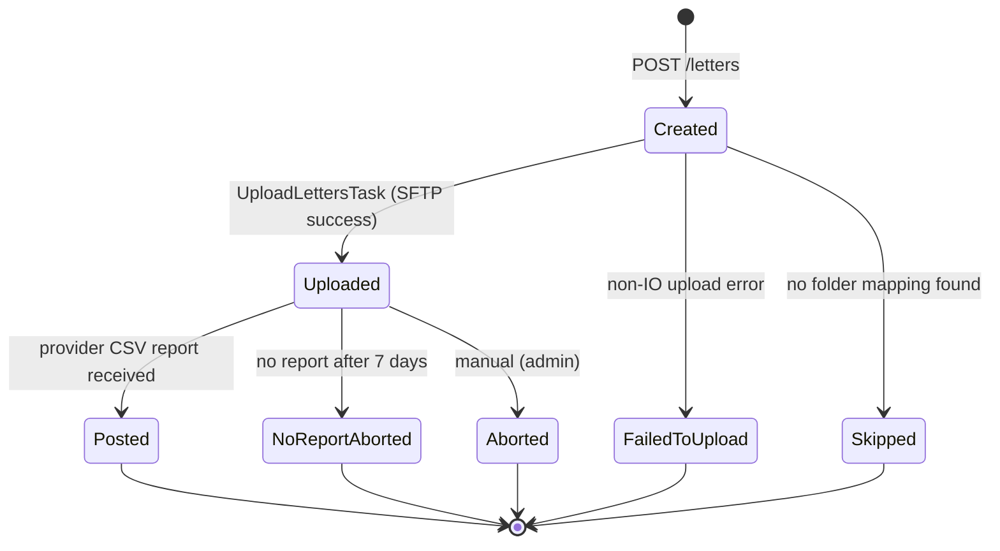

## TL;DR

- Send Letter Service (Bulk Print) accepts PDF documents from HMCTS case services, buffers them in PostgreSQL, and asynchronously uploads them via SFTP to Xerox (the print provider) who physically prints and posts letters within a 48-hour SLA.
- Letters transition through a `Created` -> `Uploaded` -> `Posted` lifecycle, tracked in a `letters` table.
<!-- REVIEW: "The API is rate-limited to 15 requests/second" is incorrect. The @RateLimiter annotation is on FeatureFlagController (GET /feature-flags/{flag}), NOT on SendLetterController. See send-letter-service:src/main/java/uk/gov/hmcts/reform/sendletter/controllers/FeatureFlagController.java:15. The rate limiter does not protect POST /letters. -->
- Callers authenticate exclusively via S2S tokens (`ServiceAuthorization` header) -- no IDAM/user auth required. The API is rate-limited to 15 requests/second.
- The API is `POST /letters` with content type `application/vnd.uk.gov.hmcts.letter-service.in.letter.v3+json`; documents are base64-encoded PDFs supplied inline. The `additional_data` field **must** contain a non-empty `recipients` list.
- Each calling service must be onboarded: registered in S2S, allocated an SFTP folder by Xerox, and configured in the service's `application.yaml`. Most services integrate via the [`send-letter-client`](https://github.com/hmcts/send-letter-client) Java library.
- The service runs on port **8485** and is deployed to AKS; scheduling (upload tasks, reports) is disabled by default and must be explicitly enabled via `SCHEDULING_ENABLED=true`.

## What Send Letter does

Send Letter Service (also referred to as National Print and Post / NPP) is the single gateway through which HMCTS case-management services dispatch physical mail. The print vendor is **Xerox**, operating under a FITS (Future IT Sourcing) contract inherited from CGI/Swiss Post. Rather than each service managing its own print integration, Send Letter centralises:

1. **Inbound buffering** -- accepts PDF documents over HTTP, persists them to a PostgreSQL `letters` table as zipped (optionally PGP-encrypted) binary blobs.
2. **Asynchronous SFTP upload** -- a scheduled task polls for pending letters and uploads them in batches to service-specific folders on the print provider's SFTP server.
3. **Delivery confirmation** -- downloads CSV reports from the provider's SFTP reports folder to mark letters as physically posted.
4. **Operational reporting** -- sends daily email summaries of upload volumes, stale letters, and delayed prints.

The print provider (Xerox) receives zipped PDF files over SFTP, prints them, and posts them to the recipients. Xerox's SLA is 48 hours from receipt to posting. Send Letter never stores documents long-term; after a letter reaches `Posted` or `Aborted`, the binary content is nulled from the database.

### Suitable and unsuitable use cases

<!-- CONFLUENCE-ONLY: not verified in source -->

Bulk Print is designed for:
- Communications for the digitally excluded (paper channel)
- Mandatory notices as part of business processes
- Complex case-related communications
- Letters requiring envelope inserts

It is **not** suitable for:
- Bulk mailing campaigns
- Printing stock/stationery
- Very simple messaging (use GOV.UK Notify instead)
- Recorded delivery (no known use case)
- Adding barcodes (better handled in document generation)

## The letter lifecycle

### Status definitions

| Status | Meaning |
|--------|---------|
| `Created` | Letter saved to DB; awaiting upload. |
| `Uploaded` | Successfully uploaded to provider SFTP; `sentToPrintAt` timestamp set. |
| `Posted` | Provider CSV report confirms physical printing; `printedAt` set, `fileContent` nulled. |
| `FailedToUpload` | A non-IOException error occurred during upload (requires manual investigation). |
| `Skipped` | No SFTP folder mapping found for the calling service. |
| `NotSent` | Manually set via admin endpoint. |
| `PostedLocally` | Manually set via admin endpoint (e.g., reprinted locally). |
| `Aborted` | Manually aborted via admin endpoint. |
| `NoReportAborted` | Letter was `Uploaded` for more than 7 days with no matching provider report. |

Status values are defined in `LetterStatus.java:11-19`. Note that `FailedToUpload`, `PostedLocally`, `NoReportAborted`, and `NotSent` are internal statuses not documented in the public README.

## How a letter is submitted

A calling service sends a `POST /letters` request with an S2S token and one of two supported content types:

- **v2**: `application/vnd.uk.gov.hmcts.letter-service.in.letter.v2+json` -- `documents` is a `List<byte[]>` (each element a base64-encoded PDF), max 30 documents (`LetterWithPdfsRequest.java:24-25`).
- **v3**: `application/vnd.uk.gov.hmcts.letter-service.in.letter.v3+json` -- `documents` is a `List<Doc>` where each `Doc` has `content` (base64 PDF) and `copies` (1-100) (`Doc.java:19-21`).

Both endpoints map to the same URL (`POST /letters`); routing is by `consumes` media type, not path (`SendLetterController.java:79`, `:105`).

The `additional_data` field is **mandatory** and must include a non-empty `recipients` array (a list of recipient name strings, e.g. `["Joe Bloggs", "Jane Smith"]`). This is enforced by `@ValidRecipients` annotation on all request types (`RecipientsValidator.java:43-63`). Requests without valid recipients receive HTTP 400.

The `type` field is a Xerox-agreed document type identifier (e.g. `CMC001`) that determines print queue, stationery, postage class, and envelope type at Xerox's end. Each service agrees its type(s) with Xerox during onboarding.

The response is a `SendLetterResponse` containing the `letter_id` UUID. Callers can poll `GET /letters/{id}` or `GET /letters/{id}/extended-status` to check progress.

### Client library

Most services integrate via [`send-letter-client`](https://github.com/hmcts/send-letter-client), a Java library that wraps the HTTP call and S2S token management. Add the dependency, set `SEND_LETTER_URL` to point at the environment's send-letter-service instance, and call `SendLetterApi.sendLetter()`.

### Deduplication

Duplicate detection operates at two layers:

1. **Java-level**: before inserting, `LetterService` checks for an existing `Created` letter with the same checksum and returns its ID (`LetterService.java:151-162`).
2. **DB-level**: a unique index on `(checksum, status)` where `status = 'Created'` catches race conditions (`V019__Add_unique_index_checksum_status.sql`).

## The upload pipeline

The `UploadLettersTask` is a `@Scheduled` task (default interval: 30 seconds) that:

1. Checks the FTP availability window -- skips if within the configured downtime (default 16:00-17:00 London time) (`FtpAvailabilityChecker.java:30-36`).
2. Queries for up to 10 `Created` letters older than the `db-poll-delay` (default 2 minutes) to avoid picking up mid-commit async writes.
3. Opens a single SFTP session via SSHJ (`FtpClient.java:218`).
4. For each letter, resolves the target folder from `ServiceFolderMapping`, appends `/International` if `additionalData.isInternational=true`, and uploads the file.
5. On success, transitions the letter to `Uploaded` and sets `sentToPrintAt`.
6. On a non-IOException error, marks the letter `FailedToUpload` and **breaks the batch** -- all subsequent letters in that run are deferred (`UploadLettersTask.java:119-124`).

Distributed locking via ShedLock (`@SchedulerLock(name = "UploadLetters")`) ensures only one pod runs the task at a time (`UploadLettersTask.java:78`).

### PGP encryption

When `ENCRYPTION_ENABLED=true`, the zipped PDF bundle is PGP-encrypted (AES-256, BouncyCastle) before being stored in the DB and uploaded. Encrypted files use a `.pgp` extension; unencrypted use `.zip` (`FileNameHelper.java:114-116`). The `Letter.isEncrypted` and `Letter.encryptionKeyFingerprint` fields track encryption state (`Letter.java:42-43`).

## Delivery confirmation

`MarkLettersPostedService.processReports()` downloads CSV files from the provider's SFTP reports folder (`MarkLettersPostedService.java:95`). Each CSV row contains an `InputFileName` from which the letter UUID is extracted. Letters in `Uploaded` status are transitioned to `Posted`, and their `fileContent` is nulled to reclaim storage (`LetterRepository.java:150-152`).

This process is **not** scheduled -- it is triggered manually via `POST /tasks/process-reports` (protected by the `actions.api-key` static token) (`TaskController.java:57-63`).

Letters that remain `Uploaded` for more than 7 days without a matching report are automatically marked `NoReportAborted` by `CheckLettersPostedService` (`CheckLettersPostedService.java:53-76`).

## Onboarded services

Each calling service must be configured in two places within `application.yaml`:

| S2S service name | SFTP folder | Report code |
|---|---|---|
| `cmc_claim_store` | `CMC` | `CMC` |
| `civil_service` | `CMC` (disabled by default) | `CMC` |
| `civil_general_applications` | `CMC` | `CMC` |
| `divorce_frontend` | `DIVORCE` | `DIV` |
| `nfdiv_case_api` | `NFDIVORCE` | `NFDIV` |
| `probate_backend` | `PROBATE` | `Probate` |
| `sscs` | `SSCS` | `SSCS` (splits to `SSCS-IB`/`SSCS-REFORM`) |
| `finrem_document_generator` | `FINREM` | `FRM` |
| `finrem_case_orchestration` | `FINREM` | `FRM` |
| `fpl_case_service` | `FPL` | `FPL` |
| `prl_cos_api` | `PRIVLAW` | `PRIVLAW` |
| `pcs_api` | `PCS` | `PCS` |

Onboarding a new service requires coordinated steps:

1. **Initial contact**: discuss requirements with the Bulk Print service manager and complete an RFS (Request for Service) form.
2. **Register the microservice name** in `service-auth-provider-app` (S2S). Note: there is no S2S whitelist specific to send-letter-service; the folder configuration in step 4 implicitly enables the service.
3. **Ask Xerox** to create the SFTP folder in both prod and test environments. Agree document type codes, stationery, postage class, and envelope types.
4. **Add entries** to `ftp.service-folders` and `reports.service-config` in `application.yaml`.
5. **Agree data retention** period for the service's letters (configured in `delete-old-letters.*-interval`).

Deploying the config before the provider creates the folder causes upload failures -- letters will be written to the DB but fail during the SFTP upload step.

### PDF address block requirements

<!-- CONFLUENCE-ONLY: not verified in source -->

PDFs must position the recipient address block to align with the envelope window once the letter is folded and inserted. Xerox provides specifications for C5 envelopes. Royal Mail's "Guide for Clear Addressing" governs font choice and layout. The Divorce/FR team maintains a checking template. Mispositioned addresses will result in letters being undeliverable or returned.

## Authentication

Two distinct authentication mechanisms protect the API:

- **S2S token** (`ServiceAuthorization` header) -- required for all `/letters` endpoints. Validated via `service-auth-provider-java-client` (`AuthService.java:31`).
- **Static API key** (`Bearer <actions.api-key>`) -- required for admin endpoints (`/letters/{id}/mark-*`) and task triggers (`/tasks/*`). Configured via `ACTIONS_API_KEY` environment variable.

## Key operational details

- **Scheduling is off by default**: set `SCHEDULING_ENABLED=true` in deployed environments to activate `UploadLettersTask` and report tasks.
- **FTP downtime window**: uploads are suppressed between `FTP_DOWNTIME_FROM` and `FTP_DOWNTIME_TO` (defaults: 16:00-17:00 London time).
<!-- REVIEW: Rate limiter only applies to FeatureFlagController (GET /feature-flags/{flag}), not to POST /letters or any other endpoint. See send-letter-service:src/main/java/uk/gov/hmcts/reform/sendletter/controllers/FeatureFlagController.java:15 — only this controller has @RateLimiter annotation. -->
- **Rate limiting**: the API is protected by Resilience4j rate limiting at 15 requests per second (`application.yaml:8-10`). Requests exceeding this rate receive HTTP 429.
- **SMTP startup check**: `spring.mail.test-connection: true` means a misconfigured `SMTP_HOST`/`SMTP_USERNAME`/`SMTP_PASSWORD` will prevent the application from starting (`application.yaml:68`).
- **Data retention**: `DeleteOldLettersTask` (gated by LaunchDarkly flag `send-letter-service-delete-letters-cron`) calls a PostgreSQL function to batch-delete old letters with per-service retention intervals. Runs every Saturday at 17:00 London time with a 2-hour maximum execution window (`DeleteOldLettersTask.java:111`).
- **Batch-blocking error**: a single non-IOException error during upload breaks the entire batch -- one problematic letter blocks all subsequent letters until manual intervention (`UploadLettersTask.java:119-124`).
- **File cleanup**: two separate mechanisms reclaim storage -- `FILE_CLEANUP_ENABLED` removes uploaded files from SFTP after 12 hours (`application.yaml:186-187`), and `OLD_LETTER_CONTENT_CLEANUP_ENABLED` nulls `fileContent` from the database for letters older than 31 days (`application.yaml:191`).

### Per-service data retention intervals

Letters are batch-deleted from the database after service-specific intervals (`DeleteOldLettersTask.java`, `application.yaml:230-242`):

| Service | Retention interval |
|---|---|
| `civil_general_applications` | 6 years |
| `civil_service` | 6 years |
| `cmc_claim_store` | 2 years |
| `divorce_frontend` | 3 months |
| `finrem_case_orchestration` | 3 months |
| `finrem_document_generator` | 3 months |
| `fpl_case_service` | 2 years |
| `nfdiv_case_api` | 3 months |
| `prl_cos_api` | 18 years |
| `probate_backend` | 1 year |
| `sscs` | 3 months |
| `pcs_api` | 6 months |

### Xerox print processing schedule

<!-- CONFLUENCE-ONLY: not verified in source -->

Xerox's automated system processes uploaded letters on weekdays at fixed times per service folder:

| Folder | Processing time |
|---|---|
| CMC | 17:30 |
| FINREM | 16:30 |
| PRIVLAW | 18:00 |
| DIVORCE | 17:30 |
| NFDIVORCE | 17:05 |
| SSCS | 18:00 |
| SSCS-IB | 17:55 |
| PROBATE | 19:00 |
| FPL | 18:15 |

Letters uploaded after a folder's processing time will not be printed until the next business day.

## Operational support

### Xerox support contacts

<!-- CONFLUENCE-ONLY: not verified in source -->

Raise tickets via ServiceNow:
- **Business Service**: Offsite Bulk Print (Shared)
- **Service offering**: Offsite Bulk Print Services
- **Assignment group**: Offsite_Bulk_Printing_Xerox
- **Phone**: +44 (0) 207 633 4140

### Common operational tasks

| Task | Procedure |
|---|---|
| Stop a letter before printing | If not yet uploaded: update status to `Aborted` via admin endpoint. If already on SFTP: raise a devops ticket to delete the file from the SFTP server (credentials in `rpe-send-letter-prod` vault). |
| Check letter status in prod | `GET http://rpe-send-letter-service-prod.service.core-compute-prod.internal/letters/<id>?include-additional-info=true` (VPN required). |
| Reprint corrupted/oversize file locally | Xerox reports the file name. Request the decrypted file from Xerox. Devops copies from the FTP folder. Mark the letter `PostedLocally` via admin endpoint. |

## In-development: Bulk Print Frontend

<!-- CONFLUENCE-ONLY: not verified in source -->

A frontend dashboard is being developed (HLD v1.2) to allow authenticated users to manage letters without developer intervention. Planned capabilities:

- **View letters and status** with filtering by service, date, and status.
- **Abort/remove letters** from the queue without involving the bulk print team (historically 200+ such requests required manual intervention).
- **Download uploaded letters** (with justification logging).
- **View statistics** of letters sent per service.
- **Audit page** showing all actions carried out by users.
- **Download reports** of sent letters.

Security model:
- Behind Azure Front Door, restricted to DOM1 devices or VPN.
- CFT IdAM for authentication with role-based access: `bulk-print-viewer`, `bulk-print-reports`, `bulk-print-admin` (SC cleared).
- All user actions audit-logged in the database.

## See also

- [Architecture](architecture.md) — runtime components, SFTP integration, scheduling internals, and database schema
- [Letter Lifecycle](letter-lifecycle.md) — detailed state-machine walk-through for each transition
- [Integrate from a service](../how-to/integrate-from-a-service.md) — step-by-step guide to onboarding a new calling service
- [Configuration reference](../reference/configuration.md) — all environment variables and `application.yaml` keys
