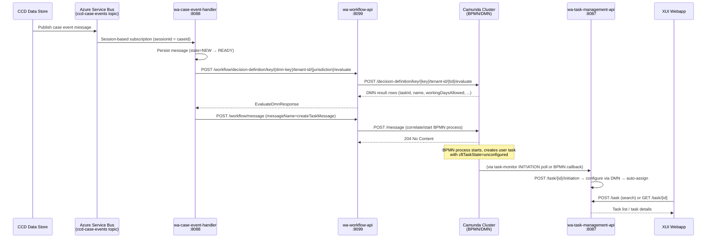

## TL;DR

- Work Allocation is an event-driven task platform: CCD case events flow through Azure Service Bus to a pipeline that evaluates Camunda DMN rules, starts BPMN processes, and stores tasks in a PostgreSQL database served to XUI.
- Five core services: `wa-case-event-handler` (port 8088), `wa-workflow-api` (port 8099), `wa-task-management-api` (port 8087), `wa-task-monitor` (port 8077), plus a shared Camunda BPMN/DMN engine cluster.
- Each service owns its own PostgreSQL schema; there is no shared database. `wa-task-management-api` supports logical replication to a read-replica for search and MI reporting.
- Two Node.js CronJob services (`wa-task-batch-service`, `wa-message-cron-service`) trigger scheduled maintenance and failure-retry jobs via HTTP. Schedules are overridable via `cnp-flux-config`.
- All inter-service communication is authenticated with S2S tokens (no user bearer tokens on internal calls).
- Task access control is enforced at read/write time by `wa-task-management-api` using role assignments fetched from `am-role-assignment-service`. Access uses Attribute-Based Access Control (ABAC) with grant types (BASIC, STANDARD, SPECIFIC, CHALLENGED, EXCLUDED).

## Message flow

The end-to-end path from a CCD case event to a task visible in XUI:



## Services

### wa-case-event-handler (port 8088)

The ingestion gateway. Subscribes to the Azure Service Bus `ccd-case-events` topic using a **session-based** subscription where `sessionId` equals the CCD case ID, ensuring ordered processing per case.

Each received message is persisted into the `wa_case_event_messages_db` PostgreSQL schema in state `NEW`. A readiness consumer promotes messages to `READY` (after confirming the dead-letter queue is empty), and a database message processor picks up `READY` messages using `SELECT ... FOR UPDATE SKIP LOCKED` for concurrent-safe processing (`CaseEventMessageRepository.java:17-52`).

Four ordered handlers process each message:

| Order | Handler | Action |
|-------|---------|--------|
| 1 | `CancellationCaseEventHandler` | Evaluates cancellation DMN; sends `cancelTasks` message to Camunda |
| 2 | `WarningCaseEventHandler` | Evaluates cancellation DMN; sends `warnProcess` message |
| 3 | `ReconfigurationCaseEventHandler` | Evaluates cancellation DMN (filters `action=RECONFIGURE`); calls `POST /task/operation` with `MARK_TO_RECONFIGURE` on task-management-api |
| 4 | `InitiationCaseEventHandler` | Evaluates initiation DMN; sends `createTaskMessage` to Camunda via workflow-api |

Deduplication operates at two levels: ASB message-level (DB primary key on `message_id`) and task-level (MD5 idempotency key = `eventInstanceId + taskId` sent as a Camunda process variable).

**Database**: `wa_case_event_messages_db` — single table `wa_case_event_messages` with states `NEW`, `READY`, `PROCESSED`, `UNPROCESSABLE`.

**Allowed jurisdictions** (configured on `wa-task-management-api` and used as ASB subscription filter): `ia`, `wa`, `sscs`, `civil`, `publiclaw`, `privatelaw`, `employment`, `st_cic`.

### wa-workflow-api (port 8099)

A thin passthrough to the Camunda REST API. Exposes two endpoints:

| Endpoint | Purpose |
|----------|---------|
| `POST /workflow/decision-definition/key/{key}/tenant-id/{tid}/evaluate` | Evaluate a Camunda DMN table |
| `POST /workflow/message` | Correlate a message into Camunda (start/signal BPMN process) |

The service adds S2S authentication to outbound Camunda calls and applies post-processing (normalises comma-separated string values by stripping whitespace — `TaskClientService.java:50-76`).

It also runs two **Camunda External Task workers**:

- `idempotencyCheck` topic — prevents duplicate task creation by maintaining an `idempotent_keys` table in its own `wa_workflow_api` PostgreSQL schema.
- `wa-warning-topic` — propagates warning annotations to active/delayed BPMN process instances and writes notes to `wa-task-management-api`.

**Database**: `wa_workflow_api` — single table `idempotent_keys(idempotency_key, tenant_id, process_id, created_at, last_updated_at)`.

### wa-task-management-api (port 8087)

The authoritative task store and access-control enforcement point. Owns the `cft_task_db` PostgreSQL schema (Flyway-managed, currently at migration `V1.0.42`).

Key responsibilities:

- **Task CRUD**: initiate, configure (via DMN), auto-assign, claim, unclaim, assign, complete, cancel, terminate.
- **Search**: GIN-index-backed SQL search (production path, toggled by LaunchDarkly flag `wa-task-search-gin-index`) with read-replica support. Legacy Hibernate/JPA path exists but is not used in production.
- **Access control**: every request is checked against role assignments from `am-role-assignment-service`. Two additional trust tiers enforced by S2S identity: `privilegedAccessClients` (xui_webapp, ccd_case_disposer) and `exclusiveAccessClients` (wa_task_management_api, wa_task_monitor, wa_case_event_handler, wa_workflow_api).
- **Bulk operations**: `POST /task/operation` supports `MARK_TO_RECONFIGURE`, `EXECUTE_RECONFIGURE`, `UPDATE_SEARCH_INDEX`, `CLEANUP_SENSITIVE_LOG_ENTRIES`, `PERFORM_REPLICATION_CHECK`.

**Database**: `cft_task_db` — core tables `tasks` (PK: `task_id TEXT`), `task_roles` (per-task permission rows), `work_types`, `execution_types`, `sensitive_task_event_logs`. A GIN index on `tasks` covers `ASSIGNED`/`UNASSIGNED` states for search performance (`V1.0.25`).

### wa-task-monitor (port 8077)

A stateless job executor with no database. Triggered externally by `wa-task-batch-service` (Kubernetes CronJob) via `POST /monitor/tasks/jobs`. Polls Camunda and delegates mutations to `wa-task-management-api`.

Key jobs (from `JobName.java` enum):

| Job name | What it does |
|----------|--------------|
| `INITIATION` | Queries Camunda for tasks with `cftTaskState=unconfigured`; calls `POST /task/{id}/initiation` on task-management-api |
| `TERMINATION` | Queries Camunda history for `cftTaskState=pendingTermination`; calls `DELETE /task/{id}` |
| `RECONFIGURATION` | Calls `POST /task/operation` with `EXECUTE_RECONFIGURE` |
| `TASK_INITIATION_FAILURES` | Retries tasks that failed to initiate on first attempt |
| `TASK_TERMINATION_FAILURES` | Retries tasks that failed to terminate on first attempt |
| `RECONFIGURATION_FAILURES` | Retries tasks that failed to reconfigure |
| `MAINTENANCE_CAMUNDA_TASK_CLEAN_UP` | Bulk-deletes old process instances from Camunda (non-prod only) |
| `UPDATE_SEARCH_INDEX` | Triggers GIN index refresh via task-management-api |
| `CLEANUP_SENSITIVE_LOG_ENTRIES` | Purges expired audit log rows |
| `PERFORM_REPLICATION_CHECK` | Verifies logical replication between primary and replica `cft_task_db` |
| `AD_HOC_DELETE_PROCESS_INSTANCES` | Ad-hoc deletion of specific process instances |
| `AD_HOC_PENDING_TERMINATION_TASKS` | Ad-hoc processing of stuck pending-termination tasks |

### Camunda cluster

A shared Camunda BPMN/DMN engine (REST API at `/engine-rest`). Not owned by WA — it is a platform-shared service. WA deploys:

- **BPMN process definitions** (from `wa-standalone-task-bpmn`): the generic standalone task workflow handling initiation, delay timers, warnings, cancellation, and termination.
- **DMN decision tables** (from service-team repos): `wa-task-initiation-{jurisdiction}-{caseType}`, `wa-task-cancellation-{jurisdiction}-{caseType}`, `wa-task-permissions-{jurisdiction}-{caseType}`.

### Cron services

| Service | Runtime | Target | Purpose |
|---------|---------|--------|---------|
| `wa-task-batch-service` | Node.js | `wa-task-monitor` | Fires job requests (INITIATION, TERMINATION, etc.) on schedule |
| `wa-message-cron-service` | Node.js | `wa-case-event-handler` | Triggers `FIND_PROBLEM_MESSAGES` job to detect stuck messages |

Both run as Kubernetes CronJobs — authenticate via S2S, call a single HTTP endpoint, then exit. Default schedule is `*/5 * * * *` (every 5 minutes) per `wa-task-batch-service/charts/wa-task-batch-service/values.yaml`, but each job is deployed as a separate CronJob with its own schedule override in `cnp-flux-config`.

**Deployed CronJob instances** (each has its own flux config path for schedule override):

| CronJob | Flux config path |
|---------|-----------------|
| Task Initiation | `cnp-flux-config/apps/wa/wa-task-batch-initiation` |
| Task Termination | `cnp-flux-config/apps/wa/wa-task-batch-termination` |
| Task Reconfiguration | `cnp-flux-config/apps/wa/wa-task-batch-reconfiguration` |
| Task Initiation Failure | `cnp-flux-config/apps/wa/wa-task-batch-initiation-failure` |
| Task Termination Failure | `cnp-flux-config/apps/wa/wa-task-batch-termination-failure` |
| Task Reconfiguration Failure | `cnp-flux-config/apps/wa/wa-task-batch-reconfiguration-failure` |
| Update Search Index | `cnp-flux-config/apps/wa/wa-task-batch-update-search-index` |
| Find Problem Messages | `cnp-flux-config/apps/wa/wa-messages-find-problem-messages` |
| Set Processed State Messages | `cnp-flux-config/apps/wa/wa-messages-set-processed-state-messages` |
| Reset Problem Messages | `cnp-flux-config/apps/wa/wa-messages-reset-problem-messages` |

<!-- CONFLUENCE-ONLY: CronJob flux config paths from SOG (page 1484625928) — not verified in source -->

## Databases

| Service | Schema | Key tables | Purpose |
|---------|--------|------------|---------|
| wa-task-management-api | `cft_task_db` | `tasks`, `task_roles`, `work_types`, `sensitive_task_event_logs` | Authoritative task store |
| wa-workflow-api | `wa_workflow_api` | `idempotent_keys` | Task creation deduplication |
| wa-case-event-handler | `wa_case_event_messages_db` | `wa_case_event_messages` | Message persistence, dedup, retry |
| wa-task-monitor | (none) | — | Stateless |

All databases are PostgreSQL. `wa-task-management-api` additionally supports a **read replica** (`POSTGRES_REPLICA_HOST`/`POSTGRES_REPLICA_PORT`) for the GIN-index search path.

## Azure Service Bus

The `ccd-case-events` ASB topic is the sole inbound event source. Infrastructure is defined in `wa-shared-infrastructure` (Terraform).

**Naming convention** (from `wa-shared-infrastructure/servicebus.tf`):

| Resource | Pattern |
|----------|---------|
| ASB Namespace | `ccd-servicebus-{env}` |
| ASB Topic | `ccd-case-events-{env}` |
| WA Subscription | `wa-ccd-case-events-sub-{env}` |

Key configuration properties on `wa-case-event-handler`:

| Property | Env var | Default |
|----------|---------|---------|
| `azure.servicebus.connection-string` | `AZURE_SERVICE_BUS_CONNECTION_STRING` | — |
| `azure.servicebus.topic-name` | — | `ccd-case-events` |
| `azure.servicebus.ccd-case-events-subscription-name` | — | WA subscription |
| `azure.servicebus.threads` | `AZURE_SERVICE_BUS_CONCURRENT_SESSIONS` | `1` |
| `azure.servicebus.enableASB-DLQ` | `AZURE_SERVICE_BUS_DLQ_FEATURE_TOGGLE` | `true` |

The subscription is **session-based** (`requires_session = true` in Terraform): each CCD case ID is a session, guaranteeing ordered delivery per case. The DLQ (dead-letter queue) is actively consumed and re-ingested with `from_dlq=true` metadata.

**Subscription SQL filter**: In non-AAT environments, a SQL filter restricts messages to onboarded jurisdictions only: `jurisdiction_id IN (...)`. This is defined in `wa-shared-infrastructure/servicebus.tf` as `azurerm_servicebus_subscription_rule.allowed_jurisdictions`. The `lock_duration` is set to `PT30S`.

**Session behaviour** (synchronous receiver, chosen over async for lock-reclaim ability):

- Uses a shared AMQP connection with a separate receiver link per session
- Sessions can be reclaimed after the `tryTimeout` expires (default 1 minute)
- New AMQP connection created if idle for 5 minutes
- `maxConcurrentSessions` can exceed the number of active session links — ASB handles many thousands of long-lived sessions on a single node
- Multiple nodes may process different messages for the same sessionId after lock release, but ordering within a single session receiver is guaranteed

## Authentication model

All inter-service calls use S2S tokens (`ServiceAuthorization` header) generated via `service-auth-provider-java-client`. There are no IDAM user bearer tokens on internal service-to-service communication.

Inbound to each service:

| Service | Auth required |
|---------|---------------|
| wa-task-management-api | Bearer (user) + S2S for user-facing endpoints; S2S-only for exclusive/privileged endpoints |
| wa-workflow-api | S2S only (authorised: wa_case_event_handler, wa_task_management_api, xui_webapp, camunda-bpm) |
| wa-case-event-handler | S2S only |
| wa-task-monitor | S2S only |

## Feature flags (LaunchDarkly)

All Java services integrate LaunchDarkly. Key flags on `wa-task-management-api`:

- `wa-task-search-gin-index` — switches search path between GIN index (production) and Hibernate (legacy)
- `WA_DELETE_TASK_BY_CASE_ID` — enables the delete-tasks-by-case endpoint
- `WA_COMPLETION_PROCESS_UPDATE` — exposes `terminationProcess` in API responses
- `WA_CANCELLATION_PROCESS_FEATURE` — enables cancellation process tracking

## DMN configuration conventions

Service teams provide DMN decision tables deployed to Camunda that drive task initiation, cancellation, configuration, and permissions. The naming convention is:

```
<dmn-table-name>-<jurisdiction>-<caseType>
```

For example: `wa-task-initiation-ia-asylum`, `wa-task-permissions-civil-generalapplication`.

**Standard DMN table types per service team:**

| DMN table | Consumed by | Purpose |
|-----------|-------------|---------|
| `wa-task-initiation-{jurisdiction}-{caseType}` | wa-case-event-handler | Maps CCD EventId + State to task creation variables (taskId, name, workingDaysAllowed) |
| `wa-task-cancellation-{jurisdiction}-{caseType}` | wa-case-event-handler | Maps CCD EventId + previous State to cancellation/warning/reconfiguration actions |
| `wa-task-configuration-{jurisdiction}-{caseType}` | wa-task-management-api | Enriches task attributes from CCD case data during initiation and reconfiguration |
| `wa-task-permissions-{jurisdiction}-{caseType}` | wa-task-management-api | Defines role-to-permission mappings stored as `task_roles` rows |

**Multi-tenancy**: Each service team's DMNs are deployed under their own Camunda tenant (identified by jurisdiction, e.g. `ia`, `civil`, `sscs`). The `tenant-id` is always included in evaluation and message-correlation requests.

**Task configuration process** (runs during both initiation and reconfiguration):

1. Evaluate `wa-task-configuration-{jurisdiction}-{caseType}` DMN with CCD case data as input
2. Evaluate `wa-task-permissions-{jurisdiction}-{caseType}` DMN
3. Attempt auto-assignment: query AM role-assignment service for case roles with `Own` or `Execute` permission matching the task; assign if exactly one match found

## Deployment topology

All WA services are deployed on Azure Kubernetes Service (AKS) within the Cloud Native Platform (CNP).

| Aspect | Configuration |
|--------|---------------|
| Clusters | `prod-00-aks`, `prod-01-aks` (dual-cluster HA) |
| Resource group | `wa-prod` |
| Min replicas (TM API) | 2 |
| Max replicas (TM API) | 4 |
| Autoscaling target | 80% CPU / 80% memory |
| Key Vault | `wa-prod` |
| Application Insights | `wa-prod` |

Horizontal Pod Autoscaling is enabled on all microservices. Configuration is in each service's `charts/<service>/values.yaml` and can be overridden via `cnp-flux-config`.

Service host URL pattern: `http://<service-name>-{env}.service.core-compute-{env}.internal/`

## Alerting

Alerts are defined in `wa-shared-infrastructure/alerts.tf` and route to a support action group.

| Alert | Condition | Frequency |
|-------|-----------|-----------|
| DLQ message dead-lettered | Any message lands in DLQ | Every 5 min |
| Task not initiated | Task unconfigured > threshold | Every 60 min (hourly alert) + daily summary |
| Task unterminated | Task in pendingTermination > threshold | Every 60 min |
| Reconfiguration failure | Reconfiguration not completed | Periodic |
| Problem messages | CEH messages stuck in non-terminal state | Periodic |
| Replication error | Primary/replica `cft_task_db` divergence | Periodic |

Support channel: `#tm-help` on Slack. Camunda Cockpit (production) at `https://camunda-bpm.platform.hmcts.net/` for process instance investigation.
<!-- CONFLUENCE-ONLY: wa-support@hmcts.net email group mentioned in SOG — not verified in source -->

## Data retention

| Data store | Retention policy |
|------------|-----------------|
| `cft_task_db` tasks | Retained until parent Case is disposed (Case Retention & Disposal feature — not yet live) |
| Camunda process instances | 90 days TTL after completion (`camunda:historyTimeToLive="P90D"` on BPMN definitions) |
| Camunda DMN evaluations | 90 days TTL (same mechanism) |
| Active Camunda processes | Never removed regardless of age |
| `wa_case_event_messages` | Messages move to `PROCESSED`; cleanup via `CLEAN_UP_MESSAGES` CEH job |

Service teams are expected to set their own `historyTimeToLive` on their DMN files. The WA BPMN exemplar (`wa-task-initiation-ia-asylum.bpmn`) uses `P90D`.

## MI reporting and logical replication

`wa-task-management-api` maintains a **replica database** via PostgreSQL logical replication. This feeds the MI reporting pipeline (Power BI dashboards).

| Aspect | Detail |
|--------|--------|
| Primary DB | `cft_task_db` (Flyway-managed) |
| Replica DB | Same schema, configured via `POSTGRES_REPLICA_HOST`/`POSTGRES_REPLICA_PORT` |
| Replication type | PostgreSQL logical replication |
| Prerequisite | `wal_level = logical` on primary |
| Flyway management | Separate flyway config for replica (`datasource-replica` in `application.yaml`) |
| Monitoring | `PERFORM_REPLICATION_CHECK` job + Replication Error Alert |

If replication stops, no new reporting data is produced until the issue is resolved. The `PERFORM_REPLICATION_CHECK` task-monitor job detects divergence between primary and replica.

`wa-reporting-frontend` (port 3100) is an always-on Express app that reads from snapshot data and presents analytics dashboards using GOV.UK styles; it is independent of the task write path.

## Case Event Handler additional jobs

Beyond message processing, `wa-case-event-handler` exposes jobs triggered by `wa-message-cron-service` (from `JobName.java` enum):

| Job | Purpose |
|-----|---------|
| `FIND_PROBLEM_MESSAGES` | Identifies messages stuck in non-terminal state for alerting |
| `RESET_PROBLEM_MESSAGES` | Resets investigated messages back to `READY` state for reprocessing |
| `SET_STATE_TO_PROCESSED_ON_MESSAGES` | Marks specific message IDs as `PROCESSED` (manual resolution) |
| `RESET_NULL_EVENT_TIMESTAMP_MESSAGES` | Fixes messages with null event timestamps |
| `CLEAN_UP_MESSAGES` | Purges old processed messages from the database |

## See also

- [Overview](overview.md) — end-to-end narrative, design principles, and release history
- [Case Event Handler](case-event-handler.md) — detailed explanation of ASB session handling, message states, and per-case ordering
- [BPMN Workflows](bpmn-workflows.md) — how Camunda process instances manage task lifecycle
- [API: Workflow](../reference/api-workflow.md) — `wa-workflow-api` endpoint reference with DMN evaluation and message correlation details
- [API: Task Management](../reference/api-task-management.md) — `wa-task-management-api` endpoint reference
- [Glossary](../reference/glossary.md) — definitions of infrastructure terms (ASB, GIN index, S2S, etc.)
