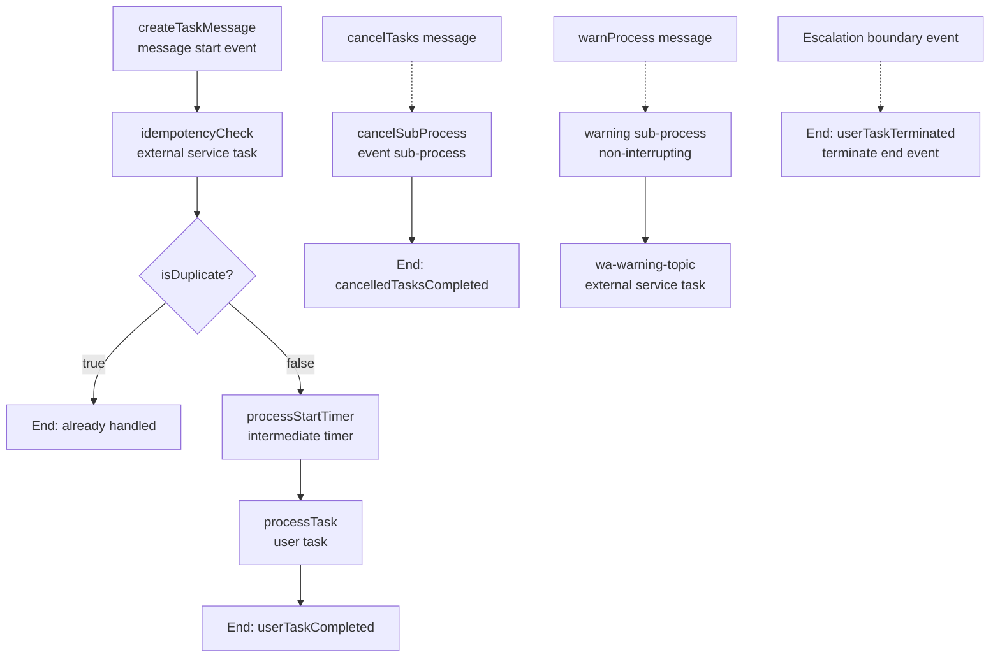

## TL;DR

- WA uses a single generic Camunda BPMN process (`wa-task-initiation-ia-asylum`) to model the lifecycle of every task across all jurisdictions -- differentiation is purely through process variables, not separate process definitions.
- Task initiation is triggered by correlating the `createTaskMessage` message with a business key and process variables; cancellation uses `cancelTasks`; warnings use `warnProcess`.
- An idempotency gate (`idempotencyCheck` external service task) prevents duplicate task creation; the worker lives in `wa-workflow-api` and writes to the `idempotent_keys` table (keyed by `idempotencyKey` + `jurisdiction`).
- An optional `delayUntil` timer allows deferred task activation -- tasks without it proceed immediately via a past-date timer trick.
- `wa-task-monitor` polls Camunda for tasks with `cftTaskState=unconfigured` and drives them through configuration via `wa-task-management-api`, which uses row-level PostgreSQL locks on `task_id` to guarantee exactly-once initiation.
- BPMN files are deployed to the shared Camunda cluster by `camunda-deployment.sh` into the **default tenant** (no tenant-id parameter); DMN evaluation uses `jurisdictionId` as tenant.

## The generic task process

The sole production BPMN is `wa-task-initiation-ia-asylum.bpmn` in `wa-standalone-task-bpmn`. Despite its `ia-asylum` suffix (a historical artifact), this process serves all jurisdictions. The process id is `wa-task-initiation-ia-asylum` with `camunda:historyTimeToLive="P90D"` controlling Camunda history retention.

The process is named "Create User Task" and was exported from Camunda Modeler 4.8.1 (`wa-standalone-task-bpmn:src/main/resources/wa-task-initiation-ia-asylum.bpmn:2-4`).

### End-to-end flow



1. **Initiation**: An external caller (typically `wa-workflow-api`) correlates the `createTaskMessage` message with a business key and all process variables. This starts a new process instance (`wa-standalone-task-bpmn:src/main/resources/wa-task-initiation-ia-asylum.bpmn:13-16`).

2. **Idempotency check**: The process enters the `idempotencyCheck` external service task (topic: `idempotencyCheck`, type: `camunda:type="external"`). The external worker in `wa-workflow-api` polls this task, examines `idempotencyKey` and `jurisdiction`, consults the `idempotent_keys` PostgreSQL table, and sets the `isDuplicate` process variable (`wa-standalone-task-bpmn:src/main/resources/wa-task-initiation-ia-asylum.bpmn:60-63`).

3. **Duplicate gate**: Exclusive gateway `Gateway_1630pti` evaluates `${isDuplicate==false}`. If true, the process terminates immediately at end event "already handled" (`wa-standalone-task-bpmn:src/main/resources/wa-task-initiation-ia-asylum.bpmn:65-79`).

4. **Delay timer**: The `processStartTimer` intermediate timer catch event uses the expression `${execution.hasVariable('delayUntil') ? delayUntil : '2000-01-01T00:00:00'}`. When `delayUntil` is absent, the past date causes Camunda to fire immediately; when present, the task remains suspended until that datetime (`wa-standalone-task-bpmn:src/main/resources/wa-task-initiation-ia-asylum.bpmn:41`).

5. **User task**: `processTask` becomes active with name `${name}` and due date `${dueDate != null ? dueDate : 'P2D'}`. This is the actual caseworker task that appears in the task list (`wa-standalone-task-bpmn:src/main/resources/wa-task-initiation-ia-asylum.bpmn:8`).

6. **Completion**: Normal task completion progresses to the `userTaskCompleted` end event.

## Message correlation

Three active messages drive process lifecycle:

| Message name | Camunda ID | Trigger | Behaviour |
|---|---|---|---|
| `createTaskMessage` | `Message_08deb9v` | Start event | Creates a new process instance; correlated by business key |
| `cancelTasks` | `Message_1k0m2ip` | Interrupting event sub-process | Terminates the running process via `cancelSubProcess` |
| `warnProcess` | `Message_0dksf5o` | Non-interrupting event sub-process | Executes `wa-warning-topic` external task concurrently |

### How correlation works

`wa-workflow-api` exposes `POST /workflow/message` which accepts a `SendMessageRequest` containing `messageName`, `processVariables`, `correlationKeys`, and an `all` flag (`wa-workflow-api:src/main/java/uk/gov/hmcts/reform/waworkflowapi/clients/model/SendMessageRequest.java`). This is forwarded verbatim to Camunda REST `POST /message` via a Feign client (`wa-workflow-api:src/main/java/uk/gov/hmcts/reform/waworkflowapi/clients/service/CamundaClient.java:34-39`).

- **Initiation** (`createTaskMessage`): `correlationKeys` is null -- Camunda starts a fresh process from the message start event. The business key scopes subsequent cancellation correlation.
- **Cancellation** (`cancelTasks`): correlated by business key to find the matching active process instance. The `cancelSubProcess` event sub-process is interrupting, which terminates all active elements in the process (`wa-standalone-task-bpmn:src/main/resources/wa-task-initiation-ia-asylum.bpmn:17-26`).
- **Warning** (`warnProcess`): triggers a non-interrupting event sub-process (`isInterrupting="false"`) that runs in parallel with the main flow. The external service task on topic `wa-warning-topic` merges warnings into the task (`wa-standalone-task-bpmn:src/main/resources/wa-task-initiation-ia-asylum.bpmn:45-59`).

If the `all: true` flag is set in `SendMessageRequest`, Camunda correlates to ALL matching process instances rather than failing on ambiguity.

### Date format for process variables

The `delayUntil` and `dueDate` process variables use ISO date format `yyyy-MM-dd'T'HH:mm:ss` (e.g. `2021-08-04T23:59`). Camunda parses these as timer expressions. The `dueDateTime` time component can be specified separately in configuration DMN output (defaults to `16:00`).
<!-- CONFLUENCE-ONLY: not verified in source -->

### Review Specific Access Request tasks

The `POST /workflow/message` endpoint also supports creating Review Specific Access Request tasks with three variants: `reviewSpecificAccessRequestJudiciary`, `reviewSpecificAccessRequestLegalOps`, `reviewSpecificAccessRequestAdmin`. These use an additional `roleAssignmentId` process variable and typically have no delay (`delayUntil` is today) with a 2-day due date.
<!-- CONFLUENCE-ONLY: not verified in source -->

### Correlation pitfalls

- Correlating `cancelTasks` after a process has already completed throws `MismatchingMessageCorrelationException`.
- Two deployments under different tenant IDs with the same process id and message name cause ambiguity unless the tenant id is explicitly specified on correlation (`wa-standalone-task-bpmn:src/test/java/uk/gov/hmcts/reform/wastandalonetaskbpmn/bpmn/CamundaCreateTaskTest.java:37-57`).

### HTTP error codes from `/workflow/message`

| Code | Description |
|---|---|
| 204 | Success (no content) |
| 400 | Bad Request -- invalid message body |
| 401 | Unauthorised -- invalid client token |
| 403 | Forbidden -- service not authorised |
| 502 | Bad Gateway -- Camunda returned invalid response |
| 503 | Service unavailable -- critical dependency down |

## Process variables

All variables are passed in the `processVariables` map when correlating `createTaskMessage`. The canonical set used in production:

| Variable | Type | Purpose |
|---|---|---|
| `taskId` | String | Task definition key (e.g. `"provideRespondentEvidence"`) |
| `taskType` | String | Task type identifier (often same as `taskId`) |
| `name` | String | Display name; interpolated into user task via `${name}` |
| `dueDate` | String (ISO datetime) | User task due date; expression defaults to `'P2D'` if null |
| `delayUntil` | String (ISO datetime) | Controls `processStartTimer`; omit for immediate activation |
| `taskState` | String | Initial state (e.g. `"configured"`) |
| `taskCategory` | String | Category (e.g. `"Case Progression"`) |
| `location` | String | Location code (e.g. `"765324"`) |
| `locationName` | String | Human-readable location (e.g. `"Taylor House"`) |
| `caseId` | String | CCD case reference |
| `jurisdiction` | String | Jurisdiction code (e.g. `"IA"`); also used as tenant ID for DMN evaluation and idempotency scoping |
| `caseTypeId` | String | CCD case type (e.g. `"Asylum"`) |
| `workingDaysAllowed` | Integer | SLA in working days |
| `idempotencyKey` | String | Seed for duplicate detection |
| `roleCategory` | String | Role category for task assignment |
| `additionalProperties` | Map (JSON) | Free-form key/value pairs stored as serialised JSON |
| `isDuplicate` | Boolean | Set by idempotency worker; gates the exclusive gateway |

Variable count is explicitly asserted in tests: 13 without `delayUntil`, 14 with (`wa-standalone-task-bpmn:src/test/java/uk/gov/hmcts/reform/wastandalonetaskbpmn/CamundaProcessEngineBaseUnitTest.java:143-146`).

## External task workers

`wa-workflow-api` hosts two Camunda External Task workers that subscribe to topics defined in the BPMN (`wa-workflow-api:src/main/java/uk/gov/hmcts/reform/waworkflowapi/clients/service/ExternalTaskWorker.java:53,67`):

### idempotencyCheck worker

- Reads `idempotencyKey` and `jurisdiction` from the external task variables.
- Looks up the `idempotent_keys` table (schema `wa_workflow_api`, columns: `idempotency_key PK, tenant_id PK, process_id, created_at, last_updated_at`). Here `tenant_id` is the `jurisdiction` value (`wa-workflow-api:src/main/java/uk/gov/hmcts/reform/waworkflowapi/clients/service/idempotency/IdempotencyTaskWorkerHandler.java:50-53`).
- If not found: inserts a new row, sets `isDuplicate=false`.
- If found with same `processId`: sets `isDuplicate=false` (same process retrying).
- If found with different `processId`: sets `isDuplicate=true` (genuine duplicate).
- If either variable is blank: logs warning and sets `isDuplicate=false` (graceful fallback for non-WA services).

Both `idempotencyKey` and `jurisdiction` are required for idempotency checks to engage. Their absence means no check is made and the task proceeds through the non-duplicate path.

There is no retry or error boundary on the `idempotencyCheck` service task in the BPMN. If the worker fails, the process waits indefinitely at that task. The worker itself retries up to 3 times before raising a Camunda incident.

### wa-warning-topic worker

- Merges `warningsToAdd` with the existing `warningList` process variable (deduplicates).
- Completes the external task with `hasWarnings=true` and the serialised `warningList` JSON.
- Propagates warnings to `wa-task-management-api` via `TaskManagementServiceApi.addTaskNote`.
- Also propagates warnings to any delayed process instances for the same `caseId` by querying Camunda and updating their `warningList` variable.

Two separate `ExternalTaskClient` instances are required to avoid a Camunda `ACT_UNIQ_AUTH_USER` duplicate-key constraint (`wa-workflow-api:src/main/java/uk/gov/hmcts/reform/waworkflowapi/clients/service/ExternalTaskWorker.java:37-41`).

## Deployment

The BPMN files are not embedded in a running Camunda engine. Instead, `camunda-deployment.sh` POSTs all `.bpmn` and `.dmn` files from `src/main/resources/` to `${CAMUNDA_URL}/deployment/create` with a `ServiceAuthorization` S2S header (`wa-standalone-task-bpmn:camunda-deployment.sh:12-18`). The Spring Boot application in `wa-standalone-task-bpmn` is purely a packaging container; the Camunda dependency exists only in test scope for unit tests with an in-memory H2 engine.

The shared Camunda cluster runs independently. WA processes are deployed to it during environment setup, and history is retained for 90 days per the `camunda:historyTimeToLive="P90D"` attribute.

### Tenant ID considerations

The BPMN deployment script does **not** pass a tenant-id parameter -- processes are deployed into the default (null) tenant. This means:

- Any team deploying a BPMN with the same message start event name into the default tenant or a different tenant can cause correlation ambiguity (this has happened in practice).
- Camunda Cockpit shows all tenants' processes to all users, creating a risk of accidental batch operations on other teams' processes.
- DMN evaluation uses `jurisdictionId` as the tenant-id (`wa-workflow-api:src/main/java/uk/gov/hmcts/reform/waworkflowapi/clients/service/CamundaClient.java:42-48`), but BPMN message correlation does not specify a tenant.

A spike (Confluence: "Spike: Camunda BPMN - Introducing a tenant id") explored migrating to a `wa` tenant-id. The recommended approach (Option 3) is to deploy a new BPMN into the `wa` tenant and let existing default-tenant processes complete over time. Since Task Monitor queries use the `cftTaskState` variable (not tenant-id) and task actions use the Camunda task id directly, most interactions work regardless of tenant.
<!-- CONFLUENCE-ONLY: not verified in source -->

## Task Monitor initiation job

After the BPMN process creates the Camunda user task (`processTask`), the task enters an `unconfigured` state (set via the `cftTaskState` process variable). The `wa-task-monitor` INITIATION job picks it up:

1. **Poll**: Queries Camunda for tasks with `cftTaskState=unconfigured`, filtered by `camunda-time-limit` (default: 120 minutes lookback) and capped at `camunda-max-results` (default: 100) (`wa-task-monitor:src/main/resources/application.yaml:100-104`).
2. **Retrieve variables**: For each task, retrieves all Camunda process/task variables.
3. **Initiate**: Calls `wa-task-management-api` `POST /task/{task-id}/initiation` with the mapped attributes.
4. **Configure**: Task Management API evaluates the Configuration DMN, populates mandatory fields (applying defaults where needed), validates, and inserts the task into `cft_task_db`.

The `wa-task-batch-service` CronJob (`wa-task-batch-initiation-job`) triggers this on a configured schedule by calling the Task Monitor API. CronJob schedules are configured in `cnp-flux-config` and run on both production clusters.

### Task Monitor job types

The `JobName` enum (`wa-task-monitor:src/main/java/uk/gov/hmcts/reform/wataskmonitor/domain/taskmonitor/JobName.java`) defines all scheduled jobs:

| Job | Purpose |
|---|---|
| `INITIATION` | Poll Camunda for unconfigured tasks and initiate them |
| `TERMINATION` | Detect terminated Camunda processes and update CFT Task DB |
| `RECONFIGURATION` | Reconfigure tasks after `reconfigure_request_time_hours` (default: 2h) |
| `MAINTENANCE_CAMUNDA_TASK_CLEAN_UP` | Clean up old Camunda processes (AAT/local only) |
| `TASK_INITIATION_FAILURES` | Alert on tasks that failed initiation |
| `TASK_TERMINATION_FAILURES` | Alert on tasks that failed termination |
| `RECONFIGURATION_FAILURES` | Alert on tasks that failed reconfiguration |
| `UPDATE_SEARCH_INDEX` | Refresh search index |
| `CLEANUP_SENSITIVE_LOG_ENTRIES` | Remove sensitive log data |
| `PERFORM_REPLICATION_CHECK` | Verify DB replication health |

### Configuration parameters

| Parameter | Default | Purpose |
|---|---|---|
| `job.initiation.camunda-max-results` | 100 | Max tasks retrieved per initiation run |
| `job.initiation.camunda-time-limit-flag` | true | Whether to apply time window filter |
| `job.initiation.camunda-time-limit` | 120 (minutes) | How far back to look for unconfigured tasks |
| `job.configuration.camunda-max-results` | 100 | Max tasks for configuration job |
| `job.configuration.camunda-time-limit` | 60 (minutes) | Configuration lookback window |
| `job.termination.camunda-max-results` | 100 | Max tasks for termination job |
| `job.termination.camunda-time-limit` | 120 (minutes) | Termination lookback window |
| `job.reconfiguration.reconfigure_request_time_hours` | 2 | Hours before reconfiguration triggers |

## Task configuration attributes and defaults

When `wa-task-management-api` receives an initiation request, it evaluates the service team's Configuration DMN with all Camunda variables as inputs. Key mandatory output fields with their defaults:

| Attribute | Mandatory | Default | Notes |
|---|---|---|---|
| `title` | yes | Falls back to `task_name` | Display title shown to users |
| `dueDate` | yes | Current date + 2 days | Can be overridden by date calculation rules |
| `priorityDate` | yes | Set to `dueDate` | Used for prioritisation |
| `majorPriority` | yes | 5000 | Coarse priority bucket |
| `minorPriority` | yes | 500 | Fine priority within bucket |
| `securityClassification` | yes | `PUBLIC` | |
| `executionTypeCode` | yes | `MANUAL` | |
| `taskSystem` | no | `SELF` | |
| `workType` | yes | -- | Must be provided by DMN |
| `roleCategory` | yes | -- | Must be provided by DMN |
| `region` | yes | -- | Must be provided by DMN |
| `location` | yes | -- | Must be provided by DMN |
| `caseName` | yes | -- | Must be provided by DMN |
| `caseManagementCategory` | yes | -- | Must be provided by DMN |

During reconfiguration, only fields with `canReconfigure=true` in the DMN output are updated. Camunda variables are **not** available during reconfiguration -- only the persisted task record attributes are passed as inputs to the DMN.
<!-- CONFLUENCE-ONLY: not verified in source -->

## Concurrency and exactly-once initiation

The `wa-task-management-api` guarantees exactly-once task initiation using PostgreSQL row-level locking on the `task_id` primary key in the `tasks` table:

1. Insert a skeleton task record (not committed), acquiring a row-level lock.
2. Subsequent threads attempting to insert the same `task_id` wait for the first transaction to commit or rollback.
3. If the first transaction commits successfully, subsequent inserts hit a unique constraint violation and return a conflict response.
4. If the first transaction rolls back (e.g. downstream failure), the next waiting thread can proceed.

The transaction may be held for up to ~90 seconds in worst case (calls to CCD, Camunda x2, and Role Assignment with retries). This is acceptable because row-level locks only affect concurrent requests for the same `task_id`, which is a small proportion of total traffic.
<!-- CONFLUENCE-ONLY: not verified in source -->

## Initial assignee at initiation

Service teams can optionally specify an assignee at task initiation time via the `initialAssignee` DMN output variable. The flow:

1. Service team CCD callback sets a field in case data containing the IDAM user ID.
2. The field is published as additional data in CCD Case Event messages.
3. `wa-case-event-handler` passes additional data to the Initiation DMN.
4. The Initiation DMN outputs `initialAssignee` which becomes a Camunda process variable.
5. During configuration, `wa-task-management-api` validates the proposed assignee has `OWN` or `EXECUTE` permissions via Role Assignment checks.
6. If valid: the task is created in `assigned` state with the specified assignee.
7. If invalid: falls back to the standard auto-assignment process.

If no `initialAssignee` is provided, the existing auto-assignment process runs (matching users with appropriate case roles).
<!-- CONFLUENCE-ONLY: not verified in source -->

## Escalation and termination

Two escalation definitions exist in the BPMN:

- `Escalation_0q8q2uv` ("escalateCancellation")
- `Escalation_0sj9fef` ("Escalation_Cancel_Task", code `cTasks`)

A boundary escalation event `Event_0pjf0p1` on `processTask` catches escalations and routes to the `userTaskTerminated` terminate end event. The escalation code variable is `wa-esc-cancellation` (`wa-standalone-task-bpmn:src/main/resources/wa-task-initiation-ia-asylum.bpmn:29`). This provides an alternative termination path to message-based cancellation.

## Reconfiguration

Reconfiguration is not modelled as a separate BPMN flow. The `wa-task-monitor` RECONFIGURATION job detects tasks requiring reconfiguration (after `reconfigure_request_time_hours`, default 2 hours) and triggers configuration via `wa-task-management-api`. The BPMN process itself is not involved in reconfiguration -- the task record in the WA task database is updated directly while the Camunda user task remains active.

During reconfiguration, the Configuration DMN receives task attributes from the database (not from Camunda). The `canReconfigure` flag on each DMN output controls which fields can be updated. A field explicitly set to null or empty during reconfiguration will overwrite the existing value (potentially removing an assignee or clearing a title back to its default).

## Operational support

### Camunda Cockpit

Production Cockpit: `https://camunda-bpm.platform.hmcts.net/` -- developers use HMCTS account credentials to view processes, tasks, and variables for debugging.

### Alert CronJobs

| Job | Purpose |
|---|---|
| `wa-task-batch-initiation-failure-job` | Alerts when tasks fail to initiate |
| `wa-task-batch-termination-failure-job` | Alerts when tasks fail to terminate |

When an alert fires, investigate by:
1. Find the task IDs in the alert message.
2. Check Camunda Cockpit for the task's variables and state.
3. Correlate with Azure AppInsights logs for the processing steps.
4. Check the CFT Task DB for the task record.

### Disabling time limits

Setting `camunda-time-limit-flag=false` removes the time window filter, causing the job to look for ALL unconfigured/unterminated tasks regardless of creation time. This is useful when recovering from an outage where tasks may have been unconfigured for longer than the default window.

## Examples

### BPMN process skeleton

The complete generic task process. All jurisdictions use this single BPMN; differentiation happens through process variables only.

```xml
// Source: apps/wa/wa-standalone-task-bpmn/src/main/resources/wa-task-initiation-ia-asylum.bpmn
<bpmn:process id="wa-task-initiation-ia-asylum" name="Create User Task"
              isExecutable="true" camunda:historyTimeToLive="P90D">

  <!-- Main flow: createTaskMessage → idempotencyCheck → timer → processTask -->
  <bpmn:userTask id="processTask" name="${name}"
                 camunda:dueDate="${dueDate != null ? dueDate : 'P2D'}">
    <bpmn:incoming>Flow_0mvvsq2</bpmn:incoming>
    <bpmn:outgoing>Flow_1t5gjw4</bpmn:outgoing>
  </bpmn:userTask>

  <!-- Delay timer: past-date forces immediate fire when delayUntil absent -->
  <bpmn:intermediateCatchEvent id="processStartTimer" name="Process start timer">
    <bpmn:timerEventDefinition>
      <bpmn:timeDate xsi:type="bpmn:tFormalExpression">
        ${execution.hasVariable('delayUntil') ? delayUntil : '2000-01-01T00:00:00'}
      </bpmn:timeDate>
    </bpmn:timerEventDefinition>
  </bpmn:intermediateCatchEvent>

  <!-- Idempotency gate: prevents duplicate task creation -->
  <bpmn:serviceTask id="idempotencyCheck" name="Idempotency Check"
                    camunda:type="external" camunda:topic="idempotencyCheck">
  </bpmn:serviceTask>
  <bpmn:exclusiveGateway id="Gateway_1630pti" name="isDuplicate?">
    <bpmn:outgoing>Flow_078o46j</bpmn:outgoing>  <!-- no: proceed -->
    <bpmn:outgoing>Flow_05z430k</bpmn:outgoing>  <!-- yes: terminate -->
  </bpmn:exclusiveGateway>
  <bpmn:sequenceFlow id="Flow_078o46j" name="no" sourceRef="Gateway_1630pti"
                     targetRef="processStartTimer">
    <bpmn:conditionExpression>${isDuplicate==false}</bpmn:conditionExpression>
  </bpmn:sequenceFlow>

  <!-- Cancellation sub-process: interrupting, ends the main flow -->
  <bpmn:subProcess id="cancelSubProcess" triggeredByEvent="true">
    <bpmn:startEvent id="cancelTasks" name="Cancel Process">
      <bpmn:messageEventDefinition messageRef="Message_1k0m2ip" />
    </bpmn:startEvent>
  </bpmn:subProcess>

  <!-- Warning sub-process: non-interrupting, runs concurrently -->
  <bpmn:subProcess triggeredByEvent="true">
    <bpmn:startEvent id="Event_0piep6v" name="Warning Process" isInterrupting="false">
      <bpmn:messageEventDefinition messageRef="Message_0dksf5o" />
    </bpmn:startEvent>
    <bpmn:serviceTask name="Warning Topic" camunda:type="external"
                      camunda:topic="wa-warning-topic">
    </bpmn:serviceTask>
  </bpmn:subProcess>

</bpmn:process>

<!-- Message and escalation definitions -->
<bpmn:message id="Message_08deb9v" name="createTaskMessage" />
<bpmn:message id="Message_1k0m2ip" name="cancelTasks" />
<bpmn:message id="Message_0dksf5o" name="warnProcess" />
<bpmn:escalation id="Escalation_0q8q2uv" name="escalateCancellation" />
```

### Message correlation request (`POST /workflow/message`)

The `SendMessageRequest` shape sent by `wa-case-event-handler` to `wa-workflow-api` to start a process instance:

```java
// Source: apps/wa/wa-workflow-api/src/main/java/uk/gov/hmcts/reform/waworkflowapi/clients/model/SendMessageRequest.java
public class SendMessageRequest {
    private final String messageName;          // e.g. "createTaskMessage", "cancelTasks", "warnProcess"
    private final Map<String, DmnValue<?>> processVariables;  // task attributes as Camunda-typed values
    private final Map<String, DmnValue<?>> correlationKeys;   // null for initiation; {caseId,...} for cancel/warn
    private final boolean all;                 // true = correlate to ALL matching instances
}
```

Initiation example (initiation has no `correlationKeys`):

```json
// Source: apps/wa/wa-workflow-api/src/main/java/uk/gov/hmcts/reform/waworkflowapi/clients/service/CamundaClient.java
// POST ${camunda.url}/message
{
  "messageName": "createTaskMessage",
  "processVariables": {
    "taskId":            { "value": "reviewAppealSkeletonArgument", "type": "String" },
    "name":              { "value": "Review Appeal Skeleton Argument", "type": "String" },
    "caseId":            { "value": "1234567890123456", "type": "String" },
    "jurisdiction":      { "value": "ia", "type": "String" },
    "caseTypeId":        { "value": "asylum", "type": "String" },
    "taskState":         { "value": "unconfigured", "type": "String" },
    "dueDate":           { "value": "2026-05-15T16:00:00", "type": "String" },
    "delayUntil":        { "value": "2026-05-13T00:00:00", "type": "String" },
    "workingDaysAllowed":{ "value": 2, "type": "Integer" },
    "idempotencyKey":    { "value": "A1B2C3D4...", "type": "String" },
    "__processCategory__caseProgression": { "value": true, "type": "Boolean" }
  }
}
```

Cancellation example (correlated by `caseId`; `all=true` targets all matching instances):

```json
// Source: apps/wa/wa-workflow-api/src/main/java/uk/gov/hmcts/reform/waworkflowapi/clients/service/CamundaClient.java
// POST ${camunda.url}/message
{
  "messageName": "cancelTasks",
  "correlationKeys": {
    "caseId": { "value": "1234567890123456", "type": "String" },
    "__processCategory__caseProgression": { "value": true, "type": "Boolean" }
  },
  "processVariables": {
    "cancellationProcess": { "value": "CASE_EVENT_CANCELLATION", "type": "String" }
  },
  "all": true
}
```

### Task Monitor job configuration

```yaml
// Source: apps/wa/wa-task-monitor/src/main/resources/application.yaml
job:
  initiation:
    camunda-max-results: ${INITIATION_CAMUNDA_MAX_RESULTS:100}
    camunda-time-limit-flag: ${INITIATION_TIME_LIMIT_FLAG:true}
    camunda-time-limit: ${INITIATION_TIME_LIMIT:120}          # minutes lookback
  termination:
    camunda-max-results: ${TERMINATION_CAMUNDA_MAX_RESULTS:100}
    camunda-time-limit-flag: ${TERMINATION_TIME_LIMIT_FLAG:true}
    camunda-time-limit: ${TERMINATION_TIME_LIMIT:120}
  reconfiguration:
    reconfigure_request_time_hours: ${RECONFIGURE_REQUEST_TIME_HOURS:2}
    reconfiguration_max_time_limit_seconds: ${RECONFIGURATION_MAX_TIME_LIMIT_SECONDS:120}
```

### BPMN deployment script

```bash
// Source: apps/wa/wa-task-configuration-template/camunda-deployment.sh
PRODUCT="wa"
TENANT_ID="wa"     # override to your jurisdiction slug in derived repos (e.g. "ia", "civil")

for file in $BASEDIR/src/main/resources/*.bpmn $BASEDIR/src/main/resources/*.dmn; do
  if [ -f "$file" ]; then
    curl --silent --show-error ${CAMUNDA_URL}/deployment/create \
      -H 'Content-Type: multipart/form-data' \
      -H "ServiceAuthorization: ${SERVICE_TOKEN}" \
      -F "deployment-source=$PRODUCT" \
      -F "tenant-id=$TENANT_ID" \
      -F data=@$file
  fi
done
```

## See also

- [API: Workflow](../reference/api-workflow.md) — `wa-workflow-api` endpoint reference, including external task worker configuration
- [DMN Task Configuration](dmn-task-configuration.md) — explanation of the DMN tables that drive task creation and configuration
- [Task Lifecycle](task-lifecycle.md) — how CFT task states relate to Camunda process states; the dual-state model
- [Case Event Handler](case-event-handler.md) — the service that sends `createTaskMessage` and `cancelTasks` to this BPMN
- [How-to: Debug Stuck Tasks](../how-to/debug-stuck-tasks.md) — what to do when tasks remain `UNCONFIGURED` after the BPMN process starts
